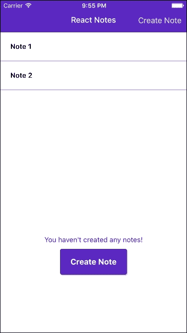
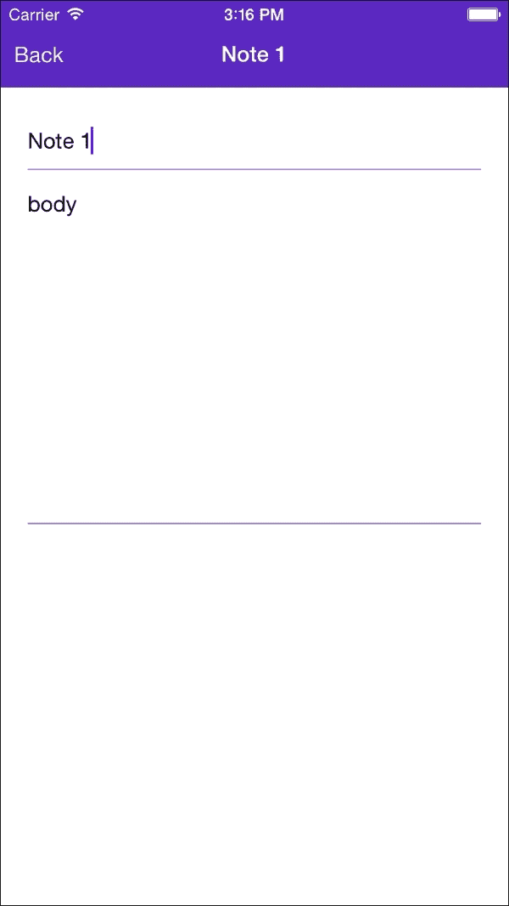
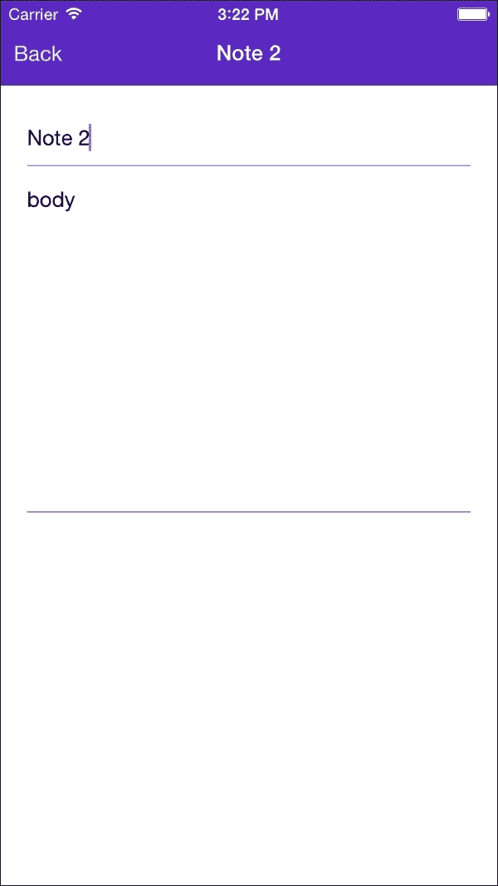
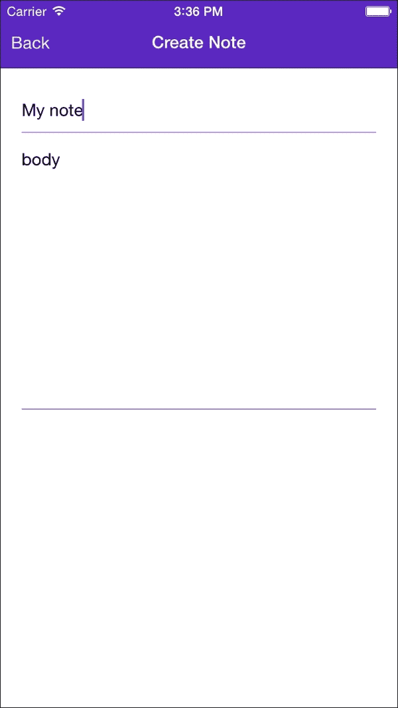
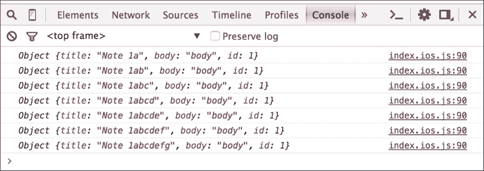
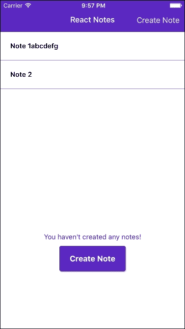
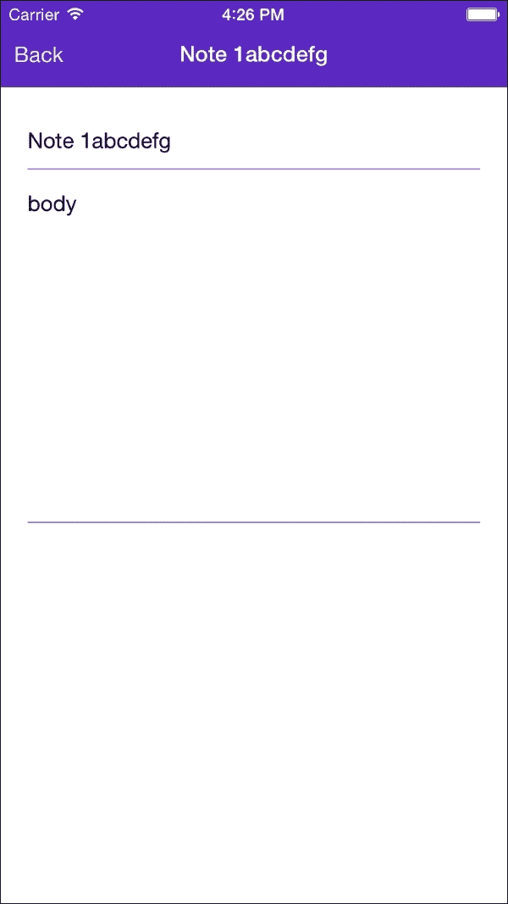
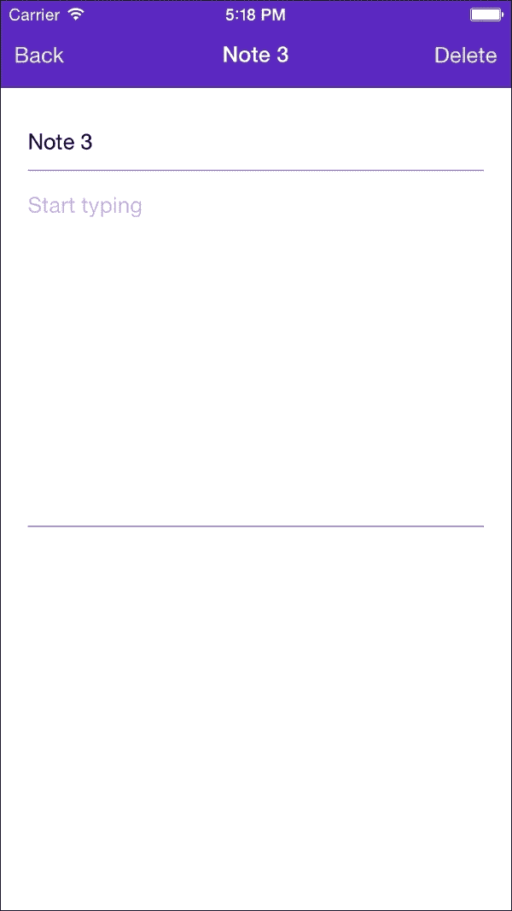

# 第五章。显示和保存数据

现在我们已经知道了如何为 React Native 应用程序设置样式，让我们来看看如何让它真正做些事情。在本章中，我们将开始将笔记保存到设备上，用我们保存的笔记填充列表，并从列表中选择笔记以查看和编辑。

在本章中，我们将涵盖以下主题：

+   使用 `ListView` 显示数据行

+   状态管理

+   使用 props 将数据和回调传递到组件中

+   使用 `AsyncStorage` 在 iOS 和 Android 设备上存储数据

本章的策略是首先使用虚拟数据构建基本功能，这样我们就可以在学习如何使用 `AsyncStorage` API 保存和加载数据之前学习一些基本技能。到本章结束时，您将拥有一个完全功能的笔记应用程序！

# 列表

我们应用程序的 `HomeScreen` 将显示我们已保存的笔记列表。为此，我们将引入 `ListView` 组件。让我们首先在我们的 `Components` 目录中创建一个名为 `NoteList` 的新文件，并添加以下代码：

```js
import React, {
  StyleSheet,
  Text,
  View,
  ListView
  } from 'react-native';

export default class NoteList extends React.Component {

  constructor (props) {
    super(props);
    this.ds = new ListView.DataSource({rowHasChanged: (r1, r2) => r1 !== r2});
  }

  render() {
    return (
      <ListView
        dataSource={
          this.ds.cloneWithRows( [
              {title:"Note 1", body:"Body 1", id:1}, 
              {title:"Note 2", body:"Body 2", id:2}
            ])
        }
        renderRow={(rowData) => {
              return (
                 <Text>{rowData.title}</Text>
              )
            }
          }/>
      )
  }
}
```

`ListView` 组件使用起来相当简单。您必须提供两块信息，一个是提供所有行数据的 `dataSource`，另一个是 `renderRow` 函数，它是一个简单的函数，接受每一行的数据（一个单独的笔记）并返回一个 React 组件。在上面的示例中，这个函数返回一个 `<Text/>` 组件，用于显示笔记的标题。

我们实例化一个 `ListView`。`DataSource` 在构造函数中，因为我们只想创建一次。`DataSource` 构造函数接受一个 `params` 对象来配置 `DataSource`；然而，唯一必需的参数是一个 `rowHasChanged` 函数。当 `DataSource` 收到新数据时，该函数被 `DataSource` 使用，以便它可以有效地确定哪些行需要重新渲染。如果 `r1` 和 `r2` 指向同一个对象，则行没有变化。

您还会注意到我们没有直接将 `DataSource` 引用传递给我们的 `ListView`。相反，我们使用 `cloneWithRows()`，将其传递给我们要使用的 `rowData`。目前我们正在硬编码行数据，但到本章结束时，您将知道如何使用新数据更新 `ListView`。

接下来，让我们将 `NoteList` 组件添加到 `HomeScreen` 中，并学习如何响应对每一行的触摸事件。打开 `HomeScreen` 组件，并添加以下行以导入您的新 `NoteList` 组件：

```js
import NoteList from './NoteList';
```

此外，让我们将 `NoteList` 组件放入 `HomeScreen` 的 `render` 方法中，在 `View` 组件内，在 `<Text/>` 组件之前：

```js
render () {
    return (
      <View style={styles.container}>
        <NoteList/>
        <Text style={styles.noNotesText}>You haven't created any notes!</Text>

        <SimpleButton
          onPress={() => this.props.navigator.push({
            name: 'createNote'
          })}
          customText="Create Note"
          style={styles.simpleButton}
          textStyle={styles.simpleButtonText}
        />
      </View>
    );
  }
```

在我们尝试 `NoteList` 之前，让我们修改我们的样式以确保列表内容不会被 `NavigationBar` 遮挡：

```js
  container: {
    flex: 1,
    justifyContent: 'center',
    alignItems: 'center',
    marginTop: 60
  }
```

现在，当您重新加载应用程序时，您应该看到以下截图：



屏幕底部仍然显示着**您还没有创建任何笔记**的消息，但我们将学习如何在章节的后面处理这个问题。

现在我们有一个项目列表，我们希望当用户触摸其中一个项目时能够做出响应。为了做到这一点，我们将使用`TouchableHighlight`组件包裹我们的`renderRow`函数中的`<Text/>`组件。首先，让我们将`TouchableHighlight`添加到我们的导入列表中：

```js
import React, {
  StyleSheet,
  Text,
  View,
  ListView,
  TouchableHighlight
  } from 'react-native';
```

然后更新我们的`ListView`中的`renderRow`函数：

```js
renderRow={
  (rowData) => {
    return (
      <TouchableHighlight onPress={() => console.log(rowData)}>
         <Text>{rowData.title}</Text>
      </TouchableHighlight>
    )
}
```

现在，你可以重新加载应用程序并触摸每一行，以查看`rowData`已经被记录到控制台。

我们的目的是能够触摸一行，导航到`NoteScreen`，并使用该行的数据填充标题和正文。让我们给我们的`NoteList`组件添加一个`_onPress`事件处理程序，如下所示：

```js
_onPress (rowData) {
  this.props.navigator.push(
    {
      name: 'createNote',
      note: {
        id: rowData.id,
        title: rowData.title,
        body: rowData.body
      }
    });
  }
```

我们将从这个`TouchableHighlight`函数中调用这个函数，如下所示：

```js
                <TouchableHighlight onPress={() => this._onPress(rowData)}>
                  <Text>{rowData.title}</Text>
                </TouchableHighlight>
```

在我们尝试这个功能之前，看看`_onPress`处理程序，并注意我们正在引用`this.props.navigator`。这是我们用来在`HomeScreen`和`NoteScreen`之间来回导航的导航器，但这个 props 业务是什么意思呢？

## 理解 props

如果你看看`NoteList`的构造函数，你会注意到它接受一个名为**props**的参数：

```js
export default class NoteList extends React.Component {
  constructor (props) {
    super(props);
    this.ds = new ListView.DataSource({rowHasChanged: (r1, r2) => r1 !== r2});
  }
```

Props 是我们用来向 React 组件传递数据的机制。在我们的例子中，我们想从`HomeScreen`组件传递一个导航器引用到`NoteList`，所以让我们快速修改一下我们的`NoteList`声明，如下所示：

```js
export default class HomeScreen extends React.Component {
  render () {
    return (
      <View style={styles.container}>
        <NoteList navigator={this.props.navigator}/>
       ...
      </View>
    );
  }
}
```

当你在`NoteList`中触摸一行时，你将把与该行相关的笔记数据推送到导航器，然后触发`renderScene`，将笔记传递给`NoteScreen`。那么我们如何在`NoteScreen`中使用这个笔记呢？我们之前了解到 props 被传递到组件的构造函数中，但我们如何实际上让我们的`TextInput`组件显示笔记的标题和正文呢？让我们看看如果我们将每个输入的值属性绑定到传入的笔记会发生什么，如下所示：

```js
        <View style={styles.inputContainer}>
          <TextInput
            autoFocus={true}
            autoCapitalize="sentences"
            placeholder="Untitled"
            style={[styles.textInput, styles.title]}
            onEndEditing={(text) => {this.refs.body.focus()}}
            underlineColorAndroid="transparent"
            value={this.props.note.title}
          />
        </View>
        <View style={styles.inputContainer}>
          <TextInput
            ref="body"
            multiline={true}
            placeholder="Start typing"
            style={[styles.textInput, styles.body]}
            textAlignVertical="top"
            underlineColorAndroid="transparent"
            value={this.props.note.body}
          />
        </View>
```

现在我们重新加载应用程序并触摸列表中的第一个笔记时，我们将看到以下截图：



但当你尝试编辑标题或正文时会发生什么？什么都没有发生！在我们诊断出问题之前，让我们点击**返回**按钮并触摸`NoteList`中的第二个笔记。你会看到它被显示出来，如下所示：



好吧，所以我们的 `NoteScreen` 确实更新了，但只是在从外部传递新的 props 时，而不是在我们尝试编辑 `TextInputs` 时。Props 只能从组件外部传递。虽然这样做可能很有吸引力，但在每个 `TextInput` 的值改变时尝试在 `NoteScreen` 内部修改 `this.props.note` 是一个坏主意。我们需要的是一种方式来管理用户更改 `TextInputs` 时对 `NoteScreen` 内部状态的更改。为此，每个 React 组件都有一个叫做 **状态** 的东西。

### 使用状态

React 组件有一个内置的变量叫做 `state`，你可以用它来跟踪组件的 `state`。在上面的例子中，我们知道我们正在传递一个我们想要显示的笔记，因此组件的初始状态由那个笔记表示。让我们做一些完全疯狂的事情，修改 `NoteScreen` 构造函数，如下所示：

```js
  constructor (props) {
    super(props)
    this.state = {note:this.props.note};
  }
```

因此，`this.state` 是一个具有标题和正文属性的初始设置为传递的笔记标题和正文的对象。为什么会有对 *super (props)* 的调用？我们的 `NoteScreen` 的超类是 `React.Component`，它将 props 作为参数并设置 `this.props`。如果我们省略 `NoteScreen` 中的 `super(props)`，那么 `this.props` 将是未定义的。

你可能已经猜到了，我们将更新 `TextInputs` 以分别绑定到 `this.state.title` 和 `this.state.body`，但我们还将监听每个输入的 `onChangeText` 事件：

```js
        <View style={styles.inputContainer}>
          <TextInput
            ref="title"
            autoFocus={true}
            autoCapitalize="sentences"
            placeholder="Untitled"
            style={[styles.textInput, styles.title]}
            onEndEditing={(text) => {this.refs.body.focus()}}
            underlineColorAndroid="transparent"
            value={this.state.note.title}
            onChangeText={(title) => {this.setState({title})}}
          />
        </View>
        <View style={styles.inputContainer}>
          <TextInput
            ref="body"
            multiline={true}
            placeholder="Start typing"
            style={[styles.textInput, styles.body]}
            textAlignVertical="top"
            underlineColorAndroid="transparent"
            value={this.state.body}
            onChangeText={(body) => {this.setState({body})}}
          />
        </View>
```

注意，我们用来处理 `onChangeText` 事件的箭头函数正在调用 `this.setState(...)` 而不是直接设置 `this.state.title`。这是一个重要的事情要记住。每次修改状态时，你必须使用 `this.setState()`，这样 React 就知道你的组件需要重新渲染。出于性能原因，调用 `setState()` 并不会立即更新 `this.state`，所以不要因此困惑！

重新加载应用程序，触摸列表中的 **笔记 1**，然后将标题更改为 **我的笔记**：



`TextInput` 属性现在在每次调用 `render()` 时都会反映 `this.state.title` 的值，这发生在每次调用 `this.setState({title})` 之后。到目前为止一切顺利，但当你导航回 `HomeScreen` 时，你认为我们会看到什么？点击 **返回** 按钮看看——第一个笔记的标题仍然是 **笔记 1** 而不是 **我的笔记**。现在，当你点击 **笔记 1** 返回到 `NoteScreen` 时，你会看到你的更改已经消失了。让我们来修复这个问题！

我们刚刚确定了在笔记更改时需要更新我们的 `ListView`。我们知道当我们在 `TextInput` 组件中输入时，`NoteScreen` 的内部状态会发生变化，但我们如何将这些更改传达给应用程序的其他部分？

### 在 props 中传递回调

在 React 中，一个常见的模式是通过 props 将回调传递给组件。在我们的情况下，我们想要将一个回调传递给我们的 `NoteScreen`，以便它能够让我们知道笔记何时被更改。让我们回到我们的 `index.ios.js` 或 `index.android.js` 文件中的 `ReactNotes` 组件，并更新我们的 `renderScene` 函数，如下所示：

```js
  renderScene (route, navigator) {
    switch (route.name) {
      case 'home':
        return (
          <HomeScreen navigator={navigator} />
        );
      case 'createNote':
        return (
          <NoteScreen 
            note={route.note} 
            onChangeNote={(note) => console.log("note changed", note)}/>
        );
    }
  }
```

在这里，我们定义了一个名为 `onChangeNote` 的属性，并将其值设置为当我们在 `NoteScreen` 组件内部调用 `onChangeNote` 时将被调用的箭头函数。所以，在我们的 `NoteScreen` 代码内部，我们将添加以下行：

```js
this.props.onChangeNote(note);
```

让我们回顾一下 `NoteScreen` 和一个用于更新笔记的函数：

```js
class NoteScreen extends React.Component {
  …
  updateNote(title, body) {
    var note = Object.assign(this.state.note, {title:title, body:body});
    this.props.onChangeNote(note);
    this.setState(note);
  }
  …
}
```

在我们的标题 `TextInput` 中，更新 `onChangeText` 函数，如下所示：

```js
onChangeText={(title) => this.updateNote(title, this.state.note.body)}
```

并且在 `TextInput` 的主体中：

```js
onChangeText={(body) => this.updateNote(this.state.note.title, body)}
```

现在，让我们重新加载我们的应用程序，触摸**笔记 1**，并开始进行更改。如果你查看控制台，你应该会看到每次更改都被记录下来：



仅通过通知笔记的更改，我们只完成了更新 `ListView` 目标的一半。回想一下，我们的 `NoteList` 组件的 `dataSource` 目前只是一个硬编码的笔记数组：

```js
  <ListView
        dataSource={
          this.ds.cloneWithRows([
            { title:"Note 1", body:"body", id:1}, 
            {title:"Note 2", body:"body", id:2}
          ])
        }
        renderRow={(rowData) => {
              return (
                <TouchableHighlight onPress={() => this._onPress(rowData)}>
                  <Text>{rowData.title}</Text>
                </TouchableHighlight>
              )
            }
          }
/>
```

我们需要能够将笔记列表传递给 `NoteList` 组件而不是硬编码它们。现在，由于你已经熟悉了 props，你知道我们可以从 `HomeScreen` 中传递列表，如下所示：

```js
export default class HomeScreen extends React.Component {
  render () {
    return (
      <View style={styles.container}>
        <NoteList 
          navigator={this.props.navigator} 
           notes={[{title:"Note 1", body:"body", id:1}, {title:"Note 2", body:"body", id:2}]}
       />
  …
}
```

然后修改 `NoteList` 组件以在 `dataSource` 中使用 `this.props.notes`：

```js
export default class NoteList extends React.Component {
...
  render() {
    return (
      <ListView
        dataSource={this.ds.cloneWithRows(this.props.notes)}
        ...
        />
      )
  }
}
```

让我们把重构再进一步。我们并不想让 `HomeScreen` 负责管理笔记列表的状态，这是一个顶级组件 `ReactNotes` 的工作。我们可以重复我们刚刚使用的技巧，并用 `this.props.notes` 替换 `HomeScreen` 中的硬编码的笔记数组：

```js
export default class HomeScreen extends React.Component {
  render () {
    return (
      <View style={styles.container}>
        <NoteList navigator={this.props.navigator} notes={this.props.notes}/>
      ...
     </View>
    );
  }
}
```

在我们的 `ReactNotes` 组件中，我们可以使用 props 将笔记传递给 `HomeScreen`：

```js
class ReactNotes extends React.Component {
  renderScene (route, navigator) {
    switch (route.name) {
      case 'home':
        return (
          <HomeScreen navigator={navigator} 
          notes={[{title:"Note 1", body:"body", id:1}, {title:"Note 2", body:"body", id:2}]}/>
        );
      case 'createNote':
        return (
          <NoteScreen note={route.note} onChangeNote={(note) => console.log("note changed", note)}/>
        );
    }
  }
  …
}
```

你可能会感觉到我们正越来越接近我们的目标，即能够修改笔记并在 `ListView` 中看到更改。我们笔记的来源现在与知道用户在 `NoteScreen` 上修改了笔记的事件处理程序非常接近。我们真正讨论的是管理我们应用程序的状态。

`ReactNotes` 组件是负责管理应用程序状态的最高级组件，该状态完全由笔记组成。所以，让我们正式一下，将笔记数组移动到组件的初始状态中：

```js
class ReactNotes extends React.Component {
  constructor(props) {
    super(props);
    this.state = {
      notes: [{title: "Note 1", body: "body", id: 1}, {title: "Note 2", body: "body", id: 2}]};
  }
  renderScene(route, navigator) {
    switch (route.name) {
      case 'home':
        return (
          <HomeScreen navigator={navigator} notes={this.state.notes}/>
        );
      case 'createNote':
        return (
          <NoteScreen note={route.note} onChangeNote={(note) => console.log("note changed", note)}/>
        );
    }
  }

  ...
}
```

将笔记存储在数组中使得更新特定笔记变得有些棘手；让我们快速重构，使用对象而不是数组，如下所示：

```js
class ReactNotes extends React.Component {

  constructor(props) {
    super(props);
    this.state = {
      selectedNote: {title:"", body:""},
      notes: {
        1: {title: "Note 1", body: "body", id: 1},
        2: {title: "Note 2", body: "body", id: 2}
      }
    }
  }
…
}
```

现在，`notes` 是一个对象，其中的键对应于笔记的 `ids`。由于 `NoteList` 组件仍然期望一个数组，让我们使用 `underscore.js` 来进行转换：

```js
<HomeScreen navigator={navigator} notes={_(this.state.notes).toArray()} />
```

`NoteList` 应该继续以之前的方式工作；我们只是以不同的方式跟踪我们的笔记。

这里是我们需要为`onChangeNote`处理程序所做的更改，以便实际上通过状态更新笔记：

```js
class ReactNotes extends React.Component {
  ...
  updateNote(note) {
    var newNotes = Object.assign({}, this.state.notes);
    newNotes[note.id] = note;
    this.setState({notes:newNotes});
  }

  renderScene(route, navigator) {
    switch (route.name) {
      case 'createNote':

        return (
          <NoteScreen note={this.state.selectedNote} onChangeNote={(note) => this.updateNote(note)}/>
        );
    }
  }
...
}
```

让我们逐步分析`updateNote`函数，以了解发生了什么。首先，我们使用`Object.assign()`创建`this.state.notes`的一个副本。每次你在状态对象中处理嵌套数据时，我们都建议创建这样的副本，以避免意外的行为。React 通过比较两个对象来确定组件的状态是否已更改，需要重新渲染；因此，使用这样的副本确保旧状态和新状态指向不同的对象。然后，我们使用`note.id`作为键将我们的修改后的笔记放入`newNotes`中。最后，我们调用`setState()`来用新的副本替换整个笔记对象。

在我们可以尝试我们的手艺之前，我们还有一些重构要做。现在我们知道如何通过 props 将回调传递给我们的组件，我们可以消除将导航器传递给`HomeScreen`和`NoteList`组件的需要，而是传递一个回调，这样`NoteList`就可以告诉我们用户是否已选择了一个笔记：

```js
class ReactNotes extends React.Component {
  renderScene(route, navigator) {
    switch (route.name) {
      case 'home':
        return (<HomeScreen navigator={navigator} notes={_(this.state.notes).toArray()} onSelectNote={(note) => navigator.push({name:"createNote", note: note})}/>);
      case 'createNote':
      return (
          <NoteScreen note={route.note} onChangeNote={(note) => this.updateNote(note)}/>
        );
    }
  }
```

这意味着我们必须更新我们的`HomeScreen`，将`onSelectNote`回调传递给`NoteList`：

```js
export default class HomeScreen extends React.Component {
  render () {
    return (
      <View style={styles.container}>
        <NoteList notes={this.props.notes} onSelectNote={this.props.onSelectNote}/>
        <Text style={styles.noNotesText}>You haven't created any notes!</Text>
        <SimpleButton
          onPress={() => this.props.navigator.push({
            name: 'createNote'
          })}
          customText="Create Note"
          style={styles.simpleButton}
          textStyle={styles.simpleButtonText}
        />
      </View>
    );
  }
}
```

此外，我们还需要更新`NoteList`。我们不再需要`_onPress`处理程序或导航器的引用，我们只需使用`rowData`调用提供的回调即可：

```js
export default class NoteList extends React.Component {

  constructor (props) {
    super(props);
    this.ds = new ListView.DataSource({rowHasChanged: (r1, r2) => r1 !== r2});
  }
  render() {
    return (
      <ListView
        dataSource={this.ds.cloneWithRows(this.props.notes)}
        renderRow={(rowData) => {
              return (
            <TouchableHighlight
              onPress={() => this.props.onSelectNote(rowData)}
              style={styles.rowStyle}
              underlayColor="#9E7CE3"
            >
              <Text style={styles.rowText}>{rowData.title}</Text>
            </TouchableHighlight>              )
            }
          }/>
      )
  }
}

var styles = StyleSheet.create({
  rowStyle: {
    borderBottomColor: '#9E7CE3',
    borderBottomWidth: 1,
    padding: 20,
  },
  rowText: {
    fontWeight: '600'
  }
});
```

现在，你应该能够重新加载应用程序，触摸一个笔记，更改标题，返回，并看到更新的标题出现在`NoteList`中，如下面的截图所示：



当你选择一个笔记并导航到`NoteScreen`时，在`NavigationBar`中显示的标题仍然是**创建笔记**。让我们修改它，这样即使我们从列表中选择一个现有的笔记，我们也使用笔记的标题而不是**创建笔记**：

```js
  Title: function(route, navigator, index, navState) {
    switch (route.name) {
      case 'home':
        return (
          <Text style={styles.navBarTitleText}>React Notes</Text>
        );
      case 'createNote':
        return (
          <Text style={styles.navBarTitleText}>{route.note ? route.note.title : 'Create Note'}</Text>
        );
    }
  }
```

当你重新加载应用程序时，`NoteScreen`应该反映所选笔记的标题：



### 创建新笔记

到目前为止，我们一直在更新现有的笔记。我们如何添加新的笔记？实际上，这非常简单。我们只需要更新`NavigationBar`中的**创建笔记**按钮，如下所示：

```js
   RightButton: function(route, navigator, index, navState) {
    switch (route.name) {
      case 'home':
        return (
          <SimpleButton
            onPress={() => {
              navigator.push({
                name: 'createNote',
                note: {
                  id: new Date().getTime(),
                  title: '',
                  body: ''
                }
              });
            }}
            customText='Create Note'
            style={styles.navBarRightButton}
            textStyle={styles.navBarButtonText}
          />
        );
      default:
         return null;
    }
  }
```

如你所见，我们现在传递了一个带有生成 id 的空笔记。 (生成 id 的一个更好的方法是将`uuid`生成器用于，但我们将把这个作为读者的练习！)

就这样！我们终于拥有了一个完整的、端到端的笔记应用！然而，我们的笔记只存在于内存中。我们需要能够将笔记保存到设备上，所以让我们认识我们的新朋友，`AsyncStorage`。

### 使用 AsyncStorage

React Native 提供了一个本地存储机制的抽象，这样你就不必担心 iOS 和 Android 在设备上保存数据时的底层差异。

它的使用非常简单，所以让我们更新我们的`ReactNotes`组件以使用`AsyncStorage`。首先，让我们将`AsyncStorage`添加到我们的导入列表中：

```js
import React, {
  AppRegistry,
  Navigator,
  StyleSheet,
  Text,
  AsyncStorage
} from 'react-native';
```

接下来，让我们添加一个`saveNotes()`函数：

```js
  async saveNotes(notes) {
    try {
      await AsyncStorage.setItem("@ReactNotes:notes", JSON.stringify(notes));
    } catch (error) {
      console.log('AsyncStorage error: ' + error.message);
    }
  }
```

你可能想知道 JavaScript 中的`async`和`await`关键字在做什么！这些是 ES7 中的新关键字，它们简化了与 promises 的工作。`AsyncStorage`方法实际上是异步的，并且返回 promises。不深入细节，函数前面的`async`关键字允许我们在函数体内使用`await`关键字。`await`关键字将解析 promise，如果出现问题，它将抛出一个错误。

让我们修改我们的`updateNote`函数来调用我们新的`saveNotes`函数：

```js
  updateNote(note) {
    var newNotes = Object.assign({}, this.state.notes);
    newNotes[note.id] = note;
    this.setState({notes:newNotes});
    this.saveNotes(newNotes);
  }
```

我们还需要一个函数来从`AsyncStorage`中`loadNotes`：

```js
  async loadNotes() {
    try {
      var notes = await AsyncStorage.getItem("@ReactNotes:notes");
      if (notes !== null) {
        this.setState({notes:JSON.parse(notes)})
      }
    } catch (error) {
      console.log('AsyncStorage error: ' + error.message);
    }
  }
```

我们想在构造函数中从设备加载我们的已保存笔记：

```js
  constructor(props) {
    super(props);
    this.state = {
      notes: {
        1: {title: "Note 1", body: "body", id: 1},
        2: {title: "Note 2", body: "body", id: 2}
      }
    }
    this.loadNotes();
  }
```

重新加载你的应用程序，并保存对笔记所做的更改或创建一个新的笔记。然后再次重新加载应用程序。你的更改已经保存！我们只剩下一个任务要做，那就是删除笔记！

### 删除笔记

在我们拥有一个完全功能的笔记应用之前，我们需要做的最后一件事是在我们的`NoteScreen`中添加一个**删除**按钮。为了实现这一点，我们将更新我们的`NavigationBarRouteMapper`，在路由名为`createNote`时添加一个`RightButton`：

```js
  RightButton: function(route, navigator, index, navState) {
    switch (route.name) {
      case 'home':
        return (
          <SimpleButton
            onPress={() => {
              navigator.push({
                name: 'createNote',
                note: {
                  id: new Date().getTime(),
                  title: '',
                  body: '',
                  isSaved: false
                }
              });
            }}
            customText='Create Note'
            style={styles.navBarRightButton}
            textStyle={styles.navBarButtonText}
          />
        );
      case 'createNote':
        if (route.note.isSaved) {
          return (
            <SimpleButton
              onPress={
                () => {
                  navigator.props.onDeleteNote(route.note);
                  navigator.pop();
                }
              }
              customText='Delete'
              style={styles.navBarRightButton}
              textStyle={styles.navBarButtonText}
              />
          );
        } else {
          return null;
        }
      default:
         return null;
    }
  },
```

首先要注意的是，我添加了一个条件来检查笔记是否已经被保存（我们需要调整我们的`updateNote`函数来设置这个）。这是为了确保**删除**按钮不会出现在新笔记上。当按下按钮时，`Create Note`的`onPress`处理程序已被更新，将`isSaved`设置为`false`，在传递给`NoteScreen`的空笔记中。

现在，让我们看看**删除**按钮的`onPress`处理程序：

```js
              onPress={
                () => {
                  navigator.props.onDeleteNote(route.note);
                  navigator.pop();
                }
              }
```

我们之前见过`navigator.pop()`，但我们还调用了一个新的回调函数`onDeleteNote`。我们需要通过`ReactNotes`的`render`函数中的 props 传递这个回调函数：

```js
  render () {
    return (
      <Navigator
        initialRoute={{name: 'home'}}
        renderScene={this.renderScene.bind(this)}
        navigationBar={
          <Navigator.NavigationBar
            routeMapper={NavigationBarRouteMapper}
            style={styles.navBar}
          />
        }
        onDeleteNote={(note) => this.deleteNote(note)}
      />
    );
  }
```

接下来，我们需要修改我们的`updateNote`函数来标记已保存的笔记：

```js
  updateNote(note) {
    var newNotes = Object.assign({}, this.state.notes);
    note.isSaved = true;
    newNotes[note.id] = note;
    this.setState({notes:newNotes});
    this.saveNotes(newNotes);
  }
```

在那下面，我们将添加`deleteNote`函数：

```js
  deleteNote(note) {
    var newNotes = Object.assign({}, this.state.notes);
    delete newNotes[note.id];
    this.setState({notes:newNotes});
    this.saveNotes(newNotes);
  }
```

就这样！重新加载应用程序并创建一个新的笔记。注意在`NavigationBar`中没有**删除**按钮。按下**返回**按钮查看列表中的笔记，然后点击列表中的该项来查看。你应该能在右上角看到**删除**按钮，如图所示：



按下**删除**按钮，你将被返回到`HomeScreen`，在那里被删除的笔记将从列表中消失！

# 概述

在本章中，我们已经创建了一个完整的笔记应用。你学习了如何使用`ListView`来显示数据，通过 props 将数据传递到组件中，跟踪组件的状态，以及使用 AsyncStorage 将数据保存到设备上。此外，你完成所有这些操作而没有编写任何`平台特定`的代码！
