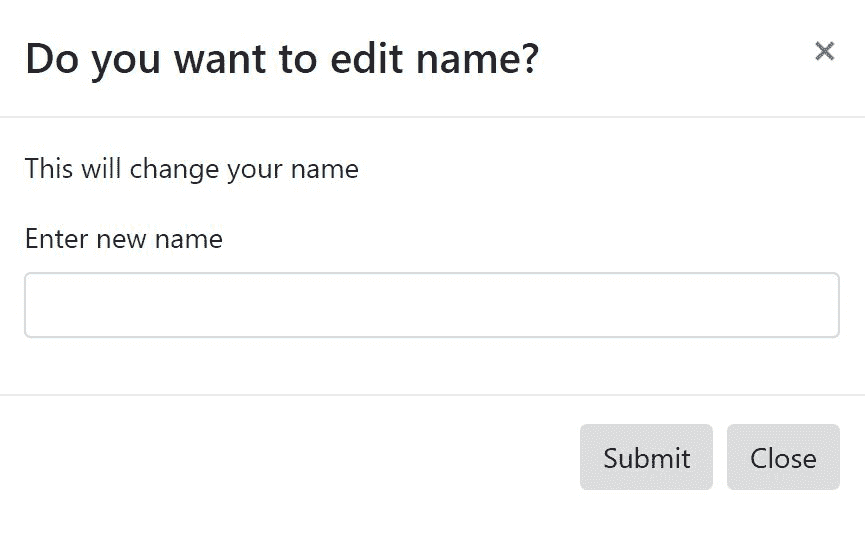

# 第五章：创建用户个人资料页面

在本章中，我们将编写一个用户个人资料组件。我们将介绍 **RxJS**（**ReactiveX**），这是一个流行的异步编程库。在本节中，我们将使用 RxJS 的 `Observable` 将认证模块的组件传递到用户模块的组件。我们将使用这个传递的用户模型来填充用户个人资料组件。我们将编辑用户数据并更新 Firebase 认证和数据库。作为编辑的一部分，我们将实现一个可重用的编辑组件，该组件使用 bootstrap 模态来获取用户输入。最后，我们将看到当密码更改时 Firebase 会话令牌的生命周期。

在本章中，我们将涵盖以下主题：

+   RxJS 简介

+   在模块组件之间传递数据

+   SASS 简介

+   创建用户个人资料组件

+   增强更新操作的服务

+   创建一个编辑对话框组件

+   更新操作的 Firebase 会话

# RxJS 简介

RxJS 是一个流行的异步和基于事件的编程库。在本节中，我们将仅介绍这个库的基础知识，以便您理解使用这个库的真实原因。更多详情，您可以参考 RxJS 的官方站点 [`reactivex.io/rxjs/`](http://reactivex.io/rxjs/)。

这里是该库的一些关键术语：

+   `可观察的`: 这是一个可以消费的值或事件的集合。例如，`可观察的`可以是一个数字数组的集合：

```js
let observable = Rx.Observable.from([1, 2, 3]);
```

+   `订阅`: 要从 `可观察的` 中读取数据，我们需要订阅，然后通过观察者传递事件或值：

```js
let subscription = observable.subscribe(x => console.log(x));
```

+   `subject`: 这是 `可观察的` 的扩展，用于向多个观察者广播事件或值。这个例子将在我们应用程序的使用案例中介绍。这是对 RxJS 库的非常基础的理解。

# 在模块组件之间传递数据

我们在前一章中完成了我们的认证模块。在本节中，我们将介绍在模块组件之间传递数据，这是我们应用程序开发的一个重要部分。在实现一个网络应用程序时，我们总是面临如何从一个组件模块传递数据到另一个组件模块的问题。我们的初步想法是将模型存储在一个公共应用程序类中，例如单例类，然后在其他组件中检索它。Angular 提供了许多传递数据的方法，我们已经在 Angular 绑定中提到了这一点。当我们在同一模块中具有父子关系的组件时，这种方法很有用。

单例类是一种软件设计模式，它限制类的实例化只能有一个对象。这个单一的对象对应用程序的所有组件都是可用的。

我们在 `service` 类中使用 RxJS 库的 `subject` 来将数据传递到不同模块的组件。这种设计有助于创建一个独立的模块。

执行以下步骤以将认证模块的数据传递到用户模块：

1.  **存储用户模型**：第一步是使用 `service` 类中的 `subject` 存储数据。我们在用户服务中存储用户模型。我们使用 `BehaviorSubject`，它是 `subject` 类的扩展，用于存储用户模型。

RxJS 的行为主题向订阅者发出最新的数据。

```js
null, and this will be populated with the latest user model: 
```

```js
private subject: BehaviorSubject<User> = new BehaviorSubject(null);
```

我们在 `subject` 中保存用户模型。我们从登录和注册组件调用此方法：

```js
public saveUser(user: User){
    this.subject.next(user);
}
```

1.  **在服务类中创建方法**：我们可以在 `UserService` 类中创建 `getSavedUser()`。此方法返回 `subject`，调用者需要订阅或使用 `getValue()` 方法来检索保存的 `User` 对象：

```js
public getSavedUser(): BehaviorSubject<User>{
    return this.subject;
}
```

1.  **在组件类中检索用户模型**：我们可以使用 `getValue()` 方法从 `subject` 中检索值。您也可以订阅并检索用户模型：

```js
ngOnInit() {
    this.user = this.userService.getSavedUser().getValue();
}
```

目前为止，这是完整的 `user.service.ts`：

```js
import {Injectable} from '@angular/core';
import {AngularFireDatabase} from 'angularfire2/database';
import {User} from './user';
import {USERS_CHILD} from './database-constants';
import {Observable} from 'rxjs/Observable';
import {BehaviorSubject} from 'rxjs/BehaviorSubject';

/**
 * User service
 *
 */
@Injectable()
export class UserService {

  private subject: BehaviorSubject<User> = new 
  BehaviorSubject(null);

  /**
   * Constructor
   *
   * @param {AngularFireDatabase} fireDb provides the functionality 
   for Firebase Database
   */
   constructor(private fireDb: AngularFireDatabase) {
  }

  public addUser(user: User): void {
    this.fireDb.object(`${USERS_CHILD}/${user.uid}`).set(user);
    this.saveUser(user);
  }

  public getUser(uid: string): Observable<User> {
    return this.fireDb.object<User>
   (`${USERS_CHILD}/${uid}`).valueChanges();
  }

  public saveUser(user: User) {
    this.subject.next(user);
  }

  public getSavedUser(): BehaviorSubject<User> {
    return this.subject;
  }

  public updateEmail(user: User, newEmail: string): void {
    this.fireDb.object(`${USERS_CHILD}/'${user.uid}`).update({email: 
    newEmail});
    this.saveUser(user);
  }

  public updateMobile(user: User, mobile: string): void {

  this.fireDb.object(`${USERS_CHILD}/'${user.uid}`).update({mobile: 
  mobile});
    this.saveUser(user);
  }

  public updateName(user: User, name: string): void {
    this.fireDb.object(`${USERS_CHILD}/'${user.uid}`).update({name: 
    name});
    this.saveUser(user);
  }

}
```

# SASS 简介

**SASS（系统化出色的样式表）** 是一个 CSS 预处理器，它为现有的 CSS 添加了更多功能。它有助于添加变量、嵌套规则、混入、继承等。这个特性有助于以更系统化的方式组织我们的样式表。

SASS 提供了两种风味：

+   SASS

+   SCSS

SASS 是两种语法中较老的一种，而 SCSS 是更常用的一种。在这本书中，我们使用了 SCSS 格式。一些受支持的功能如下：

+   **部分（Partial）**：部分是一个可重用的 CSS 元素，可以包含在其他 SCSS 文件中。这有助于将我们的 CSS 模块化成更小的可重用元素，跨越 SCSS 文件。一个部分的文件名包含一个前导下划线，这样编译器就知道这是一个部分文件，不会转换为 CSS 文件，例如，`_shared.scss`。我们可以使用 `@import` 指令将部分文件导入到其他组件中。

以下是一个在其他 SCSS 文件中包含部分的示例，如下所示：

```js
@import "../../shared/shared";
.chat-message-main-container {
}
```

+   **扩展**：这类似于高级编程语言中的继承。我们将编写 CSS 属性在公共类选择器中，然后在其他类选择器中扩展它。

以下是一个 `@extend` 的示例：

```js
.user-profile{
   margin-top: 10px;
}

.user-profile-name{
   @extend .user-profile;
   border-color: green;
}
```

+   **混入（Mixin）**：这用于将可以在整个应用程序中使用的声明分组。这类似于类中的方法签名：

```js
@mixin message-pointer($rotate , $skew) {
    transform: rotate($rotate) skew($skew);
    -moz-transform: rotate($rotate) skew($skew);
    -ms-transform: rotate($rotate) skew($skew);
    -o-transform: rotate($rotate) skew($skew);
    -webkit-transform: rotate($rotate) skew($skew);
}
```

# 创建用户配置文件组件

在本节中，我们将创建一个用户配置文件组件。在成功登录或注册后，用户将被导向其配置文件页面。此组件显示用户信息，如姓名和电子邮件，并提供编辑功能以更改用户信息。以下创建用户配置文件组件的步骤：

1.  **创建用户配置文件模板**：第一步是创建用户配置文件页面的模板。在这个模板中，我们将显示姓名、电子邮件、手机和密码。这些信息中的每一项都有一个编辑按钮。

首先，我们创建一个包含所有用户信息元素的 `div` 容器。我们使用 `*ngIf` 来检查用户数据：

```js
<div class="user-profile" *ngIf="user">
</div>
```

第二步，我们在 `div` 中为每个用户信息创建 `div`，包括 `label`、`user.name` 和 `Edit` 按钮：

```js
<div class="user-profile-name">
    <label>Name: </label>
    <div class="user-profile-name-value">{{user?.name}}</div>
    <button (click)="onNameChange()" type="button" class="btn btn-
    default btn-sm user-profile-name-btn">
    Edit
    </button>
</div>
```

下面是完整的 `user-profile.component.html`：

```js
<div class="user-profile" *ngIf="user">
    <div class="person-icon">
        
    </div>
    <div class="user-profile-name">
        <label>Name: </label>
        <div class="user-profile-name-value">{{user?.name}}</div>
        <button (click)="onNameChange()" data-toggle="modal" data-
         target="#editModal" type="button"
         class="btn btn-default btn-sm user-profile-name-btn">
            Edit
        </button>
    </div>
    <div class="user-profile-email">
        <label>Email: </label>
        <div class="user-profile-email-value">{{user?.email}}</div>
        <button (click)="onEmailChange()" data-toggle="modal" data-
        target="#editModal" type="button"
        class="btn btn-default btn-sm">
            Edit
        </button>
    </div>
    <div class="user-profile-mobile">
        <label>Mobile: </label>
        <div class="user-profile-mobile-value">{{user?.mobile}}</div>
        <button (click)="onMobileChange()" data-toggle="modal" data- 
         target="#editModal" type="button"
         class="btn btn-default btn-sm user-profile-mobile-btn">
            Edit
        </button>
    </div>

    <div class="user-profile-password">
        <label>Password: </label>
        <div class="user-profile-password-value">****</div>
        <button (click)="onPasswordChange()" data-toggle="modal" data-
        target="#editModal" type="button"
        class="btn btn-default btn-sm user-profile-password-btn">
            Edit
        </button>
    </div>
    <div class="user-profile-btn">
        <button type="button" (click)='onLogout()' class="btn btn-
        info">LOGOUT</button>
    </div>
</div>
```

使用样式表对用户信息进行对齐。我们使用 SCSS 的嵌套来从容器到子选择器的类选择器：

```js
.user-profile{
    width: 50%;
    margin-left: 24px;
    margin-top: 10px;
    .user-profile-name{
        text-align: left;
        margin-top: 10px;
        .user-profile-name-value{
            display: inline-block;
            margin-left: 10px;
        }
        .user-profile-name-btn{
            margin-left: 100px;
        }
    }
}
```

下面的 `user-profile.component.scss` 代码是完整的：

```js
.user-profile{
    width: 50%;
    margin-left: 24px;
    margin-top: 10px;
    .user-profile-name{
        text-align: left;
        margin-top: 10px;
        .user-profile-name-value{
            display: inline-block;
            margin-left: 10px;
        }
        .user-profile-name-btn{
            margin-left: 100px;
        }
    }
    .user-profile-email{
        text-align: left;
        margin-top: 20px;
        .user-profile-email-value{
            display: inline-block;
            margin-left: 10px;
        }
    }
    .user-profile-mobile{
        text-align: left;
        margin-top: 20px;
        .user-profile-mobile-value{
            display: inline-block;
            margin-left: 10px;
        }
        .user-profile-mobile-btn{
            margin-left: 110px;
        }
    }
    .user-profile-password{
        text-align: left;
        margin-top: 20px;
        .user-profile-password-value{
            display: inline-block;
            margin-left: 10px;
        }
        .user-profile-password-btn{
            margin-left: 154px;
        }
    }
    .user-profile-btn{
        margin-top: 20px;
    }
}
```

1.  **创建用户资料组件**: 我们将在组件中定义检索用户模型和处理事件的逻辑。

第一步是从 `service` 类中检索用户模型。我们实现 `onInit` 接口并重写 `ngOnInit` 来检索用户模型，如下所示：

```js
export class UserProfileComponent implements OnInit {
    private user: User;
    constructor(private authService: AuthenticationService,
                private userService: UserService,
                private router: Router) {
    }
    ngOnInit() {
        this.user = this.userService.getSavedUser().getValue();
    }
}
```

`OnInit` 是一个生命周期钩子接口，由 Angular 框架管理。它有一个 `ngOnInit()` 方法，当组件和指令完全初始化时会被调用。

下面的 `user-profile.component.ts` 是目前的完整版本：

```js
import {Component, OnInit, ViewChild} from '@angular/core';
import {AuthenticationService} from '../../services/authentication.service';
import {Router} from '@angular/router';
import {User} from '../../services/user';
import {UserService} from '../../services/user.service';
import {EditDialogComponent} from '../../edit-dialog/edit-dialog.component';
import {EditType} from '../../edit-dialog/edit-details';

@Component({
    selector: 'app-friends-userprofile',
    styleUrls: ['user-profile.component.scss'],
    templateUrl: 'user-profile.component.html'
})
export class UserProfileComponent implements OnInit {

    profileImage: any = '../../../assets/images/person_edit.png';

    user: User;

    @ViewChild(EditDialogComponent) editDialog: EditDialogComponent;

    constructor(private authService: AuthenticationService,
                private userService: UserService,
                private router: Router) {
    }

    ngOnInit() {
        this.user = this.userService.getSavedUser().getValue();
    }

    onLogout(): void {
        this.authService.signout().then(() => {
            this.navigateToLogin();
        });
    }

    navigateToLogin() {
        this.router.navigateByUrl('/app-friends-login');
    }
}
```

我们的用户资料页面视图应该是这样的：


# 增强更新操作的服务

在本节中，我们将增强现有的服务以提供用户信息的更新。作为此练习的一部分，我们将讨论如何更新 Firebase 身份验证和数据库。

我们将更新以下用户信息：

+   **用户名**: 此数据存储在 Firebase 数据库中，因此我们添加新的 `update` API 来执行此操作。我们在用户服务中添加了 `updateName()` 方法，并在 Firebase 中更新存储的用户数据：

```js
public updateName(user: User, name: string): void {
    this.fireDb.object(`${USERS_CHILD}/'${user.uid}`).update({name: 
    name});
    this.saveUser(user);
}
```

+   **用户电子邮件**: 此数据存储在 Firebase 身份验证和数据库中，因此我们需要在两个地方更新它。

我们需要在我们的身份验证服务中添加一个 `changeEmail()` 方法：

```js
public changeEmail(email: string): Promise<any> {
    return this.angularFireAuth.auth.currentUser.updateEmail(email);
}
```

一旦在身份验证服务中完成此操作，我们就可以使用用户服务在 Firebase 数据库中更新新的电子邮件：

```js
public updateEmail(user: User, newEmail: string): void {
    this.fireDb.object(`${USERS_CHILD}/'${user.uid}`).update({email: 
    newEmail});
    this.saveUser(user);
}
```

现在编辑移动密码与前面的代码相同，你可以遵循以下代码。`authentication.service.ts` 和 `user.service.ts` 的更新版本如下：

```js
import {Injectable} from '@angular/core';
import {AngularFireAuth} from 'angularfire2/auth';

/**
 * Authentication service
 *
 */
@Injectable()
export class AuthenticationService {

    /**
     * Constructor
     *
     * @param {AngularFireAuth} angularFireAuth provides the 
       functionality related to authentication
     */
    constructor(private angularFireAuth: AngularFireAuth) {
    }

    public signup(email: string, password: string): Promise<any> {
        return 
        this.angularFireAuth.auth.createUserWithEmailAndPassword(
        email, password);
    }

    public login(email: string, password: string): Promise<any> {
        return this.angularFireAuth.auth.signInWithEmailAndPassword(
        email, password);
    }

    public resetPassword(email: string): Promise<any> {
        return 
        this.angularFireAuth.auth.sendPasswordResetEmail(email);
    }

    public isAuthenticated(): boolean {
        const user = this.angularFireAuth.auth.currentUser;
        return user ? true : false;
    }

    public signout(): Promise<any>{
        return this.angularFireAuth.auth.signOut();
    }

    public changeEmail(email: string): Promise<any> {
        return 
        this.angularFireAuth.auth.currentUser.updateEmail(email);
    }

    public changePassword(password: string): Promise<any> {
        return 
        this.angularFireAuth.auth.currentUser.updatePassword
        (password);
    }
}
```

下面的 `user.service.ts` 文件是更新后的版本：

```js
import {Injectable} from '@angular/core';
import {AngularFireDatabase} from 'angularfire2/database';
import {User} from './user';
import {USERS_CHILD} from './database-constants';
import {Observable} from 'rxjs/Observable';
import {BehaviorSubject} from 'rxjs/BehaviorSubject';

/**
 * User service
 *
 */
@Injectable()
export class UserService {

  private subject: BehaviorSubject<User> = new BehaviorSubject(null);

  /**
   * Constructor
   *
   * @param {AngularFireDatabase} fireDb provides the functionality 
     for Firebase Database
   */
  constructor(private fireDb: AngularFireDatabase) {
  }

  public addUser(user: User): void {
    this.fireDb.object(`${USERS_CHILD}/${user.uid}`).set(user);
    this.saveUser(user);
  }

  public getUser(uid: string): Observable<User> {
    return this.fireDb.object<User>
   (`${USERS_CHILD}/${uid}`).valueChanges();
  }

  public saveUser(user: User) {
    this.subject.next(user);
  }

  public getSavedUser(): BehaviorSubject<User> {
    return this.subject;
  }

  public updateEmail(user: User, newEmail: string): void {
    this.fireDb.object(`${USERS_CHILD}/'${user.uid}`).update({email:  
    newEmail});
    this.saveUser(user);
  }

  public updateMobile(user: User, mobile: string): void {

  this.fireDb.object(`${USERS_CHILD}/'${user.uid}`).update({mobile:   
   mobile});
    this.saveUser(user);
  }

  public updateName(user: User, name: string): void {
    this.fireDb.object(`${USERS_CHILD}/'${user.uid}`).update({name: 
    name});
    this.saveUser(user);
  }

}
```

# 创建编辑对话框组件

编辑对话框组件用于获取用户输入以更新 Firebase 中的用户信息。此组件被重复使用以获取所有其他用户详细信息的信息，如姓名、电子邮件、手机和密码。此组件包含在用户资料组件中，当用户点击编辑按钮时，编辑对话框会显示出来。

创建一个编辑 `dialog` 组件的步骤如下：

1.  **创建编辑对话框模板**: 第一步是创建编辑对话框的模板。此模板包含标题、文本标题和一个输入框。

我们使用 Bootstrap 模态框创建一个编辑对话框。它有一个输入框来接收用户输入。

第一步是创建一个带有`isVisible`条件的`div`容器，并且当用户点击“编辑”按钮时，这个变量会动态变化：

```js
<div *ngIf="isVisible" class="modal fade show in danger" id="editModal" role="dialog" />
```

我们使用表单元素来获取用户输入，它有一个`submit`按钮，如下所示：

```js
<div class="modal-dialog">
    <form name="form" (ngSubmit)="onSubmit(editFormData)" 
     #editFormData='ngForm'>
</form>
</div>
```

由于前面的模板也用于不同的编辑目的，我们需要动态更改标题、标题等文本。我们可以使用单向 Angular 绑定来分配变量：

```js
<p>This will change your {{bodyTitle}}</p>
```

以下是完全的`edit-dialog.component.html`文件：

```js
<div *ngIf="isVisible" class="modal fade in" id="editModal" role="dialog">
    <div class="modal-dialog">
        <form name="form" (ngSubmit)="onSubmit(editFormData)" 
        #editFormData='ngForm'>
            <div class="modal-content">
                <div class="modal-header">
                    <button type="button" class="close" data-
                    dismiss="modal">&times;</button>
                    <h4 class="modal-title">{{titleMessage}}</h4>
                </div>
                <div class="modal-body">
                    <p>This will change your {{bodyTitle}}</p>

                    <div class="form-group">
                        <label for="editDetail">{{bodyLabel}}
                        </label>
                        <input type="text" class="form-control" 
                        name="editValue" (ngModel)="editValue"
                        id="editDetail"/>
                    </div>
                </div>
                <div class="modal-footer form-group">
                    <button type="submit" class="btn btn-default" 
                   [disabled]="!editFormData.form.valid">
                    Edit
                    </button>
                    <button type="button" class="btn btn-default" 
                    data-dismiss="modal" 
                   (click)="hide()">Close</button>
                </div>
            </div>
        </form>
    </div>
</div>
```

1.  **创建编辑对话框组件**：当用户点击“编辑”按钮时，此组件从用户资料组件接收一个变量输入。它接收用户在对话框中的输入，并将其传递给`EditDetails`类以更新信息。

我们将使用构造函数模式从`UserProfileComponent`获取输入变量。

构造函数模式是一种用于创建复杂对象的创建型模式。这基本上是在类中的构造函数接受许多参数时使用。这减少了构造函数的复杂性。

在我们的情况下，我们需要参数来动态更改标题、`label`。我们将为每个变量输入创建多个方法——例如，对于标题，我们将创建一个`setTitle()`方法并返回`this`，即类的实例。这有助于在单行中链接方法调用：

```js
public setTitle(title: string): EditDialogComponent {
    this.titleMessage = title;
    return this;
}
```

我们将需要使用`show`和`hide`方法切换`isVisible`变量，如下所示：

```js
public show() {
    this.isVisible = true;
}

public hide() {
    this.isVisible = false;
}
```

现在这是完整的`edit-dialog.component.ts`文件：

```js
import {Component, ViewChild} from '@angular/core';
import {AuthenticationService} from '../services/authentication.service';
import {UserService} from '../services/user.service';
import {User} from '../services/user';
import {EditDetails, EditType} from './edit-details';

@Component({
   selector: 'app-edit-dialog',
   templateUrl: './edit-dialog.component.html',
})
export class EditDialogComponent {
   isVisible: boolean;

   titleMessage: string;

   bodyTitle: string;

   bodyLabel: string;

   editType: EditType;

   editDetails: EditDetails;

   constructor(private authService: AuthenticationService,
            private userService: UserService) {
      this.editDetails = new EditDetails(authService, userService);
   }

   public setTitle(title: string): EditDialogComponent {
      this.titleMessage = title;
      return this;
   }

   public setBodyTitle(bodyTitle: string): EditDialogComponent {
      this.bodyTitle = bodyTitle;
      return this;
   }

   public setBodyLabel(bodyLabel: string): EditDialogComponent {
      this.bodyLabel = bodyLabel;
      return this;
   }

   public setEditType(editType: EditType): EditDialogComponent {
      this.editType = editType;
      return this;
   }

   public show() {
      this.isVisible = true;
   }

   public hide() {
      this.isVisible = false;
   }

   private onSubmit(editFormData): void {
      this.editDetails.edit(this.editType, 
      editFormData.value.editValue);
   }
}
```

1.  **创建更新操作**：当用户提供了更新所需的新数据并点击`submit`时，将调用`onSubmit()`方法。对于每个更新操作，我们将调用`EditDetails`类的`edit()`方法。

现在这是完整的`edit-details.ts`文件：

```js
import {AuthenticationService} from '../services/authentication.service';
import {UserService} from '../services/user.service';
import {User} from '../services/user';

export enum EditType {
   NAME,
   EMAIL,
   MOBILE,
   PASSWORD
}

export class EditDetails {

   constructor(private authService: AuthenticationService,
            private userService: UserService) {
   }

   public edit(editType: EditType, value: string) {
      switch (editType) {
         case EditType.NAME:
            this.editName(value);
            break;

         case EditType.EMAIL:
            this.editEmail(value);
            break;

         case EditType.MOBILE:
            this.editMobile(value);
            break;

         case EditType.PASSWORD:
            this.editPassword(value);
            break;
      }
   }

   private editName(name: string) {
      const user: User = this.userService.getSavedUser().getValue();
      user.name = name;
      this.userService.updateName(user, name);
      alert('Name changed successfully');
   }

   private editEmail(newEmail: string) {
      this.authService.changeEmail(newEmail).then(() => {
         const user: User =   
         this.userService.getSavedUser().getValue();
         user.email = newEmail;
         this.userService.updateEmail(user, newEmail);
         alert('Email changed successfully');
      }).catch(function (error) {
         const errorMessage = error.message;
         alert(errorMessage);
      });
   }

   private editMobile(mobile: string) {
      const user: User = this.userService.getSavedUser().getValue();
      user.mobile = mobile;
      this.userService.updateMobile(user, mobile);
      alert('Mobile changed successfully');
   }

   private editPassword(value: string) {
      const newPassword: string = value;
      this.authService.changePassword(newPassword).then(() => {
         alert('Password changed successfully');
      }).catch(function (error) {
         const errorMessage = error.message;
         alert(errorMessage);
      });
   }
}
```

1.  **使用编辑对话框组件**：最后，我们将在用户资料组件中使用编辑对话框组件。第一步是将此组件包含在`user-profile.component.html`中，如下所示：

```js
<div class="user-profile" *ngIf="user">
...
</div>
<app-edit-dialog></app-edit-dialog>
```

第二步是在`user-profile.component.ts`中初始化编辑对话框组件，如下所示：

```js
export class UserProfileComponent implements OnInit {
   @ViewChild(EditDialogComponent) editDialog: EditDialogComponent;
...
}
```

当用户点击任何“编辑”按钮时，我们需要初始化变量并调用`show()`方法：

```js
onNameChange() {
   this.editDialog.setTitle('Do you want to edit name?')
      .setBodyTitle('name')
      .setBodyLabel('Enter new name')
      .setEditType(EditType.NAME)
      .show();
}
```

以下是在`user-profile.component.ts`中其他更新操作的其他方法：

```js
onEmailChange() {
   this.editDialog.setTitle('Do you want to edit email?')
      .setBodyTitle('email')
      .setBodyLabel('Enter new email')
      .setEditType(EditType.EMAIL)
      .show();
}

onMobileChange() {
   this.editDialog.setTitle('Do you want to edit mobile?')
      .setBodyTitle('mobile')
      .setBodyLabel('Enter new mobile')
      .setEditType(EditType.MOBILE)
      .show();
}

onPasswordChange() {
   this.editDialog.setTitle('Do you want to edit password?')
      .setBodyTitle('password')
      .setBodyLabel('Enter new password')
      .setEditType(EditType.PASSWORD)
      .show();
}
```

最后，我们在用户模块中配置编辑组件，如下所示：

```js
import {NgModule} from '@angular/core';
import {EditDialogComponent} from '../edit-dialog/edit-dialog.component';

/**
 * User Module
 */
@NgModule({
    imports: [
        ...
    ],
    declarations: [
        ...
        EditDialogComponent
    ]
})
export class UserModule {
}
```

现在，当用户点击“编辑”按钮时，以下编辑对话框将出现：



# 更新操作的 Firebase 会话

当用户编辑他们的电子邮件和密码时，Firebase 会要求用户重新登录。当我们在`AngularFireAuth`中调用`updatePassword()`方法时，Firebase 会抛出错误，这个错误是为了安全原因而添加的。

`此操作敏感，需要最近一次的认证。在重试此请求之前请重新登录。`

前面的消息显示在我们的应用程序的警告对话框中，要编辑电子邮件或密码，我们需要立即注销并刷新会话，然后执行操作。

提升用户体验的最佳方式是让用户通过弹出窗口注销并刷新令牌。我们不会将此行为作为本书的一部分进行实现，所以你可以将其作为练习。

# 摘要

恭喜你完成本章！这是最先进的章节之一。我们涵盖了与编程范式相关的重要概念。我们讨论了从一个模块组件向另一个模块组件传递数据。作为其中的一部分，我们使用最少的依赖开发了两个独立的模块。我们介绍了 RxJS 库。我们开发了一个编辑组件并将其包含在用户资料组件中。最后，我们介绍了 Firebase 的安全功能，在编辑敏感信息（如电子邮件或密码）时，该功能将使会话过期。

在下一章中，我们将增强我们的朋友应用，添加用户的“朋友”功能。我们还将检索朋友列表并在列表中显示它们。我们将添加分页功能以便导航到朋友列表。
