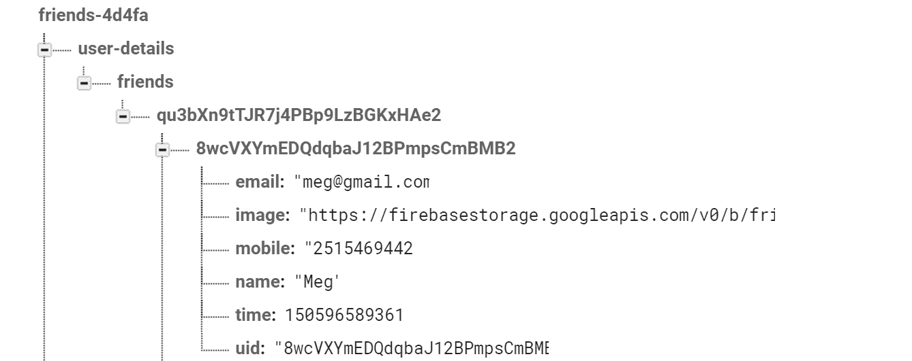

# 第六章：创建用户的友情列表

在本章中，我们将转向 Angular 和 Firebase 的更高级功能。我们将使用 Firebase 列表检索我们的用户友情列表。我们将使用 Bootstrap 提供的卡片组件显示友情列表。我们将使用 Firebase 过滤器实现分页概念。最后，我们将讨论 Angular 管道。

在本章中，我们将涵盖以下主题：

+   创建用户的友情模板

+   创建朋友的服务

+   创建朋友组件

+   创建我们的第一个日期管道

# 创建用户的友情模板

在本节中，我们将介绍一个稍微复杂一些的模板，使用 Bootstrap 卡片组件。我们将检索定义大小的朋友列表，并在卡片项中显示用户的友情列表。我们将调用 Firebase API 获取三个项目，并使用 `*ngFor` 指令循环朋友的列表。

卡片是一个灵活且可扩展的容器。它有显示标题、页脚、标题等选项。我们将使用以下属性：

+   `card-img-top`：用于在顶部显示朋友的图片。

+   `card-title`：用于显示朋友的姓名。

+   `card-text`：用于显示他们的电子邮件和电话号码。

+   `card-footer`：用于使用自定义管道显示日期。我们将在本章的后续部分实现自定义管道。

```js
<div *ngFor="let friend of friends" class="card">
    
    <div class="card-block">
        <h4 class="card-title">{{friend.name}}</h4>
        <p class="card-text">{{friend.email}} | {{friend.mobile}}</p>
    </div>
    <div class="card-footer">
        <small class="text-muted">Friends from {{friend.time | 
         friendsdate}}</small>
    </div>
</div>
```

在我们显示第一页后，我们需要左右图标来滚动到下一页和上一页。这些图标将根据列表中的总项目数显示，并且 `isLeftVisible` 将从 `component` 类设置：

```js
<div *ngIf="isLeftVisible" (click)="onLeft()" class="left"></div>
```

以下是完整的 `user-friends.component.html` 文件：

```js
<div class="main_container">
    <div *ngIf="friends" class="content_container">
        <div *ngIf="isLeftVisible" (click)="onLeft()" class="left">
            
        </div>
        <div class="card-deck list">
            <div *ngFor="let friend of friends" class="card">
                
                <div class="card-block">
                    <h4 class="card-title">{{friend.name}}</h4>
                    <p class="card-text">{{friend.email}} | 
                     {{friend.mobile}}</p>
                </div>
                <div class="card-footer">
                    <small class="text-muted">Friends from 
                     {{friend.time | friendsdate}}</small>
                </div>
            </div>
        </div>
        <div *ngIf="isRightVisible" (click)="onRight()" class="right">
            
        </div>
    </div>
    <div *ngIf="!friends || friends.length === 0" 
     class="no_info_container">
        <h1>No friends in your list</h1>
    </div>
</div>
```

我们将类选择器分配给元素以应用样式。在朋友列表页面中，我们使用 `display:inline` 水平对齐元素。同时，左图标、卡片列表和右图标依次显示，因此我们使用 `float: left`。

以下是到目前为止完整的 `user-friends.component.scss` 文件：

```js
.main_container {
    margin-top: 10px;
    margin-left: 80px;
    .content_container {
        display: inline;
        .list {
            float: left;
            .card-img-top {
                height: 180px;
                width: 260px;
                background-image: 
                url('../../../assets/images/person.png');
            }
        }

        .left {
            float: left;
            margin-top: 140px;
        }

        .right {
            float: left;
            margin-top: 140px;
        }
    }
}
```

# 创建朋友的服务

我们将在朋友的组件部分引入一个额外的服务。这个服务将从 Firebase 获取朋友的详细信息。在本节中，我们将涵盖以下主题：

+   在我们的数据库中创建 Firebase 节点

+   实现 `Friend` 类

+   实现朋友的服务

# 在我们的数据库中创建 Firebase 节点

现在，我们已经如下一张图所示在 Firebase 中预先填充了朋友的详细信息。我们引入了一个名为 `user-details` 的单独节点。这将存储所有用户信息，我们不需要查询用户节点以获取更多信息，因为这会增加查询性能。

以下是对 Firebase 此实例的一些关键观察：

+   我们尚未实现添加朋友的功能；因此，我们将手动添加朋友的信息。

+   我们使用 UID 关系来列出用户的好友。在这种情况下，UID `qu3bXn9tTJR7j4PBp9LzBGKxHAe2` 是用户 ID，而另一个 UID—`8wcVXYmEDQdqbaJ12BPmpsCmBMB2`—是当好友注册应用时生成的朋友 ID。

+   在 Firebase 中，我们重复很多数据。这是在 NoSQL 数据库中组织数据时的常见模式，因为它避免了多次对数据库的访问。尽管这增加了写入时间，但有助于我们的应用在读取数据时进行扩展。它防止了大型查询减慢我们的数据库速度，以及读取时间较长的嵌套节点。

Firebase 数据库中的好友节点如下：



# 实现好友模型类

我们将实现 `Friend` 模型类，以映射从 Firebase 中获取的朋友 JSON 对象的数组。这个类与 `User` 模型类类似，将责任分离到单独的类中是一种良好的实践。

这个类有 `name`、`email`、`mobile`、`uid`、`time` 和 `image` 属性。时间属性用于显示友谊的持续时间，并以毫秒为单位存储。我们需要使用 Angular 管道将毫秒时间转换为可读的日期格式。

以下为完整的 `friend.ts` 文件：

```js
export class Friend {

   name: string;

   mobile: string;

   email: string;

   uid: string;

   time: string;

   image: string;

   constructor(name: string,
            mobile: string,
            email: string,
            uid: string,
            time: string,
            image: string) {
      this.name = name;
      this.mobile = mobile;
      this.email = email;
      this.uid = uid;
      this.time = time;
      this.image = image;

   }

}
```

# 实现好友服务

作为此服务的一部分，我们需要检索好友列表。`AngularFireDatabase` 提供了一个列表 API 来检索好友列表。此服务包含以下三个方法，以提供完整的分页功能：

+   **获取第一页：** `getFirstPage()` 方法接受 `uid` 和 `pageSize` 作为参数。这些参数用于从 Firebase 检索第一页 `pageSize` 数据。我们在查询函数的第二个参数中传递 `pageSize`：

```js
getFirstPage(uid: string, pageSize: number): Observable<Friend[]> 
{
  return this.fireDb.list<Friend> 
  (`${USER_DETAILS_CHILD}/${FRIENDS_CHILD}/${uid}`,
    ref => ref.limitToFirst(pageSize)
  ).valueChanges();
}
```

+   **获取下一页：** `loadNextPage()` 接受 `uid`、`friendKey` 和 `pageSize` 参数。`uid` 和 `friendKey` 用于设置查询。这意味着它们从最后检索的 `friendKey` 数据中检索下一个 `pageSize` 数据：

```js
loadNextPage(uid: string, friendKey: string, pageSize: number): Observable<Friend[]> {
  return this.fireDb.list<Friend>
  (`${USER_DETAILS_CHILD}/${FRIENDS_CHILD}/${uid}`,
    ref => ref.orderByKey().startAt(friendKey)
           .limitToFirst(pageSize + 1)
  ).valueChanges();
}
```

+   **获取上一页：** `loadPreviousPage()` 方法接受 `uid`、`friendKey` 和 `pageSize`。后两个参数用于从起始 `friendKey` 元素检索前一个 `pageSize` 数据：

```js
loadPreviousPage(uid: string, friendKey: string, pageSize: number): Observable<Friend[]> {
  return this.fireDb.list<Friend>
  (`${USER_DETAILS_CHILD}/${FRIENDS_CHILD}/${uid}`,
    ref => ref.orderByKey().startAt(friendKey)
           .limitToLast(pageSize + 1)
  ).valueChanges();
}
```

这是完整的 `friends.service.ts`：

```js
import {Injectable} from '@angular/core';
import {AngularFireDatabase} from 'angularfire2/database';
import {Observable} from 'rxjs/Observable';
import 'rxjs/add/operator/map';
import {Friend} from './friend';
import {FRIENDS_CHILD, USER_DETAILS_CHILD} from './database-constants';

/**
 * Friends service
 *
 */
@Injectable()
export class FriendsService {

    /**
     * Constructor
     *
     * @param {AngularFireDatabase} fireDb provides 
       the functionality related to authentication
     */
    constructor(private fireDb: AngularFireDatabase) {
    }

    getFirstPage(uid: string, pageSize: number): Observable<Friend[]> 
{
        return this.fireDb.list<Friend>
        (`${USER_DETAILS_CHILD}/${FRIENDS_CHILD}/${uid}`,
            ref => ref.limitToFirst(pageSize)
        ).valueChanges();
    }

    loadNextPage(uid: string, friendKey: string, pageSize: number): 
    Observable<Friend[]> {
        return this.fireDb.list<Friend>
        (`${USER_DETAILS_CHILD}/${FRIENDS_CHILD}/${uid}`,
            ref => 
            ref.orderByKey().startAt(friendKey)
            .limitToFirst(pageSize + 1)
        ).valueChanges();
    }

    loadPreviousPage(uid: string, friendKey: string, pageSize: number): 
    Observable<Friend[]> {
        return this.fireDb.list<Friend>
       (`${USER_DETAILS_CHILD}/${FRIENDS_CHILD}/${uid}`,
            ref => 
            ref.orderByKey().startAt(friendKey)
            .limitToLast(pageSize + 1)
        ).valueChanges();
    }
}
```

# 创建好友组件

这是我们的好友页面的主要控制器。在这个组件中，我们需要管理导航和我们的下一页和上一页图标的可见性。在本节中，我们将涵盖以下两个主要内容：

+   显示下一页和上一页

+   图标的可见性

为了显示下一页和上一页，我们已创建了显示朋友信息的 API。我们已经扩展了 `OnInit` 接口，并在 `ngOnInit` 上调用 `getFirstPage()`，使用 `uid` 和 `pageSize` 作为过滤参数，如下所示：

```js
ngOnInit() {
    this.user = this.userService.getSavedUser().getValue();
    this.friendService.getFirstPage(this.user.getUid() , this.pageSize)
        .subscribe(friends => {
            this.friends = friends;
            ...
        });
}
```

`ngOnInit()` 方法在页面加载时运行。

因此，我们将使用朋友服务中的 API 检索下一页和前一页，如下所示；唯一的区别是我们还将传递朋友`uid`，这样我们就可以从最后检索的项目开始检索下一页的大小数据：

```js
next() {
    this.friendService.loadNextPage(this.user.getUid() ,
        this.friends[this.friends.length - 1].getUid(),
        this.pageSize
    ).subscribe(friends => {
        this.friends = friends;
        ...
    });

}
```

现在，我们将继续到下一部分。我们需要处理下一个和上一个图标，为此我们需要朋友的总数。在我们之前的讨论中，我们得到了大小为`pageSize`。为了解决这个问题，我们必须在我们的 Firebase 用户节点中创建`friendcount`。每次我们添加一个朋友，我们就增加计数。我们在`User`类中添加了这个属性；其他所有部分保持不变：

```js
private friendcount: number
```

然后，在`ngOnInit`中，我们将检索总项目数，如下所示：

```js
ngOnInit() {
        this.user = this.userService.getSavedUser().getValue();
        this.totalCount = this.user.getFriendcount();
        this.friendService.getFirstPage(this.user.getUid() , 
        this.pageSize)
            .subscribe(friends => {
                ...
                let count: number = this.friends.length;
                this.currentCount = count;
                this.leftArrowVisible();
                this.rightArrowVisible();
            });
    }
```

接下来，我们将当前计数初始化为检索的项目，然后根据总数和当前计数调用可见性：

```js
leftArrowVisible(): void{
    this.isLeftVisible = this.currentCount > this.pageSize;
}

rightArrowVisible(): void{
    this.isRightVisible = this.totalCount > this.currentCount;
}
```

这是完整的`user-friends.component.ts`文件：

```js
import {Component, OnInit} from '@angular/core';
import {FriendsService} from '../../services/friends.service';
import {Friend} from '../../services/friend';
import {UserService} from '../../services/user.service';
import {User} from '../../services/user';
import 'firebase/storage';
import {Router} from '@angular/router';

@Component({
  selector: 'app-friends-userfriends',
  styleUrls: ['user-friends.component.scss'],
  templateUrl: 'user-friends.component.html'
})
export class UserFriendsComponent implements OnInit {

  friends: Friend[];

  totalCount: number;

  pageSize = 3;

  currentCount = 0;

  previousCount = 0;

  isLeftVisible = false;

  isRightVisible = true;

  user: User;

  constructor(private friendService: FriendsService,
              private userService: UserService) {
  }

  ngOnInit() {
    this.user = this.userService.getSavedUser().getValue();
    this.totalCount = this.user.friendcount;
    this.friendService.getFirstPage(this.user.uid, this.pageSize)
      .subscribe(friends => {
        this.friends = friends;
        const count: number = this.friends.length;
        this.currentCount = count;
        this.leftArrowVisible();
        this.rightArrowVisible();
      });
  }

  onLeft(): void {
    this.previous();
  }

  onRight(): void {
    this.next();
  }

  next() {
    this.friendService.loadNextPage(this.user.uid,
      this.friends[this.friends.length - 1].uid,
      this.pageSize
    ).subscribe(friends => {
      this.friends = friends;
      const count: number = this.friends.length;
      this.previousCount = count - 1;
      this.currentCount += this.previousCount;
      this.leftArrowVisible();
      this.rightArrowVisible();
    });

  }

  previous() {
    this.friendService.loadPreviousPage(this.user.uid,
      this.friends[0].uid,
      this.pageSize
    ).subscribe(friends => {
      this.friends = friends;
      const count: number = this.friends.length;
      this.currentCount -= this.previousCount;
      this.leftArrowVisible();
      this.rightArrowVisible();
    });

  }

  leftArrowVisible(): void {
    this.isLeftVisible = this.currentCount > this.pageSize;
  }

  rightArrowVisible(): void {
    this.isRightVisible = this.totalCount > this.currentCount;
  }

}
```

用户的友谊页面显示三个有导航功能的朋友：


# 创建我们的第一个日期管道

管道接受输入作为其数据，并将其转换为所需的输出。它用于将数据转换为可用的形式。

我们使用管道将时间转换为人类友好的日期格式。要创建管道，我们实现`PipeTransform`接口并重写`transform`方法。在这个方法中，我们获取以毫秒为单位的日期，并使用 moment 库将时间转换为特定的日期格式。我们提供了选择器名称，该名称用于 HTML 标签中的输入数据：

```js
import * as moment from 'moment';
import {Pipe, PipeTransform} from '@angular/core';

/**
 * It is used to format the date
 */
@Pipe({
  name: 'friendsdate'
})
export class FriendsDatePipe implements PipeTransform {
  transform(dateInMillis: string) {
    if (dateInMillis === '0' || dateInMillis === '-1') {
      return 'Invalid Date';
    }
    return moment(dateInMillis, 'x').format('MM/DD/YY');
  }
}
```

Moment 是一个用于格式化、操作或解析日期的 JavaScript 库。

创建管道后，我们在`user`模块中添加它：

```js
@NgModule({
    imports: [
        ...
    ],
    declarations: [
        ...
        FriendsDatePipe
    ]
})
export class UserModule {
}
```

最后，我们将`friendsdate`管道添加到模板中从`friend`对象中的`time`值，如下所示：

```js
<div class="card-footer">
    <small class="text-muted">Friends from {{friend.getTime() | friendsdate}}</small>
</div>
```

# 摘要

在本章中，我们涵盖了大量的重要概念。我们介绍了现在大多数应用中使用的卡片组件。我们用样式装饰了我们的视图，并创建了一个新的服务。我们讨论了 Firebase 列表，然后提供了过滤选项。这为我们朋友的列表实现了分页。最后，我们讨论了 Angular 管道，我们使用它将时间转换为人类友好的日期格式。

在下一章中，我们将介绍 Firebase 存储，并学习如何存储个人资料图片以及如何检索它。
