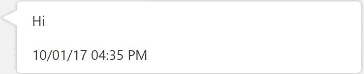
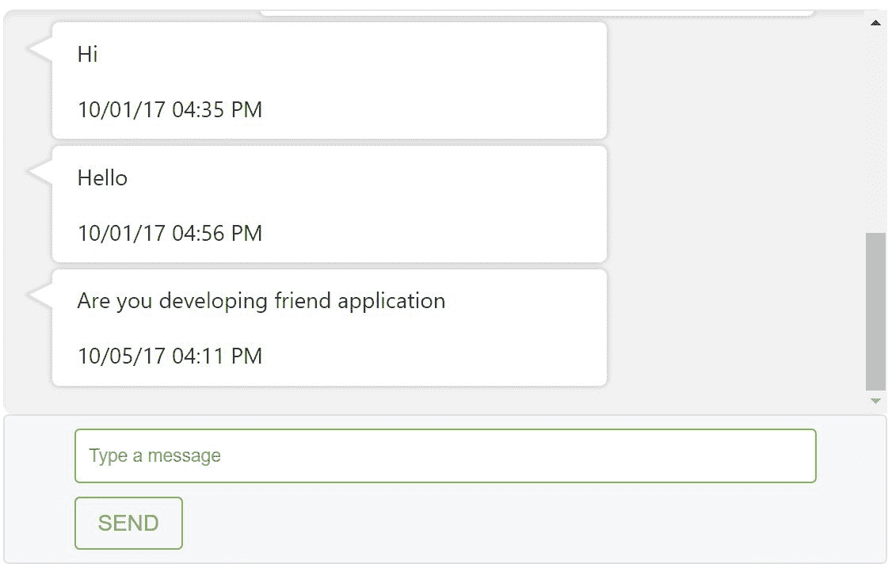

# 第八章：创建聊天组件

在本章中，我们将在现有应用中创建我们的聊天应用，并查看使用 Firebase 数据库的实时消息更新。我们将在本章和下一章中解释聊天功能。

由于我们已经在上一章创建了组件，因此在本章中我们将设计一个涉及多个组件的更复杂组件。根据一般规则，我们将将其创建为一个模块，因此主组件将是聊天组件，它将包含消息列表组件、表单组件和消息组件。在实现聊天功能时，我们将探索更多数据绑定方式。在本章中，我们将编写更复杂的 SCSS。我们相信，如果您正确地遵循本章，大多数 Angular 内容将更加清晰，您将能够自己构建更复杂的组件。

在本章中，我们将涵盖以下主题：

+   创建聊天模块

+   创建颜色变量

+   创建聊天组件

+   创建聊天消息列表组件

+   创建消息视图的 mixin

+   创建聊天消息组件

+   创建聊天消息表单组件

# 创建聊天模块

创建模块的第一步是定义路由并将它们包含在聊天模块中。在聊天路由模块中，我们创建聊天路由并在 RouterModules 中配置它们。

以下是目前完整的`chat-routing.module.ts`文件：

```js
import {NgModule} from '@angular/core';
import {RouterModule, Routes} from '@angular/router';
import {ChatComponent} from './chat.component';

export const ROUTES: Routes = [
  {path: 'app-friends-chat/:id', component: ChatComponent}
];

/**
 * Chat Routing Module
 */
@NgModule({
  imports: [
    RouterModule.forChild(ROUTES)
  ],
  exports: [
    RouterModule
  ]
})
export class ChatRoutingModule { }
```

聊天模块包含所有组件、模块和服务的声明。在聊天功能中，我们有以下四个组件：

+   **聊天组件**：这是主组件，它封装了消息列表和消息表单组件。

+   **聊天消息列表组件**：这是一个消息列表，显示列表中的消息。它调用消息组件来填充文本框中的消息。

+   **聊天消息表单组件**：这是一个表单，它接受用户输入的消息并将其添加到 Firebase 数据库中。

+   **聊天消息组件**：此组件显示用户输入的消息和发布消息的日期。

以下是目前完整的`chat.module.ts`文件：

```js
import {NgModule} from '@angular/core';
import {CommonModule} from '@angular/common';
import {FormsModule} from '@angular/forms';
import {BrowserModule} from '@angular/platform-browser';
import {UserService} from '../services/user.service';
import {ChatMessageComponent} from './chat-message/chat-message.component';
import {ChatMessageListComponent} from './chat-message-list/chat-message-list.component';
import {ChatMessageFormComponent} from './chat-message-form/chat-message-form.component';
import {ChatComponent} from './chat.component';
import {ChatRoutingModule} from './chat-routing.module';

/**
 * Chat Module
 */
@NgModule({
    imports: [
        CommonModule,
        BrowserModule,
        FormsModule,
        ChatRoutingModule
    ],
    declarations: [
        ChatMessageComponent,
        ChatMessageListComponent,
        ChatMessageFormComponent,
        ChatComponent
    ],
    providers: [
        UserService
    ]
})
export class ChatModule {
}
```

最后，我们将聊天模块包含到应用模块中，如下所示；以下是目前的修改后的`app.module.ts`文件：

```js
...
@NgModule({
   declarations: [
      ...
   ],
   imports: [
      ...
      ChatModule,
   ],
   providers: [
      ...
   ],
   bootstrap: [AppComponent]
})
export class AppModule {
}
```

目前，我们的聊天模块是主应用模块的一部分。现在，我们将实现这些组件。

# 创建颜色变量

在本节中，我们讨论 SCSS 中的变量支持。在 CSS 中，我们需要为每个属性声明颜色代码，我们没有在另一个 CSS 属性中重用相同颜色代码的机制：

```js
#messages {
    background-color: #F2F2F2 !important;
}
```

在我们的应用中，我们使用变量和部分来在整个应用中重用相同的颜色。我们使用变量在颜色文件中声明所有颜色，如下所示。此文件在 SCSS 中被称为部分，通常以下划线声明。

以下是目前完整的`_colors.scss`文件：

```js
$mercury_solid:  #e5e5e5;
$sushi: #8BC34A;
$concrete_solid: #F2F2F2;
$iron: #E1E2E3;
$pickled_bluewood: #2d384a;
```

首先，我们将部分导入到另一个 SCSS 文件中，然后使用变量来访问颜色。在以下示例中，我们使用`$concrete_solid`变量来重复使用该颜色：

```js
@import "../../shared/colors";

.chat-message-list-main-container {

    #messages {
        background-color: $concrete_solid !important;
    }
}
```

SCSS 变量帮助我们集中管理所有颜色在一个文件中，这样，当我们更改一个文件中的颜色组合时，这将在我们的整个应用程序中反映出来。

# 创建聊天组件

聊天组件是主要容器，它包含消息列表组件和消息表单组件。

它使用 Bootstrap 组件创建消息列表列视图。

```js
div class="chat-main-container">
    <div class="main_container">
        <div class="col-md-8 col-md-offset-2">
            ...
        </div>
    </div>
</div>
```

聊天模板封装了聊天消息列表和聊天消息表单引用。

以下是目前的完整`chat.component.html`：

```js
div class="chat-main-container">
    <div class="main_container">
        <div class="col-md-8 col-md-offset-2">
            <app-chat-message-list [friendUid]="uid">
            </app-chat-message-list>
            <app-chat-message-form [friendUid]="uid">
            </app-chat-message-form>
        </div>
    </div>
</div>
```

我们使用`margin-top`和`margin-left`将主容器对齐到页面中间，如下所示，以下是目前的完整`chat.component.scss`：

```js
.chat-main-container {
    margin-top: 10px;
    margin-left: 80px;

    p {
        font-size: 10px;
    }

}
```

聊天组件声明了模板、样式表和选择器。以下是目前的完整`chat.component.ts`：

```js
import {Component} from '@angular/core';

@Component({
    selector: 'app-friends-chat',
    styleUrls: ['chat.component.scss'],
    templateUrl: 'chat.component.html',
})
export class ChatComponent {
}
```

聊天组件为其他子组件提供布局。

# 创建聊天消息列表组件

聊天消息列表组件以列表布局显示消息文本。它调用消息组件来填充消息文本的数据和时间。

首先，我们在容器`div`中创建列表，并使用`#scrollContainer`标签标记消息列表`div`，因为这有助于在收到新消息时将列表滚动到聊天窗口的底部。我们使用`@ViewChild`注解在组件中读取此标签：

```js
<div class="chat-message-list-main-container">
    <div #scrollContainer class="message-list-container" 
     id="messages">
    ...    
    </div>
</div>
```

最后，我们包括了聊天消息选择器并循环消息。以下是目前完整的`chat-message-list.component.html`：

```js
<div class="chat-message-list-main-container">
    <div #scrollContainer class="message-list-container" id="messages">
        <app-chat-message *ngFor="let message of messages;" 
         [message]="message">
        </app-chat-message>
    </div>
</div>
```

在以下 HTML `div`标签中，我们在模板中包含两个选择器——我们添加了一个类选择器和 ID 选择器：

```js
<div #scrollContainer class="message-list-container" id="messages"></div>
```

我们使用 SCSS 文件中选择器的名称后跟哈希来读取 ID 选择器以设置`background-color`：

```js
#messages {
    background-color: $concrete_solid !important;
}
```

我们使用`box-shadow`和`border-radius`属性为列表容器提供提升的外观：

```js
.message-list-container {
        ...
        box-shadow: inset 0 3px 6px rgba(0, 0, 0, .05);
        border-radius: 8px;
    }
```

以下是目前的完整`chat-message-list.component.scss`：

```js
.chat-message-list-main-container {

    #messages {
        background-color: #F2F2F2 !important;
    }

    .message-list-container {
        position: relative;
        padding: 15px 15px 15px;
        border-color: #e5e5e5 #eee #eee;
        border-style: solid;
        border-width: 1px 0;
        background-color: #E1E2E3;
        box-shadow: inset 0 3px 6px rgba(0, 0, 0, .05);
        height: 60vh;
        overflow-y: scroll;
        background-color: #2d384a !important;
        border-radius: 8px;
    }

    p {
        font-size: 10px;
    }

}
```

在聊天消息列表组件中，我们使用`@ViewChild`读取滚动容器，如下所示：

```js
@ViewChild('scrollContainer') private scrollContainer: ElementRef
```

然后，我们在组件中实现`AfterViewChecked`来处理底部滚动。

生命周期方法在组件视图在变更检测期间被检查时被调用。

```js
interface AfterViewChecked{
    ngAfterViewChecked: void
}
```

我们覆盖了生命周期方法，并在每次收到新消息后，将消息列表滚动到最后一条消息的底部。我们还使用`ChangeDetectorRef`类检测组件变化。这是必需的，因为我们需要强制 Angular 检查组件的变化，因为滚动事件在 Angular 的作用域之外运行：

```js
ngAfterViewChecked() {
        this.scrollToBottom();
        this.cdRef.detectChanges();
    }

    scrollToBottom(): void {
        try {
            this.scrollContainer.nativeElement.scrollTop =   
            this.scrollContainer.nativeElement.scrollHeight;
        } catch(err) {
            console.log("Error");
        }
    }
```

以下是目前的完整`chat-message-list.component.ts`：

```js
import {AfterViewChecked, ChangeDetectorRef, Component, ElementRef, Input, OnInit, ViewChild} from '@angular/core';

@Component({
    selector: 'app-chat-message-list',
    styleUrls: ['chat-message-list.component.scss'],
    templateUrl: 'chat-message-list.component.html'
})
export class ChatMessageListComponent implements OnInit , AfterViewChecked{
    @ViewChild('scrollContainer') private scrollContainer: ElementRef;

    constructor(private messageService: MessagingService,
                private userService: UserService,
                private cdRef: ChangeDetectorRef) {
    }

    ngAfterViewChecked() {
        this.scrollToBottom();
        this.cdRef.detectChanges();
    }

    scrollToBottom(): void {
        try {
            this.scrollContainer.nativeElement.scrollTop = 
            this.scrollContainer.nativeElement.scrollHeight;
        } catch(err) {
            console.log("Error");
        }
    }

}
```

# 创建消息视图的 mixin

在本节中，我们将介绍 SCSS 混合。这个特性提供了将 CSS 属性分组的能力，我们可以在我们的应用程序中重用这个混合。就像类方法一样，我们也可以提供参数来使混合更加灵活。

我们将在我们的应用程序中使用这个混合来为聊天功能添加消息指针。我们将通过在方法名前加上 `@mixin` 关键字来声明混合，并添加如 `$rotate` 和 `$skew` 这样的参数。

我们在 `_shared.scss` 中为我们的聊天消息创建了混合：

```js
@mixin message-pointer($rotate , $skew) {
    transform: rotate($rotate) skew($skew);
    -moz-transform: rotate($rotate) skew($skew);
    -ms-transform: rotate($rotate) skew($skew);
    -o-transform: rotate($rotate) skew($skew);
    -webkit-transform: rotate($rotate) skew($skew);
}
```

我们在这个消息 SCSS 中使用这个混合。首先，我们需要在我们的消息文件中导入共享 SCSS 文件，然后我们使用 `@include` 来调用混合并传递参数。

以下为示例 `chat-message.component.scss` 文件：

```js
@import "../../shared/shared";

.chat-message-main-container {

    .message-bubble::before {
        ...
        @include message-pointer(29deg , -35deg);
        ...
    }

}
```

# 创建聊天消息组件

消息组件是消息文本容器。它显示消息和时间。典型的聊天有一个气泡视图布局。我们为我们的聊天功能设计了此视图。我们声明以下三个类变量，我们在 SCSS 文件中使用它们：

+   `message-bubble`：这个选择器为消息气泡视图布局

+   `class.sender`：这会将发送者的所有消息对齐到容器的左侧

+   `class.receiver`：这会将接收者的所有消息对齐到容器的右侧

现在的完整 `chat-message.component.html` 文件如下：

```js
<div class="chat-message-main-container">
    <div class="message-bubble" [class.receiver]="isReceiver(message)" 
    [class.sender]="isSender(message)">
        <p>{{ message.message }}</p>
        <div class="timestamp">
            {{ message.timestamp | date:"MM/dd/yy hh:mm a" }}
        </div>
    </div>
</div>
```

我们使用类选择器并为消息框提供样式。这包括以下两个主要部分：

+   **消息框**：这为视图提供了阴影效果

+   **消息指针**：这为消息框提供了一个指针

现在的完整 `chat-message.component.scss` 文件如下：

```js
@import "../../shared/shared";

.chat-message-main-container {

    .message-bubble {
        background-color: #ffffff;
        border-radius: 5px;
        box-shadow: 0 0 6px #B2B2B2;
        display: inline-block;
        padding: 10px 18px;
        position: relative;
        vertical-align: top;
        width: 400px;
    }

    .message-bubble::before {
        background-color: #ffffff;
        content: "\00a0";
        display: block;
        height: 16px;
        position: absolute;
        top: 11px;
        @include message-pointer(29deg , -35deg);
        width: 20px;
    }

    .sender {
        display: inherit;
        margin: 5px 45px 5px 20px;
    }

    .sender::before {
        box-shadow: -2px 2px 2px 0 rgba(178, 178, 178, .4);
        left: -9px;
    }

    .receiver {
        display: inherit;
        margin: 5px 20px 5px 170px;
    }

    .receiver::before {
        box-shadow: 2px -2px 2px 0 rgba(178, 178, 178, .4);
        right: -9px;
    }

}
```

消息框看起来如下：



最后，我们在组件中编写事件方法。我们从我们的服务中检索保存的用户 UID 并编写逻辑来识别接收者和发送者。

现在的完整 `chat-message.component.ts` 文件如下：

```js
import {ChangeDetectionStrategy, Component, Input, OnInit} from '@angular/core';
import {UserService} from '../../services/user.service';
import {Message} from '../../services/message';

@Component({
  selector: 'app-chat-message',
  styleUrls: ['chat-message.component.scss'],
  templateUrl: 'chat-message.component.html',
  changeDetection: ChangeDetectionStrategy.OnPush
})
export class ChatMessageComponent implements OnInit {

  @Input() message: Message;

  uid: string;

  constructor(private userService: UserService) {
  }

  ngOnInit() {
    this.uid = this.userService.getSavedUser().getValue().uid;
  }

  isReceiver(message: Message) {
    return this.uid === message.receiverUid;
  }

  isSender(message: Message) {
    return this.uid === message.senderUid;
  }

}
```

# 创建聊天消息表单组件

在聊天消息表单组件中，我们实现消息表单以将消息发送到 Firebase 并用新消息更新列表。

对于这些操作，我们需要以下两个元素：

+   **带有文本区域的输入**：输入文本允许用户输入他们的消息。我们在输入文本中使用 `(key.enter)` 来处理键盘的 *Enter* 键，这会调用 `sendMessage()` 方法。

+   **发送按钮**：这会调用 `sendMessage()` 方法并更新 Firebase 数据库。

现在的完整 `chat-message-form.component.html` 文件如下：

```js
<div class="chat-message-form-main-container">
    <div class="chat-message-form-container">
        <input type="textarea" placeholder="Type a message" 
         class="message-text" [(ngModel)]="newMessage" 
         (keyup.enter)="sendMessage()">
        <button (click)="sendMessage()" 
         class="btn btn-outline-success my-2 my-sm-0" 
         type="submit">SEND</button>
    </div>
</div>
```

我们使用 `chat-message-form-container` 类选择器来设置边框的 `border-radius` 和 `message-text` 来设置输入文本相关的属性。

现在的完整 `chat-message-form.component.scss` 文件如下：

```js
@import "../../shared/colors";

.chat-message-form-main-container {

    .chat-message-form-container {
        padding: 9px 50px;
        margin-bottom: 14px;
        background-color: #f7f7f9;
        border: 1px solid #e1e1e8;
        border-radius: 4px;

        .message-text {
            display: block;
            padding: 9.5px;
            margin: 0 0 10px;
            font-size: 13px;
            line-height: 1.42857143;
            color: #333;
            word-break: break-all;
            word-wrap: break-word;
            background-color: #ffffff;
            border: 1px solid $sushi;
            border-radius: 4px;
            width: 100%;
        }
    }
}
```

在聊天消息表单组件中，我们从用户服务中保存的用户对象中检索 UID。

以下为现在的完整 `chat-message-form.component.ts` 文件：

```js
import { Component, OnInit, Input } from '@angular/core';
import { Observable } from 'rxjs/Observable';
import {MessagingService} from '../../services/messaging.service';
import {Message} from '../../services/message';
import {UserService} from '../../services/user.service';

@Component({
  selector: 'chat-message-form',
    styleUrls: ['chat-message-form.component.scss'],
    templateUrl: 'chat-message-form.component.html'
})
export class ChatMessageFormComponent implements OnInit {

  uid: string;

  newMessage: string;

  constructor(private messageService: MessagingService,
              private userService: UserService) { }

  ngOnInit() {
      this.uid = this.userService.getSavedUser().getValue().getUid();
  }

   sendMessage() {
  }

}
```

最后，我们的聊天功能将如下所示：



# 摘要

在本章中，我们使用多个组件设计了一个更复杂的 UI 组件。我们实现了聊天模块并将其集成到主应用程序中。我们涵盖了新的 SCSS 功能，如变量、部分和混入。这真正帮助我们模块化我们的代码，并展示了如何在 SCSS 中实现可重用性。我们将一个大聊天组件分解成更小的组件，然后集成这些小组件。

在下一章中，我们将把我们的组件与服务集成。我们将为我们的聊天应用程序设计 Firebase 数据库。然后，我们将订阅实时数据库并获取即时更新。
