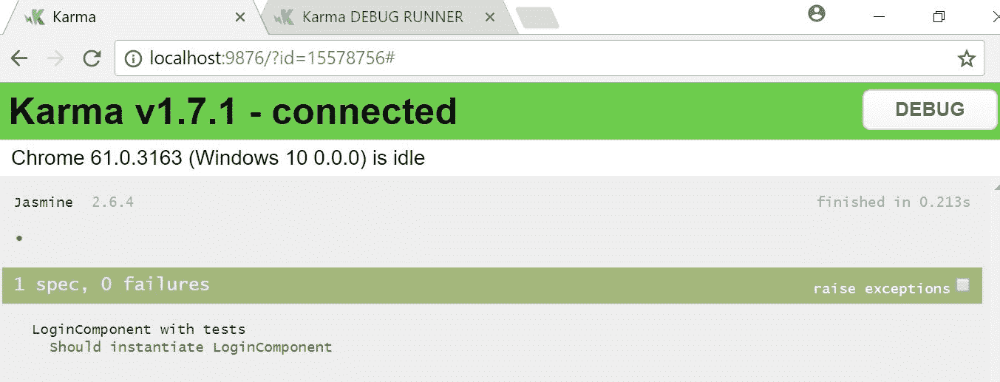
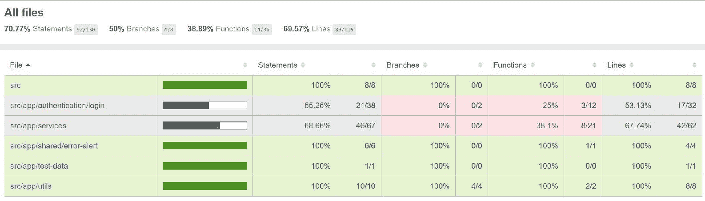

# 第十章：单元测试我们的应用程序

在本章中，我们将详细讲解 Angular 测试。我们将从 Angular 测试的基本介绍开始，了解用于单元测试的工具和技术。我们将使用 Angular 测试框架为我们的登录组件编写单元测试，并配置一个依赖模块。我们还将对用户服务进行单元测试。作为测试的一部分，我们将为依赖服务或组件创建存根，以便我们只关注正在测试的类。我们将使用 Angular 框架对组件和服务进行单元测试，以便初始化依赖模块。我们将单独测试 Angular 管道，以便直接使用 `new` 关键字初始化管道。最后，我们将查看代码覆盖率。

在本章中，我们将涵盖以下主题：

+   Angular 测试简介

+   单元测试 Angular 组件

+   单元测试 Angular 服务

+   单元测试 Angular 管道

+   代码覆盖率简介

# Angular 测试简介

单元测试是软件开发生命周期的重要组成部分。单元测试的好处如下：

+   它有助于使我们的实现与设计保持一致

+   它有助于保护我们的应用程序免受回归的影响

+   如果我们有良好的测试用例，重构会变得更容易

Angular 提供了各种工具和技术来测试我们的应用程序。作为单元测试的一部分，我们将使用以下技术：

+   **Jasmine**：它为我们编写单元测试提供了基本框架。它附带一个 HTML 测试运行器，并在浏览器上运行。

+   **Angular 测试框架**：它与 Angular 框架一起提供，有助于为正在测试的 Angular 代码创建测试环境。它还为我们提供了访问 DOM 元素的能力。

+   **Karma**：我们使用 Karma 工具运行我们的应用程序。我们使用以下命令运行单元测试：

```js
$ng test
```

我们可以编写两种类型的 Angular 测试：

+   **使用 Angular 测试框架进行单元测试**：我们将使用 Angular 测试框架为我们的组件和服务编写单元测试。这将创建一个测试环境，并为我们提供访问 Angular 框架各个元素的能力。

+   **隔离单元测试**：我们可以编写不依赖 Angular 的独立单元测试。这种单元测试对于测试服务和管道非常有用。在本章中，我们将以这种方式测试我们的日期管道。

值得注意的是，当你能够做到的时候，始终最好坚持使用隔离单元测试，并尽可能少地编写集成和端到端测试，因为隔离单元测试最容易维护。

# 单元测试 Angular 组件

在本节中，我们将编写第一个针对登录组件的 Angular 测试。编写测试用例涉及的步骤如下：

1.  **识别测试的类**：编写单元测试用例的第一步是识别依赖项。登录组件的`constructor`显示了所有依赖项，并且依赖于`UserService`、`Router`、`AuthenticationService`和`AngularFireAuth`：

```js
constructor(private userService: UserService,
         private router: Router,
         private authService: AuthenticationService,
         private angularFireAuth: AngularFireAuth)
```

1.  **创建所有模拟或存根类**：一旦我们识别了所有依赖项，我们需要消除这些外部依赖项，并专注于测试的组件类。因此，我们创建模拟或存根类来消除这些依赖项。

在登录组件中，我们使用用户服务通过`getUser()`方法检索用户信息，因此我们创建了一个具有`getUser()`方法的`UserServiceStub`，该方法返回封装在`Observable`对象中的模拟用户；我们为模拟用户创建了一个包含用户详情的测试数据类，如下所示：

```js
class UserServiceStub {

   getUser(): Observable<User> {
      return Observable.of(mockUserJSON);
   }

}
```

这是`user-test-data.ts`文件的示例：

```js
export const mockUserJSON = {
   email: 'user@gmail.com',
   friendcount: 0,
   image: '',
   mobile: '9999999999',
   name: 'User',
   uid: 'XXXX'
};
```

登录组件中我们使用认证服务进行登录和重置密码，因此我们创建了一个具有空的`login()`和`resetPassword()`方法的`AuthenticationServiceStub`类：

```js
class AuthenticationServiceStub {

   login(email: string, password: string) {}

   resetPassword(email: string) {}
}
```

`AngularFireAuth`类是 Angular 的 Fire 库的一部分。这个类负责我们应用中的认证，并包含一个`auth`对象，因此我们也为`auth`类创建了一个存根：

```js
class AngularFireAuthStub {
   readonly auth: AuthStub = new AuthStub();,
}
```

这是`AuthStub`类：

```js
class AuthStub {

   onAuthStateChanged() {
      return Observable.of({uid: '1234'});
   }
}
```

最后，我们使用路由器导航到应用中的页面。这个提供者是 Angular 框架的一部分。我们也为这个类创建了一个存根：

```js
class RouterStub {
   navigateByUrl(url: string) {
      return url;
   }
}
```

1.  **创建测试套件**：一旦我们消除了外部依赖项，我们可以在 Jasmine 框架的`describe()`方法中创建测试套件。此方法接受测试套件的`description`和用于 Jasmine 框架的`specDefinitions`函数来调用 spec 的内部套件：

```js
describe(description: string, specDefinitions: () => void)
```

1.  **创建测试环境**：我们为要测试的组件创建 Angular 测试环境。Angular 提供了一个`TestBed`类来创建测试环境；它初始化依赖模块、提供者、服务和组件。我们在`beforeEach()`方法中调用`TestBed.configureTestingModule()`方法，以便在每次测试用例执行之前配置模块：

```js
beforeEach(async(() => {

  TestBed.configureTestingModule({
    declarations: [
      LoginComponent,
      ErrorAlertComponent
    ],
    imports: [
      CommonModule,
      BrowserModule,
      FormsModule
    ],
    providers: [
      {provide: UserService, useClass: UserServiceStub},
      {provide: Router, useClass: RouterStub},
      {provide: AuthenticationService, useValue: mockAuthService},
      {provide: AngularFireAuth, useClass: AngularFireAuthStub}
    ]
  }).compileComponents();
}));
```

1.  **初始化测试对象**：一旦我们配置了模块，我们可以使用`TestBed.createComponent()`创建一个登录组件固定装置，并初始化登录组件和调试元素：

```js
beforeEach(() => {
   fixture = TestBed.createComponent(LoginComponent);
   component = fixture.componentInstance;
   de = fixture.debugElement;
   fixture.detectChanges();
});
```

1.  **编写第一个测试用例**：最后的步骤是编写测试用例。我们的第一个测试用例是检查登录组件是否已实例化。我们将在`it()`方法中编写测试用例，并使用`expect()`来验证实例：

```js
it('Should instantiate LoginComponent', async(() => {
   expect(component instanceof LoginComponent).toBe(true,
      'LoginComponent not created');
}));
```

1.  **销毁创建的实例**：在每个测试用例之后，我们在`afterEach()`方法中清除实例，如下所示：

```js
afterEach(async(() => {
   fixture.detectChanges();
   fixture.whenStable().then(() => fixture.destroy());
}));
```

1.  **运行测试**：最后，我们使用以下命令运行我们的第一个测试用例：

```js
$ng test
```

在其成功运行后，它将在浏览器中打开，并显示状态为 1 个 spec 成功，0 个失败：



1.  **添加更多单元测试**：在下一个测试用例中，我们检查当用户输入他们的电子邮件和密码并点击登录按钮时，我们的服务中的 `login` 方法是否被调用。首先，我们初始化 DOM 元素，例如电子邮件输入文本、密码输入文本和登录按钮。接下来，我们初始化电子邮件和密码的默认值，并 `spyOn` 服务中的登录方法，以便在用户点击登录按钮时调用此模拟方法。点击登录按钮后，我们调用 `detectChanges()` 通知 DOM 刷新元素。最后，我们验证 `login()` 方法应该被调用：

```js
it('Should call login', async(() => {
   const loginButton = de.query(By.css('#login-btn'));
   expect(loginButton).not.toBeNull('Login button not found');

   spyOn(mockAuthService, 'login').and.callThrough();
   de.query(By.css('#email')).nativeElement.value = 
   'user@gmail.com';
   de.query(By.css('#password')).nativeElement.value = 'password';
   fixture.detectChanges();

   // Click on Login button 
   loginButton.nativeElement.click();
   fixture.detectChanges();
   expect(mockAuthService.login).toHaveBeenCalled();
}));
```

现在是 `login.component.spec.ts` 文件：

```js
import {async, ComponentFixture, TestBed} from '@angular/core/testing';
import {LoginComponent} from './login.component';
import {Router} from '@angular/router';
import {UserService} from '../../services/user.service';
import {Observable} from 'rxjs/Observable';
import {User} from '../../services/user';
import {mockUserJSON} from '../../test-data/user-test-data';
import {AuthenticationService} from '../../services/authentication.service';
import {AngularFireAuth} from 'angularfire2/auth';
import {CommonModule} from '@angular/common';
import {BrowserModule, By} from '@angular/platform-browser';
import {FormsModule} from '@angular/forms';
import {DebugElement} from '@angular/core';
import {ErrorAlertComponent} from '../../shared/error-alert/error-alert.component';

class RouterStub {
  navigateByUrl(url: string) {
    return url;
  }
}

class UserServiceStub {

  getUser(): Observable<User> {
    return Observable.of(mockUserJSON);
  }

}

class AuthenticationServiceStub {

  login(email: string, password: string) {
  }

  resetPassword(email: string) {
  }
}

class AngularFireAuthStub {
  readonly auth: AuthStub = new AuthStub();
}

class AuthStub {

  onAuthStateChanged() {
    return Observable.of({uid: '1234'});
  }
}

describe('LoginComponent with tests', () => {

  let fixture: ComponentFixture<LoginComponent>;
  let component: LoginComponent;
  let de: DebugElement;
  const mockAuthService: AuthenticationServiceStub = new 
  AuthenticationServiceStub();

  beforeEach(async(() => {

    TestBed.configureTestingModule({
      declarations: [
        LoginComponent,
        ErrorAlertComponent
      ],
      imports: [
        CommonModule,
        BrowserModule,
        FormsModule
      ],
      providers: [
        {provide: UserService, useClass: UserServiceStub},
        {provide: Router, useClass: RouterStub},
        {provide: AuthenticationService, useValue: mockAuthService},
        {provide: AngularFireAuth, useClass: AngularFireAuthStub}
      ]
    }).compileComponents();
  }));

  beforeEach(() => {
    fixture = TestBed.createComponent(LoginComponent);
    component = fixture.componentInstance;
    de = fixture.debugElement;
    fixture.detectChanges();
  });

  afterEach(async(() => {
    fixture.detectChanges();
    fixture.whenStable().then(() => fixture.destroy());
  }));

  it('Should instantiate LoginComponent', async(() => {
    expect(component instanceof LoginComponent).toBe(true,
      'LoginComponent not created');
  }));

  it('Should call login', async(() => {
    const loginButton = de.query(By.css('#login-btn'));
    expect(loginButton).not.toBeNull('Login button not found');

    spyOn(mockAuthService, 'login').and.callThrough();
    de.query(By.css('#email')).nativeElement.value = 'user@gmail.com';
    de.query(By.css('#password')).nativeElement.value = 'password';
    fixture.detectChanges();

    // Login button is enabled
    expect(loginButton.nativeElement.disabled).toBe(false);
    loginButton.nativeElement.click();
    fixture.detectChanges();
    expect(mockAuthService.login).toHaveBeenCalled();
  }));

});
```

# 单元测试 Angular 服务

在本节中，我们单元测试 Angular 服务，并为我们的用户服务编写测试用例。单元测试服务的步骤与我们的组件相同。

编写单元测试用例的第一步是分析依赖组件，因为我们看到用户服务依赖于 `AngularFireDatabase` 并初始化 Firebase 存储对象：

```js
constructor(private fireDb: AngularFireDatabase)
```

因此，我们为这个依赖对象创建了一个模拟，例如 `AngularFireDatabaseStub`，它包含其他依赖模拟，如 `AngularFireAppStub` 和 `AngularFireObjectStub` 对象引用以及 `object()` 方法：

```js
class AngularFireDatabaseStub {

   app: AngularFireAppStub = new AngularFireAppStub;

   angularFireObject: AngularFireObjectStub;

   constructor(angularFireObject: AngularFireObjectStub) {
      this.angularFireObject = angularFireObject;
   }

   object(pathOrRef: PathReference): AngularFireObjectStub {
      return this.angularFireObject;
   }
}
```

以下是一个带有空模拟方法的 `AngularFireAppStub` 模拟类：

```js
class AngularFireAppStub {

   storage() {}
}
```

以下是一个空的模拟方法的 `AngularFireObjectStub` 模拟类：

```js
class AngularFireObjectStub {

   set() {}

   valueChanges() {}

   update() {}

}
```

下一步是使用 `TestBed` 初始化测试环境，并通过 `TestBed.get()` 获取用户服务对象：

```js
const angularFireObject: AngularFireObjectStub = new AngularFireObjectStub();
const mockAngularFireDatabase: AngularFireDatabaseStub = new AngularFireDatabaseStub(angularFireObject);
let userService: UserService;

beforeEach(() => {
   TestBed.configureTestingModule({
      providers: [
         {provide: AngularFireDatabase, useValue: 
          mockAngularFireDatabase},
         {provide: UserService, useClass: UserService}
      ]
   });
   userService = TestBed.get(UserService);
});
```

现在，我们将开始编写我们的用户服务的测试用例。我们将涵盖以下用户服务的测试用例：

+   第一个测试用例是将用户添加到 Firebase 数据库。我们将向 Angular 的 fire 对象的 `set` 方法添加 `spyOn` 并使用模拟用户调用添加用户方法；然后我们期望 Angular fire 对象的 `set` 方法被调用：

```js
it('Add user', () => {
   spyOn(angularFireObject, 'set');
   userService.addUser(mockUserJSON);
   expect(angularFireObject.set).toHaveBeenCalled();
});
```

下一个测试用例是从 Firebase 数据库接收我们的用户。我们添加 `spyOn` Angular 的 fire 对象的值变化方法，它返回一个模拟用户。然后我们调用 `getUser` 方法，订阅 `Observable` 对象，然后验证方法调用，并使用预期值测试我们的模拟用户的内容：

```js
it('getUser return valid user', () => {
   spyOn(angularFireObject, 
   'valueChanges').and.returnValue(Observable.of(mockUserJSON));
   userService.getUser(mockUserJSON.uid).subscribe((user) => {
      expect(angularFireObject.valueChanges).toHaveBeenCalled();
      expect(user.uid).toBe(mockUserJSON.uid);
      expect(user.name).toBe(mockUserJSON.name);
      expect(user.mobile).toBe(mockUserJSON.mobile);
      expect(user.email).toBe(mockUserJSON.email);
   });

});
```

1.  下一个测试用例是将用户保存到 `member` 变量中。在这个测试用例中，我们将一个模拟用户保存到一个 `Observable` 中，然后使用 `get` 方法检索用户，并验证模拟用户的所有属性：

```js
it('saveUser saves user in Subject', () => {
   userService.saveUser(mockUserJSON);
   userService.getSavedUser().subscribe((user) => {
      expect(user.uid).toBe(mockUserJSON.uid);
      expect(user.name).toBe(mockUserJSON.name);
      expect(user.mobile).toBe(mockUserJSON.mobile);
      expect(user.email).toBe(mockUserJSON.email);
   });

});
```

1.  下一个测试用例是更新 Firebase 数据库中的电子邮件，并更新用户服务类中的缓存用户对象；我们 `spyOn` Angular 的 fire 对象的 `update` 方法，传递一个新电子邮件以更新 `email` 方法，这将更新 Firebase 数据库和缓存用户对象，测试 Firebase 数据库调用，从 `get` 方法检索用户，并验证模拟用户的所有属性：

```js
it('updateEmail update the email', () => {
   spyOn(angularFireObject, 'update');
   userService.saveUser(mockUserJSON);
   mockUserJSON.email = 'user1@gmail.com';
   userService.updateEmail(mockUserJSON , mockUserJSON.email);
   userService.getSavedUser().subscribe((user) => {
      expect(angularFireObject.update).toHaveBeenCalled();
      expect(user.email).toBe(mockUserJSON.email);
   });

});
```

现在是 `user.service.spec.ts` 文件：

```js
import {UserService} from './user.service';
import {AngularFireDatabase, PathReference} from 'angularfire2/database';
import {FirebaseApp} from 'angularfire2';
import {mockUserJSON} from '../test-data/user-test-data';
import {AngularFireAuth} from 'angularfire2/auth';
import {TestBed} from '@angular/core/testing';
import {Observable} from 'rxjs/Observable';
import {User} from './user';

class AngularFireDatabaseStub {

   app: AngularFireAppStub = new AngularFireAppStub;

   angularFireObject: AngularFireObjectStub;

   constructor(angularFireObject: AngularFireObjectStub) {
      this.angularFireObject = angularFireObject;
   }

   object(pathOrRef: PathReference): AngularFireObjectStub {
      return this.angularFireObject;
   }
}

class AngularFireAppStub {

   storage() {}
}

class AngularFireObjectStub {

   set() {}

   valueChanges() {}

   update() {}

}

describe('User service test suites', () => {

   const angularFireObject: AngularFireObjectStub = new 
   AngularFireObjectStub();
   const mockAngularFireDatabase: AngularFireDatabaseStub = new 
   AngularFireDatabaseStub(angularFireObject);
   let userService: UserService;

   beforeEach(() => {
      TestBed.configureTestingModule({
         providers: [
            {provide: AngularFireDatabase, useValue: 
             mockAngularFireDatabase},
            {provide: UserService, useClass: UserService}
         ]
      });
      userService = TestBed.get(UserService);
   });

   it('Add user', () => {
      spyOn(angularFireObject, 'set');
      userService.addUser(mockUserJSON);
      expect(angularFireObject.set).toHaveBeenCalled();
   });

   it('getUser return valid user', () => {
      spyOn(angularFireObject, 
      'valueChanges').and.returnValue(Observable.of(mockUserJSON));
      userService.getUser(mockUserJSON.uid).subscribe((user) => {
         expect(angularFireObject.valueChanges).toHaveBeenCalled();
         expect(user.uid).toBe(mockUserJSON.uid);
         expect(user.name).toBe(mockUserJSON.name);
         expect(user.mobile).toBe(mockUserJSON.mobile);
         expect(user.email).toBe(mockUserJSON.email);
      });

   });

   it('saveUser saves user in Subject', () => {
      userService.saveUser(mockUserJSON);
      userService.getSavedUser().subscribe((user) => {
         expect(user.uid).toBe(mockUserJSON.uid);
         expect(user.name).toBe(mockUserJSON.name);
         expect(user.mobile).toBe(mockUserJSON.mobile);
         expect(user.email).toBe(mockUserJSON.email);
      });

   });

   it('updateEmail update the email', () => {
      spyOn(angularFireObject, 'update');
      userService.saveUser(mockUserJSON);
      mockUserJSON.email = 'user1@gmail.com';
      userService.updateEmail(mockUserJSON , mockUserJSON.email);
      userService.getSavedUser().subscribe((user) => {
         expect(angularFireObject.update).toHaveBeenCalled();
         expect(user.email).toBe(mockUserJSON.email);
      });

   });

   it('updateMobile update the mobile', () => {
      spyOn(angularFireObject, 'update');
      userService.saveUser(mockUserJSON);
      mockUserJSON.mobile = '88888888';
      userService.updateEmail(mockUserJSON , mockUserJSON.mobile);
      userService.getSavedUser().subscribe((user) => {
         expect(angularFireObject.update).toHaveBeenCalled();
         expect(user.mobile).toBe(mockUserJSON.mobile);
      });
   });
});
```

# 单元测试 Angular 管道

Angular 管道单元测试是独立于 Angular 测试环境测试类的示例。在这个例子中，我们测试了我们的朋友日期管道类，并在测试类中创建了对象：

```js
const pipe = new FriendsDatePipe();
```

在此对象上，我们将编写以下两个测试用例：

1.  首先，测试绿色字段场景，即我们传递一个有效的日期（以毫秒为单位），并测试转换后的人类可读日期格式

1.  第二，测试边缘情况场景，即我们传递一个无效日期`-1`，并期望返回一个字符串值`"Invalid Date"`

```js
import {FriendsDatePipe} from './friendsdate.pipe';

describe('friendsdatepipe', () => {

   const pipe = new FriendsDatePipe();

   it('Transform dateInMillis to MM/DD/YY', () => {
      expect(pipe.transform('1506854340801')).toBe('10/01/17');
   });

   it('Transform invalid date', () => {
      expect(pipe.transform('-1')).toBe('Invalid Date');
   });

});
```

# 代码覆盖率

应用程序的代码覆盖率反映了我们代码的整体覆盖率。这为我们提供了代码行和函数覆盖率的概述，以便我们可以编写更多的测试用例来覆盖代码的其他部分。

我们可以在`package.json`中启用代码覆盖率，如下所示：

```js
"scripts": {
  "ng": "ng",
  "start": "ng serve",
  "build": "ng build",
  "test": "ng test --sourcemaps false",
  "coverage": "ng test --sourcemaps false --watch=false 
   --code-coverage",
  "lint": "ng lint",
  "e2e": "ng e2e"
}
```

我们将执行以下命令，该命令运行测试用例，并创建一个`coverage`文件夹，其中包含`index.html`以显示覆盖率统计信息：

```js
$ng test --codeCoverage
```

当我们打开`index.html`时，它显示了一个包含覆盖率概览的美丽表格：



# 摘要

在本章中，我们介绍了单元测试，并讨论了 Angular 单元测试中的各种术语和术语。我们为我们的登录组件实现了单元测试，覆盖了`TestBed`，并配置了我们的模块。我们为我们的服务编写了单元测试，为外部依赖类创建了存根，并在我们的模块中注入了这些存根类。我们还为 Angular 管道编写了隔离的测试用例。最后，我们讨论了代码覆盖率，并为我们规格运行了代码覆盖率。

在下一章中，我们将讨论调试技术。这将帮助我们更快地解决问题和调试。
