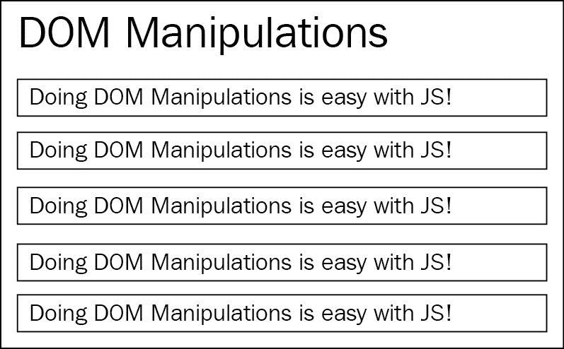
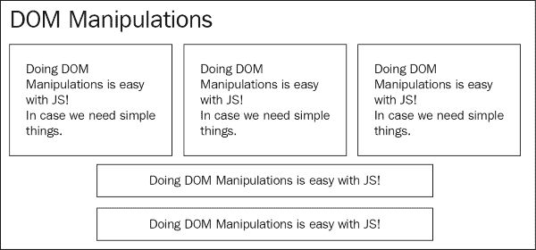
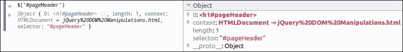
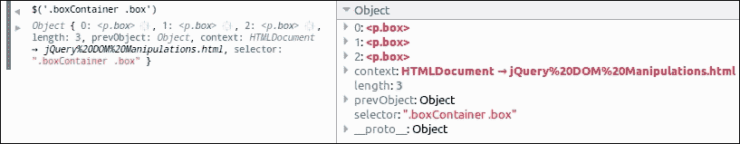
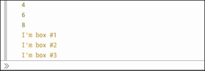

# 第一章：jQuery 和复合模式复习。

直到 **Web 2.0** 时代开始，Web 只是基于文档的媒体，它所提供的仅仅是连接不同页面/文档和客户端脚本编写，大多数情况下仅限于表单验证。到 2005 年，Gmail 和 Google 地图发布了，JavaScript 证明了自己是大型企业用于创建大规模应用程序并提供丰富用户界面交互的语言。

尽管 JavaScript 自发布以来几乎没有什么变化，但企业界对网页应该具备的功能期望发生了巨大变化。从那时起，Web 开发人员需要提供复杂的用户交互，并最终，"Web 应用程序" 这个术语出现在市场上。因此，开始变得明显，他们应该创建一些代码抽象，定义一些最佳实践，并采用计算机科学提供的所有适用的 **设计模式**。JavaScript 作为企业级应用程序的广泛采用帮助了语言的发展，随着 **EcmaScript2015**/**EcmaScript6**（**ES6**）规范的发布，语言得以扩展，以便更轻松地利用更多的设计模式。

2006 年 8 月，John Resig 在 [`jquery.com`](http://jquery.com) 首次发布了 jQuery 库，旨在创建一个方便的 API 来定位 DOM 元素。从那时起，它已成为 Web 开发人员工具包的一个组成部分。jQuery 在其核心中使用了几种设计模式，并通过提供的方法试图敦促开发人员使用它们。复合模式是其中之一，它通过非常核心的 `jQuery()` 方法向开发人员公开，该方法用于 DOM 遍历，这是 jQuery 库的一个亮点。

在本章中，我们将：

+   通过 jQuery 进行 DOM 脚本编写的复习。

+   介绍复合模式。

+   看看 jQuery 如何使用复合模式。

+   讨论 jQuery 相对于纯 JavaScript DOM 操作所带来的优势。

+   介绍迭代器模式。

+   在一个示例应用中使用迭代器模式。

# jQuery 和 DOM 脚本编写。

通过 DOM 脚本编写，我们指的是在浏览器加载后修改或操作网页元素的任何过程。DOM API 是一种 JavaScript API，于 1998 年标准化，它为网页开发人员提供了一组方法，允许在加载和解析网页的 HTML 代码后操作浏览器创建的 DOM 树元素。

### 注意。

要了解有关 **文档对象模型**（**DOM**）及其 API 的更多信息，您可以访问 [`developer.mozilla.org/en-US/docs/Web/API/Document_Object_Model/Introduction`](https://developer.mozilla.org/en-US/docs/Web/API/Document_Object_Model/Introduction)。

通过在他们的 JavaScript 代码中利用 DOM API，web 开发者可以操纵 DOM 的节点，并向页面添加新元素或删除现有元素。最初 DOM 脚本的主要用例仅限于客户端表单验证，但随着时间的推移和 JavaScript 获得企业界的信任，开始实现更复杂的用户交互。

jQuery 库的初始版本于 2006 年 8 月首次发布，它试图简化 web 开发者遍历和操纵 DOM 树的方式。其主要目标之一是提供抽象，以产生更短、更易读、更不容易出错的代码，同时确保跨浏览器的互操作性。

jQuery 遵循的这些核心原则在其主页中清晰可见，它将自己呈现为：

> …一个快速、小巧且功能丰富的 JavaScript 库。它通过一个易于使用的 API，简化了 HTML 文档遍历和操纵、事件处理、动画和 Ajax，适用于众多浏览器。jQuery 结合了多功能性和可扩展性，改变了数百万人编写 JavaScript 的方式。

jQuery 从一开始提供的抽象 API，以及不同的设计模式是如何编排的，导致在 web 开发者中得到了广泛的接受。因此，根据多个来源（例如 BuiltWith.com ([`trends.builtwith.com/javascript/jQuery`](http://trends.builtwith.com/javascript/jQuery)）），全球访问量最高的网站中有超过 60% 的网站引用了 jQuery 库。

## 使用 jQuery 操纵 DOM

为了对 jQuery 进行复习，我们将通过一个示例网页进行一些简单的 DOM 操作。在这个例子中，我们将加载一个简单结构的页面，最初看起来像下图所示：



我们将使用一些 jQuery 代码来更改页面的内容和布局，并且为了使其效果清晰可见，我们将设置它在页面加载后约`700 milliseconds`运行。我们的操作结果将如下图所示：



现在让我们回顾一下前面示例所需的 HTML 代码：

```js
<!DOCTYPE html> 
<html> 
  <head> 
    <title>DOM Manipulations</title> 
    <link rel="stylesheet" type="text/css" href="dom-manipulations.css">
  </head> 
  <body> 
    <h1 id="pageHeader">DOM Manipulations</h1> 

    <div class="boxContainer"> 
      <div> 
        <p class="box"> 
          Doing DOM Manipulations is easy with JS! 
        </p> 
      </div> 
      <div> 
        <p class="box"> 
          Doing DOM Manipulations is easy with JS! 
        </p> 
      </div> 
      <div> 
        <p class="box"> 
          Doing DOM Manipulations is easy with JS! 
        </p> 
      </div> 
    </div> 

    <p class="box"> 
      Doing DOM Manipulations is easy with JS! 
    </p> 
    <p class="box"> 
      Doing DOM Manipulations is easy with JS! 
    </p>

    <script type="text/javascript" src="img/jquery-2.2.0.min.js"></script>
    <script type="text/javascript" src="img/jquery-dom-manipulations.js"></script>
  </body>
</html>
```

使用的 CSS 代码非常简单，只包含三个 CSS 类，如下所示：

```js
.box {
    padding: 7px 10px;
    border: solid 1px #333;
    margin: 5px 3px;
    box-shadow: 0 1px 2px #777;
}

.boxsizer {
    float: left;
    width: 33.33%;
}

.clear { clear: both; }
```

前述代码在浏览器中打开并在执行我们的 JavaScript 代码之前，页面看起来像第一个图示所示。在前述 CSS 代码中，我们首先为 `box`、`boxsizer` 和 `clear` CSS 类定义了一些基本样式。`box` 类通过一些填充、一条细边框、周围一些间距和在元素下方创建一个小阴影来为页面中的相关元素添加样式，使它们看起来像一个盒子。`boxsizer` 类将使用它的元素的宽度设置为其父元素的 1/3，并创建一个三列布局。最后，`clear` 类将用于元素作为列布局的断点，以使其后的所有元素都位于其下方。`boxsizer` 和 `clear` 类最初未被 HTML 代码中定义的任何元素使用，但会在我们将在 JavaScript 中进行的 DOM 操作之后使用。

在我们的 HTML 的 `<body>` 元素中，我们最初定义了一个带有 ID `pageHeader` 的 `<h1>` 标题元素，以便通过 JavaScript 轻松选择。紧接着，在它下面，我们定义了五个段落元素 (`<p>`)，具有 `box` 类，前三个元素被包裹在三个 `<div>` 元素中，然后再包裹在另一个具有 `boxContainer` 类的 `<div>` 元素中。

到达我们的两个 `<script>` 标签时，我们首先从 jQuery CDN 引入了对 jQuery 库的引用。有关更多信息，您可以访问 [`code.jquery.com/`](http://code.jquery.com/)。在第二个 `<script>` 标签中，我们引用了带有所需代码的 JavaScript 文件，例如：

```js
setTimeout(function() {
    $('#pageHeader').css('font-size', '3em');

    var $boxes = $('.boxContainer .box');
    $boxes.append(
      '<br /><br /><i>In case we need simple things</i>.');
    $boxes.parent().addClass('boxsizer');

    $('.boxContainer').append('<div class="clear">');
}, 700);
```

我们所有的代码都包装在一个 `setTimeout` 调用中以延迟其执行，根据之前描述的用例。`setTimeout` 函数调用的第一个参数是一个匿名函数，它将在定时器 700 毫秒过期后执行，如第二个参数中定义的那样。

在我们匿名回调函数的第一行，我们使用 jQuery 的 `$()` 函数遍历 DOM 并定位 ID 为 `pageHeader` 的元素，并使用 `css()` 方法将其 `font-size` 增加到 `3em`。接下来，我们向 `$()` 函数提供了一个更复杂的 CSS 选择器，来定位所有具有 `box` 类的元素，这些元素是具有 `boxContainer` 类的元素的后代，然后将结果存储在名为 `$boxes` 的变量中。

### 提示

**变量命名约定**

在开发者中使用命名约定来命名持有特定类型对象的变量是一种常见做法。使用这种约定不仅有助于你记住变量持有的内容，还能使你的代码更易于其他团队成员理解。在 jQuery 开发者中，当变量存储了 `$()` 函数的结果（也称为 jQuery 集合对象）时，使用以 "$" 符号开头的变量名是常见的。

在获取我们感兴趣的`box`元素之后，我们在每个元素的末尾添加两个换行空格和一些额外的斜体文本。然后，我们使用`$boxes`变量遍历 DOM 树，使用`parent()`方法上升一个级别。`parent()`方法返回一个不同的 jQuery 对象，其中包含我们最初选择的框的父`<div>`元素，然后我们链式调用`addClass()`方法将它们分配给`boxsizer` CSS 类。

### 小贴士

如果您需要遍历所选元素的所有父节点，则可以使用`$.fn.parents()`方法。如果您只需要找到与给定 CSS 选择器匹配的第一个祖先元素，请考虑改用`$.fn.closest()`方法。

最后，由于`boxsizer`类使用浮动来实现三列布局，我们需要清除`boxContainer`中的浮动。再次，我们使用简单的`.boxContainer` CSS 选择器和`$()`函数遍历 DOM。然后，我们调用`.append()`方法创建一个带有`.clear` CSS 类的新`<div>`元素，并将其插入到`boxContainer`的末尾。

700 毫秒后，我们的 jQuery 代码将完成，结果是之前显示的三列布局。在其最终状态下，我们的`boxContainer`元素的 HTML 代码如下所示：

```js
<div class="boxContainer"> 
 <div class="boxsizer"> 
    <p class="box"> 
      Doing DOM Manipulations is easy with JS! 
 <br><br><i>In case we need simple things</i>. 
    </p> 
  </div> 
 <div class="boxsizer"> 
    <p class="box"> 
      Doing DOM Manipulations is easy with JS! 
 <br><br><i>In case we need simple things</i>. 
    </p> 
  </div> 
 <div class="boxsizer"> 
    <p class="box"> 
      Doing DOM Manipulations is easy with JS! 
 <br><br><i>In case we need simple things</i>. 
    </p> 
  </div> 
 <div class="clear"></div> 
</div> 
```

### 方法链和流畅接口

实际上，在上面的示例中，我们还可以进一步将所有三个与框相关的代码语句合并为一个，其效果如下所示：

```js
$('.boxContainer .box') 
  .append('<br /><br /><i>In case we need simple things</i>.') 
  .parent() 
  .addClass('boxsizer');
```

这种语法模式被称为**方法链**，并且被 jQuery 和 JavaScript 社区广泛推荐。方法链是流畅接口的面向对象实现模式的一部分，其中每个方法将其指令上下文传递给后续方法。

大多数适用于 jQuery 对象的 jQuery 方法也会返回相同或新的 jQuery 元素集合对象。这使我们能够链式调用多个方法，不仅使代码更易读和表达，而且减少了所需的变量声明。

# 组合模式

组合模式的关键概念是使我们能够像处理单个对象实例一样处理对象集合。通过在集合上使用方法来操作组合将导致将操作应用于其每个部分。这样的方法可以成功应用，而不管组合集合中包含的元素数量如何，甚至当集合不包含元素时也可以。

另外，组合集合的对象不一定需要提供完全相同的方法。组合对象可以只公开集合对象中对象之间共同的方法，或者可以提供一个抽象的 API，并适当处理每个对象的方法差异。

让我们继续探讨 jQuery 公开的直观 API 如何受到组合模式的高度影响。

## jQuery 如何使用组合模式

组合模式是 jQuery 架构的一个组成部分，并且从 `$()` 函数的核心自身应用。 对 `$()` 函数的每次调用都会创建并返回一个元素集合对象，这通常简称为 jQuery 对象。 这正是我们看到组合模式的第一个原则的地方； 实际上，`$()` 函数不是返回单个元素，而是返回一组元素。

返回的 jQuery 对象是一个类似数组的对象，充当包装对象并携带检索到的元素集合。 它还公开了一些额外的属性，如下所示：

+   检索到的元素集合的 `length`

+   对象构造的 `context`

+   在 `$()` 函数调用中使用的 CSS `selector`

+   在链式调用方法后如果我们需要访问先前的元素集合，则有一个 `prevObject` 属性

### 提示

**简单的类似数组对象定义**

类似数组的对象是具有数字 `length` 属性和相应数量的属性的 JavaScript 对象 `{ }`，具有连续的数字属性名称。 换句话说，具有 `length == 2` 属性的类似数组对象预计也应该定义两个属性 `"0"` 和 `"1"`。 给定上述属性，类似数组的对象允许您使用简单的 `for` 循环访问它们的内容，通过利用 JavaScript 的括号属性访问器的语法：

```js
for (var i = 0; i < obj.length; i++) { 
  console.log(obj[i]); 
}
```

我们可以轻松地尝试使用 `$()` 函数返回的 jQuery 对象，并通过使用我们喜爱的浏览器的开发者工具检查上述属性。 要在大多数浏览器上打开开发者工具，我们只需要在 Windows 和 Linux 上按下 *F12*，或在 Mac 上按 *Cmd* + *Opt* + *I*，然后我们可以在控制台中发出一些 `$()` 调用并单击返回的对象以检查它们的属性。

在下图中，我们可以看到在之前示例中使用的 `$('#pageHeader')` 调用的结果在 Firefox 开发者工具中的样子：



`$('.boxContainer .box')` 调用的结果如下：



jQuery 使用类似数组的对象作为返回元素的包装器，从而使其能够公开一些额外的适用于返回的集合的方法。这是通过原型继承 `jQuery.fn` 对象来实现的，导致每个 jQuery 对象也可以访问 jQuery 提供的所有方法。这完成了组合模式，该模式提供了适用于集合的方法，这些方法适用于集合的每个成员。因为 jQuery 使用类似数组的对象具有原型继承，所以这些方法可以轻松地作为每个 jQuery 对象的属性访问，就像本章开头的示例中所示：`$('#pageHeader').css('font-size', '3em');`。此外，jQuery 还为其 DOM 操作代码添加了一些额外的好处，遵循更小和更不容易出错的代码的目标。例如，当使用 `jQuery.fn.html()` 方法更改已包含子元素的 DOM 节点的内部 HTML 时，jQuery 首先尝试删除与子元素关联的任何数据和事件处理程序，然后再将它们从页面中删除并附加所提供的 HTML 代码。

让我们看一下 jQuery 如何实现这些适用于集合的方法。对于这个任务，我们可以从 jQuery 的 GitHub 页面下载并查看源代码（[`github.com/jquery/jquery/releases`](https://github.com/jquery/jquery/releases)），或者使用类似 jQuery 源代码查看器这样的工具，该工具可在[`james.padolsey.com/jquery`](http://james.padolsey.com/jquery)找到。

### 注意

根据您使用的版本，您可能会在某种程度上获得不同的结果。在编写本书时，作为参考的最新稳定版 jQuery 版本是 v2.2.0。

展示适用于集合的方法如何实现的最简单方法之一是 `jQuery.fn.empty()`。您可以通过搜索 `"empty:"` 或使用 jQuery 源代码查看器并搜索 `"jQuery.fn.empty"` 来轻松找到它在 jQuery 源代码中的实现。使用其中任一种方式都会带我们到以下代码：

```js
empty: function() { 
  var elem, i = 0; 

  for ( ; ( elem = this[ i ] ) != null; i++ ) {
    if ( elem.nodeType === 1 ) { 
      // Prevent memory leaks 
      jQuery.cleanData( getAll( elem, false ) ); 

      // Remove any remaining nodes 
      elem.textContent = ""; 
    } 
  } 

  return this; 
}
```

如您所见，代码一点也不复杂。jQuery 使用简单的 `for` 循环遍历集合对象的所有项（称为 `this`，因为我们在方法实现内部），对于集合的每个项，即元素节点，它都使用 `jQuery.cleanData()` 辅助函数清除任何 data-* 属性值，然后立即将其内容设置为空字符串。

### 注意

关于不同指定节点类型的更多信息，请访问[`developer.mozilla.org/en-US/docs/Web/API/Node/nodeType`](https://developer.mozilla.org/en-US/docs/Web/API/Node/nodeType)。

## 与普通 DOM API 相比的优势

为了清楚地展示复合模式提供的好处，我们将在不使用 jQuery 提供的抽象的情况下重新编写我们最初的示例。通过仅使用普通 JavaScript 和 DOM API，我们可以编写一个等效的代码，如下所示：

```js
setTimeout(function() { 
  var headerElement = document.getElementById('pageHeader'); 
  if (headerElement) { 
    headerElement.style.fontSize = '3em'; 
  } 
  var boxContainerElement = document.getElementsByClassName('boxContainer')[0]; 
  if (boxContainerElement) { 
    var innerBoxElements = boxContainerElement.getElementsByClassName('box'); 
    for (var i = 0; i < innerBoxElements.length; i++) { 
      var boxElement = innerBoxElements[i]; 
      boxElement.innerHTML +='<br /><br /><i>In case we need simple things</i>.'; 
      boxElement.parentNode.className += ' boxsizer'; 
    } 
    var clearFloatDiv = document.createElement('div'); 
    clearFloatDiv.className = 'clear'; 
    boxContainerElement.appendChild(clearFloatDiv); 
  } 
}, 700);
```

再次使用`setTimeout`与匿名函数，并将`700`毫秒设置为第二个参数。在函数内部，我们使用`document.getElementById`来检索已知在页面中具有唯一 ID 的元素，后来在需要检索具有特定类的所有元素时使用`document.getElementsByClassName`。我们还使用`boxContainerElement.getElementsByClassName('box')`来检索所有具有`box`类的元素，这些元素是具有`boxContainer`类的元素的后代。

最明显的观察是，在这种情况下，我们需要 18 行代码才能实现相同的结果。相比之下，当使用 jQuery 时，我们只需要 9 行代码，这是后面实现所需行数的一半。使用 jQuery 的`$()`函数与 CSS 选择器是检索所需元素的更简单的方法，它还确保与不支持`getElementsByClassName()`方法的浏览器的兼容性。然而，除了代码行数和改进的可读性之外，还有更多的好处。作为复合模式的实施者，`$()`函数始终检索元素集合，使我们的代码在与我们使用的每个`getElement*`方法的差异化处理相比更加统一。我们以完全相同的方式使用`$()`函数，无论我们是只想检索具有唯一 ID 的元素，还是具有特定类的一些元素。

作为返回类似数组的对象的额外好处，jQuery 还可以提供更方便的方法来遍历和操作 DOM，例如我们在第一个示例中看到的`.css()`、`.append()`和`.parent()`方法，它们作为返回对象的属性可访问。此外，jQuery 还提供了抽象更复杂的用例的方法，例如没有等效方法可用作 DOM API 的一部分的`.addClass()`和`.wrap()`。

由于返回的 jQuery 集合对象除了封装的元素不同之外，我们可以以相同的方式使用 jQuery API 的任何方法。正如我们前面所看到的，这些方法适用于检索到的每个元素，而不管元素计数如何。因此，我们不需要单独的`for`循环来迭代每个检索到的元素并分别应用我们的操作；相反，我们直接将我们的操作（例如`.addClass()`）应用到集合对象上。

为了在后面的示例中继续提供相同的执行安全保证，我们还需要添加一些额外的`if`语句来检查`null`值。这是必需的，因为，例如，如果未找到`headerElement`，将会发生错误，并且其余的代码行将永远不会被执行。有人可能会认为这些检查，如`if (headerElement)`和`if (boxContainerElement)`在本示例中不是必需的，可以省略。在这个示例中，这似乎是正确的，但实际上这是在开发大型应用程序时发生错误的主要原因之一，其中元素不断地被创建、插入和删除到 DOM 树中。不幸的是，所有语言和目标平台的程序员都倾向于首先编写他们的实现逻辑，然后在以后的某个时候填写这些检查，通常是在测试实现时出现错误后。

遵循复合模式，即使是一个空的 jQuery 集合对象（不包含任何检索到的元素），仍然是一个有效的集合对象，我们可以安全地应用 jQuery 提供的任何方法。因此，我们不需要额外的`if`语句来检查集合是否实际包含任何元素，然后应用诸如`.css()`之类的方法，仅仅是为了避免 JavaScript 运行时错误。

总的来说，jQuery 使用复合模式提供的抽象使得代码行数减少，更易读、统一，并且有更少的易出错行（比较输入`$('#elementID')`与`document.getElementById('elementID')`）。

## 使用复合模式开发应用程序

现在我们已经看到了 jQuery 如何在其架构中使用复合模式，并且还进行了比较以及提供的好处，让我们尝试编写一个自己的示例用例。我们将尝试涵盖本章中早期看到的所有概念。我们将结构化我们的复合对象以成为一个类似数组的对象，操作完全不同结构的对象，提供流畅的 API 以允许链式调用，并且具有应用于集合中所有项目的方法。

### 一个示例用例

假设我们有一个应用程序，某个时刻需要对数字执行操作。另一方面，它需要操作的项目来自不同的来源，且完全不统一。为了使这个示例有趣，假设数据的一个来源提供普通数字，另一个提供具有包含我们感兴趣数字的特定属性的对象：

```js
var numberValues = [2, 5, 8]; 

var objectsWithValues = [ 
    { value: 7 }, 
    { value: 4 }, 
    { value: 6 }, 
    { value: 9 } 
];
```

在我们使用情景的第二个来源返回的对象可能具有更复杂的结构，可能还有一些额外的属性。这些更改不会以任何方式区分我们的示例实现，因为在开发复合对象时，我们只对提供对目标项目的共同部分进行统一处理感兴趣。

### 复合集合实现

让我们继续并定义构造函数和原型，来描述我们的组合集合对象：

```js
function ValuesComposite() { 
    this.length = 0; 
} 

ValuesComposite.prototype.append = function(item) { 
    if ((typeof item === 'object' && 'value' in item) || 
        typeof item === 'number') { 
        this[this.length] = item; 
        this.length++; 
    } 

    return this; 
}; 

ValuesComposite.prototype.increment = function(number) { 
    for (var i = 0; i < this.length; i++) { 
        var item = this[i]; 
        if (typeof item === 'object' && 'value' in item) { 
            item.value += number; 
        } else if (typeof item === 'number') { 
            this[i] += number; 
        } 
    } 

    return this; 
}; 

ValuesComposite.prototype.getValues = function() { 
    var result = []; 
    for (var i = 0; i < this.length; i++) { 
        var item = this[i]; 
        if (typeof item === 'object' && 'value' in item) { 
            result.push(item.value); 
        } else if (typeof item === 'number') { 
            result.push(item); 
        } 
    } 
    return result; 
};
```

在我们的例子中，`ValuesComposite()` 构造函数非常简单。当使用 `new` 操作符调用时，它返回一个长度为零的空对象，表示它包装的集合是空的。

### 注意

有关 JavaScript 基于原型的编程模型的更多信息，请访问 [`developer.mozilla.org/zh-CN/docs/Web/JavaScript/Introduction_to_Object-Oriented_JavaScript`](https://developer.mozilla.org/zh-CN/docs/Web/JavaScript/Introduction_to_Object-Oriented_JavaScript)。

我们首先需要定义一种方法，使我们能够填充我们的组合集合对象。我们定义了 `append` 方法，该方法检查提供的参数是否是它可以处理的类型之一；在这种情况下，它将参数附加到组合对象上的下一个可用数字属性，并增加 `length` 属性值。例如，第一个附加的项，无论是具有值属性的对象还是纯数字，都将暴露给组合对象的 "`0`" 属性，并可以使用括号属性访问者的语法访问为 `myValuesComposition[0]`。

`increment` 方法被呈现为一个简单的例子方法，可以通过操作所有集合项来操作这些集合。它接受一个数字值作为参数，然后根据它们的类型适当地处理它，将它添加到我们集合的每个项中。由于我们的组合是类似于数组的对象，`increment` 使用 `for` 循环来迭代所有集合项，并增加 `item.value`（如果项是对象）或存储的实际数字值（当集合项存储的是数字时）。同样地，我们可以继续实现其他方法，例如使我们能够将集合项与特定数字相乘。

为了允许链接我们的组合对象的方法，原型的所有方法都需要返回对对象实例的引用。我们通过简单地在操纵集合的所有方法的最后一行添加 `return this;` 语句来实现这个目标，例如 `append` 和 `increment`。请记住，例如 `getValues` 这样不操纵集合但用于返回结果的方法，根据定义，不能链接到传递集合对象实例的后续方法调用。

最后，我们实现 `getValues` 方法作为检索我们集合中所有项的实际数字值的便捷方式。与 `increment` 方法类似，`getValues` 方法抽象了我们集合的不同项类型之间的处理。它遍历集合项，提取每个数字值，并将它们附加到一个 `result` 数组中，然后返回给它的调用者。

### 一个例子执行

现在让我们看一个实际的例子，将使用我们刚刚实现的组合对象：

```js
var valuesComposition = new ValuesComposite(); 

for (var i = 0; i < numberValues.length; i++) { 
    valuesComposition.append(numberValues[i]); 
} 

for (var i = 0; i < objectsWithValues.length; i++) { 
    valuesComposition.append(objectsWithValues[i]); 
}

valuesComposition.increment(2) 
    .append(1) 
    .append(2) 
    .append({ value: 3 }); 

console.log(valuesComposition.getValues()); 
```

当在浏览器中执行上述代码时，通过将代码编写到现有页面或直接编写到浏览器控制台中，将记录如下结果：

```js
► Array [ 4, 7, 10, 9, 6, 8, 11, 1, 2, 3 ]
```

我们正在使用我们的数据源，例如前面显示的`numberValues`和`objectsWithValues`变量。上述代码遍历它们并将它们的项附加到一个新创建的组合对象实例上。然后，我们通过 2 递增我们的复合集合的值。紧接着，我们使用`append`链式三个项目插入，前两个追加数值，第三个追加一个具有值属性的对象。最后，我们使用`getValues`方法获取一个包含我们集合所有数值的数组，并在浏览器控制台中记录它。

### 可选的实现方式

请记住，组合对象不一定要是类似数组的对象，但通常偏好于这样的实现，因为 JavaScript 让创建这样的实现变得很容易。另外，类似数组的实现还有一个好处，就是允许我们使用简单的`for`循环迭代集合项。

另一方面，如果不喜欢类似数组的对象，我们可以轻松地在组合对象上使用一个属性来保存我们的集合项。例如，这个属性可以命名为`items`，并且可以在我们的方法中使用`this.items.push(item)`和`this.items[i]`来存储和访问集合的项，分别。

# 迭代器模式

迭代器模式的关键概念是使用一个负责遍历集合并提供对其项访问的函数。这个函数被称为迭代器，提供了一种访问集合项的方式，而不暴露具体实现和集合对象所使用的底层数据结构。

迭代器提供了关于迭代发生方式的封装级别，将集合项的迭代与其消费者的实现逻辑解耦。

### 注意

关于**单一职责原则**的更多信息，请访问[`www.oodesign.com/single-responsibility-principle.html`](http://www.oodesign.com/single-responsibility-principle.html)。

## jQuery 如何使用迭代器模式

正如我们在本章前面看到的，jQuery 核心`$()`函数返回一个类似数组的对象，包装了一组页面元素，并提供了一个迭代函数来遍历它并单独访问每个元素。它实际上进一步提供了一个通用的辅助方法`jQuery.each()`，可以迭代数组、类似数组的对象，以及对象属性。

更多技术描述可以在 jQuery API 文档页面[`api.jquery.com/jQuery.each/`](http://api.jquery.com/jQuery.each/)中找到，其中`jQuery.each()`的描述如下：

> 一个通用的迭代器函数，可以无缝地迭代对象和数组。数组和具有长度属性的类数组对象（例如函数的参数对象）通过数值索引迭代，从 0 到 length-1。其他对象通过它们的命名属性进行迭代。

`jQuery.each()`辅助函数在 jQuery 源代码的几个地方内部使用。其中一个用途是遍历 jQuery 对象的条目，并对每个条目应用操作，这正如组合模式所建议的那样。简单搜索关键字`.each(`会发现有 56 个匹配结果。

### 注意

在撰写本书时，最新的稳定版本是 v2.2.0，它被用于上述统计信息。

我们可以轻松地跟踪它在 jQuery 源码中的实现，可以通过搜索`"each:"`（注意有两个出现）或使用 jQuery 源码查看器搜索`"jQuery.each()"`（就像我们在本章早些时候做的那样）：

```js
each: function( obj, callback ) {
  var length, i = 0;

  if ( isArrayLike( obj ) ) {
    length = obj.length;
    for ( ; i < length; i++ ) {
      if ( callback.call( obj[ i ], i, obj[ i ] ) === false ) {
        break;
      }
    }
  } else {
    for ( i in obj ) {
      if ( callback.call( obj[ i ], i, obj[ i ] ) === false ) {
        break;
      }
    }
   }

  return obj;
}
```

这个辅助函数也可以通过使用之前看到的像`.append()`这样的方法一样的原型继承在任何 jQuery 对象上访问。你可以轻松找到确切实现这个功能的代码，只需在 jQuery 源码查看器中搜索`"jQuery.fn.each()"`或者直接搜索 jQuery 源代码中的`each:`（注意有两个出现的地方）：

```js
each: function( callback ) {
  return jQuery.each( this, callback );
}
```

使用`".each()"`的方法版本可以让我们以更方便的语法直接迭代 jQuery 集合对象的元素。

下面的示例代码展示了如何在我们的代码中使用两种`.each()`的方式：

```js
// using the helper function on an array
$.each([3, 5, 7], function(index){
    console.log(this + 1);
});
// using the method on a jQuery object
$('.boxContainer .box').each(function(index) {
    console.log('I\'m box #' + (index + 1)); // index is zero-based
});
```

当执行时，前面的代码将在浏览器控制台上记录以下内容：



## 与组合模式搭配使用

因为组合模式将一个项目集合封装为单个对象，并且迭代器模式可以用于迭代抽象数据结构，所以我们可以很容易地将这两种模式描述为互补的。

## 可以在哪里使用

迭代器模式可以用于我们的应用程序中抽象化我们从数据结构中访问项目的方式。例如，假设我们需要从以下树形结构中检索大于 4 的所有项目：

```js
var collection = { 
    nodeValue: 7, 
    left: { 
        nodeValue: 4, 
        left: 2, 
        right: { 
            nodeValue: 6, 
            left: 5, 
            right: 9 
        } 
    }, 
    right: { 
        nodeValue: 9, 
        left: 8 
    } 
}; 
```

现在让我们实现迭代器函数。因为树形数据结构可以有嵌套，所以我们最终得到下面的递归实现：

```js
function iterateTreeValues(node, callback) { 
    if (node === null || node === undefined) { 
        return; 
    } 

    if (typeof node === 'object') { 
        if ('left' in node) { 
            iterateTreeValues(node.left, callback); 
        } 
        if ('nodeValue' in node) { 
            callback(node.nodeValue); 
        } 
        if ('right' in node) { 
            iterateTreeValues(node.right, callback); 
        } 
    } else { 
        // its a leaf, so the node is the value 
        callback(node); 
    } 
} 
```

最后，我们得到的实现如下所示：

```js
var valuesArray = []; 
iterateTreeValues(collection, function(value) { 
    if (value > 4) { 
        valuesArray.push(value); 
    } 
}); 
console.log(valuesArray);
```

当执行时，前面的代码将在浏览器控制台上记录以下内容：

```js
► Array [ 5, 6, 9, 7, 8, 9 ]
```

我们可以清楚地看到迭代器简化了我们的代码。我们再也不需要每次访问满足特定条件的一些项目时烦恼于使用的数据结构的实现细节。我们的实现建立在迭代器公开的通用 API 之上，并且我们的实现逻辑出现在我们为迭代器提供的回调中。

这种封装使我们能够将我们的实现与所使用的数据结构解耦，前提是将提供具有相同 API 的迭代器。例如，在这个例子中，我们可以轻松地将使用的数据结构更改为排序的二叉树或简单数组，并保持我们的实现逻辑不变。

# 摘要

在本章中，我们对 JavaScript 的 DOM 脚本 API 和 jQuery 进行了复习。我们介绍了复合模式，并看到了它是如何被 jQuery 库使用的。我们看到了复合模式如何简化我们的工作流程，当我们在不使用 jQuery 的情况下重新编写了我们的示例页面之后，并且随后展示了在我们的应用程序中使用复合模式的示例。最后，我们介绍了迭代器模式，并看到了当与复合模式一起使用时它是多么出色。

现在我们已经完成了关于复合模式在我们日常使用 jQuery 方法中发挥重要作用的介绍，我们可以继续下一章，在那里我们将展示观察者模式以及使用 jQuery 在我们的页面中方便地利用它的方式。
