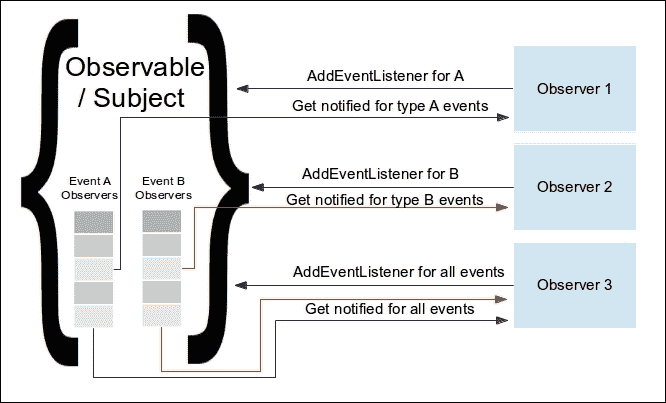
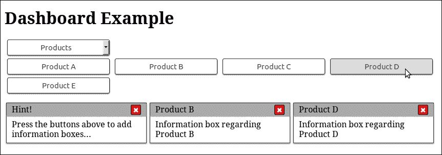
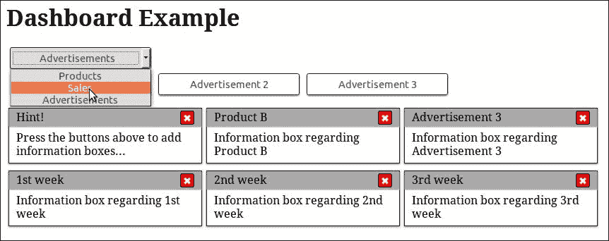
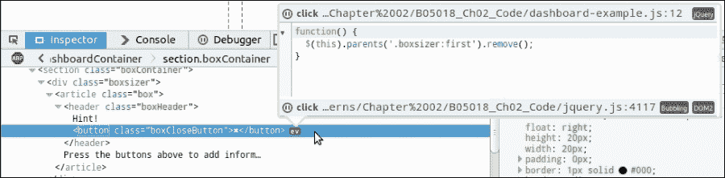
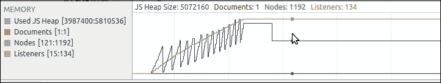
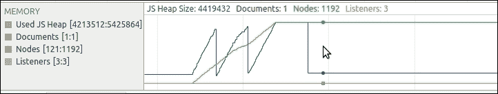

# 第二章：观察者模式

在本章中，我们将展示观察者模式以及我们如何使用 jQuery 在我们的页面中方便地利用它。随后，我们还将解释委托事件观察者模式的变体，当正确应用于网页时，可以简化代码并减少页面所需的内存消耗。

在本章中，我们将：

+   介绍观察者模式

+   查看 jQuery 如何使用观察者模式

+   将观察者模式与使用事件属性进行比较

+   学习如何避免观察者引起的内存泄漏

+   介绍委托事件观察者模式并展示其好处

# 介绍观察者模式

观察者模式的关键概念是有一个对象，通常称为可观察对象或主体，在其生命周期内其内部状态会发生变化。还有其他几个对象，被称为观察者，它们希望在可观察对象/主体的状态发生变化时被通知，以执行一些操作。

观察者可能需要被通知关于可观察对象的任何状态改变，或者仅特定类型的改变。在最常见的实现中，可观察对象维护一个观察者列表，并在适当的状态改变发生时通知它们。如果可观察对象发生状态改变，它会遍历对那种类型的状态改变感兴趣的观察者列表，并执行它们定义的特定方法。



根据观察者模式的定义和计算机科学书籍中的参考实现，观察者被描述为实现了众所周知的编程接口的对象，大多数情况下，该接口对于它们感兴趣的每个可观察对象都是特定的。在状态改变的情况下，可观察对象将执行每个观察者的众所周知方法，因为它在编程接口中被定义。

### 注意

有关在传统的面向对象编程中如何使用观察者模式的更多信息，您可以访问 [`www.oodesign.com/observer-pattern.html`](http://www.oodesign.com/observer-pattern.html)。

在 Web 堆栈中，观察者模式通常使用普通的匿名回调函数作为观察者，而不是具有众所周知方法的对象。可以通过等效结果实现观察者模式，因为回调函数保留了对其定义所在环境的变量的引用——这种模式通常被称为**闭包**。使用观察者模式而不是回调作为调用或初始化参数的主要优点是观察者模式可以支持单个目标上的几个独立处理程序。

### 注意

有关闭包的更多信息，您可以访问 [`developer.mozilla.org/en-US/docs/Web/JavaScript/Closures`](https://developer.mozilla.org/en-US/docs/Web/JavaScript/Closures)。

### 提示

**定义简单回调**

回调可以定义为作为另一个函数/方法的参数传递或分配给对象的属性，并且期望在稍后的某个时间点执行的函数。通过这种方式，将我们的回调交给的代码将调用它，将操作或事件的结果传播回定义回调的上下文。

由于将函数注册为观察者的模式被证明更灵活和更简单直接的编程，它在网页堆栈之外的编程语言中也可以找到。其他编程语言通过语言特性或特殊对象（如子例程、lambda 表达式、块和函数指针）提供了等效的功能。例如，Python 也像 JavaScript 一样将函数定义为一等对象，使它们能够被用作回调函数，而 C#则定义了委托作为特殊对象类型，以实现相同的结果。

观察者模式是开发响应用户操作的 Web 界面的一个组成部分，每个 Web 开发人员都在某种程度上使用它，即使在不知情的情况下也是如此。这是因为创建丰富用户界面时，Web 开发人员需要做的第一件事是向页面元素添加事件侦听器，并定义浏览器应该如何响应它们。

传统上，这是通过在需要监听事件的页面元素上使用`EventTarget.addEventListener()`方法实现的，例如“点击”，并提供一个回调函数，其中包含需要在事件发生时执行的代码。值得一提的是，为了支持旧版本的 Internet Explorer，需要测试`EventTarget.attachEvent()`的存在，并使用它来代替。

### 注意

有关`addEventListener()`和`attachEvent()`方法的更多信息，您可以访问[`developer.mozilla.org/en-US/docs/Web/API/EventTarget/addEventListener`](https://developer.mozilla.org/en-US/docs/Web/API/EventTarget/addEventListener)和[`developer.mozilla.org/en-US/docs/Web/API/EventTarget/attachEvent`](https://developer.mozilla.org/en-US/docs/Web/API/EventTarget/attachEvent)。

## jQuery 如何使用它

jQuery 库在其实现的几个部分中大量使用观察者模式，直接使用`addEventListener`方法或创建其自己的抽象来实现。此外，jQuery 提供了一系列抽象和方便的方法，使在 Web 上使用观察者模式变得更容易，并且还在内部使用其中一些方法来实现其他方法。

### jQuery 的 on 方法

`jQuery.fn.on()`方法是将事件处理程序附加到元素的中央 jQuery 方法，提供了一种简单的方法来采用观察者模式，同时保持我们的代码易于阅读和理解。它将所请求的事件处理程序附加到由`$()`函数返回的复合 jQuery 集合对象的所有元素上。

在 jQuery 源码查看器中搜索 `jQuery.fn.on`（可在 [`james.padolsey.com/jquery`](http://james.padolsey.com/jquery) 找到），或直接在 jQuery 源代码中搜索 `on: function`（第一个字符是制表符），将引导我们找到方法的定义，代码共有 67 行。事实上，在内部 `on` 函数的前 55 行只是处理 `jQuery.fn.on()` 方法可以被调用的不同方式；接近末尾，我们能看到它实际上使用了内部方法 `jQuery.event.add()`：

```js
jQuery.fn.extend({
  on: function( types, selector, data, fn ) {
    return on( this, types, selector, data, fn );
  }
});

function on( elem, types, selector, data, fn, one ) {

  /* 55 lines of code handling the method overloads */
  return elem.each( function() {
    jQuery.event.add( this, types, fn, data, selector );
  } );
}
```

```js
 trimmed down version of that method, where some code related to the technical implementation of jQuery and not related to the Observer Pattern has been removed for clarity:
```

```js
add: function( elem, types, handler, data, selector ) { 
    /* ... 4 lines of code ... */
        elemData = dataPriv.get( elem ); 
    /* ... 13 lines of code ... */

    // Make sure that the handler has a unique ID, 
    // used to find/remove it later 
 if ( !handler.guid ) { 
 handler.guid = jQuery.guid++; 
 } 

    // Init the element's event structure and main handler, 
    // if this is the first 
 if ( !( events = elemData.events ) ) { 
 events = elemData.events = {}; 
 } 
    /* ... 9 lines of code ... */ 

    // Handle multiple events separated by a space 
    types = ( types || "" ).match( rnotwhite ) || [ "" ]; 
    t = types.length; 
    while ( t-- ) { 
        /* ... 30 lines of code ... */ 

        // Init the event handler queue if we're the first 
        if ( !( handlers = events[ type ] ) ) { 
 handlers = events[ type ] = []; 
            handlers.delegateCount = 0; 

            // Only use addEventListener if the special events handler
            // returns false 
            if ( !special.setup || special.setup.call( elem, data, namespaces, eventHandle ) === false ) {
 if ( elem.addEventListener ) { 
 elem.addEventListener( type, eventHandle ); 
 } 
            } 
        }

        /* ... 9 lines of code ... */ 

        // Add to the element's handler list, delegates in front 
 if ( selector ) { 
 handlers.splice( handlers.delegateCount++, 0, handleObj ); 
 } else { 
 handlers.push( handleObj ); 
 }
        /* ... 3 lines of code ... */
    } 
}
```

现在，让我们通过引用前面高亮的代码，了解 `jQuery.event.add()` 如何实现观察者模式。

`jQuery.event.add()` 方法的参数中的 `handler` 变量存储最初作为参数传递给 `jQuery.fn.on()` 方法的函数。我们可以称这个函数为我们的观察器函数，因为它在附加到的元素上触发相应事件时被执行。

在第一个高亮的代码区域中，jQuery 创建并给存储在 `handler` 变量中的观察器函数分配了一个 `guid` 属性。记住，在 JavaScript 中，可以给函数赋值属性，因为函数是一流对象。`jQuery.guid++` 语句在分配旧值之后执行，这是因为 `jQuery.guid` 是 jQuery 和 jQuery 插件在内部使用的全局计数器。观察器函数上的 `guid` 属性用作标识和定位 jQuery 为每个元素维护的观察器函数列表中的观察器函数的一种方式。例如，`jQuery.fn.off()` 方法使用它来定位并从与元素关联的观察器函数列表中删除观察器函数。

### 小贴士

`jQuery.guid` 是一个页面范围的计数器，它被插件和 jQuery 本身用作集中的方式来检索唯一的整数 ID。它通常用于给元素、对象和函数分配唯一的 ID，以便更容易地在集合中定位它们。每个检索和使用 `jQuery.guid` 当前值的实现者都有责任在每次使用后也增加属性值（加一）。否则，由于这是一个页面范围的计数器，被 jQuery 插件和 jQuery 自己用于标识，页面可能会面临难以调试的故障。

在第二个和第三个突出显示的代码区域中，jQuery 初始化一个数组来保存每个可能在该元素上触发的事件的观察者列表。需要注意的是，第二个突出显示的代码区域中的观察者列表并不是实际 DOM 元素的属性。正如 `jQuery.event.add()` 方法开头附近的 `dataPriv.get( elem )` 语句所示，jQuery 使用单独的映射对象来保存 DOM 元素与其观察者列表之间的关联。通过使用这种数据缓存机制，jQuery 能够避免向 DOM 元素添加额外属性，这些属性是其实现所需要的。

### 注意

您可以通过搜索 `function Data()` 在 jQuery 源代码中轻松找到数据缓存机制的实现。这将带您到 `Data` 类的构造函数，该构造函数后面跟随着在 `Data.prototype` 对象中定义的类方法的实现。有关更多信息，您可以访问 [`api.jquery.com/data`](http://api.jquery.com/data)。

下一个突出显示的代码区域是 jQuery 检查 `EventTarget.addEventListener()` 方法是否实际上对该元素可用，然后使用它将事件监听器添加到该元素。在最后一个突出显示的代码区域中，jQuery 将观察者函数添加到其内部列表中，该列表保存了附加到该特定元素的相同事件类型的所有观察者。

### 注意

根据您所使用的版本，可能会在某种程度上获得不同的结果。编写本书时发布和使用的最新稳定的 jQuery 版本是 v2.2.0。

如果您需要为旧版浏览器（例如低于版本 9 的 Internet Explorer）提供支持，则应使用 jQuery 的 v1.x 版本。编写本书时的最新版本是 v1.12.0，它提供与 v2.2.x 版本完全相同的 API，但也具有在旧版浏览器上运行所需的代码。

为了涵盖旧版浏览器的实现不一致性，jQuery v1.x 中 `jQuery.event.add()` 的实现要长一些，更复杂一些。其中一个原因是因为 jQuery 还需要测试浏览器是否实际上支持 `EventTarget.addEventListener()`，如果不是，则尝试使用 `EventTarget.attachEvent()`。

正如我们在前面的代码中看到的，jQuery 的实现遵循观察者模式描述的操作模型，但也融入了一些实现技巧，以使其与 Web 浏览器可用的 API 更有效地配合工作。

### 文档准备就绪的观察者

jQuery 提供的另一个方便的方法，是被开发人员广泛使用的`$.fn.ready()`方法。此方法接受一个函数参数，仅在页面的 DOM 树完全加载后才执行它。这在以下情况下可能会有用：如果您的代码不是最后加载到页面上，而且您不想阻塞初始页面呈现，或者它需要操作的元素被定义在其自身`<script>`标签之后。

### 注意

请记住，`$.fn.ready()`方法的工作方式与`window.onload`回调和页面的"load"事件稍有不同，它们会等待页面的所有资源加载完毕。有关更多信息，您可以访问[`api.jquery.com/ready`](http://api.jquery.com/ready)。

以下代码演示了`$.fn.ready()`方法的最常见使用方式：

```js
$(document).ready(function() {
    /* this code will execute only after the page has been fully loaded */ 
})
```

如果我们尝试找到`jQuery.fn.ready`的实现，我们会看到它实际上在内部使用`jQuery.ready.promise`来工作：

```js
jQuery.fn.ready = function( fn ) { 
  // Add the callback 
  jQuery.ready.promise().done( fn ); 

  return this; 
};
/* … a lot lines of code in between */
jQuery.ready.promise = function( obj ) { 
  if ( !readyList ) { 

    readyList = jQuery.Deferred(); 

    // Catch cases where $(document).ready() is called
    // after the browser event has already occurred.
    // Support: IE9-10 only
    // Older IE sometimes signals "interactive" too soon
    if ( document.readyState === "complete" || ( document.readyState !== "loading" && !document.documentElement.doScroll ) ) {
      // Handle it asynchronously to allow ... to delay ready 
      window.setTimeout( jQuery.ready ); 

    } else { 
      // Use the handy event callback 
 document.addEventListener( "DOMContentLoaded", completed ); 

      // A fallback to window.onload, that will always work 
 window.addEventListener( "load", completed ); 
    } 
  } 
  return readyList.promise( obj ); 
};
```

正如您在实现中前面高亮显示的代码区域中所见，jQuery 使用`addEventListener`来观察`document`对象上的`DOMContentLoaded`事件何时触发。另外，为了确保它在各种浏览器中都能工作，它还注意到`window`对象上的`load`事件何时被触发。

jQuery 库还提供了在代码中添加上述功能的更短的方法。由于上述实现实际上不需要对文档的引用，因此我们可以用`$().ready(function() {/* ... */ })`来代替。还存在一个`$()`函数的重载，它能够达到相同的效果，它的使用方式是`$(function() {/* ... */ })`。这两种替代方法使用`jQuery.fn.ready`在开发者中受到了严重批评，因为它们通常会导致误解。尤其是第二种更为简短的版本会引起混淆，因为它看起来像一个**立即调用的函数表达式**（**IIFE**），这是 JavaScript 开发人员大量使用和已学会识别的一种模式。实际上，它只有一个字符(`$`)的不同，因此在与开发团队讨论之前不建议使用它。

### 注意

`$.fn.ready()`方法也被称为为我们的代码实现惰性初始化/执行模式提供了一种简单的方法。该模式的核心概念是推迟执行一段代码或在以后的时间点加载远程资源。例如，我们可以等待页面完全加载后再添加观察者，或者在下载网页资源之前等待某个特定事件发生。

## 演示一个样本用例

为了看到观察者模式的实际效果，我们将创建一个示例来展示控制面板的骨架实现。在我们的示例中，用户将能够向其控制面板添加与标题栏中可供选择的一些示例项目和类别相关的信息框。

我们的示例将为我们的项目设有三个预定义的类别：**产品**、**销售**和**广告**。每个类别都将有一系列相关项目，这些项目将出现在类别选择器正下方的区域。用户可以通过使用下拉选择器选择所需的类别，这将更改仪表板的可见选择项目。



我们的仪表板最初将包含关于仪表板用法的提示信息框。每当用户点击类别项之一时，一个新的信息框将出现在我们的三列布局仪表板中。在前述图像中，用户通过点击相关按钮为**产品 B**和**产品 D**添加了两个新的信息框。



用户还可以通过点击每个信息框顶部右侧的红色关闭按钮来取消这些信息框中的任何一个。在前述图像中，用户取消了**产品 D**信息框，然后添加了**广告 3**以及**销售**类别的第 1、2 和 3 周项目的信息框。

通过仅仅阅读上述描述，我们可以轻松地分离出所有实现我们仪表板所需的用户交互。我们将需要为每一个这些用户交互添加观察者，并在回调函数中编写执行适当 DOM 操作的代码。

具体来说，我们的代码将需要：

+   观察当前选定元素所做的更改，并通过隐藏或显示相应项目来响应此类事件

+   观察每个项目按钮的点击并通过添加新的信息框来响应

+   观察每个信息框的关闭按钮的点击并通过将其从页面中移除来响应

现在让我们继续并查看所需的 HTML、CSS 和 JavaScript 代码，以完成前面的示例。让我们从 HTML 代码开始，假设我们将其保存在名为`Dashboard Example.html`的文件中，代码如下：

```js
<!DOCTYPE html> 
<html> 
  <head> 
    <title>Dashboard Example</title> 
    <link rel="stylesheet" type="text/css" href="dashboard-example.css"> 
  </head> 
  <body> 
    <h1 id="pageHeader">Dashboard Example</h1> 

    <div class="dashboardContainer"> 
      <section class="dashboardCategories"> 
        <select id="categoriesSelector"> 
          <option value="0" selected>Products</option> 
          <option value="1">Sales</option> 
          <option value="2">Advertisements</option> 
        </select> 
        <section class="dashboardCategory"> 
          <button>Product A</button> 
          <button>Product B</button> 
          <button>Product C</button> 
          <button>Product D</button> 
          <button>Product E</button> 
        </section> 
        <section class="dashboardCategory hidden"> 
          <button>1st week</button> 
          <button>2nd week</button> 
          <button>3rd week</button> 
          <button>4th week</button> 
        </section> 
        <section class="dashboardCategory hidden"> 
          <button>Advertisement 1</button> 
          <button>Advertisement 2</button> 
          <button>Advertisement 3</button> 
        </section> 
        <div class="clear"></div> 
      </section> 

      <section class="boxContainer"> 
        <div class="boxsizer"> 
          <article class="box"> 
            <header class="boxHeader"> 
              Hint! 
              <button class="boxCloseButton">&#10006;</button> 
            </header> 
            Press the buttons above to add information boxes... 
          </article> 
        </div> 
      </section> 
      <div class="clear"></div> 
    </div> 

    <script type="text/javascript" src="img/jquery.js"></script> 
    <script type="text/javascript" src="img/dashboard-example.js">
    </script> 
  </body> 
</html>
```

在前述 HTML 中，我们将所有与仪表板相关的元素放在带有`dashboardContainer` CSS 类的`<div>`元素内。这将使我们能够有一个中心起点来搜索我们仪表板的元素，并且作用域我们的 CSS。在它内部，我们使用一些 HTML5 语义元素定义了两个`<section>`元素，以便使用逻辑区域划分仪表板。

第一个带有`dashboardCategories`类的`<section>`用于保存我们仪表板的类别选择器。在其中，我们有一个带有 ID `categoriesSelector`的`<select>`元素，用于过滤可见的类别项目，以及三个带有`dashboardCategory`类的子部分，用于包装在单击时将用信息框填充仪表板的`<button>`元素。其中两个还具有`hidden`类，以便在页面加载时仅显示第一个，通过匹配类别选择器的最初选择选项(`<option>`)。此外，在第一节的末尾，我们还添加了一个带有`clear`类的`<div>`，正如我们在第一章中看到的那样，它将用于清除浮动的`<button>`元素。

带有`boxContainer`类的第二个`<section>`用于保存我们仪表板的信息框。最初，它仅包含一个关于如何使用仪表板的提示。我们使用带有`boxsizer`类的`<div>`元素来设置框尺寸，以及带有`box`类的 HTML5 `<article>` 元素来添加所需的边框填充和阴影，类似于第一章中的框元素。

每个信息框除了其内容之外，还包含一个带有`boxHeader`类的`<header>`元素和一个带有`boxCloseButton`类的`<button>`元素，当点击时，会移除包含它的信息框。我们还使用了`&#10006;` HTML 字符代码作为按钮的内容，以获得更漂亮的“x”标记，并避免使用单独的图像来实现此目的。

最后，由于信息框也是浮动的，我们还需要一个带有`clear`类的`<div>`放置在`boxContainer`的末尾。

在前述 HTML 的`<head>`中，我们还引用了一个名为`dashboard-example.css`的 CSS 文件，其内容如下：

```js
.dashboardCategories { 
    margin-bottom: 10px; 
} 

.dashboardCategories select, 
.dashboardCategories button { 
    display: block; 
    width: 200px; 
    padding: 5px 3px; 
    border: 1px solid #333; 
    margin: 3px 5px; 
    border-radius: 3px; 
    background-color: #FFF; 
    text-align: center; 
    box-shadow: 0 1px 1px #777; 
    cursor: pointer; 
} 

.dashboardCategories select:hover, 
.dashboardCategories button:hover { 
    background-color: #DDD; 
} 

.dashboardCategories button { 
    float: left; 
} 

.box { 
    padding: 7px 10px; 
    border: solid 1px #333; 
    margin: 5px 3px; 
    box-shadow: 0 1px 2px #777; 
} 

.boxsizer { 
    float: left; 
    width: 33.33%; 
} 

.boxHeader { 
    padding: 3px 10px;
    margin: -7px -10px 7px;
    background-color: #AAA; 
    box-shadow: 0 1px 1px #999; 
} 

.boxCloseButton { 
    float: right; 
    height: 20px; 
    width: 20px; 
    padding: 0; 
    border: 1px solid #000; 
    border-radius: 3px; 
    background-color: red; 
    font-weight: bold; 
    text-align: center; 
    color: #FFF; 
    cursor: pointer; 
} 

.clear { clear: both; } 
.hidden { display: none; }
```

正如您在我们的 CSS 文件中所看到的，首先我们在具有`dashboardCategories`类的元素下面添加了一些空间，并且为`<select>`元素和其中的按钮定义了相同的样式。为了使其与默认浏览器样式区分开来，我们添加了一些填充，圆角边框，悬停鼠标指针时的不同背景颜色以及它们之间的一些空间。我们还定义了我们的`<select>`元素应该作为块独自显示在其行中，以及分类项目按钮应该相邻浮动。我们再次使用了`boxsizer`和`box` CSS 类，就像在第一章，*jQuery 和组合模式复习*中所做的一样；第一个用于创建三列布局，第二个实际提供信息框的样式。我们继续定义`boxHeader`类，应用于我们信息框的`<header>`元素，并定义一些填充，灰色背景颜色，轻微阴影，以及一些负边距，以抵消框填充的效果并将其放置在其边框旁边。

要完成信息框的样式设计，我们还定义了`boxCloseButton` CSS 类，它（i）将框的关闭按钮浮动到框的`<header>`内的右上角，（ii）定义了`20px`的宽度和高度，（iii）覆盖了默认浏览器的`<button>`样式以零填充，并且（iv）添加了一个单像素的黑色边框，圆角和红色背景颜色。最后，就像在第一章，*jQuery 和组合模式复习*中，我们定义了`clear`实用的 CSS 类以防止元素被放置在前面浮动元素的旁边，并且还定义了`hidden`类作为隐藏页面元素的方便方式。

在我们的 HTML 文件中，我们引用了 jQuery 库本身以及一个名为`dashboard-example.js`的 JavaScript 文件，其中包含我们的仪表板实现。遵循创建高性能网页的最佳实践，我们将它们放在了`</body>`标签之前，以避免延迟初始页面渲染：

```js
$(document).ready(function() { 

    $('#categoriesSelector').change(function() { 
        var $selector = $(this); 
        var selectedIndex = +$selector.val(); 
        var $dashboardCategories = $('.dashboardCategory'); 
        var $selectedItem = $dashboardCategories.eq(selectedIndex).show(); 
        $dashboardCategories.not($selectedItem).hide();
    }); 

    function setupBoxCloseButton($box) { 
        $box.find('.boxCloseButton').click(function() { 
            $(this).closest('.boxsizer').remove(); 
        }); 
    } 

    // make the close button of the hint box work 
    setupBoxCloseButton($('.box')); 

    $('.dashboardCategory button').on('click', function() { 
        var $button = $(this); 
        var boxHtml = '<div class="boxsizer"><article class="box">' + 
                '<header class="boxHeader">' + 
                    $button.text() + 
                    '<button class="boxCloseButton">&#10006;' + 
                    '</button>' + 
                '</header>' + 
                'Information box regarding ' + $button.text() + 
            '</article></div>'; 
        $('.boxContainer').append(boxHtml); 
        setupBoxCloseButton($('.box:last-child')); 
    });

}); 
```

我们将所有代码放在了一个`$(document).ready()`调用中，以延迟其执行直到页面的 DOM 树完全加载。如果我们将代码放在`<head>`元素中，这将是绝对必要的，但在任何情况下遵循的最佳实践也是很好的。

首先，我们使用`$.fn.change()`方法为`categoriesSelector`元素的`change`事件添加了一个观察者。实际上，这是`$.fn.on('change', /* … */)``方法的一种简写方法。在 jQuery 中，作为观察者使用的函数内的`this`关键字的值保存着被触发事件的 DOM 元素的引用。这适用于所有注册观察者的 jQuery 方法，从核心的`$.fn.on()`到方便的`$.fn.change()`和`$.fn.click()`方法。所以我们使用`$()`函数用`<select>`元素创建一个 jQuery 对象，并将其存储在`$selector`变量中。然后，我们使用`$selector.val()`来检索所选`<option>`的值，并通过使用`+`运算符将其转换为数值。紧接着，我们检索`dashboardCategory`的`<section>`元素，并将结果缓存到`$dashboardCategories`变量中。然后，我们通过找到并显示位置等于`selectedIndex`变量值的类别来继续，并将结果的 jQuery 对象存储到`$selectedItem`变量中。最后，我们使用`$.fn.not()`方法使用`$selectedItem`变量检索并隐藏除了刚刚显示的类别元素之外的所有类别元素。

在下一个代码部分中，我们定义了`setupBoxCloseButton`函数，该函数将用于初始化关闭按钮的功能。它期望一个带有盒子元素的 jQuery 对象作为参数，并且对于每一个盒子元素，搜索它们的后代以找到我们在关闭按钮上使用的`boxCloseButton` CSS 类。使用`$.fn.click()`，这是`$.fn.on('click', /* fn */)`的一个方便方法，我们注册一个匿名函数，以便在每次点击事件被触发时执行，该函数使用`$.fn.closest()`方法来查找具有`boxsizer`类的第一个祖先元素，并将其从页面中删除。紧接着，我们对已经存在于页面中在页面加载时的盒子元素调用此函数一次。在这种情况下，使用提示的盒子元素。

### 注意

使用`$.fn.closest()`方法时需要注意的另一件事情是，它从 jQuery 集合的当前元素开始测试给定的选择器，然后再进行其祖先元素的测试。有关更多信息，您可以访问其文档 [`api.jquery.com/closest`](http://api.jquery.com/closest)。

在最终的代码部分中，我们使用`$.fn.on()`方法在每个类别按钮上添加点击事件的观察者。在这种情况下，在匿名观察者函数内部，我们使用`this`关键字，它保存了被点击的`<button>`的 DOM 元素，并使用`$()`方法创建一个 jQuery 对象，并将其引用缓存在`$button`变量中。紧接着，我们使用`$.fn.text()`方法获取按钮的文本内容，并结合它构建信息框的 HTML 代码。对于关闭按钮，我们使用`&#10006` HTML 字符代码，它将被渲染为更漂亮的“**X**”图标。我们创建的模板基于最初可见提示框的 HTML 代码；在本章的示例中，我们使用纯字符串拼接。最后，我们将生成的 HTML 代码附加到`boxContainer`，由于我们期望它是最后一个元素，我们使用`$()`函数查找它，并将其作为参数传递给`setupBoxCloseButton`。

## 与事件属性相比如何

在 DOM Level 2 Events 规范中定义`EventTarget.addEventListener()`之前，事件监听器的注册方法是通过使用可用于 HTML 元素的事件属性或可用于 DOM 节点的元素事件属性。

### 注意

有关 DOM Level 2 事件规范和事件属性的更多信息，您可以访问[`www.w3.org/TR/DOM-Level-2-Events`](http://www.w3.org/TR/DOM-Level-2-Events)和[`developer.mozilla.org/en-US/docs/Web/Guide/HTML/Event_attributes`](https://developer.mozilla.org/en-US/docs/Web/Guide/HTML/Event_attributes)。

事件属性是一组可用于 HTML 元素的属性，提供了一种声明性的方法来定义应在触发该元素上特定事件时执行的 JavaScript 代码片段（最好是函数调用）。由于它们的声明性特质和简单易用的方式，这通常是新开发者首次接触网页开发中的事件的方式。

如果我们在上面的示例中使用了事件属性，那么信息框中关闭按钮的 HTML 代码将如下所示：

```js
<article class="box"> 
    <header class="boxHeader"> 
        Hint! 
 <button onclick="closeInfoBox();" 
                class="boxCloseButton">&#10006;</button> 
    </header> 
    Press the buttons above to add information boxes... 
</article>
```

另外，我们应该更改用于创建新信息框的模板，并将`closeInfoBox`函数暴露在`window`对象上，以便可以从 HTML 事件属性中访问:

```js
window.closeInfoBox = function() { 
    $(this).closest('.boxsizer').remove(); 
};
```

使用事件属性而不是观察者模式的一些缺点包括：

+   它使得更难定义在元素上触发事件时需要执行的多个单独操作

+   这会使页面的 HTML 代码变得更大，且不易读取

+   它违反了关注点分离原则，因为它在我们的 HTML 中添加了 JavaScript 代码，可能会使错误更难跟踪和修复

+   大多数情况下，这会导致事件属性中调用的函数暴露给全局的 `window` 对象，从而“污染”全局命名空间。

使用元素事件属性不需要对我们的 HTML 进行任何更改，所有的实现都保留在我们的 JavaScript 文件中。我们在 `setupBoxCloseButton` 函数中需要进行的更改将使它看起来如下所示：

```js
function setupBoxCloseButton($box) { 
    var $closeButtons = $box.find('.boxCloseButton'); 
    for (var i = 0; i < $closeButtons.length; i++) { 
        $closeButtons[i].onclick = function() { 
 this.onclick = null; 
            $(this).closest('.boxsizer').remove(); 
        }; 
    } 
}
```

请注意，为了方便起见，我们仍然在 DOM 操作中使用 jQuery，但生成的代码仍然具有前述的一些缺点。更重要的是，为了避免内存泄漏，我们还需要在从页面中移除元素之前删除分配给 `onclick` 属性的函数，如果它包含对其应用的 DOM 元素的引用。

使用当今浏览器提供的工具，我们甚至可以达到事件属性声明性质所提供的便利程度。在下图中，您可以看到 Firefox 开发者工具在我们使用它们来检查附加了事件侦听器的页面元素时为我们提供了有用的反馈：



如前图所示，所有附加了观察者的元素旁都有一个 **ev** 标志，单击该标志将显示一个对话框，显示当前附加的所有事件侦听器。为了使我们的开发体验更好，我们可以直接看到这些处理程序所在的文件和行。此外，我们可以单击它们以展开并显示它们的代码，或者单击它们前面的标志以导航到其源并添加断点。

使用观察者模式而不是事件属性的最大好处之一，在于当某个事件发生时需要执行多个操作的情况下清晰可见。假设我们还需要在示例仪表板中添加一个新功能，该功能可以防止用户意外双击类别项目按钮并将相同的信息框两次添加到仪表板。新的实现理想上应完全独立于现有的实现。使用观察者模式，我们只需添加以下代码来观察按钮点击并在 700 毫秒内禁用该按钮：

```js
$(document).ready(function() { 
  $('.dashboardCategory button').on('click', function() { 
    var $button = $(this); 
    $button.prop('disabled', true); 

    setTimeout(function() { 
      $button.prop('disabled', false); 
    }, 700); 
  }); 
});
```

上述代码确实完全独立于基本实现，我们可以将其放在同一个或不同的 JS 文件中，并将其加载到我们的页面中。这在使用事件属性时会更加困难，因为它要求我们在同一个事件处理程序函数中同时定义两个动作；结果，它会强烈地耦合两个独立的动作。

## 避免内存泄漏

正如我们之前所见，使用观察者模式处理网页上的事件有一些强大的优势。当使用`EventTarget.addEventListener()`方法向元素添加观察者时，我们还需要记住，为了避免内存泄漏，我们在将这些元素从页面中移除之前，还必须调用`EventTarget.removeEventListener()`方法，以便观察者也被移除。

### 注意

有关从元素中移除事件侦听器的更多信息，您可以访问[`developer.mozilla.org/zh-CN/docs/Web/API/EventTarget/removeEventListener`](https://developer.mozilla.org/zh-CN/docs/Web/API/EventTarget/removeEventListener)，或者查看 jQuery 等效方法，请访问[`api.jquery.com/off/`](http://api.jquery.com/off/)。

jQuery 库的开发者意识到这样一个实现上的关注点可能会被轻易地忘记或者没有正确处理，从而使得观察者模式的采用看起来更加复杂，因此他们决定将适当的处理封装在`jQuery.event`实现中。因此，当使用任何 jQuery 的事件处理方法，比如核心的`$.fn.on()`或者任何方便的方法，比如`$.fn.click()`或`$.fn.change()`时，观察者函数由 jQuery 本身跟踪，并且如果我们后来决定将元素从页面中移除，它们将被正确取消注册。正如我们之前在`jQuery.event`的实现中看到的那样，jQuery 将每个元素的观察者存储在一个单独的映射对象中。每次我们使用一个 jQuery 方法来从页面中移除 DOM 元素时，它首先通过检查映射对象来确保移除这些元素或任何后代元素上附加的任何观察者。因此，即使我们不使用任何显式移除我们添加到创建的元素上的观察者的方法，我们之前使用的示例代码也不会造成内存泄漏。

### 提示

**在混合使用 jQuery 和纯 DOM 操作时要小心**

即使所有 jQuery 方法都可以确保您免受由从未取消注册的观察者引起的内存泄漏，但请记住，如果使用纯 DOM API 的方法从文档中移除元素，则无法保护您。如果使用`Element.remove()`和`Element.removeChild()`等方法，并且被移除的元素或其后代有附加的观察者，则它们将不会被自动取消注册。当分配给`Element.innerHTML`属性时也是如此。

# 介绍委托事件观察者模式

现在我们已经学习了如何使用 jQuery 使用观察者模式的一些高级细节，我们将介绍一种特殊的变体，它完全适用于 Web 平台并提供了一些额外的好处。委托事件观察器模式（简称委托观察器模式）经常用于 Web 开发，并利用了大多数在 DOM 元素上触发的事件具有的冒泡特性。例如，当我们单击页面元素时，单击事件立即在其上触发，然后在达到 HTML 文档根之前还会在所有父元素上触发。使用 jQuery 的 `$.fn.on` 方法的略有不同的重载版本，我们可以轻松地为触发在特定子元素上的委托事件创建和附加观察者。

### 注意

术语“事件委托”描述了一种编程模式，其中事件的处理程序不直接附加到感兴趣的元素，而是附加到其祖先元素之一。

## 如何简化我们的代码

使用委托事件观察器模式重新实现我们的仪表板示例将只需要更改包含的 JavaScript 文件的代码如下：

```js
$(document).ready(function() { 

    $('#categoriesSelector').change(function() { 
        var $selector = $(this); 
        var selectedIndex = +$selector.val(); 
        var $dashboardCategories = $('.dashboardCategory'); 
        var $selectedItem = $dashboardCategories.eq(selectedIndex).show(); 
        $dashboardCategories.not($selectedItem).hide(); 
    }); 

 $('.dashboardCategories').on('click', 'button', function() { 
        var $button = $(this); 
        var boxHtml = '<div class="boxsizer"><article class="box">' + 
                '<header class="boxHeader">' + 
                    $button.text() + 
                    '<button class="boxCloseButton">&#10006;' + 
                    '</button>' + 
                '</header>' + 
                'Information box regarding ' + $button.text() + 
            '</article></div>'; 
        $('.boxContainer').append(boxHtml); 
    }); 

 $('.boxContainer').on('click', '.boxCloseButton', function() { 
        $(this).closest('.boxsizer').remove(); 
    }); 

});
```

最明显的区别在于新的实现更短。通过仅为适用于多个页面元素的每个操作定义一个观察者，可以获得益处。因此，我们使用 `$.fn.on(events, selector, handler)` 方法的重载变体。

具体来说，我们向具有 `dashboardCategories` CSS 类的页面元素添加一个观察者，并监听其任何 `<button>` 后代触发的 `click` 事件。类似地，我们向 `boxContainer` 元素添加一个观察者，该观察者将在其匹配 `.boxCloseButton` CSS 选择器的任何后代上触发单击事件时执行。

由于上述观察者不仅适用于在注册时存在于页面上的元素，还适用于以后任何时间添加的匹配指定 CSS 选择器的任何元素；我们能够将处理关闭按钮点击的代码解耦，并将其放在一个单独的观察者中，而不是每次添加新信息框时都注册一个新观察者。因此，负责在仪表板中添加新信息框的观察者更简单，只需处理信息框的 HTML 创建和插入到仪表板中，从而实现了更大的关注点分离。此外，我们不再需要在单独的代码片段中处理提示框关闭按钮的观察者注册。

## 比较内存使用优势

我们现在将比较使用`$.fn.on()`方法与简单和委托事件观察者模式变体时的内存使用差异。为了实现这一点，我们将打开我们仪表板示例的两个实现，并在 Chrome 上比较它们的内存使用情况。要打开 Chrome 的开发者工具，只需按下*F12*，然后导航到**Timeline**选项卡。我们在 Chrome 的**Timeline**选项卡中按下"record"按钮，然后按下每个类别项按钮 10 次，将 120 个信息框添加到我们的仪表板。在添加所有框之后，我们总共有 121 个打开的框，因为提示框仍然打开，然后停止时间线记录。

我们初始观察者模式实现的时间线结果如下：



为委托事件观察者模式实现重复相同的过程将提供更平滑的时间线，显示较少的对象分配和垃圾收集，如下所示：



正如在前面的图片中所示，我们最终在两种情况下都有 1192 个页面元素，但在第一种实现中，我们使用了 134 个事件侦听器，而在使用事件委托的实现中，我们最初创建了三个事件侦听器，并且实际上从未添加过其他事件侦听器。

最后，正如你在图表中看到的蓝线所示，委托版本的内存消耗保持相对稳定，仅增加了约 200 KB。另一方面，在原始实现中，堆大小增加了五倍多，增加了超过 1 MB。

添加这么多元素可能并不是一个实际的使用情况，但是仪表板可能不会是你页面上唯一的动态部分。因此，在一个相对复杂的网页中，如果我们使用委托事件观察者模式的变体重新实现了它的每个适用部分，我们可能会得到类似的改进。

# 摘要

在本章中，我们了解了观察者模式，以及它如何使我们网页的 HTML 代码更清晰，以及它如何将其与我们应用程序的代码解耦。我们了解了 jQuery 如何在其方法中添加保护层，以保护我们免受未检测到的内存泄漏的影响，这可能会在不使用 jQuery DOM 操作方法时，通过向元素添加观察者而发生。

我们还尝试了委托事件观察者模式变体，并将其用于重写我们的初始示例。我们比较了这两种实现，并看到它如何简化了在页面加载后应用于许多页面元素的代码编写。最后，我们就普通观察者模式与其委托变体的内存消耗进行了比较，并强调了它如何通过减少所需的附加观察者数量来减少页面的内存消耗。

现在我们已经完成了关于观察者模式如何用于监听用户操作的介绍，我们可以继续下一章，了解自定义事件、发布/订阅模式以及它们如何导致更解耦的实现方式。
