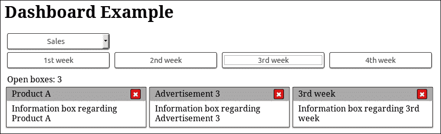

# 第三章：发布/订阅模式

在本章中，我们将展示发布/订阅模式，这是一种设计模式，与观察者模式非常相似，但具有更明确的角色，更适合更复杂的用例。我们将看到它与观察者模式的区别，以及 jQuery 如何采用其某些概念并将其带入其观察者模式实现。

后来，我们将继续并使用此模式重写我们上一章的示例。我们将利用此模式的优势来添加一些额外功能，并减少我们的代码与网页元素之间的耦合。

在本章中，我们将：

+   引入发布/订阅模式

+   了解它与观察者模式的区别以及它的优势在哪里

+   了解 jQuery 如何将一些特性带入其方法中

+   学习如何使用 jQuery 发射自定义事件

+   使用此模式重写并扩展来自第二章的示例，*观察者模式*，

# 介绍发布/订阅模式

发布/订阅模式是一种消息模式，其中称为**发布者**的消息发射器向许多被称为**订阅者**的接收者多播消息，这些接收者已表达了对接收此类消息的兴趣。这种模式的关键概念，也常简称为 Pub/Sub 模式，是提供一种方法以避免发布者和订阅者之间的依赖关系。

这种模式的一个额外概念是使用**主题**，订阅者使用这些主题来表示他们只对特定类型的消息感兴趣。这样一来，发布者在发送消息之前就可以对订阅者进行过滤，并且只将该消息分发给适当的订阅者，从而减少了双方所需的流量和工作量。


另一个常见的变体是使用一个称为**代理**的中央，应用程序范围内的对象，它将由发布者产生的消息中继给相关的订阅者。在这种情况下，代理充当了一个众所周知的消息处理程序，用于发送和订阅消息主题。这使我们能够不将不同的应用程序部分耦合在一起，而只引用代理本身以及我们的组件感兴趣的主题。尽管主题可能不是该模式的第一变体中的绝对要求，但该变体在可扩展性方面起着至关重要的作用，因为通常会存在比发布者和订阅者少得多的代理（如果不只有一个）。


通过遵循订阅方案，发布者的代码完全与订阅者解耦，这意味着发布者不必知道依赖于它们的对象。因此，我们不需要在发布者中硬编码每个应该在应用程序的不同部分执行的单独操作。相反，应用程序的组件以及可能的第三方扩展只订阅他们需要知道的主题/事件。在这样的分布式架构中，向现有应用程序添加新功能只需要对其依赖的应用程序组件进行最小到无需更改。

## 它与观察者模式的不同之处

最基本的区别在于，根据定义，发布/订阅模式是一种单向消息模式，可以传递消息，而观察者模式只是描述如何通知观察者有关主题特定状态更改的方法。

此外，与观察者模式不同，带有代理的发布/订阅模式导致实现的不同部分之间的代码更松散耦合。这是因为观察者需要知道发出事件的主题；然而，另一方面，发布者及其订阅者只需知道使用的代理。

# 如何被 jQuery 应用

再次提醒，jQuery 库为我们提供了一种方便的方式来利用代码中的发布/订阅模式。开发人员决定通过扩展`jQuery.fn.on()`和`jQuery.fn.trigger()`方法的能力来处理和发出自定义事件，而不是通过添加名为"publish"和"subscribe"的新方法并引入新概念来扩展其 API。这样，jQuery 可以使用它已经提供的方便的方法来实现使用发布者/订阅者通信方案。

## jQuery 中的自定义事件

自定义事件允许我们使用几乎任何用户定义的字符串值作为我们可以为其添加监听器的通用事件，并在页面元素上手动触发它。作为一个额外但宝贵的特性，自定义事件还可以携带一些额外的数据以传递给事件的监听器。

jQuery 库在任何网页规范实际添加之前就已经添加了自己的自定义事件实现。这样，就证明了在 web 开发中使用它们时可以有多么有用。正如我们在上一章中看到的，在 jQuery 中，有一个特定的部分处理通用元素事件和自定义事件。`jQuery.event` 对象保存了与触发和监听事件相关的所有内部实现。此外，`jQuery.Event` 类是 jQuery 为了满足通用元素事件和其自定义事件实现需要而专门使用的包装器。

## 使用自定义事件实现发布/订阅模式

在上一章中，我们看到 `jQuery.fn.on()` 方法可以用于在元素上添加事件侦听器。我们还看到它的实现在维护添加的处理程序列表并在需要时通知它们。此外，事件名称似乎具有与主题一样的协调目的。这种实现语义似乎与 Pub/Sub 模式完全匹配。

`jQuery.fn.trigger()` 方法实际上使用了内部的 `jQuery.event.trigger()` 方法，在 jQuery 中用于触发事件。它在内部处理程序列表上进行迭代，并使用所请求的事件以及自定义事件定义的任何额外参数执行它们。再次，这也符合 Pub/Sub 模式的操作要求。

因此，`jQuery.fn.trigger()` 和 `jQuery.fn.on()` 似乎符合 Pub/Sub 模式的需求，可以分别用于"publish"和"subscribe"方法。由于它们都可在 `jQuery.fn` 对象上使用，因此我们可以在任何 jQuery 对象上使用这些方法。这个 jQuery 对象将作为发布者和订阅者之间的中间实体，完全符合代理的定义。

一个很好的共同做法，也被很多 jQuery 插件所使用，是使用包含应用程序或插件实现的最外层页面元素作为代理。另一方面，jQuery 实际上允许我们使用任何对象作为代理，因为它实际上只需要一个目标来发出观察我们自定义事件的通知。因此，我们甚至可以使用一个空对象作为我们的代理，比如 `$({})`，以防使用页面元素看起来太受限制或根据 Pub/Sub 模式不够清晰。这实际上就是 jQuery Tiny Pub/Sub 库所做的事情，还有一些方法别名，这样我们实际上使用的是名为 "publish" 和 "subscribe" 的方法，而不是 jQuery 的 "on" 和 "trigger"。有关 Tiny 的更多信息，您可以访问其仓库页面[`github.com/cowboy/jquery-tiny-pubsub`](https://github.com/cowboy/jquery-tiny-pubsub)。

# 展示一个示例用例

为了了解 Pub/Sub 模式的使用，并方便将其与观察者模式进行比较，我们将重新编写来自第二章中的仪表板示例，*The Observer Pattern*，并使用这种模式。这还将清楚地演示这种模式如何帮助我们解耦实现的各个部分，并使其更具扩展性和可伸缩性。

## 在仪表板示例中使用 Pub/Sub

```js
adapt to the Publisher/Subscriber Pattern:
```

```js
$(document).ready(function() { 
 window.broker = $('.dashboardContainer'); 

    $('#categoriesSelector').change(function() { 
        var $selector = $(this); 
        var message = { categoryID: $selector.val() }; 
 broker.trigger('dashboardCategorySelect', [message]); 
    }); 

 broker.on('dashboardCategorySelect', function(event, message) { 
        var $dashboardCategories = $('.dashboardCategory'); 
        var selectedIndex = +message.categoryID; 
        var $selectedItem = $dashboardCategories.eq(selectedIndex).show(); 
        $dashboardCategories.not($selectedItem).hide(); 
    }); 

    $('.dashboardCategory').on('click', 'button', function() { 
        var $button = $(this); 
        var message = { categoryName: $button.text() }; 
 broker.trigger('categoryItemOpen', [message]); 
    }); 

 broker.on('categoryItemOpen', function(event, message) { 
        var boxHtml = '<div class="boxsizer"><article class="box">' + 
                '<header class="boxHeader">' + 
                    message.categoryName + 
                    '<button class="boxCloseButton">&#10006;' +
                    '</button>' + 
                '</header>' + 
                'Information box regarding ' + message.categoryName + 
            '</article></div>'; 
        $('.boxContainer').append(boxHtml); 
    }); 

 $('.boxContainer').on('click', '.boxCloseButton', function() { 
 var boxIndex = $(this).closest('.boxsizer').index(); 
        var message = { boxIndex: boxIndex }; 
        broker.trigger('categoryItemClose', [message]); 
    }); 

 broker.on('categoryItemClose', function(event, message) { 
        $('.boxContainer .boxsizer').eq(message.boxIndex).remove(); 
    });
}); 
```

就像我们以前的实现一样，我们使用`$(document).ready()`来延迟执行我们的代码，直到页面完全加载。首先，我们声明我们的代理并将其分配给`window`对象上的一个新变量，以便在页面上全局可用。对于我们应用程序的代理，我们使用了一个具有我们实现的最外层容器的 jQuery 对象，我们的情况下是具有`dashboardContainer`类的`<div>`元素。

### 提示

即使使用全局变量通常是一个反模式，我们将代理存储为全局变量，因为它是整个应用程序的重要同步点，并且必须对我们实现的每一部分都可用，即使是存储在单独的`.js`文件中的部分也是如此。正如我们将在下一章关于模块模式的讨论中所讨论的，前面的代码可以通过将代理存储为应用程序命名空间的属性来改进。

为了实现类别选择器，我们首先观察`<select>`元素的`change`事件。当所选类别更改时，我们使用一个简单的 JavaScript 对象创建我们的消息，并将所选`<option>`的`value`存储在`categoryID`属性中。然后，我们使用 jQuery 的`jQuery.fn.trigger()`方法在我们的代理上发布它到`dashboardCategorySelect`主题。这样，我们从 UI 元素事件移动到一个包含所有所需信息的具有应用程序语义的消息。在我们订阅者的代码中，我们使用`jQuery.fn.on()`方法在我们的代理上使用`dashboardCategorySelect`主题作为参数（我们的自定义事件），就像我们监听简单的 DOM 事件一样。然后订阅者使用从接收到的消息中的`categoryID`，就像我们在前一章的实现中所做的那样，来显示适当的类别项。

按照相同的方法，我们将处理仪表板中添加和关闭信息框的代码分割成发布者和订阅者。为了这个演示的需要，`categoryItemOpen` 主题的消息只包含我们想要打开的类别的名称。然而，在一个从服务器检索框内容的应用程序中，我们可能会使用类别项 ID。然后订阅者使用消息中的类别项名称创建并插入所请求的信息框。

类似地，`categoryItemClose`主题的消息包含我们要移除的框的索引。我们的发布者使用`jQuery.fn.closest()`方法遍历 DOM 并到达我们的`boxContainer`元素的子元素，然后使用`jQuery.fn.index()`方法在其同级元素中找到其位置。然后，订阅者使用从接收到的消息中的`boxIndex`属性和`jQuery.fn.eq()`方法来过滤并仅从仪表板中移除所请求的信息框。

### 提示

在更复杂的应用程序中，我们可以将每个信息框元素与一个新检索到的`jQuery.guid`关联起来，而不是使用框索引，使用一个映射对象。这样，我们的发布者就可以在消息中使用那个`guid`而不是（与 DOM 相关的）元素索引。订阅者将在映射对象中搜索该`guid`以定位并删除相应的框。

由于我们正在试图展示 Pub/Sub 模式的优势，这种实现变化不是为了简化与观察者模式的比较而引入的，而是作为读者的推荐练习留下的。

总结以上内容，我们使用了`dashboardCategorySelect`、`categoryItemOpen`和`categoryItemClose`主题作为我们的应用级事件，以便将用户操作的处理与它们的来源（UI 元素）解耦。因此，我们现在有了专门的可重用代码片段，用于操控我们仪表板的内容，这等同于将它们抽象为单独的函数。这使我们能够以编程方式发布一系列消息，以便我们可以，例如，删除所有现有的信息框并添加当前选择类别的所有类别项。或者，更好的是，让仪表板显示每个类别的所有项 10 秒，然后切换到下一个。

## 扩展实现

为了展示 Pub/Sub 模式带来的可扩展性，我们将通过添加一个计数器来扩展我们当前的示例，用于显示当前在仪表板中打开的框的数量。



对于计数器的实现，我们需要向我们的页面添加一些额外的 HTML，并创建并引用一个新的 JavaScript 文件来保存计数器的实现：

```js
      ...
      </section> 
 <div style="margin-left: 5px;"> 
 Open boxes: 
 <output id="dashboardItemCounter">1</output> 
 </div> 
      <section class="boxContainer">
      ...
```

在示例的 HTML 页面中，我们需要添加一个额外的`<div>`元素来容纳我们的计数器和一些描述文本。对于我们的计数器，我们使用一个`<output>`元素，这是一个语义化的 HTML5 元素，用于呈现用户操作的结果。浏览器将像对待常规的`<span>`元素一样对待它，因此它将出现在其描述的旁边。此外，由于我们的仪表板中最初有一个提示框是打开的，我们使用`1`作为其初始内容：

```js
$(document).ready(function() { 
 broker.on('categoryItemOpen categoryItemClose', function (event, message) { 
        var $counter = $('#dashboardItemCounter'); 
        var count = parseInt($counter.text()); 

 if (event.type === 'categoryItemOpen') { 
            $counter.text(count + 1); 
 } else if (event.type === 'categoryItemClose' && count > 0) { 
            $counter.text(count - 1); 
        }
    }); 
});
```

对于计数器实现本身，我们只需要向仪表板的代理添加一个额外的订阅者，该代理是全局可用的，因为我们将其附加到`window`对象上。我们通过将它们以空格分隔传递给`jQuery.fn.on()`方法来同时订阅两个主题。在此之后，我们定位具有 ID `dashboardItemCounter` 的计数器`<output>`元素，并将其文本内容解析为数字。为了根据消息接收到的主题来区分我们的动作，我们使用 jQuery 传递给我们匿名函数的第一个参数，即`event`对象，该对象是我们的订阅者。具体来说，我们使用`event`对象的`type`属性，该属性保存了接收到的消息的主题名称，并根据其值更改计数器的内容。

### 注意

有关 jQuery 提供的事件对象的更多信息，请访问[`api.jquery.com/category/events/event-object/`](http://api.jquery.com/category/events/event-object/)。

类似地，我们也可以重写防止类别项按钮意外双击的代码。所需的一切就是为`categoryItemOpen`主题添加额外的订阅者，并使用消息的`categoryName`属性来定位按下的按钮。

## 使用任何对象作为代理

在我们的示例中，我们将仪表板的最外层容器元素用作我们的代理，但通常也可以使用`$(document)`对象作为代理。使用应用程序的容器元素被认为是一种很好的语义实践，它还限定了发出的事件。

正如我们在本章前面所描述的，jQuery 实际上允许我们使用任何对象作为代理，甚至是一个空对象。因此，我们可以使用`window.broker = $({});`之类的东西作为我们的代理，以防我们更喜欢它而不是使用页面元素。

通过使用新构造的空对象，我们还可以轻松创建几个代理，以防特定实现首选这样的情况。此外，如果不喜欢集中式代理，我们可以只将每个发布者作为自己的代理，从而导致实现更像发布/订阅模式的第一种/基本变体。

由于在大多数情况下，声明的变量用于在页面内访问应用程序的代理，因此上述方法之间几乎没有什么区别。只需选择更符合您团队口味的方法，在以后改变主意时，您只需在`broker`变量上使用不同的赋值即可。

# 使用自定义事件命名空间

作为本章的结束语，我们将简要介绍 jQuery 提供的自定义事件命名空间机制。事件命名空间的主要好处是它允许我们使用更具体的事件名称来更好地描述它们的目的，同时还帮助我们避免不同实现部分和插件之间的冲突。它还提供了一种方便的方法，可以从任何目标（元素或代理）解绑定给定命名空间的所有事件。

一个简单的示例实现如下所示：

```js
var broker = $({});
broker.on('close.dialog', function (event, message){
    console.log(event.type, event.namespace);
});
broker.trigger('close.dialog', ['messageEmitted']);
broker.off('.dialog');
// removes all event handlers of the "dialog" namespace
```

欲了解更多信息，请访问[`docs.jquery.com/Namespaced_Events`](http://docs.jquery.com/Namespaced_Events)文档页面和 CSS-Tricks 网站上的文章[`css-tricks.com/namespaced-events-jquery/`](https://css-tricks.com/namespaced-events-jquery/)。

# 总结

在本章中，我们介绍了发布/订阅模式。我们看到了它与观察者模式的相似之处，并通过比较了解了它的好处。我们分析了发布/订阅模式提供的更明确的角色和额外功能如何使其成为更复杂用例的理想模式。我们看到了 jQuery 开发人员是如何采用其中一些概念并将其带入到他们的观察者模式实现中作为自定义事件的。最后，我们使用发布/订阅模式重新编写了上一章的示例，添加了一些额外功能，并且在我们的应用程序的不同部分和页面元素之间实现了更大程度的解耦。

现在我们已经完成了对发布/订阅模式如何作为解耦实现不同部分的第一步的介绍，我们可以继续下一章，在那里我们将介绍模块模式。在下一章中，我们将学习如何将实现的不同部分分离为独立模块，并如何使用命名空间来实现更好的代码组织，并定义严格的 API 以实现不同模块之间的通信。
