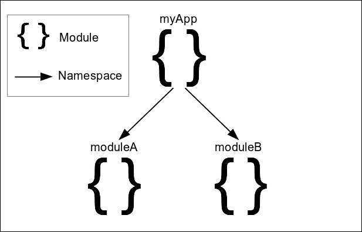
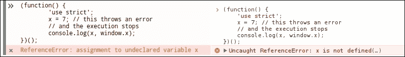

# 第四章：模块模式的分而治之

在本章中，我们将介绍模块和命名空间的概念，并看看它们如何带来更健壮的实现。我们将展示这些设计原则如何在应用程序中使用，通过展示一些最常用的开发模式来创建 JavaScript 中的**模块**。

在本章中，我们将：

+   复习模块和命名空间的概念

+   介绍对象字面量模式

+   介绍模块模式及其变种

+   介绍揭示模块模式及其变种

+   简要介绍 ES5 严格模式和 ES6 模块

+   解释模块如何用于 jQuery 应用程序产生益处

# 模块和命名空间

本章的两个主要实践是模块和命名空间，它们一起使用以便结构化和组织我们的代码。我们将首先分析模块的主要概念，即代码封装，然后我们将继续命名空间，用于逻辑上组织实现。

## 封装实现的内部部分

在开发大规模和复杂的 Web 应用程序时，从一开始就需要一个定义良好，结构化的架构的需求变得清晰。为了避免创建代码混乱的实现，其中我们的代码的不同部分以混乱的方式相互调用，我们必须将应用程序分割为小的，独立的部分。

这些独立的代码片段可以被定义为**模块**。为了记录这个架构原则，**计算机科学**已经定义了诸如**关注分离**之类的概念，其中每个模块的角色，操作和公开 API 都应严格定义并专注于为特定问题提供通用解决方案。

### 注意

有关**封装**和**关注分离**的更多信息，您可以访问[`developer.mozilla.org/en-US/docs/Glossary/Encapsulation`](https://developer.mozilla.org/en-US/docs/Glossary/Encapsulation)和[`aspiringcraftsman.com/2008/01/03/art-of-separation-of-concerns/`](http://aspiringcraftsman.com/2008/01/03/art-of-separation-of-concerns/)。

## 避免使用全局变量和命名空间

在 JavaScript 中，`window`对象也被称为**全局命名空间**，其中每个声明的变量和函数标识符默认附加在其上。**命名空间**可以定义为每个标识符必须是唯一的命名上下文。**命名空间**的主要概念是提供一种逻辑分组应用程序不同和独立一部分所有相关部分的方式。换句话说，它建议我们创建相关函数和变量的组，并使它们在相同的标识符下可访问。这有助于避免不同应用程序部分和所使用的其他 JavaScript 库之间的命名冲突，因为我们只需要在每个不同的命名空间下保持所有标识符唯一。

一个很好的名称空间的例子是 JavaScript 提供的数学函数和常量，它们被分组到名为`Math`的内置 JavaScript 对象下。由于 JavaScript 提供了 40 多个短命名的数学标识符，如`E`、`PI`和`floor()`，为了避免命名冲突并将它们分组在一起，它们被设计成作为`Math`对象的属性可访问，该对象充当了这个内置库的命名空间。

没有适当的名称空间，每个函数和变量必须在整个应用程序中具有唯一的名称，不同应用程序部分的标识符之间或者甚至与应用程序使用的第三方库的标识符之间可能发生冲突。最终，虽然模块提供了隔离应用程序每个独立部分的方法，但名称空间提供了一种将不同模块结构化成应用程序架构的方法。

## 这些模式的好处

基于模块和名称空间设计应用程序架构有助于更好地组织代码并明确分离部分。在这样的架构中，模块用于组合相关的实现部分，而名称空间将它们连接在一起以创建应用程序结构。



这种架构有助于协调大型开发团队，使独立部分的实现可以并行进行。它还可以缩短向现有实现中添加新功能所需的开发时间。这是因为可以轻松定位使用的现有部分，并且添加的实现很少与现有代码发生冲突的可能性。

由此产生的代码结构不仅干净分离，而且由于每个模块被设计来实现单一目标，它们也有很大可能性在其他类似的应用程序中使用。作为额外好处，由于每个模块的角色严格定义，因此在大型代码库中追踪错误的起源也变得更加容易。

## 广泛接受

社区和企业界意识到，为了编写在 JavaScript 中的可维护的大型前端应用程序，他们应该最终得出一套最佳实践，并应该将这些最佳实践纳入他们实现的每个部分中。

JavaScript 实现中模块和名称空间的接受和采用在社区和企业发布的最佳实践和代码风格指南中清晰可见。

例如，谷歌的 JavaScript 风格指南（可在[`google.github.io/styleguide/javascriptguide.xml#Naming`](https://google.github.io/styleguide/javascriptguide.xml#Naming)找到）描述并建议在我们的实现中采用名称空间：

> 始终使用与项目或库相关的唯一伪命名空间作为全局范围标识符的前缀。

此外，jQuery JavaScript 风格指南（可在 [`contribute.jquery.org/style-guide/js/#global-variables`](https://contribute.jquery.org/style-guide/js/#global-variables) 获取）建议使用全局变量，以便：

> 每个项目最多只能公开一个全局变量。

开发人员社区中另一个被接受的例子来自 Mozilla Developer Network。它的对象导向 JavaScript 指南（可在 [`developer.mozilla.org/en-US/docs/Web/JavaScript/Introduction_to_Object-Oriented_JavaScript#Namespace`](https://developer.mozilla.org/en-US/docs/Web/JavaScript/Introduction_to_Object-Oriented_JavaScript#Namespace) 获取）还建议使用命名空间，将应用程序的实现封装在一个单一的暴露变量下，使用以下简单的方法：

```js
// global namespace
var MYAPP = MYAPP || {};
```

# 对象字面量模式

对象字面量模式可能是将实现的所有相关部分封装在一个作为模块的伞对象下的最简单方式。这种模式的名称准确地描述了它的使用方式。开发人员只需声明一个变量并将需要封装到该模块中的所有相关部分赋值给一个对象即可。

让我们看看如何创建一个模块，以类似于 `jquery.guid` 的方式为页面提供唯一的整数：

```js
var simpleguid = { 
  guid: 1, 
  init: function() { 
    this.guid = 1; 
  }, 
  increaseCounter: function() { 
    this.guid++; 
    // or simpleguid.guid++;
  }, 
  getNext: function() { 
    var nextGuid = this.guid; 
    this.increaseCounter(); 
    return nextGuid; 
  } 
};
```

如上所述，您可以遵循的一个简单规则是将每个实现所需的所有变量和函数定义为对象的属性。我们的代码是可重用的，不会污染全局命名空间，除了为我们的模块定义一个单一变量名，例如在本例中是 `simpleguid`。

我们可以通过使用 `this` 关键字（例如 `this.guid`）或使用模块的全名（例如 `simpleguid.guid`）在内部访问模块属性。为了在我们的代码中使用上述模块，我们只需通过其名称访问其属性。例如，调用 `simpleguid.getNext()` 方法将向我们的代码返回下一个顺序数字 guid，并通过增加内部计数器改变模块的状态。

这种模式的一个负面方面是它不提供对模块内部部分的任何隐私。模块的所有内部部分都可以被外部代码访问和覆盖，即使我们理想地只希望公开 `simpleguid.init()` 和 `simpleguid.getNext()` 方法。有几种命名约定描述了将下划线 (_) 添加到仅用于内部使用的属性名称的开头或结尾，但从技术上讲，这并不能解决这个缺点。

另一个缺点是，使用对象字面量编写一个大型模块很容易让人感到疲倦。 JavaScript 开发人员习惯于在变量和函数定义后加上分号 (`;`)，尝试使用逗号 (`,`) 在每个属性后编写一个大型模块很容易导致语法错误。

尽管此模式使得声明模块的嵌套命名空间变得容易，但在需要多层嵌套的情况下，也可能导致代码结构庞大且难以阅读。例如，让我们看一下以下 Todo 应用程序的框架：

```js
var myTodoApp = { 
  todos: [], 
  addTodo: function(todo) { this.todos.push(todo); }, 
  getTodos: function() { return this.todos; }, 
  updateTodo: function(todo) { /*...*/ },
  imports: { 
    fromGDrive: function() { /*...*/ }, 
    fromUrl: function() { /*...*/ }, 
    fromText: function() { /*...*/ } 
  }, 
  exports: { 
    gDrivePublicKey: '#wnanqAASnsmkkw',
    toGDrive: function() { /*...*/ }, 
    toFile: function() { /*...*/ }, 
  }, 
  share: { 
    toTwitter: function(todo) { /*...*/ } 
  }
};
```

幸运的是，这可以通过将对象字面量拆分为每个子模块的多个赋值（最好是到不同的文件）来轻松解决，如下所示：

```js
var myTodoApp = { 
  todos: [], 
  addTodo: function(todo) { this.todos.push(todo); }, 
  getTodos: function() { return this.todos; }, 
  updateTodo: function(todo) { /*...*/ },
};
/* … */
myTodoApp.exports = { 
  gDrivePublicKey: '#wnanqAASnsmkkw', 
  toGDrive: function() { /*...*/ }, 
  toFile: function() { /*...*/ }, 
};
/*...*/
```

# 模块模式

基本模块模式的关键概念是提供一个简单的函数、类或对象，供应用程序的其余部分使用，通过一个众所周知的变量名。它使我们能够为模块提供一个最小的 API，通过隐藏不需要暴露的实现部分。这样，我们还可以避免用于我们模块的内部使用的变量和实用函数污染全局命名空间。

## IIFE 构建块

在本小节中，我们将简要介绍 IIFE 设计模式，因为它是我们将在本章中看到的所有模块模式变体的一个重要部分。**立即调用函数表达式**（**IIFE**）是 JavaScript 开发人员中非常常用的设计模式，因为它以清晰的方式隔离了代码块。在模块模式中，IIFE 用于包装所有实现，以避免污染全局命名空间，并向模块本身提供声明的隐私。

每个 IIFE 都创建了一个闭包，其中声明的变量和函数。创建的闭包使得 IIFE 的公开函数能够在其他部分的实现中被执行时保留对其环境余下声明的引用，并且正常访问它们。因此，IIFE 的非公开声明不会泄漏到外部，而是被保持私有，并且只能被创建的闭包中的函数访问。

### 注意

欲了解更多关于 IIFE 和闭包的信息，您可以访问[`developer.mozilla.org/en-US/docs/Glossary/IIFE`](https://developer.mozilla.org/en-US/docs/Glossary/IIFE) 和 [`developer.mozilla.org/en-US/docs/Web/JavaScript/Closures`](https://developer.mozilla.org/en-US/docs/Web/JavaScript/Closures)。

IIFE 最常用的用法如下：

```js
(function() { 
  var x = 7; 
  console.log(x); 
  // prints 7 
})(); 
```

由于前面的代码构造在第一眼看起来可能很奇怪，让我们看看它由哪些部分组成。IIFE 几乎等价于声明一个匿名函数，将其赋值给一个变量，然后执行它，如下面的代码所示：

```js
var tmp = function() { 
  var x = 7; 
  console.log(x); 
}; 

tmp(); 
// or 
(tmp)(); 
```

在前面的代码中，我们定义了一个函数表达式，并使用`tmp()`执行它。由于在 JavaScript 中，我们可以在标识符周围使用括号而不改变其含义，我们也可以使用`(tmp)();`来执行存储的函数。最后一步，为了将前面的代码转换为 IIFE，是将`tmp`变量替换为实际的匿名函数声明。

正如我们之前看到的那样，唯一的区别在于，使用 IIFE 时，我们确实需要声明一个变量来保存函数本身。我们只创建一个匿名函数，并在定义后立即调用它。

由于可以通过几种方式创建 IIFE，这可能看起来像是对 JavaScript 规则的一种练习，JavaScript 开发者社区已经得出结论，将上述代码结构作为此模式的参考点。这种创建 IIFE 的方式被认为具有更好的可读性，并且被大型库所使用，作为其被采用的结果，开发人员可以在大型 JavaScript 实现中轻松识别它。

创建 IIFE 的不常用方式的示例是以下代码结构：

```js
(function() { 
  // code 
}());
```

## 简单的 IIFE 模块模式

由于此模式没有实际名称，因此它被认为是定义的模块返回单个实体的事实。为了参考如何使用此模式创建可重用库，我们将重新编写之前看到的`simpleguid`模块。得到的实现将如下所示：

```js
var simpleguid = (function() { 
  var simpleguid = {}; 
  var guid; 

  simpleguid.init = function() { 
    guid = 1; 
  }; 

  simpleguid.increaseCounter = function() { 
    guid++; 
  }; 

  simpleguid.getNext = function() { 
    var nextGuid = guid; 
    this.increaseCounter(); 
    return nextGuid; 
  }; 

  simpleguid.init(); 

  return simpleguid;
})(); 
```

此模式使用 IIFE 定义一个充当模块容器的对象，将属性附加到该对象上，然后将其返回。前面代码的第一行中的变量`simpleguid`用作模块的命名空间，并赋予了 IIFE 返回的值。在返回对象上定义的方法和属性是模块的唯一公开部分，并构成其公共 API。

再次，这种模式允许我们使用`this`关键字，以便访问我们模块的公开方法和属性。此外，它还提供了在完成模块定义之前执行任何所需初始化代码的灵活性。

与**对象字面量模式**不同，**模块模式**使我们能够在模块中创建实际的私有成员。在 IIFE 中声明的变量，不附加到返回值的变量，比如`guid`变量，作为私有成员，只能被创建闭包的其他成员在模块内部访问。

最后，如果我们需要定义嵌套的命名空间，我们所需做的就是更改 IIFE 返回的值的赋值。作为应用程序用子模块结构化的示例，让我们看看如何为之前看到的 Todo 应用程序骨架定义导出子模块：

```js
var myTodoApp = (function() { 
  var myTodoApp = {}; 

  var todos = []; 

  myTodoApp.addTodo = function(todo) { 
    todos.push(todo); 
  };

  myTodoApp.getTodos = function() { 
    return todos; 
  };

  return myTodoApp; 
})(); 

myTodoApp.exports = (function() { 
  var exports = {}; 

  var gDrivePublicKey = '#wnanqAASnsmkkw'; 

  exports.toGDrive = function() { /*...*/ }; 

  exports.toFile = function() { /*...*/ }; 

  return exports; 
})();
```

鉴于我们应用的命名空间`myTodoApp`已在之前定义过了，`exports`子模块可以定义为其上的一个简单属性。要遵循的一个良好实践是为上述每个模块创建一个文件，使用 IIFE 作为代码拆分的标志。一个广泛使用的命名约定，也是由 Google 的 JavaScript 样式指南建议的，是为文件使用小写命名，并使用破折号分隔子模块。例如，按照这个命名约定，前面的代码应该分别定义在名为`mytodoapp.js`和`mytodoapp-exports.js`的两个文件中。

### 它如何被 jQuery 使用

**模块模式**被 jQuery 本身使用，以隔离 CSS 选择器引擎（**Sizzle**）的源代码，它为`$()`函数提供支持，并将其与 jQuery 源代码的其余部分隔离开来。从一开始，Sizzle 就是 jQuery 源代码的一个重要部分，目前大约有 2135 行代码；自 2009 年以来，它已经拆分为一个名为 Sizzle 的独立项目，这样就更容易维护，可以独立开发，并且可以被其他库重复使用：

```js
var Sizzle = (function(window) { 

  /* 179 lines of code */ 

  function Sizzle(selector, context, results, seed) { 
    /* 131 lines of code */ 
  } 

  /* 
    1804 lines of code , defining methods like: 
    Sizzle.attr 
    Sizzle.compile 
    Sizzle.contains 
    Sizzle.getText 
    Sizzle.matches 
    Sizzle.matchesSelector 
    Sizzle.select 
  */ 

  return Sizzle; 

})(window); 

jQuery.find = Sizzle; 
```

**Sizzle**被添加到 jQuery 的源码中的 IIFE 内部，而其主要功能则被返回并分配给`jQuery.find`以供使用。

### 注意

关于 Sizzle 的更多信息，请访问[`github.com/jquery/sizzle`](https://github.com/jquery/sizzle)。

## 命名空间参数模块变体

在这个变体中，我们不是从 IIFE 返回对象，然后将其分配给充当模块的命名空间的变量，而是创建命名空间并将其作为参数传递给 IIFE 本身：

```js
(function(simpleguid) { 
  var guid; 

  simpleguid.init = function() { 
    guid = 1; 
  }; 

  simpleguid.increaseCounter = function() { 
    guid++; 
  };

  simpleguid.getNext = function() { 
    var nextGuid = guid; 
    this.increaseCounter(); 
    return nextGuid; 
  }; 

  simpleguid.init(); 
})(window.simpleguid = window.simpleguid || {});
```

模块定义的最后一行检查模块是否已经定义；如果没有，则将其初始化为空对象文字，并将其分配给全局对象（`window`）。无论如何，在 IIFE 的第一行中，`simpleguid`参数都将保存模块的命名空间。

### 注意

上述表达式几乎等同于写成：

```js
window.simpleguid = window.simpleguid !== undefined ? window.simpleguid : {};
```

使用逻辑或运算符（`||`）使表达式更简短且更易读。此外，这是大多数 Web 开发人员已经学会轻松识别的模式，在许多开发模式和最佳实践中都有出现。

再次，这种模式允许我们使用`this`关键字从模块的导出方法中访问公共成员。同时，它还允许我们保持一些函数和变量私有，这些私有函数和变量只能被模块的其他函数访问。

即使将每个模块定义为自己的 JS 文件被认为是一种良好的做法，此变体还允许我们将大型模块的实现分割到多个文件中。这个好处来自于在将其初始化为空对象之前检查模块是否已经定义。这在某些情况下可能会有用，唯一的限制是每个模块的部分文件都可以访问其自己 IIFE 中定义的私有成员。

此外，为了避免重复，我们可以为 IIFE 的参数使用更简单的标识符，并将我们的模块编写为如下所示：

```js
(function(namespace) { 
  /* … */

  namespace.getNext = function() { 
    var nextGuid = guid; 
    this.increaseCounter(); 
    return nextGuid; 
  }; 

  namespace.init(); 
})(window.simpleguid = window.simpleguid || {});
```

当涉及具有嵌套命名空间的应用程序时，这种模式可能开始感觉阅读起来有点不舒服。每个额外的嵌套命名空间级别所定义的模块定义的最后一行将会变得越来越长。例如，让我们看一下我们的 Todo 应用程序的`exports`子模块将会是怎样的：

```js
(function(exports) { 
  var gDrivePublicKey = '#wnanqAASnsmkkw'; 

  exports.toGDrive = function() { /*...*/ }; 

  exports.toFile = function() { /*...*/ }; 

})(myTodoApp.exports = myTodoApp.exports || {}); 
```

正如您所见，每个额外级别的嵌套命名空间都需要在作为 IIFE 参数传递的赋值两侧添加。对于具有复杂功能并导致多级嵌套命名空间的应用程序，这可能导致模块定义看起来像这样：

```js
(function(smallModule) { 

  smallModule.method = function() { /*...*/ }; 

  return smallModule; 
})(myApp.bigFeature.featurePart.smallModule = myApp.bigFeature.featurePart.smallModule || {}); 
```

此外，如果我们想要提供与原始代码示例相同的安全保证，那么我们需要为每个命名空间级别添加类似的安全检查。考虑到这一点，我们之前看到的 Todo 应用程序的`exports`模块将需要具有以下形式：

```js
(function(exports) { 
  var gDrivePublicKey = '#wnanqAASnsmkkw'; 

  exports.toGDrive = function() { /*...*/ }; 

  exports.toFile = function() { /*...*/ }; 

})((window.myTodoApp = window.myTodoApp || {}, myTodoApp.exports = myTodoApp.exports || {})); 
```

如前所述的代码中所示，我们使用逗号运算符（`,`）来分隔每个命名空间的存在检查，并将整个表达式包装在额外的括号对中，以便整个表达式作为 IIFE 的第一个参数使用。使用逗号运算符（`,`）将表达式连接起来将导致它们按顺序计算，并将最后评估的表达式的结果作为 IIFE 的参数传递，并且该结果将用作模块的命名空间。请记住，对于每个额外的嵌套命名空间级别，我们都需要使用逗号运算符（`,`）添加额外的存在检查表达式。

这种模式的一个缺点，尤其是在用于嵌套命名空间时，是模块的命名空间定义在文件末尾。即使强烈建议为 JS 文件命名，以便它们正确表示包含的模块，例如，`mytodoapp.exports.js`；但是，没有命名空间在文件顶部附近有时可能会产生反效果或误导性。解决这个问题的一个简单方法是在 IIFE 之前定义命名空间，然后将其作为参数传递。例如，使用这种技术的前述代码将转换为以下形式：

```js
window.myTodoApp = window.myTodoApp || {}; 
myTodoApp.exports = myTodoApp.exports || {}; 

(function(exports) { 
  var gDrivePublicKey = '#wnanqAASnsmkkw'; 

  exports.toGDrive = function() { /*...*/ }; 

  exports.toFile = function() { /*...*/ }; 

})(myTodoApp.exports); 
```

## IIFE 包含的模块变体

像在模块模式的以前变体一样，这种变体实际上并没有一个特定的变体名称，但是通过代码结构的方式进行识别。这种变体的关键概念是将所有模块的代码移至 IIFE 中：

```js
(function() { 

  window.simpleguid = window.simpleguid || {}; 

  var guid; 

  simpleguid.init = function() { 
    guid = 1; 
  }; 

  simpleguid.increaseCounter = function() { 
    guid++; 
  }; 

  simpleguid.getNext = function() { 
    var nextGuid = guid; 
    this.increaseCounter(); 
    return nextGuid; 
  }; 

  simpleguid.init(); 
})(); 
```

这种变体看起来与前一种非常相似，主要区别在于命名空间的创建方式。首先，它将命名空间检查和初始化保持在模块的顶部附近，就像一个标题，使得我们的代码更具可读性，无论我们是否为模块使用单独的文件。与模块模式的其他变体一样，它支持模块的私有成员，并且还允许我们使用`this`关键字来访问公共方法和属性，使得我们的代码看起来更符合面向对象的特性。

关于具有嵌套命名空间的实现，我们的待办应用程序骨架的`exports`子模块的代码结构如下所示：

```js
(function() { 
  window.myTodoApp = window.myTodoApp || {}; 
  myTodoApp.exports = myTodoApp.exports || {}; 

  var gDrivePublicKey = '#wnanqAASnsmkkw'; 

  myTodoApp.exports.toGDrive = function() { /*...*/ }; 

  myTodoApp.exports.toFile = function() { /*...*/ }; 

})();
```

如前面的代码所示，我们还从以前的变体中借用了命名空间定义检查，并同样将其应用到嵌套命名空间的每个级别。即使这并非绝对必要，但它带来了我们之前讨论过的好处，比如使我们能够将模块定义分割为多个文件，并且甚至导致应用程序模块导入顺序方面的实现更容错。

# 揭示模块模式

**揭示模块模式**是**模块模式**的一种变体，具有一个广为人知和认可的名称。使得这种模式特殊的是它结合了**对象字面量模式**和**模块模式**的最佳部分。模块的所有成员都声明在一个 IIFE 内部，最终返回一个仅包含模块公共成员的**对象字面量**，并分配给作为我们命名空间的变量：

```js
var simpleguid = (function() { 
  var guid = 1; 

  function init() { 
    guid = 1; 
  } 

  function increaseCounter() { 
    guid++; 
  } 

  function getNext() { 
    var nextGuid = guid; 
    increaseCounter(); 
    return nextGuid; 
  } 

  return { 
    init: init, 
    getNext: getNext 
  }; 
})(); 
```

这种模式与其他变体区别最大的一个主要好处是它允许我们像在**全局命名空间**中声明代码一样，在 IIFE 内部编写所有模块的代码。此外，这种模式不需要在声明公共和私有成员的方式上做任何变化，使得模块代码看起来统一。

由于返回的对象字面量定义了模块的公开成员，因此这也是一种方便的方法来检查其公共 API，即使它是由其他人编写的。此外，如果我们需要在模块的 API 中公开一个私有方法，我们只需向返回的对象字面量中添加一个额外的属性，而无需更改其定义的任何部分。此外，使用对象字面量使我们能够更改模块 API 的公开标识符，而不需要更改模块内部实现使用的名称。

即使这不太明显，`this`关键字也可以用于模块的公共成员之间的调用。不幸的是，*对于此模式而言，使用`this`关键字是不鼓励的*，因为它会破坏函数声明的统一性，并且很容易导致错误，特别是在将公共方法的可见性更改为私有时。

由于命名空间定义被保留在 IIFE 的体外，这种模式清晰地将命名空间定义与模块的实际实现分开。在嵌套命名空间中使用此模式来定义模块不会影响模块的实现，任何时候它都不会与顶级命名空间模块有所不同。重写我们的 Todo 骨架应用程序的`exports`子模块，使用此模式将使其看起来像这样：

```js
myTodoApp.exports = (function() { 
  var gDrivePublicKey = '#wnanqAASnsmkkw'; 

  function toGDrive() { /*...*/ } 

  function toFile() { /*...*/ } 

  return { 
    toGDrive: toGDrive, 
    toFile: toFile 
  }; 
})();
```

由于这种分离，我们减少了代码重复，并且可以轻松地更改模块的命名空间，而不会对其实现造成任何影响。

# 使用 ES5 严格模式

对于所有将 IIFE 作为其基本构建块的模块模式的一个小但宝贵的补充，是使用**严格模式**来执行 JavaScript。这在 JavaScript 的第五版中标准化，是一种选择性的执行模式，具有略微不同的语义，以防止 JavaScript 的一些常见陷阱，但也考虑了向后兼容性。

在此模式下，JavaScript 运行时引擎将防止您意外创建全局变量并污染全局命名空间。即使在不是特别大的应用程序中，也很有可能在变量的初始赋值之前缺少`var`声明，自动将其提升为全局变量。为了防止这种情况，严格模式在向未声明的变量发出赋值时会抛出错误。以下图像显示了 Firefox 和 Chrome 在发生严格模式违规时抛出的错误。



可以通过在任何其他语句之前添加`"use strict";`或`'use strict';`语句来启用此模式。尽管可以在全局范围内启用它，但强烈建议仅在函数范围内启用它。在全局范围内启用它可能会使不符合严格模式的第三方库停止工作或行为异常。另一方面，启用严格模式的最佳位置是在模块的 IIFE 内部。严格模式将递归地应用于该 IIFE 的所有嵌套命名空间、方法和函数。

### 注意

有关 JavaScript 严格执行模式的更多信息，您可以访问 [`developer.mozilla.org/en-US/docs/Web/JavaScript/Reference/Strict_mode`](https://developer.mozilla.org/en-US/docs/Web/JavaScript/Reference/Strict_mode)。

# 引入 ES6 模块

尽管 JavaScript 最初没有像其他编程语言一样内置的打包和命名空间支持，但 Web 开发人员通过定义并采用一些设计模式来填补这些空白。这些软件开发实践解决了 JavaScript 缺失的功能，并允许在这种一些年前大多用于表单验证的编程语言上进行大规模和可扩展的复杂应用程序实现。

直到 2015 年 6 月作为标准发布的 JavaScript 第 6 版（通常称为 ES6），引入了模块的概念作为语言的一部分。

### 注意

ES6 是 ECMAScript 第 6 版的缩写，也称为 Harmony 或 ECMAScript 2015，其中 ECMAScript 是 JavaScript 的标准化过程使用的术语。规范可在 [`www.ecma-international.org/ecma-262/6.0/index.html#sec-modules`](http://www.ecma-international.org/ecma-262/6.0/index.html#sec-modules) 找到。

作为 ES6 模块的示例，我们将看到 `simpleguid` 模块的许多编写方式之一：

```js
var es6simpleguid = {}; 
export default es6simpleguid; 

var guid; 

es6simpleguid.init = function() { 
  guid = 1; 
}; 

es6simpleguid.increaseCounter = function() { 
  guid++; 
}; 

es6simpleguid.getNext = function() { 
  var nextGuid = guid; 
  this.increaseCounter(); 
  return nextGuid; 
}; 

es6simpleguid.init();
```

如果我们将此保存为名为 `es6simpleguid.js` 的文件，则我们可以通过简单地编写以下代码在不同的文件中导入并使用它：

```js
import es6simpleguid from 'es6simpleguid'; 
console.log(es6simpleguid.getNext());
```

由于 **ES6 模块** 默认处于严格模式，因此今天使用首选模块模式变体编写模块，并启用严格模式，将使您更容易过渡到 ES6 模块。上述某些模式需要进行非常少的更改才能实现这一点。例如，在 IIFE-contained 模块模式变体中，只需要删除 IIFE 和 `"use strict";` 语句，用变量替换模块的命名空间，并在其上使用 `export` 关键字。

不幸的是，在撰写本书时，没有任何浏览器对 ES6 模块提供 100% 的支持。因此，需要特殊的加载程序或工具将 ES6 转译为 ES5，以便我们可以开始使用 ES6 的新功能编写我们的代码。

### 注意

欲知详情，可访问 ES6 模块加载器的文档页面 [`github.com/ModuleLoader/es6-module-loader`](https://github.com/ModuleLoader/es6-module-loader)，和 Babel 转译器（之前称为 ES6toES5） [`babeljs.io/`](http://babeljs.io/)。

# 在 jQuery 应用程序中使用模块

为了演示模块模式如何带来更好的应用程序结构，我们将重新实现前几章中所见的仪表板示例。我们将包括到目前为止所见的所有功能，包括打开信息框的计数器。所使用的 HTML 和 CSS 代码与前一章完全相同，因此我们的仪表板看起来与以前完全相同：


为了进行演示，我们将将我们的 JavaScript 代码重构为四个小模块，使用简单的 IIFE 封装的 Module 变体。`dashboard` 模块将充当代码执行的主要入口，也将充当 dashboard 应用程序的中央协调点。`categories` 子模块将负责实现我们的 dashboard 顶部的上部分。这包括类别选择，适当按钮的呈现和按钮点击的处理。`informationBox` 子模块将负责我们的 dashboard 的主要部分。它将提供创建和删除 dashboard 中信息框的方法。最后，计数器子模块将负责保持当前打开的信息框数字段最新，并响应用户操作。

为了支持这种多模块架构，我们需要对页面的 HTML 中包含 JavaScript 文件的方式做出一些限制：

```js
<script type="text/javascript" src="img/jquery.js"></script>
<script type="text/javascript" src="img/dashboard.js"></script>
<script type="text/javascript" src="img/dashboard.categories.js"></script> <script type="text/javascript" src="img/dashboard.informationbox.js">
</script>
<script type="text/javascript" src="img/dashboard.counter.js"></script>
```

### 提示

即使这种多文件结构使得开发和调试过程变得更加容易，我们仍建议在将应用移至生产环境之前将所有这些文件合并。有几个专门用于此任务的工具存在；例如，非常简单有效的 grunt-contrib-concat 项目，可在 [`github.com/gruntjs/grunt-contrib-concat`](https://github.com/gruntjs/grunt-contrib-concat) 获取。

## 主要的 dashboard 模块

`dashboard` 模块的最终代码将如下所示：

```js
(function() { 
    'use strict'; 

    window.dashboard = window.dashboard || {};

    dashboard.$container = null; 

    dashboard.init = function() { 
        dashboard.$container = $('.dashboardContainer'); 

        dashboard.categories.init(); 
        dashboard.informationBox.init(); 
        dashboard.counter.init(); 
    }; 

    $(document).ready(dashboard.init);
})(); 
```

如我们先前提到的，`dashboard` 模块将是我们应用的中心点。由于这是我们应用执行的起始点，它的主要职责是为自身和每个子模块执行所有必需的初始化。调用 `init()` 方法被包装在对 `$(document).ready()` 方法的调用内，以便其执行被延迟直到页面的 DOM 树完全加载。

需要注意的一点是，在初始化期间，我们进行 DOM 遍历以找到 dashboard 的容器元素，并将其存储到 Module 的一个公共属性 `$container` 中。此元素将被 dashboard 的所有需要访问 DOM 树的方法使用，以便将它们的代码范围限定在该容器元素内，避免使用复杂选择器不断遍历整个 DOM 树。保留关键 DOM 元素的引用并在不同的子模块中重用它们，可以使应用程序更加灵活，并减少意外干扰页面的机会；从而导致更少且更易于解决的错误。

### 提示

**缓存元素但避免内存泄漏。**

请记住，保持对不断添加和移除页面的 DOM 元素的引用会给我们的应用程序增加额外的复杂性。这甚至可能导致内存泄漏，如果我们不小心保留对已从页面中移除的元素的引用。对于这样的元素，如信息框，更安全、更有效的方法可能是对它们触发的事件进行委派处理，并在需要时进行范围限定的 DOM 遍历，以检索具有新引用的元素的 jQuery 对象。

## 类别模块

让我们继续进行 `categories` 子模块：

```js
(function() { 
    'use strict'; 

    dashboard.categories = dashboard.categories || {}; 

    dashboard.categories.init = function() { 
        dashboard.$container.find('#categoriesSelector').change(function() { 
            var $selector = $(this); 
            var categoryIndex = +$selector.val(); 
            dashboard.categories.selectCategory(categoryIndex); 
        }); 

        dashboard.$container.find('.dashboardCategories').on('click', 'button', function() { 
            var $button = $(this); 
            var itemName = $button.text(); 
            dashboard.informationBox.openNew(itemName); 
        }); 
    }; 

    dashboard.categories.selectCategory = function(categoryIndex) { 
        var $dashboardCategories = dashboard.$container.find('.dashboardCategory'); 
        var $selectedItem = $dashboardCategories.eq(categoryIndex).show(); 
        $dashboardCategories.not($selectedItem).hide(); 
    }; 
})(); 
```

此子模块的初始化方法使用主模块提供的 `$container` 元素的引用，并向页面添加了两个观察者。第一个处理 `<select>` 类别上的 `change` 事件，并调用 `selectCategory()` 方法，传递所选类别的数值。该子模块的 `selectCategory()` 方法然后将处理显示适当的类别项，将其与事件处理代码解耦，并使其成为整个应用程序可重用的功能。

在此之后，我们创建了一个单一的**委托事件观察者**，处理 `<button>` 类别项上的 `click` 事件。它提取了按下的 `<button>` 的文本，并调用包含所有与信息框相关的实现的 `informationBox` 子模块的 `openNew()` 方法。在非演示级别的应用程序中，此类方法的参数可能是一个标识符，而不是用于从远程服务器检索更多详细信息的文本值。

## 信息框模块

包含与我们仪表板主要区域相关的实现部分的 `informationBox` 子模块具有以下形式：

```js
(function() { 
    'use strict'; 

    dashboard.informationBox = dashboard.informationBox || {}; 

    var $boxContainer = null; 

    dashboard.informationBox.init = function() { 
        $boxContainer = dashboard.$container.find('.boxContainer'); 

        $boxContainer.on('click', '.boxCloseButton', function() { 
            var $button = $(this); 
            dashboard.informationBox.close($button); 
        }); 
    }; 

    dashboard.informationBox.openNew = function(itemName) { 
        var boxHtml = '<div class="boxsizer"><article class="box">' + 
                '<header class="boxHeader">' + 
                    itemName + 
                    '<button class="boxCloseButton">&#10006;' + 
                    '</button>'+ 
                '</header>' + 
                'Information box regarding ' + itemName + 
            '</article></div>'; 
        $boxContainer.append(boxHtml); 
    }; 

    dashboard.informationBox.close = function($boxElement) { 
        $boxElement.closest('.boxsizer').remove();
    }; 

})();
```

此子模块初始化代码的第一件事是使用仪表板的 `$container` 属性来检索并存储容纳信息框的容器的引用到 `$boxContainer` 变量中，从而进行作用域限定。

`openNew()` 方法负责创建新信息框所需的 HTML，并使用 `$boxContainer` 变量将其添加到仪表板中，该变量像模块的私有成员一样，用于缓存先前分配的 DOM 元素的引用。这是一个很好的实践，可以提高应用程序的性能，因为存储的元素从未从页面中移除，并且在初始化和 `openNew()` 方法调用时都会使用。这样，我们就不再需要在每次调用 `openNew()` 方法时执行缓慢的 DOM 遍历了。

另一方面，`close()` 方法负责从仪表板中移除现有的信息框。它接收一个与目标信息框相关的 jQuery 组合集合对象作为参数，这是基于 `$.fn.closest()` 方法的工作方式，可以是框元素容器或其任何后代。

### 提示

提供灵活性的方法实现方式可以使它们被大型应用程序中的更多部分使用。对于此方法的下一个逻辑步骤，留给读者作为练习的是使其接受参数，即需要关闭的信息框的索引或标识符。

## 计数器模块

最后，这里是我们如何将我们在上一章中看到的`counter`实现重写为一个独立的子模块：

```js
(function() { 
    'use strict'; 

    dashboard.counter = dashboard.counter || {}; 

    var dashboardItemCounter; 
    var $counter; 

    dashboard.counter.init = function() { 
        $counter = $('#dashboardItemCounter'); 

        var $boxContainer = dashboard.$container.find('.boxContainer'); 
        var initialCount = $boxContainer.find('.boxsizer').length; 
        dashboard.counter.setValue(initialCount); 

        dashboard.$container.find('.dashboardCategories').on('click', 'button', function() { 
            dashboard.counter.setValue(dashboardItemCounter + 1); 
        }); 

        $boxContainer.on('click', '.boxCloseButton', function() { 
            dashboard.counter.setValue(dashboardItemCounter - 1); 
        }); 
    }; 

    dashboard.counter.setValue = function (value) { 
        dashboardItemCounter = value; 
        $counter.text(dashboardItemCounter); 
    }; 

})(); 
```

对于此子模块，我们使用`$counter`变量作为私有成员来缓存对显示计数的元素的引用。模块的另一个私有成员是`dashboardItemCounter`变量，它在任何时间点都将保存仪表板中可见信息框的数量。将这些信息保存在模块的成员中可以减少我们需要到达 DOM 树以提取应用程序状态信息的次数，从而使实现更加高效。

### 提示

将应用程序的状态保留在 JavaScript 对象或模块的属性中，而不是到 DOM 中提取它们，这是一种非常好的做法，可以使应用程序的架构更加面向对象，并且也被大多数现代 Web 开发框架采纳。

在模块初始化期间，我们给计数器变量赋予一个初始值，以便我们不再依赖页面的初始 HTML，并且拥有更健壮的实现。此外，我们附加了两个**委托事件观察器**，一个用于导致创建新信息框的点击，另一个用于关闭它们的点击。

## 实现概述

通过以上内容，我们将仪表板骨架应用程序重写为模块化架构。所有可用操作都公开为每个子模块的公共方法，可以通过编程方式调用，这样它们就与触发它们的事件解耦了。

对于读者来说，一个很好的练习是通过在上述实现中采用发布者/订阅者模式来进一步推动解耦。代码已经结构化为模块，这样的更改将更容易实现。

另一个可以以不同方式实现的部分是子模块的初始化方式。我们可以不再明确地在主仪表板模块中协调每个模块的初始化，而是通过在`$(document).ready()`调用中包装`init()`方法的调用并在声明后立即进行初始化来独立地初始化每个子模块。另一方面，没有一个中心点来协调初始化并依赖页面事件可能会感觉不够确定。另一种实现方式可能是像发布者/订阅者模式一样，在我们的主模块上暴露一个`registerForInit()`方法，它将通过数组跟踪已被请求进行初始化的模块。

### 注意

欲了解更多 jQuery 代码组织技巧，您可以访问[`learn.jquery.com/code-organization/concepts/`](http://learn.jquery.com/code-organization/concepts/)。

# 摘要

在这一章节中，我们学习了模块和命名空间的概念，还有它们在大型应用中采用时带来的好处。我们深入分析了最广泛采用的模式，并比较了它们的优点和局限性。我们通过示例学习了如何使用对象字面量模式、模块模式的变体以及揭示模块模式来开发模块。

我们继续简要介绍 ES5 的严格模式，并看到它如何有益于当今的模块。然后我们学习了一些关于标准化但尚未广泛支持的**ES6 模块**的细节。最后，我们看到在实施中使用模块模式后，仪表板应用程序的架构如何出现了巨大变化。

现在我们已经完成了关于如何使用模块和命名空间的介绍，我们可以继续下一章节，在下一章节中我们将介绍外观模式。在下一章节中，我们将学习关于外观的哲学，以及它们定义代码抽象的统一方式，使其易于其他开发人员理解和重复使用。
