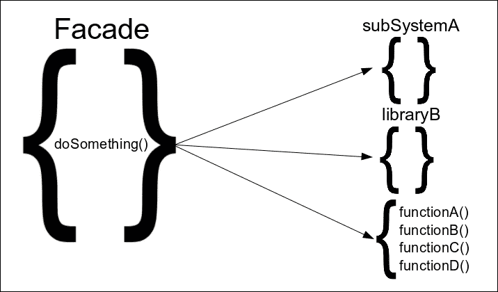
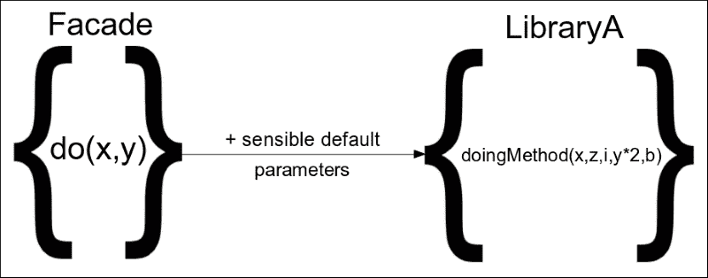
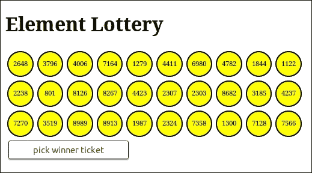

# 第五章：门面模式

在这一章中，我们将展示**门面模式**，一种结构设计模式，试图定义开发人员应如何在其代码中创建抽象的统一方式。最初，我们将使用此模式来包装复杂的 API，并公开专注于我们应用程序需求的简化 API。我们将看到 jQuery 如何在其实现中采用此模式的概念，它如何将是 Web 开发者工具箱中的重要组成部分的复杂实现封装成易于使用的 API，以及这对其广泛采用的关键作用。

在这一章中，我们将：

+   介绍门面模式

+   记录其关键概念和优势

+   看看 jQuery 在其实现中如何使用它

+   编写一个示例实现，其中门面被用于完全抽象和解耦第三方库

# 介绍门面模式

门面模式是一种处理如何创建实现各部分的抽象的结构性软件设计模式。门面模式的关键概念是抽象出现有实现，并提供一个简化的 API，更好地匹配开发应用程序的用例。根据大多数描述此模式的计算机科学参考书目，门面最常见的实现方式是作为一个专门的类，用于将应用程序的实现分割成更小的代码片段，同时提供一个完全隐藏封装的复杂性的接口。在 Web 开发世界中，还常常使用普通对象或函数来实现门面，利用 JavaScript 将函数视为对象的方式。

在具有模块化结构的应用程序中，例如上一章的示例，通常还会将门面实现为具有自己命名空间的单独模块。此外，对于具有非常复杂部分的较大实现，也可以采用多级门面的方法。再次，门面将作为模块和子模块实现，顶层门面将编排其子模块的方法，并提供一个完全隐藏整个子系统复杂性的 API。

# 此模式的优势

大多数情况下，门面模式被采用于具有相对高复杂度并在应用程序的多个地方使用的实现部分，其中大量的代码可以被简单调用已创建的门面替换，这不仅减少了代码重复，还有助于增加实现的可读性。由于门面方法通常以它们封装的高级应用概念命名，所以产生的代码也更易于理解。门面通过其方便的方法提供的简化 API，导致实现更易于使用、理解，也更易于编写单元测试。



此外，将复杂实现抽象化为 Facades 在需要改变实现的业务逻辑时证明了其有用性。如果 Facade 具有良好设计的 API，并对未来需求进行了预测，这些更改通常只需要修改 Facade 的代码，而不会影响应用程序的其余实现，并遵循**关注点分离**原则。

以同样的方式，使用 Facades 将第三方库的 API 抽象化以更好地匹配每个应用程序的需求，提供了我们的代码与所用库之间的一定程度解耦。如果第三方库更改其 API 或需要用另一个替换，应用程序的不同模块不需要重新编写，因为实现更改将被限制在包装 Facade 上。在这种情况下，只需要使用新库 API 提供等效实现，同时保持 Facade 的 API 不变即可。



作为编排方法调用并为特定用例使用明智默认值的示例，请看以下示例实现：

```js
function do (x, y) {
  var z = y - x / 2;
  var yy = Math.pow(y, 2);
  var b = 3 * Math.random(); // add some randomness to the result
  var i = 0; // for this case
  return LibraryA.doingMethod(x, z, i, yy, b);
}
```

# 它是如何被 jQuery 接受的

jQuery 实现的非常大的部分专门用于为不同的 JavaScript API 已经允许我们实现的事物提供更简单、更短、更方便的方法，但需要更多的代码行数和工作量。通过查看 jQuery 提供的 API，我们可以区分出一些相关方法的组。这种分组也可以在源代码结构中看到，将相关 API 的方法放置在彼此附近。

即使单词**Facade**在 jQuery 的源代码中没有出现，但通过观察相关方法在公开的 jQuery 对象上的定义方式，可以看出这种模式的使用。大多数情况下，形成一组的相关方法被实现并定义为**对象字面量**的属性，然后通过一次调用`$.extend()`或`$.fn.extend()`方法附加到 jQuery 对象上。你可能还记得，从本章开始时，这几乎与计算机科学常用来描述如何实现 Facade 的方式完全匹配，唯一的区别在于，在 JavaScript 中，我们可以创建一个普通对象，而不需要首先定义一个类。因此，jQuery 本身可以被视为一组 Facades，其中每个 Facade 都通过提供便利方法的 API 独立地为库增添了巨大价值。

### 注意

欲了解更多关于`$.extend()`和`$.fn.extend()`的信息，您可以访问[`api.jquery.com/jQuery.extend/`](http://api.jquery.com/jQuery.extend/)和[`api.jquery.com/jQuery.fn.extend/`](http://api.jquery.com/jQuery.fn.extend/)。

jQuery 实现中一些承担关键角色并对其采用起到至关重要作用的抽象 API 组如下：

+   DOM 遍历 API

+   AJAX API

+   DOM 操作 API

+   特效 API

此外，一个很好的例子是 jQuery 的事件 API，它提供了各种方便的方法，用于最常见的使用情况，比相应的纯 JavaScript API 更易于使用。

## jQuery DOM 遍历 API

在 jQuery 发布时，网页开发人员只能使用非常有限的`getElementById()`和`getElementsByTagName()`方法来定位页面的特定 DOM 元素，因为其他方法，如`getElementsByClassName()`，并未得到现有浏览器的广泛支持。jQuery 团队意识到，如果有一个简单的 API 可以轻松进行这样的 DOM 遍历，它能够在所有浏览器上以相同的方式工作，像熟悉的**CSS 选择器**一样有效，并且尽最大努力使这样的实现成为现实。

这一努力的成果是如今著名的 jQuery DOM 遍历 API，通过`$()`函数公开，它在**Level 2 Selector API**的`querySelectorAll()`方法的标准化中扮演了重要角色。其底层实现使用**DOM API**提供的方法，在 jQuery v2.2.0 中约有 2,135 行代码，而在需要支持旧版浏览器的 v1.x 版本中甚至更多。正如我们在本章中所看到的，由于其复杂性，这一实现现在已成为一个名为**Sizzle**的独立项目的一部分。

### 注

有关 Sizzle 和`querySelectorAll()`方法的更多信息，请访问[`github.com/jquery/sizzle`](https://github.com/jquery/sizzle)和[`developer.mozilla.org/en-US/docs/Web/API/document/querySelectorAll`](https://developer.mozilla.org/en-US/docs/Web/API/document/querySelectorAll)。

尽管其实现复杂，所公开的 API 非常易于使用，主要使用简单的 CSS 选择器作为字符串参数，这使得它成为一个很好的例子，说明外观模式可以完全隐藏其内部工作的复杂性并公开一个方便的 API。由于 Sizzle 的 API 仍然相当复杂，jQuery 库实际上使用自己的 API 包装它，作为额外的 Facade 级别：

```js
// Line 733
function Sizzle( selector, context, results, seed ) { /* ... */ }

// Line 2678
jQuery.find = Sizzle;
```

jQuery 库首先保留 Sizzle 对内部`jQuery.find()`方法的引用，然后使用它来实现其所有公开的 DOM 遍历方法，这些方法适用于像`$.fn.find()`这样的复合对象：

```js
// Line 2769
jQuery.fn.extend( { 
  find: function( selector ) { 
    /* 15 lines of code */ 
    for ( i = 0; i < len; i++ ) { 
 jQuery.find( selector, self[ i ], ret ); 
    } 
    /* 3 lines of code */
    return ret; 
  } 
} );
```

最后，著名的`$()`函数实际上可以以多种方式调用，但即使使用 CSS 选择器作为字符串参数调用时，它实际上有一个额外的隐藏复杂性：

```js
// Line 71
jQuery = function( selector, context ) { 
  return new jQuery.fn.init( selector, context ); 
}; 

// Line 2825
rquickExpr = /^(?:\s*(<[\w\W]+>)[^>]*|#([\w-]*))$/, 
// Line 2735 
init = jQuery.fn.init = function( selector, context, root ) { 
  /* 12 lines of code */ 
 if ( typeof selector === "string" ) { 
    if (/* ... */) { 
      /* 3 lines of code */ 
    } else { 
      match = rquickExpr.exec( selector ); 
    } 

    // Match html or make sure no context is specified for #id 
    if ( match && ( match[ 1 ] || !context ) ) { 
      if ( match[1] ) {
      /* 27 lines of code */ 
      // HANDLE: $(#id) 
      } else { 
 elem = document.getElementById( match[ 2 ] ); 

        // Support: Blackberry 4.6 
        // gEBID returns nodes no longer in the document (#6963) 
        if ( elem && elem.parentNode ) { 
          // Inject the element directly into the jQuery object 
          this.length = 1; 
          this[ 0 ] = elem; 
        } 

        this.context = document; 
        this.selector = selector; 
        return this; 
      } 

    // HANDLE: $(expr, $(...)) 
    } else if ( !context || context.jquery ) { 
 return ( context || root ).find( selector ); 

    // HANDLE: $(expr, context) 
    // (which is just equivalent to: $(context).find(expr) 
    } else { 
 return this.constructor( context ).find( selector ); 
    } 
  } /* else ... 21 lines of code */
};
```

如您所见，在上述代码中，`$()`实际上是使用`$.fn.init()`创建一个新对象。它不仅仅是`$.fn.find()`或`jQuery.find()`的入口点，而是一个隐藏了一层优化的门面。具体来说，它通过直接调用`getElementById()`方法，使得 jQuery 在使用简单的 ID 选择器时，通过避免调用`$.fn.find()`和 Sizzle，而变得更快。

## 属性访问和操作 API

遵循门面模式原则的另一个非常有趣的抽象，可以在 jQuery 源代码中找到，即`$.fn.prop()`方法。像`$.fn.attr()`、`$.fn.val()`、`$.fn.text()`和`$.fn.html()`一样，它属于一系列既是相应主题的获取器又是设置器的方法。该方法的执行模式的区分是通过检查在调用期间传递的参数数量来完成的。这种方便的 API 让我们只需记住更少的方法签名，并且使得设置器只需要一个额外的参数来进行区分。例如，`$('#myCheckBox').prop('checked')`将根据所选复选框的状态返回 true 或 false。另一方面，`$('#myCheckBox').prop('checked', true);`将对该复选框进行程序化的选中。在同样的概念中，`$('button').prop('disabled', true);`将禁用页面上所有`<button>`元素。

`$.fn.prop()`方法执行 jQuery 复合对象处理，但 Facade 的实际实现是内部的`jQuery.prop()`方法。为 Facade 的实现增加复杂性的一个额外问题是，一些 HTML 属性在 DOM 元素上具有与之对应的不同标识符：

```js
jQuery.extend( { 

  prop: function( elem, name, value ) { 
    /* 8 lies of code */
    if ( nType !== 1 || !jQuery.isXMLDoc( elem ) ) {
      // Fix name and attach hooks 
 name = jQuery.propFix[ name ] || name; 
 hooks = jQuery.propHooks[ name ]; 
    } 

 if ( value !== undefined ) { 
      if ( hooks && "set" in hooks &&
        ( ret = hooks.set( elem, value, name ) ) !== undefined ) {
        return ret;
      }
 return ( elem[ name ] = value );
    }

    if ( hooks && "get" in hooks &&( ret = hooks.get( elem, name ) ) !== null ) {
      return ret;
    }
 return elem[ name ];
  }, 

  propHooks: { 
    tabIndex: { 
      get: function( elem ) { 
        var tabindex = jQuery.find.attr( elem, "tabindex" );
        return tabindex ?parseInt( tabindex, 10 ) : /*...*/;
      }
    }
  },

  propFix: {
    "for": "htmlFor",
    "class": "className"
  } 
} );
```

第一个突出显示的代码区域通过使用`propFix`和`propHooks`对象来高效地解决属性到属性标识符不匹配的问题。`propFix`对象就像一个简单的字典，用于匹配标识符，而`propHooks`对象则保存一个函数，以一种不那么硬编码的方式进行匹配，通过编程化的测试。这是一个通用的实现，可以通过向这两个对象添加额外的属性来轻松扩展。

其余突出显示的区域负责方法的获取器/设置器模式。总体实现是执行以下任务：

+   检查是否将值作为参数传递，并且如果属性发现分配成功，则执行分配并返回该值。

+   或者，如果没有传递值，则返回可检索的请求属性的值。

# 在我们的应用程序中使用门面

为了演示外观如何被用来封装复杂性，帮助我们执行关注点分离原则，并将第三方库的 API 抽象成更方便的应用程序中心化方法，我们将演示一个非常简单的抽奖应用程序。我们的“元素抽奖”应用程序将使用唯一 ID 填充其容器，并包含随机数的一些抽奖票元素。



中奖号码将通过随机选择抽奖元素之一，基于创建的唯一 ID 中的随机索引来挑选。然后宣布获胜号码是所选元素的数字内容。让我们看看我们应用程序的模块：

```js
(function() { 
  window.elementLottery = window.elementLottery || {}; 

  var elementIDs; 
  var $lottery; 
  var ticketCount = 30; 

  elementLottery.init = function() { 
    elementIDs = []; 
    $lottery = $('#lottery').empty(); 
    elementLottery.add(ticketCount); 
    $('#lotteryTicketButton').on('click', elementLottery.pick); 
  }; 

  elementLottery.add = function(n) { 
    for (var i = 0; i < n; i++) { 
      var id = this.uidProvider.get(); 
      elementIDs.push(id); 
      $lottery.append(this.ticket.createHtml(id)); 
    } 
  }; 

  elementLottery.pick = function() { 
    var index = Math.floor(Math.random() * elementIDs.length); 
    var result = $lottery.find('#' + elementIDs[index]).text(); 
    alert(result); 
    return result; 
  }; 

  $(document).ready(elementLottery.init);
})(); 
```

我们应用程序的主要 `elementLottery` 模块会在页面完全加载后立即初始化。`add` 方法用于向抽奖容器元素添加票证。它使用 `uidProvider` 子模块为票证元素生成唯一标识符，并在 `elementIDs` 数组上跟踪它们，使用票证子模块构造适当的 HTML 代码，并最终将元素附加到抽奖中。`pick` 方法用于通过随机选择生成的标识符之一来随机选择获胜者票证，检索具有该 ID 的页面元素，并在警报框中显示其内容作为获胜结果。`pick` 方法是在初始化阶段添加观察者的按钮点击时触发的：

```js
(function() { 
  elementLottery.ticket = elementLottery.ticket || {}; 

  elementLottery.ticket.createHtml = function(id) { 
    var ticketNumber = Math.floor(Math.random() * 1000 * 10); 
    return '<div id="' + id + '" class="ticket">' + ticketNumber + '</div>'; 
  }; 
})(); 

(function() { 
  elementLottery.uidProvider = elementLottery.uidProvider || {}; 

  elementLottery.uidProvider.get = function() { 
    return 'Lot' + simpleguid.getNext(); 
  }; 
})(); 
```

`ticket` 子模块充当一个外观，具有一个用于封装随机数生成和将用作票证的 HTML 代码的单个方法。另一方面，`uidProvide` 子模块是一个提供单个 get 方法的外观，封装了我们在前几章节中看到的 `simpleguid` 模块的使用方式。因此，我们可以轻松更改用于生成唯一标识符的库，而我们需要修改现有实现的唯一位置将是 `uidProvide` 子模块。例如，让我们看看如果我们决定使用生成 128 位唯一标识符的精美 node-uuid 库，它会是什么样子：

```js
(function() { 
  elementLottery.uidProvider = elementLottery.uidProvider || {}; 

  elementLottery.uidProvider.get = function() { 
    return uuid.v4();
  }; 
})(); 
```

### 注意

关于 node-uui 库的更多信息，您可以访问 [`github.com/broofa/node-uuid`](https://github.com/broofa/node-uuid)。

# 摘要

在本章中，我们了解了外观实际上是什么。我们了解了其哲学以及统一定义代码抽象应该如何创建，以便其他开发人员能够轻松理解并重用它们。

从该模式的最简单用例开始，我们学习了如何使用 Facade 封装复杂的 API，并公开一个更简单的 API，专注于我们应用程序的需求，并更好地匹配其特定的用例。 我们还看到了 jQuery 如何在其实现中采用了这种模式的概念，以及为更基本的 web 开发技术（如 DOM 遍历）提供简单 API 如何对其广泛采用起到了至关重要的作用。

现在我们已经完成了对 Facade 模式如何用于解耦和抽象实现的介绍，我们可以继续下一章，在下一章中，我们将介绍 Builder 和 Factory 模式。 在下一章中，我们将学习如何使用这两种创建型设计模式来抽象生成和初始化新对象的过程，以满足特定用例，并分析它们的采用如何使我们的实现受益。
