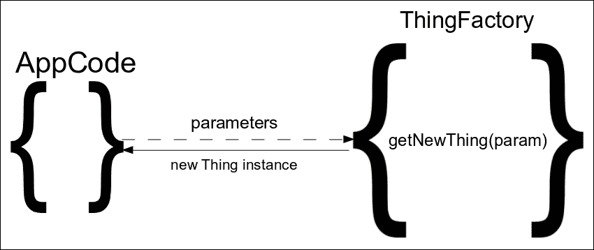
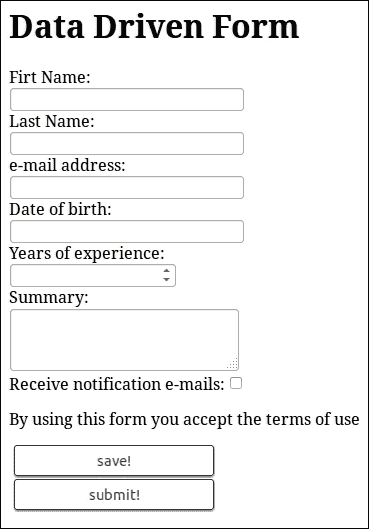
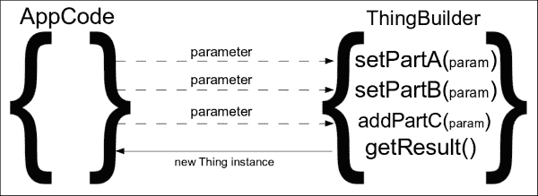
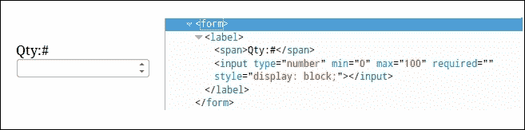
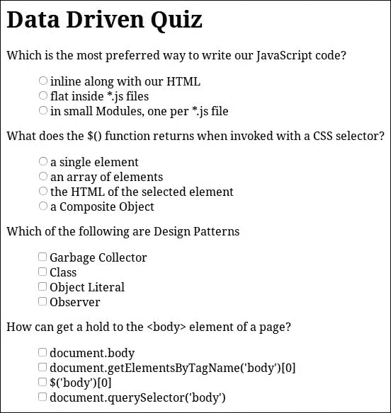

# 第六章：生成器和工厂模式

本章中，我们将展示生成器模式和工厂模式，这两种最常用的创建型设计模式之一。这两种设计模式彼此之间有一些相似之处，共享一些共同的目标，并致力于简化复杂结果的创建。我们将分析它们的采用对我们实现的好处，以及它们之间的区别。最后，我们将学习如何正确使用它们，并为我们实现的不同用例选择最合适的模式。

本章中，我们将：

+   介绍工厂模式

+   查看 jQuery 如何使用工厂模式

+   在 jQuery 应用程序中有一个工厂模式示例

+   介绍生成器模式

+   比较生成器模式和工厂模式

+   查看 jQuery 如何使用生成器模式

+   在 jQuery 应用程序中有一个生成器模式示例

# 介绍工厂模式

工厂模式是创建型模式组中的一部分，总体上描述了一种用于对象创建和初始化的通用方式。它通常实现为一个用于生成其他对象的对象或函数。根据大多数计算机科学资源，工厂模式的参考实现描述为一个提供返回新创建的对象的方法的类。返回的对象通常是特定类或子类的实例，或者它们公开一组特定的特性。



工厂模式的关键概念是抽象出为特定目的创建和初始化对象或一组相关对象的方式。这种抽象的目的是避免将实现与特定类或每个对象实例需要创建和配置的方式耦合在一起。结果是一种按照关注点分离的概念来进行对象创建和初始化的实现。

结果的实现仅基于其算法或业务逻辑所需的对象方法和属性。这种方法可以通过遵循编程的概念而不是对象类的功能和功能来受益于实现的模块化和可扩展性。这使我们可以灵活地将所使用的类更改为任何其他公开相同功能的对象。

## 它是如何被 jQuery 采用的

正如我们在早期章节中已经注意到的那样，jQuery 的早期目标之一是提供一种在所有浏览器上都能够正常工作的解决方案。jQuery 1.12.x 版本系列专注于为老旧的 Internet Explorer 6（IE6）提供支持，同时保持与仅关注现代浏览器的较新版本 v2.2.x 相同的 API。

为了拥有类似的结构并最大化两个版本之间的公共代码，jQuery 团队试图在不同的实现层中抽象出大部分兼容性机制。这样的开发实践极大地提高了代码的可读性，并减少了主要实现的复杂性，将其封装成不同的较小的片段。

这个很好的例子是 jQuery 提供的与 AJAX 相关方法的实现。具体来说，在以下代码中，您可以找到它的一部分，就像在 jQuery 的 1.12.0 版本中找到的那样：

```js
// Create the request object 
// (This is still attached to ajaxSettings for backward compatibility) 
jQuery.ajaxSettings.xhr = window.ActiveXObject !== undefined ? 
  // Support: IE6-IE8
  function() { 

    // XHR cannot access local files, always use ActiveX for that case 
    if ( this.isLocal ) {
      return createActiveXHR();
    }
    // Support: IE 9-11
    if ( document.documentMode > 8 ) {
      return createStandardXHR();
    }
    // Support: IE<9
    return /^(get|post|head|put|delete|options)$/i.test( this.type ) && createStandardXHR() || createActiveXHR();

  } : 
  // For all other browsers, use the standard XMLHttpRequest object 
  createStandardXHR; 

// Functions to create xhrs 
function createStandardXHR() { 
  try { 
    return new window.XMLHttpRequest(); 
  } catch ( e ) {} 
} 

function createActiveXHR() { 
  try { 
    return new window.ActiveXObject( "Microsoft.XMLHTTP" ); 
  } catch ( e ) {} 
}
```

每次在 jQuery 上发出新的 AJAX 请求时，`jQuery.ajaxSettings.xhr`方法被用作一个工厂，根据当前浏览器的支持创建一个新的适当的 XHR 对象的实例。更详细地看，我们可以看到`jQuery.ajaxSettings.xhr`方法协调使用两个更小的工厂函数，每个函数负责特定的 AJAX 实现。此外，我们可以看到它实际上试图避免在每次调用时都运行兼容性测试，而是在适当时直接将其引用连接到较小的`createStandardXHR`工厂函数。

## 在我们的应用程序中使用工厂

作为工厂的一个示例用例，我们将创建一个数据驱动的表单，其中我们的用户将能够填写一些动态创建并插入到页面中的字段。我们将假设存在一个包含描述每个需要呈现的表单字段的对象的数组。我们的工厂方法将封装每个表单字段需要被构建的方式，并根据相关对象上定义的特征正确处理每个特定的情况。



这个页面的 HTML 代码非常简单：

```js
    <h1>Data Driven Form</h1> 

    <form></form> 

    <script type="text/javascript" src="img/jquery.js"></script> 
    <script type="text/javascript" src="img/datadrivenform.js"></script> 
```

它只包含一个`<h1>`元素，用于页面标题，以及一个空的`<form>`元素，用于承载生成的字段。至于使用的 CSS，我们只对`<button>`元素进行了样式化，与之前的章节中所做的方式相同。

至于应用程序的 JavaScript 实现，我们创建一个模块，并声明`dataDrivenForm`为这个示例的命名空间。这个模块将包含描述我们表单的数据，生成每个表单元素的 HTML 的工厂方法，当然还有将上述部分组合起来创建结果表单的初始化代码：

```js
(function() { 
  'use strict'; 

  window.dataDrivenForm = window.dataDrivenForm || {}; 

  dataDrivenForm.formElementHTMLFactory = function (type, name, title) { 
    if (!title || !title.length) { 
      title = name; 
    } 
    var topPart = '<div><label><span>' + title + ':</span><br />'; 
    var bottomPart = '</label></div>'; 
    if (type === 'text') { 
      return topPart + 
        '<input type="text" maxlength="200" name="' +name + '" />' + 
        bottomPart; 
    } else if (type === 'email') { 
      return topPart + 
        '<input type="email" required name="' + name + '" />' + 
        bottomPart; 
    } else if (type === 'number') { 
      return topPart + 
        '<input type="number" min="0" max="2147483647" ' +'name="' + name + '" />' + 
        bottomPart; 
    } else if (type === 'date') { 
      return topPart + 
        '<input type="date" min="1900-01-01" name="' +
          name + '" />' + 
        bottomPart; 
    } else if (type === 'textarea') { 
      return topPart + 
        '<textarea cols="30" rows="3" maxlength="800" name="' +name + '" />' + 
        bottomPart; 
    } else if (type === 'checkbox') { 
      return '<div><label><span>' + title + ':</span>' + 
        '<input type="checkbox" name="' + name + '" />' + 
        '</label></div>'; 
    } else if (type === 'notice') { 
      return '<p>' + name + '</p>'; 
    }  else if (type === 'button') { 
      return '<button name="' + name + '">' + title + '!</button>'; 
    } 
  }; 

})(); 
```

我们的工厂方法将被调用三个参数。从最重要的开始，它接受表单字段的`类型`和`名称`，以及将用作其描述的`标题`。由于大多数表单字段共享一些共同的特征，比如它们的标题，工厂方法试图将它们抽象出来，以减少代码重复。正如您所见，工厂方法还为每种字段类型包含一些合理的额外配置，比如文本字段的`maxlength`属性，这是特定用例的特定属性。

将用于表示每个表单元素的对象结构将是一个简单的 JavaScript 对象，它具有`type`、`name`和`title`属性。描述表单字段的对象集合将被分组在一个数组中，并在我们的模块的`dataDrivenForm.parts`属性上可用。在实际应用中，这些字段通常会通过 AJAX 请求检索，或者被注入到页面的某个部分中。在以下代码片段中，我们可以看到将用于驱动我们的表单创建的数据：

```js
dataDrivenForm.parts = [{ 
    type: 'text', 
    name: 'firstname', 
    title: 'First Name' 
  }, { 
    type: 'text', 
    name: 'lastname', 
    title: 'Last Name' 
  }, { 
    type: 'email', 
    name: 'email', 
    title: 'e-mail address' 
  }, { 
    type: 'date', 
    name: 'birthdate', 
    title: 'Date of birth' 
  }, { 
    type: 'number', 
    name: 'experience', 
    title: 'Years of experience' 
  }, { 
    type: 'textarea', 
    name: 'summary', 
    title: 'Summary' 
  }, { 
    type: 'checkbox', 
    name: 'receivenotifications', 
    title: 'Receive notification e-mails' 
  }, { 
    type: 'notice', 
    name: 'By using this form you accept the terms of use' 
  }, { 
    type: 'button', 
    name: 'save' 
  }, { 
    type: 'button', 
    name: 'submit' 
  }];
```

最后，我们定义并立即调用了一个`init`方法来初始化我们的模块：

```js
dataDrivenForm.init = function() { 
  for (var i = 0; i < dataDrivenForm.parts.length; i++) { 
    var part = dataDrivenForm.parts[i]; 
    var elementHTML = dataDrivenForm.formElementHTMLFactory(part.type, part.name, part.title); 
    // check if the result is null, undefined or empty string
    if (elementHTML && elementHTML.length) { 
      $('form').append(elementHTML); 
    } 
  } 
}; 

$(document).ready(dataDrivenForm.init); 
```

初始化代码会等待页面的 DOM 完全加载，然后使用工厂方法创建表单元素并将它们附加到页面的`<form>`元素上。在实际使用之前，上述代码的一个额外关注点是检查工厂方法调用的结果是否有效。

大多数工厂在使用不能处理的情况下被调用时，会返回`null`或空对象。因此，使用工厂时，检查每次调用的结果是否实际有效是一个很好的常见做法。

正如你所见，仅接受简单参数（例如字符串和数字）的工厂，在许多情况下会导致参数数量增加。即使这些参数只在特定情况下使用，我们的工厂的 API 也开始变得尴尬而冗长，并且需要针对每个特殊情况进行适当的文档编写，以便可用。

理想情况下，工厂方法应尽量接受尽可能少的参数，否则它将开始看起来像一个仅提供不同 API 的 Facade。由于在某些情况下，仅使用单个字符串或数值参数不足以满足要求，为了避免使用大量参数，我们可以遵循一种做法，即设计工厂以接受单个对象作为其参数。

例如，在我们的情况下，我们可以将描述表单字段的整个对象作为参数传递给工厂方法：

```js
dataDrivenForm.formElementHTMLFactory = function (formElementDefinition) { 
  var topPart = '<div><label><span>' + formElementDefinition.title + ':</span><br />'; 
  var bottomPart = '</label></div>'; 
  if (formElementDefinition.type === 'text') { 
    return topPart + 
      '<input type="text" maxlength="200" name="' +formElementDefinition.name + '" />' + 
      bottomPart; 
  } /* ... */ 
};
```

这种做法适用于以下情况：

+   当我们创建的工厂是不专注于特定用例的通用工厂，并且我们需要为每个特定用例分别配置它们的结果时。

+   当构造的对象具有许多可选配置参数且差异很大时。在这种情况下，将它们作为单独的参数添加到工厂方法中将导致调用具有一些`null`参数，具体取决于我们想要定义哪个确切的参数。

另一种做法，特别是在 JavaScript 编程中，是创建一个工厂方法，该方法接受一个简单的字符串或数字值作为其第一个参数，并可选地提供一个补充对象作为第二个参数。这使我们能够拥有一个简单的通用 API，可以特定于用例，并且还为我们提供了一些额外的自由度来配置一些特殊情况。这种方法被`$.ajax( url [, settings ] )`方法所使用，该方法允许我们通过只提供 URL 来生成简单的 GET 请求，还接受一个可选的`settings`参数，允许我们配置请求的任何方面。将上述实现更改为使用此变体留作读者的练习，以便进行实验并熟悉工厂方法的使用。

# 介绍建造者模式

建造者模式是创建模式组中的一部分，为我们提供了一种在达到可以使用的点之前需要大量配置的对象的创建方法。建造者模式通常用于接受许多可选参数以定义其操作的对象。另一个匹配的案例是创建需要在几个步骤或特定顺序中完成配置的对象。

根据计算机科学的共同范例，建造者模式的常见范式是有一个建造者对象，提供一个或多个设置方法（`setA（...）`，`setB（...）`），以及一个单独的生成方法，用于构建并返回新创建的结果对象（`getResult（）`）。



此模式有两个重要概念。第一个是建造者对象公开一些方法作为配置正在构建的对象的不同部分的一种方式。在配置阶段，建造者对象保留一个内部状态，反映了所提供的设置方法的调用的效果。当用于创建接受大量配置参数的对象时，这可能是有益的，解决了拖尾构造函数的问题。

### 注意

拖尾构造函数是面向对象编程的反模式，描述了一个类提供了几个构造函数，这些构造函数往往在所需参数的数量，类型和组合上有所不同。具有多个参数可以以许多不同组合使用的对象类通常会导致实现落入这种反模式中。

第二个重要概念是它还提供了一个生成方法，根据前述配置返回实际构造的对象。大多数情况下，请求对象的实例化是惰性进行的，并且实际上是在调用此方法的时候发生的。在某些情况下，建造者对象允许我们调用生成方法超过一次，从而使我们能够使用相同配置生成多个对象。

## 它如何被 jQuery 的 API 接受

建造者模式也可以作为 jQuery 公开的 API 的一部分找到。具体来说，jQuery 的 `$()` 函数也可以通过使用 HTML 字符串作为参数来创建新的 DOM 元素。因此，我们可以创建新的 DOM 元素并根据需要设置它们的不同部分，而不必创建所需的最终结果的确切 HTML 字符串：

```js
var $input = $('<input />'); 
$input.attr('type','number'); 
$input.attr('min', '0'); 
$input.attr('max', '100'); 
$input.prop('required', true);
$input.val(4);

$input.appendTo('form');
```

`$('<input />')` 调用返回一个包含未附加到页面的 DOM 树的元素的复合对象。这个未附加的元素只是一个内存对象，直到我们将其附加到页面为止，它既不完全构造也不完全功能。在这种情况下，此复合对象就像一个具有尚未最终化的对象内部状态的构建对象实例。在此之后，我们使用一些 jQuery 方法对其进行一系列操作，这些方法就像建造者模式描述的设置器方法一样。

最后，在我们应用所有必需的配置之后，使得生成的对象以期望的方式行为，我们调用 `$.fn.appendTo()` 方法。`$.fn.appendTo()` 方法作为建造者模式的生成方法，将 `$input` 变量的内存元素附加到页面的 DOM 树上，将其转换为实际附加的 DOM 元素。

当然，通过利用 jQuery 为其方法提供的流式 API，并组合 `$.fn.attr()` 方法调用，以上示例可以变得更易读且不太重复。此外，jQuery 允许我们使用几乎所有其方法来在构建中的元素上执行遍历和操作，就像我们可以在普通 DOM 元素的复合对象上执行的那样。因此，以上示例可以更完整地如下所示：

```js
$('<input />').attr({
    'type':'number',
    'min': '0',
    'max': '100'
  })
  .prop('required', true) 
  .val(4)
  .css('display', 'block') 
  .wrap('<label>') // wrap the input with a <label> 
  .parent() // traverse one level up, to the <label> 
  .prepend('<span>Qty:#</span') 
  .appendTo('form');
```

结果如下所示：



允许我们将调用 `$()` 函数的这种过载方式归类为采用建造者模式的实现的标准是：

+   它返回一个具有包含部分构造元素的内部状态的对象。所包含的元素仅是内存对象，不是页面 DOM 树的一部分。

+   它为我们提供了操作其内部状态的方法。大多数 jQuery 方法都可以用于此目的。

+   它为我们提供了生成最终结果的方法。我们可以使用 jQuery 方法，例如 `$.fn.appendTo()` 和 `$.fn.insertAfter()`，作为完成内部元素构造并使其成为具有反映其较早内存表示的属性的 DOM 树的一部分的方法。

正如我们已经在第一章 *jQuery 和组合模式的复习*中看到的，使用 `$()` 函数的主要方法是将其与 CSS 选择器作为字符串参数调用，然后它将检索匹配的页面元素并以组合对象返回它们。另一方面，当 `$()` 函数检测到它已被调用的字符串参数看起来像一个 HTML 片段时，它将作为 DOM 元素生成器。这种重载的 `$()` 函数的调用方式基于提供的 HTML 代码以 `<` 和 `>` 不等号符号开始和结束的假设：

```js
  init = jQuery.fn.init = function( selector, context ) { 
    /* 11 lines of code */ 
    // Handle HTML strings 
    if ( typeof selector === "string" ) { 
      if ( selector[ 0 ] === "<" &&selector[ selector.length - 1 ] === ">" &&selector.length >= 3 ) { 
        // Assume that strings that start and end with <> are HTML // and skip the regex check 
        match = [ null, selector, null ]; 

      } /*...*/

      // Match html or make sure no context is specified for #id 
      if ( match && ( match[ 1 ] || !context) ) { 

        // HANDLE: $(html) -> $(array) 
        if ( match[ 1 ] ) { 
          /* 4 lines of code */
          jQuery.merge( this, jQuery.parseHTML( match[ 1 ], /*...*/ ) ); 
          /* 16 lines of code */ 

          return this; 
        }/*...*/ 
      }/*...*/ 
    }/*...*/ 
  }; 
```

正如我们在前面的代码中所看到的，这个重载使用了 `jQuery.parseHTML()` 辅助方法，最终导致调用 `createDocumentFragment()` 方法。创建的**文档片段**然后被用作正在构建的元素树结构的宿主。在 jQuery 完成将 HTML 转换为元素之后，文档片段被丢弃，只返回其托管的元素：

```js
jQuery.parseHTML = function( data, context, keepScripts ) { 
  /* 17 lines of code */ 
  // Single tag 
  if ( parsed ) { 
    return [ context.createElement( parsed[ 1 ] ) ]; 
  } 

  parsed = buildFragment( [ data ], context, scripts ); 
  /* 5 lines of code */
  return jQuery.merge( [], parsed.childNodes ); 
};
```

这导致创建一个包含内存中元素树结构的新 jQuery 组合对象。尽管这些元素未附加到页面的实际 DOM 树上，我们仍然可以像对待任何其他 jQuery 组合对象一样对它们进行遍历和操作。

### 注意

有关文档片段的更多信息，您可以访问：[`developer.mozilla.org/en-US/docs/Web/API/Document/createDocumentFragment`](https://developer.mozilla.org/en-US/docs/Web/API/Document/createDocumentFragment)。

## 内部使用 jQuery 的方法

jQuery 的一个毫无疑问的重要部分是其与 AJAX 相关的实现，其目标是提供一个简单的 API 用于异步调用，同时也可以在很大程度上进行配置。使用 jQuery 源代码查看器并搜索 `jQuery.ajax`，或直接在 jQuery 的源代码中搜索 `"ajax:"`，将带来上述实现。为了使其实现更加直接并允许其进行配置，jQuery 内部使用一种特殊的对象结构，该结构充当了用于创建和处理每个 AJAX 请求的生成器对象。正如我们将看到的，这不是使用生成器对象的最常见方式，但实际上是一种具有一些修改以适应这个复杂实现要求的特殊变体：

```js
jqXHR = { 
  readyState: 0, 

  // Builds headers hashtable if needed 
  getResponseHeader: function( key ) {/* ... */}, 

  // Raw string 
  getAllResponseHeaders: function() {/* ... */}, 

  // Caches the header 
  setRequestHeader: function( name, value ) {/* ... */}, 

  // Overrides response content-type header 
  overrideMimeType: function( type ) {/* ... */}, 

  // Status-dependent callbacks 
  statusCode: function( map ) {/* ... */}, 

  // Cancel the request 
  abort: function( statusText ) {/* ... */} 
}; 
```

`jqXHR` 对象公开用于配置生成的异步请求的主要方法是 `setRequestHeader()` 方法。这个方法的实现相当通用，使得 jQuery 可以使用一个方法设置请求的所有不同 HTTP 标头。

为了提供更大程度的灵活性和抽象性，jQuery 内部使用一个单独的`transport`对象作为`jqXHR`对象的包装器。这个传输对象处理实际将 AJAX 请求发送到服务器的部分，像一个与`jqXHR`对象合作创建最终结果的*合作构建器对象*。这样，jQuery 可以使用相同的 API 和整体实现从相同或跨域服务器获取脚本、XML、JSON 和 JSONP 响应：  

```js
transport = inspectPrefiltersOrTransports( transports, s, options, jqXHR ); 

// If no transport, we auto-abort 
if ( !transport ) { 
  done( -1, "No Transport" ); 
} else { 
  jqXHR.readyState = 1; 
  /* 12 lines of code */ 
  try { 
    state = 1; 
    transport.send( requestHeaders, done ); 
  } catch ( e ) {/* 7 lines of code */} 
}
```

这个构建器模式的实现的另一个特殊之处是，它应该能够以同步和异步方式操作。因此，`transport`对象的`send()`方法，它作为包装的`jqXHR`对象的结果生成方法，不能只返回一个结果对象，而是需要使用回调来调用它。

最后，在请求完成后，jQuery 使用`getResponseHeader()`方法检索所有必需的响应标头。紧接着，标头被用于正确转换存储在`jqXHR`对象的`responseText`属性中的接收到的响应。

## 如何在我们的应用程序中使用它

作为在使用 jQuery 的客户端应用程序中使用构建器模式的示例用例，我们将创建一个简单的数据驱动多选题测验。与我们之前看到的工厂模式示例相比，构建器模式更适合这种情况的主要原因是结果更复杂，具有更多的配置度。每个问题都将基于一个模型对象生成，该对象将表示其所需的属性。



再次强调，所需的 HTML 非常简单，只包含一个页面标题的`<h1>`元素，一个空的`<form>`标签，以及对我们的 CSS 和 JavaScript 资源的一些引用：

```js
    <h1>Data Driven Quiz</h1> 
    <form> </form> 

    <script type="text/javascript" src="img/jquery.js"></script> 
    <script type="text/javascript" src="img/datadrivenquiz.js"></script> 
```

除了我们在之前章节中看到的常见的简单样式之外，这个示例的 CSS 还额外定义了：

```js
ul.unstyled > li { 
    margin: 0; 
    padding: 0; 
    list-style: none; 
}
```

为了这个例子的需要，我们将创建一个带有新命名空间`dataDrivenQuiz`的模块。正如我们在本章前面看到的，我们将假设存在一个数组，其中包含描述需要呈现的每个多选题的模型对象。每个这些模型对象都将具有：

+   一个`title`属性，将保存问题

+   一个`options`属性，将是一个包含可供选择的答案的数组

+   一个可选的`acceptsMultiple`属性，表示我们应该使用单选按钮还是复选框

描述表单问题的模型对象数组将在我们的模块的`dataDrivenQuiz.parts`属性中可用，同时要牢记我们的实现可以轻松地修改为使用 AJAX 请求获取模型：

```js
dataDrivenQuiz.questions = [{ 
  title: 'Which is the most preferred way to write our JavaScript code?', 
  options: [ 
    'inline along with our HTML', 
    'flat inside *.js files', 
    'in small Modules, one per *.js file' 
  ] 
}, { 
  title: 'What does the $() function returns when invoked with a CSS selector?', 
  options: [ 
    'a single element', 
    'an array of elements', 
    'the HTML of the selected element', 
    'a Composite Object' 
  ] 
}, { 
  title: 'Which of the following are Design Patterns', 
  acceptsMultiple: true, 
  options: [ 
    'Garbage Collector', 
    'Class', 
    'Object Literal', 
    'Observer' 
  ] 
}, { 
  title: 'How can get a hold to the <body> element of a page?', 
  acceptsMultiple: true, 
  options: [ 
    'document.body', 
    'document.getElementsByTagName(\'body\')[0]', 
    '$(\'body\')[0]', 
    'document.querySelector(\'body\')' 
  ] 
}];
```

### 提示

在开始实际实现之前，定义描述问题所需的数据结构使我们能够专注于应用程序的需求，并对其整体复杂性进行估算。

鉴于前述示例数据，现在让我们继续实现我们的构建器：

```js
function MultipleChoiceBuilder() { 
  this.title = 'Untitled'; 
  this.options = []; 
} 
dataDrivenQuiz.MultipleChoiceBuilder = MultipleChoiceBuilder; 

MultipleChoiceBuilder.prototype.setTitle = function(title) { 
  this.title = title; 
  return this; 
}; 

MultipleChoiceBuilder.prototype.setAcceptsMultiple = function(acceptsMultiple) { 
    this.acceptsMultiple = acceptsMultiple; 
    return this; 
  }; 

MultipleChoiceBuilder.prototype.addOption = function(title) { 
  this.options.push(title); 
  return this; 
}; 

MultipleChoiceBuilder.prototype.getResult = function() { 
  var $header = $('<header>').text(this.title || 'Untitled'); 

  var questionGuid = 'quizQuestion' + (jQuery.guid++); 
  var $optionsList = $('<ul class="unstyled">'); 
  for (var i = 0; i < this.options.length; i++) { 
    var $input = $('<input />').attr({
      'type': this.acceptsMultiple ? 'checkbox' : 'radio',
      'value': i,
      'name': questionGuid,
    });

    var $option = $('<li>'); 
    $('<label>').append($input, $('<span>').text(this.options[i]))
      .appendTo($option); 
    $optionsList.append($option); 
  } 
  return $('<article>').append($header, $optionsList);
};
```

使用 JavaScript 的原型面向对象方法，我们首先为我们的`MultipleChoiceBuilder`类定义构造函数。当使用`new`运算符调用构造函数时，它将创建一个新的构建器实例，并将其`title`属性初始化为`"Untitled"`，将`options`属性初始化为空数组。

在这之后，我们完成了构建器的构造函数的定义，将其作为模块的成员附加，并继续定义其设置器方法。遵循原型类范例，`setTitle()`、`setAcceptsMultiple()`和`addOption()`方法被定义为构建器原型的属性，并用于修改正在构建的元素的内部状态。另外，为了使我们能够链式调用这些方法的多个调用，从而获得更可读的实现，它们都以`return this;`语句结束。

我们使用`getResult()`方法完成构建器的实现，该方法负责收集应用于构建器对象实例的所有参数，并生成包装在 jQuery 组合对象中的结果元素。在其第一行，它创建了一个问题的标题。紧接着，它创建一个带有`unstyled` CSS 类的`<ul>`元素，用于容纳问题的可能答案，并使用一个唯一标识符作为问题生成的`<input>`的`name`。

在接下来的`for`循环中，我们将：

+   为问题的每个选项创建一个`<input />`元素。

+   根据`acceptsMultiple`属性的值，将其`type`适当设置为`checkbox`或`radio`按钮。

+   使用`for`循环的迭代编号作为其`value`。

+   将我们之前生成的问题的唯一标识符设置为输入的`name`，以便将答案分组。

+   最后，在问题的`<ul>`中添加包含选项文本的`<label>`，并将其全部包装在一个`<li>`中。

最后，标题和选项列表都被包装在一个`<article>`元素中，并作为构建器的最终结果返回。

在上述实现中，我们使用`$.fn.text()`方法为问题的标题及其可用选择分配内容，而不是使用字符串连接，以便正确转义其中的`<`和`>`字符。额外说明，由于一些答案也包含单引号，我们需要在模型对象中使用反斜杠(`\'`)对它们进行转义。

最后，在我们模块的实现中，我们定义并立即调用`init`方法：

```js
dataDrivenQuiz.init = function() { 
  for (var i = 0; i < dataDrivenQuiz.questions.length; i++) { 
    var question = dataDrivenQuiz.questions[i]; 
    var builder = new dataDrivenQuiz.MultipleChoiceBuilder(); 

    builder.setTitle(question.title) .setAcceptsMultiple(question.acceptsMultiple); 

    for (var j = 0; j < question.options.length; j++) { 
      builder.addOption(question.options[j]); 
    } 

    $('form').append(builder.getResult());
  }
}; 

$(document).ready(dataDrivenQuiz.init);
```

初始化代码的执行被延迟，直到页面的 DOM 树完全加载完成。然后，`init()` 方法遍历模型对象数组，并使用 Builder 创建每个问题，并填充我们页面的`<form>`元素。

对于读者来说，一个很好的练习是扩展上述实现，以支持对测验的客户端评估。首先，这需要您扩展问题对象以包含有关每个选项有效性的信息。然后，建议您创建一个 Builder，该 Builder 将从表单中获取答案，评估它们，并创建一个包含用户选择和测验总体成功的结果对象。

# 摘要

在本章中，我们学习了 Builder 和 Factory 模式的概念，这两种是最常用的创建型设计模式之一。我们分析了它们的共同目标，它们在抽象生成和初始化特定用例的新对象过程方面的不同方法，以及它们的采用如何使我们的实现受益。最后，我们学习了如何正确使用它们，并如何为任何给定实现的不同用例选择最合适的模式。

现在我们已经完成了对最重要的创建型设计模式的介绍，我们可以继续下一章，介绍用于编写异步和并发程序的开发模式。更详细地说，我们将学习如何通过使用回调和 jQuery Deferred 和 Promises API 来编排顺序或并行运行的异步程序的执行。
