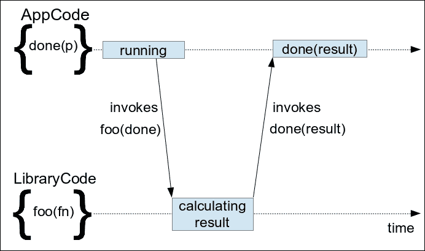
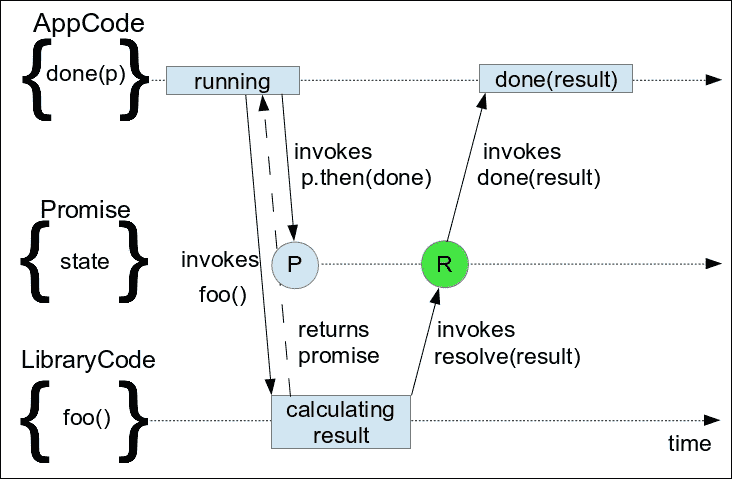
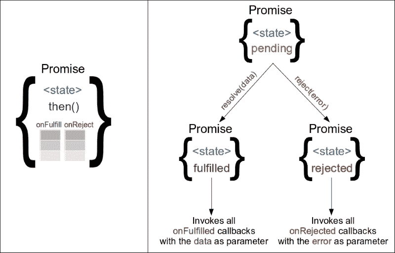

# 第七章：异步控制流模式

本章专注于用于简化异步和并发过程编程的开发模式。

首先，我们将复习 JavaScript 编程中如何使用回调函数以及它们是网页开发的一个组成部分。然后，我们将继续识别它们在大型和复杂实现中的好处和局限性。

接下来，我们将介绍 Promises 的概念。我们将学习 jQuery 的 Deferred 和 Promise API 的工作原理，以及它们与 ES6 Promises 的区别。我们将看到它们在 jQuery 内部的使用方式以简化其实现并导致更可读的代码。我们将分析它们的好处，分类最匹配的用例，并将它们与经典的回调模式进行比较。

到达本章结束时，我们将能够使用 jQuery Deferred 和 Promises 来有效地编排按顺序或并行运行的异步过程的执行。

在本章中，我们将：

+   对 JavaScript 编程中如何使用回调函数进行复习

+   介绍 Promises 的概念

+   学习如何使用 jQuery 的 Deferred 和 Promise API

+   比较 jQuery Promises 和 ES6 Promises

+   学习如何使用 Promises 来编排异步任务。

# 使用回调函数进行编程

回调函数可以被定义为作为调用参数传递给另一个函数或方法（称为高阶函数）的函数，并且预计将在以后的某个时间点执行。通过这种方式，被传递给我们的回调函数的代码片段最终会调用它，将操作或事件的结果传播回定义回调函数的上下文。

回调函数可以根据被调用方法的操作方式分为同步或异步。当回调由阻塞方法执行时，回调被称为同步。另一方面，JavaScript 开发人员更熟悉异步回调，也称为延迟回调，它们被设置为在异步过程完成后或发生特定事件时执行（页面加载，单击，AJAX 响应到达等）。



由于回调函数是许多核心 JavaScript API（如 AJAX）的组成部分，因此在 JavaScript 应用程序中广泛使用。此外，JavaScript 对该模式的实现几乎与上述简单定义所描述的一字不差。这是 JavaScript 将函数视为对象并允许我们将方法引用存储和传递为简单变量的方式的结果。

## 在 JavaScript 中使用简单回调函数

在 JavaScript 中使用异步回调的最简单的例子之一可能是`setTimeout()`函数。下面的代码演示了它的一个简单用法，我们将`setTimeout()`与`doLater()`函数作为回调参数一起调用，并且在等待 1000 毫秒后，`doLater()`回调被调用：

```js
var alertMessage = 'One second passed!'; 
function doLater() { 
    alert(alertMessage); 
}
setTimeout(doLater, 1000);
```

如简单的前面示例所示，回调在定义的上下文中执行。回调仍然可以访问定义它的上下文的变量，通过创建闭包来实现。即使前面的示例使用了之前定义的命名函数，对于匿名回调也是适用的：

```js
var alertMessage = 'One second passed!';
setTimeout(function() { 
    alert(alertMessage); 
}, 1000);
```

在许多情况下，使用匿名回调是一种更方便的编程方式，因为它会导致代码更短，也减少了可读性噪音，这是由定义几个只使用一次的不同命名函数而产生的。

## 将回调设置为对象属性

上述定义的一个小变化也存在，其中回调函数被分配给对象的属性，而不是作为方法调用的参数传递。这在需要在方法调用期间或之后执行几种不同操作的情况下通常使用：

```js
var c = new Countdown(); 

c.onProgress = function(progressStatus) { /*...*/ };
c.onDone = function(result) {  /*...*/ };
c.onError = function(error) {  /*...*/ };

c.start();
```

上述变体的另一个用例是在已实例化和初始化的对象上添加处理程序。这种情况的一个很好的例子是我们为简单（非 jQuery）AJAX 调用设置结果处理程序的方式：

```js
var r = new XMLHttpRequest(); 
r.open('GET', 'data.json', true); 
r.onreadystatechange = function() { 
    if (r.readyState != 4 || r.status != 200) { 
        return; 
    } 
    alert(r.responseText); 
};
r.send();
```

在上述代码中，我们将一个匿名函数设置在 XMLHttpRequest 对象的`onreadystatechange`属性上。这个函数充当回调，每当进行中的请求状态发生变化时都会被调用。在我们的回调内部，我们检查请求是否以成功的 HTTP 状态码完成，并显示带有响应主体的警报。就像在这个示例中一样，我们通过调用`send()`方法而不传递任何参数来启动 AJAX 调用，使用这种变体的 API 通常导致以最小的方式调用它们的方法。

## 在 jQuery 应用程序中使用回调

在 jQuery 应用程序中使用回调的最常见方式可能是用于事件处理。这是合乎逻辑的，因为每个交互式应用程序都应该首先处理和响应用户操作。正如我们在前面章节中看到的，将事件处理程序附加到元素的最便捷方式之一是使用 jQuery 的`$.fn.on()`方法。

jQuery 中另一个常见的使用回调的地方是 AJAX 请求，`$.ajax()`方法起着中心作用。此外，jQuery 库还提供了几个方便的方法来进行 AJAX 请求，这些方法都专注于最常见的用例。由于所有这些方法都是异步执行的，它们也接受一个回调作为参数，以便将检索到的数据返回给发起 AJAX 请求的上下文。其中一个方便的方法是`$.getJSON()`，它是`$.ajax()`的一个包装器，并且用作执行意图检索 JSON 响应的 AJAX 请求的更匹配的 API。

其他广泛使用的接受回调的 jQuery API 如下：

+   诸如`$.animate()`之类的与效果相关的 jQuery 方法

+   `$(document).ready()`方法

现在让我们通过演示一个代码示例来继续，该示例中使用了上述所有方法。

```js
$(document).ready(function() { 
  $('#fetchButton').on('click', function() { 
    $.getJSON('AjaxContent.json', function(json) { 
      console.log('done loading new content'); 

      $('#newContent').css({ 'display': 'none' }) 
        .text(json.data) 
        .slideDown(function() { 
          console.log('done displaying new content'); 
        }); 
    }); 
  }); 
}); 
```

前面的代码首先延迟执行，直到页面的 DOM 树完全加载，然后通过使用 jQuery 的`$.fn.on()`方法，在 ID 为`fetchButton`的`<button>`上添加一个点击观察器。每当点击事件触发时，提供的回调将被调用，并启动一个 AJAX 调用来获取`AjaxContent.json`文件。在此示例中，我们使用一个简单的 JSON 文件，如下所示：

```js
{ "data": "I'm the text content fetched by an AJAX call!" }
```

当接收到响应并成功解析 JSON 时，回调函数将以解析后的对象作为参数被调用。最后，回调函数本身会在页面中查找 ID 为`newContent`的页面元素，隐藏它，然后将检索到的 JSON 数据字段设置为其文本内容。紧接着，我们使用 jQuery 的`$.fn.slideDown()`方法，通过逐渐增加其高度使新设置的页面内容出现。最后，在动画完成后，我们向浏览器控制台输出一个日志消息。

### 注

关于 jQuery 的`$.ajax()`、`$.getJSON()`和`$.fn.slideDown()`方法更多的文档可以在[`api.jquery.com/jQuery.ajax/`](http://api.jquery.com/jQuery.ajax/)、[`api.jquery.com/jQuery.getJSON/`](http://api.jquery.com/jQuery.getJSON/)和[`api.jquery.com/slideDown/`](http://api.jquery.com/slideDown/)中找到。

请记住，当通过文件系统加载页面时，`$.getJSON()`方法可能在某些浏览器中无法工作，但在使用 Apache、IIS 或 nginx 等任何 Web 服务器时可以正常工作。

## 编写接受回调的方法

当编写一个使用一个或多个异步 API 的函数时，这也意味着结果函数结果也是异步的。在这种情况下，很明显，简单地返回结果值不是一个选项，因为结果可能在函数调用已经完成后才可用。

异步实现的最简单解决方案是使用一个回调函数作为函数的参数，正如我们之前讨论的那样，在 JavaScript 中这是很方便的。例如，我们将创建一个异步函数，它生成指定范围内的随机数：

```js
function getRandomNumberAsync (max, callbackFn) { 
    var runFor = 1000 + Math.random() * 1000; 
    setTimeout(function() { 
        var result = Math.random() * max; 
        callbackFn(result); 
    }, runFor); 
}
```

`getRandomNumberAsync()` 函数接受其 `max` 参数作为生成的随机数的数值上限，还接受一个回调函数作为参数，它将使用生成的结果调用。它使用 `setTimeout()` 来模拟一个范围在 1000 到 2000 毫秒之间的异步计算。为了生成结果，它使用 `Math.random()` 方法，将其乘以允许的最大值，最后使用提供的回调函数调用它。调用此函数的简单方法如下所示：

```js
getRandomNumberAsync(10, function(number) { 
    console.log(number); // returns a number between 0 and 10
});
```

即使上面的示例使用 `setTimeout()` 来模拟异步处理，但不管使用哪种异步 API，实现原理都是相同的。例如，我们可以重写上述函数以通过 AJAX 调用来检索其结果：

```js
function getRandomNumberWS (max, callbackFn, errorFn) { 
  $.ajax({ 
    url: 'https://qrng.anu.edu.au/API/jsonI.php?length=1&type=uint16', 
    dataType: 'json', 
    success: function(json) { 
      var result = json.data[0] / 65535 * max; 
      callbackFn(result); 
    }, 
    error: errorFn 
  });
}
```

前述实现使用了 `$.ajax()` 方法，该方法使用一个对象参数调用，该对象封装了请求的所有选项。除了请求的 URL 外，该对象还定义了结果的预期 `dataType` 和 `success` 和 `error` 回调函数，这些函数与我们函数的相应参数配合使用。

或许前面的代码唯一额外需要解决的问题是如何在成功回调内处理错误，以便在创建结果过程中出现问题时通知函数的调用者。例如，AJAX 请求可能会返回一个空对象。为这些情况添加适当的处理留给读者，在阅读本章剩余部分之后。

### 注意

澳大利亚国立大学（ANU）通过他们的 REST Web 服务向公众提供免费的真正随机数。更多信息，请访问 [`qrng.anu.edu.au/API/api-demo.php`](http://qrng.anu.edu.au/API/api-demo.php)。

## 调度回调函数

我们现在将继续分析一些在处理接受回调函数的异步方法时常用的控制执行流程的模式。

### 按顺序排队执行

作为我们的第一个例子，我们将创建一个函数，演示如何排队执行多个异步任务：

```js
function getThreeRandomNumbers(callbackFn, errorFn) {
    var results = []; 
    getRandomNumberAsync(10, function(number) { 
        results.push(number); 

        getRandomNumberAsync(10, function(number) { 
            results.push(number); 

            getRandomNumberWS(10, function(number) {
                results.push(number); 
                callbackFn(results); 
            }, function (error) { 
                errorFn(error); 
            }); 
        }); 
    });
}
```

在前面的实现中，我们的函数创建了一个包含三个随机数生成的队列。前两个随机数是从我们的样本 `setTimeout()` 实现中生成的，第三个是通过 AJAX 调用从上述 Web 服务中检索的。在这个例子中，所有的数字都被收集在 `result` 数组中，在所有异步任务完成后作为调用参数传递给 `callbackFn`。

前述的实现相当简单直接，并且只是反复应用了回调模式的简单原则。对于每一个额外或排队的异步任务，我们只需将其调用嵌套在它依赖的任务的回调内部即可。请记住，在不同的用例中，我们可能只关心返回最终任务的结果，并将中间步骤的结果作为参数传递给每个后续的异步调用。

#### 避免回调地狱反模式

尽管编写像上面示例中显示的代码很容易，但当应用于大型和复杂的实现时，可能会导致可读性较差。由代码前面的空格创建的三角形形状和接近末尾的几个`});`的堆叠是我们的代码可能会导致的反模式的两个迹象，该反模式被称为**回调地狱**。

### 注意

欲了解更多信息，请访问[`callbackhell.com/`](http://callbackhell.com/)。

一种避免这种反模式的方法是展开嵌套的回调函数，通过在与它们使用的异步任务相同级别创建单独的命名函数。将这个简单的提示应用到上面的示例后，生成的代码看起来更清晰：

```js
function getThreeRandomNumbers(callbackFn, errorFn) { 
    var results = []; 

    getRandomNumberAsync(10, function(number) { // task 1 
        results.push(number); 
        task2(); 
    }); 

    function task2 () { 
        getRandomNumberAsync(10, function(number) { 
            results.push(number); 
            task3(); 
        }); 
    } 

    function task3 () { 
        getRandomNumberWS(10, function(number) { 
            results.push(number); 
            callbackFn(results); 
        }, errorFn); 
    } 
}
```

正如您所见，生成的代码确实不会让我们想起回调地狱反模式的特征。另一方面，现在它需要更多的代码行来实现，主要用于现在需要的额外函数声明`function taskX () { }`。

### 提示

在上述两种方法之间的一个中间解决方案是将这种异步执行队列的相关部分组织成小型且易于管理的函数。

### 并行运行

尽管 Web 浏览器中的 JavaScript 是单线程的，但使独立的异步任务并行运行可以使我们的应用程序运行更快。例如，我们将重新编写前面的实现以并行获取所有三个随机数，这样可以使结果的检索速度比以前快得多：

```js
function getRandomNumbersConcurent(callbackFn, errorFn) { 
    var results = []; 
    var resultCount = 0; 
    var n = 3; 

    function gatherResult (resultPos) { 
        return function (result) { 
            results[resultPos] = result; 
            resultCount++; 
            if (resultCount === n) { 
                callbackFn(results); 
            } 
        }; 
    } 

    getRandomNumberAsync(10, gatherResult(0)); 
    getRandomNumberAsync(10, gatherResult(1)); 
    getRandomNumberWS(10, gatherResult(2), errorFn); 
}
```

在前面的代码中，我们定义了`gatherResult()`辅助函数，它返回一个匿名函数，该函数用作我们的随机数生成器的回调。返回的回调函数使用`resultPos`参数作为将生成或检索到的随机数存储的数组的索引。此外，它追踪它被调用的次数，以了解是否所有三个并行任务已结束。最后，在第三次和最后一次回调之后，使用`results`数组作为参数调用`callbackFn`函数。

除了 AJAX 调用之外，这种技术的另一个很好的应用是访问存储在**IndexedDB**中的数据。并行从数据库中检索许多值可以带来性能增益，因为数据检索可以在不互相阻塞的情况下并行执行。

### 注意

有关 IndexedDB 的更多信息，您可以访问 [`developer.mozilla.org/en-US/docs/Web/API/IndexedDB_API/Using_IndexedDB`](https://developer.mozilla.org/en-US/docs/Web/API/IndexedDB_API/Using_IndexedDB)。

# 介绍 Promise 的概念

Promise，也被计算机科学称为 Futures，被描述为专门用于同步异步、并发或并行过程的特殊对象。它们也被用作代理来在生成完成任务的结果时传播结果。这样，一个 Promise 对象就像是一个合同，其中一项操作最终将完成其执行，任何持有这个合同引用的人都可以声明他们对结果的通知感兴趣。

自从它们作为几个库的一部分被引入到 JavaScript 开发中，它们彻底改变了我们使用异步函数以及在实现中与复杂的同步方案结合使用的方式。这样，Web 开发人员可以创建更灵活、可扩展和可读性更强的实现，使带有回调的方法调用看起来像是一个原始模式，并有效地消除了回调地狱（Callback Hell）的情况。



Promise 的一个关键概念是，异步方法返回一个代表其最终结果的对象。每个 Promise 都有一个最初状态为 Pending 的内部状态。这个内部状态只能改变一次，从 Pending 改变为 Resolved 或 Rejected，通过使用每个实现都提供的 `resolve()` 或 `reject()` 方法。这些方法只能调用来改变 Pending Promise 的状态；在大多数情况下，它们只能由 Promise 对象的原始创建者使用，而不是提供给其消费者。`resolve()` 方法可以用操作的结果作为单一参数来调用，而 `reject()` 方法通常用引起 Promise 对象被拒绝的 `Error` 来调用。

另一个 Promise 的关键概念是存在一个 `then()` 方法，使它们被称为“thenable”，这是一个通用术语，用来描述所有不同实现中的 promises。每个 Promise 对象都暴露了一个 `then()` 方法，调用者可以用它来提供在 Promise 被解决（Resolved）或拒绝（Rejected）时将被调用的函数。`then()` 方法可以用两个函数作为参数来调用，第一个函数在 Promise 被解决时被调用，而第二个函数在被拒绝时被调用。第一个参数通常被称为`onFulfilled()` 回调，而第二个参数被称为 `onRejected()`。



每个 Promise 都保存着两个内部列表，其中包含作为参数传递给 `then()` 方法的所有 `onFulfilled()` 和 `onRejected()` 回调函数。`then()` 方法可以针对每个 Promise 调用多次，向适当的内部列表添加新条目，只要相应的参数实际上是一个函数。当 Promise 最终得到解决或拒绝时，它会遍历适当的回调列表，并按顺序调用它们。此外，一旦 Promise 被解决并且之后，每次使用 `then()` 方法都会立即调用相应的提供的回调。

### 注意

根据其特性，Promise 在某种程度上可以被比作发布/订阅模式中的代理。它们的主要区别包括它只能用于单个发布，并且即使订阅者在发布之后表达了兴趣，他们也会收到结果通知。

## 使用 Promises

正如我们之前所说，Promise 的概念彻底改变了 JavaScript 中异步任务的编程方式，并且在很长一段时间内，它们是每个人都热情的新事物。那时，许多专门的库出现了，每个库都提供了一个稍有不同的 Promise 实现。此外，Promise 实现也作为 jQuery 之类的实用程序库的一部分以及诸如 AngularJS 和 EmberJS 之类的 Web 框架的一部分而可用。那时，"CommonJS Promises/A"规范以参考点的形式出现，并且是第一个尝试定义如何跨所有实现实际工作的 Promise。

### 注意

有关"CommonJS Promises/A"规范的更多信息，您可以访问[`wiki.commonjs.org/wiki/Promises/A`](http://wiki.commonjs.org/wiki/Promises/A)。

### 使用 jQuery Promise API

基于"CommonJS Promises/A"设计，Promise-based API 首次出现在 jQuery v1.5 中。该实现引入了附加概念 Deferred 对象，它的工作方式类似于**Promise 工厂**。Deferred 对象公开了一组 Promises 提供的方法的超集，其中附加方法可用于对其内部 Promise 的状态进行操作。此外，Deferred 对象公开了一个`promise()`方法，并返回实际的 Promise 对象，该对象不公开任何方式来操作其内部状态，只公开像`then()`这样的观察方法。

换句话说：

+   只有引用 Deferred 对象的代码才能实际更改其 Promise 的内部状态，无论是解决还是拒绝。

+   任何具有对 Promise 对象的引用的代码片段都无法更改其状态，而只能观察其状态是否更改。

### 注意

有关 jQuery 的 Deferred 对象的更多信息，您可以访问[`api.jquery.com/jQuery.Deferred/`](http://api.jquery.com/jQuery.Deferred/)。

作为 jQuery 的 Deferred 对象的一个简单示例，让我们看看如何重写本章早些时候看到的 `getRandomNumberAsync()` 函数，以使用 Promises 而不是回调：

```js
function getRandomNumberAsync (max) { 
    var d = $.Deferred(); 
    var runFor = 1000 + Math.random() * 1000; 
    setTimeout(function() { 
        var result = Math.random() * max; 
        d.resolve(result); 
    }, runFor); 
    return d.promise(); 
} 

getRandomNumberAsync(10).then(function(number) { 
    console.log(number); // returns a number between 0 and 10 
});
```

我们的目标是创建一个返回最终解决为生成的随机数的 Promise 的异步函数。首先，创建一个新的 Deferred 对象，然后使用 Deferred 的 `promise()` 方法返回相应的 Promise 对象。当结果的异步生成完成时，我们的方法使用 Deferred 对象的 `resolve()` 方法设置先前返回的 Promise 的最终状态。

我们函数的调用者使用返回的 Promise 的 `then()` 方法，附加一个回调函数，一旦 Promise 被解决，就会以结果作为参数调用该回调。此外，还可以传递第二个回调函数，以便在 Promise 被拒绝时得到通知。需要注意的一件重要事情是，通过遵循上述模式，即函数总是返回 Promises 而不是实际的 Deferred 对象，我们可以确保只有 Deferred 对象的创建者可以更改 Promise 的状态。

### 使用 Promises/A+

在进行了一段时间的实践性实验后，社区确定了 CommonJS Promises/A 的一些限制，并推荐了一些改进方法。结果是创建了 Promises/A+ 规范，作为改进现有规范的一种方式，也是统一各种可用实现的第二次尝试。新规范的最重要部分关注于如何使链接 Promises 工作，使它们更加实用和方便。

### 注意

有关 Promises/A+ 规范的更多信息，您可以访问 [`promisesaplus.com/`](https://promisesaplus.com/)。

最终，Promises/A+ 规范作为 JavaScript 第 6 版的一部分发布，通常称为 ES6，于 2015 年 6 月发布为标准。因此，Promises/A+ 开始在浏览器中原生实现，不再需要使用自定义的第三方库，并推动大多数现有库升级其语义。截至撰写本书时，几乎所有现代浏览器都提供了原生的 Promises/A+ 兼容实现，除了 IE11，使其可以供超过 65% 的网络用户直接使用。

### 注意

关于浏览器中采用 A+ Promises 的更多信息，您可以访问 [`caniuse.com/#feat=promises`](http://caniuse.com/#feat=promises)。

使用现在原生实现的 ES6 A+ Promises 重写 `getRandomNumberAsync()` 函数将如下所示：

```js
function getRandomNumberAsync (max) { 
    return new Promise(function (resolve, reject) { 
        var runFor = 1000 + Math.random() * 1000; 
        setTimeout(function() { 
            var result = Math.random() * max; 
            resolve(result); 
        }, runFor); 
    }); 
} 

getRandomNumberAsync(10).then(function(number) { 
    console.log(number); // returns a number between 0 and 10 
});
```

正如你所看到的，ES6 / A+ Promises 是通过使用 Promise 构造函数和 `new` 关键字创建的。构造函数被调用时带有一个函数作为参数，这使得闭包可以访问到 Promise 被创建的上下文的变量，同时也可以通过参数访问 `resolve()` 和 `reject()` 函数，这是改变新创建的 Promise 状态的唯一方法。在 `setTimeout()` 函数触发其回调后，将用生成的随机数作为参数调用 `resolve()` 函数，将 Promise 对象的状态更改为已完成。最后，我们函数的调用者使用返回的 Promise 的 `then()` 方法，方式与我们之前使用 jQuery 的实现完全相同。

### 比较 jQuery 和 A+ Promises

我们将深入逐步分析 jQuery 和 A+ Promise API 的核心概念，并通过两者的代码进行逐行对比。这将是一个非常有价值的资料，因为在 Promises 的实现逐渐适应 ES6 A+ 规范时，你还可以将其作为参考。

从一开始就了解这两种变体的差异的需求似乎更为重要，因为 jQuery 团队已经宣布版本 3.0 的库将具有符合 Promises/A+ 规范的实现。具体而言，在编写本书时，第一个 beta 版本已经发布，这使得迁移的时间似乎更近了。

### 注意

关于 jQuery v3.0 A+ Promises 实现的更多信息，请访问 [`blog.jquery.com/2016/01/14/jquery-3-0-beta-released/`](http://blog.jquery.com/2016/01/14/jquery-3-0-beta-released/)。

两种实现之间最明显的区别之一是创建新 Promises 的方式。正如我们所见，jQuery 使用 `$.Deferred()` 函数像一个工厂一样创建了一个更复杂的对象，该对象直接提供对 Promise 状态的访问，并最终使用单独的方法提取实际的 Promise。另一方面，A+ Promises 使用 `new` 关键字和一个函数作为参数，运行时将使用 `resolve()` 和 `reject()` 函数作为参数调用该函数：

```js
var d = $.Deferred(); 
setTimeout(function() { 
    d.resolve(7); 
}, 2000); 
var p = d.promise(); // jQuery Promise

var p = new Promise(function(resolve, reject) { // Promises/A+
    setTimeout(function() { 
        resolve(7); 
    }, 2000); 
});
```

此外，jQuery 还提供了另一种创建类似 A+ Promises 工作方式的 Promise 的方法。在这种情况下，`$.Deferred()` 可以被调用，并以函数作为参数，该函数接收 Deferred 对象作为参数：

```js
var d = $.Deferred(function (deferred) { 
    setTimeout(function() { 
        deferred.resolve(7); 
    }, 2000); 
}); 
var p = d.promise(); 
```

正如我们之前讨论的那样，Promise 的第二种可能结果是被 Rejected，这个特性很好地配合了 JavaScript 在同步编程中的经典异常。拒绝一个 Promise 通常用于在处理结果时发生错误的情况，或者在结果无效的情况下。虽然 ES6 Promises 在其构造函数传递给函数的参数中提供了一个 `reject()` 函数，但在 jQuery 的实现中，`reject()` 方法仅简单地在 Deferred 对象本身上暴露。

```js
var p = $.Deferred(function (deferred) { 
    deferred.reject(new Error('Something happened!')); 
}).promise(); 

var p = new Promise(function(resolve, reject) { 
    reject(new Error('Something happened!')); 
});
```

在两种实现中，可以使用 `then()` 方法检索 Promise 的结果，该方法可以用两个函数作为参数调用，一个用于处理 Promise 被 Fulfill 的情况，另一个用于处理其被 Rejected 的情况：

```js
p.then(function(result) { // works the same in jQuery & ES6
    console.log(result); 
}, function(error) { 
    console.error('An error occurred: ', error); 
});
```

两种实现还提供了方便的方法来处理 Promise 被 Rejected 的情况，但使用不同的方法名。ES6 Promises 提供了 `catch()` 方法，很好地配合了 try...catch JavaScript 表达式，而 jQuery 的实现则为相同的目的提供了 `fail()` 方法：

```js
p.fail(function(error) { // jQuery
    console.error(error); 
}); 

p.catch(function(error) { // ES6
    console.error(error); 
});
```

此外，作为 jQuery 独有的特性，jQuery Promises 还暴露了 `done()` 和 `always()` 方法。提供给 `done()` 的回调在 Promise 被 Fulfill 时被调用，并且等同于使用带有单个参数的 `then()` 方法，而 `always()` 方法的回调在 Promise 被 settled 时被调用，无论其结果如何。

### 注意

要了解更多关于 `done()` 和 `always()` 的信息，您可以访问 [`api.jquery.com/deferred.done`](http://api.jquery.com/deferred.done) 和 [`api.jquery.com/deferred.always`](http://api.jquery.com/deferred.always)。

最后，两种实现都提供了一个简单的方法，直接创建已经 Resolved 或 Rejected 的 Promises。这可以作为实现复杂同步方案的起始值，或者作为使同步函数操作像异步函数一样的简单方法：

```js
var pResolved = $.Deferred().resolve(7).promise(); // jQuery
var pRejected = $.Deferred().reject(new Error('Something happened!')).promise(); 

var pResolved = Promise.resolve(7); // ES6
var pRejected = Promise.reject(new Error('Something happened!'));
```

## 高级概念

Promises 的另一个关键概念是使它们独特并极大地增加它们的实用性的能力，即轻松创建几个 Promise 的组合，这些 Promise 又是 Promise 本身。组合有两种形式，串行组合将 Promises 连接在一起，而并行组合则使用特殊方法将并发 Promises 的解决方案合并为一个新的解决方案。正如我们在本章前面看到的那样，使用传统的回调方法很难实现这样的同步方案。另一方面，Promises 试图以更方便和可读的方式解决这个问题。

# 链接 Promises

每次调用`then()`方法都会返回一个新的 Promise，其最终状态和结果取决于调用`then()`方法的 Promise，但也取决于附加的回调返回的值。这使我们能够通过连续连接它们来组合 Promise，从而使我们能够轻松地编排异步和同步代码，其中每个链接步骤将其结果传播到下一个步骤，并允许我们以可读且声明性的方式构建最终结果。

现在让我们继续分析调用`then()`方法的不同方式。由于我们将专注于通过链式调用进行 Promise 组合的概念，这与 jQuery 和 ES6 Promises 的工作方式相同，所以假设有一个`p`变量，它保存了由以下代码行之一创建的 Promise 对象：

```js
var p = $.Deferred().resolve(7).promise(); 
//or 
var p = Promise.resolve(7);
```

展示链接能力的最简单用例是调用的回调返回一个（非 promise）值。新创建的 Promise 使用返回的值作为其结果，同时保留与调用`then()`方法的 Promise 相同的状态：

```js
p.then(function(x) { // works the same in jQuery & ES6
    console.log(x); // logs 7 
    return x * 3; 
}).then(function(x) { 
    console.log(x); // logs 21 
});
```

需要牢记的一个特殊情况是，不返回任何结果的函数会被处理为返回`undefined`。这实质上从新返回的 Promise 中删除了结果值，现在只保留了父级解决状态：

```js
p.then(function(x) { // works the same in jQuery & ES6
    console.log(x); // logs 7 
}).then(function(x) { 
    console.log(x); // logs undefined 
});
```

在调用回调函数返回另一个 Promise 的情况下，其状态和结果将用于由`then()`方法返回的 Promise：

```js
p.then(function(x) { // for jQuery Promises
    console.log(x); // logs 7 
    var d2 = $.Deferred(); 
    setTimeout(function() { 
        d2.resolve(x*3); 
    }, 2000); 
    return d2.promise(); 
}).then(function(x) { 
    console.log(x); // logs 21 
}); 

p.then(function(x) { // for the A+ Promises
    console.log(x); // logs 7 
    return new Promise(function(resolve) { 
        setTimeout(function() { 
            resolve(x*3); 
        }, 2000); 
    }); 
}).then(function(x) { 
    console.log(x); // logs 21 
});
```

前面的代码示例演示了 jQuery 和 A+ Promises 的实现方式，两者都具有相同的结果。在两种情况下，都从第一个`then()`方法调用中将**7**记录到控制台，并返回一个新的 Promise，稍后将使用`setTimeout()`解析它。 2000 毫秒后，`setTimeout()`将触发其回调，返回的 Promise 将以`21`作为值解析，并在此时，`21`也将记录在控制台中。

还有一件额外需要注意的事情是，原始 Promise 已经被解决，而且没有为链接的`then()`方法提供适当的回调。在这种情况下，新创建的 Promise 解决为相同的状态和结果，就像在其中调用`then()`方法的 Promise 一样：

```js
p.then(null, function (error) { // works the same in jQuery & ES6
    console.error('An error happened!');// does not run, since the promise is resolved
}).then(function(x) { 
    console.log(x); // logs 7 
});
```

在前面的示例中，作为`then()`方法的第二个参数传递的具有`console.error`语句的回调不会被调用，因为 Promise 解析为 7 作为其值。结果，链的回调最终接收到一个新的 Promise，该 Promise 也以`7`作为其值解析并在控制台中记录。要深入了解 Promise 链式调用的工作原理，有一件事需要牢记，即在所有情况下`p != p.then()`。

## 处理抛出的错误

链接的最终概念定义了在调用 `then()` 回调时抛出异常的情况。Promise/A+ 规范定义了新创建的 Promise 被拒绝，其结果是抛出的 `Error`。此外，拒绝将在整个 Promise 链中传播，使我们能够仅在链的末尾附近定义错误处理，就能得到有关链中任何错误的通知。

不幸的是，这在撰写本书时最新稳定版本的 jQuery 中并不一致，该版本为 v2.2.0：

```js
$.Deferred().resolve().promise().then(function() { 
    throw new Error('Something happened!'); 
    // the execution stops here
}).then(null, function(x) { 
    console.log(x); // nothing gets printed
}); 

$.Deferred().resolve().promise().then(function() { 
    try { // this is a workaround 
        throw new Error('Something happened!'); 
    } catch (e) { 
        return $.Deferred().reject(e).promise(); 
    } 
}).then(function(){ 
    console.log('Success'); // not printed 
}).then(null, function(x) { // almost equivalent to .fail()
    console.log(x); // logs 'Something happened!'' 
}); 

Promise.resolve().then(function() { 
    throw new Error('Something happened!'); 
}).then(function(){ 
    console.log('Success'); // not printed 
}).then(null, function(x) { // equivalent to .catch()
    console.log(x); // logs 'Something happened!''
});
```

在第一种情况下，抛出的异常会停止 Promise 链的执行。唯一的解决方法可能是在传递给 `then()` 方法的回调中显式添加 try...catch 语句，如所示的第二种情况所示。

## 加入 Promise

另一种并发执行 Promise 的编排方式是将它们组合在一起。举个例子，假设存在两个 Promise，p1 和 p2，在分别经过 2000 和 3000 毫秒后以 7 和 11 作为它们的值被解决。由于这两个 Promise 是同时执行的，所以组合后的 Promise 只需要 3000 毫秒就能被解决，因为它是这两个持续时间中较大的一个：

```js
// jQuery
$.when(p1, p2).then(function(result1, result2) { 
    console.log('p1', result1); // logs 7 
    console.log('p2', result2); // logs 11 
    // this can be used to make our code look like A+ 
    var results = arguments;
}); 

// A+ 
Promise.all([p1, p2]).then(function(results) { 
    console.log('p1', results[0]); // logs 7 
    console.log('p2', results[1]); // logs 11 
});
```

两种 Promise API 都提供了一个专门的函数，允许我们轻松创建 Promise 组合并检索组合的单个结果。当所有部分都被解决时，组合后的 Promise 被解决，而当任何一个部分被拒绝时，它被拒绝。不幸的是，这两种 Promise API 不仅在函数的名称上有所不同，而且在调用方式和提供结果的方式上也有所不同。

jQuery 实现提供了 `$.when()` 方法，可以用任意数量的参数来调用它们要组合的内容。通过在组合后的 jQuery Promise 上使用 `then()` 方法，我们可以在组合作为整体时得到通知，并访问每个单独的结果作为回调的参数。

另一方面，A+ Promise 规范为我们提供了 `Promise.all()` 方法，它用一个数组作为其单个参数调用，该数组包含我们要组合的所有 Promise。返回的组合 Promise 与我们迄今为止看到的 Promise 没有任何区别，并且 `then()` 方法的回调以一个数组作为其参数被调用，该数组包含组合中所有 Promise 的结果。

## jQuery 如何使用 Promise

在 jQuery 添加 Promise 实现到其 API 后，它还开始通过其 API 的其他异步方法来公开它。也许最著名的例子就是 `$.ajax()` 系列方法，它返回一个 jqXHR 对象，这是一个专门的 Promise 对象，还提供了一些与 AJAX 请求相关的额外方法。

### 注意

有关 jQuery 的 `$.ajax()` 方法和 jqXHR 对象的更多信息，您可以访问 [`api.jquery.com/jQuery.ajax/#jqXHR`](http://api.jquery.com/jQuery.ajax/#jqXHR)。jQuery 团队还决定更改库的几个内部部分的实现以使用 Promises，以改进其实现。首先，`$.ready()` 方法使用 Promises 实现，以便提供的回调即使在其调用之前页面已加载很长时间也会触发。此外，jQuery 提供的一些复杂动画内部使用 Promises 作为动画队列的顺序部分执行的首选方式。

## 将 Promises 转换为其他类型

使用多个不同的 JavaScript 库进行开发往往会使得我们的项目中出现多种 Promise 实现，而不幸的是，它们往往对参考 Promises 规范的遵从程度不同。组合不同库方法返回的 Promise 往往会导致难以跟踪和解决的问题，因为它们的实现不一致。

为了避免在这种情况下造成混淆，不建议在尝试组合它们之前将所有 Promises 转换为单一类型。对于这种情况，建议使用 Promises/A+ 规范，因为它不仅被社区广泛接受，而且还是 JavaScript 的新发布版本（ES6 语言规范）的一部分，已经在许多浏览器中本地实现。

### 转换为 Promises/A+

例如，让我们看看如何将 jQuery Promise 转换为大多数最新浏览器中可用的 A+ Promise：

```js
var jqueryPromise = $.Deferred().resolve('I will be A+ compliant').promise(); 
var p = Promise.resolve(jqueryPromise); 
p.then(function(result) { 
    console.log(result); 
});
```

在上述示例中，`Promise.resolve()` 方法检测到它已被调用并带有一个 "thenable"，并且新创建的 A+ Promise 将其状态和结果绑定到所提供的 jQuery Promise 的状态和结果。这本质上相当于执行以下操作：

```js
var p = new Promise(function (resolve, reject) { 
    jqueryPromise.then(resolve, reject); 
});
```

当然，这不仅限于通过直接调用 `$.Deferred()` 方法创建的 Promises。上述技术也可以用于转换由任何 jQuery 方法返回的 Promises。例如，以下是它与 `$.getJSON()` 方法的使用方式：

```js
var aPlusAjaxPromise = Promise.resolve($.getJSON('AjaxContent.json')); 
aPlusAjaxPromise.then(function(result) { 
    console.log(result); 
}); 
```

### 转换为 jQuery Promises

尽管我通常不建议这样做，但也有可能将任何 Promise 转换为 jQuery 变体。新创建的 jQuery Promise 接收 jQuery 提供的所有额外功能，但转换不像前一个那么直接：

```js
var aPromise = Promise.resolve('I will be a jQuery Promise'); 
var p = $.Deferred(function (deferred) { 
    aPromise.then(function(result) { 
        return deferred.resolve(result); 
    }, function(error) { 
        return deferred.reject(error); 
    }); 
}).promise();
p.then(function(result) { 
    console.log(result); 
});
```

仅在需要扩展已使用 jQuery Promises 实现的大型 Web 应用程序的情况下，才应使用上述技术。另一方面，您还应考虑升级此类实现，因为 jQuery 团队已经宣布库的 3.0 版本将具有 Promises/A+ 兼容的实现。

### 注意

要了解有关 jQuery v3.0 A+ Promises 实现的更多信息，您可以访问 [`blog.jquery.com/2016/01/14/jquery-3-0-beta-released/`](http://blog.jquery.com/2016/01/14/jquery-3-0-beta-released/)。

## 总结 Promise 的好处

总的来说，使用 Promises 而不是简单的回调的好处包括：

+   有一个统一的方法来处理异步调用的结果

+   有用于使用回调的可预测的调用参数

+   为 Promise 的每个结果附加多个处理程序的能力

+   即使 Promise 已经被解析（或拒绝），也保证适当的附加处理程序将执行

+   链接异步操作的能力，使它们按顺序运行

+   轻松创建异步操作的组合，使它们并发运行的能力

+   处理 Promise 链中错误的便捷方式

使用返回 Promise 的方法消除了直接将一个上下文的函数传递给另一个上下文作为调用参数以及哪些参数用作成功和错误回调的问题。此外，我们在阅读关于方法调用参数的文档之前，已经在一定程度上了解到了如何获取返回 Promise 的任何操作的结果，通过使用 `then()` 方法。

较少的参数通常意味着较少的复杂性、更小的文档和每次想要执行方法调用时的搜索量较少。更好的是，很有可能只有一个或几个参数，使得调用更加合理和可读。异步方法的实现也变得更加简单，因为不再需要接受回调函数作为额外参数或者需要正确地使用结果来调用它们。

# 总结

在本章中，我们分析了用于编写异步和并发过程的开发模式。我们还学习了如何有效地编排执行按顺序或并行运行的异步过程。

首先，我们对 JavaScript 编程中如何使用回调进行了复习，并且了解了它们是 Web 开发的一个组成部分。我们分析了在大型和复杂实现中使用它们时的好处和局限性。

就在这之后，我们介绍了 Promise 的概念。我们学习了 jQuery 的 Deferred 和 Promise API 的工作原理，以及它们与 ES6 Promises 的区别。我们还看到了它们在 jQuery 内部的使用位置和方式，作为它们如何导致更可读的代码并简化这样复杂实现的一个例子。

在下一章中，我们将继续学习如何在我们的应用程序中设计、创建和使用 MockObjects 和 Mock Services。我们将分析一个适当的 Mock 对象应该具有的特征，并了解它们如何被用作代表性用例甚至是我们代码的测试用例。
