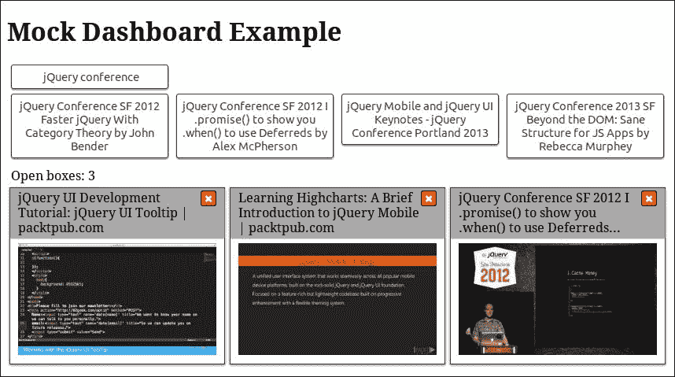

# 第八章：模拟对象模式

本章中，我们将展示模拟对象模式，这是一种促进应用程序开发的模式，而不实际成为最终实现的一部分。我们将学习如何设计、创建和使用这种行业标准的设计模式，以便更快地协调和完成多部分 jQuery 应用程序的开发。我们将分析一个合适的模拟对象应该具有的特征，并了解它们如何被用作代表性用例，甚至是我们代码的测试用例。

我们将看到良好的应用程序架构如何使我们更容易使用模拟对象和服务，通过匹配应用程序的各个部分，并且意识到在开发过程中使用它们的好处。到本章结束时，我们将能够创建模拟对象和服务，以加速我们应用程序的实现，并且在所有部分完成之前就对其整体功能有所了解。

在本章中，我们将：

+   介绍模拟对象和模拟服务模式

+   分析模拟对象和服务应该具有的特征

+   了解为什么它们与具有良好架构的应用程序更匹配

+   学习如何在 jQuery 应用程序中使用它们作为推动开发并加速开发的一种方式

# 介绍模拟对象模式

模拟对象模式的关键概念在于创建和使用一个模拟行为更复杂的对象的虚拟对象，该对象是（或将成为）实现的一部分。模拟对象应该具有与实际（或真实）对象相同的 API，使用相同的数据结构返回类似的结果，并且在其方法如何改变其公开状态（属性）方面操作方式相似。

模拟对象通常在应用程序的早期开发阶段创建。它们的主要用途是使我们能够继续开发一个模块，即使它依赖于尚未实现的其他模块。模拟对象也可以被描述为实现之间交换的数据的原型，起着开发人员之间的契约作用，并且促进了相互依赖模块的并行开发。

### 提示

就像模块模式的原则解耦了应用程序不同部分的实现一样，创建和使用模拟对象和模拟服务也解耦了它们的开发。

在开始实施每个模块之前为其创建模拟对象清晰地定义了应用程序将使用的数据结构和 API，消除了任何误解，并使我们能够检测到所提供的 API 中的不足。

### 提示

在开始实际实现之前定义描述问题所需的数据结构，使我们能够专注于应用程序的需求，并了解其整体复杂性和结构。

通过使用为原始实现创建的 Mock 对象，您可以在任何代码更改后始终测试实现的任何部分。通过在修改后的方法上使用 Mock 对象，您可以确保原始用例仍然有效。当修改后的实现是涉及多阶段的用例的一部分时，这非常有用。

如果模块的实现发生变化并导致应用程序其他部分表现异常，Mock 对象尤其有用，可以用于追踪错误。通过使用现有的 Mock 对象，我们可以轻松识别与原始规范不符的模块。此外，相同的 Mock 对象可用作高质量测试用例的基础，因为它们通常包含更真实的样本数据，特别适用于团队遵循测试驱动开发（TDD）范例。

### 注意

在测试驱动开发（TDD）中，开发人员首先为需要添加的用例或新功能定义测试用例，然后通过尝试满足所创建的测试用例来实施。更多信息，请访问：[`www.packtpub.com/books/content/overview-tdd`](https://www.packtpub.com/books/content/overview-tdd)。

Mock 对象模式通常被前端网络开发人员用于将客户端开发与后端将公开的网络服务解耦。因此，导致了一些风趣的评论，比如：

> “网络服务总是拖延并突然改变，所以使用 Mock 代替。”

总结所有这些，创建 Mock 对象和服务的主要原因包括：

+   实际对象或服务尚未实现。

+   实际对象难以为特定用例设置。

+   我们需要模拟罕见或非确定性的行为。

+   实际对象的行为难以复现，比如网络错误或 UI 事件。

# 在 jQuery 应用程序中使用 Mock 对象

为了展示 Mock 对象模式在开发多部分应用程序时的用法，我们将扩展仪表板示例，如我们在第四章 *用模块模式进行分而治之*中看到的，以显示来自网络开发会议的 YouTube 视频的缩略图。视频引用被分为四个预定义类别，并根据当前的类别选择显示相关按钮，如下所示：



需要引入到 HTML 和 CSS 中的更改是最小的。与第四章 *用模块模式进行分而治之*现有实现相比，上述实现唯一需要额外的 CSS 是与缩略图宽度相关的：

```js
.box img { 
  width: 100%; 
}
```

HTML 中的变化旨在组织每个类别的`<button>`元素。这个变化将使我们的实现更加直观，因为类别及其项不再在 HTML 中静态定义，而是动态创建，由可用数据驱动。

```js
      <!-- … -->
      <section class="dashboardCategories"> 
        <select id="categoriesSelector"></select> 
        <div class="dashboardCategoriesList"></div> 
        <div class="clear"></div> 
      </section> 
      <!-- … -->
```

在上面的 HTML 片段中，带有`dashboardCategoriesList` CSS 类的`<div>`元素将被用作不同视频类别的分组按钮的容器。在涵盖了 UI 元素后，让我们现在转向 JavaScript 实现的分析。

## 定义实际服务需求

在我们的仪表板中显示的视频引用可以从各种来源检索到。例如，您可以直接调用 YouTube 的客户端 API 或通过后端 Web 服务进行 AJAX 调用。在所有上述情况下，将此数据检索机制抽象为一个单独的模块被认为是一种良好的实践，遵循前几章的代码结构建议。

由于这个原因，我们需要向现有实现添加一个额外的模块。这将是一个服务，负责提供允许我们从每个类别中检索最相关视频并单独加载每个视频信息的方法。这将通过分别使用`searchVideos()`和`getVideo()`方法来实现。

正如我们已经提到的，每个实现的一个最重要的阶段，尤其是在并行开发的情况下，是对要使用的数据结构进行分析和定义。由于我们的仪表板将使用 YouTube API，我们需要创建一些遵循其数据结构规则的示例数据。在检查了 API 之后，我们得到了一组需要用于我们的仪表板的字段的子集，并且可以继续创建一个具有模拟数据的 JSON 对象来演示所使用的数据结构：

```js
{ 
  "items": [{ 
    "id": { "videoId": "UdQbBq3APAQ" }, 
    "snippet": { 
      "title": "jQuery UI Development Tutorial: jQuery UI Tooltip | packtpub.com", 
      "thumbnails": { 
        "default": { "url": "https://i.ytimg.com/vi/UdQbBq3APAQ/default.jpg" }, 
        "medium": { "url": "https://i.ytimg.com/vi/UdQbBq3APAQ/mqdefault.jpg" }, 
        "high": { "url": "https://i.ytimg.com/vi/UdQbBq3APAQ/hqdefault.jpg" } 
      } 
    } 
  }/*,...*/]
}
```

### 注意

有关 YouTube API 的更多信息，请访问：[`developers.google.com/youtube/v3/getting-started`](https://developers.google.com/youtube/v3/getting-started)。

我们的服务提供两种核心方法，一种用于在指定类别中搜索视频，另一种用于检索特定视频的信息。用于搜索方法的示例对象结构用于检索一组相关项目，而用于检索单个视频信息的方法使用每个单独项目的数据结构。生成的视频信息检索实现位于名为`videoService`的单独模块中，该模块将在`dashboard.videoService`命名空间上可用，我们的 HTML 将包含类似以下的`<script>`引用：

```js
<script type="text/javascript" src="img/dashboard.videoservice.js"></script>
```

## 实现模拟服务

改变服务实现的`<script>`引用与模拟服务之间的相互转换应该使我们得到一个可工作的应用程序，帮助我们在实际视频服务实现完成之前进展和测试其他实现。因此，模拟服务需要使用相同的`dashboard.videoService`命名空间，但其实现应该在一个名为`dashboard.videoservicemock.js`的不同命名的文件中，它简单地添加了“mock”后缀。

正如我们先前提到的，将所有的模拟数据放在一个单独的变量下是一个很好的做法。此外，如果有很多模拟对象，通常会将它们放在一个完全不同的文件中，带有嵌套的命名空间。在我们的案例中，包含模拟数据的文件名为`dashboard.videoservicemock.mockdata.js`，其命名空间为`dashboard.videoService.mockData`，同时公开了`searches`和`videos`属性，这些属性将被我们的模拟服务的两个核心方法使用。

即使模拟服务的实现应该简单，它们也有自己的复杂性，因为它们需要提供与目标实现相同的方法，接受相同的参数，并且看起来好像它们是以完全相同的方式操作的。例如，在我们的案例中，视频检索服务需要是异步的，其实现需要返回 Promises：

```js
(function() { // dashboard.videoservicemock.js
    'use strict'; 

    dashboard.videoService = dashboard.videoService || {}; 

    dashboard.videoService.searchVideos = function(searchKeywords) { 
        return $.Deferred(function(deferred) { 
            var searches = dashboard.videoService.mockData.searches; 
            for (var i = 0; i < searches.length; i++) { 
                if (searches[i].keywords === searchKeywords) { 
                    // return the first matching search results 
                    deferred.resolve(searches[i].data); 
                    return; 
                } 
            } 
            deferred.reject('Not found!'); 
        }).promise(); 
    }; 

    dashboard.videoService.getVideo = function(videoTitle) { 
        return $.Deferred(function(deferred) { 
            var videos = dashboard.videoService.mockData.allVideos;
            for (var i = 0; i < videos.length; i++) { 
                if (videos[i].snippet.title === videoTitle) { 
                    // return the first matching item 
                    deferred.resolve(videos[i]); 
                    return; 
                } 
            } 
            deferred.reject('Not found!'); 
        }).promise(); 
    }; 

    var videoBaseUrl = 'https://www.youtube.com/watch?v='; 
    dashboard.videoService.getVideoUrl = function(videoId) { 
        return videoBaseUrl + videoId; 
    }; 
})(); 
```

如上面模拟服务的实现所示，`searchVideos()`和`getVideo()`方法正在遍历带有模拟数据的数组，并返回一个 Promise，该 Promise 在找到合适的模拟对象时被解析，或者在未找到这样的对象时被拒绝。最后，你可以在下面看到包含模拟对象的子模块的代码，遵循了我们先前描述的数据结构。注意，我们将所有类别的模拟对象都存储在`allVideos`属性中，以便通过模拟的`getVideo()`方法更简单地进行搜索。

```js
(function() { // dashboard.videoservicemock.mockdata.js
    'use strict'; 

    dashboard.videoService.mockData = dashboard.videoService.mockData || {}; 

    dashboard.videoService.mockData.searches = [{ 
        keywords: 'jQuery conference', 
        data: { 
            "items": [/*...*/] 
        } 
    }/*,...*/]; 

    var allVideos = []; 
    var searches = dashboard.videoService.mockData.searches; 
    for (var i = 0; i < searches.length; i++) { 
        allVideos = allVideos.concat(searches[i].data.items);
    } 

    dashboard.videoService.mockData.allVideos = allVideos; 
})(); 
```

通过对一些模拟服务实现的实验，你将在很短的时间内熟悉它们的常见实现模式。除此之外，你将能够轻松地创建模拟对象和服务，帮助你设计应用程序的 API，通过使用模拟测试它们，最终确定每个用例的最佳匹配方法和数据结构。

### 提示

**使用 jQuery Mockjax 库**

jQuery Mockjax 插件库（可在[`github.com/jakerella/jquery-mockjax`](https://github.com/jakerella/jquery-mockjax)）专注于提供一种简单的方法来模拟或模拟 AJAX 请求和响应。如果你所需要的只是拦截对 Web 服务的 AJAX 请求并返回模拟对象，那么这将减少你完全实现自己的模拟服务所需的代码量。

## 使用模拟服务

为了向现有的仪表板实现添加我们之前描述的功能，我们需要对`categories`和`informationBox`模块进行一些更改，添加将使用我们服务的方法的代码。作为使用新创建的 Mock 服务的典型示例，让我们看一下`informationBox`模块中`openNew()`方法的实现：

```js
dashboard.informationBox.openNew = function(itemName) {
    var $box = $('<div class="boxsizer"><article class="box">' +
            '<header class="boxHeader">' +
                '<button class="boxCloseButton">&#10006;</button>' +
                itemName +
            '</header>' +
            '<div class="boxContent">Loading...</div>' +
        '</article></div>');
    $boxContainer.append($box);

    dashboard.videoService.getVideo(itemName).then(function(result) {
        var $a = $('<a>').attr('href', dashboard.videoService.getVideoUrl(result.id.videoId));
        $a.append($('').attr('src', result.snippet.thumbnails.medium.url));
        $box.find('.boxContent').empty().append($a);
    }).fail(function() {
        $buttonContainer.html('An error occurred!');
    });
};
```

此方法首先以**加载中...**标签作为其内容打开一个新的信息框，并使用`dashboard.videoService.getVideo()`方法异步检索请求的视频的详细信息。最后，当返回的 Promise 得到解析时，将**加载中...**标签替换为包含视频缩略图的锚。

# 摘要

在这一章中，我们学习了如何设计、创建和使用我们应用程序中的 Mock 对象和 Mock 服务。我们分析了 Mock 对象应具有的特征，并理解了它们如何作为典型用例来使用。我们现在能够使用 Mock 对象和服务来加速我们应用程序的实现，并在其所有单个部分完成之前更好地了解其整体功能。

在下一章中，我们将介绍客户端模板化，并学习如何从可读模板在浏览器中高效生成复杂的 HTML 结构。我们将介绍`Underscore.js`和`Handlebars.js`，分析它们的约定，评估它们的特性，并找出哪一个更适合我们的口味。
