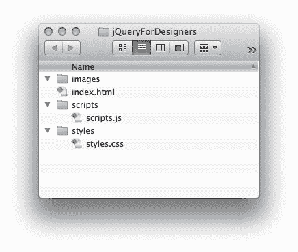
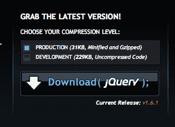
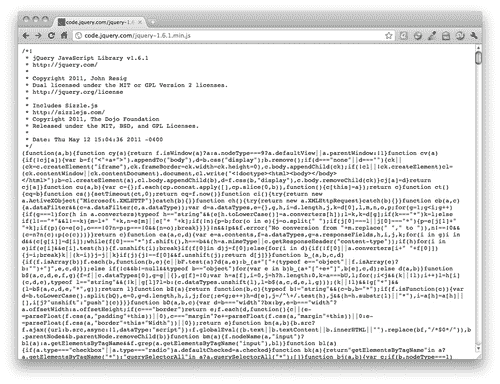
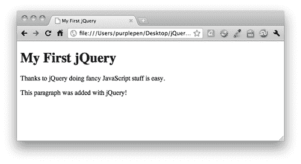

# 第一章：设计师，遇见 jQuery

> 在过去几年里，你可能已经听说了很多关于 jQuery 的事情 —— 它很快成为了当今网络上使用最广泛的代码包之一。你可能会想知道这一切到底是怎么回事。
> 
> 无论你以前是否尝试过理解 JavaScript 并因挫折而放弃，或者对此感到害怕而不敢尝试，你会发现 jQuery 是一种非常易于接近且相对容易学习的方法，可以让你初次接触 JavaScript 时感到轻松自如。

在这一章中，我们将涵盖：

+   jQuery 是什么，为什么它非常适合设计师

+   渐进增强和优雅降级

+   JavaScript 基础知识

+   下载 jQuery

+   你的第一个 jQuery 脚本

# jQuery 是什么？

jQuery 是一个 JavaScript 库。这意味着它是一组可重复使用的 JavaScript 代码，用于完成常见任务 —— 网页开发者经常发现自己一遍又一遍地解决相同的问题。与其每次从头开始设计解决方案，不如将所有这些有用的代码片段收集到一个单独的包中，可以在任何项目中包含并使用。jQuery 的创建者已经编写了代码来平稳而轻松地处理我们想要使用 JavaScript 完成的最常见和最乏味的任务 —— 并且他们已经解决了在不同浏览器中让代码工作所需解决的所有小差异。

重要的是要记住 jQuery 是 JavaScript，而不是自己的语言。它遵循同样的规则，以及与 JavaScript 相同的写法。不要因此而退缩 —— jQuery 确实使编写 JavaScript 变得更加容易。

jQuery 的官方口号是 *写更少，做更多*。这是对 jQuery 库的一个极好而准确的描述 —— 你真的可以在几行代码中完成惊人的事情。我自己对 jQuery 的非官方口号是 *找到东西并对其进行操作*，因为使用原始 JavaScript 找到并操作 HTML 文档的不同部分非常乏味，并且需要大量的代码行。jQuery 使得同样的任务变得轻松而快速。多亏了 jQuery，你不仅可以快速创建一个下拉菜单 —— 你可以创建一个动画效果并且在许多不同的浏览器中流畅运行的下拉菜单。

# 为什么 jQuery 对设计师来说如此棒？

那么，究竟是什么让 jQuery 如此易于学习，即使你对 JavaScript 有限或没有经验？

## 使用你已经了解的 CSS 选择器

在 jQuery 脚本中，你通常会做的第一件事情是选择你想要操作的元素。例如，如果你要向导航菜单添加一些效果，你会首先选择导航菜单中的项目。用于这项工作的工具是选择器 —— 一种选择页面上要操作的特定元素的方法。

jQuery 从 CSS 中借用了选择器一直到 CSS3，即使在尚不支持 CSS3 选择器的浏览器中也可以工作。

尽管 CSS 提供了一组相当强大的选择器，但 jQuery 自己添加了一些额外的选择器，使得你需要的元素更容易处理。

如果你已经知道如何做一些事情，比如将所有的一级标题变为蓝色，或者将所有的链接变为绿色并带下划线，那么你很容易学会如何用 jQuery 选择你想要修改的元素。

## 使用你已经了解的 HTML 标记语言

如果你想要用原始的 JavaScript 创建新元素或修改现有元素，最好揉揉手指，准备好写很多很多的代码 —— 而且这些代码可能并不那么容易理解。

例如，如果我们想要向页面附加一个段落，内容是*这个页面由 JavaScript 驱动*，我们首先必须创建段落元素，然后将应该在段落中的文本分配给一个变量作为字符串，最后将字符串附加到新创建的段落作为文本节点。然后，我们仍然必须将段落附加到文档中。哎呀！（如果你没有完全理解这一切，别担心，这只是为了说明做这么简单的事情需要多少工作和代码。）

通过 jQuery，向页面底部添加一个段落就这么简单：

```js
$('body').append('<p>This page is powered by jQuery.</p>');

```

没错 —— 你只需将一小段 HTML 直接附加到 body 中，然后一切就搞定了。我敢打赌，即使你完全不理解 JavaScript，你也能读懂那行代码并理解它在做什么。这段代码是将一个段落附加到我的 HTML 文档的 body 中，内容是*这个页面由 jQuery 驱动*。

## 仅需几行代码即可实现令人印象深刻的效果。

你有更重要的事情要做，而不是坐在那里写一行一行的代码来添加淡入和淡出效果。jQuery 为你提供了一些基本的动画和创建自定义动画的能力。比如说，我想让一张图片淡入到页面中：

```js
$('img').fadeIn();

```

是的，就是这样 —— 一行代码，我选择了我的图片然后告诉它淡入。我们稍后会在本章中确切地了解这行代码在你的 HTML 页面中的位置。

## 可用的巨大插件库

正如我之前所说，Web 开发者经常发现自己反复解决相同的问题。你很可能不是第一个想要构建旋转图片幻灯片、动画下拉菜单或新闻滚动条的人。

jQuery 有一个令人印象深刻的大型脚本库 —— 脚本用于创建工具提示、幻灯片、新闻滚动条、下拉菜单、日期选择器、字符计数器等等。你不需要学会如何从头开始构建所有这些东西 —— 你只需要学会如何利用插件的威力。我们将在本书中介绍一些最受欢迎的 jQuery 插件，你将能够利用你所学到的知识使用 jQuery 插件库中的任何插件。

## 庞大的社区支持

jQuery 是一个开源项目 — 这意味着它是由一群超级聪明的 JavaScript 编码人员共同构建的，并且任何人都可以免费使用。开源项目的成功或失败通常取决于项目背后的社区 — 而 jQuery 有一个庞大而活跃的支持社区。

这意味着 jQuery 本身正在不断改进和更新。除此之外，还有成千上万的开发人员创建新的插件，为现有插件添加功能，并为新手提供支持和建议 —— 你会发现针对几乎任何你想学习的内容，每天都会有新的教程、博客文章和播客。

# JavaScript 基础知识

在本节中，我将介绍一些 JavaScript 的基础知识，这将使事情更加顺利进行。我们将查看一小部分代码，并解释它的工作原理。不要感到害怕 —— 这将很快并且没有痛苦，然后我们将准备好真正开始使用 jQuery 了。

## 渐进增强和优雅降级

在增强 HTML 页面与 JavaScript 时，有几种不同的思想流派。在我们着手进行有趣的事情之前，让我们谈谈一些在深入研究之前应该考虑的事情。

渐进增强和优雅降级本质上是同一枚硬币的两面。它们都意味着我们的页面及其令人印象深刻的 JavaScript 动画和特效将仍然适用于具有较差浏览器或设备的用户。优雅降级意味着我们创建特效，然后确保如果未启用 JavaScript，则优雅地失败。如果我们采用渐进增强方法，我们将首先构建一个适用于所有人的简约页面，然后通过添加我们的 JavaScript 特效来增强它。我倾向于采用渐进增强方法。

我们为什么要关心那些没有启用 JavaScript 的用户呢？好吧，网络上最大的用户之一 — 搜索引擎 — 没有 JavaScript 功能。当搜索引擎爬行和索引您的页面时，它们将无法访问 JavaScript 加载到您的页面中的任何内容。这通常被称为动态内容，如果无法在禁用 JavaScript 的情况下访问，搜索引擎将无法索引或找到它。

我们也处于一个时代，不再能指望用户使用传统的台式机或笔记本电脑访问我们构建的网页。我们很快就会想到智能手机和平板电脑是下一个候选者，虽然它们非常受欢迎，但它们仍然只占互联网访问的一小部分。

人们从游戏机、电子书阅读器、互联网电视、各种各样的移动设备甚至可能还有数百种其他方式访问网络。并非所有这些设备都能执行 JavaScript —— 其中一些甚至没有彩色屏幕！你的头等大事应该是确保你的内容对任何要求它的人都是可用的，无论他们使用的设备是什么。

## 必须分开处理它们

要完成这个尽可能使我们的内容对尽可能广泛的受众可用的任务，我们必须将我们的网页看作是三个独立且不同的层次：内容、呈现和行为。

### 内容

内容是我们网页的重点 —— 它是我们最感兴趣的呈现在我们页面上的文本或音频或视频，所以这是我们开始的地方。

用干净、简单的 HTML 代码标记您的内容。使用 HTML 元素的方式是它们预期的使用方式。使用标题标记标记标题、使用段落标记标记段落、使用列表标记标记列表，并将表格保留给表格数据。

浏览器为这些基本的 HTML 标签内置了样式 —— 标题将会是较大的字体且可能会加粗。列表将具有项目符号或编号。可能看起来不太花哨，但它对任何人来说都是可读的和可访问的。

### 呈现

展示层是我们开始变得花哨的地方。这是我们引入 CSS 并开始对我们创建的内容应用自己的样式的地方。当我们为页面添加样式时，我们可能会发现我们需要回到我们的 HTML 中添加一些新的容器和标记，以使诸如多列布局之类的东西成为可能，但我们仍然应该努力保持我们的标记尽可能简单和直接。

### 行为

一旦我们的页面所有内容都被正确标记并且样式看起来我们喜欢的方式，现在我们可以考虑添加一些交互行为。这就是 JavaScript 和 jQuery 起作用的地方。这一层包括动画、特效、AJAX 等等。

# 设计师，见识 JavaScript

JavaScript 是一种功能强大且复杂的语言 —— 你可以与之一起工作 10 年，仍然有更多要学习的内容。但不要让这吓倒你，你不必了解它的所有内容才能利用它所提供的内容。事实上，你只需要掌握一些基础知识。

这一节介绍了一些 JavaScript 基础和 JavaScript 语法。不要被那个开发者词语 —— 语法 吓倒。语法只是指编写语言的规则，就像我们有写英语的语法规则一样。

## 变量

让我们从简单的开始：

```js
var x = 5;

```

这是 JavaScript 中的*句子*。在英语中，我们以句号或者可能是问号或感叹号结束句子。在 JavaScript 中，我们以分号结束我们的句子。

在这个句子中，我们正在创建一个变量，`x`。变量只是一个容器，用来保存东西。在这种情况下，`x`保存的是数字`5`。

我们可以用 JavaScript 这样做数学：

```js
var x = 5;
var y = 2;
var z = x + y;

```

就像代数一样，我们的变量`z`现在为我们保存了数字`7`的值。

但变量可以保存除了数字之外的其他东西。例如：

```js
var text = 'A short phrase';

```

在这里，我们命名了我们的变量`text`，它为我们保存了一些字母字符。这叫做**字符串**。字符串是一组字母数字字符。

## 对象

对于 JavaScript 新手来说，对象可能是最难理解的东西，但那往往是因为我们想得太多，坚信它必须比实际更复杂。

一个对象就像它听起来的那样 —— 一个东西，任何东西。就像汽车、狗或咖啡壶都是对象。

对象具有属性和方法。属性是对象的特征。例如 — 一只狗可以高或矮，有尖耳或垂耳，是棕色或黑色，或白色。所有这些都是一只狗的属性。方法是对象可以做的事情。例如一只狗可以跑、吠、走路和吃东西。

让我们以我的狗，马格达莱纳·冯·巴尔金顿，为例，看看我们如何在 JavaScript 中处理对象、属性和方法：

```js
var dog = Magdelena von Barkington;

```

这里我创建了一个变量`dog`，我将其用作一个容器来容纳我的狗，主要是因为我不想每次在代码中提及她时都要输入她的全名。现在假设我想要获取我的狗的颜色：

```js
var color = dog.color;

```

我创建了一个名为`color`的容器，我用它来容纳我的狗的颜色属性 — `color`现在等于我的狗的颜色。

现在，我训练过我的狗，我想让她翻滚。这是我用 JavaScript 告诉她翻滚的方法：

```js
dog.rollOver();

```

`rollOver`是一个方法 —— 我的狗能做的事情。在我的狗翻滚后，我可能想用零食奖励她。这是我用 JavaScript 让我的狗吃零食的方法：

```js
dog.eat('bacon');

```

等等，这里发生了什么？ 让我们一步一步来看。我们有 dog，我们知道它是一个容器，里面装着我的狗，马格达莱纳·冯·巴尔金顿。我们有`eat`方法，我们知道这是我的狗能做的事情。但是我的狗不能只是吃 —— 她必须吃*某物*。我们用括号来表示她在吃什么。在这种情况下，我的幸运狗在吃培根。在 JavaScript 里，我们会说我们正在将培根传递给狗的`eat`方法。

所以你看，对象并不那么难 — 它们只是事物。属性就像形容词 — 它们描述对象的特征或特性。方法就像动词 — 它们描述对象可以做的动作。

## 函数

函数是一小段可重复使用的代码，告诉 JavaScript 做某事。例如：

```js
function saySomething() {
alert('Something!');
}

```

该函数告诉 JavaScript 弹出一个显示`Something!`的警告框。我们总是用单词`function`开始一个函数，然后命名我们的函数。接着是一对括号和一对花括号。指令行写在花括号里。

现在，我的`saySomething`函数在被调用之前实际上不会做任何事情，所以我需要添加一行代码来调用我的函数：

```js
function saySomething() {
alert('Something!');
}
saySomething();

```

### 提示

**下载示例代码**

你可以从你在 [`www.PacktPub.com`](http://www.PacktPub.com) 上购买的所有 Packt 书籍的帐户中下载示例代码文件。如果你在其他地方购买了这本书，你可以访问 [`www.PacktPub.com/support`](http://www.PacktPub.com/support) 并注册，让文件直接通过电子邮件发送给你。

也许你会想知道那些括号是干什么的。还记得我们是如何通过将它们包含在括号中将东西传递给一个方法的吗？

```js
dog.eat('bacon');

```

在这种情况下，我们通过`bacon`来说明狗正在吃什么。对于函数，我们也可以做类似的事情。事实上，方法实际上就是函数 —— 它们只是专门用于描述对象可以做什么的函数。让我们看看如何修改我们的`saySomething`函数，以便我们可以向其传递文本：

```js
function saySomething(text) {
alert(text);
}
saySomething('Hello there!');

```

在这种情况下，当我编写`saySomething`函数时，我只是留下了一个通用的容器。这被称为参数 —— 我们会说`saySomething`函数接受一个文本参数，因为我将我的参数称为`text`。我选择了`text`这个名字，因为它是对我们传入的内容的一个简短而方便的描述。我们可以向这个函数传递任何文本片段，所以`text`是一个合适的名字。你可以给你的参数起任何名字 —— 但是如果在选择参数名称时应用一些常识规则，你的代码将更容易阅读和理解。参数行为非常像变量 —— 它只是一个东西的容器。

# 下载 jQuery 并设置

我们准备将 jQuery 的魔力引入项目中，但首先我们需要下载它并弄清如何将它附加到一个 HTML 页面上。在这里，我们将逐步了解如何启动一个示例 HTML 文件，以及我们需要处理一个示例项目设置所需的所有关联文件和文件夹。完成后，你可以将其用作本书中所有未来练习的模板。

# 行动时间 —— 下载并附加 jQuery

之前，我描述了 HTML 文档的三个层次 —— 内容、展示和行为。让我们看看如何为这三个层次设置我们的文件：

1.  首先，让我们在你的硬盘上创建一个文件夹，用来保存你在本书中学习过程中的所有工作。在你的硬盘上找一个合适的位置，创建一个名为`jQueryForDesigners`的文件夹。

1.  在文件夹内创建一个名为`styles`的文件夹。我们将使用这个文件夹来保存我们创建的任何 CSS。在`styles`文件夹内，创建一个名为`styles.css`的空 CSS 文件。

    样式代表着我们的展示层。我们将所有的样式保存在这个文件中以保持它们的分离。同样，创建一个名为`images`的文件夹来保存我们将要使用的任何图片。

1.  接下来，创建一个名为`scripts`的文件夹来保存我们的 JavaScript 和 jQuery 代码。在`scripts`文件夹内，创建一个名为`scripts.js`的空 JavaScript 文件。

    这里编写的 JavaScript 代表我们的行为层。我们将所有的 JavaScript 都放在这个文件中，以使其与其他层分开。

1.  现在，在`jQueryForDesigners`文件夹中，创建一个非常基本的新 HTML 页面，如下所示：

    ```js
    <!DOCTYPE html>
    <html>
    <head>
    <title>Practice Page</title>
    </head>
    <body>
    <!-- Our content will go here -->
    </body>
    </html>

    ```

    将该文件保存为`index.html`。HTML 文件是我们的内容层，可以说是最重要的层；因为这很可能是网站访问者访问我们网站的原因。

1.  接下来，我们将把我们制作的 CSS 和 JavaScript 文件附加到我们的 HTML 页面上。在头部部分，添加一行来包含 CSS 文件：

    ```js
    <head>
    <title>Practice Page</title>
    <link rel="stylesheet" href="styles/styles.css"/>
    </head>

    ```

    然后转到 HTML 文件的底部，在闭合的`</body>`标签之前，包含 JavaScript 文件：

    ```js
    <script src="img/scripts.js"></scripts>
    </body>
    </html>

    ```

    由于这些文件只是空占位符，将它们附加到你的 HTML 页面上不会产生任何效果。但现在当我们准备进行练习时，我们有一个方便的地方来编写我们的 CSS 和 JavaScript。

    ### 注意

    注意，自闭合`<link>`元素是完全可以的，但是`<script>`元素总是需要一个单独的闭合`</script>`标签。没有它，你的 JavaScript 将无法工作。

    +   到目前为止，我的文件夹看起来是这样的：

    

1.  现在我们要在我们的页面中包含 jQuery。前往 [`jquery.com`](http://jquery.com)，点击**Download(jQuery)**按钮：

    你会注意到**选择你的压缩级别**下有两个选项。你总是要勾选**生产**复选框。这是一个准备在网站上使用的版本。**开发**版本是为有经验的 JavaScript 开发人员准备的，他们想要编辑 jQuery 库的源代码。

1.  点击**下载**按钮会在你的浏览器窗口中打开生产 jQuery 文件，看起来有点吓人，如下所示：

1.  不用担心，你不必阅读它，你绝对不必理解它。只需转到浏览器的文件菜单，选择**另存为...**。或右键单击页面，选择**另存为**，然后将文件保存到我们创建的`scripts`文件夹中。默认情况下，脚本文件名中会包含版本号。我将继续将文件重命名为`jquery.js`，以保持简单。

1.  现在我们只需在我们的页面中包含我们的 jQuery 脚本，就像我们包含我们的空 JavaScript 文件一样。转到你的练习 HTML 文件的底部，在我们之前创建的`<script>`标签之前添加一行来包含 jQuery：

    ```js
    <script src="img/jquery.js"></script>
    <script src="img/scripts.js"></script>
    </body>
    </html>

    ```

你不会在你的 HTML 页面上注意到任何变化 — jQuery 自己不会做任何事情。它只是让它的魔法可供你使用。

# 使用 jQuery 的另一个选项

下载并使用自己的 jQuery 副本没有任何问题，但你还有另一个选项可用，可以帮助提高你的网站性能。那就是使用 CDN 托管的 jQuery 副本。

你可能不知道，**CDN**是**内容传递网络**的简称。CDN 的前提是从离站点访问者位置物理上更近的服务器下载文件速度更快。例如，如果您在加利福尼亚州的洛杉矶，那么位于亚利桑那州凤凰城的服务器上的 jQuery 副本将比位于纽约市的服务器上的 jQuery 副本下载得更快。为了加快这个过程，CDN 在世界各地的许多不同服务器上都有相同文件的副本。每当站点访问者请求文件时，CDN 会智能地将他们的请求路由到最接近的可用服务器，有助于改善响应时间和整体站点性能。

对于本书中构建的相对简单的示例和页面来说，这并不会有太大影响，但对于公开面向网站来说，使用 CDN 托管的 jQuery 副本可以带来明显的改善。虽然有几种选择，但远非最受欢迎的是谷歌的 Ajax API CDN。您可以在[`code.google.com/apis/libraries/devguide.html#jquery`](http://code.google.com/apis/libraries/devguide.html#jquery)获取有关最新版本和正确 URL 的信息。

如果您想在您的文件中使用谷歌 CDN 托管的 jQuery 版本，只需将以下代码行添加到您的 HTML 文件中即可，而不是以前用于包含 jQuery 的行:

```js
<script src="img/jquery.min.js"></script>

```

不需要下载文件，也不需要保存自己的副本，您只需直接将您的`<script>`标签指向存储在 Google 服务器上的 jQuery 的副本即可。谷歌会负责从最近可用的服务器向您的站点访问者发送 jQuery。

不仅如此，因为谷歌的 CDN 非常受欢迎，您的站点访问者很可能已经访问过另一个也使用谷歌 CDN 托管的 jQuery 副本的站点，他们将会有

jQuery 在他们的浏览器中已缓存。这意味着您的站点访问者根本不需要下载 jQuery-它已保存在他们的浏览器中，并可以随时使用。这又如何提高性能呢?

# 您的第一个 jQuery 脚本

好了，现在我们对 JavaScript 的一些基本概念有了一些了解，并且知道如何设置文件和文件夹以构建一个示例练习，让我们构建我们的第一个简单的示例页面，并使用 jQuery 实现一些花里胡哨的东西。

# 行动时间-准备好使用 jQuery 了

1.  就像我们在前面的练习中所做的那样设置您的文件和文件夹。在 HTML 文档的`<body>`内，添加一个标题和一个段落:

    ```js
    <body>
    <h1>My First jQuery</h1>
    <p>Thanks to jQuery doing fancy JavaScript stuff is easy.</p>
    </body>

    ```

1.  在`styles`文件夹中的`styles.css`中随意创建一些 CSS 样式-您可以随心所欲地对其进行样式化。

1.  接下来，打开我们之前创建的空白`scripts.js`文件，并向文件中添加以下脚本:

    ```js
    $(document).ready();

    ```

## 刚刚发生了什么?

让我们一次来分析这个陈述-首先是一个美元符号?真的吗?JavaScript 里面怎么会出现这个符号？

这里的`$`只是一个变量——就这样。它是 jQuery 函数的容器。还记得我说过我们可能使用一个变量来节省几次按键吗？jQuery 的聪明作者们提供了`$`变量，使我们不必每次都写出`jQuery`。这段代码也能完成同样的事情：

```js
jQuery(document).ready();

```

除了输入时间更长之外。jQuery 使用`$`作为其简称，因为你很少会自己使用变量`$`，因为这是一个不常见的字符。使用不常见的字符可以减少在页面上使用其他 JavaScript 代码和 jQuery 库之间发生冲突的可能性。

所以，在这种情况下，我们将`document`传递给 jQuery 或`$`方法，因为我们希望将我们的 HTML 文档作为我们代码的目标选择。当我们调用 jQuery 函数时，我们得到一个 jQuery 对象。在 JavaScript 中，我们会说 jQuery 函数*返回*一个 jQuery 对象。jQuery 对象是 jQuery 库赋予其强大功能的核心。整个 jQuery 库存在的目的就是为了给 jQuery 对象提供许多属性和方法，使我们的生活更轻松。我们不必处理很多不同类型的对象——我们只需要处理 jQuery 对象。

jQuery 对象有一个名为`ready()`的方法。在这种情况下，当文档加载到浏览器中并且可以与之一起工作时，将调用 ready 方法。所以`$(document).ready()`的意思就是“当文档准备就绪时”。

## 添加一个段落

现在我们已经准备好在文档就绪时执行某些操作了，但我们要做什么呢？让我们向页面添加一个新段落。

# 行动时间——添加一个新段落

1.  我们需要告诉 jQuery 在文档准备就绪时要做什么。因为我们希望发生某些事情，所以我们将传入一个函数，如下所示：

    ```js
    $(document).ready(function(){
    // Our code will go here
    });

    ```

    我们将在这个函数内写明将要发生的事情。

    那行以`//`开头的代码呢？那是 JavaScript 中编写注释的一种方式。`//`告诉 JavaScript 忽略该行上的所有内容，因为它是一条注释。在 JavaScript 中添加注释是帮助自己跟踪代码发生了什么的好方法。对于可能需要处理您的代码的其他开发人员来说，这也很有帮助。即使在几个月后再次查看自己的代码，这也是很有帮助的。

1.  接下来，我们将添加我们想要在文档准备就绪时立即发生的事情：

    ```js
    $(document).ready(function(){
    $('body').append('<p>This paragraph was added with jQuery!</ p>');
    });

    ```

## 刚刚发生了什么？

我们的函数再次使用了 jQuery 函数：

```js
$('body')

```

还记得我说过 jQuery 使用 CSS 选择器来查找东西吗？这就是我们如何使用这些 CSS 选择器的方式。在这种情况下，我想要`<body>`标签，所以我将`'body'`传递给 jQuery 函数。这会返回包装在 jQuery 对象中的`<body>`标签。巧妙的是，jQuery 对象有一个`append()`方法，让我可以向页面添加新内容：

```js
$('body').append();

```

现在我所要做的就是将要添加到页面的内容传递给 append 方法。在引号中，我将传递一行 HTML 代码，我想要添加的内容：

```js
$('body').append('<p>This paragraph was added with jQuery!</p>');

```

这就是全部！现在，当我在浏览器中加载我的页面时，我会看到我的标题，后面跟着两个段落 —— jQuery 会在文档加载到浏览器中时添加第二个段落：



# 摘要

在本章中，你已经介绍了 jQuery 库，并学习了一些关于它的知识。我们讲解了一些 JavaScript 基础知识，然后学习了如何为本书中的练习设置我们的文件和文件夹。最后，我们设置了一个简单的 HTML 页面，利用 jQuery 添加了一些动态内容。现在让我们看看如何使用 jQuery 使链接更加强大。
