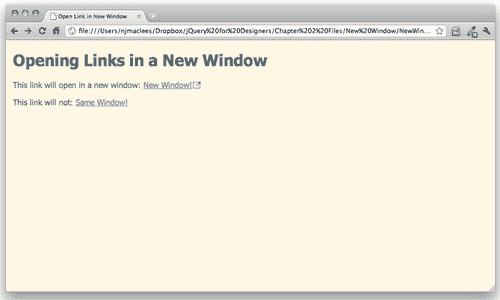
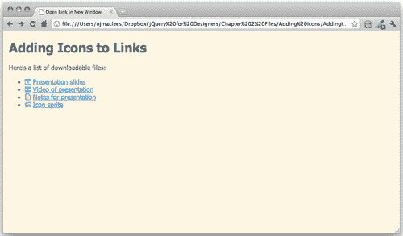
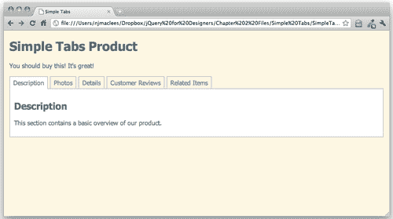

# 第二章 增强链接

> 如今我们理所当然地使用链接，但事实上，这个不起眼的链接是改变文档并使今天的网络成为可能的事物。在此之前，将读者直接链接到另一个文档或另一个文档内的另一个位置是不可能的。
> 
> 因此，你可以说超链接是互联网的支柱 —— 没有它们，搜索引擎就不可能存在，也不会有大多数网站。让我们来看看一些方法，我们可以让链接为我们提供更大的帮助。

在本章中，我们将涵盖：

+   如何在新窗口打开链接

+   如何向链接添加图标以识别我们正在链接到的文档类型

+   如何将链接列表转换为简单的选项卡

# 在新窗口打开链接

尽管在新窗口打开链接是很常见的，但这种做法本身有些争议。有些人认为网站访问者应该自己决定是否要在新窗口打开链接，而且许多浏览器都让他们轻松实现这一点。一些人认为在新窗口打开链接会破坏**返回**按钮的预期行为，应该避免这样做。还有一些人认为，不在新窗口打开链接会让网站访问者感到困惑和失落，当他们突然发现自己在一个不同的网站上时。

无论你对这个问题持何种观点，客户通常都会提出这样的要求，而且这种做法可能不会很快消失，所以了解处理这种功能的选择是很重要的。我假设你已经意识到了在新窗口打开链接的问题，并已经认真权衡了所有选项，并向客户提出了一个知情的论点。

## 为什么不直接使用`target`属性呢？

你可能知道，HTML 提供了一个`target`属性，可以与链接一起使用，用于指定链接应该在哪里打开。例如，下面的代码：

```js
<a href="http://packtpub.com" target="_new">Link</a>

```

将创建一个链接，它将尽力在新窗口或新选项卡中打开，具体取决于用户在其浏览器中设置的偏好。

开发网页标准（如 HTML）的机构 W3C 已经废弃了`target`属性的严格文档类型的使用，但已经将该标签重新引入了 HTML5 规范。但是，`target`属性旨在与框架一起使用，以控制如何将新页面加载到框架和 iframe 中。它并不是用来打开一个不使用框架的页面中的链接的，因此严格来说，为此目的使用它是不正确的。

相反，我们可以使用一点 JavaScript 来创建我们想要的行为，而不使用无效或已弃用的代码。让我们来看看如何做到这一点。

# 行动时间 —— 在新窗口打开链接

1.  我们将从我们在第一章中创建的基本 HTML 文件和相关文件夹开始。在 HTML 文档的`<body>`中，我们将添加一些链接，如下所示：

    ```js
    <h1>Opening Links in a New Window</h1>
    <p>This link will open in a new window: <a href ="http://packtpub.com">New Window!</a></p>
    <p>This link will not: <a href ="http://packtpub.com">Same Window!</a></p>

    ```

    这只是一个标题和两个简单的段落，每个段落都有一个链接——一个应该在新窗口中打开，另一个不应该。

1.  我们需要一种方法来选择应该在新窗口中打开的链接。这与我们如果想要用 CSS 对其中一个链接进行不同样式处理时的情况类似。

    如果我们使用 CSS，我们可以为链接分配一个`ID`或一个类。`ID`会相当受限，因为`ID`必须在页面上是唯一的——它只适用于这个特定的链接。`class`将允许我们样式化任何在新窗口中打开的链接，所以这就是我们要使用的。如下所示，为应该在新窗口中打开的链接添加一个`class`：

    ```js
    <a href="http://packtpub.com" class="new-window">New Window!</a>

    ```

1.  现在我们可以使用这个类名来进行 CSS 样式设置，并使用 jQuery 使链接在新窗口中打开。为这个链接添加一个图标是个好主意，你可以在链接的左侧或右侧添加一些填充，然后为链接添加一个背景图像。打开你的`styles`文件夹中的空`styles.css`文件，并添加以下 CSS：

    ```js
    a.new-window {
    padding-right: 18px;
    background: url('../images/new-window-icon.png') 100% 50% no-repeat;

    ```

1.  接下来，我们将打开我们的`scripts`文件夹中的`scripts.js`文件，并在我们的文档准备好声明之外开始编写我们的函数来获取我们的`new-window`链接并使它们在新窗口中打开。首先声明一个新函数：

    ```js
    $(document).ready(function(){
    });
    function externalLinks() {
    }

    ```

    这里我们创建了一个新函数，并将其命名为`externalLinks`，因为这是一个合理的名称，用于在新窗口中打开链接。为 JavaScript 函数和变量命名为能帮助你记住它们的功能是非常有帮助的。

1.  接下来，我们将使用 jQuery 选择所有具有`new-window`类的链接。我们将利用 jQuery 的 CSS 选择器来选择这些链接，就像我们在用 CSS 对它们进行样式设置时一样。

    ```js
    function externalLinks() {
    $('a.new-window'); 
    }

    ```

1.  我们使用了`$`快捷方式调用 jQuery 函数，并向函数传递了 CSS 选择器。重要的是要记住将 CSS 选择器用单引号或双引号括起来。我们不希望链接在用户点击之前就打开新窗口，因此我们的下一步是告诉链接在被点击时运行一个函数。jQuery 使这变得非常容易。我们可以使用 jQuery 提供的`bind()`方法将一个函数绑定到链接上，当链接被点击时将调用该函数。代码如下所示：

    ```js
    function externalLinks() {
    $('a.new-window').bind('click', function() {
    });
    }

    ```

    这段代码将一个函数绑定到我们的链接上——当我们的链接被点击时，我们在这个新函数内编写的任何代码都将被调用。但到目前为止，我们的函数是空的，实际上什么也没做。

1.  接下来我们需要做的是获取链接将我们发送到的位置：

    ```js
    function externalLinks() {
    $('a.new-window').bind('click', function() {
    var location = $(this).attr('href');
    });
    }

    ```

    让我们逐一检查这一行新代码。首先，我们声明了一个名为`location`的新变量。你记得吧，变量只是一个容器。所以我们有了一个新的空容器，现在让我们看看我们放了什么进我们的容器。

    `$(this)`是 jQuery 引用我们当前正在处理的 jQuery 对象的方式。在这种情况下，我们选择所有具有`new-window`类的链接，并且我们已经附加了该函数，以便在站点访客点击链接时调用它。当站点访客点击链接时，我们希望检查被点击的链接以获取链接要前往的位置。引用当前链接的一个简单快捷的方式是使用`$(this)`。

    接下来我们使用`attr()`方法来获取链接的属性。链接要前往的位置包含在`href`属性中，因此我们将`href`传递给`attr()`方法。

    因此，我们命名为`location`的容器现在包含了链接指向的 URL，或者在这种特殊情况下，[`packtpub.com.`](http://packtpub.com)

1.  现在我们知道我们想要去哪里了，我们只需要在新窗口中打开那个位置。在 JavaScript 中打开一个新窗口是简单直接的：

    ```js
    function externalLinks() {
    $('a.new-window').bind('click', function() {
    var location = $(this).attr('href');
    window.open(location);
    });
    }

    ```

    `window`是 JavaScript 中的一个全局对象，始终可供我们使用。window 对象有一个`open()`方法，我们只需将位置传递给该方法，以便浏览器知道在新窗口中打开的位置是什么。

1.  现在，如果你在浏览器中打开这个 HTML 页面并尝试点击链接，你可能会失望地发现我们的链接没有在新窗口中打开。就像我们的 JavaScript 根本就不在页面上一样。我们写了一个非常好的函数，但它不起作用。那是因为函数在我们告诉它们之前不会做任何事情。在 JavaScript 中告诉一个函数做它的事情的方式是'调用该函数'。

    我们希望这个函数在页面在浏览器窗口加载时立即启动，找到所有具有类`new-window`的链接，并将我们的新窗口函数绑定到它们上。这样，我们的应该在新窗口中打开的链接将在我们的站点访客点击其中一个链接时准备好打开一个新窗口。

    我们只需在我们的文档准备好的语句中添加一行来调用我们的函数：

    ```js
    $(document).ready(function(){
    externalLinks();
    });
    function externalLinks() {
    $('a.new-window').bind('click', function() {
    var location = $(this).attr('href');
    window.open(location);
    });
    }

    ```

    这段新代码将在页面在浏览器中加载时立即调用我们的`externalLinks`函数。

1.  只剩下一件事要做了。现在，如果你在浏览器中加载页面并点击链接，你会发现链接确实会在新窗口中打开，但它也会在当前窗口中打开——所以我们最终会在两个不同的窗口中加载我们的新页面。这不是我们想要的结果。我们需要做的是取消链接的默认行为——我们已经处理了在新窗口中打开位置的事情，所以现在我们需要告诉浏览器，在站点访客点击链接时不需要做任何事情。所以让我们给我们的函数添加一个参数和一行代码来取消默认链接行为。

    ```js
    function externalLinks() {
    $('a.new-window').bind('click', function(e) {
    var location = $(this).attr('href');
    window.open(location);
    e.preventDefault();
    });
    }

    ```

    你会注意到我们附加到链接点击动作的函数现在括号里有一个 e。这是我们传递给这个函数的一个参数。在这种情况下，e 代表链接的点击事件。

    我们在函数中添加的代码行是：

    ```js
    e.preventDefault();

    ```

    这告诉浏览器停止链接的默认行为。如果你在浏览器中重新加载页面并点击链接，你会发现它会在新窗口中正确地打开目标页面，并且不再在当前窗口中打开链接：

    

1.  如果页面上有第二个应该在新窗口打开的链接，你认为会发生什么？让我们回到文档的`<body>`部分，添加一个应该在新窗口打开的第二个链接。在其他链接之后，添加一个新的段落和链接到一个新页面：

    ```js
    <p>This paragraph will open in a new window too: <a href="http://nataliemac.com" class="new-window">New Window!</a></p>

    ```

    确保将`new-window`类添加到你的链接中。

现在，当你在浏览器中刷新页面时，新链接会出现在页面上。尝试点击它，你会发现它也会像其他`new-window`链接一样在新窗口中打开。

## 刚刚发生了什么？

我们给那些希望在新窗口打开的链接添加了一个 CSS 类名。现在，我们在页面上创建的任何带有`new-window`类的链接都会在新窗口中打开，但是当有多个链接时，JavaScript 怎么知道要在新窗口中打开哪个页面呢？

答案就在我们的`externalLinks`函数中。我们选择了所有带有`new-window`类的链接，并绑定了一个函数，当这些链接被点击时触发。在这个函数内部，我们捕获了链接的位置。这个函数只有在链接被点击时才会运行。在那之前，它只是在场边等待行动。当一个带有`new-window`类的链接被点击时，我们的函数开始工作，捕获了那个特定链接的位置，并打开了一个指向该链接位置的新窗口。

# 为链接添加图标

向链接添加图标是向您的站点访客传达链接类型的最简单方法之一。您可能对站点的不同部分有不同的图标，或者您可能希望向站点访客提供一些可下载的文件 —— 例如，您编写的 PDF 或电子书，您进行的演示文稿的幻灯片，或者您创建的一些股票图标或摄影作品。向这些类型的链接添加图标可以帮助向您的站点访客提供视觉线索，以便他们知道单击链接时会发生什么。让我们看看我们如何使用 jQuery 为不同类型的链接添加适当的图标。

这是我们向链接添加图标后页面的示例：



# 行动时间 —— 创建链接列表

1.  我们将从我们创建的基本 HTML 文件和相关文件夹开始，就像我们在第一章中创建的那样，*设计师，遇见 jQuery*。我们将向 HTML 文档的`<body>`添加一系列链接列表，链接到几种不同类型的可下载文件：

    ```js
    <h1>Adding Icons to Links</h1>
    <p>Here's a list of downloadable files:</p>
    <ul>
    <li><a href="http://presentation.ppt">Presentation slides</a></li>
    <li><a href="video.mp4">Video of presentation</a></li>
    <li><a href="notes.pdf">Notes for presentation</a></li>
    <li><a href="http://icons.gif">Icon sprite</a></li>
    </ul>

    ```

    当我们在浏览器中查看此列表时，我们将看到一个链接的项目列表 —— 没有视觉指示告诉用户每个链接背后是什么类型的文件 —— 用户必须根据链接的文本猜测。让我们获取所有链接并根据链接指向的文件类型为每个链接添加适当的类名。为此，我们将使用 jQuery 的属性选择器。

1.  接下来，我们将准备好将 JavaScript 添加到我们的页面中。打开`scripts`文件夹中的`scripts.js`文件。

    让我们弄清楚如何区分一种类型的链接与另一种类型的链接。`<a>`链接具有`href`属性。这个`href`属性告诉我们链接将带我们去哪个页面或文件的 URL，但它也给了我们选择具有不同属性值的链接所需的信息。让我们看看 jQuery 属性选择器的工作原理：

    ```js
    $('a')

    ```

    这将选择页面上的所有链接。如果我们只想获取具有`href`属性的`<a>`标签，我们可以修改我们的选择器如下：

    ```js
    $('a[href]')

    ```

    我们可以再进一步，并仅获取属性等于特定值的链接：

    ```js
    $('a[href="video.mp4"]')

    ```

    这个选择器只会选择链接到`video.mp4`文件的链接。请注意这里单引号和双引号的嵌套方式 —— 我可以使用单引号或双引号来包装我的选择器，但是如果我需要引用选择器内的内容，我必须小心选择另一种类型的引号。

    我们想要为这些链接中的每一个添加一个类名，以便我们可以使用 CSS 为它们添加我们的图标作为背景图像进行样式设置。为此，我们将使用 jQuery 对象的`.addClass()`方法。根据我们迄今学到的知识，我们可以在我们的文档准备就绪的语句中做类似以下的事情：

    ```js
    $(document).ready(function(){
    $('a[href ="http://presentation.ppt"]').addClass('presentation');
    $('a[href="video.mp4"]').addClass('video');
    $('a[href="notes.pdf"]').addClass('pdf');
    $('a[href="http://icons.gif"]').addClass('image');
    });

    ```

    ...但这样并不是很灵活。如果我们想要添加第二个视频或另一个 PDF 文件怎么办？我们将不得不调整我们的 jQuery 来匹配。相反，让我们通过简单地查看链接的 `href` 属性的文件扩展名来使我们的链接更加灵活。jQuery 将允许我们检查属性是否以某些字符开头，以某些字符结尾或包含某些字符。您可以在 jQuery 文档中获取可能的属性选择器的完整列表 [`api.jquery.com/category/selectors/.`](http://api.jquery.com/category/selectors/)。

    要检查属性是否以某些字符开头，请使用 `^=` 如下所示：

    ```js
    $('a[href^="video"]')

    ```

    要检查属性是否在名称中任意位置包含某些字符，请使用 `*=` 如下所示：

    ```js
    $('a[href*="deo"]')

    ```

    在这种情况下，文件扩展名始终是链接的最后一部分，因此我们将使用以属性选择器结尾的方式，该方式使用 `$=` 如下所示：

    ```js
    $(document).ready(function(){
    $('a[href$="ppt"]').addClass('presentation');
    $('a[href$="mp4"]').addClass('video');
    $('a[href$="pdf"]').addClass('pdf');
    $('a[href$="gif"]').addClass('image');
    });

    ```

1.  现在，例如，任何我们添加的具有 `.pdf` 扩展名的链接将自动被赋予 `pdf` 类。如果您在浏览器中刷新页面，此时您不会看到页面上的任何区别，但是如果您使用浏览器检查工具（例如内置在 Chrome 和 WebKit 中的工具或 Firefox 的 Firebug）检查 **DOM** **(Document Object Model)**，您将看到链接已被赋予类名。剩下的就是编写 CSS 来包含图标了。打开 `styles` 文件夹中的 `styles.css` 文件，并添加一些代码行，如下所示：

    ```js
    a {
    background: 0 50% no-repeat;
    padding-left: 20px;
    }
    a.presentation {
    background-image: url(../images/presentation.gif);
    }
    a.video {
    background-image: url(../images/video.gif);
    }
    a.pdf {
    background-image: url(../images/pdf.gif);
    }
    a.image {
    background-image: url(../images/image.gif);
    }

    ```

    您必须确保将图标图像放在 `images` 文件夹内。您可以使用本章示例代码中包含的图标图像，也可以创建您自己的图标。

    现在，如果您在浏览器中刷新页面，您将看到每个链接显示适当的图标。如果您向页面添加了这四种文件类型的新链接，它们也将具有相应的图标。我们为链接添加图标创建了一个灵活且简单的解决方案。

    

## 刚刚发生了什么？

我们根据 `href` 属性中的文件扩展名选择了页面上的所有链接，并使用 jQuery 添加了适当的类名。然后，我们在 CSS 中使用这些类名为每个链接类型添加了图标，并应用了一些 CSS 样式。没有启用 JavaScript 的网站访问者仍然可以单击链接并下载相关文件。他们只会错过指示每个链接后面文件类型的图标。

现在您可以看到 jQuery 和 CSS 如何共同工作以向您的页面添加新功能。jQuery 可以修改元素的类名，然后可以使用 CSS 根据其类名样式化这些元素。

# 简单的标签页

如果我们有大量信息需要呈现，但这些信息可能对所有网站访问者都不相关，我们可以通过隐藏选定的信息位来压缩信息占用的空间，直到网站访问者请求它。制作所有信息可用但隐藏直到请求的最常见方法之一是选项卡。选项卡反映了现实世界中的一个例子，即带标签的笔记本或文件柜中的标记文件夹，并且易于网站访问者理解。信不信由你，它们还可以使用 jQuery 轻松实现。

这是我们创建选项卡后页面的大致样子：



# 行动时间 —— 创建简单的选项卡

1.  我们将从我们的基本 HTML 文件和相关文件夹开始，就像我们在 第一章中创建的那样，*设计师，遇见 jQuery*。在`<body>`标签内，我们将从设置一个简单的示例开始，即使对于禁用 JavaScript 的用户也可以使用：我们将在页面顶部放置一系列指向页面不同区域的锚链接，然后将每个内容部分包装在一个带有`id`的`div`中，如下所示：

    ```js
    <h1>Simple Tabs Product</h1>
    <p>You should buy this, it's great!</p>
    <ul>
    <li><a href="#description">Description</a></li>
    <li><a href="#photos">Photos</a></li>
    <li><a href="#details">Details</a></li>
    <li><a href="#reviews">Customer Reviews</a></li>
    <li><a href="#related">Related Items</a></li>
    </ul>
    <div id="description">
    <h2>Overview</h2>
    <p>This section contains a basic overview of our product.</p>
    </div>
    <div id="photos">
    <h2>Photos</h2>
    <p>This section contains additional photos of our product.</p>
    </div>
    <div id="details">
    <h2>Details</h2>
    <p>This is where we list out all the details of our product—size, weight, color, materials, etc.</p>
    </div>
    <div id="reviews">
    <h2>Customer Reviews</h2>
    <p>Here's where we would list all of the glowing reviews our customers had written</p>
    </div>
    <div id="related">
    <h2>Related Items</h2>
    <p>And here we would list out other super items that our customers might also like to buy.</p>
    </div>

    ```

    如果我们在浏览器中查看此 HTML，我们将看到页面顶部有一个链接列表，点击后页面会跳转到相应部分，这样网站访问者就可以轻松找到每个部分，而不需要自己滚动。我们基本上为我们的页面创建了一个可点击的目录。

1.  现在我们想要为启用 JavaScript 的网站访问者增强此功能。我们将首先为包含我们目录的`<ul>`添加一个`id`，并为包含我们内容部分的每个`<div>`添加一个类名 —— 这将使我们更容易使用 jQuery 选择我们想要的页面部分，并且也将使我们更容易使用 CSS 样式化我们的选项卡。

    ```js
    <ul id="tabs">
    <li><a href="#description">Description</a></li>
    <li><a href="#photos">Photos</a></li>
    <li><a href="#details">Details</a></li>
    <li><a href="#reviews">Customer Reviews</a></li>
    <li><a href="#related">Related Items</a></li>
    </ul>
    <div id="description" class="tab-section">
    <h2>Overview</h2>
    <p>This section contains a basic overview of our product.</p>
    </div>
    <div id="photos" class="tab-section">
    <h2>Photos</h2>
    <p>This section contains additional photos of our product.</p>
    </div>
    <div id="details" class="tab-section">
    <h2>Details</h2>
    <p>This is where we list out all the details of our product—size, weight, color, materials, etc.</p>
    </div>
    <div id="reviews" class="tab-section">
    <h2>Customer Reviews</h2>
    <p>Here's where we would list all of the glowing reviews our customers had written</p>
    </div>
    <div id="related" class="tab-section">
    <h2>Related Items</h2>
    <p>And here we would list out other super items that our customers might also like to buy.</p>
    </div>

    ```

1.  接下来，我们将使用 jQuery 隐藏所有我们的`tab-sections`。打开你的`scripts`文件夹中的`scripts.js`文件，在文档`ready`语句内选择`tab-sections`并隐藏它们：

    ```js
    $(document).ready(function(){
    $('.tab-section').hide();
    });

    ```

    现在当我们加载页面时，我们只会看到我们的目录。

1.  接下来，当我们的选项卡之一被点击时，我们需要显示相应的部分。我们将从将函数绑定到目录内链接的单击事件开始 —— 就像我们在打开新窗口时所做的那样：

    ```js
    $(document).ready(function(){
    $('.tab-section').hide();
    $('#tabs a').bind('click', function(e){
    e.preventDefault;
    });
    });

    ```

    通过这一小段代码，我们选择了带有 id 为`#tabs`的`<ul>`内的所有链接，并将一个函数绑定到单击链接上。到目前为止，这个函数所做的一切都是取消点击 —— 如果你在浏览器中加载页面，你会发现点击链接不会做任何事情 —— 页面不再跳转到相关部分。

1.  接下来，我们想要选择适当的部分并显示它。为此，我们将使用哈希 —— 或包含`#`符号的`href`属性的部分。

    ```js
    $('#tabs a').bind('click', function(e){
    $(this.hash).show();
    e.preventDefault;
    });

    ```

    当我把`this.hash`传递给 jQuery 函数时，我正在处理的`this`是刚刚点击的链接，`this.hash`是从#符号开始直到结尾的 href 属性的值。例如，如果我点击概览标签，把`this.hash`传递给 jQuery 函数就等同于写下以下内容：

    ```js
    $('#overview')

    ```

    当然，这是以一种更加灵活的方式完成的 —— 它将适用于页面任何与之链接的标签。例如，如果我想用运输信息标签替换客户评论标签，我就不需要更新我的 JavaScript 代码，只需要更新 HTML 标记本身 —— JavaScript 足够灵活，可以适应变化。

1.  现在当我点击目录链接中的一个时，它将显示给我相应的部分，但如果我不断点击链接，部分就会不断显示，点击所有链接后，所有部分都可见，这不是我们想要的。我们需要隐藏可见的部分，只显示我们想要的部分。让我们在代码中添加一行来选择可见的`tab-section`并在显示新部分之前隐藏它：

    ```js
    $('#tabs a').bind('click', function(e){
    $('.tab-section:visible').hide();
    $(this.hash).show();
    e.preventDefault;
    });

    ```

    你可能熟悉 CSS 中的**伪类**选择器 —— 它们经常用于选择链接的 hover、visited 和 active 状态（`a:hover, a:visited`和`a:active`）。jQuery 为我们提供了一些额外的`伪类`选择器，这里有用于按钮、空元素、禁用表单字段、复选框等的伪类选择器。你可以在 jQuery 文档中查看 jQuery 的所有可用选择器 http://api.jquery.com/category/selectors/。这里，我们使用`:visible`伪类选择器来选择当前可见的`.tab-section`。一旦我们选择了可见的`.tab-section`，我们就把它隐藏起来，然后找到正确的`tab-section`并显示它。

1.  现在我们需要一些 CSS 来使我们的标签样式看起来像内容的分栏部分。打开你的`styles`文件夹中的`styles.css`文件，添加一些 CSS 样式如下。随意定制它们以适应你自己的口味。

    ```js
    #tabs {
    overflow: hidden;
    zoom: 1;
    }
    #tabs li {
    display: block;
    list-style: none;
    margin: 0;
    padding: 0;
    float: left;
    }
    #tabs li a {
    display: block;
    padding: 2px 5px;
    border: 2px solid #ccc;
    border-bottom: 0 none;
    text-align: center;
    }
    .tab-section {
    padding: 10px;
    border: 2px solid #ccc;
    }

    ```

1.  现在如果你在浏览器中加载这个页面，你会发现有一点还不够 —— 我们应该突出显示当前选定的标签，以便明确显示哪一个被选定。我们可以通过为当前标签添加一个 CSS 类来实现这一点。回到你的`scripts.js`文件，添加一段代码为当前标签添加一个类，并从任何非当前标签中移除类如下：

    ```js
    $('#tabs a').bind('click', function(e){
    $('#tabs a.current').removeClass('current');
    $('.tab-section:visible').hide();
    $(this.hash).show();
    $(this).addClass('current');
    e.preventDefault;
    });

    ```

    首先，我们会找到具有`current`类的选项卡，并删除那个类。然后我们将获取刚刚点击的选项卡，并在它上面添加`current`类。这样，我们确保每次只有一个选项卡被标记为当前选项卡。

1.  接下来，在我们的 CSS 中为我们的新类添加一些样式。打开`styles.css`，添加一些代码以区分当前选定的选项卡。同样，随意定制这种风格以适应你自己的口味：

    ```js
    #tabs li a.current {
    background: #fff;
    color: #000;
    }

    ```

1.  现在我们的选项卡已经按我们的期望工作了，剩下的唯一事情就是在页面首次加载时使第一个选项卡处于活动状态，并显示第一个内容部分，而不是将它们全部隐藏。我们已经编写了执行此操作的函数，现在我们只需为我们的第一个选项卡调用它：

    ```js
    $('#tabs a').bind('click', function(e){
    $('#tabs a.current').removeClass('current');
    $('.tab-section:visible').hide();
    $(this.hash).show();
    $(this).addClass('current');
    e.preventDefault;
    }).filter(':first').click();

    ```

    jQuery 对象的 `filter()` 方法将允许我们过滤先前选择的一组元素 —— 在本例中，我们处理的是具有 `id #tabs` 的 `<ul>` 中的所有 `<a>` 标签。我们将一个点击函数绑定到所有这些链接，然后我们将使用 `:first` 伪类过滤出第一个链接 —— 在 jQuery 中为我们提供了这个功能，并告诉 jQuery 为我们点击第一个选项卡，这将运行我们的函数，将 `current` 类添加到第一个链接，并显示第一个 `.tab-section` —— 就像我们加载页面时期望的那样。

    

## 刚才发生了什么？

我们使用 jQuery 设置了一组简单的选项卡。对于禁用 JavaScript 的网站访问者，选项卡将像文档顶部的目录一样运行，当点击它们时，它们会跳转到各个内容部分。然而，对于启用 JavaScript 的网站访问者，内容部分将完全隐藏，直到需要。点击每个选项卡会显示与该选项卡相关联的内容。这是在用户界面中节省空间的绝佳方式 —— 在一个小空间中按需提供所有内容。

我们使用 JavaScript 隐藏选项卡内容，而不是使用 CSS，以确保没有启用 JavaScript 的用户仍然能够访问我们的所有内容。

# 总结

在本章中，您学习了如何使用基本链接 —— 互联网的支柱 —— 并增强它们以添加一些新的行为和功能。您学习了如何使链接在新窗口中打开，根据链接的文件类型添加图标以及如何设置基本的选项卡界面。这些都是网站的非常常见的要求，当您学习更多关于 jQuery 和 JavaScript 的知识时，这些将作为您的良好基石。
