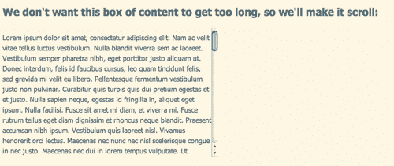
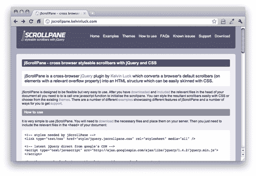
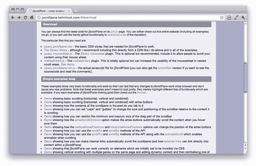
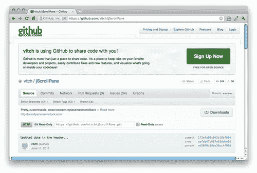
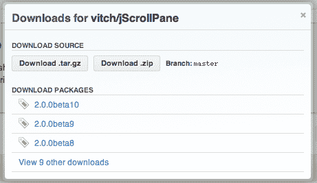
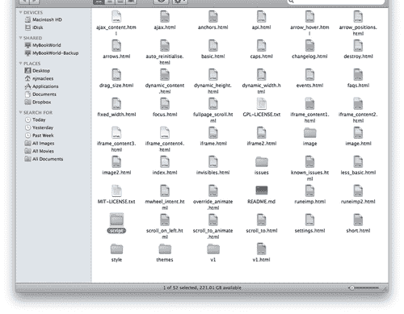
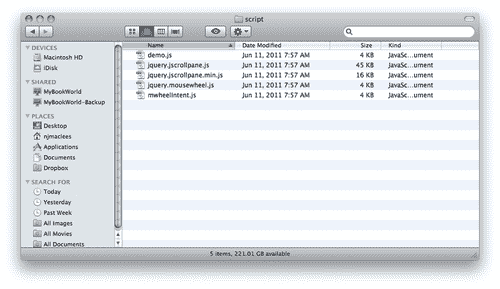
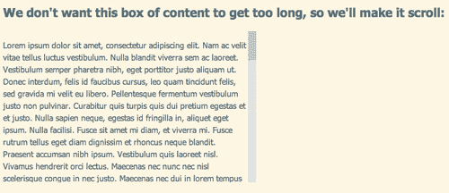
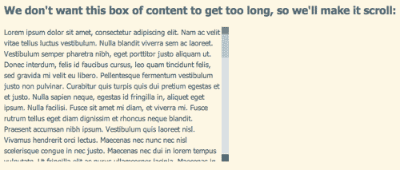
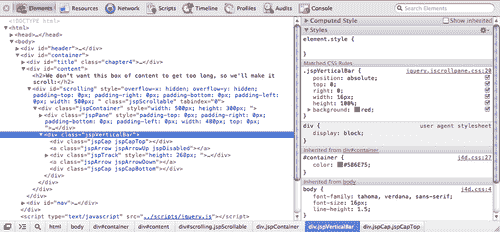

# 第四章：构建自定义滚动条

> 处理具有大量内容的页面的常见策略是隐藏一些内容，直到站点访问者希望或需要它。有许多方法可以做到这一点 —— 您可以使用选项卡、手风琴、灯箱，或者本章重点，可滚动区域。
> 
> 可滚动区域易于站点访问者理解和使用，但它们经常被忽视，因为一些操作系统有难看的滚动条，这会破坏您精心调整的设计美感。浏览器几乎没有提供用于自定义滚动条外观的选项，也从未在任何 HTML 或 CSS 规范中包含官方手段。
> 
> 一些设计师已经转向 Flash 来创建自定义滚动条，我相信你一定遇到过这些 Flash 滚动条的示例，往往它们笨拙且违反处理可滚动区域的常规惯例。例如，您很少能够使用鼠标的滚轮来滚动 Flash 可滚动区域。

在本章中，我们将学习： 

+   如何下载和使用 jQuery 插件，以便更多地使用 jQuery

+   如何使用插件的内置定制选项来定制插件的工作方式

+   如何使用 CSS 进一步定制插件

+   如何设置自定义设计的滚动条，使其与您的站点访问者的期望一样工作

+   如何使用 jScrollPane 插件在我们的可滚动区域之间平滑滚动到不同的内容部分

# 设计师，认识一下插件

我们已经谈过程序员如何一次又一次地解决相同的问题。正是这些常见的任务，jQuery 简化了我们能够用最少的代码完成这些任务。但是对于一些仅仅是有些常见的任务，比如想要漂亮的自定义滚动条，如何解决呢？

这就是 jQuery 社区变得重要的地方。jQuery 社区的开发人员能够编写代码，扩展 jQuery 的功能，简化一些常见的任务。这些代码片段称为**插件**，它们与 jQuery 库一起使用，使编写复杂的交互、小部件和效果就像使用 jQuery 已经内置的功能一样简单。

在官方 jQuery 网站上，您会找到数百个 jQuery 插件的库。除此之外，还有数千个来自 Web 上各个站点的插件，几乎可以完成您想要完成的任何任务。

要创建自定义滚动条，我们将使用*Kelvin Luck*的 jScrollPane 插件。您将学习如何在您的页面上安装插件以及如何配置 CSS 和选项，使您的滚动条看起来和工作方式符合您的要求。

## 选择插件

最近，jQuery 团队已经开始支持一小部分官方 jQuery 插件，你可以放心使用这些插件，因为它们具有与 jQuery 本身相同水平的专业知识、文档和支持。所有其他 jQuery 插件都是由 jQuery 社区的各个成员提供的，这些作者对其自己的插件负有文档和支持的责任。撰写和提供 jQuery 插件有点像自由竞争，遗憾的是，你会发现一大堆文档质量差、支持不够好，甚至更糟糕，编写得很差的 jQuery 插件。作为一个新手 jQuery 用户，选择插件时应该寻找哪些特征呢？

+   *插件的最新更新*。频繁的更新意味着插件得到了良好的支持，作者也在保持插件随着 jQuery 和浏览器的演变而更新。

+   *彻底易懂的文档*。在尝试下载和使用插件之前，请浏览插件的文档，并确保您了解如何实现插件以及如何使用插件提供给您的任何选项。

+   *浏览器支持*。优秀的插件一般具有与 jQuery 库本身相同的浏览器支持。

+   *工作演示*。大多数插件作者都会提供一个或多个插件的工作演示。尽可能在不同的浏览器中查看演示，以确保插件如广告所述的那样工作。

+   *评论和评分*。并非所有插件都有评论和评分，但如果你能找到一些，它们可以是插件质量和可靠性的有用指标。

# 设置一些可滚动的 HTML

让我们看看如何设置一个包含可滚动区域的简单 HTML 页面。一旦我们完成了这个，我们将看看如何用自定义的滚动条替换默认的滚动条。

# 行动时间 —— 可滚动 HTML

按照以下步骤设置一个包含可滚动区域的简单 HTML 页面：

1.  我们将从设置一个基本的 HTML 页面和相关的文件和文件夹开始，就像我们在 Chapter 1 中所做的那样，*设计师，遇见 jQuery*。我们需要有一个足够大的内容区域来滚动，所以我们将在 HTML 文档的正文部分添加几段文本：

    ```js
    <!DOCTYPE html>
    <html>
    <head>
    <title>Custom Scrollbars</title>
    <link rel="stylesheet" href="styles/styles.css"/>
    </head>
    <body>
    <h2>We don't want this box of content to get too long, so we'll make it scroll:</h2>
    <p>Lorem ipsum dolor sit amet...
    Include several paragraphs of lorem ipsum here
    ...mollis arcu tincidunt.</p>
    <script src="img/jquery.js"></script>
    <script src="img/scripts.js"></script>
    </body>
    </html>

    ```

    我没有包含所有内容，但我在我的页面上包含了五段长的 lorem ipsum 文本，以增加页面的长度，并为我们提供一些可滚动的内容。如果你不知道，lorem ipsum 只是一种虚拟的填充文本。你可以在[`lipsum.com`](http://lipsum.com)上生成一些随机的 lorem ipsum 文本来填充你的页面。

1.  现在，我们需要使我们的文本滚动。为了做到这一点，我要将所有那些 lorem ipsum 的段落包裹在一个`div`中，然后使用 CSS 在`div`上设置高度，将`overflow`设置为`auto`：

    ```js
    <h2>We don't want this box of content to get too long, so we'll make it scroll:</h2>
    <div id="scrolling">
    <p>Lorem ipsum dolor sit amet...
    Include several paragraphs of lorem ipsum here
    ...mollis arcu tincidunt.</p>
    </div>

    ```

1.  接下来，打开你的空的`styles.css`文件，添加下面的 CSS 来实现我们的文本区域可以滚动：

    ```js
    #scrolling {
    width:500px;
    height:300px;
    overflow:auto;
    }

    ```

    随意添加一些额外的 CSS 来自定义您的文本样式。

    现在，当我在浏览器中查看我的页面时，我会看到浏览器已经为我的文本添加了一些（丑陋的）滚动条：

    

# 添加自定义滚动条

在大多数情况下，滚动条的外观是由您的网站访问者所使用的操作系统决定的，而不是他们的浏览器。所以，无论您在 Mac 上使用 Firefox、Safari、Chrome 还是其他浏览器，您总是会看到那些标志性的闪亮蓝色滚动条。在 PC 上，无论您在 Windows 选项中设置了什么颜色方案，您总是会看到那些笨拙的方形滚动条。

# 实践时间—简单自定义滚动条

您会发现操作系统的默认滚动条在我们精美设计的页面中格外突兀。让我们来解决这个问题，好吗？

1.  首先，我们要找到要使用的插件来创建自定义滚动条。前往[`jscrollpane.kelvinluck.com/`](http://jscrollpane.kelvinluck.com/)，点击导航菜单中的**下载**链接：

    这将带您跳转到站点的**下载**部分，在那里您会看到 Kelvin Luck 正在使用 Github 来托管他的代码。Github 是一个社交编程中心—一种面向开发者的 Facebook—主要集中在撰写、分享和讨论代码。如今，使用 Github 来托管 jQuery 插件和其他开源代码项目变得越来越普遍，因为 Github 为开发者提供了一个简单的方式来与他人分享和合作他们的代码。

    别担心—从 Github 下载插件很简单。我会带你一步步完成。

1.  首先，在*Kelvin Luck*的网站上点击 Github 链接：

1.  这将带您进入 jScrollPane 项目在 Github 上的主页。在页面的右侧，您会看到一个**下载**按钮：

1.  点击**下载**按钮后，会弹出模态对话框，显示项目的所有可用下载包。简单明了，只需点击**下载 .zip**按钮即可获取最新版本：

1.  ZIP 下载将自动开始。一旦完成，在 Github 完成。我告诉过你，这很简单。现在，让我们解压这个包并看看里面有什么。

    哇！这么多文件！我们应该怎么处理这些文件？

    看上去有点吓人和混乱，但这些文件大部分都是关于如何使用插件的示例和文档。我们只需要找到组成插件的 JavaScript 文件。我们将在`script`文件夹中找到它们。

    

1.  在`script`文件夹内，我们将找到更多我们期望的内容。让我们弄清楚这些文件是什么。

    +   `demo.js`是示例代码。这是*凯尔文·拉克*用来组合压缩文件中各种演示的内容。如果我们卡住了，看看示例可能会有用，但我们不需要它来进行我们自己的项目。

    +   `jquery.jscrollpane.js`是 jScrollPane 插件的源代码。如果我们想要修改插件的工作方式或深入研究源代码，我们可以使用这个文件，但我们现在还不是专家级的程序员，所以我们可以暂时不管它。为什么文件名以`jquery.`开头？将`jquery.`添加到文件名前面以标记为 jQuery 插件是一种常见做法。在使用了十几个或更多 jQuery 插件以及其他 JavaScript 文件的大型项目中，这样可以更容易地找到 jQuery 插件。 

    +   `jquery.jscrollpane.min.js`是插件的压缩版本。它和`jquery.jscrollpane.js`是相同的代码，只是进行了压缩。这意味着所有额外的空格、制表符等都被移除，使文件更小——你可以看到效果相当不错。压缩后的文件只有 16 KB，而常规文件则为 45 KB。如果我们打开它，我们将无法轻松地阅读此文件，但这没关系。我们不需要能够阅读它，更重要的是我们要为我们的站点访问者提供尽可能小的文件。

    +   `jquery.mousewheel.js`是我们将用于自定义滚动条的另一个插件。它是一个让我们的鼠标滚轮在可滚动区域中正常工作的插件。

    +   `mwheelintent.js`是另一个插件。浏览 *凯尔文·拉克* 的文档，我们发现这个插件用于确保当我们将可滚动区域嵌套在彼此内时，它们的工作方式与我们期望的一样。但现在我们不需要它。

1.  复制`jquery.jscrollpane.min.js`和`jquery.mousewheel.js`并将它们放在你的`scripts`文件夹内，紧挨着`jquery.js`文件。

1.  接下来，我们需要像之前引入 jQuery 一样，在我们的页面中包含这两个文件。滚动到页面底部，在 jQuery 的`<script>`标签和你自己的`<script>`标签之间附加新文件：

    ```js
    <script src="img/jquery.js"></script>
    <script src="img/jquery.mousewheel.js"></script>
    <script src="img/jquery.jscrollpane.min.js"></script>
    <script src="img/scripts.js"></script>
    </body>
    </html>

    ```

    ### 小贴士

    每当你使用 jQuery 插件时，你要确保你的`<script>`标签的顺序是正确的。jQuery 的`<script>`标签应始终排在第一位，任何插件将紧随其后。最后是任何使用 jQuery 或插件的脚本。这是因为浏览器将按照我们指定的顺序加载这些脚本。插件文件需要在 jQuery 之后加载，因为它们正在使用 jQuery 库，并依赖于它在可用之前工作。在 JavaScript 中，我们称之为依赖关系。插件代码依赖于 jQuery。反过来，我们自己的代码依赖于插件代码和 jQuery 库本身，因此需要在这些可用后加载。

    在这种情况下，我们有一个额外的依赖项需要注意。jScrollPane 插件依赖于 MouseWheel 插件。因此，我们需要确保首先加载 MouseWheel 插件，然后加载 jScrollPane 插件。如果您遇到了 jQuery 或插件无法工作的问题，检查您的脚本顺序是个好主意 —— 缺少或顺序错误的依赖关系通常是原因。

    我们几乎准备好设置滚动条了，但还有一个文件我们需要包含。jScrollPane 插件实际上通过隐藏浏览器的原生滚动条并从普通的`<div>`和`<span>`构建替代品来工作。这意味着我们需要一些 CSS 来样式化那些`<div>`和`<span>`，使它们看起来像滚动条。稍后，我们将看看如何编写我们自己的 CSS 来使我们的滚动条看起来任何我们想要的样子，但现在，我们将使用 Kelvin Luck 提供的 CSS 来保持简单。

1.  回到我们从 Github 下载的文件中，找到`style`文件夹。在文件夹内，你会找到两个文件：`demo.css`和`jquery.jscrollpane.css`。就像脚本文件一样，`demo.css`是专门为示例编写的特殊代码，但`jquery.jscrollpane.css`是将为我们的滚动条设置样式的文件。将该文件复制到您自己的`styles`文件夹中，然后在文档的`<head>`部分，在您自己的`styles.css`文件之前附加新样式表：

    ```js
    <head>
    <title>Custom Scrollbars</title>
    <link rel="stylesheet" href="styles/jquery.jscrollpane.css"/>
    <link rel="stylesheet" href="styles/styles.css"/>	
    </head>

    ```

1.  哎呀！我们已经做了很多工作，但我们仍然需要将我们的自定义滚动条添加到我们的页面中。别担心，在真正的 jQuery 风格中，这只是几行代码。打开您的`scripts.js`文件，添加以下代码：

    ```js
    $(document).ready(function(){
    $('#scrolling').jScrollPane();
    });

    ```

    现在，如果您刷新页面，您将看到我们的可滚动区域现在有一个 jScrollPane 风格的滚动条。

    

## 刚刚发生了什么？

让我们分解最后一段代码，以理解发生了什么。

我们已经熟悉了这个：

```js
$(document).ready();

```

这是在文档上调用的 jQuery 对象的 ready 方法。这意味着我们将在文档准备就绪时运行我们的代码。像往常一样，我们通过向该方法传递一个函数来告诉 jQuery 在文档准备就绪时应该发生什么：

```js
$(document).ready(function(){
//our code will go here
});

```

所以我们要看的唯一真正新的东西就是我们写在函数内的代码行：

```js
$('#scrolling').jScrollPane();

```

但即使这一点我们也能理解至少一点。我们知道`$('#scrolling')`将选择页面上`id`为 scrolling 的项目。记住，我们在我们想要滚动的文本段落周围包裹了`<div id="scrolling"></div>`。然后我们使用了一些 CSS 来限制`#scrolling div`的高度并显示浏览器的滚动条。

然后我们可以看到我们正在调用 `jScrollPane()` 方法。大多数 jQuery 插件都是这样工作的 —— 通过添加一个你可以调用的新方法。你如何知道新方法的名称是什么？你通常会在插件的文档中找到它。jScrollPane 文档详尽，提供了大量的示例供你学习和修改。

# 添加箭头控件

好的，现在我们已经掌握了使用插件的基础知识，现在我们可以看看如何进一步使用它。

# 行动时间 —— 添加上下箭头

让我们给我们的滚动条添加上下按钮，这样我们的滚动条看起来和行为更像原生的滚动条。

1.  让我们回到我们的 `scripts.js` 文件中调用 `jScrollPane()` 方法创建自定义滚动条的那行代码：

    ```js
    $('#scrolling').jScrollPane();

    ```

    记得我们如何通过将它们放在括号里传递给方法和函数的吗？我们有以下例子：

    ```js
    dog.eat('bacon');

    ```

    我们想说狗在吃培根。所以，在 JavaScript 中，我们向狗的 eat 方法传递了培根。

    好吧，在这种情况下，我们可以向 `jScrollPane` 方法传递一组选项，以控制我们的滚动条的外观和行为。我们想在我们的滚动条上显示顶部和底部箭头，我们可以通过将 `showArrows` 选项设置为 true 来实现。我们只需要对我们的代码做一个简单的修改：

    ```js
    $('#scrolling').jScrollPane({showArrows:true});

    ```

1.  现在当你刷新页面时，你会看到顶部和底部的滚动条上有方框，就像顶部和底部箭头会出现的地方一样。

如果你点击这些框，你会发现它们的行为就像普通滚动条上的上下箭头一样。它们只是有点朴素 — 我们可以用一些 CSS 来为它们增加样式，让它们看起来任何我们想要的样子。

## 刚刚发生了什么？

我们将 `jScrollPane` 方法的 `showArrows` 选项设置为 `true`。这个插件提供了一长串高级选项，但幸运的是，我们不需要学习或了解它们全部才能充分利用它。

我们怎么知道有一个 `showArrows` 选项？我们会在插件的文档中找到它。一旦你更加了解 JavaScript 和 jQuery，你就能够阅读插件文件本身，查看插件为你提供的选项和方法。

要向方法传递一个选项，你需要用花括号括起来。然后你会输入你要设置的选项的名称（在本例中为`showArrows`)，然后是一个冒号，然后是你要设置选项的值（在本例中为`true`表示显示箭头）。就像我们之前所做的一样：

```js
$('#scrolling').jScrollPane({showArrows:true});

```

如果你想向一个方法传递多个选项，你需要做的一切都一样，只是在选项之间需要用逗号隔开。例如，如果我想在我的文本和滚动条之间添加一点间距，我可以通过为 `verticalGutter` 选项设置一个值来实现：

```js
$('#scrolling').jScrollPane({ showArrows:true,verticalGutter:20});

```

现在，您可以看到，如果我设置了十几个或更多选项，这行代码会变得又长又难读。因此，将选项分开放在单独的行上是常见的做法，如下所示：

```js
$('#scrolling').jScrollPane({
showArrows: true,
verticalGutter: 20
});

```

您可以看到内容和顺序是相同的，只是这个例子更容易被人读到和理解。计算机无论如何都不会在意。

### 提示

注意不要在最后一个选项/值对之后添加额外的逗号。大多数浏览器会优雅地处理这个错误，但是 Internet Explorer 会抛出错误，您的 JavaScript 将无法工作。

# 自定义滚动条样式

现在我们的滚动条上有了顶部和底部按钮，让我们将它们的外观调整得正好符合我们的要求。我们可以编写自己的 CSS 样式来设置滚动条的外观。

如果您花了一些时间来调试 CSS，那么您肯定已经知道您喜欢的浏览器中为您提供的调试工具。以防您还不知道，我强烈建议您看看 Firefox 的 Firebug 扩展，或者 Opera、Chrome、Safari 和 IE9 内置的开发工具。通过快速的谷歌搜索“您的浏览器 *开发者工具教程*”应该能够获得很多教程，让您学会如何充分利用这些工具所提供的便利。

如果您使用的是 IE 的旧版本，那么看看**Debug Bar**能帮助您调试 CSS 问题的 IE 扩展程序。这个扩展程序可以免费个人使用。

我在开发新页面时倾向于使用 Google Chrome。要访问 Chrome 中的开发者工具，请单击工具栏最右侧的扳手图标，然后选择**工具** | **开发者工具**。这是使用内置工具可以得到的 CSS 信息的一个例子：



在左侧，您可以看到我的文档的 DOM —— 构成文档树的所有 HTML 元素。我可以与之交互 —— 每个节点都可以被展开或折叠，以显示或隐藏嵌套在内的元素。在这种情况下，高亮显示的元素是我们 jScrollPane 滚动条的容器。

在右侧，我可以看到应用于左侧已选择元素的 CSS。我还可以看到特定 CSS 出现在哪个文件中，以及在哪一行。在这种情况下，大部分样式我的滚动条容器的 CSS 可以在`jquery.jscrollpane.css`文件的第 20 行找到。

通过这种方式深入 DOM 和 CSS 很快且容易地找出我们需要修改的 CSS 行，以满足我们所需的外观。

我们有几种选项来定制滚动条的 CSS。我们可以直接修改`jquery.jscrollpane.css`文件，也可以将这些样式复制到我们自己的样式表中进行更改。这是个人喜好的问题，但如果你选择直接修改`jquery.jscrollpane.css`文件，就像我在这里做的那样，那么我强烈建议你制作一个单独的副本以供参考，这样你就可以在不重新下载的情况下轻松地恢复它。

# 行动时间——添加我们自己的样式

1.  打开`jquery.jscrollpane.css`。大约在第 56 行附近，你会找到为`.jspTrack`样式化的 CSS。这是我们滚动条的轨道，也可以说是背景区域。它的默认样式是淡紫色。

    ```js
    .jspTrack
    {
    background: #dde;
    position: relative;
    }

    ```

    我们不想动位置，因为我们的滚动条依赖于它来正确工作，但你可以随意将背景颜色改为任何你喜欢的颜色、渐变或图片。我会选择淡粉色：

    ```js
    .jspTrack
    {
    background: #fbebf3;
    position: relative;
    }
    The next style I'd like to change is for .jspDrag. This is the actual scrollbar handle. I'm going to make it bright pink:
    .jspDrag
    {
    background: #D33682;
    position: relative;
    top: 0;
    left: 0;
    cursor: pointer;
    }

    ```

1.  接下来，我将处理顶部和底部按钮。我不仅有一个默认样式，还有一个禁用样式。例如，当滚动区域完全位于顶部时，顶部按钮被禁用，因为我不可能再向上滚动了。如果我用开发者工具检查按钮，我还可以看到按钮上有一个额外的类名，在默认 CSS 中没有样式化——顶部按钮有一个类名为`jspArrowUp`，底部按钮有一个类名为`jspArrowDown`。这将让我为上下按钮设置不同的样式——我将使用向上指向箭头的图片作为顶部箭头的背景，使用向下指向箭头作为底部按钮的背景，以便让我的网站访客清楚地了解它们的功能。

    这是我用来样式化它们的 CSS：

    ```js
    .jspArrow
    {
    text-indent: -20000px;
    display: block;
    cursor: pointer;
    }
    .jspArrow.jspDisabled
    {
    cursor: default;
    background-color: #999;
    }
    .jspArrowUp
    {
    background: #d6448b url(../images/arrows.png) 0 0 no-repeat;
    }
    .jspArrowDown
    {
    background: #d6448b url(../images/arrows.png) 0 -16px no-repeat;
    }

    ```

## 刚刚发生了什么？

现在刷新浏览器，你会看到滚动条被样式化成了粉色——就像我想要的那样。我们修改了插件开发者提供的 CSS，使滚动条的外观符合我们的要求。我们能够使用浏览器内置的开发者工具来定位需要更新的代码的文件和行号，以改变滚动条的外观。

## 试试吧，勇士——按照你想要的样式设计滚动条

现在，也许你不喜欢鲜艳的粉红色滚动条，你可能会觉得我的示例有点平淡，你是对的。但是你可以创造性地使用背景颜色、渐变、图片、圆角等来设计你喜欢的滚动条样式。你可以模仿你喜欢的操作系统的滚动条，让你的所有网站访客都能看到你喜欢的样式，或者你可以创建一个全新的样式。尝试使用 CSS 来创建自己的滚动条样式。

# 平滑滚动

jScrollPane 是一个成熟且功能齐全的插件。如果你浏览示例和文档，你会发现各种有趣的选项可供使用。我将带你设置其中一个我最喜欢的功能：可滚动区域内的动画滚动。

# 行动时间 —— 设置平滑滚动

你可以将任何类型的内容放在可滚动区域内——新闻故事列表、照片画廊，或者是一篇包含几个部分、标题和副标题的长文章。下面是如何设置控件以平滑滚动到另一节的方法：

1.  我们需要做的第一件事是为我们的每个段落分配一个 ID。我在可滚动区域中有五个 lorem ipsum 段落，所以我将它们分配为`para1, para2, para3, para4`和`para5`的`ids`。你可以选择任何你喜欢的`ids`，但请记住，`id`不能以数字开头。所以现在我的代码看起来像这样（我已经截断了文本以节省空间）：

    ```js
    <div id="scrolling">
    <p id="para1">Lorem ipsum...</p>
    <p id="para2">...</p>
    <p id="para3">...</p>
    <p id="para4">...</p>
    <p id="para5">...</p>
    </div>

    ```

1.  现在，让我们在可滚动区域上方添加一些内部链接，以跳转到每个段落。在标题之后和可滚动区域之前，添加以下代码：

    ```js
    <h2>We don't want this box of content to get too long, so we'll make it scroll:</h2>
    <p>Scroll to a paragraph:
    <a href="#para1">1</a>,
    <a href="#para2">2</a>,
    <a href="#para3">3</a>,
    <a href="#para4">4</a>,
    <a href="#para5">5</a>
    </p>
    <div id="scrolling">

    ```

1.  如果我们禁用了 JavaScript，这些链接也可以工作；它们会将可滚动区域滚动到相关的段落，使其对我们的网站访客可见。但我们希望它们与我们的花哨自定义滚动条一起工作。因此，我们只需向 jScrollPane 方法传递一个新选项：

    ```js
    $(document).ready(function(){
    $('#scrolling').jScrollPane({
    showArrows: true,
    verticalGutter: 30,
    hijackInternalLinks: true
    });
    });

    ```

    这个新选项是为了阻止浏览器在点击内部链接时尝试其默认行为。刷新页面，然后尝试点击段落的链接。

1.  它可以运行，但并不完美，当可滚动区域突然跳动时可能会让人感到不安——我们的网站访客可能不会完全意识到发生了什么。让我们通过平滑地动画化跳转到不同的段落来明显地展现出来。我们只需在代码中添加另一个选项：

    ```js
    $(document).ready(function(){
    $('#scrolling').jScrollPane({
    showArrows: true,
    verticalGutter: 30,
    hijackInternalLinks: true,
    animateScroll: true
    });
    });

    ```

    现在，当你刷新页面并点击段落链接时，你会发现可滚动区域平滑滚动到正确的段落。很容易理解发生了什么，你在页面上和可滚动区域中的位置。

## 刚刚发生了什么？

我们利用了 jScrollPane 插件的一个功能，并使得在可滚动容器内平滑滚动到任何内容成为可能。我们可以使用的选项和值都在插件的文档和示例中有所说明。由于插件作者在使艰难的事情变得容易方面的努力工作，你可以看到我们有多么容易地定制了这个插件来添加这种良好的行为。

# 总结

哦，这一章真是够繁重的。我们学到了关于 jQuery 插件的知识，如何使用它们，以及如何使用它们提供的选项来定制它们。我们了解了依赖关系，并按正确的顺序将多个脚本插入到我们的文件中。我们使用了 Kelvin Luck 的出色 jScrollPane 插件，将我们无聊的操作系统滚动条替换为我们自己设计的花哨的自定义滚动条。而且，好处是，它们的工作方式与浏览器的滚动条完全相同，我们的网站访问者可以点击轨道，点击上下按钮，他们可以拖动手柄，或者使用鼠标滚轮在我们设置的可滚动区域上下导航。这既提升了美观性又提高了可用性。

最后，我们学会了如何在可滚动区域内平稳滚动至锚点，这样我们的网站访问者就可以轻松地进入可滚动区域内的各个内容片段，并清楚地传达了正在发生的事情。

接下来，我们将看看如何用我们自己设计的漂亮工具提示覆盖浏览器的默认工具提示，并学习如何通过添加额外内容使它们更加有效。
