# 第五章：制作自定义工具提示

> 现在我们已经看到插件有多强大以及它们如何轻松地实现高级功能，让我们看看如何利用另一个插件来制作自定义工具提示。
> 
> 当您包含`title`属性时，浏览器会自动创建工具提示 —— 通常在链接或图像上。当您的网站访客将鼠标悬停在该项上或通过按 Tab 键将焦点移到该项上时，工具提示将显示 —— 通常为一个看起来悬浮在页面上的小黄色框。工具提示是向页面添加一些附加信息的好方法。屏幕阅读器软件会为使用辅助技术的残障网站访客朗读出工具提示文本，从而增强可访问性。此外，图像和链接上的`title`属性可以帮助搜索引擎更有效地索引您的内容。

在本章中，我们将学习:

+   如何使用克雷格·汤普森的 qTip 插件来替换浏览器的默认工具提示

+   如何自定义 qTip 工具提示的外观

+   如何通过自定义工具提示增强导航栏

+   如何在自定义工具提示中显示 Ajax 内容

# 简单的自定义文本工具提示

希望我已经说服了你，`title` 属性对于增强网站的可用性和可访问性都很棒。工具提示的唯一问题是它们无法以任何方式定制。每个浏览器都有自己的工具提示样式，并且这种样式不能通过 CSS 定制。有时这没关系，但有时控制工具提示的外观会更好。

# 行动时间 — 简单文本工具提示

我们将通过制作一个简单的替代浏览器默认工具提示的工具提示来开始工作，我们可以自定义样式:

1.  设置一个基本的 HTML 文件以及像我们在第一章中所做的那样的相关文件和文件夹，*设计师，见 jQuery*。我们的 HTML 文件应包含一组链接，每个链接都有一个像这样的`title`属性:

    ```js
    <p>Here's a list of links:</p>
    <ul>
    <li><a href="home.html" title="An introduction to who we are and what we do">Home</a></li>
    <li><a href ="about.html" title="Learn more about our company">About</a></li>
    <li><a href="contact.html" title="Send us a message. We'd love to hear from you!">Contact</a></li>
    <li><a href="work.html" title="View a portfolio of the work we've done for our clients">Our Work</a></li>
    </ul>

    ```

1.  在浏览器中打开该页面，并将鼠标移动到链接上。您将看到`title`属性中包含的文本显示为工具提示。工具提示出现的位置和外观取决于您的浏览器，但以下是我的浏览器（Mac OS 上的 Google Chrome）中的外观: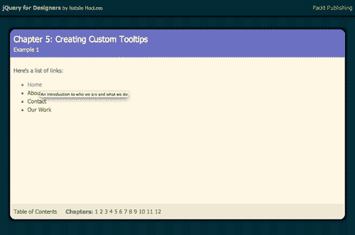

1.  现在，让我们将其美化一下，用我们自己的样式替换默认的浏览器工具提示。首先，我们需要下载克雷格·汤普森的 qTip 插件。可以从[`craigsworks.com/projects/qtip2`](http://craigsworks.com/projects/qtip2)获取。他的网站上列出了一些功能、几个示例演示、您需要学习使用插件的文档、一个可以获取帮助的论坛，并且所需的文件可供下载。转到下载页面，您将看到一个选项清单，帮助您下载正确的版本。

    让我们逐个部分地浏览此页面:

    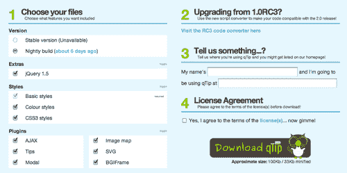

1.  **第 1 步**为我们提供了多种下载脚本的选项。在标题为**版本**的部分，我将选择**稳定**版本，这样我就可以得到经过彻底测试的最新版本的脚本。那些想要在开发者开发插件时尝试和测试插件的人可以选择夜间版本。

1.  在**额外**部分，我将取消**jQuery 1.5**的选择，因为我已经下载了 jQuery 并将其附加到我的项目中。如果您正在启动一个新项目，并且还没有下载 jQuery，您可以将其选中以与插件同时下载 jQuery。

1.  在**样式**部分，我将保留所有三组样式选中，因为我希望尽可能多地选择样式来设置我的工具提示。同样，在**插件**部分，我将保留所有选项选中，因为我将会使用各种不同类型的工具提示，并利用这些不同的功能。如果你只想创建简单的基于文本的工具提示，你可以取消所有这些额外的选项，这样可以得到一个更小的下载文件。这些额外的功能只在你要利用额外功能时才需要。这个插件的一个很好的功能是，我们可以挑选我们想要的功能，以尽可能保持我们的 JavaScript 文件尽可能小。

1.  **第 2 步**为那些正在更新他们的代码，可能之前使用了插件的早期版本的任何人提供了一个自动转换器。由于我们是 qTip 插件的新手，所以我们可以忽略这一步。

1.  **第 3 步**为我们提供了一个机会，告诉插件开发者我们的网站使用了插件，并有机会被列入插件主页的画廊中。由于在本章节中我们只是做了一些练习，所以我们现在不会使用这个，但这可能是你以后在自己的项目中考虑的事情。

1.  **第 4 步**要求我们接受许可证的条款。该插件根据开源 MIT 和 GPLv2 许可证授权，这使得我们可以自由使用、修改甚至重新分发代码，只要在文件中包含许可证或链接到许可证。当您下载这些文件时，许可证已经包含在插件文件中了，所以只要您不编辑这些文件以删除许可证，您就不会有问题。

1.  最后，我们可以点击**下载 qTip**按钮，您的浏览器将为您下载一个 ZIP 文件。解压它并检查其内容。在内部，我们会找到两个 CSS 文件和两个 JavaScript 文件。（如果您选择同时下载 jQuery 和插件脚本，可能会有一个额外的 JavaScript 文件）。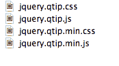

1.  让我们从两个 CSS 文件开始。我们有`jquery.qtip.css`和`jquery.qtip.min.css`。这两个文件的内容完全相同。它们之间的区别在于第二个文件被缩小了，使其更小且更适合在生产中使用。另一个文件是开发版本，如果我们想要为我们的工具提示编写自己的样式而不是使用预构建的样式，我们可以轻松地编辑它或将其用作示例。您将选择其中一个文件并将其附加到您的页面上。在本示例中，为了使文件尽可能小，我将使用文件的经过缩小的版本，因为此时我不想编写自己的样式。将`jquery.qtip.min.css`复制到您自己的`styles`文件夹中，然后将文件附加到 HTML 文档的`<head>`部分：

    ```js
    <head>
    <title>Chapter 5: Creating Custom Tooltips</title>
    <link rel="stylesheet" href="styles/jquery.qtip.min.css"/>
    <link rel="stylesheet" href="styles/styles.css"/>
    </head>

    ```

    我将 qTip 样式表附加到自己的`styles.css`之前，这样如果需要，我就可以更轻松地覆盖 qTip 样式表中的样式。

1.  接下来，让我们看看 JavaScript 文件。我们有`jquery.qtip.js`和`jquery.qtip.min.js`。就像 CSS 文件一样，这是同一个文件的两个不同版本，我们只需选择一个并将其附加到我们的 HTML 文档即可。第一个文件`jquery.qtip.js`是文件的开发版本，大小为 94K，而第二个文件是经过缩小的，只有 41K。由于我们不需要编辑插件，而是要直接使用它，让我们选择经过缩小的版本。将`jquery.qtip.min.js`复制到您自己的`scripts`文件夹中，并将其附加到 HTML 文件底部，在 jQuery 和我们自己的`scripts.js`文件之间：

    ```js
    <script src="img/jquery.js"></script>
    <script src="img/jquery.qtip.min.js"></script>
    <script src="img/scripts.js"></script>
    </body>
    </html>

    ```

1.  我们需要做的最后一件事是调用插件代码。打开您的`scripts.js`文件并添加文档准备好的语句和函数：

    ```js
    $(document).ready(function(){
    });

    ```

1.  在函数内部，选择文档中所有具有`title`属性的链接，并在这些链接上调用`qtip()`方法：

    ```js
    $(document).ready(function(){
    $('a[title]').qtip();
    });

    ```

1.  现在，当您在浏览器中查看页面并将鼠标移动到具有`title`属性的链接上时，您将看到 qTip 样式的工具提示，而不是浏览器的默认工具提示：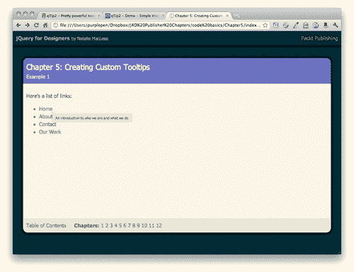

+   更好的是，无论我们使用哪个浏览器和操作系统，这些工具提示都会以相同的样式显示。

## 刚才发生了什么？

我们下载了 qTip 插件并将一个 CSS 文件和一个 JavaScript 文件附加到我们的 HTML 文档中。然后我们只添加了几行 jQuery 代码来激活自定义工具提示。

我们选择了页面上所有具有`title`属性的链接元素。我们利用了 jQuery 的属性选择器来实现这一点：

```js
$('a[title]')

```

在我们的元素选择器后面加上`title`括号意味着我们只想要页面上具有`title`属性的链接。

一旦我们选择了这些链接，剩下的就是调用 qTip 插件为我们提供的`qtip()`方法了。`qtip()`方法会处理所有需要做的动作，以替换默认的工具提示为自定义的工具提示。但是如果我们想使用 qTip 配备的其他样式呢？

# 自定义 qTip 的外观

毫无疑问，当鼠标悬停在链接上时，qTip 的左上角与链接的右下角对齐，工具提示显示为黄色方框并且侧边有一个小箭头。qTip 插件提供了很多选项来定制工具提示的位置和外观，而且使用起来直观而易懂。

# 实战任务 — 自定义 qTips

让我们来看一下我们对自定义 qTip 工具提示外观的选项：

1.  假设我们想改变工具提示的位置。qTip 为我们在页面上定位工具提示提供了很多选项。

1.  我们可以把工具提示的任何一个点与链接的任何一个点匹配起来：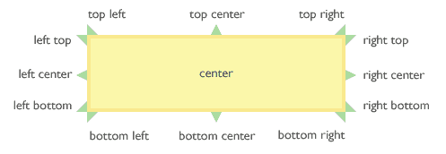

1.  在这个例子中，我们将把链接右侧的中间和工具提示左侧的中间匹配起来，这样工具提示就会直接出现在链接的右侧。我们只需要向`qTip()`方法传递一些额外的信息。我们将继续使用上一个例子中设置的文件。打开你的`scripts.js`文件，并将这些额外的信息传递给`qtip()`方法：

    ```js
    $('a[title]').qtip({
    position: {
    my: 'center left',
    at: 'center right'
    }
    });

    ```

    开发人员的目标是使之用通俗的语言来解释。从工具提示的角度来说，我们将把我的中心左侧与链接的中心右侧对齐。当我们在浏览器中刷新页面时，你会看到工具提示现在直接出现在链接的右侧。

    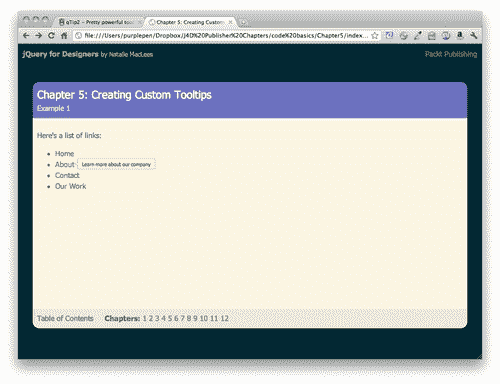

1.  除了改变工具提示的位置，我们还可以改变工具提示本身的外观。插件中包含的 CSS 包括几种颜色方案和样式。通过向我们的工具提示添加 CSS 类，可以应用不同的颜色和样式。让我们看看如何添加这些 CSS 类。

    ```js
    $('a[title]').qtip({
    position: {
    my: 'center left',
    at: 'center right'
    },
    style: {
    classes: 'ui-tooltip-blue'
    }
    });

    ```

    现在当我们在浏览器中查看工具提示时，我们发现它是蓝色的:

    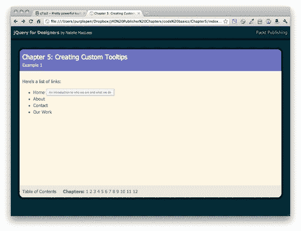

1.  qTip 提供的颜色方案包括:

    +   `ui-tooltip`（默认的黄色方案）

    +   `ui-tooltip-light`（在白色工具提示上的黑色文字）

    +   `ui-tooltip-dark`（在深灰色工具提示上的白色文字）

    +   `ui-tooltip-red`

    +   `ui-tooltip-green`

    +   `ui-tooltip-blue`

        你可以将这些类中的任意一个添加到你的工具提示中，以调整颜色方案。

1.  对于支持 CSS3 的浏览器，qTip 还提供了一些更花哨的样式。这些样式在不支持 CSS3 规范的浏览器中看不到，但在大多数情况下，这应该没问题。这些样式可以被视为对能够显示它们的浏览器的渐进增强。使用较低版本浏览器的网站访问者仍然可以看到和阅读提示，没有任何问题。他们只是看不到应用了更花哨的样式。可用的样式如下所示：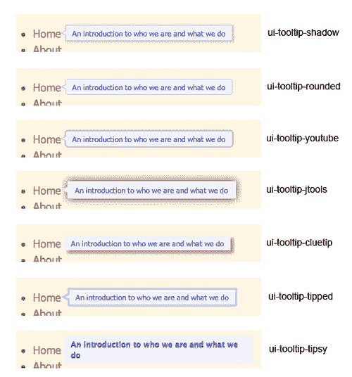

1.  与配色方案一样，我们可以通过向提示添加 CSS 类来利用这些样式。可以像这样向提示添加多个 CSS 类：

    ```js
    $('a[title]').qtip({
    position: {
    my: 'center left',
    at: 'center right'
    },
    style: {
    classes: 'ui-tooltip-blue ui-tooltip-shadow'
    }
    });

    ```

    此代码创建了一个蓝色带阴影的提示。

## 刚才发生了什么？

我们看到了如何将位置和样式值传递给 qTip 方法以自定义我们的提示外观。我们了解了 qTip 插件包含的颜色方案和样式，并学会了如何在我们自己的页面中使用这些样式来自定义 qTip 提示。

# 提示的自定义样式

如果没有任何可用选项完全适合我们的站点，我们还可以编写自己的颜色方案和样式。

# 操作时间 — 编写自定义提示样式

让我们看看如何编写我们自己的 qTip 提示的自定义样式，编写一个新的紫色配色方案：

1.  我们将开始检查编码了红色提示样式的 CSS，这是 qTip 自带的。你会在随 qTip 下载的 `jquery.qtip.css` 文件中找到这段 CSS。以下是影响红色提示的所有 CSS 样式：

    ```js
    /*! Red tooltip style */
    .ui-tooltip-red .ui-tooltip-titlebar,
    .ui-tooltip-red .ui-tooltip-content{
    border-color: #D95252;
    color: #912323;
    }
    .ui-tooltip-red .ui-tooltip-content{
    background-color: #F78B83;
    }
    .ui-tooltip-red .ui-tooltip-titlebar{
    background-color: #F06D65;
    }
    .ui-tooltip-red .ui-state-default .ui-tooltip-icon{
    background-position: -102px 0;
    }
    .ui-tooltip-red .ui-tooltip-icon{
    border-color: #D95252;
    }
    .ui-tooltip-red .ui-tooltip-titlebar .ui-state-hover{
    border-color: #D95252;
    }

    ```

1.  通过检查这段 CSS，我们可以看到要创建新的颜色方案，我们只需要创建一个新的类名和四种紫色色调来创建新的样式。这是我的紫色配色方案的 CSS。打开你的 `styles.css` 文件并添加这些样式：

    ```js
    /*! Purple tooltip style */
    .ui-tooltip-purple .ui-tooltip-titlebar,
    .ui-tooltip-purple .ui-tooltip-content{
    border-color: #c1c3e6;
    color: #545aba;
    }
    .ui-tooltip-purple .ui-tooltip-content{
    background-color: #f1f2fa;
    }
    .ui-tooltip-purple .ui-tooltip-titlebar{
    background-color: #d9daf0;
    }
    .ui-tooltip-purple .ui-state-default .ui-tooltip-icon{
    background-position: -102px 0;
    }
    .ui-tooltip-purple .ui-tooltip-icon{
    border-color: #c1c3e6;
    }
    .ui-tooltip-purple .ui-tooltip-titlebar .ui-state-hover{
    border-color: #c1c3e6;
    }

    ```

1.  现在，要利用我们的新紫色提示样式，我们只需调整我们的 jQuery 代码，将新创建的 `ui-tooltip-purple` 类添加到我们的提示中。打开 `scripts.js` 文件并调整添加到提示中的类：

    ```js
    $('a[title]').qtip({
    position: {
    my: 'center left',
    at: 'center right'
    },
    style: {
    classes: 'ui-tooltip-purple'
    }
    });

    ```

    现在，在浏览器中预览链接时，你将看到一个紫色的提示，如下截图所示：

    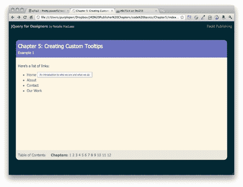

## 刚才发生了什么？

使用 qTip 提供的一个 CSS 类，我们编写了自己的自定义样式并将其应用到了我们的提示中。你可以使用任何 CSS 样式来为 qTip 提示创建自定义外观。当你开始混合颜色和字体选择、背景图片、边框样式等时，几乎没有限制样式的可能性。

## 动手试试 — 创建自己设计的提示

尝试编写自己的 CSS 类来为提示样式。尝试新的配色方案、新的字体样式和大小、文字阴影、盒阴影 — 任何你能想到的，以使提示与网站设计相匹配或真正突出。

# 使用工具提示增强导航

一旦你知道如何制作自定义工具提示，你会发现它们有很多可能的用途。让我们看看如何使用 qTip 插件增强标准导航栏的自定义工具提示。

# 行动时间 —— 建立一个花哨的导航栏

让我们看看如何使用定制设计的工具提示为基本导航栏添加一些逐步增强的效果：

1.  让我们从设置一个带有关联文件夹和文件的基本 HTML 页面开始，就像我们在第一章中所做的一样，*Designer, Meet jQuery*。在文档的主体中，包含一个简单的导航栏，就像这样：

    ```js
    <ul id="navigation"> <li><a href="home.html" title="An introduction to who we are and what we do">Home</a></li>
    <li><a href ="about.html" title="Learn more about our company">About</a></li>
    <li><a href="contact.html" title="Send us a message. We'd love to hear from you!">Contact</a></li>
    <li><a href="work.html" title="View a portfolio of the work we've done for our clients">Our Work</a></li>
    </ul>

    ```

1.  接下来，我们将为我们的导航栏添加一些 CSS 样式。这里有很多 CSS，因为我正在使用渐变作为背景，而且目前不同的浏览器需要很多不同的 CSS。将这些 CSS 行添加到你的`styles.css`文件中。如果你喜欢不同的风格，请随意自定义 CSS 以适应你自己的口味：

    ```js
    #navigation {
    background: rgb(132,136,206); /* Old browsers */
    background: -moz-linear-gradient(top, rgba(132,136,206,1) 0%, rgba(72,79,181,1) 50%, rgba(132,136,206,1) 100%); /* FF3.6+ */
    background: -webkit-gradient(linear, left top, left bottom, color-stop(0%,rgba(132,136,206,1)), color-stop(50%,rgba(72,79,181,1)), color-stop(100%,rgba(132,136,206,1))); /* Chrome,Safari4+ */
    background: -webkit-linear-gradient(top, rgba(132,136,206,1) 0%,rgba(72,79,181,1) 50%,rgba(132,136,206,1) 100%); /* Chrome10+,Safari5.1+ */
    background: -o-linear-gradient(top, rgba(132,136,206,1) 0%,rgba(72,79,181,1) 50%,rgba(132,136,206,1) 100%); /* Opera11.10+ */
    background: -ms-linear-gradient(top, rgba(132,136,206,1) 0%,rgba(72,79,181,1) 50%,rgba(132,136,206,1) 100%); /* IE10+ */
    filter: progid:DXImageTransform.Microsoft.gradient( startColorstr='#8488ce', endColorstr='#8488ce',GradientType=0 ); /* IE6-9 */
    background: linear-gradient(top, rgba(132,136,206,1) 0%,rgba(72,79,181,1) 50%,rgba(132,136,206,1) 100%); /* W3C */
    list-style-type: none;
    margin: 100px 20px 20px 20px;
    padding: 0;
    overflow: hidden;
    -webkit-border-radius: 5px;
    -moz-border-radius: 5px;
    border-radius: 5px;
    }
    #navigation li {
    margin: 0;
    padding: 0;
    display: block;
    float: left;
    border-right: 1px solid #4449a8;
    }
    #navigation a {
    color: #fff;
    border-right: 1px solid #8488ce;
    display: block;
    padding: 10px;
    }
    #navigation a:hover {
    background: #859900;
    border-right-color: #a3bb00;
    }

    ```

1.  现在我们的页面上有了一个水平的导航栏，就像这样：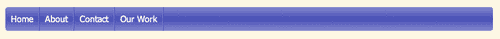

1.  我在我的链接上包含了`title`属性，当我将鼠标移动到导航链接上时，它们是可见的。我想用友好的对话框替换这些无聊的浏览器默认工具提示，在我的导航下方。

1.  就像我们在上一个例子中所做的那样，我们要复制 qTip 的 CSS 和 JavaScript 到我们自己的 styles 和 scripts 文件夹中，并将它们附加到 HTML 文档中：

    ```js
    <!DOCTYPE html>
    <html>
    <head>
    <title>Chapter 5: Creating Custom Tooltips</title>
    <link rel="stylesheet" href="styles/jquery.qtip.min.css"/>
    <script src="img/jquery.js"></script>
    <script src="img/jquery.qtip.min.js"></script>
    <script src="img/scripts.js"></script>
    </body>
    </html>

    ```

1.  接下来，打开你的`scripts.js`文件，这样我们就可以调用`qtip()`方法并传递我们的自定义内容。我们将几乎像上次那样开始，只是我们将使用不同的选择器，因为我们只想选择导航栏内的链接：

    ```js
    $(document).ready(function(){
    $('#navigation a').qtip();
    });

    ```

    现在默认的工具提示已经被 qTip 样式的工具提示替换了。

1.  接下来，我们将为导航工具提示创建我们自己的样式，所以我们将编写一些新的 CSS 使它们看起来像对话框。将这些样式添加到你的`styles.css`文件中：

    ```js
    .ui-tooltip-conversation .ui-tooltip-titlebar,
    .ui-tooltip-conversation .ui-tooltip-content{
    border: 3px solid #555;
    filter: none; -ms-filter: none;
    }
    .ui-tooltip-conversation .ui-tooltip-titlebar{
    background: #859900;
    color: white;
    font-weight: normal;
    font-family: serif;
    border-bottom-width: 0;
    }
    .ui-tooltip-conversation .ui-tooltip-content{
    background-color: #F9F9F9;
    color: #859900;
    -moz-border-radius: 9px;
    -webkit-border-radius: 9px;
    border-radius: 9px;
    padding: 10px;
    }
    .ui-tooltip-conversation .ui-tooltip-icon{
    border: 2px solid #555;
    background: #859900;
    }
    .ui-tooltip-conversation .ui-tooltip-icon .ui-icon{
    background-color: #859900;
    color: #555;
    }

    ```

1.  现在我们已经准备好了新的工具提示 CSS 样式，我们只需将这个新类添加到工具提示中即可。回到`scripts.js`，并将新类添加到 JavaScript 中：

    ```js
    $('#navigation a').qtip({
    style: {
    classes: 'ui-tooltip-conversation'
    }
    });

    ```

1.  接下来，让我们将对话框定位到每个导航链接的下方。在`scripts.js`中，将位置信息传递给`qtip()`方法：

    ```js
    $('#navigation a').qtip({
    position: {
    my: 'top center',
    at: 'bottom center'
    },
    style: {
    classes: 'ui-tooltip-conversation',
    width: '150px'
    }
    });

    ```

1.  现在，我们需要控制工具提示的宽度，使其不要显得太宽。我们将宽度设置为 150px：

    ```js
    $('#navigation a').qtip({
    position: {
    my: 'top center',
    at: 'bottom center'
    },
    style: {
    classes: 'ui-tooltip-conversation',
    width: '150px'
    }
    });

    ```

1.  现在我们要做的最后一件事是改变工具提示从页面上出现和消失的方式。默认情况下，qTip 插件使用非常快速和微妙的淡入淡出效果。让我们改变一下，让工具提示滑入视图并滑出视图：

    ```js
    $('#navigation a').qtip({
    position: {
    my: 'top center',
    at: 'bottom center'
    },
     show: {
    effect: function(offset) {
    $(this).slideDown(300);
    }
    },
    hide: {
    effect: function(offset) {
    $(this).slideUp(100);
    }
    },
    style: {
    classes: 'ui-tooltip-conversation',

    width: '150px'
    }
    });

    ```

1.  现在当您在浏览器中查看页面时，您可以看到对话气泡在您将鼠标悬停在链接上时从下方滑入视图，并在您将鼠标移出链接时滑出视图。

## 刚刚发生了什么？

我们回顾了如何创建和附加自定义 CSS 样式到 qTip 的工具提示，以及如何定位工具提示在任何你想要的位置。我们还学会了如何控制工具提示的宽度，以确保我们得到统一的大小。

然后我们看到了如何覆盖默认的显示和隐藏行为，并用自定义动画替换它们。在这种情况下，我们使用了 jQuery 的 `slideDown()` 效果来显示工具提示。我们向 `slideDown()` 方法传递了一个值为 300，这意味着动画将花费 300 毫秒完成，或者大约三分之一秒。我发现如果动画持续时间超过这个时间，网站访客会因等待而感到不耐烦。

接下来，我们使用 jQuery 的 `slideUp()` 方法覆盖了默认的隐藏行为。我传递了一个值为 100，意味着动画将在大约十分之一秒内完成。当此动画运行时，网站访客已经决定继续前进，因此最好尽快将信息移出他们的视线。

# 在工具提示中显示其他内容

到目前为止，我们已经看到了如何自定义 qTip 工具提示的外观，控制它们的外观、动画和位置。然而，我们只是用工具提示来显示文本，即我们放置在链接的 `title` 属性中的文本。然而，我们有更强大的选项。我们可以加载几乎任何内容到我们的工具提示中。我们还可以确保当项目被点击而不是悬停在上面时出现工具提示。让我们看看当我们点击链接时如何将内容从另一个 HTML 页面加载到我们的工具提示中。

在本节中，我们将首次深入使用 Ajax。如果您不熟悉，**Ajax** 是一种从服务器获取一些新内容并将其显示给网站访问者的方法，而无需完全刷新页面。因为浏览器只是获取并显示网站访问者所需的那一部分信息，所以它通常会更快速、更敏捷。

在我们第一次深入 Ajax 之前，先简单说明一下。现代浏览器有很多对 Ajax 请求的安全规定。你不会像之前那样简单地在浏览器中查看你的 ajaxified HTML 文件。为了观看 Ajax 的操作，你要么必须将你的文件上传到服务器上，然后再查看它们，要么你必须在自己的电脑上搭建一个服务器。如果你是 Mac 用户，我强烈推荐使用**MAMP**，它有免费和高级付费版本。你可以从[`www.mamp.info`](http://www.mamp.info)获取更多信息并下载 MAMP。如果你使用 Windows，我强烈推荐使用**WampServer**，它是免费的。你可以从[`www.wampserver.com.`](http://www.wampserver.com.)获取更多信息并下载 WampServer。

# 行动时间 - 创建自定义 Ajax 工具提示

按照以下步骤设置一些显示 Ajax 内容的工具提示：

1.  我们将从创建一个 HTML 文档和相关文件夹和文件开始，就像我们在第一章 *设计师，遇见 jQuery*中所做的那样。我们的 HTML 页面应该包含一些段落文字，其中有一些链接指向更多信息。我的第一个 HTML 文档看起来如下：

    ```js
    <!DOCTYPE html>
    <html>
    <head>
    <title>Pittsburgh, Pennsylvania</title>
    <link rel="stylesheet" href="styles/styles.css"/>
    </head>
    <body>
    <h2>Pittsburgh, Pennsylvania</h2>
    <p>Pittsburgh is the second-largest city in the US Commonwealth of Pennsylvania and the county seat of Allegheny County. Regionally, it anchors the largest urban area of Appalachia and the Ohio River Valley, and nationally, it is the 22nd-largest urban area in the United States. The population of the city in 2010 was 305,704 while that of the seven-county metropolitan area stood at 2,356,285\. <a href="http://infoboxes/downtown.html">Downtown Pittsburgh</a> retains substantial economic influence, ranking at 25th in the nation for jobs within the urban core and 6th in job density.</p>
    <p>The characteristic shape of Pittsburgh's central business district is a triangular tract carved by the confluence of the Allegheny and Monongahela rivers, which form the Ohio River. The city features 151 high-rise buildings, 446 bridges, two inclined railways, and a pre-revolutionary fortification. Pittsburgh is known colloquially as "The City of Bridges" and "The Steel City" for its <a href="http://infoboxes/bridges.html">many bridges</a> and former steel manufacturing base.</p>
    <p>The warmest month of the year in Pittsburgh is July, with a 24-hour average of 72.6&deg;F. Conditions are often humid, and combined with the 90&deg;F (occurring on an average of 8.4 days per annum), a considerable <a href="http://infoboxes/heatindex.html">heat index</a> arises.</p>
    <script src="img/jquery.js"></script>
    <script src="img/scripts.js"></script>
    </body>
    </html>

    ```

1.  我们需要一种轻松的方法来选择这三个更多信息链接，所以我们会像这样给每一个添加一个 CSS 类：

    ```js
    <a href ="http://infoboxes/downtown.html" class="infobox">Downtown Pittsburgh</a>

    ```

1.  接下来，我们需要创建一组简短的页面，每个页面中都包含一个链接和前文中链接的标题。以下是我其中一个简短 HTML 页面的示例：

    ```js
    <!DOCTYPE html>
    <html>
    <head>
    <title>Downtown Pittsburgh</title>
    </head>
    <body>
    
    <p>Downtown Pittsburgh</p>
    </body>
    </html>

    ```

    如你所见，文件非常小而简单。

1.  在主页旁边创建一个`infoboxes`目录。将你的简单 HTML 文件保存到这个目录中，并为主文档中的每个链接创建更多的简单文件。

1.  现在，如果你在浏览器中打开主页并点击文本中的链接，你会发现这些简短而普通的页面加载到了浏览器中。我们已经掌握了基本功能，接下来我们将逐步增强页面功能，以满足那些启用了 JavaScript 的用户。

1.  我们将使用在本章前面设置的紫色配色方案来为我们的工具提示添加 CSS，所以让我们把`ui-tooltip-purple`类的 CSS 添加到`styles.css`文件中：

    ```js
    /*! Purple tooltip style */
    .ui-tooltip-purple .ui-tooltip-titlebar,
    .ui-tooltip-purple .ui-tooltip-content{
    border-color: #c1c3e6;
    color: #545aba;
    }
    .ui-tooltip-purple .ui-tooltip-content{
    background-color: #f1f2fa;
    }
    .ui-tooltip-purple .ui-tooltip-titlebar{
    background-color: #d9daf0;
    }
    .ui-tooltip-purple .ui-state-default .ui-tooltip-icon{
    background-position: -102px 0;
    }
    .ui-tooltip-purple .ui-tooltip-icon{
    border-color: #c1c3e6;
    }
    .ui-tooltip-purple .ui-tooltip-titlebar .ui-state-hover{
    border-color: #c1c3e6;
    }

    ```

1.  现在我们已经设置好了 HTML 和 CSS，让我们开始学习 JavaScript。在页面底部，介于 jQuery 和你的`scripts.js`文件之间，添加 qTip 插件：

    ```js
    <script src="img/jquery.js"></script>
    <script src="img/jquery.qtip.min.js"></script>
    <script src="img/js"></script>
    </body>
    </html>

    ```

1.  接下来，打开`scripts.js`，我们将开始使用我们的文档就绪功能：

    ```js
    $(document).ready(function(){
    });

    ```

1.  接下来，我们将以与以往略有不同的方式调用`qtip()`方法。在`qtip()`方法内部，我们需要轻松地获取与我们正在处理的链接相关的信息，因此我们将使用 jQuery 的`each()`方法逐个循环处理它们。代码如下：

    ```js
    $(document).ready(function(){
    $('a.infobox').each(function(){
    $(this).qtip()
    });
    });

    ```

1.  现在，如果你在浏览器中刷新页面，你会发现当你悬停在链接上时什么也不会发生。这是因为我们的链接没有`title`属性，默认情况下 qTip 插件正在寻找它。然而，我们可以覆盖默认值，插入我们想要的任何内容到我们的工具提示中。

1.  我们将在工具提示中显示我们设置的简单 HTML 页面。尽管 Ajax 请求往往很快，但仍可能会有一些延迟，所以让我们准备使用 Ajax，在我们的站点访问者等待真正的内容显示时显示一个加载消息：

    ```js
    $(document).ready(function(){
    $('a.infobox').each(function(){
    $(this).qtip({
    content: {
    text: 'Loading...'
    }
    });
    })
    });

    ```

    现在，当你在浏览器中刷新页面时，你会发现工具提示包含**正在加载...**的文本。

1.  我们希望改变工具提示的行为，使其在点击链接时显示，而不是在鼠标悬停时显示。我们还希望确保页面上一次只能看到一个工具提示。如果站点访问者在另一个工具提示已经打开的情况下打开了一个工具提示，第一个工具提示应该关闭，以免他们在屏幕上到处打开许多工具提示。我们将这样做：

    ```js
    $(document).ready(function(){
    $('a.infobox').each(function(){
    $(this).qtip({
    content: {
    text: 'Loading...'
    },
    show: {
    event: 'click',
    solo: true
    },
    });
    })
    });

    ```

1.  现在，如果你在浏览器中刷新页面，你会发现当我们悬停在链接上时工具提示不再出现了。

1.  但是，当我们现在点击链接时，我们被带到了我们设置的简单的 HTML 页面。我们必须告诉浏览器忽略这个链接，因为我们有其他计划。我们可以通过在我们早期的代码之上并在文档就绪语句内添加这一行代码来取消默认行为：

    ```js
    $(document).ready(function(){
    $('a.infobox').bind('click', function(e){e.preventDefault()});
    $('a.infobox').each(function(){

    ```

1.  我们在这里做的是绑定一个在链接被点击时触发的函数。我们的函数很简单。我们将当前链接传递给函数（在这种情况下是 e，为了简洁起见，但我们几乎可以将其命名为任何东西），然后告诉浏览器阻止默认链接行为。

    现在，如果你在浏览器中刷新页面，你会发现当我们点击链接时工具提示出现了 —— 点击链接不再将我们带到新页面。

1.  但是我们可以用更简洁的方式编写我们的代码。记住，jQuery 允许我们链式调用方法，一个接一个。在这种情况下，我们可以直接将`bind()`方法链到我们之前编写的`each()`方法的末尾。新的 JavaScript 代码将如下所示：

    ```js
    $(document).ready(function(){
    $('a.infobox').each(function(){
    $(this).qtip({
    content: {
    text: 'Loading...'
    },
    show: {
    event: 'click',
    solo: true
    },
    });
    }).bind('click', function(e){e.preventDefault()});
    });

    ```

1.  接下来，让我们通过添加阴影和应用我们为工具提示编写的紫色配色方案来调整工具提示的样式：

    ```js
    $(document).ready(function(){
    $('a.infobox').each(function(){
    $(this).qtip({
    content: {
    text: 'Loading...',
    },
    show: {
    event: 'click',
    solo: true
    },
    style: {
    classes: 'ui-tooltip-purple ui-tooltip-shadow'
    }
    });
    }).bind('click', function(e){e.preventDefault();});
    });

    ```

    现在，当你在浏览器中刷新页面时，你会发现我们有紫色的工具提示，带有阴影。我们离目标越来越近了。

1.  接下来，让我们加入 Ajax 魔法，将我们的简单 HTML 页面加载到工具提示中。请记住，这只能从服务器上运行，所以要看到这一步的效果，你要么必须将文件上传到服务器上，要么在自己的计算机上设置一个服务器。

    要通知工具提示通过 Ajax 获取内容，我们只需要传递我们想要获取的内容的 URL。在这种情况下，我们已经链接到了那个内容。我们只需要从每个链接中获取链接 URL。我们可以通过使用 jQuery 的 `attr()` 方法很容易地获取到这个 URL。代码如下：

    ```js
    $(this).attr('href')

    ```

    在这种情况下，`$(this)` 指的是当前链接。我调用 `attr()` 方法，并传递我想要获取的属性，在这种情况下，链接的 `href` 属性包含了我想要的信息。`attr()` 方法可以用于获取任何属性——图像的 `src` 属性，任何元素的 `title` 属性，表格的 `cellspacing` 属性，等等：

    ```js
    $('img').attr('src')
    $('p').attr('title')
    $('table').attr('cellspacing')

    ```

1.  现在我们知道如何获取我们链接的 `href` 属性，我们将使用它来告诉工具提示要使用哪个 URL 来获取工具提示的内容：

    ```js
    $(document).ready(function(){
    $('a.infobox').each(function(){
    $(this).qtip({
    content: {
    text: 'Loading...',
    ajax: {
    url: $(this).attr('href')
    }
    },
    show: {
    event: 'click',
    solo: true
    },
    style: {
    classes: 'ui-tooltip-purple ui-tooltip-shadow'
    }
    });
    }).bind('click', function(e){e.preventDefault()});
    });

    ```

1.  刷新浏览器，然后点击其中一个链接——你会看到紫色的工具提示弹出，显示我们简单的 HTML 页面中的 HTML 内容。使用 Ajax 获取内容是如此简单，是不是很惊人？

    现在，让我们对工具提示进行一些其他最后的调整，使它们变得更好。

1.  首先，我们将为工具提示添加一个标题栏。为了获得一些自定义文本，让我们回到 `index.html` 文件中的每个链接，并添加一个包含要在工具提示顶部显示的文本的 `title` 属性：

    ```js
    <a href ="http://infoboxes/downtown.html" class="infobox" title="Downtown Pittsburgh">Downtown Pittsburgh</a>
    ...
    <a href ="http://infoboxes/bridges.html" class="infobox" title="Pittsburgh Bridges">many bridges</a>
    <a href ="http://infoboxes/heatindex.html" class="infobox" title="Beating the Heat">heat index</a>

    ```

1.  现在，我们可以以类似的方式获取这些链接的 `title` 属性，就像我们获取了 `href` 属性的 URL 一样，并将其传递给 qTip 作为工具提示的标题文本。顺便说一下，我们还可以为 button 传递一个 `true` 值，以在工具提示的右上角显示一个小的关闭按钮：

    ```js
    $(document).ready(function(){
    $('a.infobox').each(function(){
    $(this).qtip({
    content: {
    text: 'Loading...',
    ajax: {
    url: $(this).attr('href')
    },
    title: {
    text: $(this).attr('title'), button: true
    }
    },
    show: {
    event: 'click',
    solo: true
    },
    style: {
    classes: 'ui-tooltip-purple ui-tooltip-shadow'
    }
    });
    }).bind('click', function(e){e.preventDefault()});
    });

    ```

    现在当你刷新浏览器，你会看到每个工具提示顶部会出现一个带有关闭按钮的较深色标题栏。

1.  但是，如果你试图移动鼠标点击关闭按钮时，你会看到工具提示在你到达之前就消失了。我们将工具提示的显示值改为在点击时显示而不是鼠标悬停时显示，但我们从未改变隐藏值——当我们移开鼠标离开链接时，工具提示仍然被隐藏。这有点尴尬，所以我将隐藏值改为`unfocus`，这样当链接失去焦点或网站访问者单击工具提示的关闭按钮时，工具提示将被隐藏：

    ```js
    $(document).ready(function(){
    $('a.infobox').each(function(){
    $(this).qtip({
    content: {
    text: 'Loading...',
    ajax: {
    url: $(this).attr('href')
    },
    title: {
    text: $(this).attr('title'),
    button: true
    }
    },
    show: {
    event: 'click',
    solo: true
    },
    hide: 'unfocus',
    style: {
    classes: 'ui-tooltip-purple ui-tooltip-shadow'
    }
    });
    }).bind('click', function(e){e.preventDefault()});
    });

    ```

1.  刷新浏览器，你会发现交互现在好多了。我们网站的访问者不必小心将鼠标悬停在链接上以查看工具提示内的内容。而且我们的工具提示仍然容易移除——网站访问者可以点击关闭按钮，或者在页面上工具提示外的任何地方单击，工具提示就会隐藏起来。

1.  现在，只剩下一件事要做，那就是将工具提示定位到我们希望它们出现的位置。我希望我的工具提示在链接下方居中显示，所以我将工具提示的顶部中心与链接的底部中心对齐：

    ```js
    $(document).ready(function(){
    $('a.infobox').each(function(){
    $(this).qtip({
    content: {
    text: 'Loading...',
    ajax: {
    url: $(this).attr('href')
    },
    title: {
    text: $(this).attr('title'),
    button: true
    }
    },
    position: {
    my: 'top center',
    at: 'bottom center'
    },
    show: {
    event: 'click',
    solo: true
    },
    hide: 'unfocus',
    style: {
    classes: 'ui-tooltip-purple ui-tooltip-shadow'
    }
    });
    }).bind('click', function(e){e.preventDefault()});
    });

    ```

    现在，如果你在浏览器中刷新页面并点击链接，你会看到工具提示从默认位置滑动到指定位置。

1.  我们的工具提示看起来不错，但我们仍然有一些问题。一个问题是工具提示从底角到中间位置的动画有点分散注意力。为了解决这个问题，让我们将 `effect` 值设置为 `false`。这样工具提示将直接出现在应该出现的位置，而不会有滑动到指定位置的动画效果。另一个问题是，根据浏览器窗口的大小，有时工具提示会被裁剪并显示在屏幕区域之外。为了确保这种情况不会发生，我们将 `viewport` 值设置为窗口，如下所示：

    ```js
    $(document).ready(function(){
    $('a.infobox').each(function(){
    $(this).qtip({
    content: {
    text: 'Loading...',
    ajax: {
    url: $(this).attr('href')
    },
    title: {
    text: $(this).attr('title'),
    button: true
    }
    },
    position: {
    my: 'top center',
    at: 'bottom center',
    effect: false,
    viewport: $(window)
    },
    show: {
    event: 'click',
    solo: true
    },
    hide: 'unfocus',
    style: {
    classes: 'ui-tooltip-purple ui-tooltip-shadow'
    }
    });
    }).bind('click', function(e){e.preventDefault()});
    });

    ```

1.  现在当你在浏览器中重新加载页面时，如果可能的话，工具提示将显示在链接下方的中心位置，但如果这会使其超出窗口区域，则工具提示将调整其位置以确保在与链接相关的最佳位置显示。我们失去了对工具提示出现位置的一些控制，但我们可以确保我们的网站访问者始终能够看到工具提示的内容，这更重要。

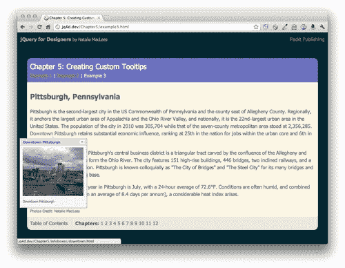

# 摘要

在本章中，我们涵盖了很多内容。我们学习了如何使用 qTip 插件来替换浏览器默认的工具提示为自定义设计的工具提示。我们看到如何通过在导航栏中添加气泡工具提示来进一步定制化。最后，我们使用 Ajax 来拉取一些外部内容，不仅定制了工具提示的外观，还拉取了自定义内容，添加了标题栏和关闭按钮，确保工具提示始终可见，并定制了工具提示的显示和隐藏行为。我希望你能看到 qTip 插件有多灵活，以及它除了定制工具提示外还有多种用途。愿你在尝试插件文档中列出的所有不同设置时玩得开心，并发挥你在定制工具提示外观方面的创意。

接下来，我们将看看如何创建设计精美且动画效果出色的下拉式导航菜单。
