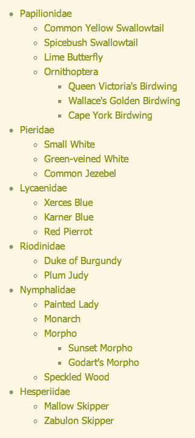
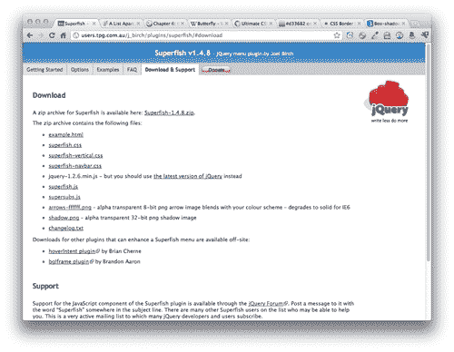
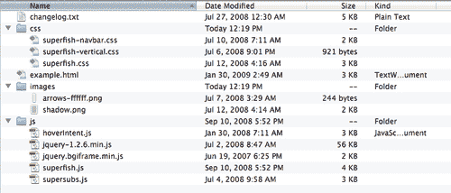
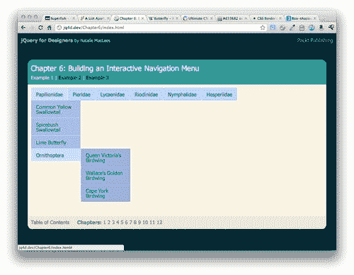
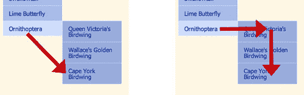
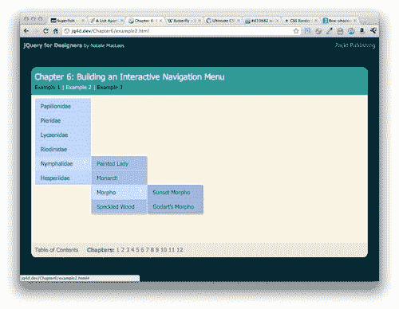
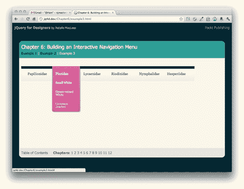
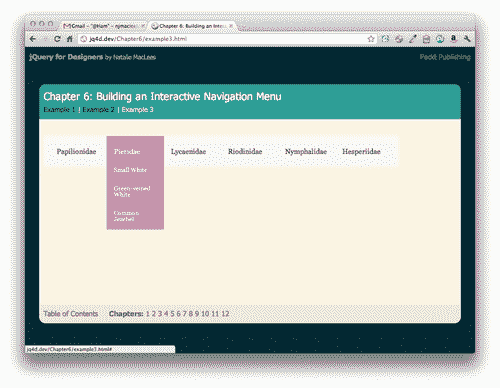

# 第六章：构建交互式导航菜单

> 在 2003 年，A List Apart（[`alistapart.com`](http://alistapart.com)）上发布的一篇文章叫做 *Suckerfish Dropdowns* 展示了如何仅使用 HTML 和 CSS（仅在 IE6 中稍微需要一点 JavaScript 帮助）就可以构建复杂的多级下拉菜单。Suckerfish 名字源自该技术的精美设计演示，其中包含了鲸鲨和寄生鱼的插图。虽然有用，但原始版本要求网站访客在导航时不要将鼠标移出菜单区域，否则菜单会消失。多年来，Suckerfish Dropdowns 激发了许多衍生产品 — Son of Suckerfish，Improved Suckerfish 等，试图解决原始版本的缺点。由于 jQuery 能够让一切变得更好，我们将使用 Superfish jQuery 插件来构建这个想法，使菜单更易于使用。

Superfish 插件的开发者 Joel Birch 表示，插件的大部分支持问题来自于人们不理解菜单的 CSS。为了确保你对 CSS 有牢固的掌握，我强烈建议阅读 *A List Apart* 上的原始 Suckerfish Dropdowns 文章，网址为 [`www.alistapart.com/articles/dropdowns`](http://www.alistapart.com/articles/dropdowns)。

要开始使用此插件，我们将构建一个基本的 Suckerfish 菜单。由于该菜单仅需要 CSS，因此如果我们禁用 JavaScript，我们仍然可以获得一个交互式菜单。菜单只是针对启用 JavaScript 的用户进行了改进。

在本章中，我们将学习以下主题：

+   使用 Superfish jQuery 插件创建水平下拉菜单

+   使用 Superfish 插件创建垂直飞出菜单

+   自定义使用 Superfish 插件创建的下拉和飞出菜单

# 水平下拉菜单

长期以来，水平下拉菜单一直是桌面软件中的常见项目，但在网站中实现起来可能很具挑战性，甚至是不可能的，直到 CSS 和 JavaScript 最终出现，使其成为可能。

# 行动时间 — 创建水平下拉菜单

让我们看看如何使用 Superfish 插件创建水平下拉菜单：

1.  要开始，我们将创建一个简单的 HTML 页面和相关的文件夹和文件，就像我们在 第一章 中创建的那样，*Designer, Meet jQuery*。我们 HTML 文件的主体将包含一个嵌套的无序列表导航菜单，如下所示：

    ```js
    <ul id="sfNav" class="sf-menu">
    <li><a href="#">Papilionidae</a>
    <ul>
    <li><a href="#">Common Yellow Swallowtail</a></li>
    <li><a href="#">Spicebush Swallowtail</a></li>
    <li><a href="#">Lime Butterfly</a></li>
    <li><a href="#">Ornithoptera</a>
    <ul>
    <li><a href="#">Queen Victoria's Birdwing</a></li>
    <li><a href="#">Wallace's Golden Birdwing</a></li>
    <li><a href="#">Cape York Birdwing</a></li>
    </ul>
    </li>
    </ul>
    </li>
    <li><a href="#">Pieridae</a>
    <ul>
    <li><a href="#">Small White</a></li>
    <li><a href="#">Green-veined White</a></li>
    <li><a href="#">Common Jezebel</a></li>
    </ul>
    </li>
    <li><a href="#">Lycaenidae</a>
    <ul>
    <li><a href="#">Xerces Blue</a></li>
    <li><a href="#">Karner Blue</a></li>
    <li><a href="#">Red Pierrot</a></li>
    </ul>
    </li>
    <li><a href="#">Riodinidae</a>
    <ul>
    <li><a href="#">Duke of Burgundy</a></li>
    <li><a href="#">Plum Judy</a></li>
    </ul>
    </li>
    <li><a href="#">Nymphalidae</a>
    <ul>
    <li><a href="#">Painted Lady</a></li>
    <li><a href="#">Monarch</a></li>
    <li><a href="#">Morpho</a>
    <ul>
    <li><a href="#">Sunset Morpho</a></li>
    <li><a href="#">Godart's Morpho</a></li>
    </ul>
    </li>
    <li><a href="#">Speckled Wood</a></li>
    </ul>
    </li>
    <li><a href="#">Hesperiidae</a>
    <ul>
    <li><a href="#">Mallow Skipper</a></li>
    <li><a href="#">Zabulon Skipper</a></li>
    </ul>
    </li>
    </ul>

    ```

    请注意，我们给包含菜单的 `<ul>` 添加了 `id` 为 `sfNav` 和 `class` 为 `sf-menu`。这样可以让我们更容易选择和样式化菜单。

    如果你在浏览器中查看页面，它会类似于以下的屏幕截图：

    

    正如您所看到的，我们将链接组织成了一个层次结构。这对于查找我们想要的信息很有用，但占用了相当多的空间。这就是我们可以使用一种技术来隐藏额外信息直到需要它的时候的地方。

1.  接下来，我们需要一个 Superfish 插件的副本。请转到[`users.tpg.com.au/j_birch/plugins/superfish/`](http://users.tpg.com.au/j_birch/plugins/superfish/)，在那里您将找到 Joel Birch 的 Superfish 插件可供下载，以及文档和示例。

    在 Joel 的**快速入门指南**中，我们看到实施 Superfish 插件有三个简单的步骤：

    +   编写 CSS 以创建 Suckerfish 样式的下拉菜单

    +   链接到`superfish.js`文件

    +   在包含您的菜单的元素上调用`superfish()`方法

    幸运的是，Joel 还包含了一个样式 CSS 文件的样本，所以我们可以快速开始。我们稍后会看看如何自定义菜单的外观，但现在，我们将继续使用与插件一起提供的 CSS。

1.  点击**下载和支持**选项卡。

    在**下载**部分的第一个链接是下载 ZIP 文件的链接。在此之下，我们看到一个带有所有 ZIP 文件中包含的文件的项目列表，并提供了单独下载每个文件的链接。既然我们将使用其中的几个文件，我们将下载整个 ZIP 文件。点击**Superfish-1.4.8.zip**链接并将文件保存到您的计算机上。

1.  解压文件夹并查看其中的内容：

    我们会发现文件被很好地按类型组织到子目录中，还有一个示例 HTML 文件，我们可以查看以查看插件的工作原理。

1.  我们从**下载**部分需要的第一个文件是`css`文件夹中的`superfish.css`文件。将该文件复制到您自己的`styles`文件夹中。

1.  接下来，我们将编辑我们的 HTML 文件，将`superfish.css`文件包含在文档的头部：

    ```js
    <head>
    <title>Chapter 6: Building an Interactive Navigation Menu </title>
    <link rel="stylesheet" href="styles/superfish.css"/>
    <link rel="stylesheet" href="styles/styles.css"/>
    </head>

    ```

    我们将在`styles.css`文件之前附加`superfish.css`文件，以便于我们稍后覆盖`superfish.css`文件中的任何样式。

1.  现在，如果您在浏览器中刷新页面，您将看到一个可用的 Suckerfish 下拉菜单：

当我将鼠标移到第一个链接上时，嵌套的`<ul>`变得可见。如果我将鼠标移到下拉菜单中的最后一个链接上，嵌套在第三级的`<ul>`就会变得可见。

请记住，所有这些都是在没有 JavaScript 的情况下完成的 — 只有 CSS。如果您花点时间使用该菜单，您可能很快就会意识到一些缺点。首先，如果我想要将我的鼠标从**翻翼鸟**链接移动到**开普约克凤蝶**链接，我的自然倾向是对角线移动鼠标。然而，一旦我的鼠标离开蓝色菜单区域，菜单就会关闭和消失。我必须调整移动我的鼠标直接移到子菜单上，然后向下移动到我感兴趣的链接。



这很尴尬，使得菜单感觉很脆弱。如果我的鼠标移动超出菜单 1 像素，菜单就会折叠消失。另一个问题是，只要鼠标悬停在菜单上，菜单就会打开。如果我在页面的一个部分移动鼠标移动到另一个部分，菜单就会快速打开和关闭，这可能会分散注意力和不可预期。

这是 jQuery 发挥作用并使事情变得更好更易用的好地方。

# 行动时间 — 使用 jQuery 改善下拉菜单

按照以下步骤，可以使用 jQuery 改善下拉菜单的可用性：

1.  我们将从在 HTML 页面底部将 Superfish 插件连接到我们的文件中开始，放在 jQuery 和我们的`scripts.js`文件之间：

    ```js
    <script src="img/jquery.js"></script>
    <script src="img/superfish.js"></script>
    <script src="img/scripts.js"></script>
    </body>
    </html>

    ```

1.  接下来，打开`scripts.js`，我们将在其中编写调用`superfish()`方法的代码。像往常一样，我们将从文档准备语句开始，这样我们的脚本会在页面加载到浏览器中时立即运行：

    ```js
    $(document).ready(function(){
    // Our code will go here.
    });

    ```

1.  查看 Superfish 插件的文档，我们看到我们只需选择要应用行为的元素或元素，然后调用`superfish()`方法即可。在我们的`ready()`方法中，我们将添加以下代码：

    ```js
    $(document).ready(function(){
    $('#sfNav').superfish();
    });

    ```

现在，如果您在浏览器中刷新页面，您会看到菜单看起来仍然很相似，但行为得到了很大改善。Superfish JavaScript 和 CSS 协同工作，为具有嵌套子菜单的菜单项添加箭头。如果将鼠标移开自菜单，它不会立即消失，这样可以将鼠标对角线移动到嵌套菜单项。当菜单项出现时，还会有一个微妙的淡入动画。当鼠标悬停时，每个菜单项的背景颜色会更改，使得当前活动项易于识别。

## 刚才发生了什么？

我们设置了一个导航菜单，由一组嵌套列表组成，形成一个层次结构。接下来，我们连接了一个 CSS 文件，为我们的菜单添加了简单的下拉功能。然而，纯 CSS 的菜单有一些缺陷。因此，我们连接了 Superfish 插件来解决这些问题，使我们的菜单更加用户友好。

# 垂直弹出式菜单

我们看到添加 Superfish 插件如何增强了我们下拉菜单的用户体验，但如果我们想要创建一个垂直的弹出式菜单呢？

# 行动时间 — 创建垂直弹出式菜单

从水平下拉菜单切换到垂直弹出菜单再简单不过了。我们将使用相同的 HTML 标记，我们的 JavaScript 代码也将保持不变。我们唯一需要做的改变是添加一些新的 CSS，使我们的菜单垂直显示而不是水平显示。我们可以继续使用上一个示例中使用的相同文件。

1.  在 Superfish 下载的 `css` 文件夹中，你会找到一个名为 `superfish-vertical.css` 的文件。将该文件复制到你自己的 `styles` 文件夹中。在 HTML 文件的 `head` 部分，我们将附加新的 CSS 文件。在 `superfish.css` 和 `styles.css` 之间，添加新的 CSS 文件：

    ```js
    <link rel="stylesheet" href="styles/superfish.css"/>
    <link rel="stylesheet" href="styles/superfish-vertical.css"/>
    <link rel="stylesheet" href="styles/styles.css"/>

    ```

1.  现在，在 HTML 中，我们将在包含菜单的列表中添加一个 `sf-vertical` 类。

    ```js
    <ul id="sfNav" class="sf-menu sf-vertical">

    ```

1.  现在当你在浏览器中刷新页面时，你将看到菜单垂直显示并带有弹出效果：

## 刚刚发生了什么？

水平下拉菜单和垂直弹出菜单之间唯一的区别是 CSS 和一个类名添加到菜单容器上。只需添加一个新的 CSS 文件和一个新的 CSS 类，就可以创建一个垂直弹出菜单，而不是水平下拉菜单。

# 自定义导航菜单

超级鱼插件附带的 CSS 使创建交互式导航菜单变得快速简单，但柔和的蓝色菜单不适合每种设计，所以让我们看看如何自定义菜单。

我们将看看如何通过编写自己的 CSS 来自定义菜单的外观，自定义显示嵌套菜单的动画，突出显示当前页面，并增强菜单的悬停行为。

我们将开始编写一些 CSS，为我们的菜单创建自定义外观。我们将使用 Suckerfish Dropdown 方法创建一个菜单，这将适用于我们网站访问者中没有启用 JavaScript 的用户。我想创建一个柔和的渐变背景，并使我的菜单项看起来像是漂浮在这个背景上的丝带。我的菜单将类似于以下截图：



我要充分利用现代浏览器中可用的较新 CSS3 属性。我正在使用渐变、盒阴影和圆角。我精心选择了这些选项，因为即使没有这些额外的功能，菜单看起来仍然可以，而且可以使用。以下是菜单在旧版浏览器中的外观示例：



你会注意到，与现代浏览器示例中的一些额外样式相比，它确实缺少了一些，但仍然完全可用并且通常令人满意。如果在所有浏览器中菜单看起来都一样很重要，那么我们可以使用图片而不是 CSS3 来获得最终效果。但是，我们可能需要添加一些额外的标记，并且肯定需要添加图像和额外的 CSS 行，所有这些都会增加页面的总体负担。是否决定让菜单在旧版浏览器中逐渐降级，或者是否决定编写额外的代码并创建额外的图像，使菜单在所有浏览器中看起来都一样，这是你需要根据客户的期望、网站的目标受众以及构建快速轻量级页面的重要性来做出的决定。

在为下拉菜单或弹出菜单编写自定义 CSS 时，请记住以下几点：

## :hover 和 .sfHover

为了使菜单在没有 JavaScript 的情况下工作，你需要利用列表项的`:hover` 伪类。确保同时为相同元素创建一个带有 `.sfHover` 类的 CSS 选择器，这将被 JavaScript 使用。例如：

```js
.sf-menu li.sfHover ul,
.sf-menu li:hover ul {
left: -1px;
top: 70px; /* match top ul list item height */
z-index: 99;
}

```

当鼠标悬停在父列表项上时，此段代码会使嵌套菜单在屏幕上可见。包括`li:hover`选择器确保菜单在没有 JavaScript 的情况下工作。同时包括`li.sfHover`选择器确保 JavaScript 菜单会应用相同的代码。

## 级联继承样式

CSS 的本质就是样式沿 DOM 层级进行级联，并应用于选择器的所有子元素以及选择器本身。因此，如果你编写代码来为一级菜单的列表项添加样式，如下所示：

```js
ul.sf-menu li {
background: #cc0000; /* Dark red background */
}

```

你菜单中的所有 `<li>` 都将具有深红色背景，无论它们出现在菜单的哪个级别。如果你想为不同的菜单级别应用不同的样式，你需要在其他代码行中覆盖级联。例如，如果我想使第二级菜单具有深蓝色背景，我会在上述代码之后添加此段 CSS：

```js
ul.sf-menu li li {
background: #0000cc; /* Dark blue background */
}

```

这意味着对于另一个`<li>`内部的`<li>`，背景将会是蓝色。请记住，现在这个样式将级联到其他菜单级别，所以如果你想要第三级菜单具有深绿色背景，你需要再添加一点 CSS：

```js
ul.sf-menu li li li {
background: #00cc00; /* Dark green background */
}

```

在某些情况下，在你的 CSS 中使用直接后代选择器可以帮助你避免编写太多覆盖 DOM 中较高元素样式的 CSS。例如：

```js
ul.sf-menu > li {
background: #cc0000; /* Dark red background */
}

```

这段 CSS 利用了直接后代选择器（>`）。在这种情况下，深红色背景只会应用于具有 `sf-menu` 类的 `<ul>` 直接嵌套的 `<li>` 元素。它不会级联到第二级或第三级菜单。

# 供应商前缀

如果你想要尝试新的 CSS3 属性，你必须确保在属性前加上供应商特定的前缀。尽管这些属性受大多数现代浏览器支持，但它们仍在开发中，并且可能在不同浏览器中以稍微不同的方式实现。比如，下面这段 CSS，将底部两个角圆化的代码：

```js
.sf-menu ul li:last-child a {
-webkit-border-bottom-right-radius: 7px;
-webkit-border-bottom-left-radius: 7px;
-moz-border-radius-bottomright: 7px;
-moz-border-radius-bottomleft: 7px;
border-bottom-right-radius: 7px;
border-bottom-left-radius: 7px;
}

```

你可以看到，对于左下角和右下角的属性，在 Webkit 内核浏览器（主要是 Safari 和 Chrome）和 Mozilla 浏览器（主要是 Firefox）之间略有不同。在供应商特定代码之后，包括任何支持的浏览器的一般 CSS3 代码，以确保你的代码是未来兼容的。

# 行动时间——定制 Superfish 菜单

定制 Superfish 菜单主要涉及编写自己的 CSS 来样式化菜单，让它看起来更符合你的喜好。下面是我们将为菜单创建自定义外观的方法：

如果你记得一些网页基础，你会记得 CSS 代表层叠样式表。层叠特性是我们在这里将要关注的。我们为菜单顶层编写的任何样式都将层叠到菜单的其他级别。我们必须记住这一点，并处理那些我们宁愿阻止样式层叠向下传递的情况。

1.  让我们从样式化菜单的顶层开始。由于我使用了新的 CSS3 功能，我们需要准备写一些额外的代码，以便每个浏览器都能优雅地处理我们的代码。下面是我们将为菜单顶层创建的 CSS。将此代码放入你的`styles.css`文件中：

    ```js
    /**** Level 1 ****/
    .sf-menu,
    .sf-menu * {
    list-style: none;
    margin: 0;
    padding: 0;
    }
    .sf-menu {
    background: #f6f6f6; /* Old browsers */
    background: -moz-linear-gradient(top, rgba(0,0,0,1) 1%, rgba(56,56,56,1) 16%, rgba(255,255,255,1) 17%, rgba(246,246,246,1) 47%, rgba(237,237,237,1) 100%); /* FF3.6+ */
    background: -webkit-gradient(linear, left top, left bottom, color-stop(1%,rgba(0,0,0,1)), color-stop(16%,rgba(56,56,56,1)), color-stop(17%,rgba(255,255,255,1)), color-stop(47%,rgba(246,246,246,1)), color-stop(100%,rgba(237,237,237,1))); /* Chrome,Safari4+ */
    background: -webkit-linear-gradient(top, rgba(0,0,0,1) 1%,rgba(56,56,56,1) 16%,rgba(255,255,255,1) 17%,rgba(246,246,246,1) 47%,rgba(237,237,237,1) 100%); /* Chrome10+,Safari5.1+ */
    background: -o-linear-gradient(top, rgba(0,0,0,1) 1%,rgba(56,56,56,1) 16%,rgba(255,255,255,1) 17%,rgba(246,246,246,1) 47%,rgba(237,237,237,1) 100%); /* Opera11.10+ */
    background: -ms-linear-gradient(top, rgba(0,0,0,1) 1%,rgba(56,56,56,1) 16%,rgba(255,255,255,1) 17%,rgba(246,246,246,1) 47%,rgba(237,237,237,1) 100%); /* IE10+ */
    filter: progid:DXImageTransform.Microsoft.gradient( startColorstr='#000000', endColorstr='#ededed',GradientType=0 ); /* IE6-9 */
    background: linear-gradient(top, rgba(0,0,0,1) 1%,rgba(56,56,56,1) 16%,rgba(255,255,255,1) 17%,rgba(246,246,246,1) 47%,rgba(237,237,237,1) 100%); /* W3C */
    float: left;
    font-family: georgia, times, 'times new roman', serif;
    font-size: 16px;
    line-height: 14px;
    margin: 28px 0 14px 0;
    padding: 0 14px;
    }
    .sf-menu li {
    border-left: 1px solid transparent;
    border-right: 1px solid transparent;
    float: left;
    position: relative;
    }
    .sf-menu li.sfHover,
    .sf-menu li:hover {
    visibility: inherit; /* fixes IE7 'sticky bug' */
    }
    .sf-menu li.sfHover,
    .sf-menu li:hover {
    background: #DF6EA5;
    border-color: #a22361;
    -webkit-box-shadow: 3px 3px 3px rgba(0,0,0,0.2);
    -moz-box-shadow: 3px 3px 3px rgba(0,0,0,0.2);
    box-shadow: 3px 3px 3px rgba(0,0,0,0.2);
    }
    .sf-menu a {
    border-left: 1px solid transparent;
    border-right: 1px solid transparent;
    color: #444;
    display: block;
    padding: 28px 14px;
    position: relative;
    width: 98px;
    text-decoration: none;
    }
    .sf-menu li.sfHover a,
    .sf-menu li:hover a {
    background: #DF6EA5;
    border-color: #fff;
    color: #fff;
    outline: 0;
    }
    .sf-menu a,
    .sf-menu a:visited {
    color: #444;
    }

    ```

    哎呀！这看起来像是很多代码，但其中大部分是我们需要为每种不同类型的浏览器使用的重复的渐变和阴影声明。让我们祈祷这个要求很快消失，浏览器供应商最终达成一致意见，确定用 CSS 创建渐变和阴影的方法。

1.  接下来，让我们看看如何为我们菜单的下一级样式化。将以下 CSS 添加到你的`styles.css`文件中，以样式化第二级菜单：

    ```js
    /***** Level 2 ****/
    .sf-menu ul {
    background: rgb(223,110,165); /* Old browsers */
    background: -moz-linear-gradient(top, rgba(223,110,165,1) 0%, rgba(211,54,130,1) 100%); /* FF3.6+ */
    background: -webkit-gradient(linear, left top, left bottom, color-stop(0%,rgba(223,110,165,1)), color-stop(100%,rgba(211,54,130,1))); /* Chrome,Safari4+ */
    background: -webkit-linear-gradient(top, rgba(223,110,165,1) 0%,rgba(211,54,130,1) 100%); /* Chrome10+,Safari5.1+ */
    background: -o-linear-gradient(top, rgba(223,110,165,1) 0%,rgba(211,54,130,1) 100%); /* Opera11.10+ */
    background: -ms-linear-gradient(top, rgba(223,110,165,1) 0%,rgba(211,54,130,1) 100%); /* IE10+ */
    filter: progid:DXImageTransform.Microsoft.gradient( startColorstr='#df6ea5', endColorstr='#d33682',GradientType=0 ); /* IE6-9 */
    background: linear-gradient(top, rgba(223,110,165,1) 0%,rgba(211,54,130,1) 100%); /* W3C */
    -webkit-border-bottom-right-radius: 7px;
    -webkit-border-bottom-left-radius: 7px;
    -moz-border-radius-bottomright: 7px;
    -moz-border-radius-bottomleft: 7px;
    border-bottom-right-radius: 7px;
    border-bottom-left-radius: 7px;
    border: 1px solid #a22361;
    border-top: 0 none;
    margin: 0;
    padding: 0;
    position: absolute;
    top: -999em;
    left: 0;
    width: 128px;
    -webkit-box-shadow: 3px 3px 3px rgba(0,0,0,0.2);
    -moz-box-shadow: 3px 3px 3px rgba(0,0,0,0.2);
    box-shadow: 3px 3px 3px rgba(0,0,0,0.2);
    font-size: 14px;
    }
    .sf-menu ul li {
    border-left: 1px solid #fff;
    border-right: 1px solid #fff;
    display: block;
    float: none;
    }
    .sf-menu ul li:last-child {
    border-bottom: 1px solid #fff;
    -webkit-border-bottom-right-radius: 7px;
    -webkit-border-bottom-left-radius: 7px;
    -moz-border-radius-bottomright: 7px;
    -moz-border-radius-bottomleft: 7px;
    border-bottom-right-radius: 7px;
    border-bottom-left-radius: 7px;
    }
    .sf-menu ul li:last-child a {
    -webkit-border-bottom-right-radius: 7px;
    -webkit-border-bottom-left-radius: 7px;
    -moz-border-radius-bottomright: 7px;
    -moz-border-radius-bottomleft: 7px;
    border-bottom-right-radius: 7px;
    border-bottom-left-radius: 7px;
    }
    .sf-menu li.sfHover li.sfHover,
    .sf-menu li:hover li:hover {
    -webkit-box-shadow: none;
    -moz-box-shadow: none;
    box-shadow: none;
    }
    .sf-menu li.sfHover li.sfHover {
    border-right-color: #cb2d79
    }
    .sf-menu li li a {
    border: 0 none;
    padding: 14px;
    }
    .sf-menu li li:first-child a {
    padding-top: 0;
    }
    .sf-menu li li.sfHover a,
    .sf-menu li li:hover a {
    background: transparent;
    border: 0 none;
    color: #f8ddea;
    outline: 0;
    }
    .sf-menu li li a:hover {
    color: #f8ddea;
    }
    .sf-menu li.sfHover li a,
    .sf-menu li:hover li a {
    background: transparent;
    }
    .sf-menu li.sfHover li.sfHover a {
    background: #cb2d79;
    }
    .sf-menu li.sfHover ul,
    .sf-menu li:hover ul {
    left: -1px;
    top: 70px; /* match top ul list item height */
    z-index: 99;
    }
    .sf-menu li li.sfHover,
    .sf-menu li li:hover {
    background: transparent;
    border-color: #fff;
    }

    ```

    再一次，这看起来像是很多 CSS，但我们仍然需要为每个单独的浏览器编写我们的声明。菜单的第二级项目也因需要覆盖或取消我们应用于菜单顶层但我们不希望应用于这里的任何样式而变得复杂。例如，我们为菜单顶层的所有项目应用了 `float` 属性，但我们需要取消第二级菜单的应用。

    我相信你开始明白为什么 Superfish 插件的大部分支持问题都与 CSS 有关，而不是 JavaScript。这里有很多要记住的东西。

1.  最后，我们仍然有第三级菜单需要样式化。就像第二级一样，我们需要取消任何我们不希望应用的级联样式。将以下样式添加到你的`styles.css`文件中：

    ```js
    /**** Level 3 ****/
    ul.sf-menu li.sfHover li ul,
    ul.sf-menu li:hover li ul {
    background: #cb2d79;
    top: -999em;
    -webkit-border-radius: 7px;
    -webkit-border-top-left-radius: 0;
    -moz-border-radius: 7px;
    -moz-border-radius-topleft: 0;
    border-radius: 7px;
    border-top-left-radius: 0;
    }
    ul.sf-menu li.sfHover li ul li,
    ul.sf-menu li:hover li ul li {
    background: transparent;
    border: 0 none;
    }
    ul.sf-menu li li.sfHover ul,
    ul.sf-menu li li:hover ul {
    left: 9em; /* match ul width */
    top: 0;
    }
    .sf-menu li.sfHover li.sfHover li a,
    .sf-menu li:hover li:hover li a {
    background: transparent;
    }
    .sf-menu li li li:first-child a {
    padding-top: 14px;
    }
    .sf-menu li li li a:hover {
    background: transparent;
    color: #fff;
    }
    /*** ARROWS ***/
    .sf-sub-indicator {
    display: none;
    }

    ```

现在深吸一口气，因为我们终于到达了为菜单创建自定义样式的 CSS 的尽头。别担心，这是一个特别复杂的设计，使用了大量新的 CSS3 样式。如果你选择了一个稍微简单的东西，你将不得不创建更少的代码来使样式工作。  

这个 CSS 的额外好处是即使没有启用 JavaScript，它也可以工作。Superfish 插件只是增强了菜单，使其更易于使用。  

## 刚才发生了什么事？  

我们编写了自定义 CSS 来使我们的菜单与我们创建的设计匹配。为了正确地使悬停状态工作，我们必须记得同时为`:hover`伪类和`.sfHover`类设置样式。我们还必须深入研究 CSS 的级联特性，并决定哪些样式应该通过菜单的所有级别级联下来，哪些不应该。最后，我们必须记住，新的 CSS3 属性现在至少在不同的浏览器中必须以不同的方式声明。所有这些都导致下拉菜单需要比你最初预期的更多的自定义 CSS。只需耐心，一路下来时记住级联即可。  

## 自定义动画  

现在我们已经编写了自定义样式的 CSS，让我们来看看如何自定义显示子菜单的动画。滑动动画更适合我的菜单风格。默认动画是淡入子菜单，但我宁愿覆盖此默认行为，并用滑动动画替换它。  

# 行动时间 —— 合并自定义动画  

按照以下步骤将自定义动画合并到您的菜单中：  

1.  将菜单淡入意味着菜单的不透明度从 0 变化到 100 百分比。我宁愿动画化子菜单的高度，以便子菜单滑入视图。要做到这一点，打开你的 scripts.js 文件，我们将在 `superfish()` 方法内自定义动画值：  

    ```js
    $(document).ready(function(){
    $('#sfNav').superfish({
    animation: {height:'show'}
    });
    });

    ```

    在此处添加一个值将覆盖插件的默认行为，并用我们选择的动画替换它。  

1.  现在当你在浏览器中刷新页面时，你会看到子菜单滑入视图，而不是淡入，这是与我用来样式化菜单的 CSS 更匹配的动画。  

## 刚才发生了什么事？  

我们利用了 Superfish 插件的自定义选项之一，改变了嵌套子导航链接的显示动画。在 Superfish 菜单的文档中还涵盖了更多的自定义选项。  

# [hoverIntent 插件](https://example.org/hoverIntent)  

早些时候，我指出我们的菜单有一个问题，那就是菜单对`mouseover`事件的反应速度太快了。任何时候鼠标移动到菜单上，嵌套菜单就会打开。虽然这乍看起来可能是一件好事，但如果站点访问者只是在屏幕上移动鼠标，而不打算使用下拉或弹出式菜单，这可能会让人感到不安或惊讶。

Superfish 插件内置支持 hoverIntent 插件。hoverIntent 插件有点暂停`mouseover`事件，并使页面等待以查看鼠标是否减速或停止在一个项目上，以确保这是站点访问者想要做的。这样，如果站点访问者碰巧将鼠标悬停在下拉菜单上，而在页面上寻找其他内容，子菜单不会开始出现，将其置于困惑中。

如果你还记得的话，当我们下载 Superfish 插件时，hoverIntent 插件实际上已经包含在 ZIP 文件中。

# 行动时间——添加 hoverIntent 插件

按照以下步骤利用 hoverIntent 插件来为您的菜单增加功能：

1.  在 Superfish 下载中，找到位于 `js` 文件夹内的 `hoverIntent.js` 文件，并将文件复制到您自己的 `scripts` 文件夹中。

1.  接下来，我们需要将 hoverIntent 插件附加到我们的 HTML 页面上。

    ### 提示

    不要忘记在将多个 JavaScript 文件附加到页面时考虑依赖关系。所有 jQuery 插件都依赖于 jQuery 来运行，因此需要在任何插件之前将 jQuery 附加到您的页面上。在这种情况下，Superfish 插件依赖于 hoverIntent 插件，因此我们需要确保在 Superfish 插件之前添加 hoverIntent。

1.  将新的 `<script>` 标签添加到您的页面底部，与其他脚本一起如下：

    ```js
    <script src="img/jquery.js"></script>
    <script src="img/hoverIntent.js"></script>
    <script src="img/superfish.js"></script>
    <script src="img/scripts.js">
    </script>
    </body>
    </html>

    ```

现在，如果您在浏览器中刷新页面，您会发现当鼠标移动到菜单上时会有一个短暂的暂停，然后嵌套的子菜单出现。如果您快速将鼠标移到页面上，越过菜单，页面上不会出现不需要的子菜单。

## 英雄般的尝试——设定你自己的速度

尝试使用在文档中概述的 Superfish 插件的不同定制选项，调整显示子菜单的动画速度。

# 摘要

哇！刚刚我们做了很多工作，但我必须说，我们为我们的努力展示了一个相当令人印象深刻的导航菜单。我们学会了如何使用 Superfish jQuery 插件来生成水平下拉菜单或垂直飞出菜单。我们还学会了如何完全自定义我们菜单的外观和感觉，以完美适应我们的网站设计。能够隐藏站点的子部分直到需要它们，使得复杂的导航结构对于您的站点访问者来说不那么令人难以置信。可以清楚地看到站点的主要部分是什么，他们可以轻松地深入到他们想要的内容。

接下来，我们将通过使用 Ajax 来进一步提升我们的动画效果。
