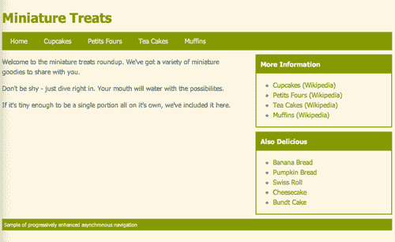
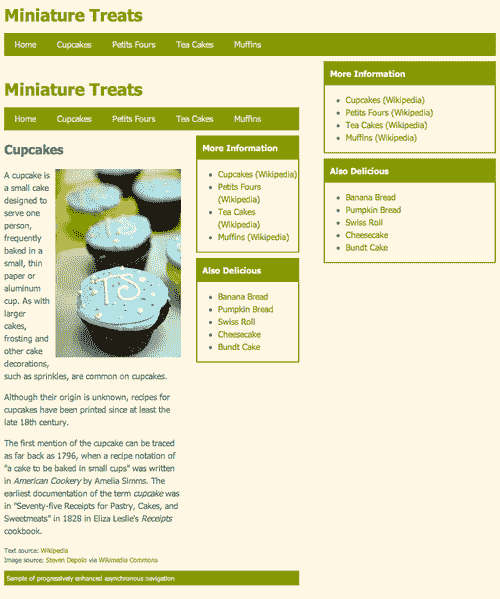
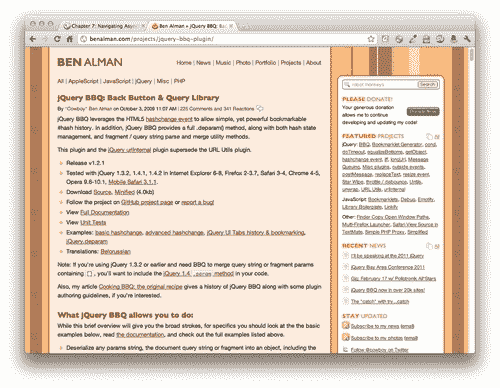
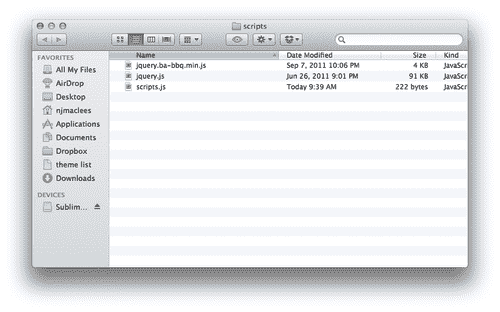
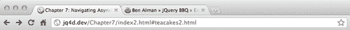
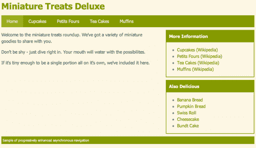
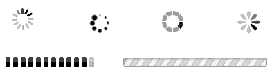
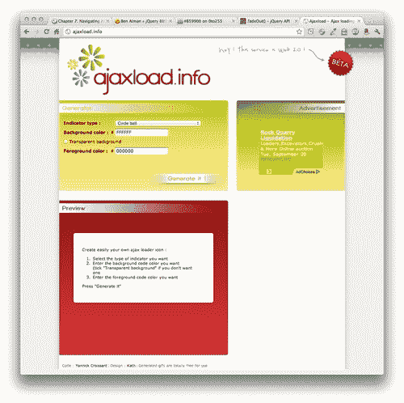

# 第七章：异步导航

> 网站通常设置成，网站的所有页面共享一个通用的页眉和页脚，只有中间的内容从页面到页面发生改变。有时左侧和/或右侧的主要内容区域还有一个或多个侧边栏，在整个网站中保持不变。为什么让我们的网站访问者在浏览我们的网站时一遍又一遍地重新下载相同的页眉、页脚和侧边栏内容呢？

在本章中，我们将涵盖以下主题：

+   构建异步导航的网站

+   增强异步导航以使其更加用户友好

# 简单的异步导航

在 Web 的早期，解决重复下载相同内容的问题的一个方法是框架。如果你对网页开发还太新，以至于不记得，框架提供了一种将单页面视图分割成几个不同的 HTML 文件的方法——浏览网站涉及重新加载一个或多个框架，而其他框架保持不变。框架有助于网站加载更快，使网站更容易维护，但最终它们制造的问题比解决的问题更多。有框架的网站易于破坏，搜索引擎难以索引，经常破坏前进和后退按钮，并且使访问者难以或无法收藏页面、分享链接或打印内容。由于所有这些问题，使用框架已不受青睐。

近来，单页面应用程序开始变得更受欢迎。如果你登录你的 Twitter 账户并开始点击各处，你会注意到整个页面很少刷新——大部分交互发生在一个页面内。如果你访问 Gawker Media 网站中的任何一个，你会注意到在初始页面加载后，当你浏览网站时整个页面并不会再次刷新。现在，让我们看看如何以渐进增强的方式在我们自己的网站上实现相同类型的交互，以确保我们的网站在没有 JavaScript 的情况下仍然可以正常工作，并且可以被搜索引擎轻易索引。

# **行动时间** — 建立一个简单的网站

我们将开始建立一个小而简单的网站，其中包含一些页面。它们都共享相同的页眉、导航、侧边栏和页脚。它们都有一个主内容区，其中将显示每个页面的唯一内容。

1.  通过建立一个包含所有相关文件和文件夹的`index.html`文件来开始，就像我们在第一章中所做的那样，*设计师，遇见 jQuery*。`index.html`文件的主体将包含我们的页眉、导航、侧边栏和页脚：

    ```js
    <div id="ajax-header">
    <h1>Miniature Treats</h1>
    <ul id="ajax-nav">
    <li><a href ="index.html">Home</a></li>
    <li><a href ="cupcakes.html">Cupcakes</a></li>
    <li><a href ="petitfours.html">Petits Fours</a></li>
    <li><a href ="teacakes.html">Tea Cakes</a></li>
    <li><a href ="muffins.html">Muffins</a></li>
    </ul>
    </div>
    <div id="main-col">
    <div id="main-col-wrap">
    <p>Welcome to the miniature treats roundup. We've got a variety of miniature goodies to share with you.</p>
    <p>Don't be shy - just dive right in. Your mouth will water with the possibilites.</p>
    <p>If it's tiny enough to be a single portion all on it's own, we've included it here.</p>
    </div>
    </div>
    <div id="side-col">
    <div class="widget">
    <h4>More Information</h4>
    <ul>
    <li><a href="http://en.wikipedia.org/wiki/Cupcakes">Cupcakes (Wikipedia)</a></li>
    <li><a href="http://en.wikipedia.org/wiki/Petit_fours">Petits Fours (Wikipedia)</a></li>
    <li><a href="http://en.wikipedia.org/wiki/Tea_cake">Tea Cakes (Wikipedia)</a></li>
    <li><a href="http://en.wikipedia.org/wiki/Muffins">Muffins (Wikipedia)</a></li>
    </ul>
    </div>
    <div class="widget">
    <h4>Also Delicious</h4>
    <ul>
    <li><a href="http://en.wikipedia.org/wiki/Banana_bread">Banana Bread</a></li>
    <li><a href="http://en.wikipedia.org/wiki/Pumpkin_bread">Pumpkin Bread</a></li>
    <li><a href="http://en.wikipedia.org/wiki/Swiss_roll">Swiss Roll</a></li>
    <li><a href="http://en.wikipedia.org/wiki/Cheesecake">Cheesecake</a></li>
    <li><a href="http://en.wikipedia.org/wiki/Bundt_cake">Bundt Cake</a></li>
    </ul>
    </div>
    </div>
    <div id="ajax-foot">
    <p>Sample of progressively enhanced asynchronous navigation</p>
    </div>

    ```

    你可能会注意到额外的一个`<div>`，你可能没有预料到：`main-col`id 内的`<div>`，我添加了一个`main-col-wrap`id 的`<div>`标签。这并不用于布局或 CSS 目的，但一旦我们创建异步加载内容的 JavaScript 时，它就会被用到。

1.  接下来，我们将编写一些 CSS 来创建一个简单的布局。打开您的`styles.css`文件并添加以下样式：

    ```js
    #ajax-header { margin: 40px 0 0 0; }
    #ajax-header h1 { color:#859900;margin:0 0 10px 0;padding:0; }
    #ajax-nav { background:#859900;margin:0;padding:0;overflow:hidden;zoom:1; }
    #ajax-nav li { list-style-type:none;margin:0;padding:10px 20px;display:block;float:left; }
    #ajax-nav a,
    #ajax-nav a:link,
    #ajax-nav a:visited { color: #eee8d5; }
    #ajax-nav a:hover,
    #ajax-nav a:active { color: #fff; }
    #main-col { float:left;width:60%; }
    #side-col { float:right;width:35%; }
    .widget { border:2px solid #859900;margin:10px 0; }
    .widget h4 { margin:0 0 10px 0;padding:10px;background:#859900;color:#FDF6E3; }
    .float-right { float:right;margin:0 0 10px 10px; }
    .float-left { float:left;margin:0 10px 10px 0; }
    .source { font-size:12px; }
    #ajax-foot { clear:both;margin:10px 0 40px 0;padding:5px;background:#859900;color:#f3f6e3; }
    #ajax-foot p { margin:0;padding:0;font-size:12px;}

    ```

    最终页面将类似于以下屏幕截图：

    

    如果您感到灵感来了，请随意编写一些额外的 CSS 来使您的页面看起来更加花哨。

1.  接下来，我们将创建网站的其他页面，即杯子蛋糕、小甜饼、茶点和松饼的页面。HTML 将与主页完全相同，除了`<div>`内部的内容，其`id`为`main-col-wrap`。以下是我为杯子蛋糕页面准备的内容样本：

    ```js
    <div id="main-col-wrap">
    <h2>Cupcakes</h2>
    <p>A cupcake is a small cake designed to serve one person, frequently baked in a small, thin paper or aluminum cup. As with larger cakes, frosting and other cake decorations, such as sprinkles, are common on cupcakes.</p>
    <p>Although their origin is unknown, recipes for cupcakes have been printed since at least the late 18th century.</p>
    <p>The first mention of the cupcake can be traced as far back as 1796, when a recipe notation of "a cake to be baked in small cups" was written in <em>American Cookery</em> by Amelia Simms. The earliest documentation of the term <em>cupcake</em> was in "Seventy-five Receipts for Pastry, Cakes, and Sweetmeats" in 1828 in Eliza Leslie's <em>Receipts</em> cookbook.</p>
    <p class="source">Text source: <a href="http://en.wikipedia.org/wiki/Cupcakes">Wikipedia</a><br/>Image source: <a href="http://flickr.com/people/10506540@N07">Steven Depolo</a> via <a href="http://commons.wikimedia.org/wiki/File:Blue_cupcakes_for_graduation,_closeup_-_Tiffany,_May_2008.jpg">Wikimedia Commons</a></p>
    </div>

    ```

在这个`<div>`之外，我的页面的其他部分与我们之前创建的主页完全相同。继续在类似的方式下创建松饼、茶点和小甜饼的页面，这样您就可以得到一个包含共享页眉、导航、侧边栏和页脚的五页网站。

不要忘记，您的网站每页应在头部部分包含`styles.css`文件的链接，以及在文档底部，在结束`</body>`标记之前包含对 jQuery 和`scripts.js`文件的链接。

## 刚才发生了什么？

我们在 HTML 中设置了一个简单的五页网站。我们网站的每一页共享相同的页眉、导航、侧边栏和页脚。然后我们设置了一些简单的 CSS 来美化我们的页面。唯一表明这里会发生一些花哨的东西是额外的`<div>`包裹着我们的主内容区域——页面上包含从页面到页面不同内容的区域。

# 行动时间——添加 Ajax 魔力

如果您在浏览器中浏览这个简单的小网站，您会发现我们一遍又一遍地重新加载相同的页眉、导航、侧边栏和页脚。只有页面的主要内容区域的内容在页面之间不断地变化。让我们使用 jQuery 的魔力来解决这个问题。

1.  只是一个提醒，除非您的页面是由服务器提供的，否则这些 Ajax 函数将不起作用。要看这段代码的实际效果，您要么需要将页面上传到服务器，要么在自己的计算机上创建一个服务器。首先，我们将打开我们的`scripts.js`文件并开始编写我们的代码。我们将像往常一样以文档就绪语句开始：

    ```js
    $(document).ready(function(){
    // Our code will go here
    });

    ```

1.  我们需要选择导航中的所有链接。这看起来类似于这样：

    ```js
    $(document).ready(function(){
    $('#ajax-nav a')
    });

    ```

1.  当用户点击这些链接时，浏览器会加载请求的页面。这就是我们希望覆盖的行为，因此我们将绑定一个函数到链接，覆盖链接的点击行为如下：

    ```js
    $(document).ready(function(){
    $('#ajax-nav a').bind('click', function(){
    // Our clicky code goes here
    });
    });

    ```

1.  当站点访问者单击链接时，我们需要做的第一件事情就是取消默认行为。我们可以通过告诉函数返回`false`来实现：

    ```js
    $(document).ready(function(){
    $('#ajax-nav a').bind('click', function(){
    return false;
    });
    });

    ```

    现在，如果您在浏览器中重新加载您的简单网站，您会发现单击主导航中的链接没有任何作用。您请求的页面不再加载到浏览器中。我们已经为我们自己的代码做好了准备。

1.  如果我们要从服务器获取页面，我们需要知道我们要获取哪个页面。我们需要知道我们需要调用哪个 URL。幸运的是，我们的链接已经在它们的`href`属性中包含了这些信息，例如，通过查看我们杯子蛋糕链接的 HTML：

    ```js
    <a href ="cupcakes.html">Cupcakes</a>

    ```

    我们可以看到我们需要请求以获取有关杯子蛋糕信息的页面是`cupcakes.html。`

    我们将使用 jQuery 来获取刚刚点击的链接的`href`属性：

    ```js
    $(document).ready(function(){
    $('#ajax-nav a').bind('click', function(){
    var url = $(this).attr('href');
    return false;
    });
    });

    ```

    现在我们有一个名为`url`的变量，其中包含了刚刚点击的链接的`href`属性。记住，变量只是容器。如果我们的网站访问者刚刚点击了杯子蛋糕链接，那么`url`变量将包含`cupcakes.html`。而另一方面，如果网站访问者刚刚点击了松饼链接，那么`url`变量将包含`muffins.html`。这个函数在站点访问者点击主导航中的任何链接时都会被调用- `$(this)`将始终引用刚刚点击的链接。

1.  现在我们知道服务器上的哪个页面包含了网站访问者请求的信息，那么我们该怎么办？幸运的是，jQuery 为我们提供了`load()`方法，它可以轻松地将内容从服务器加载到我们的页面中。我们将选择页面上我们想要加载内容的元素，然后调用那个元素的`load()`方法。在这种情况下，我们将选择`<div>`标签，并且其`id`为`main-col`，因为这是页面上从一页到另一页变化的内容的容器：

    ```js
    $(document).ready(function(){
    $('#ajax-nav a').bind('click', function(){
    var url = $(this).attr('href');
    $('#main-col').load();
    return false;
    });
    });

    ```

1.  如果您刷新浏览器中的页面并点击主导航中的链接，您将会发现没有任何反应。浏览器没有报告任何错误，那么问题出在哪里呢？

    记得 Maggie 这只狗吗，她在第一章 *设计师，见识 jQuery*中正在吃培根。Maggie 有一个这样的`eat`方法：

    ```js
    Maggie.eat();

    ```

    然而，请记住，她不能只是吃东西——她必须吃一些东西。因此，我们将`bacon`传递给 Maggie 的`eat()`方法如下：

    ```js
    Maggie.eat('bacon');

    ```

    `load`方法也类似。我们不能只是加载—我们必须加载一些东西。在这种情况下，我们知道我们需要加载什么—url 变量中包含的 URL 中的内容：

    ```js
    $(document).ready(function(){
    $('#ajax-nav a').bind('click', function(){
    var url = $(this).attr('href');
    $('#main-col').load(url);
    return false;
    });
    });

    ```

    现在，如果刷新浏览器并尝试点击主导航中的杯子蛋糕链接，您会看到杯子蛋糕页面的内容确实加载到我们的`#main-col` div 中。然而，这并不是我们想要的，因为它加载整个页面：

    

1.  我们不想获取整个页面。我们只需要`#main-col` div 中的内容，这就是额外的包装元素`<div>`和`id`为`main-col-wrap`的地方。我们可以告诉 jQuery 仅将`<div>`和其内容加载到`#main-col <div>`中，如下所示：

    ```js
    $(document).ready(function(){
    $('#ajax-nav a').bind('click', function(){
    var url = $(this).attr('href');
    $('#main-col').load(url + ' #main-col-wrap');
    return false;
    });
    });

    ```

    这有时被称为 jQuery 的**部分加载方法**，因为我们不是将获取到的整个内容加载到页面中，而只是我们关心的部分。如果你在浏览器中刷新页面并点击主导航，你会发现现在内容按我们预期的方式加载，只有页面的主内容区域刷新。页眉、导航、侧边栏和页脚仍然保留在页面上，而主内容区域重新加载。

## 刚刚发生了什么？

我们使用了 jQuery 强大的基于 CSS 的选择器来选择主导航中的所有链接。我们确定了链接的点击行为是我们需要覆盖以获得所需结果的行为。我们将一个点击函数绑定到链接上，每次调用链接时都会运行。我们取消了链接在浏览器窗口中加载新页面的默认行为。接下来，我们检查链接以获取`href`属性中包含的 URL。我们选择了页面上希望加载新内容的容器，并使用 jQuery 的`load()`方法调用所需内容。我们向`load()`方法传递了一个选择器和 URL，以便 jQuery 知道我们只想加载选定元素中的内容，而不是整个页面。

我们将我们简单的网站转换成了单页面应用。我们使用渐进增强的方式来做到这一点，这样那些没有启用 JavaScript 的网站访问者也可以无问题地使用我们的网站。搜索引擎也可以索引我们网站的内容。而这一切都只用了几行 JavaScript 代码 —— 多亏了 jQuery！

# 豪华异步导航

你会对自己只用几行代码就将一个普通网站变成单页面应用而感到非常满意，但让我们面对现实：我们简单的异步导航还有待改进，绝对需要一些润色。

或许最明显的是，我们破坏了浏览器的后退和前进按钮。我们不能再使用它们在我们网站的页面之间导航。我们还剥夺了我们网站访问者将页面链接加为书签或分享的能力。我们在我们的主导航中点击链接后，也没有向我们的网站访问者提供任何反馈。由于我们的页面短小简单，它们通常会很快加载，但互联网在速度方面众所周知是不可预测的。有时加载我们的内容可能需要半秒、一秒或更长时间 —— 我们的网站访问者不知道他们的浏览器正在努力获取新内容 —— 它看起来就像什么都没发生。

还有一些其他小技巧，可以使整个过程更加美观和快速，所以让我们开始制作高级异步导航的豪华版本吧。

# 行动时间 —— 构建豪华异步导航

为了给我们的异步导航添加一些缺失的功能，我们将使用 Ben Alman 的出色的 jQuery BBQ 插件。尽管这个名字可能会让你觉得饥饿，但在这种情况下，BBQ 代表 Back Button 和 Query。我们将继续使用我们在上一个示例中创建的文件。

1.  首先，我们需要获取 BBQ 插件的副本以进行使用。访问 [`benalman.com/projects/jquery-bbq-plugin/`](http://benalman.com/projects/jquery-bbq-plugin/) 获取下载文件以及 jQuery BBQ 插件的文档和示例。

    和往常一样，我们将下载插件的压缩版本，并将其放入我们的`scripts`文件夹中，与 jQuery 和我们的`scripts.js`文件并列。

    

1.  接下来，打开你的迷你网站的每个 HTML 页面，并在 jQuery 之后、`scripts.js`之前添加 BBQ 插件：

    ```js
    <script type="text/javascript" src="img/jquery.js"></script>
    <script type="text/javascript" src="img/jquery.ba-bbq.min.js"></script>
    <script type="text/javascript" src="img/scripts.js"></script>
    </body>
    </html>

    ```

现在我们已经准备好开始构建我们的异步导航的豪华版本了。

## 刚刚发生了什么？

我们下载了 jQuery BBQ 插件，并将其附加到我们的每个页面上。到目前为止，这在我们的网站上没有任何区别——我们已经附加了 BBQ 插件，但我们并没有使用它来做任何事情。接下来，我们将看看如何使用 BBQ 插件。

# 行动时间——使用 BBQ 插件

我们的第一项任务是让返回和前进按钮起作用，并允许我们的网站访问者将链接添加到书签并分享到个别页面。这就是为什么我们包含了 jQuery BBQ 插件。

1.  我们将编写一些新的 JavaScript 代码，因此将`scripts.js`中我们之前编写的代码清除，并用以下简单的文档就绪语句替换它：

    ```js
    $(document).ready(function(){
    // Our deluxe ajaxy code goes here
    });

    ```

1.  接下来，我们将选择主导航中的每个链接，并用哈希链接替换 URL，以便浏览器认为它们是我们 HTML 页面内部的链接。

    ```js
    $(document).ready(function(){
    $('#ajax-nav a').each(function(){
    $(this).attr('href', '#' + $(this).attr('href'));
    });
    });

    ```

    我们选择主导航中的所有链接，然后循环遍历它们以在 URL 前添加一个`#`字符。例如，`cupcakes.html`链接现在是`#cupcakes.html`。如果你在浏览器中刷新页面，你会发现点击链接不会改变页面上的任何内容，但它会更新浏览器位置栏中的哈希。

    

1.  接下来，我们将一个函数绑定到窗口的`hashchange`事件上。现代浏览器提供了一个称为`hashchange`的事件，每当 URL 的哈希更改时就会触发，就像当您单击主导航链接时所做的那样。旧版浏览器不支持`hashchange`事件，但这就是 jQuery BBQ 插件发挥作用的地方。它在大多数浏览器中提供了对伪`hashchange`事件的支持，这样我们只需编写我们的代码一次，而不必担心浏览器的差异。这是我们如何将函数绑定到`hashchange`事件上的方式：

    ```js
    $(document).ready(function(){
    $('#ajax-nav a').each(function(){
    $(this).attr('href', '#' + $(this).attr('href'));
    });
    $(window).bind('hashchange', function(e) {
    // our function goes here
    });
    });

    ```

1.  我们编写的函数现在将在窗口的哈希更改时调用，我们知道每当站点访问者点击我们的主导航中的链接时都会发生这种情况。现在我们可以编写代码，告诉浏览器在发生这种情况时该做什么。

    ```js
    $(document).ready(function(){
    $('#ajax-nav a').each(function(){
    $(this).attr('href', '#' + $(this).attr('href'));
    });
    $(window).bind('hashchange', function(e) {
    var url = e.fragment;
    $('#main-col').load(url + ' #main-col-wrap');
    });
    });

    ```

    首先，我们设置一个名为`url`的变量，并将其设置为`e.fragment`。`fragment`属性由 jQuery BBQ 插件提供。它等于 URL 的哈希但不包括哈希符号。因此，如果窗口的哈希更改为`#cupcakes.html`，`e.fragment`将等于`cupcakes.html`。

    下一行代码与我们的基本 Ajax 导航示例相同。我将选择页面上要加载内容的容器，然后调用`load()`方法。我将传递 URL 和 jQuery 选择器，指定要加载到浏览器中的页面部分。

    如果你现在在浏览器中刷新页面，你会看到我们的主导航再次以异步方式工作。点击链接只会加载页面的主内容区域，而其余部分保持不变。然而，有一个重要的区别——如果你点击回退和前进按钮，它们会起作用。一旦你点击进入杯子页面，你可以点击返回按钮返回首页。

1.  我们只剩下一件事要做，就是确保我们的站点访问者可以收藏和分享我们页面的链接。如果你点击杯子页面，复制浏览器地址栏中的 URL，并打开一个新的浏览器窗口或一个新的选项卡，并粘贴 URL，你会发现你得到的是站点的主页而不是杯子页面。如果你查看 URL，`#cupcakes.html`哈希就在那里，我们只需要告诉我们的代码去找它。最简单的方法是在页面加载时立即触发窗口的`hashchange`事件。以下是我们如何做到的：

    ```js
    $(document).ready(function(){
    $('#ajax-nav a').each(function(){
    $(this).attr('href', '#' + $(this).attr('href'));
    });
    $(window).bind('hashchange', function(e) {
    var url = e.fragment;
    $('#main-col').load(url + ' #main-col-wrap');
    });
    $(window).trigger('hashchange');
    });

    ```

    现在，你可以在新窗口中打开杯子链接，你会看到杯子页面加载，就像它应该的那样。我们的`hashchange`函数在页面加载时立即触发，加载正确的内容。

## 刚刚发生了什么事？

我们使用 jQuery 循环遍历我们的每个导航链接，并用内部链接或哈希链接替换它们。为什么不直接在 HTML 中这样做呢？因为我们想确保我们的页面继续为禁用 JavaScript 的用户工作。

然后，我们使用 jQuery BBQ 插件将我们的异步导航更改为启用书签和共享链接以及浏览器中的后退和前进按钮。这使得我们的站点能够像单页应用程序一样运行，而不会破坏站点访问者的预期体验。

# 行动时间——在导航中突出显示当前页面

我们已经使我们的异步导航比我们简单的示例好得多，但我认为我们可以继续努力，使它变得更好。接下来，我们将突出显示导航中当前正在查看的页面，以便我们的网站访问者轻松看到他们所在的页面。



1.  首先，让我们再次打开`styles.css`并编写导航的`.current`CSS 类：

    ```js
    #ajax-nav li.current{ background:#a3bb00; }

    ```

    我已经将我的导航栏设为绿色，所以我要将`.current`类设为稍浅一些的绿色，以便当前项目在菜单中突出显示。你可以参考我的示例或创建自己的样式——任何适合你口味的都可以。

1.  现在我们只需要将我们的`.current`类应用到当前导航项上。我们将在之前编写的`hashchange`事件函数中添加几行代码。我们将从检查窗口位置是否有哈希开始：

    ```js
    $(document).ready(function(){
    $('#ajax-nav a').each(function(){
    $(this).attr('href', '#' + $(this).attr('href'));
    });
    $(window).bind('hashchange', function(e) {
    var url = e.fragment;
    $('#main-col').load(url + ' #main-col-wrap');
    if (url) {
    // The code if there is a hash
    } else {
    // The code if there is not a hash
    }
    });
    $(window).trigger('hashchange');
    });

    ```

1.  现在，如果有一个哈希值，那么我们想要找到与哈希值对应的主导航中的链接，找到它的父容器，并添加当前类。听起来有点复杂，但我可以用一行代码完成：

    ```js
    $(window).bind('hashchange', function(e) {
    var url = e.fragment;
    $('#main-col').load(url + ' #main-col-wrap');
    $('#ajax-nav li.current').removeClass('current');
    if (url) {
    $('#ajax-nav a[href="#' + url + '"]').parents('li').addClass('current');
    } else {
    // The code if there is not a hash
    }
    });

    ```

    我正在使用 jQuery 强大的属性选择器来选择具有`href`属性等于窗口哈希的链接。然后我使用`parents()`方法获取链接的父级。我将`li`传递给`parents()`方法，告诉 jQuery 我只对一个父级感兴趣，即包含我的链接的`<li>`。然后我使用`addClass()`方法将我的当前类添加到当前链接中。

1.  如果没有哈希值，那么我想要突出显示主页，这是我们主导航中的第一个页面。我会选择第一个`<li>`并添加当前类，如下面的代码所示：

    ```js
    $(window).bind('hashchange', function(e) {
    var url = e.fragment;
    $('#main-col').load(url + ' #main-col-wrap');
    $('#ajax-nav li.current').removeClass('current');
    if (url) {
    $('#ajax-nav a[href="#' + url + '"]').parents('li').addClass('current');
    } else {
    $('#ajax-nav li:first-child').addClass('current');
    }
    });

    ```

1.  现在，如果你在浏览器中刷新页面并浏览页面，你会看到当前页面被突出显示，但随着你在网站上移动，越来越多的导航被突出显示——我们在添加新突出显示之前没有删除旧的突出显示。我们将添加以下代码以在添加新的突出显示之前删除当前突出显示：

    ```js
    $(window).bind('hashchange', function(e) {
    var url = e.fragment;
    $('#main-col').load(url + ' #main-col-wrap');
    $('#ajax-nav li.current').removeClass('current');
    if (url) {
    $('#ajax-nav a[href="#' + url + '"]').parents('li').addClass('current');
    } else {
    $('#ajax-nav li:first-child').addClass('current');
    }
    });

    ```

在浏览器中刷新页面，你会看到突出显示现在正常工作，只突出显示当前页面。

## 刚刚发生了什么？

我们在我们的`hashchange`函数中添加了几行代码，以在导航中为当前页面添加高亮显示。这将帮助网站访问者在网站上定位自己的位置，并进一步加强他们当前的位置感。

# 行动时间——添加加载动画

接下来，我们想要向网站访问者显示，当他们点击导航中的链接时，有一些事情正在发生。请记住，如果来自服务器的响应速度很慢，网站访问者看不到任何事情正在发生。即使浏览器正在努力获取新页面的内容，网站访问者也没有任何指示表明有任何事情正在发生。让我们添加一个小动画，以明显地显示我们页面上正在发生的事情。

加载动画可以采用许多不同的形式：旋转的雏菊、动画进度条、闪烁的点 —— 任何能传达正在进行的操作的东西都将有助于使您的站点对于您的站点访问者感觉更加迅捷和响应。



1.  首先，前往[`ajaxload.info`](http://ajaxload.info)来创建并下载您选择的加载动画。

1.  在**生成器**框中选择类型、背景颜色和前景颜色，然后单击**生成！**按钮。

1.  在**预览**框中，您将看到您按钮的预览以及下载按钮的链接。单击**下载！**链接以下载您刚创建的加载动画的副本。

1.  当你下载了按钮之后，将它放入你的`images`文件夹，与你网站上使用的其他图片一起。

1.  现在，让我们仔细考虑一下我们需要对页面进行的修改。我们希望淡出当前显示在`#main-col` div 中的内容，并在其位置显示我们的加载动画，直到服务器发送回我们新页面的内容。一旦我们收到了那个内容，我们就想隐藏加载动画并显示内容。

    当我们准备向我们的站点访问者显示加载动画时，我们希望它立即可见。如果我们不得不从服务器获取图像，那将毫无意义 —— 实际页面内容可能在我们的图像之前返回。所以我们必须预加载图像。使用 jQuery，这非常简单。一旦文档加载到浏览器中，我们将创建一个新的图像元素，如下所示：

    ```js
    $(document).ready(function(){
    var loadingImage = $('');
    $('#ajax-nav a').each(function(){
    ...

    ```

    只创建此元素就足以将图像预加载到浏览器的缓存中。现在，当我们准备显示图像时，它将立即可用，无需等待。

1.  接下来，我们必须编写一些 CSS 来处理我们的加载图像的显示方式。我们将其包装在一个简单的段落标签中，然后添加一些填充并使图像居中：

    ```js
    #loading { padding:20px;text-align:center;display:none; }

    ```

1.  请注意，我们还将`display`设置为`none`—这样我们在准备好之前就不会有图像显示出来。我们只希望我们的动画出现在 URL 中有一个哈希时，所以在我们的`if/else`语句内，我们将加载动画附加到`#main-col` div 中：

    ```js
    ...
    if (url) {
    $('#main-col').append('<p id="loading"></p>')
    $('#loading').append(loadingImage);
    $('#ajax-nav a[href="#' + url + '"]').parents('li').addClass('current');
    } else {
    ...

    ```

    我们已经在文档中添加了一个`id`为`loading`的段落，并将我们预加载的加载图像附加到该段落中。请记住，即使它存在，由于我们用 CSS 隐藏了它，所以它还不可见。

1.  接下来，我们将淡出当前在页面上显示的内容。如果我们的内容从服务器返回得很快，我们要确保我们没有妨碍，所以我们会告诉动画快速完成：

    ```js
    ...
    if (url) {
    $('#main-col').append('<p id="loading"></p>')
    $('#loading').append(loadingImage);
    $('#ajax-nav a[href="#' + url + '"]').parents('li').addClass('current');
    $('#main-col-wrap').fadeOut('fast');
    } else {
    ...

    ```

1.  最后，我们想要展示我们的加载动画，但我们不想让它在内容淡出之前出现。为了确保它在此之前不会出现，我们将它作为回调函数添加到 `fadeOut()` 方法中。回调函数是在动画完成后调用的函数。这是我们如何向 `fadeOut()` 方法添加回调函数的方式：

    ```js
    ...
    if (url) {
    $('#main-col').append('<p id="loading"></p>')
    $('#loading').append(loadingImage);
    $('#ajax-nav a[href="#' + url + '"]').parents('li').addClass('current');
    $('#main-col-wrap').fadeOut('fast', function(){
    $('#loading').show();
    });
    } else {
    ...

    ```

    现在，当网站访问者点击链接时，定位栏中的哈希将更新。这将触发我们的代码，将页面当前内容淡出，显示加载动画，然后一旦服务器返回新页面内容，立即将加载动画替换为新页面内容。如果您非常幸运，您的网站访问者甚至不会有机会看到加载动画，因为您的服务器会快速返回新页面内容。但是，如果任何地方出现了减速，您的网站访问者将收到一个清晰的信息，表明正在发生某些事情，他们不会感到困惑或感到您的网站缓慢且不响应。

## 刚才发生了什么？

我们为网站访问者添加了一些动画效果，以示在服务器响应新页面内容的过程中出现超过几分之一秒的延迟时发生了什么。网站访问者将立即看到内容淡出，并且加载动画会取而代之，直到服务器响应新页面内容为止。

如果您正在使用 WAMP 或 MAMP 从本地计算机查看页面，那么新内容很可能会返回得非常快，以至于您没有机会看到加载动画。但是，如果您将页面上传到服务器并通过互联网访问它们，则几乎可以肯定会在浏览器获取新内容时至少看到加载动画的一小部分。

# 总结

在本章中，我们学习了如何建立一个简单的网站，然后我们增强了它的功能，使其表现得像一个单页面应用程序，但不会对搜索引擎或禁用 JavaScript 的网站访问者造成影响。首先，我们建立了一个简单版本，可能适用于某些简单情况。然后，我们看了看如何设置豪华版本，它允许收藏和分享链接，工作的前进和后退按钮，导航中当前页面的突出显示，以及平滑的过渡动画，向网站访问者展示浏览器正在辛勤工作。所有这些都相对简单和直接，多亏了 jQuery 和 jQuery BBQ 插件。

接下来，我们将研究如何将内容加载到灯箱中。
