# 第八章：在灯箱中显示内容

> 在网上经常看到以灯箱形式展示照片图库已经变得很普遍了。灯箱还可以用于其他用途 — 播放视频、显示附加信息、向网站访问者显示重要信息，甚至显示其他网站。在本章中，我们将介绍如何使用灵活且适应性强的 Colorbox 插件为各种用途创建灯箱。

在本章中，我们将介绍如何使用 Colorbox 插件来：

+   创建一个简单的相册

+   自定义相册设置

+   构建一个花哨的登录框

+   播放一系列视频

+   创建一个单页网站作品集

# 简单相册

简单相册可能是使用灯箱最常见的用途之一。我们将设置一个页面，显示每张照片的缩略图，并在点击缩略图时在灯箱中显示全尺寸图像。要开始，请准备一系列带有每个缩略图的较小尺寸的照片。

这是一个在灯箱中显示的照片的示例：

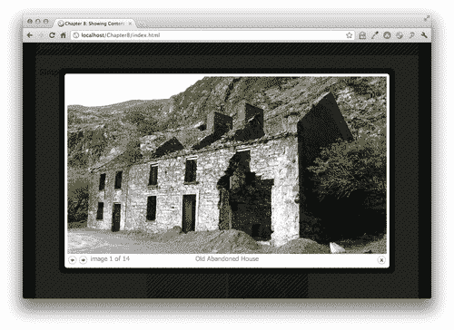

# 操作时间 — 设置简单相册

我们将使用 Colorbox 插件创建一个简单的相册，我们将逐步进行：

1.  我们将开始设置一个基本的 HTML 页面和相关文件和文件夹，就像我们在 第一章 中所做的那样，*设计师，见到 jQuery*。HTML 文档的主体将包含缩略图列表：

    ```js
    <ul class="thumb-list">
    <li><a href="images/abandoned-house.jpg" title="Old Abandoned House" rel="ireland"></a></li>
    <li><a href="images/cemetary.jpg" title="Celtic Cemetary with Celtic Crosses" rel="ireland"></a></li>
    <li><a href="images/cliffs-of-moher.jpg" title="Cliffs of Moher" rel="ireland"></a></li>
    <li><a href="images/dublin.jpg" title="River Liffey in Dublin" rel="ireland"></a></li>
    <li><a href="images/dun-aonghasa.jpg" title="Dun Aonghasa on Inis More" rel="ireland"></a></li>
    <li><a href="images/falling-in.jpg" title="Warning Sign" rel="ireland"></a></li>
    <li><a href="images/guagan-barra.jpg" title="Guagan Barra" rel="ireland"></a></li>
    <li><a href="images/inis-more.jpg" title="Stone Fences on Inis More" rel="ireland"></a></li>
    <li><a href="images/inis-more2.jpg" title="Cliffs on Inis More's West Coast" rel="ireland"></a></li>
    <li><a href="images/inis-more3.jpg" title="Inis More Fence" rel="ireland"></a></li>
    <li><a href="images/mizen-head.jpg" title="Crashing Waves Near Mizen Head" rel="ireland"></a></li>
    <li><a href="images/obriens-tower.jpg" title="O'Brien's Tower at the Cliffs of Moher" rel="ireland"></a></li>
    <li><a href="images/random-castle.jpg" title="Some Random Castle" rel="ireland"></a></li>
    <li><a href="images/turoe-stone.jpg" title="Turoe Stone" rel="ireland"></a></li>
    </ul>

    ```

    请注意，我们将每个缩略图都包装在到图像全尺寸版本的链接中。如果在浏览器中加载页面，你会看到页面适用于禁用 JavaScript 的用户。点击缩略图会在浏览器中打开全尺寸图像。点击后退按钮会返回到相册。

    请注意，我们还在每个链接上包含了一个 `title` 属性。对于我们的网站访问者来说，这对他们很有帮助，因为当他们用鼠标悬停在缩略图上时，它将显示图像的简短描述。但是稍后也将用于 Colorbox 插件。我们还在每个链接上包含了一个 `rel` 属性，并将其设置为 ireland。这将使我们在准备添加 Colorbox 插件魔法时很容易选择我们的爱尔兰图像组。

1.  接下来，我们将添加一些 CSS 来将图像布局在网格中。打开你的 `styles.css` 文件并添加这些样式：

    ```js
    ul.thumb-list { margin:20px 0;padding:0;text-align:center; }
    ul.thumb-list li { margin:0;padding:0;display:inline-block; }

    ```

    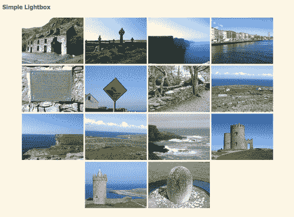

    如果你愿意的话，可以随意调整一下 CSS，为你的图片缩略图创建不同的布局。

1.  现在，让我们添加 jQuery 魔法。我们将使用 Color Powered 的 Colorbox 插件。请前往 [`jacklmoore.com/colorbox`](http://jacklmoore.com/colorbox) 查找下载、文档和演示。你会在**下载**部分找到下载链接，在页面顶部附近。只需点击当前版本号下载 ZIP 文件。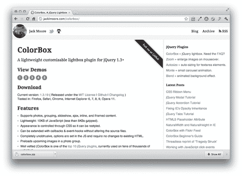

1.  解压缩文件夹并查看其内容。你会找到插件脚本文件本身，当然还有许多其他好东西。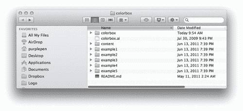

    插件代码本身位于`colorbox`文件夹中——你会找到开发和压缩版本。五个示例文件夹中每个都包含一个示例文件（`index.html`），展示了插件的作用。为什么有五个不同的文件夹？每个文件夹包含相同的基本示例，但 Colorbox 有五种不同的外观。这些相同的示例可以在 Colorbox 网站上点击网站上**查看演示**部分中的数字来查看。

    开箱即用，插件的开发人员为我们提供了五种不同的 Colorbox 外观和感觉的可能性。如果这还不够选择，他们还包含了一个包含用于创建这五种不同外观的所有图像资产的`colorbox.ai`（**Adobe Illustrator**）文件。您可以随心所欲地自定义它们，然后从 Illustrator 中导出您的新完全自定义外观，以创建您自己的外观。更改颜色和特效非常简单，但请记住，如果更改图像资产的大小和形状，您将不得不修改相应的 CSS 文件以适应新的大小。

1.  尝试每个不同的示例，无论是在网站上还是使用 ZIP 下载中包含的示例文件，并注意外观、大小、前进和后退按钮的位置、关闭按钮、标题、分页指示器（图像 1/3）等都是通过 CSS 而不是插件代码本身控制的。这使得定制外观和感觉非常容易——所有这些都是通过 CSS 而不是 JavaScript 完成的。

1.  在 ZIP 下载中，在`colorbox`文件夹中，你会找到插件代码一个名为`jquery.colorbox-min.js`的文件。将此文件复制到你自己的`scripts`文件夹中。

1.  我们将从选择提供的 CSS 外观中开始。选择你喜欢的外观，然后将其 CSS 文件复制粘贴到你自己的`styles`文件夹中。打开该 CSS 外观的`images`文件夹，并将该文件夹中的图像复制粘贴到你自己的`images`文件夹中。一旦你选择了一个外观，你自己的设置应该如下所示：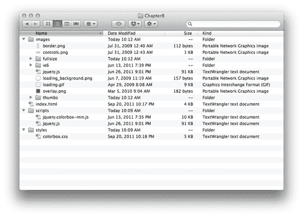

    `index.html`文件包含了链接到全尺寸版本的缩略图图像的 HTML。`images`文件夹包含了与我选择的 Colorbox 外观提供的图像以及我的幻灯片秀的自己的图像，包括缩略图和全尺寸版本。我的`scripts`文件夹包含了 jQuery（`jquery.js`）和 Colorbox 插件脚本（`jquery.colorbox-min.js`）。我的`styles`文件夹包含了我选择的 Colorbox 外观的 CSS 文件。

1.  我们必须打开 `colorbox.css` 进行一组微小的编辑。在示例文件中，CSS 文件不在 `styles` 或 `css` 文件夹中，而是与 `index.html` 文件一样位于顶层。我们选择遵循我们的首选约定，并将我们的 CSS 存储在我们的 `styles` 文件夹中。这意味着我们将不得不打开 `colorbox.css` 文件并更新 CSS 中的图像引用。我将不得不替换以下引用：

    ```js
    #cboxTopLeft{width:21px; height:21px; background:url(images/controls.png) no-repeat -100px 0;}

    ```

    具有以下引用：

    ```js
    #cboxTopLeft{width:21px; height:21px; background:url(../images/controls.png) no-repeat -100px 0;}

    ```

    我只是告诉 CSS 向上一级查找，然后查找 `images` 文件夹。您应该可以通过使用文本编辑器的查找和替换功能快速替换所有这些内容。

1.  接下来，打开您的 `index.html` 文件，并在您自己的 `styles.css` 之前的 head 部分附加 `colorbox.css` 文件：

    ```js
    <head>
    <title>Chapter 8: Showing Content in Lightboxes</title>
    <link rel="stylesheet" href="styles/colorbox.css"/>
    <link rel="stylesheet" href="styles/styles.css"/>
    </head>

    ```

1.  然后，在文件底部，在关闭`</body>`标签之前，将 Colorbox 插件附加在 jQuery 之后，但在您自己的 `scripts.js` 文件之前：

    ```js
    <script src="img/jquery.js"></script>
    <script src="img/jquery.colorbox-min.js"></script>
    <script src="img/scripts.js"></script>

    ```

1.  现在，记住我们在每个链接上包含的 `rel="ireland"` 属性吗？我们将在 JavaScript 中使用它来选择 Colorbox 插件的所有爱尔兰图片链接。打开您的 `scripts.js` 文件，并在文档就绪语句中编写属性选择器，以选择具有 `rel` 属性等于 `ireland` 的所有链接：

    ```js
    $(document).ready(function(){
    $('a[rel="ireland"]')
    });

    ```

1.  唯一剩下的事情就是在这些链接上调用 `colorbox()` 方法，Colorbox 插件会为我们处理其他所有事情：

    ```js
    <script type="text/javascript">
    $('a[rel="ireland"]').colorbox();
    </script>

    ```

    现在，如果您在浏览器中打开页面并单击缩略图图像之一，您将看到全尺寸图像在 Colorbox 中打开。您可以通过后退和前进按钮在所有全尺寸图像之间导航，而无需关闭灯箱。您还可以通过在键盘上按左右箭头键之间移动图像。分页指示器可帮助您查看您在照片集合中的位置。您还会注意到，每个链接上包含的 `title` 属性被重新用作每个图像的图像标题。可以通过单击关闭按钮、单击 Colorbox 外部或按键盘上的 Esc 键来关闭 Colorbox。总的来说，这是一个非常好的开箱即用的体验。

## 刚刚发生了什么？

我们使用 Colorbox jQuery 插件将图像链接列表转换为灯箱，让站点访问者能够在不离开页面的情况下浏览全尺寸图像。我们使用链接的 `title` 属性为图像提供标题。我们使用插件提供的五种 Colorbox 样式之一来创建一个设计良好的灯箱。

# 自定义 Colorbox 的行为

如果您查看 Colorbox 网站的 **Settings** 部分，您会看到有很多选项可以自定义 Colorbox 的行为方式。让我们看看如何利用其中一些选项。对于本节，我们将继续使用上一节设置的文件。

## 过渡

首先，我们将尝试不同的可用过渡效果。默认过渡效果是`elastic`。如果您的全尺寸图像尺寸各不相同，您会发现 Colorbox 使用一个漂亮的调整大小动画来在它们之间进行过渡。过渡的其他选项包括`fade`和`none`。让我们看看如何修改过渡。

# 行动时间 —— 使用自定义过渡

按照以下步骤更改图片之间的默认过渡效果：

1.  对于这个例子，我们将看一下如何使用`fade`过渡。打开您的`scripts.js`文件。我们所要做的就是将`fade`值传递给`colorbox()`方法的过渡关键字，如下所示：

    ```js
    $(document).ready(function(){
    $('a[rel="ireland"]').colorbox({transition:'fade'});
    });

    ```

    请注意，我们在括号内添加了一些花括号。在这些花括号内，我们可以传递键/值对以定制 Colorbox 的不同方面。在这种情况下，关键字是`transition`，值是'fade'。

    如果您在浏览器中重新加载页面，点击其中一个缩略图，然后点击下一个和上一个按钮来浏览图片，您会发现 Colorbox 在每张图片之间淡出然后淡入。

1.  如果我们决定完全取消过渡会怎样？我们只需将`transition`关键字的值更改为`'none'`即可：

    ```js
    $(document).ready(function(){
    $('a[rel="ireland"]').colorbox({transition:'none'});
    });

    ```

    现在，如果您在浏览器中刷新页面，您会发现图片之间没有任何过渡效果。

## 刚才发生了什么？

我们看到了如何利用 Colorbox 插件中的一个可用设置，并修改了当我们的网站访问者浏览图片时的过渡效果。

## 固定大小

在加载到 Colorbox 中的照片尺寸差异很大的情况下，您可能会决定所有调整大小会使网站访问者分心，您想为 Colorbox 设置一个固定大小。这也很容易做到，只需再传入几个键/值对即可。浏览文档，您会发现有很多用于控制 Colorbox 宽度和高度的设置。为了保持简单，我们将使用`width`和`height`。

# 行动时间 —— 设置固定大小

按照以下步骤为 Colorbox 设置固定宽度和高度：

1.  打开您的`scripts.js`文件。我们将对我们的代码进行一些更改，为 Colorbox 设置固定的`width`和`height`：

    ```js
    $('a[rel="ireland"]').colorbox({
    transition: 'none',
    width: '90%',
    height: '60%'
    });

    ```

    现在，如果您在浏览器中刷新页面，您会发现 Colorbox 保持相同的大小。无论图像或浏览器窗口的大小如何，Colorbox 始终会填充浏览器窗口宽度的 90%和高度的 60%。如果图像过大，图像内部会按比例调整大小以适应可用空间。

## 刚才发生了什么？

我们将`width`和`height`设置为百分比值。如果你有可能比您站点访问者的浏览器窗口还大的大照片，这是一个非常有用的选项。将`width`和`height`设置为百分比值可以确保在这种情况下，Colorbox 将是站点访问者浏览器窗口宽度的 90%，高度的 60%，无论浏览器窗口的大小是多少。这样，如果浏览器窗口很小，站点访问者仍然能够看到完整的照片。

Colorbox 还为宽度和高度提供了一些其他设置：

### innerWidth/innerHeight

这些键为 Colorbox 内部内容提供了`width`和`height`值，而不是为 Colorbox 本身提供。在您知道实际内容的确切宽度和高度的情况下，例如视频播放器，这可能很有帮助。

### InitialWidth/initialHeight

Colorbox 非常灵活，可以用于各种不同的内容（我们马上就会看到）。设置`intialWidth`和`initialHeight`允许您在加载任何内容之前控制 Colorbox 的大小。如果通过 Ajax 加载内容，可能需要一些时间才能加载到 Colorbox 中。设置`initialWidth`和`initialHeight`允许您指定在等待内容加载时 Colorbox 应该有多大。

### maxWidth/maxHeight

这些键允许您为 Colorbox 设置最大宽度和最大高度。如果内容较小，则框将在屏幕上显示为较小的尺寸。但是当您加载较大的内容时，它们不会超过您指定的`maxWidth`和`maxHeight` 值。例如，如果您想为各种大小的图像设置 Colorbox，您可以允许 Colorbox 在图像之间使用淡入淡出或弹性过渡来调整大小，但是设置`maxWidth`和`maxHeight`可以确保较大的图像不会超过站点访问者的浏览器窗口。

## 创建一个幻灯片

Colorbox 还为我们提供了一个选项，可以自动循环显示所有图片，这样站点访问者就不必不断点击下一个按钮来查看它们。

# 行动时间——创建幻灯片

我们可以将我们的灯箱图片库变成幻灯片的方法如下：

1.  打开`scripts.js`。我们将向我们的设置添加另一个键/值对。要在我们的 Colorbox 中创建幻灯片，将`slideshow`键设置为`true`：

    ```js
    $('a[rel="ireland"]').colorbox({
    transition: 'none',
    width: '90%',
    height: '60%',
    slideshow: true
    });

    ```

    现在，如果您在浏览器中刷新页面，您会看到在您打开 Colorbox 后，它会自动循环显示图片，使用您选择的任何转换效果。提供一个链接，以便站点访问者随时可以停止幻灯片：

    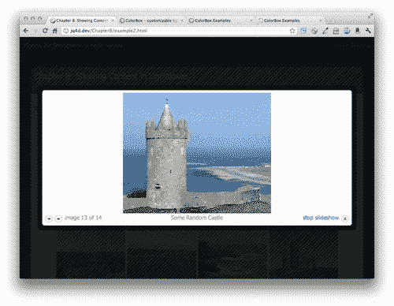

1.  Colorbox 提供了更多我们可以用来控制幻灯片演示的键。我们可以为 `slideshowSpeed` 提供一个值来设置每张照片显示的毫秒数。如果我们不想要幻灯片自动播放，我们可以将 `slideshowAuto` 设置为 `false`。我们可以通过为 `slideshowStart` 和 `slideshowStop` 键传入值来更改链接中显示的启动和停止幻灯片的文本，分别如下所示：

    ```js
    $('a[rel="ireland"]').colorbox({
    transition: 'none',
    width: '90%',
    height: '60%',
    slideshow: true,
    slideshowSpeed: 2000,
    slideshowAuto: false,
    slideshowStart: 'Let\'s get started!',
    slideshowStop: 'Ok, that\'s enough.'

    ```

    通过这段代码，我们设置了我们的幻灯片演示每张照片显示 2 秒（2000 毫秒），不自动启动幻灯片演示，并定制了启动和停止幻灯片的链接上的文本。

    请注意，每个键/值对之间用逗号分隔，但是在最后一个键/值对后面没有逗号。在 Internet Explorer 中，最后一个后面没有逗号只是很重要 —— 如果你在 Internet Explorer 中意外地在最后一个键/值对后面放了一个逗号，它会抛出一个错误，你的 JavaScript 将无法工作。其他浏览器会忽略该错误并继续优雅地工作。在将工作提供给公众之前，请始终在 Internet Explorer 中测试您的工作。

    让我们谈一谈出现在我想用于启动和停止幻灯片演示的链接文本中的 \'。由于这些是字符串，我必须将它们用引号括起来，可以是 ' 单引号也可以是 " 双引号，并且是个人偏好选择哪个。如果我想在我的字符串中使用引号，我必须转义它们 —— 这是 JavaScript 说我必须告诉 JavaScript 那些是我的字符串的一部分而不是 JavaScript 应该注意的字符的方式。

    如果我按照这种方式编写我的字符串：

    ```js
    slideshowStart: 'Let's get started!'

    ```

    这将导致错误。就 JavaScript 而言，Let's 中的 ' 是字符串的结束单引号 —— 而 JavaScript 不知道如何处理行的其余部分。

    在这种情况下，如果我的个人偏好是使用双引号来编写字符串，我就不需要做任何事情。这将是完全可以接受的：

    ```js
    slideshowStart: "Let's get started!"

    ```

    由于我们在字符串周围使用双引号，JavaScript 不会意外地将其读取为我们字符串的结尾。一旦 JavaScript 看到一个开头的 " 字符，它就会自动寻找匹配的结尾 " 字符。

    现在我们已经定制了我们的幻灯片演示，在浏览器中刷新页面并点击一个图片缩略图来打开 Colorbox。唯一可见的区别是添加了**让我们开始吧**链接。点击它启动幻灯片演示并将链接更改为说好了，这样我们就可以停止幻灯片演示。

## 刚刚发生了什么？

我们看到了如何创建和定制幻灯片演示。我们通过向 `colorbox()` 方法传递一系列键/值对来获取简单的灯箱照片库并进行定制。

# 炫酷的登录

使用 lightbox 来显示图片和幻灯片已经足够好了，但是 Colorbox 比这更有能力和灵活。在本节中，我们将看看如何在 Colorbox 中显示一个登录表单。请注意，我们的登录表单没有连接到任何东西，在示例情况下实际上不会起作用。但是这个相同的技术可以应用于一个动态站点，让你的站点访客可以在 lightbox 中查看登录表单。

# 执行操作-创建一个花哨的登录表单

按照以下步骤在 lightbox 中创建一个登录表单：

1.  我们将开始设置一个 HTML 页面和相关的文件和文件夹，就像我们在第一章中所做的那样，*Designer, Meet jQuery*。我们的 HTML 页面将包含一个显示登录表单的标题。通常情况下，站点允许人们从站点的任何页面登录：

    ```js
    <div id="example-header">
    <h1>Ireland: The Emerald Isle</h1>
    <form action="#" id="login-form">
    <div><label for="username">Username:</label> <input type="text" id="username"/></div>
    <div><label for="password">Password:</label> <input type="text" id="password"/></div>
    <div><input type="submit" value="Log In"/></div>
    </form>
    </div>

    ```

1.  接下来，我们将打开`styles.css`并添加一些 CSS，以便标题显示在左侧，表单显示在右侧：

    ```js
    #example-header { border-bottom:2px solid #586E75; border-top:2px solid #586E75;overflow:hidden;zoom:1; }
    #example-header h1 { float:left;padding:0;margin:0; }
    #example-header #login-form { float:right;padding-top:15px; }
    #example-header #login-form div { display:inline; }
    #login-link { display:block;float:right;padding-top:15px; }
    #login-link:focus { outline:none; }

    ```

    如果你在浏览器中查看页面，你会看到以下内容：

    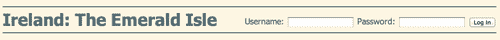

    对于没有启用 JavaScript 的用户来说，这是完全可以接受的-他们可以从任何页面登录到网站。但我认为这有点凌乱。所以如果网站访问者启用了 JavaScript，我们将隐藏登录表单，并在网站访问者准备登录时在 Colorbox 中显示它。

1.  接下来，我们将准备使用 Colorbox 插件，方式与我们在上一节中所做的一样：选择一个提供的 Colorbox 样式，并将其样式表附加到文档的头部，将所有必需的图片移动到你的`image`目录并更新 CSS 中的图片路径，并将 Colorbox 插件附加到文档的底部，在 jQuery 和我们的`scripts.js`标签之间。

1.  一旦所有这些都搞定了，我们就可以开始编写我们的 JavaScript 了。打开`scripts.js`并编写你的文档就绪语句：

    ```js
    $(document).ready(function(){
    //Our code goes here
    });

    ```

1.  我们要做的第一件事是隐藏登录表单。我们将使用 JavaScript 而不是 CSS 来做到这一点，因为我们希望对于没有启用 JavaScript 的网站访问者来说，登录表单是可见的。我们希望在页面加载后立即隐藏表单，所以我们将在文档的`ready()`方法内编写我们的隐藏代码：

    ```js
    $(document).ready(function(){
    var form = $('#login-form');
    form.hide()
    });

    ```

    你会注意到我们创建了一个名为`form`的变量，并用它来存储表单的 jQuery 选择器。我们将不得不在我们的代码中多次引用登录表单。我们可以每次想要选择登录表单时都写`$('#login-form')`，但是每次，jQuery 都要重新查找 DOM 页面来找到它。如果我们将它存储在一个变量中，我们的代码将运行得更快，更高效，因为 jQuery 不必每次引用它时都查找登录表单。

    如果你在浏览器中刷新页面，你会发现登录表单已经消失了。

1.  但是现在我们需要一个让网站访问者能够再次显示它以便登录的方法。我们将使用 jQuery 在页面上添加一个登录链接，它将出现在表单原来的位置：

    ```js
    $(document).ready(function(){
    var form = $('#login-form');
    form.hide()
    form.before('<a href="#login-form" id="login-link">Login</a>');
    });

    ```

    已经，我们再次提到了表单 —— 在表单之前插入登录链接。我们已经在 CSS 中包含了一些样式，来样式化链接并将其显示在我们想要的位置。如果你在浏览器中刷新页面，你会看到登录表单被一个登录链接替换了：

    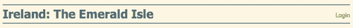

1.  但是点击登录链接没有任何反应。让我们通过添加一些 Colorbox 魔法来解决这个问题。我们将选择我们的登录链接，并调用 `colorbox()` 方法，如下所示：

    ```js
    $(document).ready(function(){
    var form = $('#login-form');
    form.hide()
    $('#login-form').before('<a href="#login-form" id="login-link">Login</a>');
    $('#login-link').colorbox();
    });

    ```

    刷新浏览器页面，然后尝试点击链接。嗯... 这不是我们想要的结果，对吧？我们必须告诉 Colorbox 我们想加载一些已经在页面上的内容。

1.  我们已经在链接的 `href` 属性中放置了登录表单的引用，所以我们会利用这一点。我们将向 `colorbox()` 方法传递一些键值对，告诉 Colorbox 我们想加载一些已经在页面上的内容，并确切地指定我们想要显示的内容：

    ```js
    $(document).ready(function(){
    var form = $('#login-form');
    form.hide()
    $('#login-form').before('<a href="#login-form" id="login-link">Login</a>');
    $('#login-link').colorbox({
    inline: true,
    content: $(this).attr('href')
    });
    });

    ```

    刷新浏览器页面，你会看到 Colorbox 打开了，但是它似乎是空的。那是因为我们隐藏了我们的表单。它已经加载到了 Colorbox 中，但是被隐藏了。

1.  我们将使用另一个键值对来告诉 Colorbox 在 Colorbox 打开时显示表单：

    ```js
    $(document).ready(function(){
    var form = $('#login-form');
    form.hide()
    $('#login-form').before('<a href="#login-form" id="login-link">Login</a>');
    $('#login-link').colorbox({
    inline: true,
    content: $(this).attr('href'),
    onOpen: function(){form.show();}
    });
    });

    ```

    `onOpen` 是 Colorbox 插件提供的键之一。它允许我们编写一个函数，该函数将在 Colorbox 打开时运行。在这种情况下，我将找到我的表单并显示它。现在，如果你在浏览器中刷新页面，你将能够在 ColorBox 中看到表单如下：

    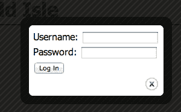

1.  这看起来已经足够好了，我们稍后会用一点 CSS 来修饰一下，让它看起来更好一些。但是当你关闭 Colorbox 时会发生什么？那个讨厌的登录表单又出现在头部了。所以我们会向我们的 `colorbox()` 方法传递另一个键值对，在 Colorbox 关闭时隐藏表单：

    ```js
    $(document).ready(function(){
    var form = $('#login-form');
    form.hide()
    $('#login-form').before('<a href="#login-form" id="login-link">Login</a>');
    $('#login-link').colorbox({
    inline: true,
    content: $(this).attr('href'),
    onOpen: function(){form.show();},
    onCleanup: function(){form.hide();},
    });
    });

    ```

    这将确保我们的表单在 Colorbox 关闭时被隐藏，这样它就不会再次出现在头部。

1.  现在，让我们让我们的登录表单看起来更友好一些。打开 `styles.css` 文件，然后添加一些 CSS，样式化光箱内的登录表单：

    ```js
    #cboxContent form div { padding:5px 0; }
    #cboxContent label { display:block; }
    #cboxContent input[type='text'] { font-size:1.2em;padding:5px;width:342px;border:1px solid #ccc;box-shadow:inset 2px 2px 2px #ddd;border-radius:5px; }
    #cboxContent input[type='submit'] { font-size:1.2em;padding:10px; }

    ```

1.  我们还希望将登录表单框变宽一点，所以我们会向 `colorbox()` 方法传递一个 `width` 键，如下所示：

    ```js
    $(document).ready(function(){
    var form = $('#login-form');
    form.hide()
    form.before('<a href="#login-form" id="login-link">Login</a>');
    $('#login-link').colorbox({
    width: '400px',
    inline: true,
    content: $(this).attr('href'),
    onOpen: function(){form.show();},
    onCleanup: function(){form.hide();},
    });
    });

    ```

    现在，如果你在浏览器中刷新页面，你会看到我们的 Colorbox 确实是 400 像素宽，我们的登录表单已经采用了我们想要的用 CSS 创建的漂亮的块状外观，但还有一个小问题。我们的表单对于 Colorbox 来说太高了：

    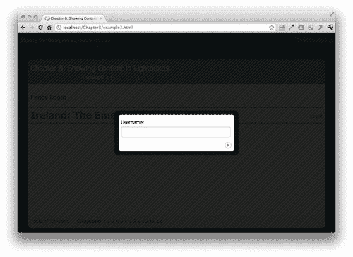

    Colorbox 脚本并没有意识到我们的表单在显示在 Colorbox 内部时具有不同的 CSS —— 它仍然期望表单的高度与在标题中显示时的高度相同。但是，该表单要小得多。如果你把鼠标放在登录表单上并向下滚动，你会看到剩下的登录表单在那里 —— 我们只是看不到它。

1.  我们不希望在我们的 Colorbox 中出现任何滚动，所以我们将关闭它，并通过向 `colorbox()` 方法传递一些额外的键/值对告诉 Colorbox 调整大小以适应其内容：

    ```js
    $(document).ready(function(){
    var form = $('#login-form');
    form.hide()
    form.before('<a href="#login-form" id="login-link">Login</a>');
    $('#login-link').colorbox({
    width: '400px',
    inline: true,
    scrolling: false,
    content: $(this).attr('href'),
    onOpen: function(){form.show();},
    onComplete: function(){$.colorbox.resize();},
    onCleanup: function(){form.hide();},
    });
    });

    ```

    滚动键允许我们关闭 Colorbox 内部的任何滚动，并且 `onComplete` 键是一个回调函数，在内容加载到 Colorbox 中后立即调用。一旦内容加载到 Colorbox 中，我们将调用一个 Colorbox 插件提供给我们的方法来调整 Colorbox 的大小以容纳其内容。

    现在，如果你在浏览器中刷新页面，你会看到 Colorbox 滑动打开以适应我们表单的新 CSS 而变得更高。完美！

    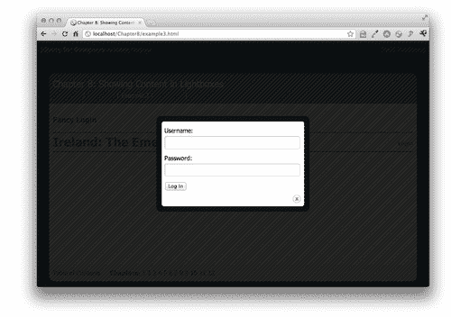

## 刚刚发生了什么？

我们学会了如何将简单的标题登录表单更改为在单击时在 Colorbox 中打开登录表单的登录链接。我们通过将回调函数传递给 Colorbox 插件文档中指定的键的值来解决了此方法可能引起的任何潜在问题。我们学会了在 Colorbox 打开时调用函数、当内容加载到 Colorbox 中时以及当 Colorbox 关闭时运行函数。我们学会了通过调用 `$.colorbox.resize()` 方法强制 Colorbox 调整大小以适应其当前内容。

# 视频播放器

Colorbox 是足够灵活的，可以用来显示视频播放器作为内容。我们将链接到一个 YouTube 视频，然后添加一些 Colorbox 魔法来在 Colorbox 中显示视频。请注意，此示例使用了 Ajax，因此只有在上传文件到服务器或在您自己的计算机上创建服务器时才会起作用。

# 操作时间 — 在灯箱中显示视频

按照以下步骤设置 Colorbox 以播放一组视频：

1.  我们将像通常一样开始，通过设置一个基本的 HTML 文件和关联的文件和文件夹，就像我们在第一章中所做的那样，*设计师，见 jQuery*。在我们 HTML 文档的主体中，我们将包含一个指向 YouTube 视频的链接：

    ```js
    <p><a href="http://www.youtube.com/embed/2_HXUhShhmY?autoplay=1" id="video-link">Watch the video</a></p>

    ```

    注意关于我的视频链接的一些事情。首先，我使用的是视频的嵌入式 URL，而不是指向 YouTube 视频页面的链接。对于未启用 JavaScript 的用户，这将把他们带到 YouTube 网站上的独立视频播放器页面。对于启用了 JavaScript 的用户，这将确保只有视频播放器加载到 Colorbox 中，而不是完整的 YouTube 视频页面。其次，我向视频的 URL 添加了一个参数，将`autoplay`设置为 1。这是在访问者查看页面时如何使嵌入式 YouTube 视频自动播放的方法。通常情况下，自动播放视频是一个不好的主意，但在这种情况下，用户已经点击了一个标有 **观看视频** 的链接，所以他们很可能在点击链接后期待视频播放。

1.  接下来，就像迄今为止的其他 Colorbox 示例一样，您需要在文档的头部附加您选择的 Colorbox 皮肤 CSS 文件，确保图像可用，如果需要的话，请更新 CSS 中图像的路径，并最后在文档的底部附加 Colorbox 插件。

1.  现在，我们将打开我们的`scripts.js`文件，并准备好编写我们的自定义 JavaScript。我们将从文档就绪语句开始：

    ```js
    $(document).ready(function(){
    });

    ```

1.  接下来，我们将选择视频链接并调用`colorbox()`方法：

    ```js
    $(document).ready(function(){
    $('#video-link').colorbox();
    });

    ```

    但是，如果我们在浏览器中刷新页面并尝试查看视频，我们会收到一个错误。那是因为我们试图通过 Ajax 加载视频，由于浏览器的安全限制，我们不能对不同服务器进行异步请求。在这种情况下，我们试图调用 [`youtube.com`](http://youtube.com)，但这不是我们 Colorbox 页面托管的地方，所以浏览器阻止了我们的请求。

1.  幸运的是，我们可以创建一个`iframe`并将我们的外部内容加载到`iframe`中。而且幸运的是，Colorbox 提供了一种让我们轻松实现这一点的方法。我们只需向`colorbox()`方法传递一个键/值对，将`iframe`设置为`true`，就像下面这样：

    ```js
    $('#video-link').colorbox({
    iframe: true
    });

    ```

    现在我们的视频加载到了 Colorbox 中，但是 Colorbox 不知道我们的视频有多大，所以我们看不到它。

1.  我们必须告诉 Colorbox 我们期望视频播放器有多大。我们将通过为`innerWidth`和`innerHeight`传递键/值对来实现这一点。在这种情况下，我们使用`innerWidth`和`innerHeight`而不是宽度和高度，因为我们传递的是我们想要视频播放器（或内容）的大小，而不是我们想要 Colorbox 的大小：

    ```js
    $('#video-link').colorbox({
    iframe: true,
    innerWidth: '640px',
    innerHeight: '480px'
    });

    ```

1.  我们还可以使用 Colorbox 创建一种让用户轻松查看多个视频的方式。让我们回到`index.html`，而不是只添加一个视频链接，我们将在页面上添加一个收藏视频的列表。我们为每个视频设置一个`rel`属性为`favorites`，并提供一个`title`属性，这样我们的视频就会在下面显示标题：

    ```js
    <h3>Favorite Videos</h3>
    <ul>
    <li><a href="http://www.youtube.com/embed/itn8TwFCO4M?autoplay=1" rel="favorites" title="Louis CK and Everything is Amazing">Everything is Amazing</a></li>
    <li><a href="http://www.youtube.com/embed/UN0A6h9Wc5c?autoplay=1" rel="favorites" title="All This Beauty by The Weepies">All This Beauty</a></li>
    <li><a href="http://www.youtube.com/embed/ZWtZA-ZmOAM?autoplay=1" rel="favorites" title="ABC's That's Incredible">That's Incredible</a></li>
    </ul>

    ```

1.  我们在`scripts.js`中唯一需要更新的是更新选择器。我们不再通过 ID 选择单个链接，而是通过它们的`rel`属性选择我们的一组收藏链接：

    ```js
    $('a[rel="favorites"]').colorbox({
    iframe:true,
    innerWidth:'640px',
    innerHeight: '480px'
    })

    ```

    如果您在浏览器中查看页面，您会发现在视频下有一个标题，并且有下一个和上一个按钮，允许您在不关闭 Colorbox 的情况下在视频之间导航。

1.  唯一有点尴尬的是，当我们显示视频而不是图像时，我们的分页指示器显示“图像 1/3”。幸运的是，Colorbox 提供了一种让我们使用`current`键自定义此文本的方法：

    ```js
    $('a[rel="favorites"]').colorbox({
    iframe:true,
    innerWidth:'640px',
    innerHeight: '480px',
    current: 'Video {current} of {total}'
    })

    ```

    现在，我们的分页指示器正确显示为 Video 1 of 3。我们的网站访客可以轻松地从一个视频转移到另一个视频，而不必关闭 Colorbox，每个视频都显示标题：

    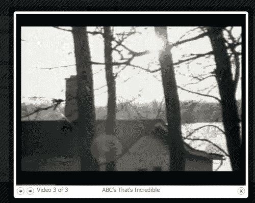

## 刚刚发生了什么？

我们学会了如何在 Colorbox 中创建独立的视频播放器和多个视频播放器。我们学会了传递键/值对以告诉 Colorbox 在`iframe`中加载外部内容，以解决跨域 Ajax 限制。我们还学会了如何修改分页指示器文本以适应我们当前的内容类型。我们使用了`innerWidth`和`innerHeight`键来设置视频播放器的大小。

# 单页网页画廊

接下来，我们将看看如何创建一个单页网页画廊，展示你喜欢的网站或你自己设计的所有令人难以置信的网站。请注意，此示例使用了 Ajax，因此您必须将您的页面上传到网络服务器，或者在您自己的计算机上创建一个网络服务器才能看到其运行情况。

# 行动时间——创建一个单页网页画廊

按照以下步骤创建一个单页网页画廊：

1.  我们将从设置一个基本的 HTML 文件和相关文件和文件夹开始，就像我们在第一章中所做的那样，*设计师，遇见 jQuery*。在我们的 HTML 文档的主体中，我们将创建一个链接列表，链接到我们想在我们的设计画廊中包含的网站：

    ```js
    <h3>One-Page Web Design Gallery</h3>
    <ul>
    <li><a href="http://packtpub.com" rel="gallery">Packt Publishing</a></li>
    <li><a href="http://nataliemac.com" rel="gallery">NatalieMac</a></li>
    <li><a href="http://google.com" rel="gallery">Google</a></li>
    </ul>

    ```

    请注意，我为每个链接都添加了等于`gallery`的`rel`属性。

1.  现在，就像其他 Colorbox 示例一样，选择一个样式并将样式表附加到文档的头部，在页面中使所有必要的图像可用，如果需要更新 CSS 中图像的路径，并在页面底部附加 Colorbox 插件。

1.  接下来，我们将打开我们的`scripts.js`文件并添加我们的文档就绪语句：

    ```js
    $(document).ready(function(){
    });

    ```

1.  接下来，我们将选择所有`rel`属性等于`gallery`的链接，并调用`colorbox()`方法：

    ```js
    $(document).ready(function(){
    $('a[rel="gallery"]').colorbox();
    });

    ```

1.  就像我们在视频示例中所做的一样，我们将`iframe`键设置为`true`，因为我们正在从其他域加载内容。我还将 ColorBox 的`width`和`height`设置为`90％`，这样它几乎占据了整个浏览器窗口。我还将调整分页指示器文本，将其更改为`Web Site`，而不是`Image:`。

    ```js
    $('a[rel="gallery"]').colorbox({
    iframe: true,
    width: '90%',
    height: '90%',
    current: 'Web Site {current} of {total}'
    });

    ```

    现在，如果您在浏览器中刷新页面，您会发现单击其中一个链接会打开一个 Colorbox 并将该网站加载到 Colorbox 中。网站访客可以与加载的网站进行交互，就像他们将其加载到单独的浏览器窗口中一样，浏览页面等。完成一个站点后，他们可以单击下一个箭头访问列表中的下一个网站，然后在完成时单击键盘上的 Esc 键或单击关闭按钮或单击 Colorbox 外部的任何地方关闭 Colorbox。

### 注意

请注意，网站所有者有可能阻止您将其网站加载到 `iframe` 中的能力。如果您使用 MAMP 或 WAMP 设置了本地服务器，那么您可能会注意到 Google 示例无法加载到您的页面中。但是，如果您将代码上传到外部服务器，则可以加载。务必测试您要在网站图库中使用的所有站点，以确保它们按预期工作。

## 刚刚发生了什么？

我们利用创建 Colorbox 视频播放器所学到的大部分内容来在 Colorbox 中显示外部网站。这允许我们的网站访客在不离开我们的页面的情况下浏览一系列网站。我们再次告诉 Colorbox 将我们的内容加载到 `iframe` 中，以解决跨域 Ajax 限制。我们自定义了分页指示器文本，并为 Colorbox 设置了宽度和高度。

# 总结

我们已经看过了适应性和灵活性的颜色框插件的几种用法，它可以用来在灯箱中显示任何类型的内容。它可用于创建可浏览的图像库，提供对表单和视频播放器的访问，而不会在页面上堆积笨重的 UI 元素，甚至可以创建可浏览的网站图库。颜色框插件完全由 CSS 样式化，使得灯箱可以呈现您想象出的任何外观。该插件甚至包括可用作创建自己的灯箱设计起点的矢量图像资源。通过向 `colorbox()` 方法传递一系列键值对，可以修改灯箱的行为，使得 Colorbox 插件适用于任何可能的灯箱用途。

接下来，我们将看一下另一个常见的网站任务：创建幻灯片演示。
