# 第十章：在走廊和幻灯片中显示内容

> 除了幻灯片秀，我们还可以在滑块和走马灯中展示图像和文本。一次可以显示一个或多个幻灯片，并使用滑动动画在幻灯片之间进行转换。走马灯非常适合创建特色内容滑块或在较小空间内提供许多图像。我们将查看 Jan Sorgalla 的灵活和可定制的 jCarousel 插件以及如何使用它创建几种不同类型的走马灯和滑块解决方案。

在本章中，我们将学习以下主题：

+   使用 jCarousel 插件创建基本的水平滑块

+   创建垂直新闻滚动条

+   创建具有外部控件的特色内容滑块

+   将幻灯片秀与缩略图走马灯相结合

# 基本 jCarousel

让我们首先看看如何创建基本的水平图像缩略图走马灯。jCarousel 插件包括两种不同的皮肤，因此设置基本的走马灯非常快速和简单。

以下截图是使用该插件附带的 tango 皮肤创建的基本走马灯的示例：

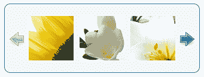

走廊中有十几张缩略图图像。单击其中一侧箭头将走廊左右滑动以显示下一组。

# 执行操作 — 创建基本走马灯

遵循以下步骤设置基本的图像 jCarousel：

1.  与往常一样，我们将从我们的 HTML 开始。像在 第一章 中一样，设置一个基本的 HTML 文档和相关的文件和文件夹。在 HTML 文档的主体中，创建一个图像的无序列表。当图像具有统一大小时，走马灯效果最佳。我的图像大小为 200 像素宽，150 像素高。以下是我的 HTML 外观：

    ```js
    <ul id="thumb-carousel">
    <li></li>
    <li></li>
    <li></li>
    <li></li>
    <li></li>
    <li></li>
    <li></li>
    <li></li>
    <li></li>
    <li></li>
    <li></li>
    <li></li>
    </ul>

    ```

    你可以看到我给无序列表分配了一个 `id` 为 `thumb-carousel`，HTML 简单明了：只是一系列图像的列表。

1.  接下来，我们需要下载 jCarousel 插件。该插件可以从 GitHub 下载：[`github.com/jsor/jcarousel`](http://https://github.com/jsor/jcarousel)。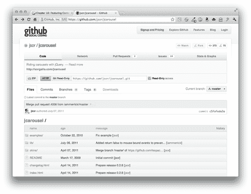

    要下载插件，只需单击 **ZIP** 按钮。

1.  接下来，解压文件夹并查看其内容。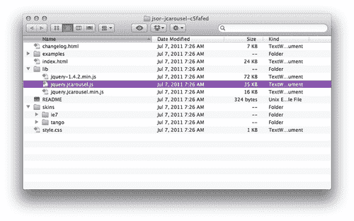

    在内部，我们会找到一个名为 examples 的文件夹，其中包含许多 jCarousel 插件示例。有一个包含插件文档的 `index.html` 文件。一个 `skins` 文件夹包含插件附带的两种皮肤以及这些皮肤所需的图像。最后，一个 `lib` 文件夹包含 jQuery，以及 jCarousel 插件的两个副本之一经过压缩的版本。

1.  我们将使用 `tango` 样式和插件的压缩版本。将 `jquery.jcarousel.min.js` 复制到你自己的 `scripts` 文件夹，并将整个 `tango` 文件夹复制到你自己的 `styles` 文件夹。

1.  接下来，我们需要将 CSS 和 JavaScript 附加到我们的 HTML 文件中。在文档的 `<head>` 部分，将 tango 样式的 CSS 文件附加在你自己的 `styles.css` 文件之前：

    ```js
    <link rel="stylesheet" href="styles/tango/skin.css"/>
    <link rel="stylesheet" href="styles/styles.css"/>

    ```

1.  在文档底部，在闭合的 `</body>` 标签之前，在你自己的 `scripts.js` 之后，附加 jCarousel 插件文件：

    ```js
    <script src="img/jquery.js"></script>
    <script src="img/jquery.jcarousel.min.js"></script>
    <script src="img/scripts.js"></script>

    ```

1.  jCarousel 滑块的 tango 样式依赖于放置在列表包装器上的 `jcarousel-skin-tango` 类。用 `div` 标签将列表包装起来，并给 `div` 添加适当的类：

    ```js
    <div class="jcarousel-skin-tango">
    <ul id="thumb-carousel">
    ...
    </ul>
    </div>

    ```

1.  接下来我们要做的是设置我们自己的 JavaScript。打开你的 `scripts.js` 文件。在文档上调用 `ready` 方法，选择图像列表，并调用 `jcarousel()` 方法：

    ```js
    $(document).ready(function(){
    $('#thumb-carousel').jcarousel();
    });

    ```

    像往常一样，以这种方式调用 `jcarousel()` 方法将加载所有默认设置的轮播。在浏览器中刷新页面，你会看到这样的情况：

    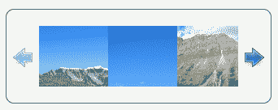

    不完全是我们想象中的样子，但是点击右侧的下一个箭头会推进轮播。让我们来看看如何设置一些自定义设置，以便按照我们预期查看完整的图像。

1.  tango 样式的 CSS 假设我们的图像宽度为 `75` 像素，高度也为 `75` 像素，但实际上我们的轮播不是这样的。我们将在我们的 `styles.css` 中添加几行 CSS 来调整图像的大小。首先，我们将指定单个项目的宽度和高度：

    ```js
    .jcarousel-skin-tango .jcarousel-item { width:200px;height:150px;}

    ```

1.  我们还需要调整轮播容器和剪辑容器的整体大小：

    ```js
    .jcarousel-skin-tango .jcarousel-clip-horizontal { width:830px;height:150px;}
    .jcarousel-skin-tango .jcarousel-container-horizontal { width:830px; }

    ```

    你可能会想知道那个 `830px` 宽度是从哪里来的。每个项目宽度为 `200` 像素，每个图像之间有 `10` 个像素。

    `200 + 10 + 200 + 10 + 200 + 10 + 200 = 830`

    图像和它们之间的间隙的总宽度为 `830` 像素。

1.  接下来，我们需要将下一个和上一个按钮往下移一点，因为我们的轮播比默认的要高，而按钮显示得太高了：

    ```js
    .jcarousel-skin-tango .jcarousel-prev-horizontal,
    .jcarousel-skin-tango .jcarousel-next-horizontal { top:75px; }

    ```

    现在轮播看起来正是我们想要的样子：

    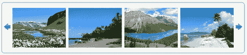

1.  最后，我们将对 jCarousel 插件本身的设置进行一些调整。像许多其他插件一样，我们可以通过在一对花括号内传递一组键/值对给 `jcarousel()` 方法来进行自定义。首先，让我们将 `scroll` 值更改为 `4`，这样每次按下下一个或上一个按钮时会滚动四个项目。回到你的 `scripts.js` 文件，并将新的键/值对添加到你的脚本中，如下所示：

    ```js
    $('#thumb-carousel').jcarousel({
    scroll: 4
    });

    ```

    接下来，轮播图当前在到达开头或结尾时会硬性停止。相反，我们将使轮播图环绕 —— 如果站点访客正在查看轮播图中的最后一个项目并按下下一个按钮，则轮播图将回到开头。如果在查看第一个项目时单击后退按钮，情况也是如此。我们将为`wrap`键添加一个`'both'`值，以便轮播图将在两端环绕：

    ```js
    $('#thumb-carousel').jcarousel({
    scroll: 4,
    wrap: 'both'
    });

    ```

    在浏览器中刷新页面，然后使用下一个或上一个按钮或两者的任意组合来翻页轮播图。这就是使用 jCarousel 插件创建简单轮播图的全部内容。

## 刚刚发生了什么？

我们使用 jCarousel 插件创建了一个基本的动画图像缩略图轮播图。我们使用插件中包含的一个默认外观，并通过 CSS 对我们的内容大小进行调整。一些简单的定制被传递给轮播图，以确保它按照我们想要的方式工作。

# 动画新闻滚动条

水平图像轮播图很好，但使用范围相当有限。幸运的是，jCarousel 插件足够灵活，可以用于各种不同的用途。在本节中，我们将学习如何创建一个动画新闻滚动条。

# 行动时间 —— 创建动画新闻滚动条

按照以下步骤设置垂直新闻列表：

1.  首先，我们将像在第一章中所做的那样设置基本的 HTML 文件和相关文件和文件夹。在 HTML 文档的正文中，创建一个新闻项目的无序列表。每个新闻项目都将包含一个图片和一个包含标题和摘要的 div：

    ```js
    <ul id="news-carousel">
    <li>
    
    <div class="info">
    <h4>Switzerland</h4>
    <p>Switzerland, officially the Swiss Confederation, is a federal republic consisting of 26 cantons, with Bern as the seat of the federal authorities</p>
    </div>
    </li>
    <li>
    
    <div class="info">
    <h4>Costa Rica</h4>
    <p>Costa Rica, officially the Republic of Costa Rica, is a country in Central America, bordered by Nicaragua to the north, Panama to the south, the Pacific Ocean to the west and south and the Caribbean Sea to the east.</p>
    </div>
    </li>
    ...
    </ul>

    ```

    我在我的列表中总共创建了 12 个项目，每个项目都具有相同的结构。请记住，轮播图中的每个项目必须具有相同的宽度和高度。

1.  接下来，我们将打开我们的`styles.css`文件，并添加一些 CSS 代码以使每个新闻项目都以我们希望的方式进行样式设置，其中图片在左侧，标题和摘要在右侧：

    ```js
    #news-carousel li { overflow:hidden;zoom:1;list-style-type:none; }
    #news-carousel li img { float:left; }
    #news-carousel li .info { margin-left:210px; }
    #news-carousel h4 { margin:0;padding:0; }
    #news-carousel p { margin:0;padding:0;font-size:14px; }

    ```

    随意添加一些额外的 CSS 来样式化列表以适应您自己的口味。如果您在浏览器中打开页面，此时，您可以期望看到类似以下截图的内容：

    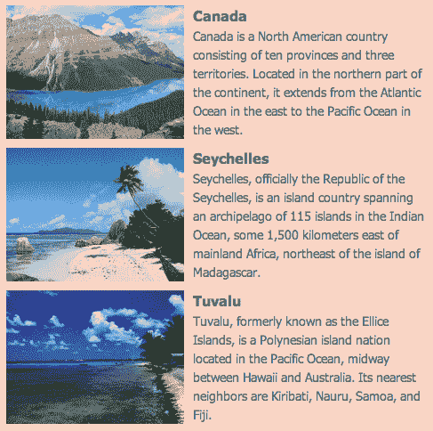

1.  正如我们在简单轮播图示例中所做的那样，我们将在文档的`<head>`部分附加 tango 皮肤的 CSS，而在 jQuery 和我们自己的`scripts.js`文件之间，在文档底部附加 jCarousel 插件脚本。

1.  接下来，打开您的`scripts.js`文件。我们将编写我们的文档准备语句，选择我们的新闻滚动条，并调用`jcarousel()`方法，就像我们在上一个示例中所做的那样。

    ```js
    $(document).ready(function(){
    $('#news-carousel').jcarousel();
    });

    ```

1.  我们将一些定制选项传递给`jcarousel()`方法，以调整我们的轮播图以满足我们的需求。首先，它应该是垂直的而不是水平的，所以将`true`作为`vertical`键的值传递进去：

    ```js
    $('#news-carousel').jcarousel({
    vertical:true
    });

    ```

1.  我们还希望每次滚动一个项目：

    ```js
    $('#news-carousel').jcarousel({
    vertical:true,
    scroll:1
    });

    ```

1.  还有，我们希望新闻项目列表可以无限循环，如下所示：

    ```js
    $('#news-carousel').jcarousel({
    vertical:true,
    scroll:1,
    wrap:'circular'
    });

    ```

1.  我们希望轮播图以真正的新闻滚动条方式自动播放新闻故事。我们将每三秒推进一次轮播图：

    ```js
    $('#news-carousel').jcarousel({
    vertical:true,
    scroll:1,
    wrap:'circular',
    auto: 3
    });

    ```

1.  最后但同样重要的是，我们会将动画速度减慢一点，这样在动画触发时，如果我们的网站访客正在阅读，就不会那么令人不适。600 毫秒应该足够慢了：

    ```js
    $('#news-carousel').jcarousel({
    vertical:true,
    scroll:1,
    wrap:'circular',
    auto: 3,
    animation: 600
    });

    ```

1.  现在 jCarousel 已经按我们喜欢的方式配置好了，唯一剩下的就是自定义轮播图的外观了。我们目前使用的是默认的探戈皮肤，它仍然假设我们的单个项目宽度为 75 像素，高度为 75 像素。打开你的`styles.css`文件，我们将从调整必要的宽度和高度开始：

    ```js
    .jcarousel-skin-tango .jcarousel-item { width:475px;height:150px; }
    .jcarousel-skin-tango .jcarousel-clip-vertical { width:475px;height:470px; }
    .jcarousel-skin-tango .jcarousel-container-vertical { height:470px;width:475px; }

    ```

    我们将单个项目的大小设置为 475 像素宽，150 像素高。然后调整容器和裁剪容器的大小以显示三个项目。提醒一下——因为我们的轮播图中每个项目的高度为 150 像素，项目之间还有 10 像素的间距，我们可以如下计算容器的高度：

    150 + 10 + 150 + 10 + 150 = 470 像素

    我们在计算时使用高度而不是宽度，因为我们的轮播图现在是垂直的，而不是水平的。

1.  接下来，我们将调整探戈风格，以适应我的网站设计。我将从用橙色换掉容器的淡蓝色方案开始，调整圆角使其变得不那么圆滑：

    ```js
    .jcarousel-skin-tango .jcarousel-container { -moz-border-radius: 5px;-webkit-border-radius:5px;border-radius:5px;border-color:#CB4B16;background:#f9d4c5; }

    ```

1.  现在，让我们将探戈皮肤的小蓝色箭头替换为横跨整个轮播图宽度的长橙色条。我已经创建了自己的箭头图形，我将在每个按钮的中间显示：

    ```js
    .jcarousel-skin-tango .jcarousel-prev-vertical,
    .jcarousel-skin-tango .jcarousel-next-vertical { left:0;right:0;width:auto; }
    .jcarousel-skin-tango .jcarousel-prev-vertical { top:0;background:#cb4b16 url(images/arrows.png) 50% 0 no-repeat; }
    .jcarousel-skin-tango .jcarousel-prev-vertical:hover,
    .jcarousel-skin-tango .jcarousel-prev-vertical:focus { background-color:#e6581d;background-position:50% 0; }
    .jcarousel-skin-tango .jcarousel-next-vertical { background:#cb4b16 url(images/arrows.png) 50% -32px no-repeat;bottom:0; }
    .jcarousel-skin-tango .jcarousel-next-vertical:hover,
    .jcarousel-skin-tango .jcarousel-next-vertical:focus { background-color:#e6581d;background-position:50% -32px; }

    ```

    现在，如果你在浏览器中刷新页面，你会看到轮播图以不同的颜色方案和外观重新设计了一些：

    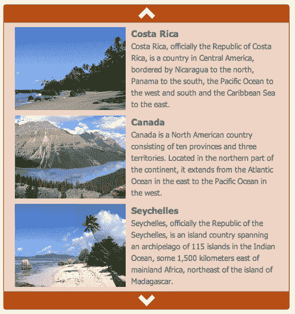

    将鼠标移动到顶部或底部的条上会稍微提亮颜色，点击条将使轮播图朝着那个方向推进一个项目。

## 刚刚发生了什么？

在这种情况下，我们使用 jCarousel 插件创建了一个垂直新闻滚动条。我们的新闻滚动条每三秒自动推进一次项目。我们减慢了动画速度，以便为我们的网站访客提供更流畅的阅读体验。我们还看到了如何自定义探戈皮肤的 CSS 来适应轮播图的颜色方案和外观，以适应我们网站的设计。接下来，我们将看看如何为轮播图添加一些外部控件。

## 尝试一下吧——设计您自己的轮播图

现在你已经看到如何自定义 jCarousel 插件的外观和行为，设计你自己的轮播图吧。它可以是水平或垂直的，包含文本、图片或两者的组合。试验一下 jCarousel 插件提供给你的设置——你会在插件的文档中找到它们的列表和解释。

# 特色内容滑块

除了一次显示多个项目的轮播图之外，jCarousel 还可以用于构建一次仅显示一个项目的内容滑块。还可以构建外部控制，以为您的轮播图增加一些额外的功能。让我们看看如何创建一个具有外部分页控件的单个幻灯片特色内容滑块。

# 行动时间 — 创建特色内容滑块

我们将像往常一样，首先设置我们基本的 HTML 文件和相关的文件和文件夹，就像我们在第一章，《设计师，见识 jQuery》中所做的那样。

1.  在 HTML 文档的主体中，我们的特色内容滑块的 HTML 标记将与我们为新闻滚动条设置的 HTML 非常相似。唯一的区别是我用更大的图片替换了图片，因为我希望图片成为滑块的主要焦点。我使用的图片尺寸为 600 像素宽，400 像素高。以下是 HTML 的示例：

    ```js
    <div class="jcarousel-skin-slider">
    <ul id="featured-carousel">
    <li>
    <a href="#"></a>
    <div class="info">
    <h4>Switzerland</h4>
    <p>Switzerland, officially the Swiss Confederation, is a federal republic consisting of 26 cantons, with Bern as the seat of the federal authorities</p>
    </div>
    </li>
    <li>
    <a href="#"></a>
    <div class="info">
    <h4>Costa Rica</h4>
    <p>Costa Rica, officially the Republic of Costa Rica, is a country in Central America, bordered by Nicaragua to the north, Panama to the south, the Pacific Ocean to the west and south and the Caribbean Sea to the east.</p>
    </div>
    </li>
    ...
    </ul>
    </div>

    ```

    我的列表总共有 12 个条目，每个条目的标记就像你在这里看到的那样。注意，我将我的列表包装在一个带有类`jcarousel-skin-slider`的`div`中。我们将使用这个类来使用 CSS 对我们的列表进行样式设置。

1.  接下来，我们将为我们的项目列表设置样式。我们将在照片上叠加标题和文本段落，头部位于顶部，文本段落位于底部。以下是我们可以使用的 CSS：

    ```js
    #featured-carousel li { overflow:hidden;list-style-type:none;position:relative;width:600px;height:400px; }
    #featured-carousel h4 { position:absolute;top:0;left:0;right:0;padding:10px;margin:0;color:#000;font-size:36px;text-shadow:#fff 0 0 1px; }
    #featured-carousel p { position:absolute;bottom:0;left:0;right:0;padding:10px;margin:0;color:#fff;background:#000;background:rgba(0,0,0,0.7); }

    ```

    现在，我的列表中的每个项目看起来都类似于以下的屏幕截图：

    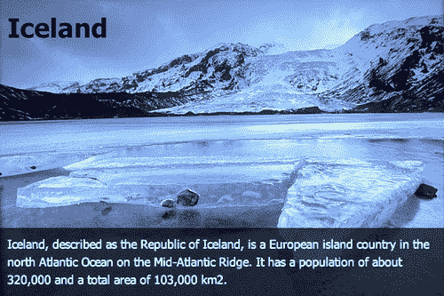

    我想要引起你对我在这里使用了一些方便的 CSS 技巧的注意。首先，请注意我给标题添加了一小段白色的`text-shadow`，并且将标题文本设为黑色。以防这段文本碰巧悬停在图片的黑色区域上，文本周围微妙的白色轮廓将帮助文本更加突出。然后，请注意，我为短段文本添加了两个背景值。第一个是纯黑色，第二个是使用`rgba`值表示的透明黑色。第一个值是针对 IE9 之前的版本的 Internet Explorer。这些浏览器将显示纯黑色的背景。更新的和更有能力的浏览器将使用第二个值，`rgba`值，在文本的后面显示略微透明的黑色背景—这样图片可以透过一点，同时使文本更易读。

1.  现在，我们将会在页面底部，在 jQuery 和我们的`scripts.js`文件之间，附加 jCarousel JavaScript，就像我们在本章其他示例中所做的那样。

    ```js
    <script src="img/jquery.js"></script>
    <script src="img/jquery.jcarousel.min.js"></script>
    <script src="img/scripts.js"></script>

    ```

1.  现在我们要写一些 CSS 来自定义我们的内容滑块的外观。打开你的`styles.css`文件并添加以下样式：

    ```js
    .jcarousel-skin-slider .jcarousel-container-horizontal { width: 600px; }
    .jcarousel-skin-slider .jcarousel-clip { overflow: hidden; }
    .jcarousel-skin-slider .jcarousel-clip-horizontal { width:600px;height:425px; }
    .jcarousel-skin-slider .jcarousel-item { width:600px;height:400px; }

    ```

    这就是全部了。只需几行代码。我们将设置单个项目、容器和剪辑容器的宽度为 600 像素，与一个图像的宽度相同。单个项目的高度也设置为 400 像素，但我们将把剪辑容器的高度设置为 425 像素，以便为我们添加一些外部控件提供 25 像素的空间，稍后我们会看到这些控件。

1.  现在，打开你的`scripts.js`文件。我们首先要做的是选择我们的列表并将其存储在一个变量中。这是因为我们将多次使用列表，并且我们不希望 jQuery 每次都要查询 DOM 来查找我们的列表。

    ```js
    var slider = $('#featured-carousel');

    ```

1.  接下来，我们将设置我们的文档就绪语句，并在滑块上调用`jcarousel()`方法，并告诉它我们要一次滚动一个窗格。

    ```js
    var slider = $('#featured-carousel');
    $(document).ready(function(){
    slider.jcarousel({
    scroll: 1
    });
    });

    ```

1.  我们将添加我们自己的外部控件，因此我们需要删除`jcarousel()`方法自己创建的控件。我们可以这样做：

    ```js
    $(document).ready(function(){
    slider.jcarousel({
    scroll: 1,
    buttonNextHTML: null,
    buttonPrevHTML: null	
    });
    });

    ```

    提供了`buttonNextHTML`和`buttonPrevHTML`键，以便您可以为这些按钮指定自己的 HTML 标记。在这种情况下，我们将为这两个键传递`null`作为值，这将阻止它们被创建。

    现在我们已经完成了设置幻灯片放映器的基本操作。如果你在浏览器中查看页面，你会看到第一张幻灯片。我们还没有提供导航到其他幻灯片的方法，所以让我们立即解决这个问题。

    

## 分页控件

我们设置了一个基本的滑块，一次显示一个项目，但你肯定已经注意到除了第一个之外，没有办法查看任何幻灯片。我们删除了 jCarousel 的默认下一个和上一个按钮，并且我们还没有提供任何替代方法。让我们添加一些分页控件，这样我们的网站访问者就可以查看任何他们喜欢的幻灯片。

# 行动时间 —— 添加分页控件

接下来，我们要设置一个函数，该函数将创建下一个按钮、上一个按钮和分页按钮，并使它们起作用。

1.  jCarousel 插件提供了一个名为`initCallback`的键，它允许我们传递一个应在轮播创建时调用的函数的名称。让我们通过创建一个空函数并调用它来开始：

    ```js
    var slider = $('#featured-carousel');
    function carouselInit(carousel) {
    // Our function goes here
    }
    $(document).ready(function(){
    slider.jcarousel({
    scroll: 1,
    buttonNextHTML: null,
    buttonPrevHTML: null,
    initCallback: carouselInit	
    });
    });

    ```

    我们在`carouselInit()`函数中写的任何操作都将在轮播初始化或设置时执行。由于只有在启用 JavaScript 时，任何页码、上一个和下一个按钮才会起作用，所以我们想使用 JavaScript 动态创建这些按钮，而不是在 HTML 中编码它们。让我们看看如何创建一个包含滑块中每个幻灯片的页面链接列表。

1.  我们将从获取滑块中的所有幻灯片开始。请记住，我们的滑块是一个无序列表，滑块中的每个幻灯片都是列表中的一个单独列表项。由于我们已经保存了对滑块本身的引用，因此我们可以如下获取其中的所有幻灯片：

    ```js
    function carouselInit(carousel) {
    var slides = slider.find('li');
    }

    ```

1.  我们将在稍后使用这些幻灯片来创建页面数字。但与此同时，我们需要一个放置页面数字的地方，所以让我们在幻灯片之前创建一些容器，这样我们的分页将显示在幻灯片正上方。下面是如何在幻灯片之前插入两个嵌套的`<div>`标签：

    ```js
    function carouselInit(carousel) {
    var slides = slider.find('li');
    slider.before('<span id="page-controls"><span id="pages"></span></span>');
    }

    ```

1.  接下来，我们需要在我们的代码中几次引用这两个新创建的容器，所以我们将在变量中存储对它们的引用，如下面的代码所示：

    ```js
    function carouselInit(carousel) {
    var slides = slider.find('li');
    slider.before('<span id="page-controls"><span id="pages"></span></span>');
    var controls = $('#page-controls');
    var pages = $('#pages');
    }

    ```

1.  现在，我们要高级一点，为幻灯片中的每一页创建一个页码。以下是我们要添加的代码：

    ```js
    function carouselInit(carousel) {
    var slides = slider.find('li');
    slider.before('<span id="page-controls"><span id="pages"></span></span>');
    var controls = $('#page-controls');
    var pages = $('#pages');
    for (i=1; i<=slides.length; i++) {
    pages.append('<a href="#">' + i + '</a>');
    }
    }

    ```

    我们从`i = 1`开始，因为第一页的页码将是 1。然后我们检查`i`是否小于或等于幻灯片的数量（`slides.length`是幻灯片的数量）。如果`i`小于或等于幻灯片的数量，我们将递增 i 一个数字——基本上我们将把 1 添加到`i`上，而`i++`是 JavaScript 中表示`i = i+1`的快捷方式。

    在每次循环中，我们都将在我们创建的页面容器中附加一个链接。它是围绕页码的链接，i 代表我们的页码。

    如果此时在浏览器中刷新页面，你将看到链接到幻灯片秀上面的数字 1 到 12。它们没有样式，并且点击它们不会做任何事情，因为我们还没有设置——这就是我们接下来要做的。

    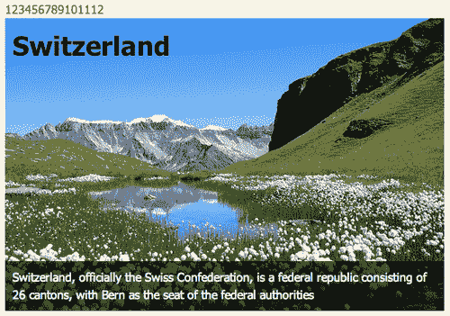

1.  接下来，我们要样式化链接，使它们看起来我们想要的样子。打开你的`styles.css`文件，添加下面几行到 CSS 中：

    ```js
    #page-controls { line-height:25px;height:25px; }
    #page-controls a { margin:0 4px 0 0;padding:0 5px;border:1px solid #859900; }
    #page-controls a:hover { border-color: #D33682; }
    #page-controls a.current { color:#333;border-color:#333; }

    ```

    这将我们的幻灯片控制行的高度设置为之前允许的 25 个像素。然后我们在每个链接周围放置了一个绿色边框，当鼠标悬停在链接上时，它会变成粉红色边框。我们调整了边距和填充以获得间隔良好的盒子行。最后，我们为我们的链接添加了一个`.current`类，以便我们能够用深灰色标记当前选择的链接。

    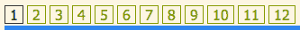

1.  好的，我们已经将页面数字添加到我们的文档中，所以我们所要做的就是让它们起作用。我们将为这些链接绑定一个点击函数，因为当我们的网站访客点击链接时我们希望发生一些事情。我们将如下开始：

    ```js
    function carouselInit(carousel) {
    var slides = slider.find('li');
    slider.before('<span id="page-controls"><span id="pages"></span></span>');
    var controls = $('#page-controls');
    var pages = $('#pages');
    for (i=1; i<=slides.length; i++) {
    pages.append('<a href="#">' + i + '</a>');
    }
    pages.find('a').bind('click', function(){
    //click code will go here
    });
    }

    ```

1.  函数内的第一件事是取消点击的默认操作，这样浏览器在点击链接时不会尝试执行自己的操作。

    ```js
    function carouselInit(carousel) {
    var slides = slider.find('li');
    slider.before('<span id="page-controls"><span id="pages"></span></span>');
    var controls = $('#page-controls');
    var pages = $('#pages');
    for (i=1; i<=slides.length; i++) {
    pages.append('<a href="#">' + i + '</a>');
    }
    pages.find('a').bind('click', function(){
    return false;
    });
    }

    ```

1.  jCarousel 插件为我们提供了一个很好的方法来滚动到幻灯片中的特定幻灯片。看起来是这样的：

    ```js
    carousel.scroll($.jcarousel.intval(number));

    ```

    结尾附近的`number`s 是我们将要传递的幻灯片编号。例如，如果我们想滚动到第六张幻灯片，我们会这样说：

    ```js
    carousel.scroll($.jcarousel.intval(6));

    ```

    在我们的情况下，我们要滚动到的数字幻灯片是链接中的页码。例如，如果我点击以下链接：

    ```js
    <a href="#">3</a>

    ```

    这意味着我想要滚动到幻灯片中的第三张幻灯片。我可以使用 jQuery 的`text()`方法来获得该数字，如下所示：

    ```js
    pages.find('a').bind('click', function(){
    carousel.scroll($.jcarousel.intval($(this).text()));
    return false;
    });

    ```

    如果我点击第四个链接，`$(this).text()`将等于 4；点击第七个链接，它将等于 7，以此类推。

    在浏览器中刷新页面，你会看到点击编号链接会将滑块滚动到该幻灯片。

1.  点击页码时，您可能已经注意到当前页码未在分页中突出显示。我们已经编写了用于突出显示具有`current`类的链接的 CSS —— 现在我们只需确保我们正在向当前链接添加该类即可。以下是我们将如何做到这一点的方法。

    ```js
    pages.find('a').bind('click', function(){
    carousel.scroll($.jcarousel.intval($(this).text()));
    $(this).addClass('current');
    return false;
    });

    ```

    现在，如果你在浏览器中刷新页面，你会发现点击页码会将`current`类 CSS 应用于链接，突出显示它。然而，点击第二个页码会突出显示该链接以及上一个链接。我们必须确保我们也从旧链接中移除类。添加以下行来处理这个问题：

    ```js
    pages.find('a').bind('click', function(){
    carousel.scroll($.jcarousel.intval($(this).text()));
    $(this).siblings('.current').removeClass('current');
    $(this).addClass('current');
    return false;
    });

    ```

    此行检查所有链接的兄弟节点，查找是否有任何具有当前类的链接。如果找到任何一个，就移除该类。

1.  现在，我们只需确保在轮播初始化时突出显示第一个链接即可。最简单的方法就是在创建轮播时简单地点击分页中的第一个链接，如下所示：

    ```js
    pages.find('a').bind('click', function(){
    carousel.scroll($.jcarousel.intval($(this).text()));
    $(this).siblings('.current').removeClass('current');
    $(this).addClass('current');
    return false;
    }).filter(':first').click();

    ```

    记住，jQuery 允许我们链式调用方法——即使我们在`bind()`方法内写了一个完整的函数，我们仍然可以在其末尾链式调用 next 方法。我们调用`filter()`方法来将链接列表缩减为仅第一个链接，然后调用`click()`方法来触发我们刚刚绑定到链接的点击函数。

    现在，如果你在浏览器中刷新页面，你会看到第一个链接以我们当前类 CSS 突出显示。

    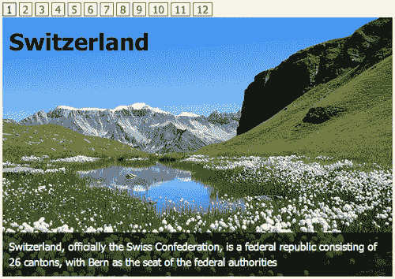

## 下一个和上一个按钮

现在我们已经设置好了幻灯片和页码，但我们还想要简单的下一个和上一个按钮，以便轻松地逐页翻阅幻灯片。我们将在分页控件的两端添加它们。

# 行动时间 —— 添加下一个和上一个按钮

现在，我们只需要添加上一个和下一个按钮即可。

1.  我们将在分页的开头添加上一个按钮，在结尾添加下一个按钮。以下是我们如何使用 jQuery 在文档中插入这些链接的方法：

    ```js
    function carouselInit(carousel) {
    var slides = slider.find('li');
    slider.before('<span id="page-controls"><span id="pages"></span></span>');
    var controls = $('#page-controls');
    var pages = $('#pages');
    for (i=1; i<=slides.length; i++) {
    pages.append('<a href="#">' + i + '</a>');
    }
    pages.find('a').bind('click', function(){
    carousel.scroll($.jcarousel.intval($(this).text()));
    $(this).siblings('.current').removeClass('current');
    $(this).addClass('current');
    return false;
    }).filter(':first').click();
    controls.prepend('<a href="#" id="prev">&laquo;</a>');
    controls.append('<a href="#" id="next">&raquo;</a>');
    }

    ```

    我已经使用`prepend()`方法将上一个按钮插入到页码之前，并使用`append()`方法将下一个按钮插入到页码之后。

    如果你在浏览器中刷新页面，你会看到下一个和上一个按钮以及我们的分页按钮显示出来。

    

    然而，点击它们不会引起任何事情发生——我们必须连接这些按钮以使它们起作用。我们从下一个按钮开始。

1.  就像分页按钮一样，我们需要绑定点击事件。同样，jCarousel 插件为我们提供了一个很好的方法来切换到下一张幻灯片。

    ```js
    function carouselInit(carousel) {
    var slides = slider.find('li');
    slider.before('<span id="page-controls"><span id="pages"></span></span>');
    var controls = $('#page-controls');
    var pages = $('#pages');
    for (i=1; i<=slides.length; i++) {
    pages.append('<a href="#">' + i + '</a>');
    }
    pages.find('a').bind('click', function(){
    carousel.scroll($.jcarousel.intval($(this).text()));
    $(this).siblings('.current').removeClass('current');
    $(this).addClass('current');
    return false;
    }).filter(':first').click();
    controls.prepend('<a href="#" id="prev">&laquo;</a>');
    controls.append('<a href="#" id="next">&raquo;</a>');
    $('#next').bind('click', function() {
    carousel.next();
    return false;
    });
    }

    ```

    我们选择下一个按钮并绑定了一个点击事件。我们取消了浏览器的默认操作，以便在单击链接时浏览器不会尝试执行任何操作。然后，我们所要做的就是调用`carousel.next()`，jCarousel 将负责帮我们前进到下一个幻灯片。

    在浏览器中刷新页面，您会发现单击下一个按钮会将滑块向前移动一个幻灯片。

    您还会注意到，分页中当前突出显示的页面未更新。让我们看看如何解决这个问题。

1.  我们将通过以下方式开始找到当前突出显示的页码：

    ```js
    $('#next').bind('click', function() {
    carousel.next();
    var current = pages.find('.current');
    return false;
    });

    ```

    在这里，我们只是在我们的页码中查找具有`current`类的页码。

1.  接下来，我们将移除`current`类，移动到下一个页面编号链接，并将`current`类添加到该链接中，如下所示：

    ```js
    current.removeClass('current').next().addClass('current');

    ```

    啊，但不要那么快，我们只想在有下一个链接要跳转时才这样做。如果没有，那么我们就什么也不想做。如果我们检查`current.next().` `length`，我们就可以判断是否有下一个链接。因此，我们只需将此代码块包装在一个`if`语句中，如下所示的代码所示：

    ```js
    if ( current.next().length ) { current.removeClass('current').next().addClass('current'); }

    ```

    现在，如果您在浏览器中刷新页面，您会发现下一个按钮按预期工作。当我们到达最后一页时，它不会做任何事情，正如我们所预期的那样。

1.  现在我们将使用与前一个按钮非常相似的函数重复整个过程。以下是它的样子：

    ```js
    $('#prev').bind('click', function(){
    carousel.prev();
    var current = pages.find('.current');
    if ( current.prev().length ) { current.removeClass('current').prev().addClass('current'); }
    return false;
    });

    ```

    这是我们完整的`carouselInit()`函数的样子：

    ```js
    function carouselInit(carousel) {
    var slides = slider.find('li');
    slider.before('<span id="page-controls"><span id="pages"></span></span>');
    var controls = $('#page-controls');
    var pages = $('#pages');
    for (i=1; i<=slides.length; i++) {
    pages.append('<a href="#">' + i + '</a>');
    }
    pages.find('a').bind('click', function(){
    carousel.scroll($.jcarousel.intval($(this).text()));
    $(this).siblings('.current').removeClass('current');
    $(this).addClass('current');
    return false;
    }).filter(':first').click();
    controls.prepend('<a href="#" id="prev">&laquo;</a>');
    controls.append('<a href="#" id="next">&raquo;</a>');
    $('#prev').bind('click', function(){
    carousel.prev();
    var current = pages.find('.current');
    if ( current.prev().length ) { current.removeClass('current').prev().addClass('current'); }
    return false;
    });
    $('#next').bind('click', function() {
    carousel.next();
    var current = pages.find('.current');
    if ( current.next().length ) { current.removeClass('current').next().addClass('current'); }
    return false;
    });
    }

    ```

    现在，如果您在浏览器中刷新页面，您会发现下一个和上一个按钮都按预期工作，连同页面编号。您可以使用这些外部控件导航到幻灯片中的任何幻灯片。

    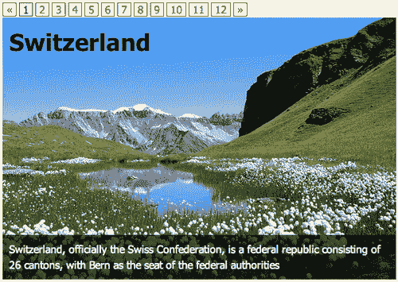

## 刚才发生了什么？

我们设置了 jCarousel 每次显示一个幻灯片。我们确保 jCarousel 没有创建自己的下一个和上一个按钮。我们使用 jQuery 向我们的文档添加了下一个、上一个和分页按钮，然后使用 jCarousel 的有用方法从这些外部控件控制幻灯片。我们确保当前显示的幻灯片在分页中突出显示，以便我们的网站访问者可以轻松地看到他们在幻灯片中的位置。

# 轮播幻灯片

现在我们已经学会了如何设置控制幻灯片的外部控件，让我们也以相同的方式设置幻灯片来控制幻灯片。在本节中，我们将创建一个简单的交叉淡入淡出幻灯片，由缩略图图像的轮播控制。以下是我们将要创建的示例的样本：

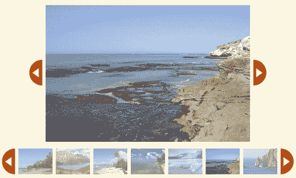

点击轮播内任何缩略图都会在幻灯片区域加载出该图像的大尺寸版本。我也在幻灯片旁边提供了下一个和上一个按钮，让网站访问者可以逐个点击图片而不必单击每个缩略图来通过幻灯片放映中途。让我们看看如何将其放在一起。

# 行动时间-创建一个缩略图幻灯片

设置轮播缩略图幻灯片将是我们使用 jCarousel 做过的最困难的事情。但不要担心，我们会一步一步来。

1.  我敢打赌，你能猜到我们要如何开始，对吧？没错，通过设置我们简单的 HTML 文件和相关的文件和文件夹，就像我们在第一章 *设计师，遇见 jQuery*中做的一样。在这种情况下，我们只想要一个简单的缩略图列表，它们链接到图像的全尺寸版本。并且我们将将其包裹在一个`<div>`中进行样式设置。这就是我的列表是什么样子的：

    ```js
    <div class="jcarousel-skin-slideshow">
    <ul id="thumb-carousel">
    <li><a href="images/600/Switzerland.jpg"></a></li>
    <li><a href="images/600/CostaRica.jpg"></a></li>
    <li><a href="images/600/Canada.jpg"></a></li>
    ...
    </ul>
    </div>

    ```

    我的列表中总共有十二个项目，并且它们都具有相同的标记。

1.  接下来，我们将为轮播图编写 CSS。这是一个定制设计，所以我们不会包含 jCarousel 提供的样式表之一。打开你的`styles.css`文件，并添加以下 CSS：

    ```js
    .jcarousel-skin-slideshow .jcarousel-container { }
    .jcarousel-skin-slideshow .jcarousel-container-horizontal { width:760px;padding:0 48px; }
    .jcarousel-skin-slideshow .jcarousel-clip { overflow:hidden; }
    .jcarousel-skin-slideshow .jcarousel-clip-horizontal { width:760px;height:75px; }
    .jcarousel-skin-slideshow .jcarousel-item { width:100px;height:75px; }
    .jcarousel-skin-slideshow .jcarousel-item-horizontal { margin-left:0;margin-right:10px; }
    .jcarousel-skin-slideshow .jcarousel-item-placeholder { background:#fff;color:#000; }
    .jcarousel-skin-slideshow .jcarousel-next-horizontal { position:absolute;top:0;right:0;width:38px;height:75px;cursor:pointer;background:transparent url(images/arrow-right.png) no-repeat 0 0; }
    .jcarousel-skin-slideshow .jcarousel-next-horizontal:hover,
    .jcarousel-skin-slideshow .jcarousel-next-horizontal:focus { background-position:0 -75px; }
    .jcarousel-skin-slideshow .jcarousel-next-horizontal:active { background-position: 0 -75px; }
    .jcarousel-skin-slideshow .jcarousel-prev-horizontal { position:absolute;top:0;left:0;width:38px;height:75px;cursor:pointer;background:transparent url(images/arrow-left.png) no-repeat 0 0; }
    .jcarousel-skin-slideshow .jcarousel-prev-horizontal:hover,
    .jcarousel-skin-slideshow .jcarousel-prev-horizontal:focus { background-position: 0 -75px; }
    .jcarousel-skin-slideshow .jcarousel-prev-horizontal:active { background-position: 0 -75px; }

    ```

    我已经创建了一个图片精灵，其中包含了我的下一个和上一个按钮的图片，并且这就是它们的背景图片所使用的。其余的部分应该看起来很熟悉 - 为每个项目和轮播图本身设置适当的尺寸。

1.  现在，我们将在文档底部，在 jQuery 和你的`scripts.js`文件之间，附加 jCarousel 插件：

    ```js
    <script src="img/jquery.js"></script>
    <script src="img/jquery.jcarousel.min.js"></script>
    <script src="img/scripts.js"></script>

    ```

1.  打开你的`scripts.js`文件，我们将通过在文档就绪语句内选择轮播并调用`jcarousel()`方法来启动我们的缩略图轮播。

    ```js
    $(document).ready(function(){
    $('#thumb-carousel').jcarousel({
    scroll: 6,
    wrap: 'circular'
    });
    });

    ```

    我们已经将值`'circular'`分配给了`wrap`键-这意味着轮播没有开始也没有结束-它将在网站访问者滚动时不断地环绕。

连续包裹很好-我们的网站访问者可以点击向前或向后的轮播按钮，无论他们身在何处，这比禁用按钮更友好一些。然而，连续滚动可能会使我们的网站访问者更难以跟踪他们在轮播中的位置。因此，尽管我们的轮播能够显示七张图片，我们已经将滚动设置为`6`。

假设我们的网站访问者正在查看我们的轮播，并且在轮播的第一个位置有一张美丽的海滩风景照片。网站访问者点击了上一个按钮，而那美丽的海滩风景照片滑过来填补了轮播的最后一个位置。在新位置看到同一张图片有助于传达刚刚发生的事情，并确保我们的网站访问者没有错过任何事情。


## 刚才发生了什么？

我们按照了我们在早期 jCarousel 示例中所做的类似步骤。设置了我们的 HTML，为轮播器编写了一些 CSS 样式，然后使用 jQuery 选择了缩略图列表，并调用了`jCarousel()`方法。现在，让我们更进一步，向我们的轮播器添加幻灯片。

## 幻灯片

现在我们已经设置好了我们想要的简单轮播器并对其进行了样式化，让我们深入了解如何添加淡入淡出幻灯片特效。

# 行动时间 — 添加幻灯片

jCarousel 插件已经为我们设置了轮播器，但我们想要变得花哨，并且还要添加一个幻灯片区域。

1.  我们现在独自一人，所以我们将为创建幻灯片区域创建一个单独的函数。然后我们将在我们的文档就绪语句中调用新函数：

    ```js
    function slideshowInit() {
    // Slideshow setup goes here
    }
    $(document).ready(function(){
    slideshowInit();
    $('#thumb-carousel').jcarousel({
    scroll: 6,
    wrap: 'circular'
    });
    });

    ```

1.  首先，我们将在缩略图列表周围包裹一个容器，以创建幻灯片区域。我们发现自己已经需要再次引用缩略图列表，所以让我们将其存储在一个变量中，并更新对`jcarousel()`方法的调用如下：

    ```js
    var thumbs = $('#thumb-carousel');
    function slideshowInit() {
    // Slideshow setup goes here
    }
    $(document).ready(function(){
    slideshowInit();
    thumbs.jcarousel({
    scroll: 6,
    wrap: 'circular'
    });
    });

    ```

1.  接下来，在`slideshowInit()`函数内部，我们将调用 jQuery 的`wrap()`方法将列表包裹在一个`<div>`中。

    ```js
    function slideshowInit() {
    thumbs.wrap('<div id="stage-wrap"></div>');
    }

    ```

1.  接下来，我们需要创建实际的舞台，全尺寸图像将在其中显示。我们还需要创建下一个和上一个按钮。我们将使用`prepend()`方法，以便这些元素在缩略图列表之前被插入到`stage-wrap div`中。

    ```js
    function slideshowInit() {
    thumbs.wrap('<div id="stage-wrap"></div>');
    $('#stage-wrap').prepend('<div id="slideshow-next"></div><div id="slideshow-prev"></div><div id="stage"></div>');
    }

    ```

1.  现在，我们将回到我们的`styles.css`文件，并为这些新元素添加一些样式，如下所示：

    ```js
    #stage-wrap { position:relative;width:856px; }
    #stage { width:600px;height:400px;padding:0 0 20px 0;position:relative;text-align:center;margin:0 128px; }
    #stage img { position:absolute;top:0;left:50%;margin-left:-300px; }
    #slideshow-next { position:absolute;right:80px;top:160px;width:38px;height:75px;cursor:pointer;background:transparent url(images/arrow-right.png) no-repeat 0 0; }
    #slideshow-next:hover,
    #slideshow-next:active { background-position:0 -75px; }
    #slideshow-prev { position:absolute;left:80px;top:160px;width:38px;height:75px;cursor:pointer;background:transparent url(images/arrow-left.png) no-repeat 0 0; }
    #slideshow-prev:hover,
    #slideshow-prev:active { background-position:0 -75px; }

    ```

    所有的全尺寸图像都是相同大小的，600x400，所以我们可以将其设置为舞台的宽度和高度，并相应地定位下一个和上一个图像按钮。如果您现在在浏览器中查看页面，您应该会看到为舞台留下的大空白区域，以及缩略图轮播器上方的下一个和上一个图像按钮，所有这些都位于其上方。

    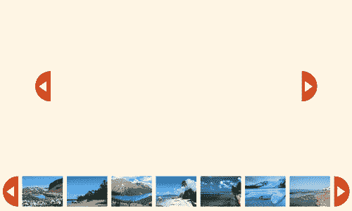

1.  我们有一个轮播器，我们有一个空舞台，我们在舞台两侧有下一个和上一个按钮。接下来，我们将用图像幻灯片填充舞台。我们将通过设置一个变量来引用舞台，并将舞台的`opacity`设置为`0`来开始，如下所示的代码：

    ```js
    function slideshowInit() {
    thumbs.wrap('<div id="stage-wrap"></div>');
    $('#stage-wrap').prepend('<div id="slideshow-next"></div><div id="slideshow-prev"></div><div id="stage"></div>');
    var stage = $('#stage');
    stage.css('opacity',0);
    }

    ```

    我们隐藏了舞台，以便我们可以在不让站点访问者看到图像加载的情况下将图像加载到其中。这让我们能够在创建幻灯片时对其外观有一些控制。在有东西可看之前，我们将保持舞台不可见。

1.  接下来，我们需要获取所有到全尺寸图像的链接，并准备好查找每个全尺寸图像的 URL，如下所示：

    ```js
    function slideshowInit() {
    thumbs.wrap('<div id="stage-wrap"></div>');
    $('#stage-wrap').prepend('<div id="slideshow-next"></div><div id="slideshow-prev"></div><div id="stage"></div>');
    var stage = $('#stage');
    stage.css('opacity',0);
    var imageLinks = thumbs.find('a');
    var src;
    }

    ```

    全尺寸图像的链接包含在缩略图列表中，我们可以用`thumbs`变量引用它们。我们只是找到该列表中的所有链接，并将它们存储在一个名为`imageLinks`的变量中。接下来，我们设置一个名为`src`的空容器，我们将在其中存储图像的 URL。尽管目前，我们将该容器留空。我们稍后会填充它。

1.  我们有 12 个全尺寸图像的链接。对于每个链接，我们需要在舞台上创建一个新图像。我们将使用 jQuery 的`each()`方法循环遍历每个链接并创建一个图像。

    ```js
    function slideshowInit() {
    thumbs.wrap('<div id="stage-wrap"></div>');
    $('#stage-wrap').prepend('<div id="slideshow-next"></div><div id="slideshow-prev"></div><div id="stage"></div>');
    var stage = $('#stage');
    stage.css('opacity',0);
    var imageLinks = thumbs.find('a');
    var src;
    imageLinks.each(function(i) {
    // We'll create our images here
    });
    }

    ```

    这是 jQuery 的方式*说对于每个链接，执行此操作*。

1.  接下来，我们将为每个链接创建一个图像。首先，我们知道图像的`src`属性将等于链接的`href`属性。换句话说，链接如下所示：

    ```js
    <a href="images/600/Switzerland.jpg">Switzerland</a>

    ```

    将用于创建如下图像：

    ```js
    

    ```

    所以我们要做的第一件事是获取之前创建的空`src`变量，并将图像的 URL 存储在其中：

    ```js
    imageLinks.each(function(i) {
    src = $(this).attr('href');
    });

    ```

    接下来，我们将使用这个`src`属性创建一个图像。我将把我新创建的图像存储在一个名为`img`的变量中：

    ```js
    imageLinks.each(function(i) {
    src = $(this).attr('href');
    var img = $('', {
    src: src,
    css: {
    display: 'none'
    }
    });
    });

    ```

    我们将图像的显示设置为 none，以隐藏以这种方式创建的所有图像。我们已将图像的`src`属性设置为保存图像 URL 的`src`变量。

1.  现在图像已创建，我们将其添加到舞台上。

    ```js
    imageLinks.each(function(i) {
    src = $(this).attr('href');
    var img = $('', {
    src: src,
    css: {
    display: 'none'
    }
    });
    img.appendTo(stage);
    });

    ```

    jQuery 的`appendTo()`方法允许我们将图像附加到舞台上。

1.  现在舞台上充满了图像，让我们继续使其可见。

    ```js
    function slideshowInit() {
    thumbs.wrap('<div id="stage-wrap"></div>');
    $('#stage-wrap').prepend('<div id="slideshow-next"></div><div id="slideshow-prev"></div><div id="stage"></div>');
    var stage = $('#stage');
    stage.css('opacity',0);
    var imageLinks = thumbs.find('a');
    var src;
    imageLinks.each(function(i) {
    src = $(this).attr('href');
    var img = $('', {
    src: src,
    css: {
    display: 'none'
    }
    });
    img.appendTo(stage);
    });
    stage.css('opacity',1);
    }

    ```

1.  接下来，我们想要在单击轮播中的缩略图链接时在舞台上显示相应的图像。如果现在单击缩略图，你会发现它会在浏览器中打开全尺寸图像，但我们希望图像显示在舞台上。我们只需要一种方式来从轮播中的图像引用舞台上的特定图像。我们可以通过几种不同的方式来做到这一点，几乎总是有多种方法可以完成某事。在这种情况下，我们将利用 jQuery 的`data()`方法在每个缩略图链接中存储索引号。然后我将使用该索引来找到并显示适当的图像。

    基本上，我们要对列表中的链接进行编号。你可能会认为它们会被编号为 1 到 12，但请记住 JavaScript 计数从 0 开始，因此缩略图图像将被编号为 0 到 11。当单击缩略图时，我们将获取该缩略图的索引号，找到舞台上具有相同索引的图像并显示它。所以如果我们的网站访客单击缩略图编号为 6，我们将在舞台上找到编号为 6 的图像并显示它。

    首先，我们必须为缩略图分配索引号。在文档就绪声明中，添加一个小函数来循环遍历每个缩略图，并添加索引号，如下所示：

    ```js
    $(document).ready(function(){
    thumbs.find('a').each(function(index){
    $(this).data('index', (index));
    });
    slideshowInit();
    thumbs.jcarousel({
    scroll: 6,
    wrap: 'circular',
    initCallback: nextPrev
    });
    });

    ```

1.  现在所有的缩略图链接都已经编号，我们可以编写一个函数，在点击缩略图时找到舞台上适当的图像并显示它。在`slideshowInit()`函数内部，我们将把我们的函数绑定到点击事件上：

    ```js
    function slideshowInit() {
    thumbs.wrap('<div id="stage-wrap"></div>');
    $('#stage-wrap').prepend('<div id="slideshow-next"></div><div id="slideshow-prev"></div><div id="stage"></div>');
    var stage = $('#stage');
    stage.css('opacity',0);
    var imageLinks = thumbs.find('a');
    var src;
    imageLinks.each(function(i) {
    src = $(this).attr('href');
    var img = $('', {
    src: src,
    css: {
    display: 'none'
    }
    });
    img.appendTo(stage);
    });
    stage.css('opacity',1);
    imageLinks.bind('click', function(){
    // Function to find and show an image goes here
    });
    }

    ```

1.  在我们的新功能内部要做的第一件事是取消浏览器的默认行为。我们不希望链接在浏览器中打开图像，所以我们会返回 false。

    ```js
    imageLinks.bind('click', function(){
    return false;
    })

    ```

1.  接下来，我们需要获取我们链接中存储的数字。我们将再次使用`data()`方法来找到这个数字：

    ```js
    imageLinks.bind('click', function(){
    var index = $(this).data('index');
    return false;
    })

    ```

1.  现在，我们需要在舞台上搜索具有该索引号的图像。我将把图像存储在一个名为`nextImage`的变量中，因为它将是要显示的下一个图像。

    ```js
    imageLinks.bind('click', function(){
    var index = $(this).data('index');
    var nextImage = stage.find('img:eq(' + index + ')');
    })

    ```

    jQuery 允许我们使用`:eq`选择器按索引号查找元素。例如，`$('img:eq(1)')`选择器会选择图像列表中的第二个图像。（记住，JavaScript 计数从 0 开始，而不是从 1 开始。）在这种情况下，我知道我想要哪个数字图像，因为它是刚刚点击的链接中存储的数字。

1.  现在我们已经得到了下一个图像，我们需要显示它。我们将淡入它并添加一个`active`类。

    ```js
    imageLinks.bind('click', function(){
    var index = $(this).data('index');
    var nextImage = stage.find('img:eq(' + index + ')');
    nextImage.fadeIn().addClass('active');
    return false;
    })

    ```

1.  但是不要忘记，已经有另一张图像可见。我们需要找到那张图像并将其淡出。由于我们在图像显示时添加了一个`active`类，所以我们可以通过查找具有`active`类的图像轻松找到当前显示的图像：

    ```js
    imageLinks.bind('click', function(){
    var index = $(this).data('index');
    var nextImage = stage.find('img:eq(' + index + ')');
    stage.find('img.active').fadeOut().removeClass('.active');
    nextImage.fadeIn().addClass('active');
    return false;
    })

    ```

    不要忘记，我们必须确保删除那个`active`类，以便一次只有一个图像被标记为活动状态。

如果你现在在浏览器中刷新页面，你会看到点击幻灯片缩略图链接中的任意一个会在幻灯片中加载相应的图像。一张图像淡出，而下一张图像以一种流畅的方式淡入。接下来，我们将让下一个和上一个按钮工作起来，这样我们就可以轻松地翻转到下一个图像。

## 刚才发生了什么？

哎呀！希望你还在继续跟着我，因为这是向你的网站访问者展示幻灯片的一种非常棒的方式。希望你开始意识到，有时候插件只是一个开始 — 你可以发挥创造力，发明自己的功能来叠加在默认插件行为之上。

## 下一个和上一个按钮

我们确实取得了一些不错的进展。点击缩略图会在幻灯片中加载图像的全尺寸版本，我们可以使用幻灯片控件滚动缩略图并查看它们所有。现在，让我们让下一个和上一个图像按钮起作用。

# 行动时间 —— 激活下一个和上一个按钮

接下来，我们将让围绕图像的下一个和上一个按钮工作起来，这样网站访问者可以轻松地翻阅所有的图像。

1.  就像我们在上一个示例中为幻灯片连接外部控制一样，我们将从设置幻灯片的回调函数开始。我们将函数命名为`nextPrev`并设置如下：

    ```js
    function nextPrev(carousel) {
    }
    thumbs.jcarousel({
    scroll: 6,
    wrap: 'circular',
    initCallback: nextPrev
    });

    ```

    现在`nextPrev`函数将在旋转木马初始化时被调用。

1.  在`nextPrev()`函数内部，我们将选择上一个按钮并绑定一个函数到点击事件：

    ```js
    function nextPrev(carousel) {
    $('#slideshow-prev').bind('click', function() {
    //Click code will go here
    });
    }

    ```

1.  当站点访问者点击上一个按钮时，我们希望显示幻灯片秀中的前一幅图像。与 JavaScript 一般一样，有多种方法可以实现这一点。由于我们已经设置好了一个好用的幻灯片切换功能，当旋转木马中的其中一个缩略图被点击时发生，让我们直接重复使用它。

    当我们的站点访问者点击上一个按钮时，我们会找到旋转木马中的上一个缩略图并点击它。这将启动图像过渡，并允许我们重复使用我们已经编写的代码。

    因此，我们的首要任务是找到当前选择的缩略图。但是，我们并没有简化找到当前缩略图的方法。因此，让我们回到`slideshowInit()`函数内部，并添加一行代码将一个类添加到当前的缩略图上：

    ```js
    function slideshowInit() {
    thumbs.wrap('<div id="stage-wrap"></div>');
    $('#stage-wrap').prepend('<div id="slideshow-next"></div><div id="slideshow-prev"></div><div id="stage"></div>');
    var stage = $('#stage');
    stage.css('opacity',0);
    var imageLinks = thumbs.find('a');
    var src;
    imageLinks.each(function(i) {
    src = $(this).attr('href');
    var img = $('', {
    src: src,
    css: {
    display: 'none'
    }
    });
    img.appendTo(stage);
    });
    stage.css('opacity',1);
    imageLinks.bind('click', function(){
    var index = $(this).data('index');
    $(this).parents('li').addClass('current').siblings('.current').removeClass('current');
    var nextImage = stage.find('img:eq(' + index + ')');
    stage.find('img.active').fadeOut().removeClass('.active');
    nextImage.fadeIn().addClass('active');
    return false;
    })
    }

    ```

    在这里，我们给包含点击缩略图的`<li>`标签添加了一个`current`类。然后，我们检查所有兄弟元素，以移除`current`类（如果它存在的话）。这确保了在任何给定时间内，旋转木马中只有一个项目具有`current`类。

1.  现在，如果您能给我一个分钟，我们将进行一个旁支到 CSS。由于我们正在向当前缩略图添加一个类，我们可以利用 CSS 来对当前缩略图进行样式设置，使其与其他不同。让我们打开`styles.css`并添加一些样式如下：

    ```js
    #thumb-carousel img { opacity:.5; }
    #thumb-carousel .current img { opacity:1; }

    ```

1.  回到 JavaScript！现在我们有一种简单的方法来选择当前的缩略图，我们只需找到具有`current`类的缩略图即可。在`prevNext()`函数内部，我们可以通过以下方式获取当前链接：

    ```js
    function nextPrev(carousel) {
    $('#slideshow-prev').bind('click', function() {
    var currentSlide = thumbs.find('li.current');
    });
    }

    ```

1.  由于这是附加到上一个按钮的功能，我们需要找到列表中的上一个缩略图。我将使用 jQuery 的`prev()`方法在旋转木马中找到上一个缩略图：

    ```js
    currentSlide.prev();

    ```

    然而，如果当前幻灯片是第一张，那就没有上一个幻灯片可供查看。在这种情况下，如果站点访问者在第一张幻灯片上并单击上一个按钮，我希望他们跳转到列表中的最后一张幻灯片，以便无缝续播。因此，我首先要检查是否有上一张幻灯片如下：

    ```js
    function nextPrev(carousel) {
    $('#slideshow-prev').bind('click', function() {
    var currentSlide = thumbs.find('li.current');
    var prevSlide = currentSlide.prev().length ? currentSlide.prev() : thumbs.find('li:last');
    });
    }

    ```

    这里有几件事情要解释。首先，这行代码从 JavaScript 翻译成英语说*这个缩略图之前有一个吗？如果有的话，那就是我们要去的地方。如果没有，那么我们将前往最后一个缩略图。*

    ```js
    var prevSlide;
    if (currentSlide.prev().length) {
    prevSlide = currentSlide.prev();
    } else {
    prevSlide = thumbs.find('li:last');
    }

    ```

    以下是三元运算符的工作原理：

    ```js
    condition to check ? value if true : value if false

    ```

    它以我们正在检查的条件开始，后跟一个？。之后，我们有如果该条件为真，则跟随的值，后跟一个：，以及如果该条件为假则跟随的值。

1.  现在我们找到了上一个幻灯片，剩下的就是点击其中的链接如下：

    ```js
    function nextPrev(carousel) {
    $('#slideshow-prev').bind('click', function() {
    var currentSlide = thumbs.find('li.current');
    var prevSlide = currentSlide.prev().length? currentSlide.prev() : thumbs.find('li:last');
    prevSlide.find('a').click();
    });
    }

    ```

    这将触发我们编写的在浏览器中更改幻灯片的函数。如果此时在浏览器中重新加载页面，然后点击几次前一个按钮，你会看到图片会像我们预期的那样切换。

    但是，轮播图上并没有太多的事情。它就那么呆在那里。而且马上当前选定的缩略图就看不见了。如果我点击一次前一个按钮，然后滚动轮播图，最终我才能看到高亮的缩略图。理想情况下，轮播图会更新自身，以确保当前缩略图始终可见。

1.  jCarousel 插件使我们可以轻松地滚动到轮播图中的任何幻灯片。我们只需要知道我们想要显示哪一个。jCarousel 的设置脚本的一部分还为轮播图中的每个列表项分配了一个 `jcarouselindex` 属性。我们可以获取该数字并将其用于滚动目的。首先，让我们弄清楚 `prevSlide` 的 `jcarouselindex` 是多少，因为那是我们想要滚动到的位置。

    ```js
    function nextPrev(carousel) {
    $('#slideshow-prev').bind('click', function() {
    var currentSlide = thumbs.find('li.current');
    var prevSlide = currentSlide.prev().length? currentSlide.prev() : thumbs.find('li:last');
    var index = parseInt(prevSlide.attr('jcarouselindex'));
    prevSlide.find('a').click();
    });
    }

    ```

    我使用`parseInt()`来确保我得到一个数字而不是一个字符串。如果我得到一个字符串，它可能会搞乱轮播图中的滚动。

    现在，剩下的就是滚动到正确的缩略图：

    ```js
    function nextPrev(carousel) {
    $('#slideshow-prev').bind('click', function() {
    var currentSlide = thumbs.find('li.current');
    var prevSlide = currentSlide.prev().length? currentSlide.prev() : thumbs.find('li:last');
    var index = parseInt(prevSlide.attr('jcarouselindex'));
    prevSlide.find('a').click();
    carousel.scroll(index);
    });
    }

    ```

    现在，如果你在浏览器中刷新页面，你会看到点击前一个按钮会更新轮播图——轮播图会滚动，以使当前高亮的幻灯片成为轮播图中的第一张。但是，如果我决定希望当前高亮的幻灯片出现在中间呢？很简单！我有七张幻灯片显示。如果高亮的幻灯片在中间，那么在它之前会有三张幻灯片（以及它之后的三张）。我所要做的就是告诉轮播图将高亮幻灯片的前三张幻灯片设为第一张可见的幻灯片，如下所示：

    ```js
    function nextPrev(carousel) {
    $('#slideshow-prev').bind('click', function() {
    var currentSlide = thumbs.find('li.current');
    var prevSlide = currentSlide.prev().length? currentSlide.prev() : thumbs.find('li:last');
    var index = parseInt(prevSlide.attr('jcarouselindex')) - 3;
    prevSlide.find('a').click();
    carousel.scroll(index);
    });
    }

    ```

    现在，例如，当我点击前一个按钮时，如果下一张幻灯片是第 5 张，轮播图将首先显示第 2 张，这意味着第 5 张将出现在轮播图的中间。在浏览器中刷新页面，试一试。很棒，对吧？

1.  唯一剩下的就是使下一个按钮像前一个按钮一样工作。函数几乎相同，只需做一些微调。

    ```js
    function nextPrev(carousel) {
    $('#slideshow-prev').bind('click', function() {
    var currentSlide = thumbs.find('li.current');
    var prevSlide = currentSlide.prev().length? currentSlide.prev() : thumbs.find('li:last');
    var index = parseInt(prevSlide.attr('jcarouselindex')) - 3;
    prevSlide.find('a').click();
    carousel.scroll(index);
    });
    $('#slideshow-next').bind('click', function() {
    var currentSlide = thumbs.find('li.current');
    var nextSlide = currentSlide.next().length ? currentSlide.next() : thumbs.find('li:first');
    var index = parseInt(nextSlide.attr('jcarouselindex')) - 3;
    nextSlide.find('a').click();
    carousel.scroll(index);
    });
    }

    ```

    我使用`next()`方法而不是`prev()`方法来获取下一张幻灯片而不是上一张。除此之外，函数是相同的。

现在，如果你在浏览器中刷新页面，你会看到下一个和前一个图片按钮都可以使用——它们会显示幻灯片秀中的正确图片，并滚动轮播图，以使当前图片在轮播图的中间高亮显示。

## 刚才发生了什么？

我们将一些外部的轮播控制与幻灯片放在一起，创建了一个强大的幻灯片/轮播组合。幻灯片可以从轮播控制——点击轮播中的缩略图将在幻灯片舞台中加载出完整尺寸的图像。并且点击舞台中的下一个和上一个按钮将更新轮播，滚动轮播，以便当前高亮的缩略图出现在轮播的可见区域中间。

我们从一些基本的 HTML 开始，为轮播编写了自定义的 CSS 皮肤，并调用了 `jcarousel()` 方法来使轮播工作。接下来，我们编写了一个函数来动态创建幻灯片舞台和按钮。最后，我们通过一些精巧的 jQuery 操作使它们都能协同工作。

# 总结

我们研究了在各种情况下使用 jCarousel 插件的方法，我们创建了一个简单的水平缩略图轮播，一个垂直新闻滚动条，一个带有外部控制的特色内容滑块，最后，一个展示了 jCarousel 插件功能的轮播/幻灯片组合。现在，你在工具箱中又增加了一个强大的工具——jCarousel 插件是灵活、强大的，并且可以定制以适用于各种不同的情况。

接下来，我们将看一下创建交互式数据表格。
