# 第十一章：创建交互式数据网格

> 虽然你可能认为数据网格并不那么令人兴奋，但它们确实为站点访问者提供了一种与大量数据交互并理解数据的方式，这是他们可能无法以其他方式做到的。HTML5 中最令人兴奋的发展之一是引入了网格元素，它允许我们仅使用标记就能轻松创建交互式数据网格。然而，它是新元素之一，浏览器支持落后——目前几乎没有或几乎没有任何浏览器支持，并且可能需要数年时间，我们才能利用这个新元素。幸运的是，我们可以使用 jQuery 来填补这一空白，直到新的网格元素准备就绪。

在本章中，我们将学习以下主题：

+   使用 Allan Jardine 的 DataTables jQuery 插件将普通表格转换为交互式数据网格

+   使用 jQuery UI Themeroller 对数据网格的外观和行为进行定制

# 基本数据网格

我们将使用 DataTables 插件创建一个基本的数据网格，保留默认设置和数据网格提供的样式。当我们有大量数据要呈现时，数据网格是最有帮助的，并且站点访问者可能希望以不同的方式过滤和排序数据，以找到他们正在寻找的信息。例如，想象一下航班列表——一个站点访问者可能有兴趣按出发时间对航班进行排序，以找到可能的最早出发时间，而另一个站点访问者可能想按持续时间对航班进行排序，以找到可能的最短航班。

将数据呈现为交互式数据网格允许每个站点访问者在海量信息中快速轻松地找到他们正在寻找的信息。对于禁用 JavaScript 的站点访问者，他们将只看到一张大型数据表，永远不会知道他们错过了交互式功能。所有信息仍然对他们可用。

# 行动时间——创建基本数据网格

让我们看看如何将基本的 HTML 表格转换为交互式数据网格：

1.  我们将像在第一章 *设计师，见 jQuery* 中一样，使用我们的基本 HTML 文件和相关文件和文件夹开始。我们将使用 HTML 标记来填充我们的 HTML 文档的`<body>`部分，创建一个大型数据表的 HTML 标记。DataTables 插件要求我们对表格标记进行仔细且正确的处理。我们需要确保为表格的标题使用一个`<thead>`元素，并为表格的主体使用一个`<tbody>`元素。可选的为表格页脚使用一个`<tfoot>`元素。以下是一个所有时间最畅销书籍的表格的 HTML 标记的简化样本：

    ```js
    <table id="book-grid">
    <thead>
    <tr>
    <th>Title</th>
    <th>Author</th>
    <th>Original Language</th>
    <th>First Published</th>
    <th>Approximate Sales</th>
    </tr>
    </thead>
    <tbody>
    <tr>
    <td>A Tale of Two Cities</td>
    <td>Charles Dickens</td>
    <td>English</td>
    <td>1859</td>
    <td>200 million</td>
    </tr>
    <tr>
    <td>Le Petit Prince (The Little Prince)</td>
    <td>Antoine de Saint-Exup&eacute;ry</td>
    <td>French</td>
    <td>1943</td>
    <td>200 million</td>
    </tr>
    ...
    </tbody>
    </table>

    ```

    我已经向表格中添加了共计 106 本书，每本都像这样标记。请注意，我们在表格元素上添加了一个`id`为`book-grid`的 id，并使用了`<th>`元素来作为每列的标题，并将其封装在`<thead>`元素中。我们还使用了一个`<tbody>`元素来包装表格主体中的所有行。

1.  接下来，我们将下载 DataTables 插件。前往[`datatables.net`](http://datatables.net)，在那里你会找到插件的下载、文档和示例。点击页眉中的**下载**链接下载 ZIP 文件。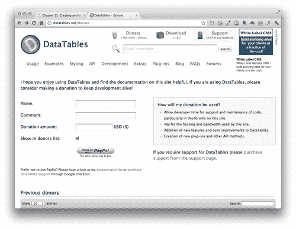

1.  解压文件夹并查看其内部。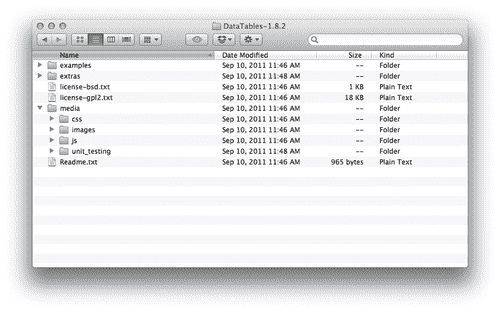

    +   有一个`examples`文件夹，其中包含几个不同的 DataTables 插件示例。一个`extras`文件夹提供了高级数据表的额外功能，我们这里不会使用任何其中的东西。有一个`media`文件夹，其中包含`images、css、js`和`unit_testing`资源。最后还有一个`Readme.txt`文件，其中包含有关插件创建者和文档位置等信息。

        最后，你会找到插件的许可证，包括 BSD 和 GPL。你可以阅读这些许可证文件或访问维基百科获取这些许可证的详细信息，但它们都是允许你免费使用插件代码的自由软件许可证。

1.  我们将建立一个基本示例，所以我们只需要为我们自己的项目准备一些东西。首先，将`images`目录的内容复制到你自己的`images`目录中。打开`css`文件夹，将`demo_table.css`复制到你自己的`styles`目录中。要小心选择正确的 CSS 文件`demo_table.css`，因为那里有几个 CSS 文件。最后，在`js`文件夹中，找到插件的压缩版本`jquery.dataTables.min.js`，并将其复制到你自己的`scripts`目录中。

1.  接下来，我们将获取所有必要的文件附加到包含我们表格的 HTML 页面中。在文档的`<head>`部分，在你自己的`styles.css`文件之前附加 CSS 文件：

    ```js
    <link rel="stylesheet" href="styles/demo_table.css"/>
    <link rel="stylesheet" href="styles/styles.css"/>

    ```

1.  接下来，在 HTML 文档的底部，在 jQuery 和你自己的`scripts.js`文件之间附加 DataTables 插件：

    ```js
    <script src="img/jquery.js"></script>
    <script src="img/jquery.dataTables.min.js"></script>
    <script src="img/scripts.js"></script>
    </body>
    </html>

    ```

1.  接下来，打开你的`scripts.js`文件，并在文档准备就绪的语句中，选择表格并调用`dataTable()`方法，如下所示：

    ```js
    $(document).ready(function(){
    $('#book-grid').dataTable();
    });

    ```

    现在，如果你在浏览器中刷新页面，你会看到你的表已经被转换成了数据表格。你可以选择一次查看多少项，输入到搜索框中以查找特定的表项，并使用右下角的分页控件浏览数据表的行。

    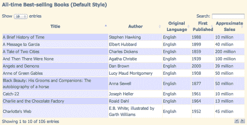

## 刚才发生了什么？

我们设置了一个基本的 HTML 表格，并通过附加一些 CSS 和 DataTables 插件将其转换为交互式数据表。我们选择了表格并调用了 `dataTable()` 方法以激活 DataTables 插件。

这很容易，不是吗？当然，这种淡紫色设计可能不符合您网站的设计，所以让我们看看如何自定义数据表的外观。

# 自定义数据表

DataTables 插件是我们使用的第一个具有 jQuery UI Themeroller 支持的插件。jQuery UI 是一组小部件和交互，使构建复杂应用程序变得更容易更快。学习 jQuery UI 本身超出了本书的范围，但我们将看看如何使用 jQuery UI Themeroller 为我们的数据表创建自定义主题。这个主题将适用于我们页面上使用的任何 jQuery UI 小部件，以及任何包含 jQuery UI Themeroller 支持的 jQuery 插件。

# 行动时间 — 自定义数据表

我们将从上次的数据表结束的地方继续。如果您想保存您的基本示例，只需保存文件的副本。然后按照以下步骤自定义数据表的外观：

1.  转到 [`jqueryui.com/themeroller`](http://jqueryui.com/themeroller) ，我们将看看 Themeroller。在左列中，您会找到选择预定义主题或创建自定义主题的控件，而宽广的右列包含几种不同类型小部件的示例。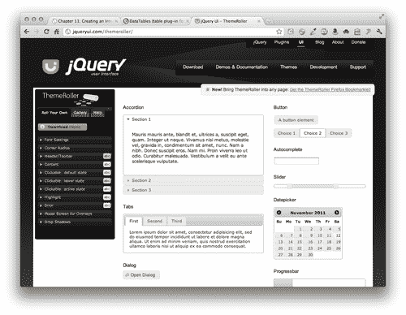

1.  在左列中单击 **Gallery 选项卡** ，您会看到有数十种预构建的 Themeroller 主题可供选择。当您单击不同示例时，您将看到右列中的示例小部件更新以反映该样式。我通常喜欢从选择一个与我想要的颜色方案或外观相当接近的预构建主题开始，然后切换到 **Roll Your Own 选项卡** 进行微调以满足我的需求。对于这个示例，我将从 **Cupertino** 风格开始。

    在切换到 **Roll Your Own 选项卡** 后，您会看到有关字体、颜色、角落、标题等的设置。进行任何您想要的调整，使主题看起来符合您的喜好。请随意玩耍和尝试。如果您走得太远，得到了您不喜欢的东西，那么轻松地切换回 **Gallery 选项卡** 并重新选择预构建主题，剥离掉您的任何自定义内容，然后重新开始。

    请记住，如果重新选择预构建主题，您的任何自定义内容都将丢失。一旦您得到喜欢的东西，请务必继续进行第 3 步以保存它。

1.  一旦您将主题设置得符合您的喜好，只需单击 **下载主题** 按钮。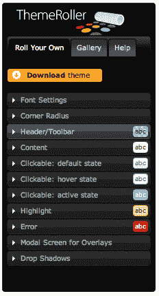

1.  您将会发现自己在 **构建您的下载** 页面上，可能会有点困惑。请注意，jQuery UI 是如此庞大，提供了如此多的不同功能，开发人员意识到强迫每个人下载整个内容是不合理的。如果您只想使用一个小部件，那么就没必要下载所有其他小部件和效果。这个页面让您选择不同的 jQuery UI 组件，这样您就不必下载您不需要的内容。

    由于我们只需要一个主题，所以我们可以放心地点击页面顶部的 **取消选择所有组件** 链接。

    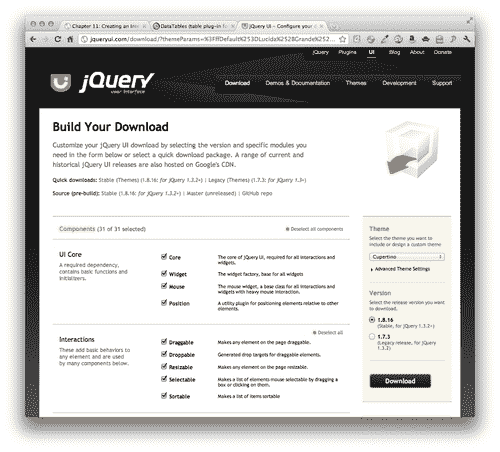

    +   然后，我们将离开 **主题** 和 **版本** 设置为默认值，并点击 **下载** 按钮下载一个 ZIP 文件。

1.  解压文件并查看其中内容。您会看到即使我们得到了最简单的下载，我们仍然有相当多的文件。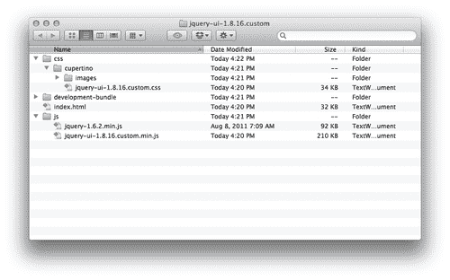

    +   我们有一个包含我们的主题文件夹、一个 CSS 文件和 **图像** 的 `css` 文件夹。我们还有一个 `development-bundle` 文件夹、一个 HTML 文件和一个包含 jQuery 和 jQuery UI 文件的 `js` 文件夹。

        我们所需的全部内容就是我们的主题。将您的主题文件夹复制到您自己项目的 styles 目录中。我的主题文件夹被命名为 `cupertino`，因为那是我选择的主题。如果您选择了不同的主题，您的主题文件夹将被命名为其他内容。不过很容易找到，因为它将是 `css` 文件夹内唯一的文件夹。

1.  接下来，我们将把我们的主题 CSS 文件附加到我们的 HTML 文件中。在`<head>`部分内，将您的主题 CSS 文件附加到我们在上一个示例中附加的 `demo_table.css` 文件之前。

    ```js
    <link rel="stylesheet" href="styles/cupertino/jquery-ui-1.8.16.custom.css"/>
    <link rel="stylesheet" href="styles/demo_table.css"/>

    ```

1.  不幸的是，我们的主题 CSS 文件并没有包含我们所需的所有样式来美化数据网格。毕竟，jQuery UI 的开发人员无法知道人们将要使用的所有不同类型的小部件和插件，所以他们不可能覆盖每种情况。幸运的是，DataTables 插件作者 Allan Jardine 在这方面已经为我们做了一些很好的工作，并提供了一个包含我们所需样式的 CSS 文件，以使我们的主题数据网格看起来更好。

    您可以在 Allan Jardine 在 [`datatables.net/styling/`](http://datatables.net/styling/) 上提供的文档中了解如何为 DataTables 插件设置样式。

    回到 DataTables 插件文件内部，打开 `media` 文件夹内的 `css` 文件夹，找到 `demo_table_jui.css` 文件。将其复制到您自己的 styles 文件夹中，并更新您的 `<link>` 标签，以链接到这个版本的 `demo_table.css`，如下所示：

    ```js
    <link rel="stylesheet" href="styles/cupertino/jquery-ui-1.8.16.custom.css"/>
    <link rel="stylesheet" href="styles/demo_table_jui.css"/>

    ```

1.  现在我们只需对 JavaScript 代码进行小小的更新。我们必须告诉`dataTable()`方法，我们要使用 jQuery UI。返回到您的`scripts.js`文件，我们将添加一对花括号，并传递一个键/值对以启用我们的数据表的 jQuery UI 样式：

    ```js
    $(document).ready(function(){
    $('#book-grid').dataTable({
    'bJQueryUI': true
    });
    });

    ```

    如果您现在在浏览器中刷新页面，您会看到数据网格现在使用了与我们在 jQuery UI 主题页面上看到的部件一致的样式：

    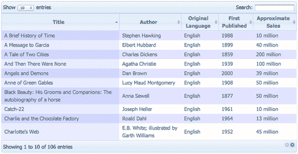

    +   但您会注意到，表格行的颜色方案仍然是薰衣草色。

1.  让我们对颜色方案进行一些调整。打开`demo_table_jui.css`。只需更新几行。首先，我们将找到第 281 行，那里定义了表格斑马条纹的颜色，并将其更新为我们想要使用的颜色，如下所示：

    ```js
    tr.odd {
    background-color: #f1f7fb;
    }
    tr.even {
    background-color: white;
    }

    ```

    我选择淡蓝色作为奇数行的颜色，白色作为偶数行的颜色，与我之前选择的 Cupertino 样式相匹配。随意选择与您的选择的主题相匹配的颜色。

1.  接下来，我们将更改当前排序行的颜色方案。你会在第 380 行找到已排序的奇数行的 CSS。我将把我的改成中蓝色，如下所示：

    ```js
    tr.odd td.sorting_1 {
    background-color: #d6e7f4;
    }

    ```

1.  最后，我们可以找到 CSS 中已排序的偶数行在第 392 行。我要把它改成浅蓝色。

    ```js
    tr.even td.sorting_1 {
    background-color: #e4eff8;
    }

    ```

    您可以选择与自己选择的主题协调的颜色。

    现在，如果您在浏览器中刷新页面，您会看到表格的斑马条纹图案与我们的主题相匹配。

    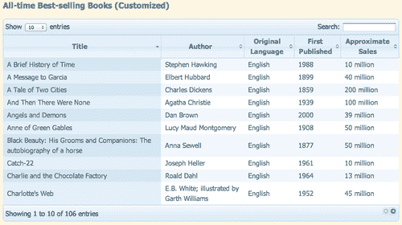

1.  接下来，我们将看看对数据网格进行其他一些自定义。首先，让我们将这些简单的下一页和上一页的分页按钮改成数字。我们将传递另一个键/值对给`dataTable`方法，以将按钮替换为分页数字，如下所示：

    ```js
    $(document).ready(function(){
    $('#book-grid').dataTable({
    'sPaginationType': 'full_numbers',
    'bJQueryUI': true
    });
    });

    ```

    ### 注意

    记住每个键/值对之间要用逗号分隔，但不要在最后一个键/值对之后加逗号。

    +   如果您在浏览器中刷新页面，您会看到简单的按钮已被替换为分页数字，如下图所示：

    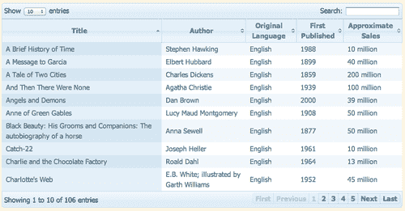

1.  我们可能会决定，对于这个特定的数据表，搜索功能并不合适。DataTables 插件提供了一种方法来禁用单个功能。要禁用搜索框过滤，我们将传递另一个键/值对，如下所示：

    ```js
    $(document).ready(function(){
    $('#book-grid').dataTable({
    'sPaginationType': 'full_numbers',
    'bJQueryUI': true,
    'bFilter': false
    });
    });

    ```

    在浏览器中刷新页面，您会看到搜索框消失了。

    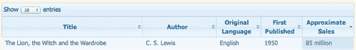

1.  您可能已经注意到，默认情况下，DataTables 插件按升序将我们的表按第一列排序，从 A 到 Z。在某些情况下，这可能是可以接受的，但在这种情况下，由于我们正在列出有史以来最畅销的书籍，我们可能想要对表进行排序，以便首先显示销售量最高的书籍。我们将传入一个新的键值对来指定默认排序应使用哪一列以及排序应该采用的方向。

    ```js
    $(document).ready(function(){
    $('#book-grid').dataTable({
    'sPaginationType': 'full_numbers',
    'bJQueryUI': true,
    'bFilter': false,
    'aaSorting': [[4, 'desc']]
    });
    });

    ```

    我们正在使用的键称为`'aaSorting'`，值是列号和排序方向，位于两组方括号内。不要忘记 JavaScript 是从 0 开始计数的，而不是从 1 开始计数。因此，我们表格中的第五列实际上是第 4 列。然后，我们希望将最高的数字放在顶部，所以我们传递 `'desc'` 表示降序排序。

    在浏览器中刷新页面，你会发现图书现在按销售量从高到低的顺序排列。同时，请注意，这种默认排序方式不影响您网站访问者根据任何其他列以任何顺序对表进行排序的能力。访客仍然可以与您的表进行交互。我们只是以最合理的方式重新定义了默认视图，以便呈现我们正在呈现的数据。

## 刚刚发生了什么？

我们将我们的基本数据网格提升了一步，通过定制插件的外观和行为。我们学会了如何使用 jQuery UI Themeroller 创建我们数据网格的自定义主题。然后，我们学会了如何用页码替换简单的分页按钮，禁用搜索表，以及如何为数据网格设置默认排序。

# 摘要

在本章中，我们学会了如何将普通的 HTML 表格转变为交互式数据网格。我们的网站访问者现在可以利用对表的不同列进行排序的功能以不同的方式查看数据。禁用 JavaScript 的网站访问者只会看到包含所有数据的普通 HTML 表格。数据网格并不是非常令人兴奋，但它们可以使您的网站访问者更轻松地处理大量数据。接下来，我们将学习如何使表单既更漂亮又更易于使用。
