# 第十二章：改善表单

> 如果你曾经尝试过使用网络表单，你就知道它们可以是多么令人头疼。幸运的是，HTML5 的作者们正在努力确保这种体验得到改善。我们都在耐心地等待浏览器支持那些不错的新功能，但与此同时，我们必须建立站点并制作出漂亮且功能良好的表单。

在本章中，您将学习以下主题：

+   使用一些新的 HTML5 属性标记一个表单

+   将光标放在第一个表单字段中

+   在表单字段中使用占位符文本

+   验证您网站访客的表单输入

+   设计样式顽固的表单元素，如文件上传和选择下拉框

# 一个 HTML5 网络表单

我们将利用 HTML5 中提供给我们的一些新属性开始。这些增加的好处在于它们完全向后兼容。不了解如何处理它们的浏览器将要么忽略它们，要么默认为简单的文本输入，而我们网站上的老式浏览器访客甚至可以在不知道自己错过什么的情况下使用我们的表单。

首先，关于网络表单的一个警告。一个网络表单不能单独工作 —— 它需要在某个服务器上进行一些花哨的后端编程来收集表单条目并处理它们，无论是将字段写入数据库还是通过电子邮件发送表单信息。因此，在点击表单上的 **提交** 按钮后，本章中构建的表单实际上不会起作用 —— 什么也不会发生。

如果您想要在项目中添加一个可用的网络表单，您有几个选择。它们如下：

+   您可以学习进行服务器端编程来处理您的表单，但服务器端编程远远超出了本书的范围。

+   您可以使用 CMS，它可能会将表单处理作为其核心功能或作为附加功能之一。好的候选包括 Drupal、WordPress 和 Joomla！。

+   您可以雇用一个服务器端开发人员来使您的表单工作。或者与一个交朋友，用您的设计技能交换他们的编码技能。

+   您可以使用网络表单服务来处理您表单的所有服务器端处理。我个人最喜欢的是 WuFoo，我已经使用了多年而且没有出现过任何问题。([`wufoo.com`](http://wufoo.com))

任何这些方法都将帮助您创建一个可包含在您的项目中的工作表单。但是，让我们看看如何使我们的表单的前端尽可能好。

# 行动时间 —— 设置 HTML5 网络表单

1.  我们将从一个简单的 HTML 文档和关联的文件和文件夹开始，就像我们在第一章中设置的那样，*设计师，见 jQuery*。我们要确保在文档顶部的文档类型声明中使用 HTML5 文档类型：

    ```js
    <!DOCTYPE html>

    ```

    在 HTML 4 和 xHTML 中使用的所有长而复杂的文档类型声明之后，这个声明简直是一股清新的空气，不是吗？

1.  现在，在`<body>`标签内，按照以下方式打开一个`<form>`标签：

    ```js
    <form action="#" id="account-form">
    </form>

    ```

    `form`标签需要一个`action`属性才能工作。由于我们的表单只是用于脚本和样式目的的虚拟表单，我们将使用#作为该属性的值。`action`属性的值通常是一个 URL——我们将发送表单数据进行处理的服务器上的位置。我们还添加了一个`id`属性，以便稍后轻松选择表单用于 CSS 和 JavaScript 目的。

1.  接下来，我们将为我们的网站访问者创建一个用户名和密码的部分。我们将把这两个字段放在一个`fieldset`中，并使用一个`legend`将它们组合起来。

    ```js
    <form action="#" id="account-form">
    <fieldset>
    <legend>My Account</legend>
    <p>
    <label for="username">Username</label>
    <input type="text" name="username" id="username"/>
    </p>
    <p>
    <label for="password">Password</label>
    <input type="password" name="password" id="password"/>
    </p>
    </fieldset>
    </form>

    ```

    我用段落标签（`<p>`）包装了每个字段及其相关的标签。关于用什么标签标记您的表单字段，世界上有各种各样的意见。有些开发人员喜欢简单的`<div>`标签，而其他人喜欢将表单制作为列表（`<ul>`），每个字段为列表项（`<li>`）。其他人喜欢使用定义列表（`<dl>`），将标签放在`<dt>`标签内，将表单字段放在`<dd>`标签内。归根结底，这些任何一种都可以很好地完成任务，并且您的表单将按预期为您的网站访问者工作。使用您个人偏好的任何标签。

    仔细看看我们到目前为止为我们的表单编写的 HTML 标记。有一些重要的事情需要注意。它们如下：

    +   每个`<input>`的`type`与其用途相关。**用户名**具有`text`类型，而**密码**具有`password`类型。

    +   每个`<input>`都有一个唯一的`id`。请记住，`id`在页面上必须是唯一的，因此请谨慎选择您的表单输入的`id`。

    +   每个`<input>`都有一个`name`属性。这将传递给服务器端处理您的表单的任何代码。通常的做法是为表单元素的`name`和`id`使用相同的值，但这不是强制性的。您可以随时为`id`选择不同的值，但如果您想更改`name`值，您应该首先与您的服务器端开发人员核实他或她编写的代码是否仍然有效。

    +   每个`<label>`都有一个`for`属性，将其与特定的表单元素关联起来。`for`属性中的值等于与之关联的表单元素的`id`（而不是`name`）。这为我们的网站访问者提供了一些很好的功能，点击标签将聚焦于相关的表单元素。这种行为对于复选框和单选按钮输入特别有用，因为它们很小，可能很难点击。

        每个浏览器都有自己的方式来为表单元素设置样式，但这是我的**我的账户**部分的样式（在 Mac OSX 上的 Google Chrome 中）：

    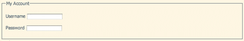

1.  接下来，我们将为我们的表单创建一个**关于我**部分。

    ```js
    <fieldset>
    <legend>About Me</legend>
    <p>
    <label for="name">Name</label>
    <input type="text" name="name" id="name"/>
    </p>
    <p>
    <label for="email">Email address</label>
    <input type="email" name="email" id="email"/>
    </p>
    <p>
    <label for="website">Website</label>
    <input type="url" name="website" id="website"/>
    </p>
    <p>
    <label for="birthdate">Birth Date</label>
    <input type="date" name="birthdate" id="birthdate"/>
    </p>
    </fieldset>

    ```

    同样，**Name**输入使用了`text`类型，因为名称是字符串。然而，看一下**Email、Website**和**Birth Date**字段的`type`属性。我们在这里使用了新的 HTML5 输入类型。在不支持这些输入类型的浏览器中，这些字段将看起来和使用`text`类型的输入框一样工作。但在识别这些输入类型的浏览器中，它们的行为会有所不同。用户输入将被浏览器自动验证。例如，如果站点访客在具有`email`类型的输入框中输入一个无效的电子邮件地址，浏览器会警告他们输入了一个无效的电子邮件地址。

    此外，在具有软键盘的设备上，键盘键将被更改以反映输入该数据类型所需的字符。例如，在 iPhone 或 iPad 上，具有`email`类型的输入将打开一个键盘，显示`.`和`@`，这样使得您的站点访客在这些设备上更容易完成所需的信息输入。

    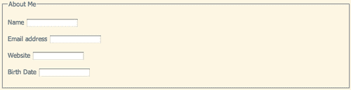

1.  我表单中的下一部分将是有关饮料偏好的部分。我希望站点访客从列表中选择他们喜欢的饮料，然后回答一个关于他们每年喝多少天饮料的问题。以下是我的列表样本：

    ```js
    <fieldset>
    <legend>Beverage Info</legend>
    <fieldset>
    <legend>Select your favorite beverages</legend>
    <p>Select at least three and no more than six beverages</p>
    <ul>
    <li>
    <input type="checkbox" name="favorites[]" id="bev-water" value="bev-water"/>
    <label for="bev-water">Water</label>
    </li>
    <li>
    <input type="checkbox" name="favorites[]" id="bev-juice" value="bev-juice"/>
    <label for="bev-juice">Juice</label>
    </li>
    </ul>
    </fieldset>
    <p>
    <label for="days">How many days per year do you drink a beverage?</label>
    <input type="number" name="days" id="days"/>
    </p>
    </fieldset>

    ```

    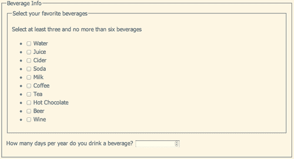

    关于我们用于标记此部分的 HTML 的一些新内容如下：

    +   `Fieldsets`可以嵌套。`fieldset`是将一组复选框或单选按钮分组的绝佳方式，我们可以使用`fieldset`的`legend`来为我们的单选按钮或复选框组创建标题。

    +   一组复选框之所以被识别为复选框，是因为它们将共享相同的`name`。由于站点访客可以在一组复选框中选择多个项目，因此我们在名称的末尾添加方括号（[]），以便服务器将所有答案收集到一个数组中。

    +   集合中的每个复选框都有自己独特的`id`和`value`。`id`和`value`不一定要匹配，但通常很容易使它们相同。

    +   最后，每年的天数被赋予了`number`类型的输入，因为这里只接受数字。对于此输入类型要小心。它非常严格，不会接受任何非数字字符。一些数据位看起来是数字，但实际上是字符串，比如电话号码和信用卡号。如果您不打算对您的数字执行某种数学操作，那么它不应该是`number`输入类型。

1.  我们将添加到表单中的下一个部分是支付信息部分：

    ```js
    <fieldset>
    <legend>Payment Info</legend>
    <fieldset>
    <legend>Credit Card Type</legend>
    <ul>
    <li>
    <input type="radio" name="cc-type" id="cc-visa" value="cc-visa"/>
    <label for="cc-visa">Visa</label>
    </li>
    <li>
    <input type="radio" name="cc-type" id="cc-mastercard" value="cc-mastercard"/>
    <label for="cc-mastercard">Mastercard</label>
    </li>
    <li>
    <input type="radio" name="cc-type" id="cc-amex" value="cc-amex"/>
    <label for="cc-amex">American Express</label>
    </li>
    <li>
    <input type="radio" name="cc-type" id="cc-discover" value="cc-discover"/>
    <label for="cc-discover">Discover</label>
    </li>
    </ul>
    </fieldset>
    <p>
    <label for="cc-number">Credit card number</label>
    <input type="text" name="cc-number" id="cc-number"/>
    </p>
    </fieldset>

    ```

    就像复选框一样，我们在`fieldset`内分组了一组单选控件，`legend`充当了该部分的标题。与复选框类似，一组单选控件共享相同的名称，但每个控件都有自己独特的`id`和值。但是，在单选按钮的情况下，只能选择一个，所以不需要将它们标记为数组。

    我们还添加了一个字段，用于收集我们站点访问者的信用卡号码。请注意，我们将此字段的输入类型设置为`text`。即使信用卡号看起来是一个数字，我们也希望将它存储为它本来的样子，永远不会对这个数字进行加减操作。此外，客户可能希望在他们的信用卡号中输入空格或连字符。

    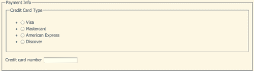

1.  最后，我们将添加一个复选框，供我们的站点访问者接受我们的服务条款，并添加一个提交按钮，让他们向我们提交表单信息。

    ```js
    <fieldset>
    <ul>
    <li>
    <input type="checkbox" name="tos" id="tos" value="tos"/>
    <label for="tos">Click here to accept our terms of service</label>
    </li>
    </ul>
    <p>
    <input type="submit" value="Sign me up!"/>
    </p>
    </fieldset>

    ```

    这里唯一的新东西就是**提交**按钮。默认情况下，带有`submit`类型的输入框将显示**提交**。我们可以通过添加一个带有实际想要出现在按钮上的文本的`value`属性来更改它。

    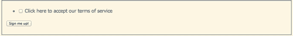

1.  唯一剩下的事情就是用一点 CSS 为我们的表单添加样式。以下是我为我的简单表单使用的 CSS：

    ```js
    fieldset { width:400px;margin:0;padding:10px;border:1px solid #c1c3e6;background:#f1f2fa;margin-top:10px; }
    fieldset fieldset { border:0 none;border-top:1px solid #c1c3e5;border-bottom:1px solid #c1c3e5;width:380px;margin-bottom:10px; }
    legend { padding:3px 5px;color:#6c71c4;font-weight:bold;font-size:1.2em; }
    fieldset fieldset legend { font-size:1em;font-weight:normal; }
    fieldset p { margin: 0 0 10px 0; }
    fieldset ul { margin:0;padding:0;list-style:none; }
    label { display:inline-block;width:150px; }
    ul label { display:inline;width:auto; }
    input[type="text"],
    input[type="password"],
    input[type="email"],
    input[type="url"],
    input[type="date"],
    input[type="number"] { width:150px;border:1px solid #c1c3e6;padding:4px; }

    ```

    注意我们输入框的`type`属性可用于选择它们进行样式设置。在这种情况下，我已经将它们全部样式设置为相同，但如果需要的话，也可以为每个输入框设置自己的样式。

    这是我的 CSS 样式的表单外观。随意发挥创造力，为表单编写你自己的样式。

    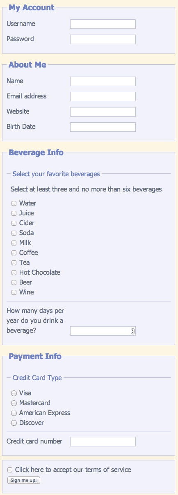

## 刚才发生了什么？

我们看了一些新的 HTML5 输入类型以及如何正确使用它们来组合一个网页表单。我们了解了如何使用`fieldset`和`legend`来将字段组合在一起并添加标题，以及如何将标签与表单元素关联起来。我们学习了文本、密码、电子邮件、URL、日期、复选框、单选按钮和数字输入类型的正确使用。

# 设置焦点

如果你访问[`google.com`](http://google.com)，你会发现他们让你很容易进行网页搜索——只要页面在浏览器中加载完成，光标就会在搜索字段中闪烁。还有其他一些网站也是这样做的，这样就可以快速轻松地开始填写表单。

每当你有一个页面，站点访问者在该页面的主要任务是填写表单时，你都可以通过将光标放在第一个表单字段中来为站点访问者提供便利。使用 jQuery 很容易实现。以下是如何做的。

# 行动时间——将焦点设置到第一个字段

我们将继续使用上一个示例中设置的示例表单进行操作。以下是如何将焦点设置到表单中的第一个字段。

1.  打开你的空白`scripts.js`文件，并添加一个文档就绪的声明。

    ```js
    $(document).ready(function(){
    //code goes here
    });

    ```

1.  接下来，我们想要选择表单中的第一个字段。有许多不同的方法可以做到这一点。在这种情况下，我将使用第一个表单元素的`id`。

    ```js
    $(document).ready(function(){
    $('#username');
    });

    ```

1.  剩下的就是调用那个元素的`focus()`方法。

    ```js
    $(document).ready(function(){
    $('#username').focus();
    });

    ```

    现在，如果你在浏览器中刷新页面，你会看到光标在表单的**用户名**字段中闪烁——正是第一个字段。

## 刚才发生了什么？

我们使用了几行 jQuery 代码来将焦点移动到表单中的第一个字段，这样我们的网站访问者可以轻松地开始填写表单。只需选择第一个表单元素，然后调用该元素的`focus()`方法即可。

# 占位文本

当你访问一个网站时，有一个软灰色的文本在表单字段中给你一些提示，这不是很好吗？过去几年里已经写了无数不同的 jQuery 插件来处理这个问题，因为这可能有点麻烦。

但是，我有个好消息要告诉你。HTML5 提供了一个`placeholder`属性，可以自动在表单字段中创建这种文本，而无需 JavaScript 的帮助。当然，与任何其他尖端技术一样，浏览器支持可能有些欠缺。我们没有等待多年让浏览器支持这一新功能变得普遍——我们现在就必须构建功能性的网站。你可以继续使用所有那些旧的 jQuery 插件，但如果支持 placeholder 属性，为什么不利用它，并只在那些尚未识别它的浏览器中使用 jQuery 来填补空白呢？

这种脚本称为**polyfill**。它用于填补一些浏览器可能缺少的功能。如果浏览器支持`placeholder`属性，polyfill 脚本就什么都不做，只是让浏览器处理占位符。对于那些不支持`placeholder`属性的网站访问者，脚本会立即生效，为所有人提供占位文本功能。

# 是时候行动起来了——添加占位文本

按照以下步骤，为尽可能多的网站访问者添加表单字段的占位文本，无论他们的浏览器是否支持新的 HTML5 占位属性。

1.  我们将继续使用我们在前两节中构建的相同表单。我们首先要做的是重新检查每个表单字段，并在合适的地方添加一个占位属性。以下是我的表单中的一些示例：

    ```js
    <p>
    <label for="username">Username</label>
    <input type="text" name="username" id="username" placeholder="At least 5 characters long"/>
    </p>

    ```

    在这里，我增加了关于用户名所需长度的提示。

    ```js
    <p>
    <label for="password">Password</label>
    <input type="password" name="password" id="password" class="required" placeholder="Choose a secure password"/>
    </p>

    ```

    因为再怎么说都不嫌多，我在这里提醒我的网站访问者创建一个安全的密码。

    ```js
    <p>
    <label for="website">Website</label>
    <input type="url" name="website" id="website" placeholder="Don't forget the http://"/>
    </p>

    ```

    提醒网站访问者，有效的 URL 包括开头的协议。

    ```js
    <p>
    <label for="birthdate">Birth Date</label>
    <input type="date" name="birthdate" id="birthdate" placeholder="yyyy-mm-dd"/>
    </p>

    ```

    任何时候一个字段需要特殊格式，占位文本都可以为网站访问者提供提示。

    当你添加完占位符文本后，可以在 Safari 或 Chrome 中查看你的页面，以查看占位符文本的效果。

    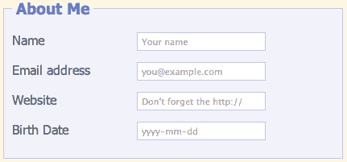

    +   现在我们需要为那些尚未支持占位符文本的浏览器添加支持。

1.  我们将使用丹·本特利（Dan Bentley）的占位符兼容性补丁。要下载它，只需访问 [`github.com/danbentley/placeholder`](http://https://github.com/danbentley/placeholder)。就像我们从 GitHub 下载的其他插件一样，点击 **ZIP** 按钮下载一个压缩文件夹。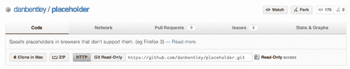

1.  解压文件夹并查看其内容。这是一个非常简单直接的插件。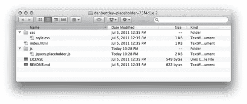

    +   您有一个样本 `index.html` 文件，一个 `style.css` 文件和一个 `jquery.placeholder.js` 文件，以及一个许可证和一个自述文件。

1.  有关此插件的好消息是，它只需在页面上存在即可发挥其魔力。将 `jquery.placeholder.js` 复制到您自己的 `scripts` 文件夹中。然后，转到页面底部，并在 jQuery 之后、您自己的 `scripts.js` 文件之前将脚本附加到页面上：

    ```js
    <script src="img/jquery.js"></script>
    <script src="img/jquery.placeholder.js"></script>
    <script src="img/scripts.js"></script>

    ```

    现在，如果您在不支持占位符属性的浏览器中打开页面，您将看到占位符正常工作。这些浏览器是 Firefox 3.6 及更低版本，Safari 3 及更低版本，Internet Explorer 9 及更低版本以及 Opera 10 及更低版本。

## 刚刚发生了什么？

我们使用了丹·本特利的占位符兼容性补丁来为不支持的浏览器添加占位符支持。我们在适当的地方给表单字段添加了 `placeholder` 属性，然后在我们的页面上包含了丹的脚本，以使这些占位符属性在尽可能多的浏览器中工作。

# 验证用户输入

有时，当网站访问者不得不多次提交表单来纠正他们填写的错误时，他们可能会感到沮丧。没有 JavaScript，验证网站访问者输入的信息的唯一方法是等待他们提交表单，然后在服务器上识别问题，并返回一个包含表单以及可能帮助网站访问者纠正问题的任何错误消息的页面。

一旦出现错误，立即显示错误将大大提高您的表单的灵活性和响应性，并帮助您的网站访问者在第一次尝试时正确提交表单。在本节中，我们将学习如何使用 Jörn Zaefferer 的验证插件。此插件功能强大且灵活，可以以多种不同的方式处理验证。我们将看一下将客户端验证添加到您的表单中最简单的方法。

# 行动时间——即时验证表单值

我们将继续使用我们在过去三个部分中创建的表单。按照以下步骤验证用户对表单的输入：

1.  我们要做的第一件事是下载验证插件并将其附加到我们的页面上。

    前往[`bassistance.de/jquery-plugins/jquery-plugin-validation/`](http://bassistance.de/jquery-plugins/jquery-plugin-validation/)，并在**Files**部分点击**Download**按钮下载 ZIP 文件。

    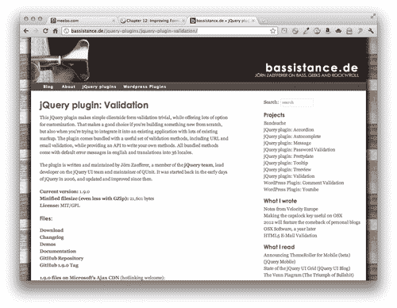

1.  打开 ZIP 文件并看看我们得到了什么。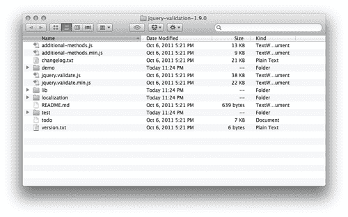

    +   这里有很多内容。几个不同的 JavaScript 文件，一个更改日志等等。记得我说过这个插件功能强大，可以处理各种各样的验证方法吗？这就是所有这些的用途。处理几乎任何你可能遇到的旧的疯狂的验证情况。

        幸运的是，我们的情况相当简单，所以我们不需要做任何复杂的事情。

1.  将`jquery.validate.min.js`复制到您自己的`scripts`文件夹并将其附加到您的页面。

    ```js
    <script src="img/jquery.js"></script>
    <script src="img/jquery.placeholder.js"></script>
    <script src="img/jquery.validate.min.js"></script>

    ```

    在这种情况下，占位符脚本与验证脚本之间没有依赖关系，因此它们出现的顺序不重要，只要它们都在 jQuery 之后即可。

1.  接下来，我们将回顾一下我们的表单，并添加一些验证插件将使用的信息。让我们从用户名字段开始：

    ```js
    <p>
    <label for="username">Username</label>
    <input type="text" name="username" id="username" placeholder="At least 5 characters long" minlength="5" maxlength="20" class="required"/>
    </p>

    ```

    这是一个必填字段——任何填写此表单的网站访问者都必须选择一个用户名，所以我只需添加一个`class`为`required`。如果我愿意，我可以使用该类名为此表单字段创建特殊的样式。即使我不这样做，验证也会使用此信息确保此字段已填写。

    接下来，所有用户名必须介于 5 到 20 个字符之间。所以我添加了`minlength`和`maxlength`属性。

1.  接下来是密码字段，它也是必填的。所以我会添加所需的类。

    ```js
    <p>
    <label for="password">Password</label>
    <input type="password" name="password" id="password" class="required" placeholder="Choose a secure password"/>
    </p>

    ```

    顺便说一句，我也会在电子邮件字段中添加所需的类。

    ```js
    <p>
    <label for="email">Email address</label>
    <input type="email" name="email" id="email" placeholder="you@example.com" class="required"/>
    </p>

    ```

1.  接下来，让我们看一下喜爱饮料的列表。记得我们在那里给网站访问者留了一条注释，要求他们至少选择三种但不要超过六种？我们实际上可以通过验证插件来强制执行。进入系列中的第一个复选框并添加`minlength`和`maxlength`属性，如下所示：

    ```js
    <li>
    <input type="checkbox" name="favorites[]" id="bev-water" value="bev-water" maxlength="6" minlength="3"/>
    <label for="bev-water">Water</label>
    </li>

    ```

    我们只需要在第一个复选框上添加这个，而不是所有的复选框。验证足够智能，可以理解我们谈论的是这组复选框。

1.  现在，让我们看一下我们询问网站访问者每年喝多少天饮料的领域。显然，一年只有 365 天，这是他们可以在这个领域输入的最高数字。所以我们会添加一个`max`属性来指定最高可能的数字。

    ```js
    <p>
    <label for="days">How many days per year do you drink a beverage?</label>
    <input type="number" name="days" id="days" max="365"/>
    </p>

    ```

1.  这将我们带到了支付部分。无论我们在卖什么，它都不是免费的，所以我们将要求输入信用卡类型和信用卡号。要求输入单选按钮，我们只需要在一组中的第一个单选按钮中添加`required`类。

    ```js
    <li>
    <input type="radio" name="cc-type" id="cc-visa" value="cc-visa" class="required"/>
    <label for="cc-visa">Visa</label>
    </li>

    ```

    我们不必对单选按钮系列进行任何其他更改。

1.  现在，让我们处理信用卡号本身。我们需要添加`required`类。我们还需要添加一个`creditcard`类来验证输入的号码实际上是一个有效的信用卡号。

    ```js
    <p>
    <label for="cc-number">Credit card number</label>
    <input type="text" name="cc-number" id="cc-number" placeholder="xxxxxxxxxxxxxxxx" class="creditcard required"/>
    </p>

    ```

1.  而在我们的表单底部，有我们的**服务条款**复选框。这也是必需的，所以我们将添加`required`类。

    ```js
    <li>
    <input type="checkbox" name="tos" id="tos" class="required" value="tos"/>
    <label for="tos">Click here to accept our terms of service</label>
    </li>

    ```

1.  现在，我们只需要调用 Validation 使我们可以使用的`validate()`方法。在你的文档准备好的声明中，选择表单并调用`validate()`方法。

    ```js
    $(document).ready(function(){
    $('#username').focus();
    $('#account-form').validate();
    });

    ```

1.  现在，如果您在浏览器中刷新页面，您将看到您无法在没有填写任何内容的情况下提交表单 - 必填字段将被标记为错误消息，说明该字段是必需的。如果您尝试在**网站**或**电子邮件地址**字段中输入无效的网址或电子邮件地址，您将收到一条错误消息，让您知道需要纠正的问题。只是一个问题，这些错误消息在我们的复选框和单选按钮的位置有点奇怪。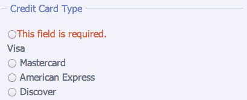

    +   那实际上并不能帮助人们准确理解发生了什么。幸运的是，Validation 允许我们在页面上添加自己的错误消息，无论我们想要它们显示在哪里。

1.  我们将在信用卡类型单选按钮列表后添加错误消息。

    ```js
    <li>
    <input type="radio" name="cc-type" id="cc-discover" value="cc-discover"/>
    <label for="cc-discover">Discover</label>
    </li>
    </ul>
    <label for="cc-type" class="error">Select a credit card type!</label>
    </fieldset>

    ```

    我们将添加一个`<label>`。在这种情况下，for 属性将指向字段的`name`，所有单选按钮共享`cc-type`名称。我们将添加一个错误类，并在内部添加我们想要的任何`error`消息。

    注意，在这种情况下，我们的`label`的`for`属性指的是字段的`name`，而不是 ID。这是 Validation 插件创建的特殊情况。如果你不是使用 Validation 插件的自定义错误消息，那么你的标签的`for`属性应该始终引用表单元素的`id`。

1.  接下来，我们不希望这些错误消息出现在页面上，除非它们是需要的。我们也希望它们以红色显示，这样它们就很显眼，易于找到。打开你的`styles.css`文件，为错误消息添加一些样式：

    ```js
    label.error { display:none;width:360px;color:#dc522f;margin-top:5px; }

    ```

    我们添加了一个宽度，因为我已经将我的其他标签设置为短并且浮动到左侧。并且我们添加了一点边距，为了在错误消息和它所指的字段之间添加一些空间。

    现在如果你刷新浏览器，并尝试在没有选择信用卡类型的情况下提交表单，你将得到一个更好的错误消息位置，如下所示：

    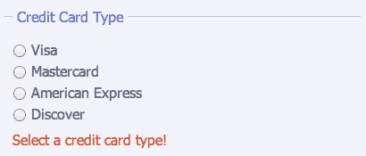

1.  接下来，我们需要为我们喜爱的饮料和我们的**服务条款**复选框做同样的事情：这是我们将添加的喜爱的饮料：

    ```js
    <li>
    <input type="checkbox" name="favorites[]" id="bev-wine" value="bev-wine"/>
    <label for="bev-wine">Wine</label>
    </li>
    </ul>
    <label for="favorites[]" class="error">Please select at least three and no more than six favorite beverages</label>
    </fieldset>

    ```

    这是我们将添加的**服务条款：**

    ```js
    <fieldset>
    <ul>
    <li>
    <input type="checkbox" name="tos" id="tos" class="required"/>
    <label for="tos">Click here to accept our terms of service</label>
    </li>
    </ul>
    <label for="tos" class="error">You must accept our terms of service</label>
    <p>
    <input type="submit"/>
    </p>
    </fieldset>

    ```

现在，如果您在浏览器中刷新页面，并且尝试在没有完成必填字段或在表单中输入无效信息的情况下提交表单，您将在检测到问题时立即得到适当的错误消息。

## 刚才发生了什么？

我们使用验证插件向表单添加了一些简单的客户端验证。使用验证插件的最简单方法就是向表单元素添加一些类名和属性。验证插件会处理剩下的事情——它足够智能，能够识别 HTML5 输入类型并验证这些类型，并提供一些其他有用的验证规则，如必填字段、最大数字值、最小和最大长度以及信用卡号码。我们添加了一行 CSS 来样式化我们想要的错误消息。

# 改善外观

如果你尝试过用 CSS 样式化 Web 表单，那么你可能发现一些表单元素，如文本输入和按钮，非常容易样式化。有一些怪癖，但一旦你弄清楚了，你就可以让这些表单元素看起来几乎任何你想要的样子。然而，其他一些表单元素却更为顽固，对 CSS 样式几乎没有什么响应。设计一个可爱的表单，然后意识到从技术上讲它是不可能的，这实在令人沮丧。

这些令人头痛的表单元素是：

```js
<select>
<input type="file">
<input type="checkbox">
<input type="radio">

```

不仅这四个表单元素在 CSS 中无法样式化，而且它们在不同浏览器和操作系统中的外观差异巨大，让我们对表单的外观几乎没有控制。让我们看看 Pixel Matrix 的 Uniform 插件如何帮助我们。

# 行动时间 — 改善表单外观

按照以下步骤利用 Uniform 插件实现可能的样式选项：

1.  我们会从一个基本的 HTML 文件和相关文件和文件夹开始，就像我们在第一章中设置的那样，*设计师，见到 jQuery*。例如，在 HTML 文档的正文中，我们将建立一个简单的表单，其中包含每种难以样式化的表单元素的示例。从`<form>`标签开始：

    ```js
    <form id="pretty-form" action="#">
    </form>

    ```

1.  然后，在我们的表单中，我们将添加我们的表单元素。我们将从一个`select`下拉框开始：

    ```js
    <fieldset>
    <legend>Select your favorite juice</legend>
    <p>
    <label for="juice">Favorite Juice</label>
    <select id="juice" name="juice">
    <option>Select one</option>
    <option value="orange">Orange Juice</option>
    <option value="grape">Grape Juice</option>
    <option value="grapefruit">Grapefruit Juice</option>
    <option value="cranberry">Cranberry Juice</option>
    <option value="tomato">Tomato Juice</option>
    <option value="pineapple">Pineapple Juice</option>
    <option value="apple">Apple Juice</option>
    </select>
    </p>
    </fieldset>

    ```

    我们遵循了与上一个表单相同的规则，确保表单正常工作并且易于访问。

    `<select>`的外观将取决于您的浏览器和操作系统，但在我这里，它在 Chrome 上的 Mac OSX 上的样子是这样的：

    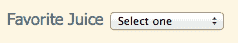

1.  接下来，我们将添加一个文件输入。

    ```js
    <fieldset>
    <legend>Fruit Picture</legend>
    <p>
    <label for="fruit-photo">Upload a photo of your favorite fruit</label>
    <input type="file" id="fruit-photo" name="fruit-photo"/>
    </p>
    </fieldset>

    ```

    很难相信这个看似无害的标签竟然可能是如此头痛的样式来源，但事实就是如此。这是 Chrome 在 Mac OSX 上的样子：

    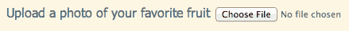

1.  接下来，让我们添加一些复选框，如下所示：

    ```js
    <fieldset>
    <legend>Which hot beverages do you enjoy?</legend>
    <ul>
    <li>
    <input type="checkbox" name="hot-bevs[]" id="hot-coffee">
    <label for="hot-coffee">Coffee</label>
    </li>
    <li>
    <input type="checkbox" name="hot-bevs[]" id="hot-chocolate">
    <label for="hot-chocolate">Hot Chocolate</label>
    </li>
    <li>
    <input type="checkbox" name="hot-bevs[]" id="hot-tea">
    <label for="hot-tea">Tea</label>
    </li>
    </ul>
    </fieldset>

    ```

    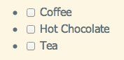

1.  然后是一些单选按钮。

    ```js
    <fieldset>
    <legend>Select your favorite soft drink</legend>
    <ul>
    <li>
    <input type="radio" name="soft-drinks" id="soda"/>
    <label for="soda">Soda</label>
    </li>
    <li>
    <input type="radio" name="soft-drinks" id="sparkling-water"/>
    <label for="sparkling-water">Sparkling water</label>
    </li>
    <li>
    <input type="radio" name="soft-drinks" id="iced-tea"/>
    <label for="iced-tea">Iced Tea</label>
    </li>
    <li>
    <input type="radio" name="soft-drinks" id="lemonade"/>
    <label for="lemonade">Lemonade</label>
    </li>
    </ul>
    </fieldset>

    ```

    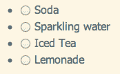

1.  我们将向表单中添加的最后一件事只是一些易于样式化的元素，以便我们学习如何将它们样式化以匹配我们的 Uniform 样式：

    ```js
    <fieldset>
    <legend>Some other stuff about me</legend>
    <p>
    <label for="name">My name</label>
    <input type="text" id="name" name="name"/>
    </p>
    <p>
    <label for="about-me">About me</label>
    <textarea rows="10" cols="40" id="about-me" name="about-me"></textarea>
    </p>
    </fieldset>
    <p class="buttons">
    <input type="submit"/>
    <input type="reset"/>
    </p>

    ```

    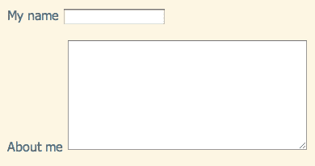

## 刚才发生了什么？

现在我们设置了未经样式处理的表单。我们的表单实际上看起来取决于您的浏览器和操作系统。我们按照本章前面建立的所有正确和可访问的表单设置规则进行设置。但是，这一次，我们包含了一些难以样式化的表单元素。现在让我们看看如何使用 Uniform 插件 —— 让我们的表单在尽可能多的浏览器中保持一致。

## 样式化无法样式化的元素

如果你想抽出一点时间尝试写一些 CSS 来样式化这些表单元素，你会发现它们几乎没什么影响。其中一些似乎根本不受 CSS 的影响，而当它们受到影响时，效果并不总是符合您的期望。难怪这些表单字段让每个人都头疼。JQuery 来拯救。

# 时间来采取行动 —— 添加用于为无样式元素添加样式的 Uniform

使用 Uniform 插件控制表单元素的样式，请按以下步骤操作：

1.  让我们获取 Uniform 插件并看看它是如何工作的。前往 [`uniformjs.com/`](http://uniformjs.com/) 并点击大的**下载 Uniform**按钮。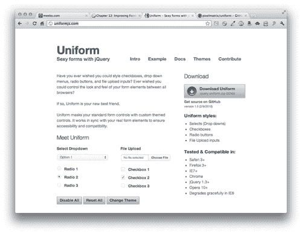

1.  解压文件夹并查看其中的内容。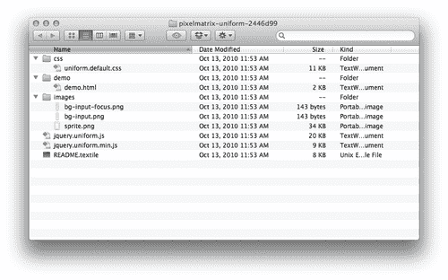

    +   这很简单，对吧？一些样式，一个演示，一些图片，以及两个版本的 Uniform 插件 —— 一个压缩和一个未压缩。我们以前见过这个。

        默认情况下，Uniform 自带一个默认样式表和图片。但是，还有其他样式可用。回到 `uniformjs.com`，如果在导航中点击**主题**，您将看到当前可用的主题。我非常喜欢 Aristo 的外观，所以我要下载它。

    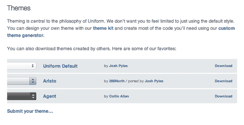

    +   这给我一个简单的 ZIP 文件，里面只有一些 css 和图片：

    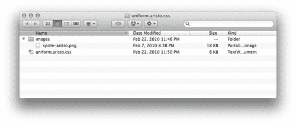

1.  接下来，我们需要将这些文件放入我们自己的项目中，并附加到我们的 HTML 页面中。让我们从 JavaScript 开始。将 `jquery.uniform.min.js` 复制到您自己的 `scripts` 文件夹中，并将 Uniform 脚本在 jQuery 和您自己的 `scripts.js` 文件之间引用：

    ```js
    <script src="img/jquery.js"></script>
    <script src="img/jquery.uniform.min.js"></script>
    <script src="img/scripts.js"></script>
    </body>

    ```

1.  现在将您想要使用的主题的 CSS 文件复制到您自己的 `styles` 文件夹中，并在文档的头部引用它：

    ```js
    <head>
    <title>Chapter 12: Improving Forms</title>
    <link rel="stylesheet" href="styles/uniform.aristo.css"/>
    <link rel="stylesheet" href="styles/styles.css"/>

    ```

1.  我们需要获取的最后一样东西是关联的图片。将您选择的主题的图像文件夹的内容复制到您自己的 `images` 文件夹中。现在，您自己项目的结构应该看起来类似于以下截图: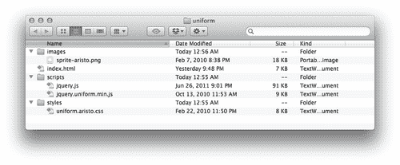

1.  现在，我们可以调用 `uniform()` 方法来为我们的无法样式化的表单元素添加样式了。打开您的 `scripts.js` 文件，并插入一个文档就绪语句：

    ```js
    $(document).ready(function(){
    //our code will go here
    });

    ```

1.  Uniform 允许我们选择我们想要样式化的表单元素。在这种情况下，我们想要样式化所有四个顽固的元素，所以我们的选择器将是：

    ```js
    $(document).ready(function(){
    $('select, input:checkbox, input:radio, input:file');
    });

    ```

1.  然后，剩下的就是调用 `uniform()` 方法：

    ```js
    $(document).ready(function(){
    $('select, input:checkbox, input:radio, input:file').uniform();
    });

    ```

    现在，如果您在浏览器中刷新页面，您将看到这些顽固且不可样式化的表单元素现在与您选择的 Uniform 主题相匹配。

    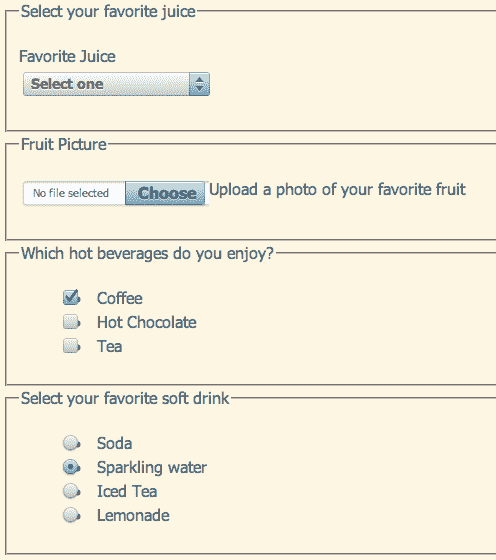

+   仍然有一些奇怪的 CSS 问题需要处理，我们的 fieldsets、legends、按钮和文本输入框不匹配。让我们写一点 CSS 将它们整合在一起。

## 所有样式

我们还有一些 CSS 问题需要解决 — 我们的复选框和单选按钮列表仍然有它们的项目符号，我们的文本输入、按钮、fieldsets 等仍未经过样式化。让我们将所有东西都样式化，以匹配我们选择的 Uniform 主题。

# 行动时间 — 为可样式化元素添加样式

1.  打开您的 `styles.css` 文件。我们将从样式化 fieldsets 和 legends 开始：

    ```js
    fieldset {
    background: #fff;
    border: 1px dotted #83b0ca;
    margin: 10px 20px 0 20px;
    padding:10px;
    }
    legend {
    background: #bed6e3;
    border:1px solid #8fb7cf;
    color: #1C4257;
    padding: 0 5px;
    box-shadow:2px 2px 2px rgba(0,0,0,0.2);
    }

    ```

    我选择了与我选用的 Aristo 主题相匹配的蓝色。如果您选择了不同的主题，请随意使用不同的颜色和样式来匹配您选择的主题。

1.  接下来，我们将为表单中使用的某些容器元素添加样式：

    ```js
    fieldset p {
    margin: 0 0 10px 0;
    }
    fieldset ul {
    list-style: none;
    margin: 0;
    padding: 0;
    }
    label {
    display: block;
    }
    ul label {
    display: inline;
    width: auto;
    }
    p.buttons {
    margin: 20px;
    }

    ```

1.  接下来，我们将为文本输入和文本区域添加一些样式，以匹配我们的 Aristo 表单元素：

    ```js
    input[type="text"],
    textarea {
    border: 1px solid #ccc;
    border-radius: 3px;
    box-shadow: inset 0 0 4px rgba(0,0,0,0.3);
    moz-border-radius: 3px;
    moz-box-shadow: inset 0 0 4px rgba(0,0,0,0.3);
    padding: 4px;
    webkit-border-radius: 3px;
    webkit-box-shadow: inset 0 0 4px rgba(0,0,0,0.3);
    width: 250px;
    }

    ```

1.  最后，但同样重要的是，我们将样式化我们的按钮。Aristo 主题使用了一个漂亮的蓝色渐变，所以我将为我的按钮使用渐变。我将不得不为支持所有浏览器编写相当多的代码，但这是它：

    ```js
    input[type='submit'],
    input[type='reset'] {
    background: rgb(185,224,245);
    background: linear-gradient(top, rgba(185,224,245,1) 0%,rgba(131,176,202,1) 100%);
    background: -moz-linear-gradient(top, rgba(185,224,245,1) 0%, rgba(131,176,202,1) 100%);
    background: -ms-linear-gradient(top, rgba(185,224,245,1) 0%,rgba(131,176,202,1) 100%);
    background: -o-linear-gradient(top, rgba(185,224,245,1) 0%,rgba(131,176,202,1) 100%);
    background: -webkit-gradient(linear, left top, left bottom, color-stop(0%,rgba(185,224,245,1)), color-stop(100%,rgba(131,176,202,1)));
    background: -webkit-linear-gradient(top, rgba(185,224,245,1) 0%,rgba(131,176,202,1) 100%);
    border: solid 1px #6e93b0;
    border-radius: 2px;
    box-shadow: rgba(0,0,0,0.15) 0px 1px 3px;
    color: #1C4257;
    cursor: pointer;
    display: inline-block;
    filter: progid:DXImageTransform.Microsoft.gradient( startColorstr='#b9e0f5', endColorstr='#83b0ca',GradientType=0 );
    filter: progid:DXImageTransform.Microsoft.gradient( startColorstr='#eef3f8', endColorstr='#96b9d4',GradientType=0 );
    font-size: 1em;
    font-weight: bold;
    height: 27px;
    line-height: 26px;
    margin-right: 5px;
    moz-border-radius: 2px;
    moz-box-shadow: rgba(0,0,0,0.15) 0px 1px 3px;
    padding: 0 10px;
    text-shadow: rgba(255,255,255,0.5) 0px 1px 0px;
    webkit-border-radius: 2px;
    webkit-box-shadow: rgba(0,0,0,0.15) 0px 1px 3px;
    }
    input[type='submit']:hover,
    input[type='reset']:hover {
    color: #0b1b24;
    }
    input[type='submit']:active,
    input[type='reset']:active {
    background: rgb(131,176,202);
    background: linear-gradient(top, rgba(131,176,202,1) 0%,rgba(185,224,245,1) 100%);
    background: -moz-linear-gradient(top, rgba(131,176,202,1) 0%, rgba(185,224,245,1) 100%);
    background: -ms-linear-gradient(top, rgba(131,176,202,1) 0%,rgba(185,224,245,1) 100%);
    background: -o-linear-gradient(top, rgba(131,176,202,1) 0%,rgba(185,224,245,1) 100%);
    background: -webkit-gradient(linear, left top, left bottom, color-stop(0%,rgba(131,176,202,1)), color-stop(100%,rgba(185,224,245,1)));
    background: -webkit-linear-gradient(top, rgba(131,176,202,1) 0%,rgba(185,224,245,1) 100%);
    filter: progid:DXImageTransform.Microsoft.gradient( startColorstr='#83b0ca', endColorstr='#b9e0f5',GradientType=0 );
    }

    ```

    我在鼠标悬停时添加了微妙的文字颜色变化，并在点击按钮时反转了渐变。现在，刷新浏览器中的页面，看看我们美丽的表单。

    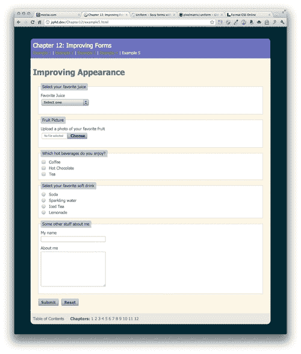

## 刚才发生了什么？

我们使用了 Pixelmatrix 的 Uniform jQuery 插件来样式化以前顽固且无法样式化的表单元素。我们选择了一个预设主题，并将所有相关的 CSS 和图像附加到我们的页面上，然后选择我们想要样式化的每一种表单元素，并调用 `uniform()` 方法。然后，我们使用我们的 CSS 技能来样式化其他表单元素，如简单的文本输入、文本区域和一些按钮，以匹配我们选择的主题。结果是一个漂亮的表单，在不同的浏览器中看起来一致，并且对于禁用 JavaScript 的用户仍然完美地工作。

## 我们自己的主题

当然，这个 Aristo 主题很不错，但是如果它不匹配我们的网站怎么办？我们还有其他选择吗？当然有！如果预设的主题都不符合您的网站，您可以使用自己的样式和颜色制作自己的主题，以匹配您喜欢的任何网站。事实上，Pixelmatrix 已经使这变得超级简单了。以下是您可以做到的：

# 行动时间 — 创建自定义的统一主题

1.  首先从 Pixelmatrix 下载主题工具包。你可以在 [uniformjs.com](http://uniformjs.com) 的主题部分找到它！行动时间 — 创建自定义 Uniform 主题

1.  解压缩文件夹，里面有两个 PSD 文件 — `sprite.psd` 和 `sprites.psd`。在 Photoshop 中打开 `sprite.psd` 并按照您的喜好为表单元素添加样式。如果您想要更大或更小的表单元素，您可以更改元素的大小。`Sprites.psd` 仅用于说明每种样式的用途。您可以将其用作参考，以确保覆盖所有可能性，但实际上您不需要使用它来创建您的主题。

1.  当你的精灵准备好时，转到 [`uniformjs.com/themer.html`](http://uniformjs.com/themer.html)。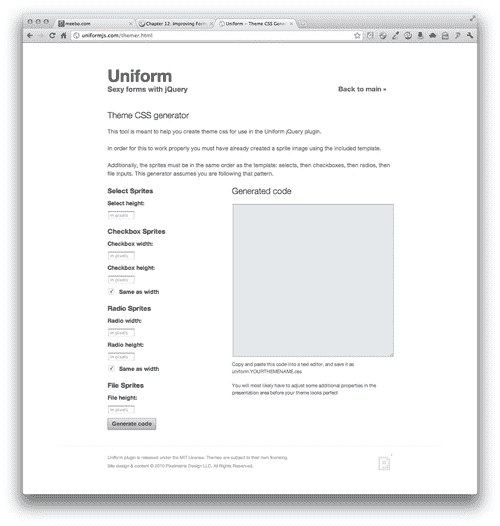

    +   填写表单，包括选择精灵的高度、复选框和单选按钮的宽度和高度，以及文件输入的高度。然后点击生成代码。生成用于使 Uniform 与你的精灵配合工作所需的 CSS 将为您生成。将其复制粘贴到 CSS 文件中并保存到您的项目中。

1.  将你的新 CSS 文件附加到 HTML 文档中，并将你的精灵保存为 PNG 文件，保存到你项目的`images`文件夹中，然后你应该一切就绪了。你可能会发现一些需要进行微小调整的地方，但设置一个自定义 Uniform 主题就是这么简单。

### 注意

如果您想将您的主题贡献给 Uniform 社区，让其他设计师和开发人员使用，您可以通过将您的主题的 zip 文件发送到 `<josh@pixelmatrixdesign.com>` 来将其提交给 Pixelmatrix。

## 刚刚发生了什么？

我们学习了如何使用 Pixelmatrix 提供的主题工具包和自定义主题 CSS 生成器，快速轻松地创建我们自己的 Uniform 主题。

# 概要

嗯，这就结束了有关表单的章节。我们学会了如何正确使用新的 HTML5 表单元素来创建一个功能完美且易于访问的表单。我们学会了如何将焦点放在表单中的第一个字段上，在所有浏览器中使用占位文本，验证我们网站访客的表单输入，并为那些难以样式化的固执和臭名昭著的表单元素添加样式。现在你拥有了一系列工具来创建在你的网站上增强你的网站访客体验的美观表单。最重要的是，它们都能够在禁用 JavaScript 的用户上优雅地降级，因为我们采用了渐进增强的思维方式来处理我们的表单 —— 首先构建一个可工作的表单，然后逐步添加增强功能，以供那些浏览器支持的网站访客使用。

我知道对于设计师来说，JavaScript 可能是一个可怕的主题。感谢你一直陪伴我到书的最后！我希望现在你对 jQuery 有了基本的理解，并且确信自己能够自信地应对下一个 JavaScript 挑战。你知道如何有效地利用 jQuery 库来增强你的网站。你知道如何找到好的插件，快速轻松地编写交互功能。你知道 CSS 和 JavaScript 如何共同工作，以增强网站访客在你的网站上的体验。你也知道，如果遇到困难，网络上有很多教程、资源、帮助论坛、文章和讨论可以帮助你。

对于 jQuery 而言，每一次发布都会变得更加出色 — 更加简洁、更快、更有能力。jQuery 团队会注意保持文档的更新，因此你总能弄清楚如何使用每个方法。jQuery 团队聪明而迅速，新的 jQuery 更新定期发布。所有这些都指向一个活跃且有用的库，在 Web 上的受欢迎程度将继续增长。它是许多程序员的最爱，从经验丰富的黑客到像你这样的初学者。

希望你喜欢这本书，并且它给你带来了许多新的想法，可以为你的网站设计和构建交互式元素。一定要与 jQuery 社区保持联系 —— 这将是你在进一步改进和发展 JavaScript 技能方面的最佳资源。
