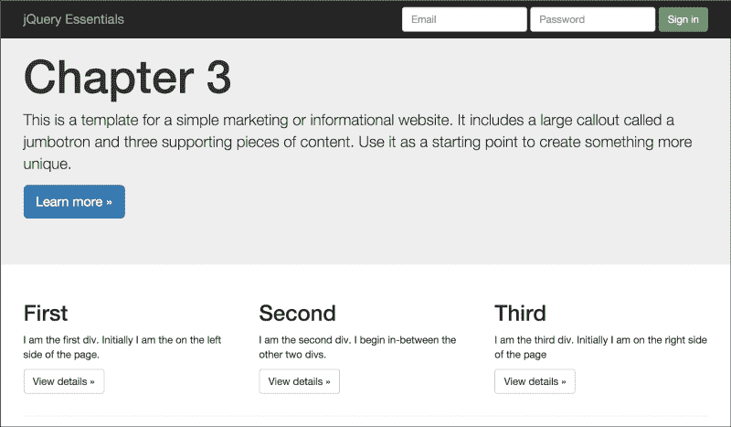

# 第三章：操作 DOM

在上一章中，我们学习了如何使用 jQuery 的选择器来查找 DOM 中我们正在寻找的元素。在本章中，我们将利用这些知识首先找到元素，然后修改它们。我们将学习 jQuery 提供的不同方法，以帮助我们的网站既美观又动态。

jQuery 有三十多个方法以某种方式操纵 DOM，但不要让这个数字吓到你。所有方法都可以轻松分为四个不同的类别：尺寸和位置、类和样式、属性和属性以及内容。就像 jQuery 中的大多数事物一样，一旦你深入研究，你就会很快看到这些不同方法组之间的模式是如何相关的。

许多方法运行在两种模式之一：获取器或设置器。在获取器模式中，该方法从元素中检索或获取值，并将其返回给调用者。在设置器模式中，调用者向方法传递值，以便它可以修改匹配的元素集。我认为现在我们已经准备好开始处理尺寸和位置了。

许多方法有两种形式，它们只在选择器和内容的顺序上有所不同。一种版本将采用更传统的形式，即选择器然后是内容形式，另一种将采用内容然后是选择器形式。顺序颠倒的主要原因是链式操作。当一个方法返回一个包含我们需要的内容的 jQuery 对象时，能够使用内容优先版本给我们一个可以使用的方法。

本章将涵盖大量内容。以下是我们将深入探讨的主题：

+   尺寸和位置

+   读取屏幕和元素的大小

+   类和样式

+   JSON 对象

+   属性和属性

+   保持图片的比例

+   删除属性和属性

# 尺寸和位置

在 Web 开发中，我们通常倾向于不想处理元素大小的具体细节，但偶尔这样的信息会派上用场。在我们深入了解大小的细节之前，你需要知道一些事情。首先，只返回匹配集中第一个元素的大小。其次，读取大小会终止 jQuery 链，因此你不能在其后使用任何其他方法。最后，读取元素大小的方法不止一种。你选择的方法种类取决于你想要知道什么。让我们以读取宽度为例。

## 例子

在前一章中，我们从一个空白的网页开始，并添加了足够的 HTML 来解释每个方法的作用。在现实世界中，我们很少有一块空白的画布可以使用。所以在本章中，我们将使用一个看起来更完整的网页，它将基于非常受欢迎的 Bootstrap Jumbotron 模板。Bootstrap 是最受欢迎的 CSS 框架之一，在我们的示例中使用它将帮助你熟悉现代网站设计，因为如今很少有人编写自己的 CSS。我们不打算多谈 Bootstrap 或它的工作原理，但在 Packt Publishing 网站上有很多关于它的好书，包括*Learning Bootstrap*。



## 开发者工具

大多数现代浏览器都有一组内置的开发者工具。如何激活这些工具因浏览器而异。在 Internet Explorer 中，按下*F12*会激活开发者工具。在 Chrome 和 Firefox 中，*Ctrl + Shift + I*可以完成这项工作。我们将使用开发者工具来查看控制台日志输出。通过将信息写入日志而不是使用`alert()`方法显示它，我们不会中断网站的流程，也不会在你在被允许继续之前被弹出窗口打扰。

大多数现代浏览器的控制台对象将附有许多方法，但我们只关心一个方法，即`log()`。我们将以最简单的形式使用`log()`方法：简单地输出字符串。希望示例代码在你运行它的任何浏览器上都能顺利运行。

## 读取屏幕和元素的大小

读取宽度有三种方法：`.width()`、`.innerWidth()`和`.outerWidth()`。第一个方法`.width()`只返回元素的宽度。接下来的方法`.innerWidth()`返回元素及其边框和填充的宽度。最后一种方法`.outerWidth()`返回元素加上边框和填充的宽度，并且如果你传递 true，它还会包括其外边距的宽度。

对于处理元素高度的每个方法，都有一个对应的高度方法。这些方法是`.height()`、`.innerHeight()`和`outerHeight()`。每个与其宽度对应方法类似。

为了确定显示的大小，你可以调用窗口的`.width()`和`.height()`方法：

```js
var screenWidth = $(window).width();
var screenHeight = $(window).height();
```

上面的代码检索了一个指向窗口元素的 jQuery 对象。第一行代码获取了窗口的宽度，第二行获取了它的高度。

尽量不要混淆窗口和文档。有时它们可能给出相同的结果，但要记住文档可以超出窗口的大小。当它超出时，将出现滚动条。它们不是等价的。

获取屏幕元素的尺寸是很好的，但有时候，你也需要知道它的位置。只有一个方法返回位置，它被命名为`.position()`。与其他值方法一样，它会打破链条，因为它返回一个对象，该对象包含相对于其父元素的位置的顶部和左侧值。

与`.position()`相对应的一个方法是`.offset()`。它们之间的区别很重要。`.offset()`方法返回相对于文档而不是其父元素的元素位置。使用`.offset()`方法允许我们比较具有不同父元素的两个元素，这是使用`.position()`方法几乎没有意义的事情。除非我们使用绝对或相对定位而不是浏览器默认的静态定位，否则我们通常看不到这两种方法之间的区别：

```js
// .position() vs. .offset()
var myPosition = $("body > .container > .row > .col-md-4:last").position();
console.log("My Position = " + JSON.stringify(myPosition));
var myOffset = $("body > .container > .row > .col-md-4:last").offset();
console.log("My Offset = " + JSON.stringify(myOffset));
```

该组中的最后两个方法是`.scrollLeft()`和`.scrollTop()`。这两种方法与其他方法不同，因为它们既是获取器又是设置器。如果传递了参数，`.scrollLeft()`会使用它来设置滚动条的水平位置。`.scrollTop()`方法执行类似的操作，设置滚动条的垂直位置。这两种方法将设置匹配集中每个元素的位置。

# 类和样式

类和样式组中的第一个方法是`.css()`。这个方法非常强大，展示了为什么 jQuery 是 HTML5 浏览器时代的必需和有用的库。`.css()`方法既是获取器又是设置器。作为获取器，它返回计算出的样式属性或属性。它接受一个字符串作为参数，该字符串是要检索的 CSS 属性的名称，或者是表示所有 CSS 属性的字符串数组：

```js
// .css(), retrieving a single property
var backgroundColor = $(".jumbotron > .container > p > a").css("background-color");
console.log("Background Color = " + JSON.stringify(backgroundColor));
// .css(), retrieving multiple properties in a single call
var colors = $(".jumbotron > .container > p > a").css(["background-color", "color"]);
console.log("Colors = " + JSON.stringify(colors));
```

上述代码的结果如下：

**背景颜色 = "rgb(51, 122, 183)"**

**颜色 = {"background-color":"rgb(51, 122, 183)","color":"rgb(255, 255, 255)"}**

## JSON 对象

大多数现代浏览器都包含 JSON 对象。JSON，就像 XML 一样，是一种数据交换格式。它是与语言无关的，轻量级的，易于理解的。添加到浏览器的 JSON 对象具有两个重要方法。第一个方法`.parse()`接受一个表示 JSON 对象的字符串，并将其转换为 JavaScript 对象。第二个函数`.stringify()`接受一个 JavaScript 对象，并将其转换为 JSON 字符串。这些方法旨在用于序列化和反序列化对象。但我们也可以在我们的示例代码中使用这些方法。`.stringify()`方法可以将 JavaScript 对象呈现为字符串，我们可以将这些字符串发送到控制台。

使用`.css()`方法的强大之处之一在于它可以理解多种不同格式中你引用的属性。举个例子，CSS 属性`margin-left`，DOM 将其称为`marginLeft`；jQuery 理解这两个术语是相同的。同样，它理解用于实际访问属性的浏览器方法，大多数浏览器称之为`getComputedStyle()`，但不同版本的 Internet Explorer 称之为`currentStyle()`或者`runtimeStyle()`。

`.css()`方法的设置模式有几种设置属性的方式。最简单的方法是简单地将属性名和它的新值作为参数传递进去。

```js
// .css(), passing a property name and value, change the button to orange
$(".jumbotron > .container > p > a").css("background-color", "orange");
```

你也可以通过将值设置为空字符串来以相同的方式移除属性。我们可以改变属性的另一种方式是将它们作为键值对传递给对象：

```js
// .css(), passing in multiple properties as an object
var moreProperties =; { "background-color": "pink", "color": "black"};
$("body > .container > .row > .col-md-4 .btn:first").css(moreProperties);
```

我们改变属性的最后一种方法是传递一个属性和一个函数。函数的返回值由 jQuery 用于设置属性。如果函数既不返回任何内容，也不返回"undefined"，那么属性的值就不会发生变化：

```js
// .css(), setting a random background color on each call
$("body > .container > .row > .col-md-4 .btn:last").css("background-color", function (index) {
   var r = Math.floor(Math.random() * 256),
           g = Math.floor(Math.random() * 256),
           b = Math.floor(Math.random() * 256),
           rgb = "rgb(" + r + "," + g + "," + b + ")";
   return rgb;
});
```

```js
When you only have one or two properties that you are changing in one element, you can get away with directly tweaking the CSS properties of the element. But a better and faster way is to put all of the changes into CSS classes and add or remove a class to/from the elements. jQuery has four methods that will help you manipulate the classes assigned to an element.
```

这个组的第一种方法是`.addClass()`，它将一个类添加到一个元素中。如果你使用 DOM 方法分配了一个类，你必须确保该类不会被重复分配，但是使用`.addClass()`，如果类已经分配给元素，它不会被重复分配。你不只是限于一次只分配一个类。你可以添加任意多个，只要确保每个类之间用空格分隔。

像许多其他的 jQuery 方法一样，`.addClass()`也有一个非常酷的额外功能：它也可以接受一个函数。这个有什么酷的呢？好吧，想象一下，你有一组按钮，你想根据它们在集合中的位置给每个按钮分配一个不同的颜色类。你可以很容易地编写一个函数来处理这种情况。jQuery 向函数传递两个参数。第一个是匹配集合中元素的索引。第二个参数是一个字符串，其中包含所有当前应用的类，每个类由一个空格分隔。下面是一个例子：

```js
// changes each of the buttons a different color
$("body > .container > .row > .col-md-4 .btn").addClass(function (index) {
   var styles = ["info", "warning", "danger"],
           ndx = index % 3,
           newClass = "btn-" + styles[ndx];

   return newClass;
});
```

最终，我们需要删除一个类，这就是为什么我们使用`.removeClass()`。取决于你传递给它的参数，它的行为会发生变化。如果你传递一个类名给它，它将删除该类。如果你传递多个由空格分隔的类名，它将删除这些类。如果不传递参数，它将删除所有当前分配的类。如果传递的类名不存在，就不会发生错误。

像`.addClass()`一样，`.removeClass()`也可以接受一个函数。jQuery 向函数传递一个索引和当前分配的所有类的字符串。要删除类，你的函数应该返回一个包含你想要删除的所有类名的字符串。

`.hasClass()`方法返回`true`，如果匹配集中的任何元素具有传递的类，则返回`true`。如果没有任何元素具有传递的类，则返回 false。请记住，如果你传递给它一个具有 100 个`<div>`的匹配集，只有一个具有传递的类名，该方法将返回 true：

```js
// does any of the divs have the .bosco class?
var hasBosco = $("body > .container > .row > .col-md-4").hasClass("bosco");
console.log("has bosco: " + hasBosco);
```

`.toggleClass()`方法是一个节省时间的便利功能。通常，我们会发现自己只是添加一个类（如果不存在）并删除它（如果存在）。这正是`.toggleClass()`被创建解决的场景。你传递给它一个或多个要切换打开或关闭的类。

你还可以传递`.toggleClass()`的第二个参数，一个布尔值，表示是否应该添加或删除类：

```js
// remove the info class
var shouldKeepClass = false;
$("body > .container > .row > .col-md-4 .btn").toggleClass("btn-info", shouldKeepClass);
```

它比简单调用`.removeClass()`的优势是，你可以将布尔值作为变量传递，并在运行时决定是否添加或删除类。

像其兄弟一样，你也可以将一个函数传递给`.toggleClass()`。函数传递一个索引，该索引是匹配集中对象的位置，当前类名和当前状态。它返回 true 以添加类，false 以删除类。

## 行为类

通常，你添加一个类来影响其外观。有时，你可能想要添加一个类以影响 JavaScript 如何处理元素。为什么要为行为使用类？这是因为类是布尔值，一个元素要么具有给定的类，要么没有。另一方面，属性是键值对，你需要知道属性是否存在以及它持有什么值。这通常使处理类比处理等价的属性更容易，在某些情况下，语法上更清晰。

# 属性和属性

在我们讨论处理属性和属性的方法之前，我们必须首先讨论一个更大的问题：属性和属性之间有什么区别？它们是不同的，但是怎么样？

当 DOM 从 HTML 属性构建时，构建包含在标记中的键值对。这些属性大多被转换为属性，并放置到 DOM 元素节点上。要理解的重要一点是，一旦构建了元素节点，属性将用于跟踪节点的状态，而不是属性。如果使用 jQuery 更新属性，则不会更新属性；如果是，JavaScript 会更改 DOM。它们表示 DOM 在首次加载时的状态，这是个问题。想想复选框：

```js
<input id="myCheckbox" type="checkbox" checked="checked" />
```

当 DOM 解析此复选框时，它会为此元素的节点创建一个已检查的属性。它还根据 W3C 规范中制定的规则创建一个 `defaultChecked` 属性。属性和属性之间的区别变得清晰起来。无论用户点击多少次复选框，`.attr()` 总是返回 `checked`，因为这是它在解析 HTML 时的状态。另一方面，`.prop()` 将根据当前实际状态从 "true" 切换到 "false"。

`.attr()` 方法从 jQuery 的一开始就存在。最初它被用来读取和设置属性和属性的值。这是一个错误；属性和属性是不同的，但理解这种区别是困难的。在 jQuery 1.6 中，引入了 `.prop()` 方法，并且将 `.attr()` 方法的范围限制在只能是属性。这打破了很多使用 `.attr()` 方法来设置属性的网站。这在 jQuery 社区引起了相当大的骚动，但现在已经平息。一般来说，如果你想要属性的当前值，请使用 `.prop()` 而不是 `.attr()`。现在我们理解了属性和属性之间的区别，让我们学习如何使用这些方法。

`.attr()` 方法既充当属性的获取器，也充当属性的设置器。当以获取器形式使用时，它将获取匹配集中第一个元素的属性。它只接受一个参数：要检索的属性的名称。当以设置器形式使用时，它将在匹配集中的所有成员上设置一个或多个属性。你可以以几种不同的方式调用它。第一种是用字符串中的属性名称和其设置值。第二种是通过传递一个包含你希望设置的所有属性值对的对象来调用它。最后一种是用属性名称和一个函数。函数将传递一个索引和属性的旧值。它返回所需的设置值。以下是一些示例：

```js
// setting an element attribute with an attribute and value
$("body > .container > .row > .col-md-4 .btn").attr("disabled", "disabled");
// setting an element attribute with an object
$("body > .container > .row > .col-md-4 .btn").attr({"disabled": "disabled"});
// setting an element attribute with a function
$("body > .container > .row > .col-md-4 .btn").attr("name", function(index, attribute){
   return attribute + "_" + index;
});
```

`.prop()` 方法在其获取器和设置器形式中都以与 `.attr()` 方法相同的方式调用。一般来说，当操作元素的属性时，这是首选方法。

## 保持图像比例

使用 `.attr()` 方法，你可以通过调整高度和宽度属性来调整图像的大小。如果你希望保持图像大小的比例而不必计算正确的宽度对应的高度或反之亦然，有一个简单的方法。而不是同时更改宽度和高度，删除高度属性并只修改宽度。浏览器将自动调整高度以与宽度成比例。

## 删除属性和属性

为了从元素中删除一个属性，我们使用 `.removeAttr()`。你可以用单个属性名称或用以空格分隔的多个属性名称来调用它。它有一个额外的好处，即在删除属性时不会泄露内存。

`.removeProp()`方法与`.removeAttr()`密切相关。请记住，您应该只从元素中删除自定义属性，而不是原生属性。如果您删除原生属性，比如 checked、disabled 等，它将无法添加回元素。您可能希望使用`.prop()`方法将属性设置为 false，而不是删除属性。

`.val()` 方法主要用于从表单元素中检索值。它从匹配集的第一个元素中获取值，该集包括输入、选择和`textarea`方法元素：

```js
// retrieving data from an input tag with .val()
var firstName = $('#firstName').val();
console.log("First name:" + firstName);
var lastName = $('#lastName').val();
console.log("Last name:" + lastName);
```

从输入标记中检索值非常容易，就像前面的代码所示。`.val()`方法提取元素的当前字符串值。

返回的数据类型取决于它从中检索数据的元素类型。如果它从输入标记获取数据，则返回类型为字符串。如果使用多个属性选择标记，则如果未选择任何项目，则返回类型为 null。如果选择了一个或多个项目，则返回类型为字符串数组，数组中的每个项都是所选选项的值。

```js
// .val() reading the value of a multiple select
var options = $('#vehicleOptions').val();
$.each(options, function (index, value) {
   console.log("item #" + index + " = " + value);
});
```

在其设置器形式中使用时，您可以将单个字符串值、字符串数组或函数传递给`.val()`。传递单个字符串是最典型的用例。它正是您所期望的：它设置元素的值：

```js
// using .val() to set the last name field
$('#lastName').val("Robert");
```

当您将字符串数组传递给设置了多个属性的选择元素时，它首先会清除任何以前选择的选项，然后选择所有值与传递的数组中的值相匹配的选项：

```js
// using .val() to select multiple new options
$('#vehicleOptions').val(["powerSeats", "moonRoof"]);
```

像另外两种方法`.attr()`和`.prop()`一样，您也可以传递一个函数。jQuery 将向函数发送两个参数：一个整数，表示匹配集中元素的索引，和一个表示元素当前值的值。您的函数应返回一个表示元素新值的字符串。

要检索元素的 HTML 内容，我们使用`.html()`方法。它将标记作为字符串返回：

```js
// .html() getting some markup
var html = $('#testClass').html();
console.log("HTML: " + html);
```

当`.html()`传递一个字符串时，它会将匹配集的所有元素设置为新的标记。您也可以将一个函数传递给`.html()`。该函数传递给这两个参数：索引和保存旧 HTML 的字符串。您从函数中返回一个包含新 HTML 的字符串：

```js
// .html() setting markup
$('#testClass').html("<div><h2>Hello there</h2></div>");
```

`.text()`方法检索匹配集中所有元素的文本内容。需要注意的是，就这个方面，此方法的操作方式与其他方法非常不同。通常，getter 仅从集合中的第一个元素获取数据。此方法将连接所有元素的文本，如果您没有预期到这一点，可能会产生令人惊讶的结果：

```js
// .text() getting text values
var comboText = $("select").text();
console.log(comboText);
```

需要注意的是，`.text()`方法用于文本，而不是 HTML。如果您尝试将 HTML 标记发送给它，它将不会被呈现。例如，让我们尝试向`.html()`方法成功发送的相同标记：

```js
// .text() trying to send HTML
$('#testClass').text("<div><h2>Hello there</h2></div>");
```

如果我们想要添加更多的 HTML 而不是替换它，我们可以使用`.append()`和`.appendTo()`方法。它们都会将传递的内容添加到匹配集中每个元素的末尾。两者之间的区别在于可读性，而不是功能性。使用`.append()`时，选择器先出现；然后是新内容。`.appendTo()`方法将此反转，使得新内容出现在选择器之前：

```js
// .append()
$("body > .container > .row > .col-md-4").append("<div><h2>Hello</h2></div>");
// .appendTo()
$("<div><h2>Goodbye</h2></div>").appendTo("body > .container > .row > .col-md-4");
```

`.prepend()`和`.prependTo()`方法与`.append()`和`.appendTo()`类似，只是内容放在每个元素的开头而不是结尾：

```js
// .prepend()
$("body > .container > .row > .col-md-4").prepend("<div><h2>Hello</h2></div>");
// .prependTo()
$("<div><h2>Goodbye</h2></div>").prependTo("body > .container > .row > .col-md-4");
```

前面的方法使新内容成为父级的子级。接下来的几种方法使新内容成为父级的同级。`.after()`和`.insertAfter()`方法将新内容添加为父级后的同级。与`.append()`和`.appendTo()`一样，两者之间的唯一区别是内容和选择器的顺序：

```js
// .after()
$("select").after("<h2>Hello</h2>");
// .insertAfter()
$("<h2>Goodbye</h2>").insertAfter("select");
```

`.before()`和`.insertBefore()`方法将新内容添加为父元素之前的同级。同样，它们之间的唯一区别是内容和选择器的顺序：

```js
// .before()
$("select").before("<h2>Hello</h2>");
// .insertBefore()
$("<h2>Goodbye</h2>").insertBefore("select");
```

`.wrap()`方法允许您用新元素包围匹配集中的每个成员：

```js
// .wrap() surrounds the button with a border
$("a").wrap("<div style='border: 3px dotted black;'></div>");
```

此方法不应与`.wrapInner()`方法混淆。两者之间的区别在于`.wrap()`将匹配集的每个成员用新元素包围起来。然而，`.wrapInner()`将匹配集的每个子元素用新内容包围起来。这两种方法的区别在示例代码中非常清晰。`.wrap()`方法用点线框包围每个按钮`<a>`标签。而`.wrapInner()`方法则将按钮的文本用点线框包围起来：

```js
// wrapInner() surrounds the button's text with a border
$("a").wrapInner("<div style='border: 3px dotted black;'></div>");
```

`.wrapAll()`方法会用新的 HTML 元素包围匹配集中的所有元素。要小心使用此方法；它可能会彻底改变您的网页。如果集合的成员相距甚远，可能会产生很大甚至负面的影响。在使用此方法时，一定要选择最狭窄的选择器：

```js
// wrapAll() everything
$("select").wrapAll("<div style='border: 3px dotted black;'></div>");
```

此组方法的最后一个成员是`.unwrap()`。它移除了匹配集的父元素。本质上，它是`.wrap()`的反向操作：

```js
// .unwrap() removes the divs we added earlier
$("a").unwrap();
```

保持删除标记的主题，我们有这些方法：`.remove()`、`.empty()`和`.detatch()`。这些方法中的第一个，`.remove()`，从 DOM 中删除匹配的元素集。元素及其所有子元素都将被删除：

```js
// .remove() deletes the a tags from the page
$("a").remove();
```

与之密切相关的`.empty()`方法也会从 DOM 中删除内容。两者之间的区别在于`.empty()`删除匹配集的子元素，而`.remove()`删除匹配的元素本身：

```js
// .empty() keeps the a tags but deletes their text
$("a").empty();
```

最后一个方法`.detached()`，与`.remove()`方法的行为类似，只有一个区别：被移除的内容以一组 jQuery 对象的形式返回给调用者。如果你需要将网页中的标记从一个地方移动到另一个地方，这就是你的方法。不要忘记你可以在这个方法上使用链式调用：

```js
// .detach() deletes the a tags from the page and returns them to the caller
var myButtons = $("a").detach();
$('hr:last').append(myButtons);
```

`.replaceAll()` 和与之密切相关的`.replaceWith()`方法分别用传递的内容替换匹配的集合。两者之间唯一的区别是选择器和内容的顺序。在`.replaceWith()`方法中，选择器首先出现；然后是新内容。在`.replaceAll()`方法中，新内容首先出现：

```js
// .replaceWith() replacing the selects with divs
$('select').replaceWith("<div>Replaced</div>");
```

`.clone()` 方法复制匹配元素集合的副本。它复制每个元素及其所有子元素，然后将它们作为 jQuery 对象返回给调用者：

```js
// .clone() makes a copy of the form then we insert the copy 
$('.myForm').clone().insertBefore('.myForm');
```

# 总结

这一章节是一个相当艰难的旅程，但希望你已经看到了 jQuery 的 DOM 操作方法是经过合理思考的。我们学习了如何在现有元素之前和之后添加内容到页面。我们还学习了如何从页面中删除内容，甚至如何将内容从一个位置移动到另一个位置。

我们还学习到许多 jQuery 方法有两种不同的形式，以便为我们提供一种方法来使用一个方法获取页面内容并使用另一个方法设置页面内容。还有一些简单但方便的信息，可以使用 JSON 对象保持图像的比例，并确定元素的大小。

即使我们学到了很多，我们的网站仍然是静态的；在执行完 JavaScript 后，它不会做任何其他事情。在下一章中，我们将改变这种情况。我们将学习如何使用事件使我们的网站可以交互。
