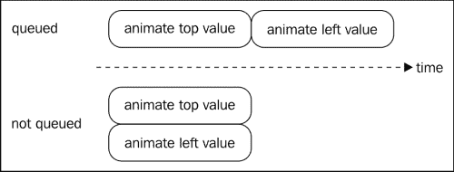
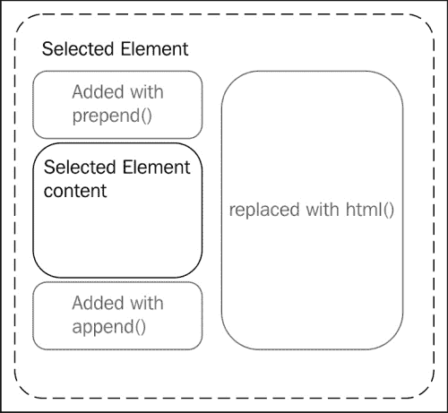

# 第一章 jQuery 游戏编程

在过去的几年里，jQuery 几乎已经成为任何 JavaScript 开发的默认框架。超过 55％的最受欢迎的 10,000 个网站以及估计总共 2400 万个网站正在使用它（更多信息，请参阅[`trends.builtwith.com/javascript/JQuery`](http://trends.builtwith.com/javascript/JQuery)）。而且这一趋势并没有显示出任何停止的迹象。

本书期望您具有一些 jQuery 的相关经验。如果您觉得自己不符合这个要求，那么您可以首先在*学习 jQuery*，*Jonathan Chaffer*，*Karl Swedberg*，*Packt Publishing*中了解更多。

本章将快速浏览 jQuery 的特点，然后更深入地了解它最具游戏性的函数。即使您可能已经使用过其中的大部分，您可能还不了解它们的全部功能。以下是本章涵盖的主题的详细列表：

+   jQuery 的特点

+   将帮助您移动元素的函数

+   事件处理

+   DOM 操作

# jQuery 的方式

jQuery 的哲学与大多数之前的 JavaScript 框架有所不同。了解它使用的设计模式是编写可读和高效代码的关键。我们将在接下来的几节中讨论这些模式。

## 链接

大多数 jQuery 语句的形式如下：选择后跟一个或多个操作。这些操作的组合方式被称为链式，并且是 jQuery 最优雅的方面之一。一个使用 jQuery 的初学者想要将元素的宽度设置为 300 像素，高度设置为 100 像素，通常会写成：

```js
$("#myElementId").width(300);
$("#myElementId").height(100);
```

使用链接，这可以写成：

```js
$("#myElementId").width(300).height(100);
```

这有很多优点：元素只被选择一次，并且生成的代码更紧凑，传达了语义意义，即你想要实现的确实只是一件事，那就是改变元素的大小。

允许链式调用的函数不仅可以将许多调用组合在同一个对象上，还有许多实际上可以在哪个对象（或对象）上进行下一个链上的函数操作的方法。在这些情况下，通常使用缩进来传达这样一个想法：你不是在同一层级的元素上操作。

例如，以下链首先选择一个元素，然后将其背景颜色设置为`red`。然后将链中的元素更改为前一个元素的子元素，并将它们的`background-color`属性更改为`yellow`。

```js
$("#myElementId").css("background-color", "red")
   .children().css("background-color", "yellow");
```

很重要的一点是，您必须始终问自己当前和链中上一个和下一个元素的相互作用如何可以避免产生不良行为。

## 多态性

jQuery 有自己的多态使用方式，给定函数可以以许多不同的方式调用，具体取决于你想给它多少信息。让我们看一下`.css()`函数。如果只使用`String`数据类型作为唯一参数调用该函数，则该函数将作为 getter 运行，返回你要求的 CSS 属性的值。

例如，以下行检索给定元素的左侧位置（假设它是绝对定位的）：

```js
var elementLeft = $("#myElementId").css("left");
```

但是，如果传递第二个参数，则它将开始行为类似于 setter，并设置 CSS 属性的值。有趣的是，第二个参数也可以是一个函数。在这种情况下，函数预计返回将设置为 CSS 属性的值。

以下代码就是这样做的，并使用一个函数，该函数将增加元素的左侧位置一个单位：

```js
$("#myElementId").css("left", function(index, value){
   return parseInt(value)+1;
});
```

但是；等一下，还有更多！如果你向同一个函数只传递一个元素，但该元素是一个对象文字，那么它将被视为保存属性/值映射。这将允许你在一个单一调用中更改许多 CSS 属性，就像在以下示例中将左侧和顶部位置设置为 100 像素一样：

```js
$("#myElementId").css({
   left: 100,
   top: 100
});
```

你也可以像在 JSON 中那样，使用字符串作为对象文字的键和值。

一个非常完整的资源，用于了解调用函数的所有方式，是 jQuery API 网站 ([`api.jquery.com`](http://api.jquery.com))。

现在我们将重点关注一些对开发游戏感兴趣的函数。

# 移动物体

对于动画，链式有着稍微不同的意义。虽然你在大多数游戏中实际上可能从未需要使用 jQuery 动画函数，但仍然有意思看到它们的工作特点，因为它可能导致许多奇怪的行为。

## 链接动画

jQuery 的`.animate()`函数允许你通过时间使属性的值从当前值变化到新值。举个典型的例子，可以移动它左边 10 像素，或者改变它的高度。从你之前看到的以及体验到其他类型的函数，你可能期望以下代码将使一个 div（DOM division 元素）对角线移动到位置`left = 200px`和`top = 200px`。

```js
$("#myElementId").animate({top: 200}).animate({left: 200});
```

然而，它并不会！相反，你将看到 div 首先移动到达`top = 200px`，然后才移动到`left = 200px`。这称为排队；每次调用`animate`都将排队到之前的调用，并且只有在它们都完成后才会执行。如果你想同时执行两个移动，从而生成对角线移动，你将只能使用一次`.animate()`调用。

```js
$("#myElementId").animate({top: 200,left: 200});
```

另一种可能性是明确告诉`.animate()`函数不要排队执行动画：

```js
$("#myElementId").animate({top: 200}).animate({left: 200},{queue: false});
```

请记住，这也适用于实际上是包装在`.animate()`函数周围的其他函数，例如以下情况：

+   `fadeIn()`、`fadeOut()`和`fadeTo()`

+   `hide()` 和 `show()`

+   `slideUp()` 和 `slideDown()`



## 管理队列

下面是一系列函数，你可以使用它们来操作这个动画队列。

### .stop()

`.stop()` 函数停止队列当前的动画。如果你在调用时提供了更多的参数，你还可以清除队列并定义元素是否停止动画并停留在原地，或者跳转到它们的目标位置。

### .clearQueue()

`.clearQueue()` 函数从队列中删除所有动画；不仅是当前的动画，还有所有接下来的动画。

### .dequeue()

`.dequeue()` 函数启动队列中的下一个动画。这意味着当调用此函数时正在执行动画时，新的动画将在当前动画执行完成后开始。例如，如果我们拿本节开头的示例并在结尾添加一个 `dequeue()` 函数，元素将实际上开始对角线移动。

```js
$("#myElementId")
.animate({top: 200})
.animate({left: 200})
.dequeue();
```

### .delay()

`.delay()` 函数允许你在队列中的两个动画之间插入一个暂停。例如，如果你想要使用 `.fadeIn()` 使元素可见，然后等待 2 秒，再用 `.fadeOut()` 使其消失。这将被写成这样：

```js
$("#myElementId").fadeIn().delay(2000).fadeOut();
```

## 队列的其他用途

队列不仅用于动画。当你没有另外指定时，被这些函数操作的队列是 `fx` 队列。这是动画使用的默认队列。但是，如果你愿意，你可以创建另一个队列，并添加任意数量的自定义函数和延迟，以便在游戏中脚本一些时间相关的行为。

# 事件处理

如果您以前使用过 jQuery，您可能在某个时候使用过 `.click()`。它用于定义一个事件处理程序，用于在 jQuery 中响应鼠标点击。还有许多其他的事件处理程序，从键盘输入、表单提交到窗口调整大小，但我们不会逐一介绍所有这些。而是专注于更 "低级别" 的函数来处理 jQuery 中的事件，并准确解释它们之间的微妙差异。

你通常会使用其中一些函数来实现游戏的控制，无论是通过鼠标还是键盘输入。

## .bind()

`.bind()` 函数是处理事件的基本方式。`.click()` 例如，只是它的一个包装器。以下示例的两行具有完全相同的效果：

```js
$("#myElementId").click(function(){alert("Clicked!")});
$("#myElementId").bind('click', function(){alert("Clicked!")});
```

但是，使用 `bind` 有一个限制。像所有其他 jQuery 函数一样，它仅适用于所选元素。现在，想象一种情况，你想要在用户每次点击具有给定类的链接时执行某些任务。你会写出这样的代码：

```js
$(".myClass").click(function(){/** do something **/});
```

这将按预期工作，但仅适用于网页中在执行时存在的链接。如果你使用 Ajax 调用更改页面内容，并且新内容也包含具有此类的链接，那么你将不得不再次调用此行代码来增强新链接！

这远非理想，因为你必须手动跟踪你定义的所有事件处理程序，这些处理程序可能需要稍后再次调用，以及你改变页面内容的所有位置。这个过程很可能会出错，你最终会得到一些不一致的结果。

解决这个问题的方法是 `.delegate()`，详细说明见下一节。

## .delegate()

使用 `.delegate()`，你将事件处理的责任交给了一个父节点。这样，稍后添加到该节点（直接或间接）下面的所有元素仍将看到相应的处理程序执行。

以下代码修复了前面的示例，使其能够与稍后添加的链接一起工作。这意味着所有这些链接都是 `ID` 属性为 `page` 的 div 的子元素。

```js
$("#page").delegate(
".myClass", 
"click", 
function(){/** do something **/});
```

这是解决问题的一个非常优雅的方式，当你创建游戏时，它会非常方便，例如，当你点击精灵时。

## 移除事件处理程序

如果你需要移除一个事件处理程序，你可以简单地使用 `.unbind()` 和 `.undelegate()` 函数。

## jQuery 1.7

在 jQuery 1.7 中，`.delegate()` 和 `.bind()` 已被 `.on()`（以及 `.off()` 用于移除处理程序）取代。将其视为一个具有像 `.bind()` 一样行为能力的 `.delegate()` 函数。如果你理解了 `.delegate()` 的工作原理，你将没有问题使用 `.on()`。

# 将数据与 DOM 元素关联

假设你为游戏中的每个敌人创建一个 div 元素。你可能想要将它们与一些数值关联起来，比如它们的生命值。如果你正在编写面向对象的代码，你甚至可能想要关联一个对象。

jQuery 提供了一个简单的方法来做到这一点，即 `.data()`。这个方法接受一个键和一个值。如果你稍后只调用它的键，它将返回这个值。例如，以下代码将数值 `3` 与键 `"numberOfLife"` 关联到了 ID 为 `enemy3` 的元素上。

```js
 $("#enemy3").data("numberOfLife", 3);
```

你可能在想，“为什么我不能直接将我的值存储在 DOM 元素上呢？”对此有一个非常好的答案。通过使用 `.data()`，你完全解耦了你的值和 DOM，这将使得避免因为你仍然在某个地方保持着对它的某个循环引用而导致垃圾回收器没有释放与已移除元素的 DOM 关联的内存的情况变得更容易。

如果你使用 HTML5 数据属性定义了一些值（[`ejohn.org/blog/html-5-data-attributes/`](http://ejohn.org/blog/html-5-data-attributes/)），`.data()` 函数也会将它们检索出来。

但是，你必须记住调用这个函数会有一些性能成本，如果你需要为一个元素存储许多值，你可能会希望将它们全部存储在与单个键关联的对象字面量中，而不是许多值，每个值都与自己的键关联。

# 操纵 DOM

使用 jQuery 创建游戏时，您将花费相当多的时间向 DOM 添加和移除节点。例如，您可以创建新的敌人或移除已经死亡的敌人。在下一节中，我们将介绍您将要使用的函数，还将看到它们的工作原理。

## .append()

此函数允许您将子元素添加到当前选择的元素（或元素）。它的参数可以是一些已经存在的 DOM 元素、包含描述元素的 HTML 代码的字符串（或一整个元素层次结构），或者是选择某些节点的 jQuery 元素。例如，如果您想要将子元素添加到具有 ID `"content"` 的节点上，您可以这样写：

```js
$("#content").append("<div>This is a new div!</div>");
```

请记住，如果您向此函数传递一个字符串，那么内容将需要被解析，如果您经常这样做或者字符串非常大，可能会导致性能问题。

## .prepend()

此函数与`.append()`完全相同，但是将新内容添加到所选元素的第一个子元素之前，而不是添加到其最后一个子元素之后。

## .html()

此函数允许您使用作为参数传递的字符串完全替换所选节点的内容。如果没有传递参数调用它，它将返回所选元素中第一个的当前 HTML 内容。

如果您使用空字符串调用它，您将擦除所有节点的内容。这也可以通过调用`.empty()`来实现。



## .remove()

此函数将简单地删除所有选定的元素并注销所有关联的事件处理程序和数据。

## .detach()

在某些情况下，您可能只想暂时删除一些内容，然后稍后再添加。这通常是 `.remove()` 做得太好的情况。您真正想要的是保留与节点关联的所有其他内容，以便稍后重新添加时，它们将与以前完全相同。`.detach()` 就是为了这种情况而创建的。它的行为类似于 `.remove()`，但是允许您轻松重新插入元素。

# 保持好奇，我的朋友！

就是这样。我真的鼓励您阅读每个函数的 API，因为这里还有一些未显示的参数集。如果对其中任何函数仍然不清楚，不要犹豫在网络上寻找更多关于如何使用它们的示例。由于 jQuery 是如此流行的库，而网络文化是开放的，您将很容易在网上找到大量帮助。

以下是一些可以开始寻找有关 jQuery 更多信息的地方：

+   jQuery 的 API: [`api.jquery.com/`](http://api.jquery.com/)

+   学习 jQuery: [`www.learningjquery.com/`](http://www.learningjquery.com/)

# 摘要

在本章中，我们已经看到了一些对游戏开发非常有用的 jQuery 函数以及如何使用它们。到目前为止，您应该已经熟悉了 jQuery 的哲学和语法。在下一章中，我们将将学到的知识付诸实践，并创建我们的第一个游戏。
