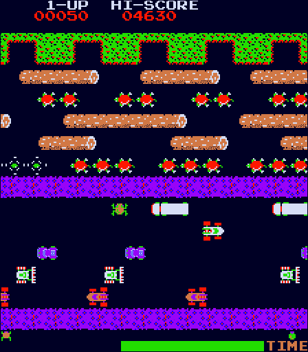
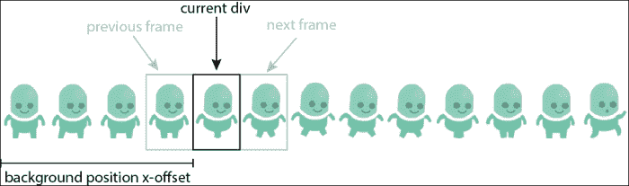
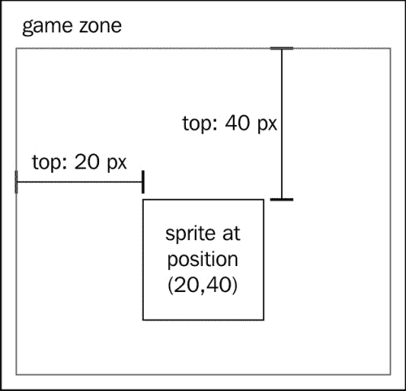
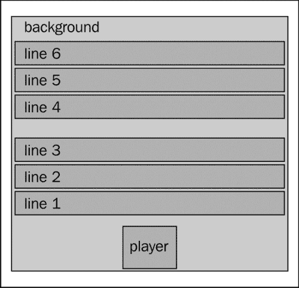
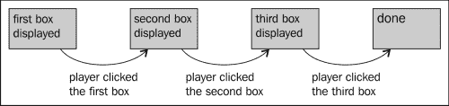
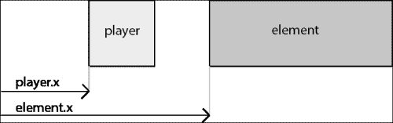

# 第二章：创建我们的第一个游戏

如果你看着电子设备，很有可能上面运行着一个浏览器！你可能在每台 PC 上安装了一个以上的浏览器，并在你的便携设备上运行了更多。如果你想以最低的入门成本将你的游戏分发给广泛的受众，使其在浏览器中运行是非常有意义的。

Flash 长时间以来一直是浏览器中游戏的首选平台，但在过去几年中它的速度逐渐减慢。有很多原因造成了这种情况，并且关于这是否是一件好事有无数的争论。然而，有一个共识是现在你可以在浏览器中以合理的速度运行游戏而无需插件。

本书将重点关注 2D 游戏，因为它们在当前浏览器上运行良好，并且它们依赖的功能已经标准化。这意味着浏览器的更新不应该破坏你的游戏，而且在大多数情况下，你不必过多担心不同浏览器之间的差异。

然而，你很快将能够开发现代 3D 游戏，就像在游戏机上一样，并让它们在浏览器上运行。如果这是你擅长的领域，这本书将为你提供制作这些游戏所需的基本知识。

在本章中，我们将涵盖以下主题：

+   创建动画精灵

+   移动精灵

+   预加载资源

+   使用有限状态机实现主游戏循环

+   基本碰撞检测

# 这本书是如何工作的？

制作游戏有这个惊人的优势，你可以立即看到你刚写的代码的结果在你眼前移动。这就是为什么这本书中学到的一切都将直接应用于一些实际例子的原因。在本章中，我们将一起编写一个受经典游戏*青蛙过河*启发的小游戏。在接下来的章节中，我们将制作一个平台游戏和一个角色扮演游戏（RPG）。

我真的鼓励你写下你自己版本的这里所介绍的游戏，并修改提供的代码以查看其效果。没有比动手做更好的学习方式了！

# 让我们认真对待 - 游戏

我们现在将要实现的游戏灵感来自*青蛙过河*。在这个老派街机游戏中，你扮演一个青蛙，试图通过跳上原木并避开汽车来穿过屏幕。



在我们的版本中，玩家是一个开发人员，他必须通过跳跃数据包来穿越网络电缆，然后通过避开错误来穿越浏览器的"道路"。总而言之，游戏规格如下：

+   如果玩家按一次向上箭头键，"青蛙"将前进一步。

+   通过按右箭头和左箭头键，玩家可以水平移动。

+   在第一部分（网络电缆）中，玩家必须跳跃到从屏幕左边出现并向右移动的数据包上。数据包按行组织，每行的数据包以不同的速度行进。一旦玩家站在数据包上，他/她将随之移动。如果数据包把玩家带到屏幕外，或者玩家跳到电缆上未到达数据包，他/她将会死亡，然后重新开始同一级别。

+   在第二部分（浏览器部分）中，玩家必须躲避从左边出现的错误以穿过浏览器屏幕。如果玩家被错误击中，他/她将会重新开始同一级别。

这些规则非常简单，但正如您将看到的，它们已经给我们提供了很多值得思考的地方。

# 学习基础

在本书中，我们将使用 DOM 元素来渲染游戏元素。另一个流行的解决方案是使用 Canvas 元素。这两种技术都有各自的优点和缺点，也有一些效果仅通过 DOM 元素是无法实现的。

然而，对于初学者来说，DOM 提供了易于调试的优势，几乎在所有现有的浏览器上运行（是的，即使在 Internet Explorer 6 上也是如此），而且在大多数情况下可以提供合理的游戏速度。DOM 还抽象了繁琐的工作，无需单独针对像素进行操作以及跟踪屏幕的哪一部分需要重新绘制。

即使 Internet Explorer 支持本书中所介绍的大部分功能，我也不建议创建支持 IE 的游戏。事实上，如今它的市场份额微不足道（[`www.ie6countdown.com/`](http://www.ie6countdown.com/)），而且您可能会遇到一些性能问题。

现在介绍一些游戏术语，精灵是游戏的移动部分。它们可以是动画的或非动画的（在改变外观与简单移动之间）。其他游戏的部分可能包括背景、用户界面和图块（我们将在第四章中深入讨论，*向旁边看*）。

## 框架

在本书中，我们将编写一些代码；部分代码属于一个示例游戏，并用于描述特定于该游戏的场景或逻辑。但是，某些代码很可能会在您的每个游戏中被重用。因此，我们将把一些这样的功能集中到一个被巧妙地称为`gameFramework`或简称`gf`的框架中。

### 提示

**下载示例代码**

您可以从[`www.packtpub.com`](http://www.packtpub.com)账户下载您购买过的 Packt 书籍的示例代码文件。如果您在其他地方购买了本书，可以访问[`www.packtpub.com/support`](http://www.packtpub.com/support)并注册，文件将直接通过电子邮件发送给您。

在 JavaScript 中定义命名空间的一个非常简单的方法是创建一个对象，并直接将所有函数添加到其中。以下代码为名称空间`cocktail`中的两个函数`shake`和`stir`提供了示例。

```js
// define the namespace
var cocktail = {};

// add the function shake to the namespace
cocktail.shake = function(){...}

// add the function stir to the namespace
cocktail.stir = function(){...}
```

这样做的优点是避免与其他使用类似名称的库的对象或函数发生冲突。因此，从现在开始，当您看到任何添加到命名空间的函数时，意味着我们认为这些函数将被其他我们稍后在本书中创建的游戏所使用，或者您可能想要自己创建的游戏使用。

下面的代码是另一种命名空间的表示法。您可以使用其中之一是个人偏好，您真的应该使用感觉正确的那个！

```js
var cocktail = {

    // add the function shake to the namespace
   shake: function(){...},

   // add the function stir to the namespace
   stir: function(){...}
};
```

通常，您会将框架的代码保存在一个 JS 文件中（假设为`gameFramework.js`），并将游戏的代码保存在另一个 JS 文件中。一旦您的游戏准备发布，您可能希望将所有 JavaScript 代码重新组合到一个文件中（包括 jQuery 如果您愿意的话）并将其最小化。但是，在整个开发阶段，将它们分开将更加方便。

## 精灵

精灵是您的游戏的基本构建块。它们基本上是可以在屏幕上移动和动画的图像。要创建它们，您可以使用任何图像编辑器。如果您使用的是 OS X，有一个我觉得特别好的免费软件，叫做 Pixen ([`pixenapp.com/`](http://pixenapp.com/))。

有许多使用 DOM 绘制精灵的方法。最明显的方法是使用`img`元素。这会带来几个不便。首先，如果要对图像进行动画处理，您有两个选项，但两者都不是没有缺点：

+   您可以使用动画 GIF。通过这种方法，您无法通过 JavaScript 访问当前帧的索引，并且无法控制动画何时开始播放或何时结束。此外，拥有许多动画 GIF 会导致速度大大减慢。

+   您可以更改图像的来源。这已经是一个更好的解决方案，但是提出的性能较差，而且需要大量单独的图像。

另一个缺点是您无法选择仅显示图像的一部分；您必须每次都显示整个图像。最后，如果您想要一个由重复图像组成的精灵，您将不得不使用许多`img`元素。

为了完整起见，我们应该在这里提到`img`的一个优点；缩放`img`元素非常容易——只需调整宽度和高度。

提出的解决方案使用了定义尺寸的简单 div，并在背景中设置了图像。要生成动画精灵，您可以更改背景图像，但我们使用的是背景位置 CSS 属性。在此情况下使用的图像称为精灵表，通常看起来像以下的屏幕截图：


生成动画的机制如下屏幕截图所示：



另一个优点是你可以使用单个雪碧图来容纳多个动画。这样你就可以避免加载许多不同的图像。根据情况，您可能仍然希望使用多个雪碧图，但尽量减少它们的数量是件好事。

### 实现动画

实现这个解决方案非常简单。我们将使用`.css()`来改变背景属性，并使用简单的`setInterval`来改变动画的当前帧。因此，假设我们有一个包含 4 帧行走循环的雪碧图，其中每帧测量`64 by 64`像素。

首先，我们只需创建一个带有雪碧图作为其背景的`div`。这个`div`应该测量`64 by 64`像素，否则下一帧会泄漏到当前帧。在下面的示例中，我们将雪碧图添加到 ID 为`mygame`的`div`中。

```js
$("#mygame").append("<div id='sprite1'>");
$("#sprite1").css("backgroundImage","url('spritesheet1.png')");
```

由于背景图像默认与`div`的左上角对齐，所以我们只会看到行走循环雪碧图的第一帧。我们想要的是能够改变哪个帧是可见的。以下函数根据传递给它的参数将背景位置更改为正确的位置。请查看以下代码以了解参数的确切含义：

```js
/**
 * This function sets the current frame. 
 * -divId: the Id of the div from which you want to change the
 *         frame
 * -frameNumber: the frame number
 * -frameDimension: the width of a frame
 **/
gameFramework.setFrame = function(divId,frameNumber, frameDimension) {
   $("#"+divId)
      .css("bakgroundPosition", "" + frameNumber * frameDimension + "px 0px");
}
```

现在我们必须定期调用这个函数来生成动画。我们将使用间隔为 60 毫秒的`setInterval`，即每秒约 17 帧。这应该足以给人一种行走的印象；然而，这确实必须进行微调，以匹配您的雪碧图。为此，我们使用一个匿名函数传递给`setInterval`，该函数将进一步使用正确的参数调用我们的函数。

```js
var totalNumberOfFrame = 4;
var frameNumber = 0;
setInterval(function(){
 gameFramework.setFrame("sprite1",frameNumber, 64);
   frameNumber = (frameNumber + 1) % totalNumberOfFrame;
}, 60);
```

你可能注意到我们正在做一些特殊的事情来计算当前帧。目标是覆盖从 0 到 3 的值（因为有 4 帧），并在达到 4 时循环回到 0。我们用于此的操作称为模数（`%`），它是整数除法的余数（也称为欧几里德除法）。

例如，在第三帧我们有`3 / 4`等于 0 加上余数 3，所以`3 % 4 = 3`。当帧数达到 4 时，我们有`4 / 4 = 1`加上余数 0，所以`4 % 4 = 0`。这个机制在很多情况下都被使用。

### 将动画添加到我们的框架

正如你所看到的，生成动画需要越来越多的变量：图像的 URL、帧数、它们的尺寸、动画的速率和当前帧。此外，所有这些变量都与一个动画相关联，因此如果我们需要第二个动画，我们必须定义两倍数量的变量。

显而易见的解决方案是使用对象。我们将创建一个动画对象，它将保存我们需要的所有变量（现在，它不需要任何方法）。这个对象，像我们框架中所有的东西一样，将位于`gameFramework`命名空间中。与其将动画的每个属性的所有值作为参数给出，不如使用单个对象文字，并且所有未定义的属性将默认为一些经过深思熟虑的值。

为此，jQuery 提供了一个非常方便的方法：`$.extend`。这是一个非常强大的方法，你应该真正看一下 API 文档（[`api.jquery.com/`](http://api.jquery.com/)）来看看它能做什么。这里我们将向它传递三个参数：第一个将被第二个的值扩展，结果对象将被第三个的值扩展。

```js
/**
 * Animation Object.
 **/
gf.animation = function(options) {
    var defaultValues = {
        url : false,
        width : 64,
        numberOfFrames : 1,
        currentFrame : 0,
        rate : 30
    };
    $.extend(this, defaultValues, options);
}
```

要使用此功能，我们只需使用所需值创建一个新实例即可。这里你可以看到在前面的示例中使用的值：

```js
var firstAnim = new gameFramework.animation({
   url: "spritesheet1.png",
   numberOfFrames: 4,
   rate: 60
});
```

正如你所看到的，我们不需要指定`width:` `64`，因为这是默认值！这种模式非常方便，每次需要默认值和灵活性来覆盖它们时都应该记住它。

我们可以重写函数以使用动画对象：

```js
gf.setFrame = function(divId, animation) {
    $("#" + divId)
        .css("bakgroundPosition", "" + animation.currentFrame * animation.width + "px 0px");
}
```

现在，我们将根据我们已经看到的技术为我们的框架创建一个函数，但这次它将使用新的动画对象。这个函数将开始对精灵进行动画处理，可以是一次或循环播放。有一件事我们必须注意——如果我们为已经在动画中的精灵定义动画，我们需要停用当前动画，并用新动画替换它。

为此，我们将需要一个数组来保存所有间隔句柄的列表。然后我们只需要检查这个精灵是否存在一个间隔句柄，并清除它，然后再次定义它。

```js
gf.animationHandles = {};

/**
 * Sets the animation for the given sprite.
 **/
gf.setAnimation = function(divId, animation, loop){
    if(gf.animationHandles[divId]){
        clearInterval(gf.animationHandles[divId]);
    }
    if(animation.url){
        $("#"+divId).css("backgroundImage","url('"+animation.url+"')");
    }
    if(animation.numberOfFrame > 1){
        gf.animationHandles[divId] = setInterval(function(){
            animation.currentFrame++;
            if(!loop && currentFrame > animation.numberOfFrame){
                clearInterval(gf.animationHandles[divId]);
                gf.animationHandles[divId] = false;
            } else {
                animation.currentFrame %= animation. numberOfFrame;
                gf.setFrame(divId, animation);
            }
        }, animation.rate);
    }
}
```

这将提供一个方便、灵活且相当高级的方法来为精灵设置动画。

## 在画布上移动精灵

现在我们知道如何对精灵进行动画处理了，我们需要将其移动到使其有趣的位置。这需要一些必要条件；首先，我们使用的 div 必须绝对定位。这对于两个原因非常重要：

+   对开发人员来说，一旦场景变得复杂起来，操作其他定位就成了噩梦。

+   这是浏览器计算元素位置最不昂贵的方式。

那么我们想要的是精灵相对于包含游戏的 div 定位。这意味着它也必须被定位，绝对，相对或固定。

一旦满足这两个条件，我们就可以简单地使用`top`和`left`CSS 属性来选择精灵在屏幕上出现的位置，如下图所示：



以下代码设置了容器 div 的正确参数并添加了一个精灵：

```js
$("#mygame").css("position", "relative").append("<div id='sprite1' style='position: absolute'>");
```

由于我们将经常使用这段代码，因此即使它很简单，我们也会将其合并到我们的框架函数中。与我们对动画构造函数所做的一样，我们将使用对象字面量来定义可选参数。

```js
/**
 * This function adds a sprite the div defined by the first argument
 **/
gf.addSprite = function(parentId, divId, options){
    var options = $.extend({
        x: 0,
        y: 0,
        width: 64,
        height: 64
    }, options);

    $("#"+parentId).append("<div id='"+divId+"' style='position: absolute; left:"+options.x+"px; top: "+options.y+"px; width: "+options.width+"px ;height: "+options.height+"px'></div>");
}
```

然后我们将编写一个函数，使一个精灵沿着 x 轴移动，另一个精灵沿着 y 轴移动。图形编程中的一个典型约定是将 x 轴从左到右，y 轴从上到下。这些函数将接受要移动的元素的 ID 和要移动到的位置作为参数。为了模仿一些 jQuery 函数的工作方式，如果你不提供第二个参数，我们的函数将返回精灵的当前位置。

```js
/**
 * This function sets or returns the position along the x-axis.
 **/
gf.x = function(divId,position) {
    if(position) {
        $("#"+divId).css("left", position); 
    } else {
        return parseInt($("#"+divId).css("left")); 
    }
}
/**
 * This function sets or returns the position along the y-axis.
 **/
gf.y = function(divId,position) {
    if(position) {
        $("#"+divId).css("top", position); 
    } else {
        return parseInt($("#"+divId).css("top")); 
    }
}
```

有了这三个简单的函数，你就拥有了生成游戏图形所需的所有基本工具。

## 预加载

然而，在大多数情况下还需要最后一件事情；资源加载。为了避免在一些图片加载完成之前启动游戏，你需要在游戏开始之前加载它们。大多数用户希望游戏只在他们决定启动它时开始加载。此外，他们想要一些关于加载过程进度的反馈。

在 JavaScript 中，你有可能为每张图片定义一个在图片加载完成后将被调用的函数。然而，这有一个限制，它不会提供关于其他图片的信息。而且你不能简单地为最后一张开始运行的图片定义一个回调，因为你无法保证图片加载的顺序，而且在大多数情况下，图片不是依次加载的，而是一次性加载一堆。

有许多可能的解决方案，大多数都同样出色。由于这段代码大多数情况下只运行一次，而且在游戏开始之前，性能在这里并不是特别重要。真正想要的是一个稳健、灵活的系统，能够知道所有图片都加载完毕的情况，并且能够追踪总体进度。

我们的解决方案将使用两个函数：一个用于将图片添加到预加载列表中，另一个用于开始预加载。

```js
gf.imagesToPreload = [];

/**
 * Add an image to the list of image to preload
 **/
gf.addImage = function(url) {
    if ($.inArray(url, gf.imagesToPreload) < 0) {
        gf.imagesToPreload.push();
    }
    gf.imagesToPreload.push(url);
};
```

这个第一个函数并不做太多事情。它只是获取一个 URL，检查它是否已经存在于我们存储预加载图片的数组中，如果新图片不在数组中，则将其添加进去。

下一个函数接受两个回调函数。第一个回调函数在所有图片加载完成时调用，第二个回调函数（如果定义了）以百分比的形式调用当前进度。

```js
/**
 * Start the preloading of the images.
 **/
gf.startPreloading = function(endCallback, progressCallback) {
    var images = [];
    var total = gf.imagesToPreload.length;

    for (var i = 0; i < total; i++) {
        var image = new Image();
        images.push(image);
        image.src = gf.imagesToPreload[i];
    }
    var preloadingPoller = setInterval(function() {
        var counter = 0;
        var total = gf.imagesToPreload.length;
        for (var i = 0; i < total; i++) {
            if (images[i].complete) {
                counter++;
            }
        }
        if (counter == total) {
            //we are done!
            clearInterval(preloadingPoller);
            endCallback();
        } else {
            if (progressCallback) {
                count++;
                progressCallback((count / total) * 100);
            }
        }
    }, 100);
}; 
```

在这个函数中，我们首先为添加到列表中的每个 URL 定义一个新的 `Image` 对象。它们将自动开始加载。然后我们定义一个将定期调用的函数。它将使用图片的 `complete` 属性来检查每个图片是否已加载。如果加载完毕的图片数量等于总图片数量，这意味着我们已经完成了预加载。

有用的是自动将用于动画的图像添加到预加载列表中。为此，只需在动画对象的末尾添加三行代码，如下所示：

```js
gf.animation = function(options) {
    var defaultValues = {
        url : false,
        width : 64,
        numberOfFrames : 1,
        currentFrame : 0,
        rate : 30
    };
    $.extend(this, defaultValues, options);
    if(this.url){
        gf.addImage(this.url);
    }
}
```

# 初始化游戏

游戏的框架部分已经完成。现在我们想要实现图形和游戏逻辑。我们可以将游戏的代码分为两部分，一部分仅在开头执行一次，另一部分会定期调用。我们将第一个称为初始化。

只要图像加载完成，就应立即执行这部分；这就是为什么我们将它作为`startPreloading`函数的结束回调。这意味着在一开始时，我们需要将所有要使用的图像添加到预加载列表中。然后，一旦用户启动游戏（例如通过点击 ID 为`startButton`的图像），我们将调用预加载程序。

以下代码使用标准的 jQuery 方式在页面准备就绪后执行函数。我不会在这里提供完整的代码，因为一些代码相当重复，但我会至少给出每个这里执行的动作的一个示例，如果你感兴趣，你可以随时查看完整的源代码。

```js
$(function() {
    var backgroundAnim = new gf.animation({
        url : "back.png"
    });
    var networkPacketsAnim = new gf.animation({
        url : "packet.png"
    });
    var bugsAnim = new gf.animation({
        url : "bug.png"
    });
    var playerAnim = new gf.animation({
        url : "player.png"
    });

    var initialize = /* we will define the function later */

   $("#startButton").click(function() {
         gf.startPreloading(initialize);
       });
});
```

以下是我们在初始化函数中需要做的事情列表：

+   创建组成游戏场景的精灵

+   创建 GUI 元素

下图展示了我们将如何构建游戏场景：



不超过八个精灵：一个用于背景，一个用于玩家，三个用于网络数据包，和三个用于虫子。为了简化事情，我们只使用每个数据包/虫子组的一个精灵。这三组数据包将有相同的动画，三组虫子也一样。

为了避免添加元素时它们突然出现，我们将它们首先添加到一个不可见的元素中，直到所有精灵都创建完毕后才使此元素可见。

唯一的 GUI 元素将是包含玩家生命数的小`div`。

```js
var initialize = function() {
    $("#mygame").append("<div id='container' style='display: none; width: 640px; height: 480px;'>");
    gf.addSprite("container","background",{width: 640, height: 480});
    gf.addSprite("container","packets1",{width: 640, height: 40, y: 400});
    /* and so on */
    gf.addSprite("container","player",{width: 40, height: 40, y: 440, x: 260});

    gf.setAnimation("background", backgroundAnim);
    gf.setAnimation("player", playerAnim);
    gf.setAnimation("packets1", networkPacketsAnim);
    /* and so on */    

    $("#startButton").remove();
    $("#container").append("<div id='lifes' style='position: relative; color: #FFF;'>life: 3</div>").css("display", "block");
    setInterval(gameLoop, 100);
}
```

这个函数的最后一行是启动主循环。主循环是会定期执行的代码。它包含大部分（如果不是全部）与玩家输入没有直接关联的游戏逻辑。

# 主循环

主循环通常包含一个**有限状态机（FSM）**。FSM 由一系列状态和从一个状态到另一个状态的转换列表定义。简单游戏的 FSM，玩家需要依次点击三个出现的方框，看起来会像以下的图表：



当你实现 FSM 时，你需要考虑两件事：游戏在每个状态下应该如何行为，以及什么条件使游戏转移到新状态。FSM 的优势在于它们提供了一种正式的方法来组织游戏逻辑。这将使您更容易阅读您的代码，并且如果需要的话，您可以随时添加/更改您的逻辑。我建议你先为你的游戏绘制 FSM，并将其放在某个地方，以帮助你调试你的游戏。

对于我们的*Frogger*游戏，有 10 个状态。初始状态是`START`，两个最终状态分别是`GAMEOVER`和`WON`。以下是每个状态中确切发生的描述：

+   所有状态：数据包和虫子向右移动

+   `STARTPOS`：没有特殊情况发生

+   `LINE1`：玩家以第一行数据包的速度移动；如果玩家走出屏幕，就会死亡并回到`START`

+   `LINE2`：玩家以第二行数据包的速度移动，如果玩家走出屏幕，就会死亡并回到`START`

+   `LINE3`：玩家以第三行数据包的速度移动，如果玩家走出屏幕，就会死亡并回到`START`

+   `REST`：没有特殊情况发生

+   `LINE4`：如果玩家被第四行的虫子击中，就会死亡并回到`REST`

+   `LINE5`：如果玩家被第一行的虫子击中，就会死亡并回到`REST`

+   `LINE6`：如果玩家被第六行的虫子击中，就会死亡并回到`REST`

+   `WON`和`GAMEOVER`：没有特殊情况发生

除了`WON`和`GAMEOVER`状态外，玩家可以四处移动。这将触发以下转换：

+   成功跳跃：转到下一个状态

+   成功向左/向右滑动：保持在相同状态

+   向左/向右滑动失败的跳转：如果剩余生命大于零，回到上次的“安全”状态（`START`或`REST`），否则转移到`GAMEOVER`

## 主循环实现

编写 FSM 最易读的方法是使用 switch 语句。我们将使用两个，一个在主循环中更新游戏，另一个用于处理键盘输入。

以下代码是主循环的一部分。我们首先初始化一些变量，这些变量将用于定义游戏的行为，然后编写前面部分描述的 FSM。为了移动数据包和虫子，我们将使用一个技巧，简单地改变`background-position`。这比我们之前编写的函数少了灵活性，但在这种情况下更快，并且很容易让人以一个精灵给出无限数量的元素的假象。

```js
var screenWidth = 640;
var packets1 = {
    position: 300,
    speed: 3
}
/* and so on */

var gameState = "START";

var gameLoop = function() {
    packets1.position += packets1.speed;
    $("#packets1").css("background-position",""+ packets1.position +"px 0px");

   /* and so on */

    var newPos = gf.x("player");
    switch(gameState){
        case "LINE1":
            newPos += packets1.speed;
            break;
        case "LINE2":
            newPos += packets2.speed;
            break;
        case "LINE3":
            newPos += packets3.speed;
            break;
    }
    gf.x("player", newPos);
};
```

此时，游戏显示了所有移动的部分。 仍然没有办法让玩家控制其化身。 为了做到这一点，我们将使用 `keydown` 事件处理程序。 我们将实现两种不同的方案来移动角色。 对于水平移动，我们将使用之前编写的 `gf.x` 函数。 这是有道理的，因为这是一个非常小的移动，但对于垂直跳跃，我们将使用 `$.animate` 以使化身在许多步骤中移动到目的地，并创建更流畅的移动。

```js
$(document).keydown(function(e){
        if(gameState != "WON" && gameState != "GAMEOVER"){
            switch(e.keyCode){
                case 37: //left
                    gf.x("player",gf.x("player") - 5);
                    break;
                case 39: // right
                    gf.x("player",gf.x("player") + 5);
                    break;
                case 38: // jump
                    switch(gameState){
                        case "START":
                            $("#player").animate({top: 400},function(){
                                gameState = "LINE1";
                            });
                            break;
                        case "LINE1":
                            $("#player").animate({top: 330},function(){
                                gameState = "LINE2";
                            });
                            break;
                        /* and so on */
                        case "LINE6":
                            $("#player").animate({top: 0},function(){
                                gameState = "WON";
                                $("#lifes").html("You won!");
                            });
                            break;
                    }
            }
        }
    });
```

在这里，我们开始检查游戏的状态，以确保玩家被允许移动。 然后我们检查按下了哪个键。 左右部分都很简单明了，但跳跃部分要微妙些。

我们需要检查游戏的状态来找出玩家应该跳到哪里。 然后，我们使用传递给 `animate` 函数的回调来更新游戏的状态，这样只有在动画完成后才会更新游戏的状态。

就是这样，你现在可以控制玩家了。如果你跳上了一个数据包，玩家将会随着它移动，当你到达终点时，你就赢得了游戏。 不过，你可能已经注意到我们忘记了一些重要的东西：没有办法让玩家死亡！ 要添加这个功能，我们需要检测玩家是否处于安全位置。

# 碰撞检测

我们将使用某种碰撞检测，但这只是针对这种情况设计的非常简单的版本。 在后面的章节中，我们将会看到更一般的解决方案，但在这里不是必要的。

在这个游戏中，碰撞检测有六个重要的地方；第一部分中的三行数据包和第二部分中的三行臭虫。 两者代表完全相同的情况。 一系列的元素被一些空间分隔开。 每个元素之间的距离是恒定的，大小也是恒定的。 我们不需要知道玩家跳到了哪个数据包上，或者哪些臭虫打中了玩家，重要的是玩家是否站在了一个数据包上，或者是否被臭虫击中了。

因此我们将使用我们之前使用过的**取模技巧**来降低问题的复杂性。 我们要考虑的是以下的情况：



要知道玩家是否触碰了元素，我们只需比较其 x 坐标与元素位置即可。

以下代码就做到了这一点。 首先，它检查游戏状态以了解要检测的碰撞（如果有的话），然后使用取模运算将玩家带回我们想要考虑的简化情况。 最后，它检查玩家的坐标。

```js
var detectSafe = function(state){
    switch(state){
        case "LINE1":
            var relativePosition = (gf.x("player") - packets1.position) % 230;
            relativePosition = (relativePosition < 0) ? relativePosition + 230: relativePosition;
            if(relativePosition > 110 && relativePosition < 210) {
                return true;
            } else {
                return false;
            }
            break;
        /* and so on */ 
        case "LINE4":
            var relativePosition = (gf.x("player") - bugs1.position) % 190;
            relativePosition = (relativePosition < 0) ? relativePosition + 190: relativePosition;
            if(relativePosition < 130) {
                return true;
            } else {
                return false;
            }
            break;
        /* and so on */
    }
    return true;
}
```

还有一件小事情你需要注意：取模运算可能会得到负值。 这就是为什么我们需要检查并简单地加上重复部分的宽度以转换为正值。

这是一种相当快速的检测解决方案的方法，有许多这样的情况，你可以设计自己的碰撞检测，并且使其非常有效，因为你知道在你特定的情况下需要检查什么。

现在我们可以在我们的游戏中调用这个方法。有两个地方应该这样做：在主循环中和在输入处理程序中。当我们检测到玩家死亡时，我们需要减少其生命并将其移动到正确的位置。此外，我们希望在这种情况下检测到玩家没有生命了，并将游戏状态更改为`GAMEOVER`。以下函数就是这样做的：

```js
var life = 3;
var kill = function (){
    life--;
    if(life == 0) {
        gameState = "GAMEOVER";
        $("#lifes").html("Game Over!");
    } else {
        $("#lifes").html("life: "+life);
        switch(gameState){
            case "START":
            case "LINE1":
            case "LINE2":
            case "LINE3":
                gf.x("player", 260);
                gf.y("player", 440);
                gameState = "START";
                break;
            case "REST":
            case "LINE4":
            case "LINE5":
            case "LINE6":
                gf.x("player", 260);
                gf.y("player", 220);
                gameState = "REST";
                break;
        }
    }
}
```

现在我们可以在主循环中添加碰撞检测。我们还需要检查另一件事：玩家不应该在其中一个数据包中走出屏幕。

```js
var newPos = gf.x("player");
switch(gameState){
    case "LINE1":
        newPos += packets1.speed;
        break;
    /* and so on */
}
if(newPos > screenWidth || newPos < -40){
        kill();
} else {
    if(!detectSafe(gameState)){
        kill();
    }
    gf.x("player", newPos);
}
```

在输入处理程序中，我们将代码添加到跳跃动画结束时执行的回调中。例如，要检查从起始位置跳到第一行的碰撞，我们将编写以下内容：

```js
case "START":
    $("#player").animate({top: 400},function(){
        if(detectSafe("LINE1")){
            gameState = "LINE1";
        } else {
            kill();
        }
    });
    break;
```

这里你可以看到为什么我们在`kill`函数中没有使用`gameState`。在这种情况下，玩家仍处于其先前的状态。它仍然没有“着陆”，可以这么说。只有在跳跃安全时，我们才会将玩家的状态更改为下一行。

# 摘要

现在我们有了一个完全实现了我们在本章开头定义的规范的游戏。代码还没有优化，这将是我们下一章的主题，但为了制作一个好玩的游戏，它确实需要更多的打磨。你可以添加一个高分系统，与社交网络集成，以及声音和触摸设备兼容性。

我们将在未来的章节中涵盖这些主题及更多内容。然而，有很多事情你现在已经学到了，可以用来改善游戏：你可能想为玩家死亡时添加动画，一个更好的 GUI，更漂亮的图形，能够向后跳跃，以及不止一个关卡。正是这些小细节将使你的游戏脱颖而出，你真的应该投入大部分时间来给你的游戏以专业的完成！
