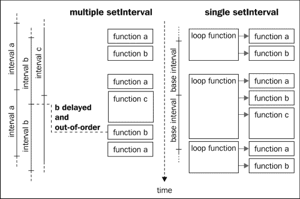
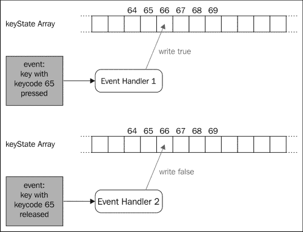
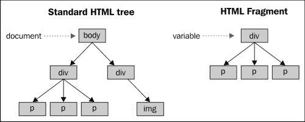

# 第三章：更好、更快，但不更难

我们刚刚开发的游戏在几乎所有设备和几乎所有浏览器上都能正常工作，主要原因是它非常简单，包含很少的移动精灵。然而，一旦你尝试制作一个像我们在接下来的章节中将要制作的更复杂的游戏，你会意识到你需要非常小心地编写优化代码以获得良好的性能。

在本章中，我们将回顾我们之前的代码，并提出某些方面的优化版本。其中一些优化是为了使您的游戏运行更快，而另一些是为了使您的代码更可读和更易于维护。

一般来说，实现游戏的第一个版本时，最好减少一些功能，不要过多担心性能问题，然后进行优化并添加更多功能。这有助于避免花费过多时间在游戏中可能不需要的东西上，允许您对优化进行基准测试，以确保它们真正加快了速度，最重要的是，保持您的动力。

在本章中，我们将深入探讨以下几个方面：

+   减少间隔和超时的数量

+   键盘轮询

+   使用 HTML 片段

+   避免重新排版

+   使用 CSS Transform 加速精灵定位

+   使用`requestAnimationFrame`代替超时

# 间隔和超时

在我们的游戏中，我们使用了许多`setInterval`调用。你可能会认为这些调用是多线程的，但实际上并不是。JavaScript 是严格单线程的（最近的一个例外是 WebWorkers，但我们这里不会深入讨论）。这意味着所有这些调用实际上都是依次运行的。

如果你对间隔和超时的工作原理感兴趣，我建议阅读 *John Resig* 撰写的优秀文章，*JavaScript 计时器的工作原理*（[`ejohn.org/blog/how-javascript-timers-work/`](http://ejohn.org/blog/how-javascript-timers-work/)）。

因此，间隔和超时并不会为您的代码添加多线程，有许多原因可能会使您希望避免过多使用它们。首先，它使您的代码有些难以调试。实际上，根据每次调用需要花费的时间，您的间隔将以不同的顺序执行，并且即使这些调用的周期性完全相同，它们也会有所不同。

此外，从性能方面考虑，过多使用`setInterval`和`setTimeout`可能会对较老的浏览器造成很大的负担。

另一种选择是使用一个单一的间隔来替换所有你的动画函数和游戏循环。

## 一次间隔统治它们

使用一个单一的间隔并不一定意味着你希望所有的动画以相同的速率执行。在大多数情况下，一个可接受的解决方案是允许任何基本间隔的倍数来执行动画。

通常，您的游戏循环将以给定的速率运行（假设为 30 毫秒），而您的动画将以相同的速率运行，或者是两倍、三倍、四倍等速率。但是，这并不局限于动画；您可能希望有多个游戏循环，其中一些以更低的速率执行。

例如，您可能希望在平台游戏中每秒增加水的水平。这样，玩家就有动力尽快完成关卡，否则他/她将会淹死。为了在框架中实现这一点，我们将添加一个`addCallback`函数，该函数将接受一个函数和一个速率。我们先前游戏中的游戏循环将使用此函数实现，而不是`setInterval`。

这意味着`startPreloading`函数将略有变化。在调用`endCallback`函数后，我们将启动一个`setInterval`函数，其中包含一个新函数，该函数将调用所有通过`addCallback`定义的函数，并负责动画。此外，我们将其简单地更名为`startGame`以反映用法的变化。

在游戏中，不需要显式地创建具有游戏循环的间隔，因为这由`startGame`函数自动完成；我们只需使用`addCallback`函数将其添加到游戏中。以下图片显示了这种方法与使用许多`setTimeout`函数的方法的比较：



我们将通过向`initialize`函数提供这个最小刷新率来在我们的框架中实现这一点。从这一点开始，所有动画和周期性函数将被定义为它的倍数。我们仍然在 API 中使用毫秒来描述它们的速率，但是将速率内部存储为基础速率的最接近倍数。

### 代码

我们的初始化函数将使用我们之前使用的`$.extend`函数。从现在开始，我们将只有基本刷新率，但随着需要，我们将添加更多值。我们还需要定义基本刷新率的默认值，以解决用户未手动指定时的情况。

```js
gf = {
    baseRate: 30
};

gf.initialize = function(options) {
    $.extend(gf, options);
} 
```

新更名的`startGame`函数将如下所示代码所示：

```js
gf.startGame = function(progressCallback) {
    /* ... */
    var preloadingPoller = setInterval(function() {
        /* ... */
        if (counter == total) {
            //we are done!
            clearInterval(preloadingPoller);
            endCallback();
            setInterval(gf.refreshGame, gf.baseRate);
        } else {
            /* ... */
        }
    }, 100);
};
```

在这里我们没有改变太多；在`endCallback`函数之后，我们添加了对内部函数的调用：`gf.refreshGame`。正是这个函数将协调动画的刷新和周期性函数调用。

这个新函数将使用两个列表来知道何时做什么，一个用于回调，一个用于动画。我们已经有一个用于动画的列表：`gf.animationHandles`。我们将其简单重命名为`gf.animations`并创建第二个名为`gf.callbacks`的列表。

两个列表都必须包含一种方法来知道它们是否应在基础速率的当前迭代中执行。为了检测这一点，我们将为每个动画和回调使用一个简单的计数器。每次基本循环执行时，我们将递增所有这些计数器，并将它们的值与关联动画/回调的速率进行比较。如果它们相等，这意味着我们需要执行它并重置计数器。

```js
gf.refreshGame = function (){
    // update animations
    var finishedAnimations = [];

    for (var i=0; i < gf.animations.length; i++) {

        var animate = gf.animations[i];

        animate.counter++;
        if (animate.counter == animate.animation.rate) {
            animate.counter = 0;
            animate.animation.currentFrame++;
            if(!animate.loop && animate.animation.currentFrame > animate.animation.numberOfFrame){
                finishedAnimations.push(i);
            } else {
                animate.animation.currentFrame %= animate.animation.numberOfFrame;
                gf.setFrame(animate.div, animate.animation);
            }
        }
    }
    for(var i=0; i < finishedAnimations.length; i++){
        gf.animations.splice(finishedAnimations[i], 1);
    }

    // execute the callbacks
    for (var i=0; i < gf.callbacks.length; i++) {
        var call  = gf.callbacks[i];

        call.counter++;
        if (call.counter == call.rate) {
            call.counter = 0;
            call.callback();
        }
    }
} 
```

这个简单的机制将替换对`setInterval`的许多调用并解决我们之前提到的与此相关的问题。

将动画设置为 div 的函数必须相应地进行调整。就像你在前面的示例中看到的那样，负责确定动画帧的实际代码现在在`refreshGame`函数中。这意味着`setAnimation`函数只需将动画添加到列表中，而不必关心如何进行动画化。

函数的一部分检查 div 是否已经与动画关联起来现在稍微复杂了一些，但是除此之外，函数现在更简单了。

**gf.animations = [];**

```js
/**
 * Sets the animation for the given sprite.
 **/
gf.setAnimation = function(divId, animation, loop){
    var animate = {
 animation: animation,        
 div: divId,

        loop: loop,
        counter: 0
    }

    if(animation.url){
        $("#"+divId).css("backgroundImage","url('"+animation.url+"')");
    }

    // search if this div already has an animation
    var divFound = false;
    for (var i = 0; i < gf.animations.length; i++) {
        if(gf.animations[i].div == divId){
            divFound = true;
            gf.animations[i] = animate
        }
    }

    // otherwise we add it to the array
    if(!divFound) {
        gf.animations.push(animate);
    }
} 
```

我们需要编写类似的代码将回调添加到基础循环中：

```js
gf.callbacks = [];

gf.addCallback = function(callback, rate){
    gf.callbacks.push({
        callback: callback,
        rate: Math.round(rate / gf.baseRate),
        counter: 0
    });
}
```

这个函数很琐碎；唯一有趣的部分是将刷新率标准化为基础速率的倍数。你可能注意到我们在动画方面没有做任何这样的事情，但是现在我们将在创建动画的函数中执行此操作。它现在将是这样的：

```js
gf.animation = function(options) {
    var defaultValues = {
        url : false,
        width : 64,
        numberOfFrames : 1,
        currentFrame : 0,
        rate : 1
    }
    $.extend(this, defaultValues, options);
    if(options.rate){
        // normalize the animation rate
        this.rate = Math.round(this.rate / gf.baseRate);
    }
    if(this.url){
        gf.addImage(this.url);
    }
}
```

就是这样；通过这些简单的改变，我们将摆脱大多数`setInterval`函数。将功能与普通的 JavaScript 一起获得的功能复制似乎需要相当多的工作，但是你会发现随着时间的推移，当你开始调试你的游戏时，它确实会帮助很多。

# 键盘轮询

如果你玩过上一章的游戏，你可能会注意到我们的“青蛙”从左到右的移动有些奇怪，也就是说，如果你按住左键，你的角色会向左移动一点，停顿一段时间，然后开始持续向左移动。

这种行为并不是由浏览器直接引起的，而是由操作系统引起的。这里发生的情况是，当键长时间保持按下时，操作系统会重复任何键（也称为“粘滞键”）。有两个参数定义了这种行为：

+   宽限期：这是操作系统在重复按键之前等待的时间。这样做可以避免在你确实只想按一次时重复按键。

+   按键重复的频率。

你对这些参数或此行为的发生没有控制权。这一切都取决于操作系统和用户配置的方式。

对于连续动作，这远非理想。如果你在 RPG 或平台游戏中移动角色，你需要移动是连续且线性的速度。这个问题的解决方案被称为状态轮询。使用这种方法，你希望主动查询一些键的状态，而不是等待状态的改变，就像事件处理中所做的那样。

在你的游戏循环中，你会在某个时刻询问键“left”是否被按下，并根据情况做出反应。这在本地游戏中经常使用，但是 JavaScript 并没有提供这种可能性。我们将不得不自己实现一个状态轮询技术。

## 跟踪按键状态

为了做到这一点，我们将使用唯一可用的工具：`keydown` 和 `keyup` 事件。我们将注册两个事件处理程序：

1.  如果按下具有给定键码“c”的键，则第一个事件处理程序将在索引“c”处的数组中写入 `true`。

1.  当相同的键释放时，第二个事件处理程序将索引“c”的值设置为 `false`。

这种解决方案的一个好处是，我们不需要为每个可能的键初始化数组的状态，因为默认情况下它是未定义的；所以，当我们检查时，它的值将返回 `false`。下图说明了这两个事件处理程序的工作原理：



我们将在我们的框架末尾注册这两个事件处理程序：

```js
gf.keyboard = [];
// keyboard state handler
 $(document).keydown(function(event){
    gf.keyboard[event.keyCode] = true;
});
$(document).keyup(function(event){
    gf.keyboard[event.keyCode] = false;
});
```

一旦完成了这一步，我们就可以简单地将处理左右移动的代码移动到游戏循环中，并重写它以使用 `gf.keyboard` 数组。

```js
if(gf.keyboard[37]){ //left
    newPos -= 5;
}
if(gf.keyboard[39]){ //right
    newPos += 5;
}
```

在这里，我们不需要检查玩家是否死亡，因为我们在游戏循环中已经这样做了。你只需要记住，可能会同时按下多个键。这在以前版本中不是这样的，在以前版本中，使用事件处理程序，每按下一个键就会生成一个事件。

如果现在尝试游戏，你会注意到你的玩家的水平移动要好得多。

如你所见，使用轮询的代码更漂亮，在大多数情况下更紧凑。此外，它在游戏循环内部，这总是一件好事。然而，仍然存在一些可能不是最佳解决方案的情况。使我们的青蛙跳跃就是一个很好的例子。

在选择事件处理和轮询之间，真正取决于情况，但一般来说，如果你想对按键做出一次反应，你会使用事件，如果你想对按键持续做出反应，你会使用轮询。

# HTML 片段

在这里，我们将看一些创建精灵的代码中的小优化。由于这个函数在我们整个游戏中仅调用了八次，并且仅在初始化阶段调用，所以在这种情况下它的速度并不是很重要。然而，在许多情况下，你需要在游戏过程中创建大量的精灵，例如，在射击游戏中射击激光时，创建平台游戏的关卡或 RPG 地图时。

这种技术避免了每次将精灵添加到游戏中都解析 HTML 代码（描述一个精灵）。它使用了所谓的 HTML 片段，这是一种从常规 HTML 节点树中截取的分支。



jQuery 提供了一种非常简单的方法来生成这样的片段：

```js
var fragment = $("<div>fragment</div>");
```

在这个例子中，变量 `fragment` 将在内存中保存 HTML 元素，直到我们需要使用它。它不会自动添加到文档中。如果以后想要添加它，只需简单地编写：

```js
$("#myDiv").append(fragment);
```

请记住，片段仍然引用着已添加的元素，这意味着如果稍后将其添加到另一个位置，它将从先前的位置删除，并且如果修改它，你也将修改文档。

要避免这种情况，你需要在将片段插入文档之前将其克隆，如下代码所示：

```js
$("#myDiv").append(fragment.clone());
```

这正是我们将重写 `addSprite` 函数使其更快的方式：

```js
gf.spriteFragment = $("<div style='position: absolute'></div>");
gf.addSprite = function(parentId, divId, options){
    var options = $.extend({}, {
        x: 0,
        y: 0,
        width: 64,
        height: 64
    }, options);
    $("#"+parentId).append(gf.spriteFragment.clone().css({
            left:   options.x,
            top:    options.y,
            width:  options.width,
            height: options.height}).attr("id",divId));
}; 
```

在这里，我们为每个精灵共同的部分创建了一个片段。然后，在将其添加到文档之前，我们克隆它并添加了 `addSprite` 函数提供的特殊参数，例如它的位置、大小和 ID。

就像我之前说的，对于我们非常简单的游戏，你可能不会注意到任何可见的变化，但这段代码更高效，在我们生成大量精灵的更复杂的游戏中会很方便。

# 避免回流

在修改 DOM 时，必须尽量避免生成整个文档或大部分文档的完全回流。有许多方法可以最小化做到这一点的风险，而且现代浏览器在进行优化时做得相当不错。

通常，浏览器会尝试在重新回流文档之前尽可能地重新组织修改。然而，如果尝试访问依赖于这些修改之一的信息，它将不得不执行重新回流以便能够计算新信息。

一个相当不错的经验法则是尽量避免像瘟疫一样读取 DOM，并作为最后的手段，将所有读取分组，并在刷新循环结束时执行它们。

在我们的游戏中，有一个地方我们正处于这种情况：每次访问玩家角色的 X 位置时，我们都会强制浏览器重新回流。在游戏循环中，位置和大小可能是最经常访问的信息之一。加快速度的一个简单方法是避免从 DOM 获取它们。事实上，只要它们通过框架函数设置，我们就可以简单地将它们存储在某个地方，并在需要时检索它们。

为此，我们将使用 jQuery 的 `data` 函数将我们的精灵与包含这些有趣值的对象文字关联起来。`addSprite` 函数将以此方式扩展：

```js
gf.addSprite = function(parentId, divId, options){
    /* ... */
    $("#"+parentId).append(gf.spriteFragment.clone().css({
            left:   options.x,
            top:    options.y,
            width:  options.width,
            height: options.height}).attr("id",divId).data("gf",options));
}
```

然后，在 `gf.x` 和 `gf.y` 函数中，我们将使用这个值而不是 CSS 属性：

```js
gf.x = function(divId,position) {
    if(position) {
        $("#"+divId).css("left", position); 
 $("#"+divId).data("gf").x = position;
    } else {
 return $("#"+divId).data("gf").x; 
    }
}
gf.y = function(divId,position) {
    if(position) {
        $("#"+divId).css("top", position); 
 $("#"+divId).data("gf").y = position;
    } else {
 return $("#"+divId).data("gf").y; 
    }
}
```

这还有一个好处，就是消除了两个 `parseInt` 值，而且游戏的代码甚至不需要改变！

# 使用 CSS 转换移动您的精灵

使用 CSS 转换是一种简单的技巧，可以让您比使用 CSS `top` 和 `left` 属性在屏幕上移动对象更快。如果您决定使用这个，您必须意识到并非所有的浏览器都支持它。

我们不会进入太多细节，因为 CSS 转换在下一章*环视*中有解释。下面的代码是使用 CSS 转换所需的修改：

```js
gf.x = function(divId,position) {
    if(position) {
        var data = $("#"+divId).data("gf");
        var y = data.y;
        data.x = position;
        $("#"+divId).css("transform", "translate("+position+"px, "+y+"px)");
    } else {
        return $("#"+divId).data("gf").x; 
    }
}
gf.y = function(divId,position) {
    if(position) {
        var data = $("#"+divId).data("gf");
        var x = data.x;
        data.y = position;
        $("#"+divId).css("transform", "translate("+x+"px, "+position+"px)"); 
    } else {
        return $("#"+divId).data("gf").y; 
    }
}
```

正如您在代码的突出部分中所看到的，我们需要每次设置好两个坐标。这意味着当我们修改 x 坐标时，我们必须检索 y 坐标，反之亦然。

# 使用 requestAnimationFrame 而不是 timeouts

最近在浏览器中添加了一个新的功能，以使动画更加流畅： `requestAnimationFrame`。这使得浏览器告诉您什么时候最适合动画您的页面，而不是在您喜欢的任何时间都进行动画。您应该使用这个代替使用 `setInterval` 或 `setTimeout` 来注册回调。

当您使用 `requestAnimationFrame` 时，是浏览器决定何时调用函数。因此，您必须考虑自上次调用以来过去的确切时间。用于定义此时间的标准规范是毫秒（就像您使用 `Date.now()` 可以得到的那些），但现在由一个高精度计时器给出。

由于这两个版本的实现存在，而且该功能在大多数浏览器中都有供应商前缀，您应该使用一个工具来抽象脏细节。我建议阅读以下两篇文章，两篇文章都提供了可用的代码片段：

+   [`paulirish.com/2011/requestanimationframe-for-smart-animating/`](http://paulirish.com/2011/requestanimationframe-for-smart-animating/)

+   [`www.makeitgo.ws/articles/animationframe/`](http://www.makeitgo.ws/articles/animationframe/)

# 总结

在这一章中，我们花了一些时间优化了我们在第二章中编写的游戏，*创建我们的第一个游戏*。我们看到了一些优化技术，将使我们的游戏更加流畅，而不会影响我们的代码可读性。

我们建立的框架现在是一个合理的基础，我们可以在接下来的章节中构建一个更完整的框架。我们将在接下来的章节中开始添加创建瓷砖地图的能力，这些地图将用于实现一个平台游戏。
