# 第四章：横看成岭侧成峰

现在是时候制作一个更复杂的游戏了。我们将实现一个非常流行的类型，即 2D 平台游戏。这一类型的早期示例包括 *超级马里奥兄弟* 和 *索尼克小子*。这些游戏通常使用小型重复的精灵，称为瓦片地图，进行关卡设计。我们将添加这些内容，以及更通用的碰撞检测，到我们的框架中。对于游戏逻辑本身，我们将使用面向对象的代码。

这是我们将不得不添加到我们的框架中的功能的快速列表：

+   离线 div

+   分组

+   精灵变换

+   瓦片地图

+   碰撞检测

首先，我们将逐个遍历所有这些，然后开始游戏。

# 离线 div

如前一章节末尾所解释的那样，避免重排是加快速度的好方法。在进行操作时完全避免查询 DOM 状态并不总是容易的。即使您非常小心，作为框架开发者，您也永远不确定您的框架的用户会做什么。然而，有一种方法可以减少重排的负面影响；分离您正在操作的 DOM 片段，修改它，然后将其重新附加到文档中。

假设您有一个带有 ID `box` 的节点，并且想要以复杂的方式操纵其子元素。以下代码向您展示了如何分离它：

```js
// detach box
var box = $("#box").detach();

var aSubElement = box.find("#aSubElement")
// and so on

// attach it back
box.appendTo(boxParent);
```

这需要对我们的框架 API 进行小的修改；到目前为止，我们使用字符串来标识精灵。这会导致需要将精灵作为文档的一部分。例如，如果您调用 `gf.x("sprite")`，jQuery 将尝试在文档中查找 ID 为 `sprite` 的节点。如果分离精灵或其父级之一，则该函数将找不到其 ID。

解决方案很简单，只需将 DOM 节点本身提供给我们框架的函数。由于我们使用 jQuery，因此我们将在 jQuery 中包装此节点。让我们比较当前 API 和提议的 `gf.x` 函数的 API。

```js
// current API
var xCoordinate = gf.x("mySprite");

// proposed API
var xCoordinate = gf.x($("#mySprite"));
```

此解决方案还有另一个优点；它允许进一步优化。如果我们看一下此函数的实现，我们会发现另一个问题：

```js
gf.x = function(divId,position) {
    if(position) {
        $("#"+divId).css("left", position);
        $("#"+divId).data("gf").x = position;
    } else {
        return $("#"+divId).data("gf").x; 
    }
}
```

每次调用函数时，都可以看到 jQuery 被用于检索元素。任何对 DOM 的访问（即使在选择器中使用元素的 ID 来查找元素）都会产生性能成本。理想情况下，如果相关元素被使用超过几次，您可能希望对其进行缓存以提高性能。这是由所提出的 API 可能实现的。

实现非常简单，因此我们将只显示 `gf.x` 函数：

```js
gf.x = function(div,position) {
    if(position) {
        div.css("left", position);
        div.data("gf").x = position;
    } else {
        return div.data("gf").x; 
    }
}
```

# 分组

将游戏元素以分层方式组织起来非常方便。一个典型的游戏可以这样组织：

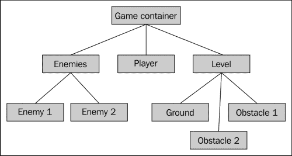

为了允许这一点，我们需要向我们的框架添加一个非常简单的东西，称为组。组基本上是一个简单的 div，位置与精灵完全相同，但没有背景和宽度和高度。我们将添加一个 `gf.addGroup` 函数来为我们执行此操作。它的签名将与 `gf.addSprite` 的签名相同，但选项参数将仅保存 *x* 和 *y* 坐标。

以下示例向您展示了如何生成前面图示中显示的树：

```js
var enemies   = gf.addGroup(container,"enemies");
var enemy1    = gf.addSprite(group,"enemy1",{...});
var enemy2    = gf.addSprite(group,"enemy2",{...});

var player    = gf.addSprite(group,"player",{...});

var level     = gf.addGroup(container,"level");
var ground    = gf.addSprite(group,"ground",{...});
var obstacle1 = gf.addSprite(group,"obstacle1",{...});
var obstacle2 = gf.addSprite(group,"obstacle2",{...});
```

此功能的实现与 `gf.addSprite` 的实现非常相似：

```js
gf.groupFragment = $("<div style='position: absolute; overflow: visible;'></div>");
gf.addGroup = function(parent, divId, options){
    var options = $.extend({
        x: 0,
        y: 0,
    }, options);
    var group = gf.groupFragment.clone().css({
            left:   options.x,
            top:    options.y}).attr("id",divId).data("gf",options);
    parent.append(group);
    return group;
}
```

在我们的游戏屏幕上有多个实体使得有一个简单的方法来区分它们成为必要。我们可以在通过 `$.data` 函数与节点关联的对象字面量中使用标志，但我们将改用 CSS 类。这有一个优点，就是可以非常容易地检索或过滤所有相同类型的元素。

要实现这一点，我们只需改变精灵和组的片段。我们将给 CSS 类命名为命名空间。在 CSS 中，命名空间简单地在类名中加上前缀。例如，我们将给我们的精灵添加类 `gf_sprite`；这将最大程度地减少另一个插件使用相同类的机会，与 `sprite` 相比。

新的片段看起来像这样：

```js
gf.spriteFragment = $("<div class='gf_sprite' style='position: absolute; overflow: hidden;'></div>");
gf.groupFragment = $("<div class='gf_group' style='position: absolute; overflow: visible;'></div>");
```

现在，如果您想要查找所有子精灵，您可以这样写：

```js
$("#someElement").children(".gf_sprite");

```

# 精灵变换

有许多情况下，您将希望以简单的方式转换您的精灵。例如，您可能希望使它们变大或变小，或者旋转或翻转它们。实现这一点的最方便的方法是使用 CSS 变换。在过去几年中，大多数浏览器都已很好地支持 CSS 变换。

如果您决定使用此功能，您只需意识到 Microsoft Internet Explorer 9 之前的版本不支持它。有可能使用专有的 `filter` CSS 属性，但在大多数情况下，这太慢了。

另一个可能性是使用一些旧的 8 位和 16 位游戏中使用的技术。您只需为变换后的精灵生成图像。这有很快的优势，并且与所有浏览器兼容。另一方面，它会增加您艺术品的大小，并且如果您需要在某个时候更改您的精灵，则需要重新生成所有的变换。

在这里，我们将仅实现 CSS 变换解决方案，因为在大多数情况下，仅针对现代浏览器是可接受的。

## CSS 变换

CSS 有许多可能的变换，甚至是 3D 变换（您可以查看 [`github.com/boblemarin/Sprite3D.js`](https://github.com/boblemarin/Sprite3D.js) 以获取一些非常好的示例），但我们将坚持旋转和缩放。

在大多数浏览器中，CSS 属性“transform”都是供应商前缀的。意思是，在 Safari 中，它将被称为`-webkit-transform`，而在 Firefox 中，将是`-moz-transform`。以往处理这类属性是一件真正痛苦的事情，但使用 jQuery 1.8，你可以简单地忘记它，就像没有前缀一样。jQuery 会在需要时自动使用正确的前缀。

正如之前所解释的，这个属性可以取许多值，我们将在这里专注于`rotate`和`scale`两个：`rotate`的语法如下：

```js
transform: rotate(angle)
```

在这里，`angle`是以**deg**或**rad**（分别缩写为度和弧度）表示的顺时针角度。旋转默认是围绕元素的原点进行的，大多数情况下，这是你希望的，但如果出于某种原因你想要改变它，你可以简单地使用`transform-origin` CSS 属性来实现。

例如，如果你想要逆时针旋转你的元素 10 度，你会写：

```js
transform: rotate(-10deg);
```

如果你的元素是一个红色的正方形，它会像这样：

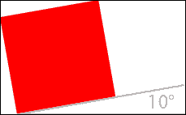

`scale`的工作方式非常相似，但具有两种可能的语法：

+   `transform: scale(ratio)`

+   `transform: scale(ratio_x, ratio_y)`

如果您只指定一个值，结果将是各向同性的变换；换句话说，沿着两个轴的大小是相等的。相反，如果你指定两个值，第一个将沿着 x 轴缩放，第二个将沿着 y 轴缩放（各向异性变换）。下图说明了这两者之间的区别。

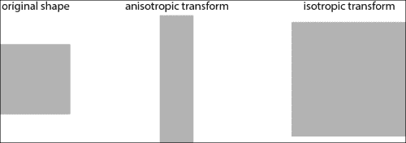

在我们的情况下，我们将不包括任意的各向异性缩放到我们的框架中，但我们仍将使用双值语法，因为这将允许我们翻转我们的精灵；的确，如果我们写`scale(-1,1)`，这实际上意味着“横向翻转元素并保持纵向不变”。当然，这对于除 1 之外的值也适用；只要两个值的大小相同，你只会翻转精灵而不改变其长宽比。

对于 transform 属性的这两个值，很好地配合在一起，所以如果你想要将一个元素逆时针旋转 10 度，垂直翻转它，并使其大小加倍，你会这样写：

```js
transform: rotate(-10deg) scale(2,-2);
```

## 将 transform 添加到框架中

现在我们必须写一个函数来代替我们完成这个工作。与我们框架的大多数函数一样，我们将使用对象字面量来保存可选参数，并将函数应用于的节点作为第一个参数。调用这个函数来生成示例的示例为：

```js
gf.transform (myDiv, {rotate: -10, scale: 2, flipV: true});
```

角度以度为单位，`flipH`和`flipV`选项是布尔值。省略的参数的值（在本例中是`flipH`）将不会默认为常规值；相反，我们将采用给定元素的该参数的当前值。这将允许您两次调用变换函数并改变两个不同的参数，而无需知道另一个调用正在做什么。例如：

```js
gf.transform (myDiv, {rotate: -10});
// do some other things
gf.transform (myDiv, {scale: 2, flipV: true});
```

然而，这意味着我们将无法像过去那样使用`$.extend`函数。相反，我们将不得不手动检查给定元素的未定义参数的存储值。

这些值将存储在与`gf`键关联的对象文字中，该键与具有`$.data`函数的元素相关联。这也意味着在创建精灵（或组）时，我们需要为这些属性定义默认值。例如，`addSprite`函数将以以下方式开始：

```js
gf.addSprite = function(parent, divId, options){
    var options = $.extend({
        x: 0,
        y: 0,
        width: 64,
        height: 64,
        flipH: false,
      flipV: false,
      rotate: 0,
      scale: 1
    }, options);
//...
```

一旦你理解了 CSS `transform`属性的工作方式，实现我们的`gf.transform`函数将变得非常简单：

```js
gf.transform = function(div, options){
   var gf = div.data("gf");
   if(options.flipH !== undefined){
      gf.flipH = options.flipH;
   }
   if(options.flipV !== undefined){
      gf.flipV = options.flipV;
   }
   if(options.rotate !== undefined){
      gf.rotate = options.rotate;
   }
   if(options.scale !== undefined){
      gf.scale = options.scale;
   }
   var factorH = gf.flipH ? -1 : 1;
   var factorV = gf.flipV ? -1 : 1;
   div.css("transform", "rotate("+gf.rotate+"deg) scale("+(gf.scale*factorH)+","+(gf.scale*factorV)+")");
}
```

再一次，这是一个简单的函数，会提供出色的功能，并允许我们在游戏中创建整洁的效果。根据你的游戏，你可能希望将各向异性缩放加入其中，甚至是 3D 转换，但函数的基本结构和 API 可以保持不变。

# 瓦片地图

瓦片地图是制作许多游戏的常用工具。其背后的理念是大多数关卡由类似的部分组成。例如，地面很可能会重复很多次，只是有少许变化；会有几种不同的树反复出现很多次，以及一些物品，如石头、花或草将以完全相同的精灵表示多次出现。

这意味着使用一个大图像来描述你的关卡并不是以空间为最有效的解决方案。你真正想要的是能够给出所有唯一元素的列表，然后描述它们如何组合生成你的关卡。

瓦片地图是最简单的实现方式。但是它增加了一个限制；所有元素都必须具有相同的大小并放置在网格上。如果你能够适应这些约束，这种解决方案将变得非常高效；这就是为什么那么多老游戏都是用它创建的原因。

我们将从实现一个非常天真的版本开始，然后在本章末尾展示如何在大多数情况下以不太多的工作快速实现它。

总而言之，瓦片地图由以下组成：

+   一系列图片（我们在框架中称之为动画）

+   一个描述图像放置位置的二维数组

以下图示说明了这一点：

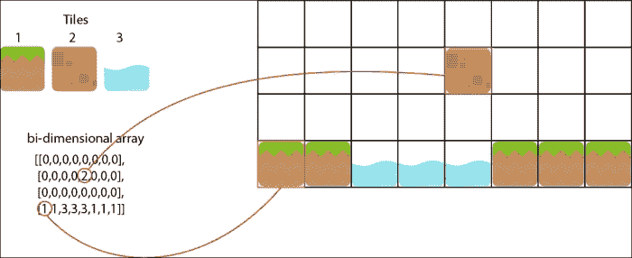

除了有助于减小游戏尺寸之外，瓦片地图还提供以下优点：

+   检测与瓦片地图的碰撞非常容易。

+   描述瓦片地图外观的数组还包含关于级别的语义信息。例如，瓦片 1 到 3 是地面瓦片，而 4 到 6 是景观的一部分。这将使您能够轻松“阅读”级别并对其做出反应。

+   生成不同层次的随机变化非常简单。只需按照几条规则创建二维数组，每次玩家重新开始游戏时，游戏都会有所不同！

+   存在许多开源工具可帮助您创建它们。

但是，您必须意识到也有一些约束：

+   由于组成瓦片地图的所有元素大小相同，如果要创建更大的元素，则必须将其分解为较小的部分，这可能会很繁琐。

+   即使具有很多才华，它也会给您的游戏带来一定的连续外观。如果您不想在级别周围重复一些块，则瓦片地图不适合您。

## 朴素的实现

我们已经知道如何创建精灵，所以基本上我们需要为创建瓦片地图生成组成它的精灵。就像`gf.addSprite`一样，我们的`gf.addTilemap`函数将接受父 div、生成的瓦片地图的 ID 以及描述选项的对象字面量。

选项是瓦片地图的位置、每个瓦片的尺寸、以及横向和纵向组成瓦片地图的瓦片数量、动画列表和描述瓦片位置的二维数组。

我们将遍历二维数组，并根据需要创建精灵。在我们的瓦片地图中有些地方没有精灵往往是很方便的，因此我们将使用以下约定：

+   如果所有条目都是零，则意味着不需要在此位置创建精灵

+   如果所有地方的数字都大于零，则表示应创建一个带有动画的精灵，该动画位于动画数组中对应此数字减一的索引处

这通常是您希望在将其添加到文档之前创建完整瓦片地图的地方。我们将使用克隆的片段来生成包含所有瓦片的`div`标签，并将我们用于精灵的克隆片段添加到其中。只有在创建所有瓦片后，我们才会将瓦片地图添加到文档中。

这里还有一个微妙之处。我们将向我们的瓦片添加两个类，一个标记瓦片所属的列，另一个标记瓦片所属的行。除此之外，目前代码中没有其他重要的细节：

```js
gf.tilemapFragment = $("<div class='gf_tilemap' style='position: absolute'></div>");
gf.addTilemap = function(parent, divId, options){
    var options = $.extend({
        x: 0,
        y: 0,
        tileWidth: 64,
        tileHeight: 64,
        width: 0,
        height: 0,
        map: [],
        animations: []
    }, options);

    //create line and row fragment:
    var tilemap = gf.tilemapFragment.clone().attr("id",divId).data("gf",options);
    for (var i=0; i < options.height; i++){
        for(var j=0; j < options.width; j++) {
            var animationIndex = options.map[i][j];

            if(animationIndex > 0){
                var tileOptions = {
                    x: options.x + j*options.tileWidth,
                    y: options.y + i*options.tileHeight,
                    width: options.tileWidth,
                    height: options.tileHeight
                }
                var tile = gf.spriteFragment.clone().css({
                    left:   tileOptions.x,
                    top:    tileOptions.y,
                    width:  tileOptions.width,
                    height: tileOptions.height}
                ).addClass("gf_line_"+i).addClass("gf_column_"+j).data("gf", tileOptions);

                gf.setAnimation(tile, options.animations[animationIndex-1]);

                tilemap.append(tile);
            }
        }
    }
    parent.append(tilemap);
    return tilemap;
}
```

就这些了。这将在初始化时生成整个瓦片地图。这意味着非常大的瓦片地图会很慢。在本章末尾，我们将看到如何仅生成可见部分的瓦片地图。

# 碰撞检测

这是我们框架的一个非常重要的部分，我们将从精灵与瓦片地图碰撞的情况开始看看我们将如何做到这一点。这种情况有一个好处，即比一般情况更容易，但仍然使用了大部分相同的基本思想。然而，我们将坚持轴对齐元素。这意味着不会在此处显示与旋转元素的碰撞。  

## 与瓦片地图碰撞

找到与精灵碰撞的瓦片地图的瓦片可以分为两部分。首先找到表示两者交集的框。然后，列出此框中的所有精灵。下图中以红色显示了一些可能的交叉点列表：

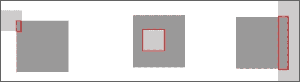

一开始可能会觉得复杂，但是如果你考虑到这与寻找两个一维交叉点（每个轴一个）完全相同的问题，那就会变得容易得多。

你可能没有意识到，在我们的*青蛙过河*克隆中，我们使用了一维交叉的简化版本来检测碰撞。下图显示了两个段，**a**和**b**的典型一维交叉**i**的样子：

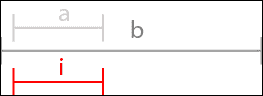

在这种情况下，交叉点只是第二个元素，因为它完全包含在第一个元素中。下图显示了另外三种可能的情况：

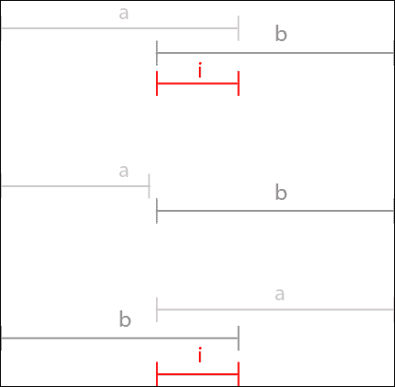

解决这个问题的一种方法是从第二个元素的角度来表达解决方案。两个点将定义区间；我们将最左边的点称为`i1`，最右边的点称为`i2`。

首先考虑这样一个情况，即确实存在这样的交叉点，两个元素相互接触。您可能会发现`i1`是`a1`和`b1`之间的较大点。以同样的方式，`i2`是`a2`和`b2`之间的较小点。但是，如果两个区间不相交怎么办？如果区间`a`在其左侧，我们将简单地返回`i1=b1`和`i2=b1`，如果区间`a`在其右侧，我们将返回`i1=b2`和`i2=b2`。为了计算这个，我们只需要将`i1`和`i2`的结果约束在`b1`和`b2`之间。

结果函数如下所示：

```js
gf.intersect = function(a1,a2,b1,b2){
    var i1 = Math.min(Math.max(b1, a1), b2);
    var i2 = Math.max(Math.min(b2, a2), b1);
    return [i1, i2];
}
```

好处是我们每个点只使用两次比较。现在我们可以将此应用于我们的二维问题。下图显示了如何将框交叉分解为两个线交叉点：

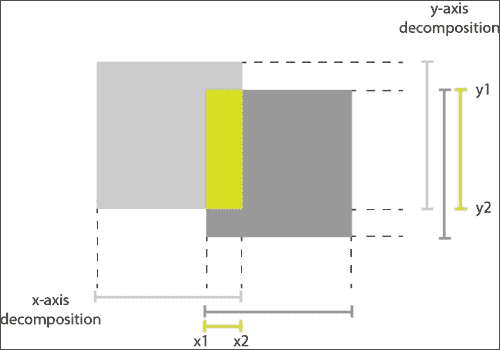

### 寻找碰撞瓦片

现在我们将编写一个函数，它接受一个精灵和一个瓦片地图。然后，它将为两个轴找到交叉点：x1 到 x2 和 y1 到 y2。现在点（x1，y1）将是交集框的左上角，点（x2，y2）将是右下角。

然而，我们在砖块地图中真正想要的不是坐标，而是二维数组中的索引。因此，我们将首先转换坐标，使原点是瓦片地图的左上角。然后，我们将根据单个瓦片的宽度和相应的高度来划分新坐标。在执行此操作的结果四舍五入后，我们将得到组成相交框的左上角和右下角瓦片的索引：

```js
gf.tilemapBox = function(tilemapOptions, boxOptions){
    var tmX  = tilemapOptions.x;
    var tmXW = tilemapOptions.x + tilemapOptions.width * tilemapOptions.tileWidth;
    var tmY  = tilemapOptions.y;
    var tmYH = tilemapOptions.y + tilemapOptions.height * tilemapOptions.tileHeight;

    var bX  = boxOptions.x;
    var bXW = boxOptions.x + boxOptions.width;
    var bY  = boxOptions.y;
    var bYH = boxOptions.y + boxOptions.height;

    var x = gf.intersect(tmX,tmXW, bX, bXW);
    var y = gf.intersect(tmY, tmYH, bY, bYH);

    return {
        x1: Math.floor((x[0] - tilemapOptions.x) / tilemapOptions.tileWidth),
        y1: Math.floor((y[0] - tilemapOptions.y) / tilemapOptions.tileHeight),
        x2: Math.ceil((x[1] - tilemapOptions.x) / tilemapOptions.tileWidth),
        y2: Math.ceil((y[1] - tilemapOptions.y) / tilemapOptions.tileHeight)
    }
}
```

现在我们将在碰撞检测函数中使用这个结果。我们只需列出这两个点之间的所有瓦片。我们将使用二维数组来查找所有非零条目，然后使用我们为线和列定义的类来找到我们的瓦片。

```js
gf.tilemapCollide = function(tilemap, box){
    var options = tilemap.data("gf");
    var collisionBox = gf.tilemapBox(options, box);
    var divs = []

    for (var i = collisionBox.y1; i < collisionBox.y2; i++){
        for (var j = collisionBox.x1; j < collisionBox.x2; j++){
            var index = options.map[i][j];
            if( index > 0){
                divs.push(tilemap.find(".gf_line_"+i+".gf_column_"+j));
            }
        }
    }
    return divs;
}
```

这将允许我们找到与精灵发生碰撞的所有瓦片，但我们必须确保我们为精灵和瓦片地图提供的坐标是正确的。如果精灵在一个向右移动了十个像素的组中，我们将不得不将十添加到精灵的 x 坐标值；否则，碰撞检测方法将不会注意到它。

我们可以编写一个版本的这个函数，它查看所有精灵和瓦片地图的坐标，以找出它们的相对偏移量。这会使函数稍微慢一些，稍微复杂一些，但你应该能够做到。

## 精灵与精灵的碰撞

用于检测两个精灵是否发生碰撞的函数将使用我们刚刚编写的同一维度交集函数。要使两个精灵发生碰撞，我们必须在两个一维投影上都发生碰撞。

如果 `gf.intersect` 函数返回的间隔长度为零（两个值相等），则表示这两个精灵在此轴上发生碰撞。要使两个精灵发生碰撞，两个投影都必须发生碰撞。

我们的函数实现非常简单，因为大部分逻辑都包含在 `gf.intersect` 函数中：

```js
gf.spriteCollide = function(sprite1, sprite2){
   var option1 = sprite1.data("gf");
   var option2 = sprite2.data("gf");

   var x = gf.intersect(
      option1.x,
      option1.x + option1.width,
      option2.x,
      option2.x + option2.width);
   var y = gf.intersect(
      option1.y,
      option1.y + option1.height,
      option2.y,
      option2.y + option2.height);

   if (x[0] == x[1] || y[0] == y[1]){
      return false;
   } else {
      return true;
   }
}
```

# 编写游戏

我们现在有了开始游戏所需的所有工具。对于这个游戏，我们将使用 Kenney Vleugels 的精美艺术作品（[`www.kenney.nl`](http://www.kenney.nl)）。这将是一个经典的平台游戏，玩家可以在其中移动和跳跃。

将有两种类型的敌人，一种是一种类似于斑点的物体，另一种是一种飞行昆虫。为了简单起见，玩家是不朽的，并在接触到敌人时将其杀死。我们将按以下顺序描述游戏的每个部分：

+   游戏屏幕的基本设置

+   用于玩家的面向对象代码

+   玩家控制

+   视差滚动

+   敌人

# 游戏屏幕的基本设置

这与我们为 *Frogger* 克隆所做的非常相似。以下是我们将组织游戏屏幕的方式：

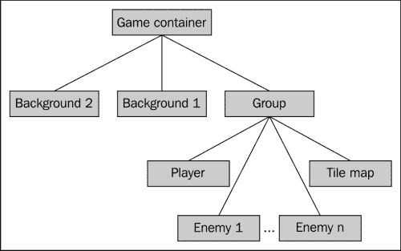

在这个游戏中我们将有很多动画；玩家有三个，每个敌人有三个，两个背景动画有两个。为了使事情更加可读，我们将对它们进行分组。玩家和敌人的动画将分别存储在对象字面量中，而瓷砖的动画将存储在数组中。

这里是我们代码的一部分摘录：

```js
var playerAnim = {
    stand: new gf.animation({
        url: "player.png",
        offset: 75
    }),
    walk:  new gf.animation({
        url:    "player.png",
        offset: 150,
        width:  75, 
        numberOfFrames: 10,
        rate: 90
    }),
    jump:  new gf.animation({
        url: "player.png",
        offset: 900
    })
};

var slimeAnim = {
   stand: new gf.animation({
        url: "slime.png"
    }),
    walk: new gf.animation({
        url: "slime.png",
        width:  43, 
        numberOfFrames: 2,
        rate: 90
    }),
    dead: new gf.animation({
        url: "slime.png",
        offset: 86
    })
};

var flyAnim = {
   stand: new gf.animation({
        url: "fly.png"
    }),
   ...
}
var tiles = [
    new gf.animation({
        url: "tiles.png"
    }),
    new gf.animation({
        url: "tiles.png",
        offset: 70
    }),
    ...
];
```

# 玩家的面向对象代码

在你的游戏中使用面向对象(OO)代码有许多原因。首先，这是组织代码的非常好的方式。其次，它提供了一些有用的方式来重用和扩展您的代码。

如果你不熟悉面向对象编程，JavaScript 可能不是学习的最佳语言。我们不会深入讨论 OO 的理论；即使没有，你也应该能够看到我们将要编写的代码背后的逻辑以及它带来了什么。

由于我们只需要一个玩家，我们将创建一个匿名类并立即实例化它。这相当不寻常，只在这种特殊情况下才有意义。这是我们类的框架，具有所有方法，但没有它们的实现。我们稍后将逐个查看它们。

```js
var player = new (function(){
        var acceleration = 9;
        var speed = 20;
        var status = "stand";
        var horizontalMove = 0;

        this.update = function (delta) {
            //...
        };

        this.left = function (){
            //...
        };

        this.right = function (){
            //...
        };

        this.jump  = function (){
            //...
        };

        this.idle  = function (){
            //...
        };
});
```

正如你所看到的，我们首先定义了一些稍后将要使用的变量，然后定义了对象的方法。

## 更新玩家的位置

我们为玩家沿 y 轴的移动实现了一个非常基本的物理模拟；如果没有碰撞发生，头像将以给定的加速度和有限的最大速度下落。这足以生成整洁的跳跃轨迹。

让我们看看`update`函数做了什么。首先，它需要计算头像的下一个位置：

```js
var delta = 30;
speed = Math.min(100,Math.max(-100,speed + acceleration * delta / 100.0)); 
var newY = gf.y(this.div) + speed * delta / 100.0;
var newX = gf.x(this.div) + horizontalMove;
var newW = gf.width(this.div);
var newH = gf.height(this.div);
```

在这段代码中，你可以看到我们计算了速度；这是玩家的垂直速度。我们在这里使用了正确的物理规则，即时间间隔后的速度等于*前一个速度加上时间间隔的加速度*。然后将其限制在-100 到 100 之间，以模拟终端速度。在这里，加速度是恒定的，重力也是如此。

然后我们使用这个速度来计算沿 y 轴的下一个位置，同样使用正确的物理规则。

沿 x 轴的新位置要简单得多；它是由玩家控制引起的水平移动修改后的当前位置（我们稍后将看到这个值是如何生成的）。

然后我们需要检查碰撞以查看头像是否真的可以去想去的地方，或者是否有障碍物。为此，我们将使用之前编写的`gf.tilemapCollision`方法。

一旦我们拥有所有与我们的精灵碰撞的瓷砖，我们可以做什么？我们将查看其中任何一个并通过最短可能的移动将精灵移出它们的路径。为此，我们将计算精灵与瓷砖之间的确切交叉点，并找出其宽度或高度哪个是其较大的尺寸。如果宽度大于高度，则意味着在 y 轴上移动较短，如果高度大于宽度，则在 x 轴上移动较短。

如果我们对所有瓷砖都这样做，我们将把角色移到一个不与任何瓷砖碰撞的位置。这是我们刚刚描述的全部代码：

```js
var collisions = gf.tilemapCollide(tilemap, {x: newX, y: newY, width: newW, height: newH});
var i = 0;
while (i < collisions.length > 0) {
    var collision = collisions[i];
    i++;
    var collisionBox = {
        x1: gf.x(collision),
        y1: gf.y(collision),
        x2: gf.x(collision) + gf.width(collision),
        y2: gf.y(collision) + gf.height(collision)
    };

    var x = gf.intersect(newX, newX + newW, collisionBox.x1,collisionBox.x2);
    var y = gf.intersect(newY, newY + newH, collisionBox.y1,collisionBox.y2);

    var diffx = (x[0] === newX)? x[0]-x[1] : x[1]-x[0];
    var diffy = (y[0] === newY)? y[0]-y[1] : y[1]-y[0];
    if (Math.abs(diffx) > Math.abs(diffy)){
        // displace along the y axis
         newY -= diffy;
         speed = 0;
         if(status=="jump" && diffy > 0){
             status="stand";
             gf.setAnimation(this.div, playerAnim.stand);
         }
    } else {
        // displace along the x axis
        newX -= diffx;
    }
    //collisions = gf.tilemapCollide(tilemap, {x: newX, y: newY, width: newW, height: newH});
}
gf.x(this.div, newX);
gf.y(this.div, newY);
horizontalMove = 0;
```

你会注意到，如果我们检测到我们需要沿 y 轴向上移动玩家，我们会改变角色动画和状态，如果玩家正在跳跃，这仅仅是因为这意味着玩家已经着陆。

这段代码足以包含你在关卡中制作出一个体面的玩家移动所需的所有规则。

## 控制玩家的角色

除了`update`之外的所有方法都直接对应于玩家的特定输入类型。它们将在主循环中在相应的键被检测为按下后被调用。如果没有键被按下，将调用空闲函数。

让我们看一下将玩家向左移动的函数：

```js
this.left = function (){
            switch (status) {
                case "stand":
                    gf.setAnimation(this.div, playerAnim.walk, true);
                    status = "walk";
                    horizontalMove -= 7;
                    break;
                case "jump":
                    horizontalMove -= 5;
                    break;
                case "walk":
                    horizontalMove -= 7;
                    break;
            }
            gf.transform(this.div, {flipH: true});
};
```

其主要部分是一个开关，因为我们将根据玩家的状态有不同的反应。如果玩家当前正在站立，我们将需要改变动画以行走，设置玩家的新状态，并沿 x 轴移动玩家。如果玩家正在跳跃，我们只是沿 x 轴移动玩家（但稍微慢一点）。如果玩家已经在行走，我们只需移动它。

最后一行水平翻转了精灵，因为我们的图像描述了面向右的玩家。向右的方向函数基本上是相同的。

`jump`方法将检查玩家当前是否处于站立或行走状态，如果是，则会更改动画，更改状态，并在`update`函数期间设置垂直速度以生成跳跃。

`idle`状态将将状态设置为站立，并相应地设置`animation`函数，但仅当玩家正在行走时。

```js
this.jump  = function (){
    switch (status) {
        case "stand":
        case "walk":
            status = "jump";
            speed = -60;
            gf.setAnimation(this.div, playerAnim.jump);
            break;
    }
};

this.idle  = function (){
    switch (status) {
        case "walk":
            status = "stand";
            gf.setAnimation(this.div, playerAnim.stand);
            break;
    }
};
```

关于玩家移动就是这些。如果你仅仅使用这个对象中包含的逻辑开始游戏，你将已经拥有大部分构成平台游戏的东西——一个角色在各个平台之间移动跳跃。

# 玩家控制

我们仍然需要将玩家对象连接到主循环。这真的很简单，因为所有逻辑都包含在对象中。然而，我们忽略了一个小细节。由于玩家向左移动，他将离开屏幕。我们需要跟随他！我们将实现的方式如下：如果玩家超出了一个给定的点，我们将开始移动包含所有精灵和瓷砖的组，朝相反的方向移动。这会给人一种摄像机在跟随玩家的印象。

```js
var gameLoop = function() {

    var idle = true;
    if(gf.keyboard[37]){ //left arrow
        player.left();
        idle = false;
    }
    if(gf.keyboard[38]){ //up arrow
        player.jump();
        idle = false;
    }
    if(gf.keyboard[39]){ //right arrow
        player.right();
        idle = false;
    }
    if(idle){
        player.idle();
    }

    player.update();
    var margin = 200;
    var playerPos = gf.x(player.div);
    if(playerPos > 200) {
        gf.x(group, 200 - playerPos);
    }
}
```

这是包含我们之前描述的所有内容的主循环。

# 视差滚动

视差滚动是给 2D 游戏增加一点深度的很好的方法。它利用了远离的物体看起来移动得越慢这一原理。这通常是当你从汽车的侧窗往外看到的景象。

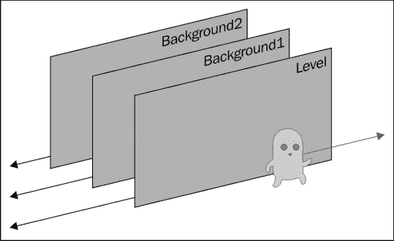

在上图中的第一层将是包含所有精灵和平铺地图的组。第二层和第三层将简单地是图像。我们将使用与以前的游戏相同的技术：简单地使用背景位置来生成它们的移动。

最终的代码在主游戏循环中进行，就在我们移动组以保持玩家在屏幕上可见之后：

```js
var margin = 200;
var playerPos = gf.x(player.div);
if(playerPos > 200) {
    gf.x(group, 200 - playerPos);
    $("#backgroundFront").css("background-position",""+(200 * 0.66 - playerPos * 0.66)+"px 0px");
    $("#backgroundBack").css("background-position",""+(200 * 0.33 - playerPos * 0.33)+"px 0px");
}
```

正如你所看到的，代码很简单；唯一微妙的地方在于选择每个图层速度的合适值。遗憾的是除了用赤裸裸的眼睛观察效果外，没有其他方法来做到这一点。

# 创建敌人

对于敌人，我们也将使用面向对象的代码。这将允许我们仅仅使用继承来指定两种敌人之间的不同之处。第一种是史莱姆。这种类型的敌人在地面上爬行，当它们死亡时，它们会被压扁并停留在它们被杀死的地方。它们在两点之间来回巡逻。

第二种是苍蝇。它们的行为与史莱姆完全相同，但它们在天空中飞行，一旦被杀死，就会坠入深渊。

我们将开始编写史莱姆的代码。它的结构与玩家的对象类似，但简单得多：

```js
var Slime = function() {

   this.init = function(div, x1, x2, anim) {
      this.div = div;
      this.x1 = x1;
      this.x2 = x2;
      this.anim = anim;
      this.direction = 1;
      this.speed     = 5;
      this.dead      = false;

      gf.transform(div, {flipH: true});
      gf.setAnimation(div, anim.walk);
   };

   this.update = function(){
      if(this.dead){
         this.dies();
      } else {
         var position = gf.x(this.div);
         if (position < this.x1){
            this.direction = 1;
            gf.transform(this.div, {flipH: true});
         }
         if (position > this.x2){
            this.direction = -1;
            gf.transform(this.div, {flipH: false});
         }
         gf.x(this.div, gf.x(this.div) + this.direction * this.speed);
      }
   }
   this.kill = function(){
      this.dead = true;
      gf.setAnimation(this.div, this.anim.dead);
   }
   this.dies = function(){}
};
```

敌人只有两种状态，活着和死亡。这是`update`函数生成它们的行为，要么让它们巡逻，要么让它们死去。这里唯一的微妙之处在于我们使用一个方向变量来存储史莱姆是向左移动还是向右移动。

因为苍蝇的行为如此相似，我们不需要写太多来实现它们的对象：

```js
var Fly = function() {}
Fly.prototype = new Slime();
Fly.prototype.dies = function(){
   gf.y(this.div, gf.y(this.div) + 5);
}
```

在这里，你可以看到 JavaScript 中对象继承的相当奇怪的语法（它被称为原型继承）。如果你对此不熟悉，你应该阅读一些关于 JavaScript 的高级书籍，因为这里发生的一切的全部意义超出了本书的范围。然而，直观理解它的方式是这样的：你创建一个简单的对象，并将另一个类的所有方法复制到它里面。然后你修改你想要覆盖的类。

这里我们真的只需要改变苍蝇死亡后的行为，让它坠落。

现在我们需要在主游戏循环中调用更新函数并检查与玩家的碰撞。同样，这样做的方式非常简单，因为大部分逻辑已经编写或者在框架中：

```js
player.update();
for (var i = 0; i < enemies.length; i++){
   enemies[i].update();
   if (gf.spriteCollide(player.div, enemies[i].div)){
      enemies[i].kill();
   }
}
```

这就是我们的游戏。当然，就像上一个游戏一样，你可以在这里添加很多东西：让玩家有能力死亡，只有当他跳在敌人上时才允许他杀死敌人，或者任何你喜欢的东西。有了这个基本模板，你将能够根据你对基本规则的选择生成各种各样游戏玩法完全不同的游戏。这就是最终游戏的样子：

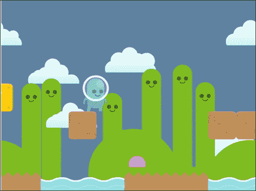

# 摘要

现在我们知道如何绘制瓦片地图以及检测它们和精灵之间以及精灵之间的碰撞。我们对于我们的游戏逻辑有一个可用的面向对象的代码的工作示例，我们将能够在许多其他类型的游戏中使用它。

至于我们之前的游戏，这里的游戏可以在许多方面进行改进，我建议这样做以更加熟悉代码。你可以增加更多的敌人，只有当玩家跳在它们上面时它们才会死亡，并且检测玩家何时到达关卡的结尾。

在下一章中，我们将运用我们在这里学到的技巧来制作一个俯视视角的 RPG 游戏。
