# 第五章：视角透视

现在我们将看到如何渲染另一种非常流行的效果：俯视透视（也称为俯瞰透视）。可以使用这种技术创建各种不同的游戏：

+   类似 *大逃杀* 的动作游戏

+   类似 *外星宝贝* 的射击游戏

+   类似于 *塞尔达传说* 或 *超时空战记* 的 RPG

+   类似于 *模拟城市* 的模拟

+   类似于 *文明* 或 *魔兽争霸* 的战争游戏

这些游戏使用的是所谓的正投影。可以使用简单的瓦片地图轻松渲染，就像我们在上一章中实现的那样。在本章中，我们将制作一个看起来像 *塞尔达传说：超级任天堂时代* 在超级任天堂上的角色扮演游戏。

我们将使用来自 BrowserQuest（[`browserquest.mozilla.org`](http://browserquest.mozilla.org)）的图形资产，这是 Mozilla 开发的非常酷的开源游戏，用于展示现代浏览器的能力。您可以在下面的截图中看到：

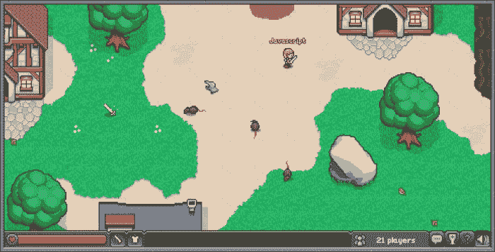

在本章中，我们将涵盖以下主题：

+   瓦片地图优化

+   精灵层遮挡

+   高级碰撞检测

在本章末尾，我们将快速讨论另一种可以用于相同类型游戏的俯视视图变体：2.5D 或等距投影。

# 优化俯视游戏的瓦片地图

我们在上一章实现的瓦片地图非常适合侧向滚动游戏，因为它们通常使用稀疏矩阵来定义它们的级别。这意味着如果你的级别长 100 个瓦片，高 7 个瓦片，那么它将包含远少于 700 个瓦片。这使我们能够在游戏开始时创建所有这些瓦片。

对于典型的俯视游戏，我们发现自己处于非常不同的情况。的确，为了渲染地图，定义了使用的瓦片地图的所有可能瓦片。这意味着对于相同尺寸的级别，我们将至少有 700 个瓦片。如果使用多个图层，情况会变得更糟。为了减少这个数字以提高性能，我们将只生成在启动时可见的瓦片。然后当视图移动时，我们将跟踪哪些瓦片变得不可见并删除它们，哪些瓦片变得可见并生成它们。

这里存在一个权衡；添加和删除瓦片会花费一些时间，而且很有可能会使游戏变慢。另一方面，在场景中有大量的瓦片并移动它们会使渲染变慢。

理想情况下，在两种技术之间做出选择是测试两种技术，找出哪种在目标平台上产生更好的结果。如果你真的需要，甚至可以使用混合方案，其中你按块生成瓦片地图。这将允许你调整何时容忍由于创建和删除瓦片而导致的减速。

在这里，我们将修改框架以仅显示可见的瓦片，并且已经证明对于这种玩家以合理速度移动且世界通常相当大的游戏来说，这已经足够快了。

## 查找可见瓦片

好消息是我们已经有了大部分需要找到可见瓦片的代码。实际上，我们有一个函数，它返回与一个框碰撞的瓦片。要找到可见瓦片，我们只需要将此框定义为游戏屏幕。

```js
// find the visible part
var offset = gf.offset(parent);
var visible = gf.tilemapBox(options, {
       x:      -options.x - offset.x, 
       y:      -options.x - offset.y, 
       width:  gf.baseDiv.width(),
       height: gf.baseDiv.height()
});
```

在这里，您可以看到我们使用一个函数来找到瓦片地图的偏移量。这是必需的，因为它可能嵌套在一个或多个已移动的组中。

要找到偏移量，我们只需查看当前元素及其所有父元素。如果父元素不是精灵、组或瓦片地图，则会停止。如果父元素是基本的 div，即用于容纳整个游戏的 div，也会停止。

```js
gf.offset = function(div){
   var options = div.data("gf");
   var x = options.x;
   var y = options.y;

   var parent = $(div.parent());
   options = parent.data("gf");
   while (!parent.is(gf.baseDiv) && options !== undefined){
      x += options.x;
      y += options.y;
      parent = $(parent.parent());
      options = parent.data("gf");
   }
   return {x: x, y: y};
}
```

要查找父元素是否为组、精灵或瓦片地图，我们检查与键“data”关联的对象是否存在。

除了找到可见框的部分之外，`addTilemap`函数本身并没有太多变化。以下是带有更改部分的其简短版本：

```js
gf.addTilemap = function(parent, divId, options){
    var options = $.extend({
        x: 0,
        ...
    }, options);

    // find the visible part
 var offset = gf.offset(parent);
 var visible = gf.tilemapBox(options, {
 x:      -options.x - offset.x,
 y:      -options.x - offset.y,
 width:  gf.baseDiv.width(),
 height: gf.baseDiv.height()
 });
 options.visible = visible;

    //create line and row fragment:
    var tilemap = gf.tilemapFragment.clone().attr("id",divId).data("gf",options);
    for (var i=visible.y1; i < visible.y2; i++){
        for(var j=visible.x1; j < visible.x2; j++) {
            var animationIndex = options.map[i][j];

            ...
        }
    }
    parent.append(tilemap);
    return tilemap;
}
```

## 移动瓦片地图

现在我们必须跟踪瓦片地图的移动以更新哪些是可见的。由于我们有两个函数来移动任何元素，所以我们只需修改它们。

但是，我们不能只在瓦片地图移动时更新它们；当其任何父元素移动时，我们还必须更新它们。jQuery 提供了一种非常简单的方法来查找元素是否具有瓦片地图作为其子元素或孙子元素：`.find()`。此函数搜索与提供的选择器匹配的任何子元素。

由于我们将类`gf_tilemap`添加到每个瓦片地图中，因此检测它们非常容易。以下代码是带有更改的新`gf.x`函数。`gf.y`函数完全相同。

```js
gf.x = function(div,position) {
    if(position !== undefined) {
        div.css("left", position);
        div.data("gf").x = position;

        // if the div is a tile map we need to update the visible part
        if(div.find(".gf_tilemap").size()>0){
 div.find(".gf_tilemap").each(function(){gf.updateVisibility($(this))});
 }
 if(div.hasClass("gf_tilemap")){
 gf.updateVisibility($(div));
 }
    } else {
        return div.data("gf").x; 
    }
}
```

如果子元素中的一个，或者元素本身，是瓦片地图，则需要更新它。我们使用`gf.updateVisibility()`函数来执行此操作。此函数仅在瓦片地图中找到新的可见框并将其与旧的框进行比较。这意味着我们必须将这种可见性存储在精灵的数据中。

下面的代码是此函数的完整实现：

```js
gf.updateVisibility = function(div){
   var options = div.data("gf");
   var oldVisibility = options.visible;

    var parent = div.parent();

    var offset = gf.offset(div);
   var newVisibility = gf.tilemapBox(options, {
       x:      -offset.x,
       y:      -offset.y,
       width:  gf.baseDiv.width(),
       height: gf.baseDiv.height()
    });

    if( oldVisibility.x1 !== newVisibility.x1 ||
       oldVisibility.x2 !== newVisibility.x2 ||
       oldVisibility.y1 !== newVisibility.y1 ||
       oldVisibility.y2 !== newVisibility.y2){

       div.detach();

       // remove old tiles 
       for(var i = oldVisibility.y1; i < newVisibility.y1; i++){
          for (var j = oldVisibility.x1; j < oldVisibility.x2; j++){
             div.find(".gf_line_"+i+".gf_column_"+j).remove();
          }
       }
       for(var i = newVisibility.y2; i < oldVisibility.y2; i++){
          for (var j = oldVisibility.x1; j < oldVisibility.x2; j++){
             div.find(".gf_line_"+i+".gf_column_"+j).remove();
          }
       }
       for(var j = oldVisibility.x1; j < newVisibility.x1; j++){
          for(var i = oldVisibility.y1; i < oldVisibility.y2; i++){
             div.find(".gf_line_"+i+".gf_column_"+j).remove();
          }
       }
       for(var j = newVisibility.x2; j < oldVisibility.x2; j++){
          for(var i = oldVisibility.y1; i < oldVisibility.y2; i++){
             div.find(".gf_line_"+i+".gf_column_"+j).remove();
          }
       }
       // add new tiles

       for(var i = oldVisibility.y2; i < newVisibility.y2; i++){
          for (var j = oldVisibility.x1; j < oldVisibility.x2; j++){
             createTile(div,i,j,options);
          }
       }
       for(var i = newVisibility.y1; i < oldVisibility.y1; i++){
          for (var j = oldVisibility.x1; j < oldVisibility.x2; j++){
             createTile(div,i,j,options);
          }
       }
       for(var j = oldVisibility.x2; j < newVisibility.x2; j++){
          for(var i = oldVisibility.y1; i < oldVisibility.y2; i++){
             createTile(div,i,j,options);
          }
       }
       for(var j = newVisibility.x1; j < oldVisibility.x1; j++){
          for(var i = oldVisibility.y1; i < oldVisibility.y2; i++){
             createTile(div,i,j,options);
          }
       }
       div.appendTo(parent);

    }
    // update visibility
    options.visible = newVisibility;
}
```

前四个循环用于删除不再可见的现有瓦片。我们不再测试要删除的瓦片是否在顶部或底部，而是写两个循环。代码中的第一个循环写得好像要删除的瓦片在顶部。如果要删除的瓦片实际上在底部，如下图所示，该循环将不会执行，因为`oldVisibility.y1 > newVisibility.y1`。

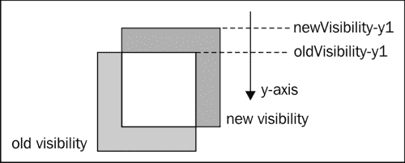

如果砖块要从顶部、左侧或右侧删除，我们会使用相同的机制添加新的砖块。然而，有一件事情需要我们小心; 当我们先水平添加砖块时，当我们垂直添加它们时，我们必须确保不要再次创建我们已经创建的砖块。下图显示了重叠的砖块:

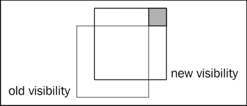

有更加优雅的方法来实现这一点，但在这里，我们只是在创建砖块之前检查是否存在这样一个砖块。这是在`gf.createTile`函数中完成的。

```js
var createTile = function(div, i,j,options){
   var animationIndex = options.map[i][j];
   if(animationIndex > 0 && div.find(".gf_line_"+i+".gf_column_"+j).size() === 0){
       var tileOptions = {
            x: options.x + j*options.tileWidth,
            y: options.y + i*options.tileHeight,
            width: options.tileWidth,
            height: options.tileHeight
        }
        var tile = gf.spriteFragment.clone().css({
            left:   tileOptions.x,
            top:    tileOptions.y,
            width:  tileOptions.width,
            height: tileOptions.height}
        ).addClass("gf_line_"+i).addClass("gf_column_"+j).data("gf", tileOptions);

        gf.setAnimation(tile, options.animations[animationIndex-1]);

        div.append(tile);
    }
}
```

有了这两个改变，瓦片地图现在是动态生成的。

# 排序遮挡

在使用俯视视图时，我们将遇到两种可能性中的一种: 要么“摄像机”直接望向地面，要么呈轻微的角度。下图说明了这两种情况:

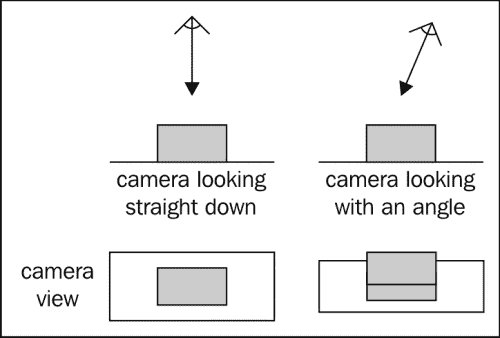

在第一种情况下，唯一一个元素被另一个元素隐藏的情况是它直接在上面。要产生这种效果非常容易;我们只需为每个高度使用一个组，并将精灵和瓦片地图放入正确的组中。

例如，让我们考虑一个包含树和桥的关卡，玩家可以在桥下行走，就像下图中的情况:

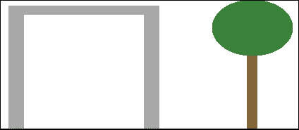

我们可以像这样组织我们的游戏屏幕:

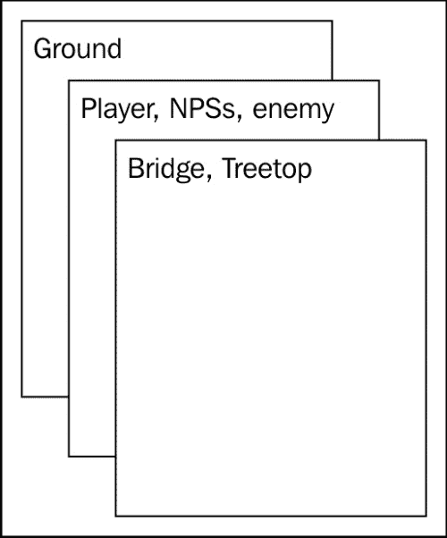

一旦完成这个步骤，就没什么好担心的了。如果 NPC（非玩家角色）或玩家在某个时刻上下移动，我们只需将他们从一个组中移除并添加到另一个组中。

然而，大多数现代游戏使用第二种视角，并且这也是我们小游戏将使用的视角。在这种透视中，不仅是上面的元素会覆盖其他元素，前面的元素也可能会隐藏它们。下图说明了这一点：

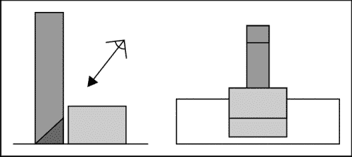

为了想出一个严格通用的解决方案对于大多数游戏来说可能有点过度，而且可能会产生一些性能问题。相反，我们将使用以下技巧来产生令人信服的效果。

## 精灵屏蔽

如果我们做出以下假设，精灵的情况就会变得简单:

+   地面是完全平坦的。可能有许多不同高度的平坦“楼层”，但它们每一个都是平坦的。

+   两个平坦楼层之间的高度差大于最大 NPC 或玩家的尺寸。

通过这些限制，我们可以用以下两个规则管理精灵的遮挡:

+   如果一个精灵在比另一个更高的楼层上，则前者将始终隐藏后者。

+   如果两个精灵在同一楼层上，则 y 坐标较大的那个将始终隐藏另一个

实现这个最简单的方式是使用`z-index` CSS 属性。实现看起来会像这样:

```js
gf.y(this.div, y);
this.div.css("z-index", y + spriteHeight);
```

这里我们需要将精灵的高度加到 y 坐标上，因为我们需要考虑的是遮挡的底部而不是顶部。

如果精灵所在的楼层高一层，我们将确保其 z 索引大于上方所有楼层中的所有精灵。假设我们给每个层级分配一个索引，0 表示最低层，1 表示上方的一层，依此类推；在这种情况下，从 y 坐标生成 z 索引的公式将是：

```js
z-index = y-coordinate + spriteHeight + floorIndex * floorHeight
```

在我们的游戏中，所有的精灵都将处于同一水平线上，因此我们不需要使用这个函数，而且我们可以坚持使用之前的代码。

## 关卡与精灵的遮挡

如果我们仍然保持之前的假设，那么我们不需要做太多工作来从背景中生成精灵的遮挡。我们的关卡是使用瓦片地图定义的。在设计关卡时，我们将我们的瓦片分成两个瓦片地图：一个是地板，另一个是地板上方的所有内容。

举例来说，让我们考虑一个场景，有一棵树和一座房子：

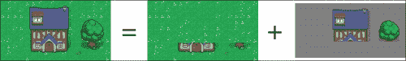

我们将地面、房子底部和树干存储在一个瓦片地图中，而将房顶和树叶存储在另一个瓦片地图中。

# 碰撞检测

对于此游戏，碰撞检测与之前的游戏略有不同。由于我们使用的是碰撞而不是与精灵边界框的每个像素的碰撞，我们可能会出现仅有精灵的非透明像素发生碰撞的情况，如下图所示：

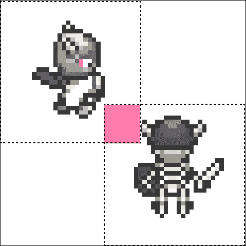

然而，有一个非常简单的解决方案来解决这个问题，而不需要使用每个像素或多边形碰撞检测；我们将使用第二个透明精灵来创建我们真正想要用于碰撞检测的区域。

## 玩家与环境的碰撞

在我们的游戏中，我们将使用 RPG 中经常使用的一种技术；玩家角色将不仅由一个精灵组成，而是由多个精灵叠加而成。这将使我们能够更改角色所穿的盔甲、使用的武器、发型、肤色等，而无需生成所有可能的组合变体。

在我们的游戏中，玩家角色的头像只会使用两张图片：玩家本身和其武器。我们会将它们放入一个组中；这样可以轻松地移动它们。

对于这两个精灵，我们首先会添加一个透明精灵，用于定义与环境碰撞的碰撞区域。下图正是显示了这一点：

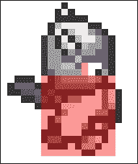

正如你所看到的，我们选择了一个碰撞框，其宽度与玩家角色的身体一样宽，但稍微短一些。这是为了考虑到玩家从下方靠近障碍物的情况。如前图所示，他的头部将隐藏该物体的底部的一部分。通过这个较小的碰撞框，我们自动产生了这种效果。

现在我们不希望角色与级别中的每个元素发生碰撞。例如，它不应该与地面或地面上方的任何东西发生碰撞。

如果你记得，我们之前将级别分成了两个瓦片地图。为了更容易进行碰撞检测，我们将简单地将下面的一个分成两个：

+   包含所有与玩家不发生碰撞的地面元素

+   包含所有与玩家碰撞的元素

这意味着我们现在有三个级别的瓦片地图。

正如你可以想象的，设计这个级别并将所有瓦片添加到正确的瓦片地图中正在变得过于复杂，因为我们手工编写了所有数组。相反，我们将使用瓦片地图编辑器。

### 使用瓦片地图编辑器

有相当多的免费和开源的瓦片地图编辑器。对于这个游戏，我们将使用 Tiled ([`www.mapeditor.org/`](http://www.mapeditor.org/))。它的优点是可以将瓦片地图导出为 JSON 文件。

我们将用于创建级别的图像来自 Mozilla 的游戏 BrowserQuest。以下图片显示了其中的一部分：

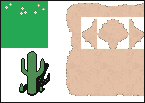

正如你所见，我们有草地的瓦片，沙地的瓦片，以及代表向沙地过渡的瓦片。过渡瓦片是半透明的，一半是沙地。这样可以让我们从任何其他类型的地面过渡到沙地。

这意味着我们将不得不使用另一个瓦片地图。下面的瓦片地图将分成两部分：一个包含所有地面元素，一个包含透明像素且不与玩家发生碰撞的过渡元素。但是，总共我们将有四个瓦片地图来绘制我们的级别。例如，我们级别的一部分带有沙子、草地和一棵树会是这样的：

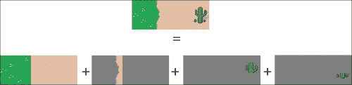

我们不会查看导入 Tiled 生成的 JSON 文件的整个代码。如果你想了解更多细节，只需查看`gf.importTiled`函数。重要的部分是我们使用 jQuery 的`$.ajax`函数。使用这个函数，我们将能够加载 JSON 文件。诀窍是使用正确的参数来调用它：

```js
$.ajax({
   url: url,
   async: false,
   dataType: 'json',
   success: function(json){...}
);
```

jQuery 还提供了一个名为`$.getJSON`的简写函数，但是我们希望进行同步调用，这只有通过`$.ajax`才可能。使用这些调用，我们提供给成功参数的函数将在 JSON 文件加载完成后调用。就在这个函数中，我们将导入文件。

如果你想看看我们究竟是如何做到的，你只需简单地查看本章提供的代码即可。

现在我们正在使用`$.ajax`函数，我们只需确保从服务器访问我们的代码以测试它，因为简单地在浏览器中打开我们的 HTML 文件将不再起作用。如果你没有运行服务器，你可以在 Windows 上使用 EasyPHP ([`www.easyphp.org`](http://www.easyphp.org))，或者在 OS X 上使用 MAMP ([`www.mamp.info`](http://www.mamp.info))。

## 玩家与精灵的碰撞

我们只支持一种精灵与精灵碰撞检测：玩家攻击敌人或与 NPC 交谈。和以前一样，我们需要一个透明精灵来定义应该检测到碰撞的区域。但是这次，这个区域不在玩家身上，而是在他前面，如下面的截图所示：

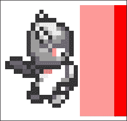

唯一的技巧是这个区域必须四处移动，以始终面向玩家所看的方向。如果我们使用上一个游戏中用来实现玩家的相同 OO 代码，它看起来会像这样：

```js
var player = new (function(){
    // the group holding both the player sprite and the weapon
    this.div = $();
    // the sprite holding the player's avatar
    this.avatar = $();
    // the sprite holding the weapon
    this.weapon = $();
    // the hit zone
    this.hitzone  = $();
    // collision zone
    this.colzone = $();

    //...

    this.update = function () {
        //...
    };

    this.left = function (){
        if(state !== "strike"){
            if(orientation !== "left" && moveY === 0 && moveX === 0){
                orientation = "left";
                gf.x(this.hitzone, 16);
                gf.y(this.hitzone, 16);
                gf.h(this.hitzone,  128 + 32);
                gf.w(this.hitzone, 64);
                //...

            }
            //...
        }
    };

    this.right = function (){
        //...
    };

    this.up = function (){
        //...
    };

    this.down = function (){
        if(state !== "strike"){
            if(orientation !== "down" && moveY === 0 && moveX === 0) {
                orientation = "down";
                state = "walk";
                gf.x(this.hitzone, 16);
                gf.y(this.hitzone, 192-80);
                gf.w(this.hitzone,  128 + 32);
                gf.h(this.hitzone, 64);
                //...
            }
            //...
        }
    };

    //...
});
```

代码的突出显示部分显示了我们在与 NPC 和敌人的交互中更改碰撞区域位置的地方。我们称之为精灵命中区，因为它代表了玩家剑挥动覆盖的区域。

要为这个击中区选择正确的大小和位置，你确实必须对你使用的图像进行微调。

在主游戏循环中，我们将检查此区域与 NPC 列表和敌人之间的碰撞，然后。

```js
this.detectInteraction = function(npcs, enemies, console){
    if(state == "strike" && !interacted){
        for (var i = 0; i < npcs.length; i++){
            if(gf.spriteCollide(this.hitzone, npcs[i].div)){
                npcs[i].object.dialog();
                interacted = true;
                return;
            }
        }
        for (var i = 0; i < enemies.length; i++){
            if(gf.spriteCollide(this.hitzone, enemies[i].div)){
                // handle combat
                interacted = true;
                return;
            }
        }
    }
};
```

### 与 NPC 交谈

我们将实现与 NPC 的唯一交互是单向对话。当玩家击中 NPC 时，我们将显示一行对话。如果他再次击中它，并且 NPC 还有更多话要说，我们将显示下一行对话。

我们将在屏幕底部使用一行来显示这个文本。这行必须是半透明的，以便让玩家看到其背后的关卡，并且必须覆盖游戏的所有元素。这是我们将创建它的方法：

```js
container.append("<div id='console' style='font-family: \"Press Start 2P\", cursive; color: #fff; width: 770px; height: 20px; padding: 15px; position: absolute; bottom: 0; background: rgba(0,0,0,0.5); z-index: 3000'>");
```

这种类型的界面通常称为控制台。为了使其半透明，同时保留其中的文本不透明，我们通过调用`rgba()`函数应用透明的背景颜色。为了确保它浮在所有游戏元素的上方，我们给它一个足够大的 z 索引。

要在此控制台中显示文本，我们只需使用`.html()`。以下代码是 NPC 的完整实现：

```js
var NPC = function(name, text, console){
    var current = 0;

    this.getText = function(){
        if(current === text.length){
            current = 0;
            return "[end]";
        }
        return name + ": " + text[current++];
    };

    this.dialog = function(){
        console.html(this.getText());
    }
}
```

这是我们将实例化其中一个的方法：

```js
npcs.push({
    div: gf.addSprite(npcsGroup,"NPC1", {
        x:      800,
        y:      800,
        width:  96,
        height: 96
    }),
    object: new NPC("Dr. Where", ["Welcome to this small universe...","I hope you will enjoy it.","You should head east from here...","there's someone you may want to meet."], console)
});
npcs[npcs.length-1].object.div = npcs[npcs.length-1].div;
gf.setAnimation(npcs[npcs.length-1].div, new gf.animation({
    url: "npc/scientist.png"
}));
$("#NPC1").css("z-index",800 + 96);
```

这里没有什么特别的；我们只需确保设置正确的 z 索引即可。

### 与敌人战斗

要与敌人战斗，我们将模拟掷骰子。战斗规则在 RPG 中非常典型：玩家向玩家掷骰子，并将其加到一个称为攻击修正值的固定值上。这将生成玩家攻击的攻击值。敌人将试图通过向敌人掷骰子并将其加到自己的防御修正值上来进行防御。

如果玩家的攻击大于敌人的防御，攻击就成功了，敌人将受到等于玩家攻击的生命损失。如果敌人的防御更强，攻击将失败，敌人将保持安全。

以下代码是此机制的实现：

```js
if(gf.spriteCollide(this.hitzone, enemies[i].div)){
    var enemyRoll = enemies[i].object.defend();
    var playerRoll = Math.round(Math.random() * 6) + 5;

    if(enemyRoll <= playerRoll){
        var dead = enemies[i].object.kill(playerRoll);
        console.html("You hit the enemy "+playerRoll+"pt");
        if (dead) {
            console.html("You killed the enemy!");
            enemies[i].div.fadeOut(2000, function(){
                $(this).remove();
            });
            enemies.splice(i,1);
        }
    } else {
        console.html("The enemy countered your attack");
    }
    interacted = true;
    return;
}
```

在这里，我们使用控制台向玩家显示战斗的进展情况。战斗的公式可能会因额外的参数而不同，例如玩家使用的武器提供的奖励以及敌人的盔甲。当决定一次打击是否成功时，真的取决于你要考虑的因素。

我们没有实现这个，但是敌人的反击会完全相同。

# 完整的游戏

游戏就到此为止了。其余的所有实现都直接来自我们在第四章中创建的游戏，《横向观察》。我们使用相同的面向对象的代码来解决玩家和其他精灵之间的碰撞。

一个很好的练习是让敌人四处移动并攻击玩家，为玩家实现一个经验和生命条，并设计一个更大的世界和更多的 NPC，使故事更加有趣。事实上，这就是编写 RPG 游戏的伟大之处；它们是讲故事的绝佳媒介！

另一种你可以改进这个游戏的方式是使用等距投影而不是正交投影。解释如何编写一个通用的等距引擎不在本书的范围内，但如果你想了解更多，你可以阅读*Andres Pagella*的《使用 HTML5、CSS3 和 JavaScript 制作等距社交实时游戏》（[`shop.oreilly.com/product/0636920020011.do`](http://shop.oreilly.com/product/0636920020011.do)）。

# 等距瓷砖

处理等距瓷砖时存在两个困难。首先，使用 DOM 元素显示正交网格非常简单，而使用等距网格更加复杂。其次，遮挡计算更加困难。

## 绘制等距瓷砖地图

我们将在这里使用一个技巧来生成我们的瓷砖地图。我们的每个瓷砖都将存储在一个区域，周围都是透明像素，以便给它们一个方形的形状，就像以下的屏幕截图一样：

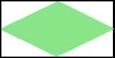

要实现这种魔法效果，我们将使用两个普通的瓷砖地图来显示一个等距瓷砖地图。它们会重叠，但它们之间的偏移量等于一个瓷砖的高度和宽度的一半。下图展示了它会是什么样子：

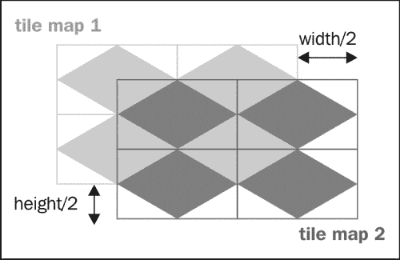

## 等距游戏的遮挡

对于等距游戏来说，遮挡比正交游戏更难管理。在这种情况下，你不能简单地通过图层来生成正确的遮挡。相反，你将不得不给在关卡中定位的每个“块”（如墙壁、树木、物体等）赋予一个 z 索引。

这种遮挡的价值将取决于其坐标，就像之前的玩家、NPC 和敌人一样。这意味着你需要对瓦片地图进行后处理并生成它们。这个过程可能非常复杂，难以自动化，如果你的游戏元素数量相对较小，你可能会选择手动完成。否则，你将需要一些关于每个块位于何处的 3D 模型。

# 摘要

在本章中，你已经学会了如何充分利用瓦片地图。现在你可以使用本章和上一章学到的技术来编写各种各样的游戏。你可能会发现，在编写游戏时遇到的问题往往是相同的。然而，最佳解决方案往往取决于你游戏的限制和约束。

当你开始编写游戏时，不要试图实现通用解决方案，而是首先专注于你的特定情况。结果很可能会更快、更容易维护，并且实现起来会花费更少的时间。

在下一章中，我们将学习如何使用我们在第四章 *横向看* 中创建的平台游戏来实现多层游戏。
