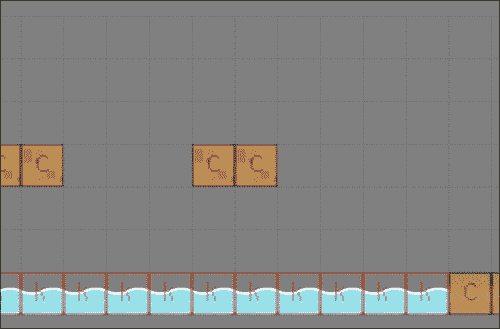
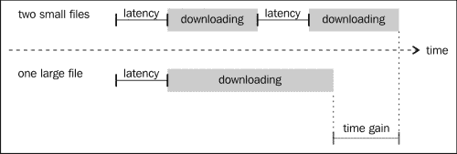

# 第六章：向你的游戏添加关卡

到目前为止，我们所有的游戏都只有一个关卡。这对于演示或概念验证来说很好，但你可能希望在游戏中有很多关卡。和往常一样，有很多方法可以做到这一点，但其中大多数都基于这样一个想法：每个关卡都由它们自己的文件（或文件）描述。

我们将在本章开始时快速探讨不同的文件组合方式来创建你的游戏。然后我们将查看允许这种技术的 jQuery 函数。

最后，我们将把我们在第四章中开发的游戏，*横向查看*，扩展到包括三个关卡，通过实现之前描述的一些技术。

以下是本章我们将涵盖的主题的快速列表：

+   使用多个文件来构建你的游戏

+   使用 `$.ajax` 加载文件

+   执行远程 JavaScript

+   向我们的游戏添加新关卡

# 实现多文件游戏

你首先要问自己的问题是，“其他文件何时加载？” 传统的方法是有简单的关卡，并在前一个关卡结束时加载下一个。这是平台游戏的典型情景。

另一种方法是有一个大的关卡，并在到达给定点时加载子关卡。通常，在 RPG 中，大关卡将是外部世界，而子关卡将是建筑物内部。在这两个示例中，文件的加载不需要异步执行。

最后一个常见的方法是拥有一个由许多子关卡组成的单个非常大的关卡。这通常是 MMORPG 的情况。在这里，你需要异步加载文件，以便玩家不会注意到必须加载子关卡。

你将面临的挑战取决于你处于上述哪种情况。它们可以分为以下几类：加载瓦片地图、精灵、加载逻辑行为。

## 加载瓦片地图

如果你还记得，在第五章中，*透视*，我们加载了以 JSON 文件形式的瓦片地图。正如我们之前解释的那样，我们加载一个包含瓦片地图描述的 JSON 文件。为此，我们使用 jQuery 中的基本 AJAX 函数：`$.ajax()`。稍后我们将看到如何使用此函数的所有细节。

然而，仅仅加载瓦片地图通常不足以完全描述你的关卡。你可能想要指定关卡结束的位置，哪些区域会杀死玩家，等等。一种常见的技术是使用第二个瓦片地图，一个不可见的瓦片地图，它包含为另一个瓦片地图添加含义的瓦片。

以下图示是一个示例：



这有几个优点：

+   你可以轻松地给不同的瓦片赋予相同的语义含义。例如，有或没有草的瓦片可以表示地面，并且与玩家的交互方式完全相同。

+   您可以为使用完全不同瓦片集的两个级别的瓦片赋予相同的语义含义。这样，只要它们使用相同的逻辑瓦片来建模，您就不必真正担心在您的级别中使用了什么图像。

实现这并不是真正困难的。下面的代码显示了`gf.addTilemap`函数的更改：

```js
gf.addTilemap = function(parent, divId, options){
    var options = $.extend({
        x: 0,
        y: 0,
        tileWidth: 64,
        tileHeight: 64,
        width: 0,
        height: 0,
        map: [],
        animations: [],
        logic: false
    }, options);

    var tilemap = gf.tilemapFragment.clone().attr("id",divId).data("gf",options);

    if (!options.logic){

       // find the visible part
       var offset = gf.offset(parent);
       var visible = gf.tilemapBox(options, {
          x:      -options.x - offset.x,
          y:      -options.x - offset.y,
          width:  gf.baseDiv.width(),
          height: gf.baseDiv.height()
       });
         options.visible = visible;

       //create line and row fragment:
       for (var i=visible.y1; i < visible.y2; i++){
           for(var j=visible.x1; j < visible.x2; j++) {
               var animationIndex = options.map[i][j];

               if(animationIndex > 0){
                   var tileOptions = {
                       x: options.x + j*options.tileWidth,
                       y: options.y + i*options.tileHeight,
                       width: options.tileWidth,
                       height: options.tileHeight
                   }
                   var tile = gf.spriteFragment.clone().css({
                       left:   tileOptions.x,
                       top:    tileOptions.y,
                       width:  tileOptions.width,
                       height: tileOptions.height}
                   ).addClass("gf_line_"+i).addClass("gf_column_"+j).data("gf", tileOptions);

                   gf.setAnimation(tile, options.animations[animationIndex-1]);

                   tilemap.append(tile);
               }
           }
       }
    }
    parent.append(tilemap);
    return tilemap;
}
```

如您所见，我们只是添加了一个标志来指示瓦片地图是否是为了逻辑目的。如果是这样，我们就不需要在其中创建任何瓦片。

碰撞检测函数现在也略有修改。在逻辑瓦片地图的情况下，我们不能简单地返回 divs。相反，我们将返回一个包含碰撞瓦片的大小、位置和类型的对象文字。下面的代码片段显示了这一点：

```js
gf.tilemapCollide = function(tilemap, box){
    var options = tilemap.data("gf");
    var collisionBox = gf.tilemapBox(options, box);
    var divs = []

    for (var i = collisionBox.y1; i < collisionBox.y2; i++){
        for (var j = collisionBox.x1; j < collisionBox.x2; j++){
            var index = options.map[i][j];
            if( index > 0){
               if(options.logic) {
 divs.push({
 type:   index,
 x:      j*options.tileWidth,
 y:      i*options.tileHeight,
 width:  options.tileWidth,
 height: options.tileHeight
 });
 } else {
                   divs.push(tilemap.find(".gf_line_"+i+".gf_column_"+j));
             }
            }
        }
    }
    return divs;
}
```

一旦实现了这个功能，加载关卡就变得非常容易了。事实上，只要逻辑瓦片地图存在并且游戏代码知道如何对每个瓦片做出反应，我们就不需要任何额外的东西让玩家对其环境做出反应。

## 加载精灵及其行为

如果从不同文件加载瓦片地图相当简单，那么对于关卡包含的精灵，有很多方法可以做同样的事情。

您可以为一个 JSON 文件实现一个解释器，该解释器将依次创建和配置敌人和 NPC。这样做的好处是，您可以合并这个 JSON 和描述瓦片地图的 JSON。这样您只需要加载一个文件而不是两个文件。由于每个加载的文件都有相当大的开销，因此文件的大小几乎没有影响；在大多数情况下，它将使您的关卡加载更快。下图说明了这一点：



它也有一些缺点：首先，您的引擎必须被编写成理解您希望您的敌人采取的所有可能行为。这意味着，如果您有一种仅在游戏的第十关中使用的敌人，您仍然需要在启动时加载其实现。如果您在一个团队中工作，其他成员想要实现自己类型的敌人，他们将需要修改引擎而不仅仅是在他们的关卡上工作。

您还需要非常小心地指定一个涵盖所有需求的 JSON 格式，否则您将有可能在以后不得不重构游戏的大部分内容。下面的代码是这样一个 JSON 文件的示例：

```js
{
   "enemies" : [
      {
         "name" : "Monster1",
         "type" : "spider",
         "positionx" : 213,
         "positiony" : 11,
         "pathx" : [250,300,213],
         "pathy" : [30,11,11]
      },
      {
         "name" : "Monster2",
         "type" : "fly",
         "positionx" : 345,
         "positiony" : 100,
         "pathx" : [12,345],
         "pathy" : [100,100]
      }   
   ],
   "npcs" : [
      {
         "name" : "Johny",
         "type" : "farmer",
         "positionx" : 202,
         "positiony" : 104,
         "dialog" : [
            "Hi, welcome to my home,",
            "Feel free to wander around!"
         ]
      }
   ]
}
```

另一种可能的实现是加载一个完整的脚本，该脚本将依次创建敌人并配置它们。这样做的好处是使您的游戏更具模块化，并减少了游戏与关卡之间的耦合。

虽然它有一些缺点。首先，如果你不小心，你的级别代码有可能覆盖一些主要游戏变量。这将创建相当难以跟踪的错误，并且将依赖于级别加载的顺序。其次，你必须特别小心地选择你的变量范围，因为每次加载新级别的代码都是在全局范围内执行的。

在本章中给出的示例中，我们将选择第二种解决方案，因为对于一个小游戏来说，这是比较合理且相当灵活的。

无论你选择实现哪一个，你很可能将使用`$.ajax`或其别名之一。在下一节中，我们将对其进行详细介绍。

## 使用`$.ajax`

`$.ajax`函数是一个非常强大但低级的函数。它有许多别名，可用于不同的特定任务：

+   `$.get`是一个多用途别名，与`$.ajax`相比减少了选项的数量，并且其 API 是基于多个可选参数而不是单个对象文字。它总是以异步方式加载文件。

+   `$.getJSON`是一个用于异步加载 JSON 文件的函数。

+   `$.getScript`是一个以异步方式加载脚本并且执行的函数。

+   `$.load`是一个以异步方式加载 HTML 文件并将其内容注入到所选元素中的函数。

+   `$.post`类似于`$.get`，但使用了 post 请求。

如你所见，所有这些别名都有一个共同点：它们都以异步方式加载它们的文件。这意味着如果您更喜欢同步加载资源，您将需要使用`$.ajax`。但是，一旦您知道了正确的参数，你稍后会看到它实际上并没有比别名更复杂。此外，别名的 API 文档始终包括要用于`$.ajax`调用的确切参数以产生相同的效果。

当使用`$.ajax`时，你必须确保通过服务器访问文件，并且遵守同源策略。否则，在大多数浏览器上，你可能会遇到问题。要了解有关`$.ajax`的更多信息，您应该查看官方 jQuery API 文档（[`api.jquery.com/jQuery.ajax/`](http://api.jquery.com/jQuery.ajax/)）。

## 加载一个 JSON 文件

JSON 文件是一种非常方便的加载外部数据的方式，无需自行解析。一旦加载，JSON 文件通常存储在一个简单的 JavaScript 对象中。然后你只需查找其属性就能访问数据。

如果你想用`$.ajax`模拟对`$.getJSON`的调用，它看起来会像下面的代码：

```js
$.ajax({
  url: url,
  dataType: 'json',
  data: data,
  success: callback
});
```

在这里，`url`是 JSON 文件的 Web 地址，`data`是您可能希望传递到服务器的可选参数列表，`success`是在加载 JSON 文件后将处理它的回调函数。如果你想同步访问远程文件，你必须在调用中添加参数`async` `:` `false`。

它是在回调函数中你将决定如何处理 JSON 文件；它将具有以下签名：

```js
var callback = success(data, textStatus, jqXHR)
```

在这里，`data`保存着从 JSON 文件生成的对象。你将如何处理它，这实际上取决于你的用例；这里是一个导入 Tiled 生成的地图图块的代码的简短版本：

```js
success: function(json){
    //...

   var layers = json.layers;
   var usedTiles = [];
   var animationCounter = 0;
   var tilemapArrays = [];

   // Detect which animations we need to generate
   // and convert the tiles array indexes to the new ones
   for (var i=0; i < layers.length; i++){
      if(layers[i].type === "tilelayer"){
         // ...
         tilemapArrays.push(tilemapArray);
      }
   }
   // adding the tilemaps
   for (var i=0; i<tilemapArrays.length; i++){
      tilemaps.push(gf.addTilemap(parent, divIdPrefix+i, {
         x:          0,
         y:          0,
         tileWidth:  tileWidth,
         tileHeight: tileHeight,
         width:      width,
         height:     height,
         map:        tilemapArrays[i],
         animations: animations,
         logic: (layers[i].name === "logic")
         }));
      }
   }
});
```

高亮部分是相当典型的。实际上，大多数复杂的 JSON 都将包含一系列元素，以便描述任意数量的类似实体。当您不是 JSON 文件规范的设计者时，您可能会发现自己处于这样一种情况：您必须将 JSON 对象的内容转换为自己的数据结构。这段代码正是这样做的。

这里没有通用的方法，你真的必须考虑每种情况。好处是，在大多数情况下，这段代码只会在游戏中执行几次，因此，性能方面并不敏感。与其在所有地方搜索可以使其运行更快的地方，还不如使其尽可能易读。

## 加载远程脚本

如果你想要用`$.ajax`来模仿`$.getScript`的用法，看起来会像下面这样：

```js
$.ajax({
  url: url,
  dataType: "script",
  success: success
});
```

就像我们之前做的那样，你可以通过简单地将`async : false`添加到参数列表中使其同步。这将做两件事情：加载脚本并执行它。这里回调函数并不那么重要，它只允许你跟踪文件是否成功检索。

正如前面提到的，脚本将在全局范围内执行。这对你的代码组织有一些影响。直到现在，我们游戏的代码看起来像这样：

```js
$(function() {
    var someVariable = "someValue";

    var someFunction = function(){
        //do something
    }
});
```

所有的函数和变量都在一个"私有"范围内定义，外部无法访问。这意味着如果你的远程代码尝试做下面这样的事情，它将失败：

```js
var myVariable = someVariable;
someFunction();
```

实际上，函数`someFunction`和`someVariable`在全局范围内是不可见的。解决方案是仔细选择哪些变量和函数应该对远程代码可见，并将它们放在全局范围内。在我们的情况下，可能会像这样：

```js
var someVariable = "someValue";    
var someFunction = function(){
    //do something
}

$(function() {
    // do something else
});
```

你可能想要将所有这些函数都放在一个命名空间中，就像我们为我们的框架所做的那样。由于你正在编写一个最终产品，不太可能被其他库用作库，这更多取决于个人偏好。

## 调试对$.ajax 的调用

现在我们正在加载远程文件，可能会出现一系列新问题：文件的 URL 可能不再有效，服务器可能已经关闭，或者文件可能格式不正确。在生产环境中，您可能希望在运行时检测这些问题，以向用户显示一条消息，而不仅仅是崩溃。在开发阶段，您可能希望找出到底出了什么问题，以便调试您的代码。

jQuery 提供了三个函数，你可以用它们来实现这个功能：.`done()`、`.fail()`和`.always()`。以前还有另外三个函数（`.success()`、`.error()`和`.complete()`），但自 jQuery 1.8 版本起已经被弃用。

### .done()

`.done()`可以用来代替成功回调。只有在文件成功加载后才会调用它。提供的函数将按以下顺序调用以下三个参数：`data`、`textStatus`、`jqXHR`。

`data`是加载的文件，这意味着如果你愿意，你可以在那里处理你的 JSON 文件。

### `.fail()`

每当发生问题时都会调用`.fail()`。提供的函数将按以下顺序调用以下三个参数：`jqXHR`、`textStatus`、`exception`。

当加载和执行脚本时，如果脚本未被执行，查找发生了什么非常方便。实际上，在大多数浏览器的调试控制台中不会出现异常，但异常参数将包含你的代码抛出的确切异常。

例如，如果我们看一下之前描述的作用域问题，主游戏包含以下代码：

```js
$(function() {
    var someVariable = "someValue";

    var someFunction = function(){
        //do something
    }
});
```

远程脚本如下：

```js
someFunction();
```

你可以通过编写以下代码来捕获异常：

```js
$.getScript("myScript.js").fail(function(jqxhr, textStatus, exception) {
    console.log("Error: "+exception);
});
```

控制台将写入以下错误：

```js
error: ReferenceError: someFunction is not defined
```

这将用于检测其他问题，如服务器无响应等。

# 修改我们的平台游戏

现在我们已经掌握了创建多级游戏所需的所有知识。首先，我们将创建一个级别列表和一个加载它们的函数：

```js
var levels = [
        {tiles: "level1.json", enemies: "level1.js"},
        {tiles: "level2.json", enemies: "level2.js"}
    ];

    var currentLevel = 0;

    var loadNextLevel = function(group){
        var level = levels[currentLevel++];
        // clear old level
        $("#level0").remove();
        $("#level1").remove();
        for(var i = 0; i < enemies.length; i++){
            enemies[i].div.remove();
        }
        enemies = [];

        // create the new level

        // first the tiles
        gf.importTiled(level.tiles, group, "level");

        // then the enemies
        $.getScript(level.enemies);

        // finaly return the div holdoing the tilemap
        return $("#level1");
    }
```

高亮显示的行是远程加载文件的行。这使用了之前描述的函数。正如你所看到的，没有机制来检测游戏是否结束。如果你愿意，你可以将其作为作业添加进去！

在加载下一级之前，我们必须确保删除现有的级别以及它包含的敌人。

现在我们将更改游戏以使用逻辑砖块而不是标准砖块。这样我们可以有一种定义一个级别结束的砖块。以下是我们修改后用于执行此操作的碰撞检测代码：

```js
var collisions = gf.tilemapCollide(tilemap, {x: newX, y: newY, width: newW, height: newH});
var i = 0;
while (i < collisions.length > 0) {
    var collision = collisions[i];
    i++;
    var collisionBox = {
        x1: collision.x,
        y1: collision.y,
        x2: collision.x + collision.width,
        y2: collision.y + collision.height
    };

    // react differently to each kind of tile
    switch (collision.type) {
        case 1:
            // collision tiles
            var x = gf.intersect(newX, newX + newW, collisionBox.x1,collisionBox.x2);
            var y = gf.intersect(newY, newY + newH, collisionBox.y1,collisionBox.y2);

            var diffx = (x[0] === newX)? x[0]-x[1] : x[1]-x[0];
            var diffy = (y[0] === newY)? y[0]-y[1] : y[1]-y[0];
            if (Math.abs(diffx) > Math.abs(diffy)){
                // displace along the y axis
                 newY -= diffy;
                 speed = 0;
                 if(status=="jump" && diffy > 0){
                     status="stand";
                     gf.setAnimation(this.div, playerAnim.stand);
                 }
            } else {
                // displace along the x axis
                newX -= diffx;
            }
            break;
        case 2:
            // deadly tiles
            // collision tiles
            var y = gf.intersect(newY, newY + newH, collisionBox.y1,collisionBox.y2);
            var diffy = (y[0] === newY)? y[0]-y[1] : y[1]-y[0];
            if(diffy > 40){
                status = "dead";
            }
            break;
        case 3: 
 // end of level tiles
 status = "finished"; 
 break;
    }

}
```

如你所见，我们增加了玩家碰到某些砖块时死亡的可能性。这将使他/她重新出现在当前级别的开始处。如果砖块的类型是 3，我们将玩家的状态设置为`finished`。稍后，我们检测状态并加载下一个级别。

```js
if (status == "finished") {
    tilemap         = loadNextLevel(group);
    gf.x(this.div, 0);
    gf.y(this.div, 0);
    status = "stand";
    gf.setAnimation(this.div, playerAnim.jump);
}
```

别忘了重置玩家位置，否则它将出现在下一级的中间位置，而不是起始点。

现在我们必须编写每个脚本，为它们各自的级别创建敌人。这几乎是与游戏的先前版本中使用的相同代码，但放在一个单独的文件中：

```js
var group = $("#group");

var fly1   = new Fly();
fly1.init(
    gf.addSprite(group,"fly1",{width: 69, height: 31, x: 280, y: 220}),
    280, 490,
    flyAnim
);
enemies.push(fly1);

var slime1 = new Slime();
slime1.init(
    gf.addSprite(group,"slime1",{width: 43, height: 28, x: 980, y: 392}),
    980, 1140,
    slimeAnim
);
enemies.push(slime1);

var slime2 = new Slime();
slime2.init(
    gf.addSprite(group,"slime2",{width: 43, height: 28, x: 2800, y: 392}),
    2800, 3000,
    slimeAnim
);
enemies.push(slime2);
```

正如你可能已经想到的那样，我们不能简单地运行游戏并使用该脚本而不对我们的代码进行一些修改。如前所述，远程脚本将在全局范围内执行，我们需要将它使用的部分移到其中。

在这里，我们需要敌人的对象和动画，以及包含敌人列表的数组。我们将它们从它们的闭包中取出，然后添加到我们游戏脚本的开头：

```js
var enemies = [];
var slimeAnim = {
    stand: new gf.animation({
        url: "slime.png"
    }),
    // ...

}
var flyAnim = {
    stand: new gf.animation({
        url: "fly.png"
    }),
    // ...}

var Slime = function() {
    // ...
};
var Fly = function() {}
Fly.prototype = new Slime();
Fly.prototype.dies = function(){
    gf.y(this.div, gf.y(this.div) + 5);
}

$(function() {
   // here come the rest of the game
});
```

现在游戏将包含我们想要的任意数量的关卡。享受关卡编辑器的乐趣！在这里，我们仅使用脚本来设置敌人，但如果我们想的话，我们也可以用它来更改关卡背景。

# 摘要

使你的游戏多层级将为你带来一些新的技巧。现在你已经学会了将你的资产分成许多文件，并在需要时加载它们。你还学会了如何使用瓦片来描述逻辑行为，而不仅仅是你的关卡的图形方面。

正如前面提到的，游戏还有很多可以做得更有趣的地方。我建议花一些时间来设计关卡。在大多数商业游戏中，这是花费时间最多的地方，所以不要犹豫，停下编码一段时间，开始制作和测试你的关卡！

在下一章中，你将学习如何制作多人游戏。为此，我们将使用我们在第五章中创建的游戏，*将事情放在透视中*，并以与我们在本章中使用的第四章中的游戏相同的方式为它添加新功能。
