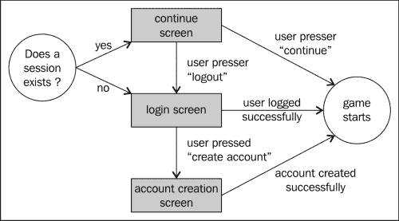
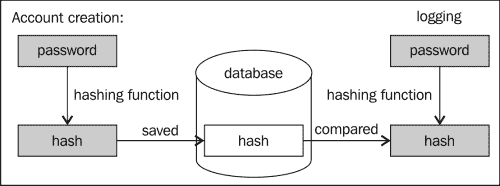
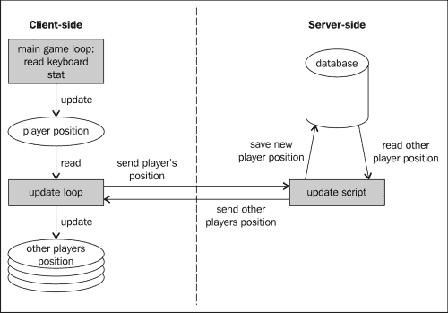
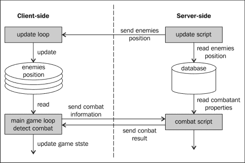

# 第七章：制作多人游戏

单人游戏是有趣的，正如我们已经看到的，你可以使用 JavaScript 制作各种不同类型的单人游戏。然而，让游戏在网络浏览器中运行，就会有一种很大的诱惑，让它成为多人游戏。这正是我们在本章中要做的，而且什么比一个 MMORPG 更好的多人游戏示例呢！

我们将把我们在第五章中的小型单人 RPG，*将事物置于透视之下*，变成一个全新的 MMORPG：*阿尔皮吉的世界*。

然而，首先需要警告一下——我们将用来实现游戏服务器端的技术是 PHP + MySQL。这么做的原因是它迄今为止是最常见的技术。如果你有某种类型的托管服务，很可能会直接支持它。

有许多原因说明这不一定是最佳解决方案。当编写一个游戏，其中服务器端的使用不仅仅是为了提供静态页面时，你必须仔细考虑扩展问题：

+   有多少用户能够同时在你的系统上玩？

+   当玩家数量超过这个限制时，你将怎么办？

+   你准备付多少费用来使你的服务器运行？

+   你想向玩家提供什么样的服务质量？

回答这些问题应该决定你将选择什么技术和基础架构。本书的目的不在于详细讨论这一点；我们将实现的解决方案应该可以扩展到几十名玩家而没有任何问题，但你所学到的技术可以应用于任何你选择的软件解决方案或托管服务！

在本章中，我们将涵盖以下主题：

+   多人游戏规范

+   管理玩家账户

+   同步玩家状态

+   管理敌人的服务器端

# 阿尔皮吉的世界

我们将基于我们之前的 RPG 创造的游戏将具有以下特点：

+   一个玩家可以创建一个账户，并用它登录游戏

+   当他们回到游戏时，他们的化身将会重新出现在他们离开时的位置

+   每个玩家都可以看到同时在线的所有其他玩家

+   其他玩家的名字将显示在他们的头像上方

+   敌人的状态由服务器端管理：如果有人杀死一个怪物，那么对于所有其他玩家来说，它将会死亡

这个游戏将具有与其基础游戏相同的一些限制。怪物不会反击，也不会四处移动。

# 管理玩家账户

让我们从基础知识开始：让玩家创建账户并登录游戏。为了在服务器端存储信息，我们将使用一个数据库（MySQL）。我们将使用的表结构非常简单，因为没有太多需要存储的东西。玩家的账户将存储在一个我们会有创意地称为`players`的表中。

这个表将具有以下行：

+   NAME: 这是一个包含玩家姓名的字符串。它将是唯一的，因此没有两个玩家可以拥有相同的名字。

+   PW：这是一个字符串，保存着玩家的密码。它被哈希化了（关于这点，*在数据库中搜索元素* 中有更多内容）。

+   X：这是一个双精度浮点数，将保存玩家的 x 坐标。

+   Y：这是一个双精度浮点数，将保存玩家的 y 坐标。

+   DIR：这是一个整数，我们将用来存储玩家面向的方向。

+   STATE：这是一个整数，表示玩家的状态：站立、行走或战斗。

+   LASTUPDATE：这是一个时间戳，记录了服务器最后一次收到玩家消息的时间。

提供了一个 SQL 脚本，该脚本在文件 `create_tables.sql` 中创建了游戏所需的所有表格。

为了创建允许创建账户或登录游戏的用户界面，我们将使用一系列会重叠游戏屏幕的`div`。任何时候只有一个会是可见的。以下图展示了可能的用户交互和相应的屏幕：



这些屏幕中的每一个都将是一个包含几个输入字段和/或按钮的`div`。例如，允许玩家创建账户的屏幕将是：

```js
<div id="create" class="screen">
   <h1>Create an account</h1>
   <div class="input"><span>name:</span><input id="create-name" type="text" /></div>
   <div class="input"><span>pw:</span><input id="create-pw" type="text" /></div>
   <a class="button left" id="create-cancel" href="#">cancel</a>
   <a class="button right" id="create-create" href="#">create</a>
</div>
```

它将用 CSS 进行样式化，交互部分将用 jQuery 编写。对于这个屏幕，代码如下：

```js
$("#create-cancel").click(function(e){
   $("#create").css("display","none");
   $("#login").css("display","block");
   e.preventDefault();
});
$("#create-create").click(function(e){
   // interact with the server
   e.preventDefault();
});
```

用于将 JavaScript 代码连接到 HTML 代码的链接的 ID 已经突出显示。没什么太复杂的，但是起到了作用。

在前面的代码中故意略去了有趣的部分，即与服务器的实际交互。我们客户端（在浏览器中运行的游戏）与服务器之间的所有交互都将使用 JSON 和我们在上一章中提到的`$.getJSON`函数进行（这是`$.ajax`的简写）。

为了将信息传输到服务器，我们将使用`$.getJSON`函数的第二个参数。为了向客户端传输信息，服务器将生成一个 JSON 文件。

我们将使用服务器端文件来创建一个名为 `createUser.php` 的账户，因此`$.getJSON`调用将如下所示：

```js
$.getJSON(
   "createUser.php",
   {
 name: $("#create-name").val(),
 pw: $("#create-pw").val()
 },
   handleCreateUserJson
)
```

正如我们之前提到的，我们通过将用户选择的名称和密码包装在一个对象文字中，并将其作为第二个参数传递给函数调用来提交它们。正如已经提到的，第三个参数是一个函数，一旦服务器返回它，就会处理 JSON 文件。

## 在数据库中搜索元素

第一次，我们将不得不生成一个 JSON 文件。这个文件非常简单；它应该告诉客户端账户创建是否成功，如果成功，还有关于玩家的信息。

我们选择将其写成以下代码片段，但是如何创建 JSON 文件是完全由您决定的。如果您对 JSON 文件应该遵循的确切语法不熟悉，请快速阅读 [`www.json.org/`](http://www.json.org/)。

```js
{
   "success" : true,
   "x" : 510, 
   "y" : 360, 
   "dir" : 0
}
```

实现函数以读取该 JSON 文件并相应地做出反应非常容易。如果操作成功，我们将启动游戏，并在出现问题时显示错误消息。以下代码就是这样做的：

```js
var handleCreateUserJson = function(json,status){
   if (json.success){
      name = $("#create-name").val();
      initialPlayerPos.x   = json.x;
      initialPlayerPos.y   = json.y
      initialPlayerPos.dir = json.dir;
      $("#create").css("display","none");
      gf.startGame(initialize);
   } else {
      alert("Name already taken!");
   }
}
```

这相当简单，因为大部分复杂的工作都在服务器上运行。让我们看看在那里需要做什么。首先，我们必须检索客户端发送的参数。由于我们使用了`$.getJSON`，对 JSON 文件的请求是一个`GET`请求。这意味着我们将使用 PHP 的`$_GET`超全局变量来访问它们。当向服务器传递敏感信息时，你可能希望使用`POST`请求代替（尽管仅靠这一点并不能阻止有动机的人仍然访问参数）。`$_GET`是一个保存客户端发送的所有参数的变量，因此在我们的情况下，我们可以写成：

```js
$name = $_GET['name'];
$pw    = $_GET['pw'];
```

我们将把用户选择的名称和密码存储到变量中。现在我们必须查询数据库，检查是否已经定义了一个具有此名称的用户。要在 PHP 中运行 SQL 查询，我们将使用 mysqli ([`php.net/manual/en/book.mysqli.php`](http://php.net/manual/en/book.mysqli.php))：

```js
// 1) contect to the DB server
$link = mysqli_connect('localhost', 'username', 'password'); 

// Select the DB
mysqli_select_db($link, 'rpg');

// query the DB
$result = mysqli_query($link, 'SELECT * FROM players WHERE name = "'.$name.'"');
```

### 注意

请注意，上述代码不应用于生产，因为我们直接将用户提供的参数插入到数据库查询中，这会带来巨大的 SQL 注入风险！最佳做法是在将它们注入到 SQL 查询之前始终转义所有字符串。一个简单的方法是使用`mysqli_escape` ([`www.php.net/manual/en/mysqli.real-escape-string.php`](http://www.php.net/manual/en/mysqli.real-escape-string.php))。

我们不会详细介绍编写 SQL 查询的细节。它们很容易阅读，并且对于像这样的基本查询来说，编写也很容易。如果你想了解更多关于 SQL 的知识，你可以搜索网络或阅读关于该主题的众多书籍之一。

一旦我们得到了查询结果，我们需要检查查询是否返回了一个元素，以查看该名称是否已经存在于数据库中。这只需简单地执行：

```js
$obj = mysqli_fetch_object($result);
```

现在，如果`$obj`为零，我们可以创建新账户。

## 在数据库中创建一个新玩家

在查看将在数据库中创建玩家的查询之前，让我们谈谈密码。你永远不应该在数据库中存储原始密码，因为历史表明数据库经常遭到黑客攻击。推荐的解决方案是在存储密码之前对其进行哈希处理。然后，你可以简单地将提交的密码的哈希版本与数据库中存储的密码进行比较。



这就是我们将用 PHP 的`hash`函数来做的事情。然后我们将简单地将用户名和哈希值与玩家的起始位置一起插入到数据库中。

由于这也是一个查询，我们使用了与之前用来查找账户是否已经存在这个名称相同的函数：

```js
$hash = hash('md5', $pw);
$query = 'INSERT INTO players (name, x, y, dir, pw, state) VALUES("'.$name.'", 510, 360, 0, "'.$hash.'", 0)';
mysqli_query($link, $query);
```

我们传递给`hash`函数的第一个参数在前面的代码中被突出显示了。它是哈希方法，我们在这里使用的`'md5'`现在不推荐用于生产，因为它被认为现在太容易被破解。如果你想了解更多可用的方法，请查看[`www.php.net/manual/en/function.hash.php`](http://www.php.net/manual/en/function.hash.php)中的函数文档。

现在我们可以生成客户端将接收的 JSON 了。这是通过使用 PHP 的`json_encode`函数完成的（[`php.net/manual/en/function.json-encode.php`](http://php.net/manual/en/function.json-encode.php)）。这个函数接受一个对象并将其转换为 JSON 格式的字符串。

```js
$json['success'] = true;
$json['x'] = 510;
$json['y'] = 360;
$json['dir'] = 0;

echo json_encode($json);
```

现在，为了让你对客户端文件的整体情况有个全局了解，完整的代码如下所示：

```js
<?php
   session_start();

   include 'dbconnect.php';

    // JSON Object 
    $json = array('success'=>false);

   $name = $_GET['name'];
   $pw    = $_GET['pw'];

   if(isset($name) && isset($pw)) {
      $hash = hash('md5', $pw);
      $query = 'SELECT * FROM players WHERE name = "'.$name.'"';
      $result = mysqli_query($link, $query);
      $obj = mysqli_fetch_object($result);
      if(!$obj){
         $query = 'INSERT INTO players (name, x, y, dir, pw, state) VALUES("'.$name.'", 510, 360, 0, "'.$hash.'", 0)';
         $result = mysqli_query($link, $query);

         $_SESSION['name'] = $name;
         $_SESSION['pw'] = $pw;

            $json['success'] = true;
            $json['x'] = 510;
            $json['y'] = 360;
            $json['dir'] = 0;
      }
   }

    echo json_encode($json);

   // Close DB's connection
   mysqli_close($link);
?>
```

在这里，你可以看到我们包含了一个名为`dbconnect.php`的文件，它允许我们在此文件中只写一次数据库配置，并从需要连接到它的每个文件中使用它。这是我们将用于实现服务器端的每个其他功能的同一个基本功能。

## 保持玩家连接

不过，这个实现中有一件事情我们还没有解释。如果你看一下突出显示的代码，你会看到用户名被存储到了会话中。

这将允许服务器继续知道玩家的姓名，而不必在每次后续请求中都提交它。它还将允许我们允许用户在会话仍然有效的情况下继续玩游戏，而无需再次提供他/她的用户名和密码。

如果你看一下本章开头的用户交互流程图，你会看到有一个屏幕建议用户继续玩游戏。只有在服务器仍然有一个可用于他/她的有效会话时，我们才会显示它。为了检查这一点，我们将创建另一个名为`session.php`的 PHP 文件，它如下所示：

```js
<?php
   session_start();

   // MySQL connection
   include 'dbconnect.php';

    // JSON Object 
    $json = array('connected'=>'false');

   if(isset($_SESSION['name'])) {
      $query = 'SELECT * FROM players WHERE name = "'.$_SESSION['name'].'"';
      $result = mysqli_query($link, $query);
      $obj = mysqli_fetch_object($result);
      if($obj){
          $json['name'] = $_SESSION['name'];
            $json['x'] = floatval($obj->x);
            $json['y'] = floatval($obj->y);
            $json['dir'] = intval($obj->dir);
      } else {
         session_destroy();   
      }

        mysqli_free_result($result);
   }

    echo json_encode($json);

    mysqli_close($link);
?>
```

然后我们简单地检查`name`是否存在于会话中。但是，如果存在，我们还需要做一件事情；那就是从数据库中检索玩家。这将为我们提供其最后一个坐标，并再次检查用户名和密码是否确实匹配。

我们不将坐标保存在会话本身中，因为我们希望玩家能够使用许多不同的机器或浏览器连接到同一个帐户（尽管不能同时进行）。

一旦数据库执行了一个请求，我们就可以使用`mysql_result`来读取结果。这个函数需要三个参数：

1.  查询的结果，由`mysql_query`生成。

1.  我们想要读取的结果的索引。这是必要的，因为查询可能会返回多个结果（例如，如果我们在`players`表中搜索所有帐户）。

1.  我们想要读取的字段的名称。

一旦我们有了这些信息，我们就可以通过将其格式化为 JSON 文件来将其发送给客户端。

在客户端，我们将在游戏开始时调用此函数以选择要显示的屏幕（继续屏幕或登录屏幕）。这与使用`$.getJSON`调用一样通常。

```js
$.getJSON(
   "session.php",
   function(json){
      if(json.connected){
         name = json.name;
         initialPlayerPos.x   = json.x;
         initialPlayerPos.y   = json.y
         initialPlayerPos.dir = json.dir;
         $("#session-name").html(name);
         $("#session").show(0);
      } else {
         $("#login").show(0);
      }
   }
);
```

这与我们之前所做的非常相似。

## 将用户登录游戏

这几乎与我们检查现有会话的方式相同。在服务器端，我们需要发出请求来证明用户名和密码是否匹配，并获取玩家位置。

在客户端，如果密码错误，我们需要显示警告并开始游戏。

我们用于此目的的 JSON 如下所示：

```js
{ 
   "success" : true , 
   "x" : 154,
   "y" : 1043,
   "dir" :0
}; 
```

如果用户名和密码不匹配，则成功将为 false。否则，JSON 将如之前所示。我们不会向您显示服务器和客户端代码，因为它们与我们已经看到的非常相似。

# 保持玩家同步

根据我们到目前为止所看到的内容，我们可以登录游戏，但仅此而已；现在我们需要的是一种方法来让服务器了解玩家的移动并给客户端提供所有其他玩家的位置。以下图显示了客户端和服务器将如何交互：



我们将在一个 JSON 调用中执行这两个操作。我们将使用它将玩家的当前位置传递给服务器，就像之前为用户名和密码做的那样。作为回报，服务器将生成一个 JSON 文件，其中包含所有其他玩家的列表。

```js
{ 
   "players" : [
      {"name": "Alice", "x": 23, "y": 112, "dir": 0, "state": 0},
      {"name": "Bob", "x": 1004, "y": 50, "dir": 2, "state": 1}
   ]
};
```

让我们首先看一下服务器端。在那里，我们需要编写两个查询：第一个查询用于检索所有玩家的列表，第二个查询用于更新当前玩家的状态。

## 检索所有其他玩家

这仅意味着找到`players`表中除了当前玩家之外的所有条目。但是，有一件事情我们必须小心：我们只想显示当前正在玩游戏的玩家。

由于在线上可能发生很多事情，我们不能确定玩家是否能够在断开连接之前注销，因此，我们选择使用时间戳。每次玩家更新其位置时，我们将时间戳设置为当前时间。

通过比较时间戳和当前时间，我们可以知道哪些玩家不再在线了。我们随意决定，如果我们已经超过 10 分钟没有收到他/她的消息，那么玩家将被视为离线。相应的 MySQL 查询如下：

```js
$query = 'SELECT * FROM players WHERE lastupdate > TIMESTAMPADD(MINUTE, -10, NOW()) AND name <> "'.$_GET['name'].'"';
```

在这里，我们测试名称是否与当前玩家不同（`<>`在 SQL 中表示"不等于"）。

读取结果并将其打印到服务器响应的代码如下：

```js
$result = mysqli_query($link, $query);

while ($obj = mysqli_fetch_object($result)) {
    array_push($json['players'], array('name'=>$obj->name, 'x'=>floatval($obj->x), 'y'=>floatval($obj->y), 'dir'=>intval($obj->dir), 'state'=>floatval($obj->state)));
}

mysqli_free_result($result);
```

这与仅从数据库中检索当前用户时非常相似，所以您应该已经熟悉了这段代码。

## 更新当前玩家位置

要更新数据库中保存有关玩家信息的条目，我们可以使用以下查询：

```js
mysqli_query($link, 'UPDATE players SET x='.$x.', y ='.$y.', dir = '.$dir.', state = '.$state.', lastupdate = NOW() WHERE name="'.$name.'"');
```

由于我们不期望从此查询中获得任何结果，所以不需要将其存储在任何地方。

## 客户端代码

现在我们需要编写的代码将当前玩家位置发送到服务器。这并不太复杂，因为只需将参数传递给`$.getJSON`调用。但是，我们需要将玩家的方向和状态编码为整数（因为我们决定在数据库中以这种方式存储它们）。

为此，我们将扩展玩家对象，添加两个新方法：

```js
this.getState = function(){
    switch (state){
        case "idle":
            return 0;
        case "walk":
            return 1;
        case "strike":
            return 2;
        default:
            return 0;
    }
};

this.getOrientation = function(){
    switch (orientation){
        case "down":
            return 0;
        case "up":
            return 1;
        case "left":
            return 2;
        default:
            return 3; 
    }
}; 
```

然后，我们将在调用`getJSON`时简单地调用它们：

```js
$.getJSON(
   "update.php",
   {
      name: name, 
      x: gf.x(player.div), 
      y: gf.y(player.div),
      dir: player.getOrientation(),
      state: player.getState()
   },
   updateOthers
);
```

回调函数可能是这整章中最复杂的部分。遍历返回的所有玩家列表。如果创建了新玩家，我们需要将他/她添加到地图中。如果玩家移动了，我们需要更新他/她的位置，如果玩家退出了游戏，我们需要将他/她移除。

以下代码确切地做到了这一点：

```js
function(json,status){      
   // Here we need to update the position of all the other players
   var existingOthers = {};
   var players = json.players
   for (var i = 0; i < players.length; i++){
       var other = players[i];
       existingOthers["other_"+other.name] = true;
       var avatar, weapon;
       var div = $("#other_"+other.name);
       var created = false;
       if(div.size() > 0){
          avatar = $("#other_"+other.name+"_avatar");
          weapon = $("#other_"+other.name+"_weapon");
          // update
          gf.x(div, other.x);
          gf.y(div, other.y);
          div.css("z-index",other.y + 160);
       } else {
          var created = true;
          // create other players
          div = gf.addGroup($("#others"), "other_"+other.name, {
             x:      other.x,
             y:      other.y
          })
          others.push( div );
          div.css("z-index",other.y + 160);
          avatar = gf.addSprite(div, "other_"+other.name+"_avatar", {
             x:      (192-128)/2,
                y:      (192-128)/2,
                width:  128,
                height: 128
          });
          weapon = gf.addSprite(div, "other_"+other.name+"_weapon", {
                width:  192,
                height: 192
            });
          div.append("<div style='font-family: \"Press Start 2P\"; background: rgba(0,0,0,0.5); padding: 5px; color: #FFF; width: 192px; position: absolute;'>"+other.name+"</div>");
          div.data("state", {dir: other.dir, state: other.state});
       }

       // set the correct animation
       if(created || other.state !== div.data("state").state || other.dir !== div.data("state").dir){
          div.data("state", {dir: other.dir, state: other.state}); 

          gf.transform(avatar, {flipH: false});
          gf.transform(weapon, {flipH: false});
          var pAnim =  playerAnim.stand;
          var wAnim =  weaponAnim.stand;
          if(other.state === 1){
             pAnim = playerAnim.walk;
            wAnim = weaponAnim.walk;
          } else if (other.state === 2){
             pAnim = playerAnim.strike;
            wAnim = weaponAnim.strike;
          }
          if(other.dir === 0){
             gf.setAnimation(avatar, pAnim.down, true);
             gf.setAnimation(weapon, wAnim.down, true);
          } else if (other.dir === 1){
             gf.setAnimation(avatar, pAnim.up, true);
             gf.setAnimation(weapon, wAnim.up, true);
          } else {
             gf.setAnimation(avatar, pAnim.side, true);
            gf.setAnimation(weapon, wAnim.side, true);
            if(other.dir === 2){
               gf.transform(avatar, {flipH: true});
               gf.transform(weapon, {flipH: true});
            }
          }
       }

   }
   // remove gone others
   for (var i = others.length-1; i >= 0; i--){
      var other = others[i];
      if(!existingOthers[other.attr("id")]){
         other.fadeOut(2000, function(){
                $(this).remove();
            });
            others.splice(i,1);
      }
   }

   setTimeout(updateFunction,100);
}
```

第一部分是要么更新位置，要么创建其他玩家。第二部分是根据玩家的方向和状态设置正确的动画。

然后我们遍历所有玩家的列表，如果其中一些不在更新玩家列表中，我们就将它们从游戏中移除。

最后，我们设置一个函数调用`$.getJSON`的超时时间，以便在 100 毫秒后再次调用。你选择的频率将是服务器使用和游戏流畅性之间的折衷，所以你可能需要根据游戏需求微调这个值。

# 照顾怪物

现在游戏开始变得有趣了。然而，还有一件小事情缺失。如果一个玩家杀死了一个怪物，那么只有对他而言怪物才会死亡，而对其他所有玩家来说并非如此。在一些非常特殊的情况下，这可能没问题，但大多数情况下，这不是我们想要的。

解决方案是在服务器端实现处理敌人和战斗逻辑。这意味着我们需要另一个数据库表来存储所有的敌人。该表需要存储以下信息：

+   敌人的 ID，用于唯一标识它

+   敌人的类型——骷髅、食人魔等——用于定义它在玩家眼中的外观

+   敌人的 x 和 y 坐标

+   允许玩家杀死它的生命值

+   它的防御用于战斗系统

+   它的生成速率，用于确定怪物被击败后再次生成的时间

然后，我们将周期性地向客户端传输这些敌人的位置和属性。由于我们已经有一个定期轮询以获取其他玩家位置的页面，我们可以简单地将其扩展为返回敌人的状态。

这意味着 JSON 文件现在会像这样（其中突出显示了新部分）：

```js
{ 
   "players" : [
      {"name": "Alice", "x": 23, "y": 112, "dir": 0, "state": 0},
      {"name": "Bob", "x": 1004, "y": 50, "dir": 2, "state": 1}
   ],
   "enemies" : [
 {"name": "enemy1", "type" : "ogre", "x": 2014, "y": 200},
 {"name": "enemy2", "type" : "skeleton", "x": 220, "y": 560}
 ]
};
```

我们将需要另一个查询来找出数据库中仍然存活的所有敌人：

```js
SELECT * FROM enemies WHERE life <> 0
```

编写 JSON 并解析以创建或更新敌人的代码与处理其他玩家的代码完全相同，因此我们不会在此重复，但如果您想要查看完整的源代码，可以看一下。

## 实施服务器端战斗

要使用那些服务器端的敌人实现战斗，我们仍然可以使用我们在客户端拥有的代码，并将结果发送到服务器。这有一些严重的缺点，因为很容易欺骗系统并修改客户端，简单地发送敌人已被击败的信息而没有真正进行战斗。其次，它使得处理一个敌人和许多玩家之间的战斗变得非常困难。

我们将改为在服务器端实现它，如下图所示：



以前在客户端执行的代码如下所示：

```js
this.detectInteraction = function(npcs, enemies, console){
    if(state == "strike" && !interacted){
        // ... interaction with NPCs here ...
        for (var i = 0; i < enemies.length; i++){
            if(gf.spriteCollide(this.hitzone, enemies[i].div)){
                var enemyRoll = enemies[i].object.defend();
                var playerRoll = Math.round(Math.random() * 6) + 5;

                if(enemyRoll <= playerRoll){
                    var dead = enemies[i].object.kill(playerRoll);
                    console.html("You hit the enemy "+playerRoll+"pt");
                    if (dead) {
                        console.html("You killed the enemy!");
                        enemies[i].div.fadeOut(2000, function(){
                            $(this).remove();
                        });
                        enemies.splice(i,1);
                    }
                } else {
                    console.html("The enemy countered your attack");
                }
                interacted = true;
                return;
            }
        }
    }
```

现在我们只需进行一个 JSON 调用：

```js
this.detectInteraction = function(npcs, enemies, console){
    if(state == "strike" && !interacted){
        // ... interaction with NPCs here ...
        for (var i = 0; i < enemies.length; i++){
            if(gf.spriteCollide(this.hitzone, enemies[i])){
                $.getJSON("fight.php",
 { name : enemies[i].attr("id") },
 function(json){
 if (json.hit){
 if (json.success){
 if(json.killed){
 console.html("You killed the enemy!");
 } else {
 console.html("You hit the enemy "+json.damage+"pt");
 }
 } else {
 console.html("The enemy countered your attack");
 }
 }
 })
                interacted = true;
                return;
            }
        }
    }
};
```

在这里，您可以看到 JSON 包含两个标志，用于提供有关战斗的信息。第一个是`hit`；如果战斗确实发生了，它就是真的。这是必要的，因为有可能敌人已经死了，而客户端并不知道。然后，`success`传达了攻击的成功，如果敌人成功防御了自己，则为`false`，否则为`true`。

战斗的完整逻辑将在`fight.php`文件中在服务器端实现，但与以前在客户端发生的情况完全相同：

```js
$query = 'SELECT * FROM enemies WHERE life <> 0 AND name = "'.$name.'"';
$result = mysqli_query($link, $query);
$obj = mysqli_fetch_object($result);
if ($obj) {

    $playerRoll = rand ( 5 , 11 );
 $enemyRoll  = rand ( $obj->defense, $obj->defense + 6);

    $json['hit'] = true;

    if ($playerRoll > $enemyRoll){
        $json['success'] = true;

        if($playerRoll > $obj->life){
            $json['killed'] = true;

            // update DB
            mysqli_query($link, 'UPDATE enemies SET life = 0 WHERE name = "'.$name.'"');
        } else {
            $json['killed'] = false;
            $json['damage'] = intval($playerRoll);

            // update DB
            mysqli_query($link, 'UPDATE enemies SET life = '.($obj->life - $playerRoll).' WHERE name = "'.$name.'"');
        }
    }
}
```

突出显示的部分代表了从客户端拿出并放入服务器的代码。这就是战斗真正需要的一切。

一旦敌人死亡，您可能希望定期重新生成它。最明显的方法是使用服务器端脚本，通过`cron`命令定期执行。另外，您也可以使用我们创建的任何其他文件来重新生成敌人；例如，每次玩家登录时。

# 总结

我们在这里创建的游戏迄今为止是本书中写过的最复杂的游戏。当然，通过添加 PvP 战斗，聊天系统等等，它当然可以得到很大的增强，但本章已经涵盖了所有基础知识，使您能够实现这些！

然而，异步调用一堆文件并不是一个非常优雅的解决方案，如果您针对最近的浏览器，您可能希望看一下 WebSocket API，该 API 允许您在浏览器和服务器之间建立和维护双向通信通道。

保持与服务器的永久连接的另一种方法是使用长轮询方法。

在下一章中，我们将修改我们的平台游戏，使其与 Facebook 和 Twitter 集成，并保持高分列表！
