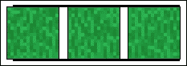
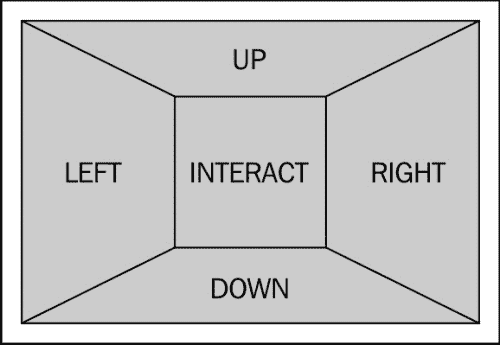
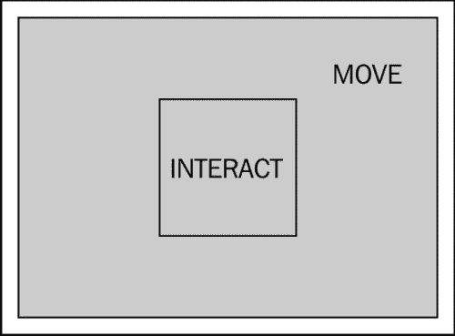
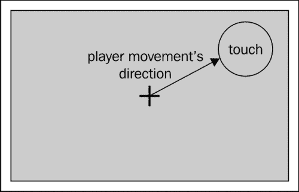
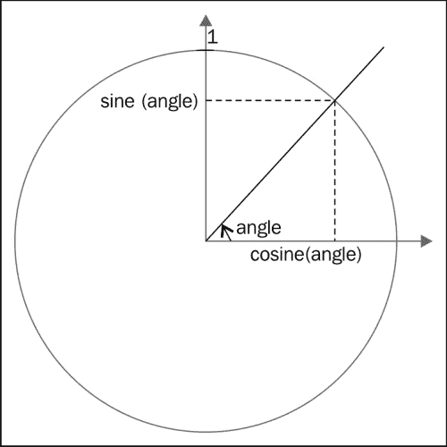
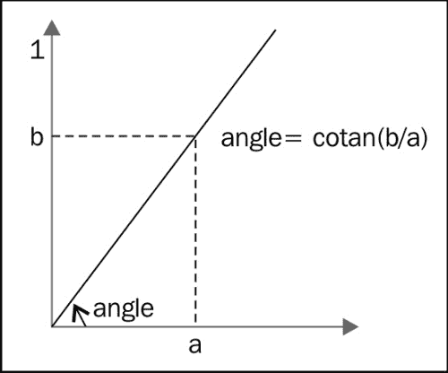
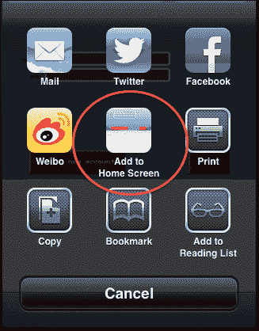
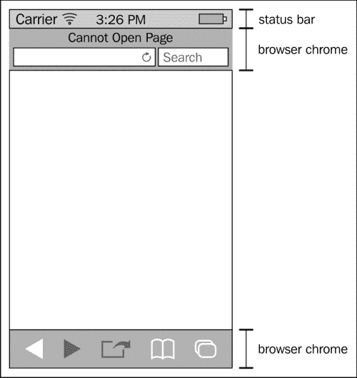
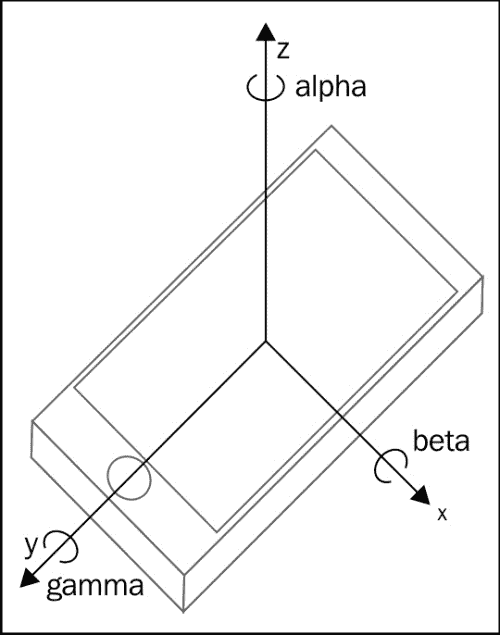

# 第九章：制作您的游戏移动端

移动设备正在迅速成为游戏的首选平台。好消息是，大多数这些设备中的 Web 浏览器都相当不错，在大多数情况下，您可以使您的移动游戏在其上顺利运行。

但是，这些设备具有一些内存和电源限制。目前有一些游戏在移动浏览器上根本无法运行。您不能指望在智能手机上运行和桌面计算机性能只有十分之一的设备上顺畅运行同样数量的精灵。

移动设备的一个优点是，它提供了一些通常在桌面上找不到的功能：

+   多点触摸界面允许您以新的方式与您的游戏互动

+   设备方向 API 允许您以有趣的方式控制您的游戏或 UI。

+   大多数设备允许您的游戏像原生应用一样安装到“springboard”，模糊了浏览器游戏和原生游戏之间的界线。

+   离线缓存允许您的游戏即使在设备上没有活动的互联网连接时也能工作。

在本章中，我们将采取我们的 MMORP 并使其在 iOS 设备上运行。我们将使用的大多数 API 都是事实上的标准，并且也支持 Android。以下是我们将要涵盖的主题的简要概述：

+   处理移动设备的性能限制

+   为我们的游戏添加多点触控控制

+   将我们的游戏与 springboard 和其他移动特定配置集成

+   使用设备方向 API

+   利用 Web 存储和离线应用缓存

我们选择只考虑 iOS 方面的原因有几个：

+   尽管安卓最近赶上了，但 iOS 仍然是全球使用最广泛的移动操作系统（根据来源和什么被认为是移动设备，您会发现 iOS 的市场份额在 30% 到 50% 之间）。

+   即使苹果选择禁止第三方浏览器进入其操作系统在某种程度上引起了争议，但它具有积极的副作用，即使 Web 开发变得更加容易。实际上，您不必在浏览器端处理太多的差异。

+   移动浏览器上可用的大多数特定 API 首先是由苹果在 Webkit 移动端上创建或实现的。

在我们开始之前，我想强调这一点，这是一个比 Web 开发世界其他领域发展得更快的领域。新的 API 定期添加，每个新设备的性能明显优于其替代品。如果您认真考虑制作充分利用移动设备的游戏，您应该投入一些时间来使自己了解这些变化。

# 使您的游戏在移动设备上运行良好

性能问题可能是开发基于浏览器的移动游戏时会遇到的最大问题，主要原因是有各种各样的设备可用，每个设备的功能都非常不同。

即使你选择仅支持 iOS，这可能是目前最简单的生态系统，你仍然会在性能、屏幕分辨率和浏览器支持方面有很大的差异。

为了了解情况的复杂性，可以查看 jQuery Mobile 支持的设备（[`jquerymobile.com/gbs/`](http://jquerymobile.com/gbs/)）。对于你的游戏，你可能应该有一个类似于他们的方法；选择几个设备/软件版本作为目标。你的游戏应该在这些设备上无缝运行。

然后确保游戏在更广泛的设备上无错误运行。在这些设备上，性能可能不理想。最后，明确划定一个线，超过这条线你甚至都不会去测试游戏是否能够运行。

每个类别的大小将取决于你想要投入多少精力。一个问题是你实际上不能使用每个平台 SDK 提供的模拟器来调查性能问题。这意味着最终你将不得不在实际设备上测试你的游戏。

这对于大公司来说不是问题，但如果你是一个小型独立游戏开发者，你可能会发现这是一个限制你支持的设备数量的因素。

## 检测移动浏览器

为了应对桌面和移动设备之间的差异，有许多可能的方法：

1.  只设计一个游戏，专注于移动设备。它也可以在桌面上毫无问题地运行，但可能不像专门为桌面设计的那样美观或复杂。好处是，如果玩家在你的游戏中相互竞争，他们都将处于同一水平。

1.  设计两个游戏，一个优化用于桌面，一个用于移动。这几乎是两倍的工作量，但你可能会共享大部分艺术、音乐和服务器端代码（如果有）。从性能上讲，这是理想的解决方案，但如果你的游戏中有 PvP（玩家对玩家），那么在一个平台上的玩家与其他平台上的玩家相比可能更具优势。

1.  如果游戏在桌面浏览器上运行，你可以只设计一个游戏，但是增加一些纯粹的装饰性功能。通过这种解决方案，你只需要一个代码库，但可能会稍微复杂一些。PvP 游戏的问题仍然存在。

你将选择遵循的方法将取决于你的优先级，但对于第二和第三种方法，你需要检测玩家运行游戏的平台类型。

根据你想要多精确，这可能是一个相当复杂的任务。基本上有两种一般的方法可以使用：客户端检测和服务器端检测。

### 客户端浏览器检测

如果你想要实现之前描述的第三种方法，即在客户端检测浏览器，那么这是非常合理的。最常见的方法是使用`navigator.userAgent`字符串（**UA**简称）。这个变量包含一个非常长和晦涩的字符串，其中包含了大量信息。

需要记住的是浏览器可以伪造这个字符串（这被称为**UA 伪装**）。例如，在 Safari 中，你可以指定它模仿哪个浏览器。好处是移动设备通常不会在用户部分进行某些黑客行为。此外，一些非常不同的移动设备具有相同的 UA，例如桌面和移动版本的 Internet Explorer。

其中很大一部分是出于遗留原因，你真的不应该关心它，但通过查看这个更长字符串中特定字符串的出现，你可以检测到你正在处理的浏览器的类型。例如，如果`userAgent`字符串包含`iPhone`，你就知道浏览器是在 iPhone 上运行的 Safari 移动版。相应的 JavaScript 代码可能如下所示：

```js
if(navigator.userAgent.match(/iPhone/i)){
    // iPhone detected
    // ...
} else {
   // not an iPhone
}
```

现在这对于 iPhone 可能有效，但如果你的用户使用的是 iPad，则不会被检测到。你必须查找字符串`iPad`来检测 iPad。对于 iPod Touch 也是一样，你必须查找`iPod`。如果你想区分 iDevices 和其他设备，你可以这样做：

```js
if(navigator.userAgent.match(/iPhone|iPod|iPad/i){
    // iDevice detected
    // ...
} else {
   // not an iDevice
}
```

如果你希望精确检测各个设备，你应该使用以下代码：

```js
if(navigator.userAgent.match(/iPhone/i)){
  // iPhone detected
} else if(navigator.userAgent.match(/iPad/i)) {
 // iPad detected
} else if(navigator.userAgent.match(/iPod/i)) {
 // iPod touch detected
} else {
   // not an iDevice
}
```

正如你所想象的，如果你想要检测大量设备，这个列表可能很快变得相当长。希望存在着确切完成你目标的代码片段。如果你只想检测移动设备，你可以使用 [`detectmobilebrowsers.com/`](http://detectmobilebrowsers.com/) 提供的脚本。如果你想更精确地控制你要检测的内容，你可以使用由总是出色的 Peter-Paul Koch 提供的脚本，网址为 [`www.quirksmode.org/js/detect.html`](http://www.quirksmode.org/js/detect.html)。

### 服务器端检测

如果你想要实现第二种方法（为移动和桌面浏览器提供不同版本的游戏），你可能会想要在服务器上检测玩家的浏览器，并将他们重定向到游戏的正确版本。与客户端检测一样，最常见的技术使用浏览器的`userAgent`字符串。

如果你使用 PHP，你会很高兴地了解到它几乎支持开箱即用的浏览器检测。实际上，你可以使用 `get_browser` 函数与一个最新的 `php_browscap.ini` 文件结合使用，以获取有关浏览器的信息（你可以在 [`tempdownloads.browserscap.com/`](http://tempdownloads.browserscap.com/) 找到各种版本的此文件）。你将不得不在你的 `php.ini` 文件中配置 `browscap` 属性，将其指向你的 `php_browscap.ini` 文件，以便它被识别。复制我们先前实现的客户端检测的代码将如下所示：

```js
$browser = get_browser(null);

if($browser->platform == "iOS"){
  echo "iOS";
} else {
  echo "not iOS";
}
```

这与客户端实现具有相同的缺点：浏览器可以伪造 `userAgent` 字符串。

### 你真的需要检测浏览器吗？

通常不建议检测浏览器。首选解决方案通常是使用功能检测。例如，如果你想使用设备方向，那么你只需在运行时检查相应的 API 是否可用，这样做真的很有意义。

在这种情况下，这是一种更为健壮的方法，但我们讨论的是对游戏性能的优化。没有可以检测的特性会提供有关这方面的信息。在这种情况下，我认为检测浏览器是有意义的。

更健壮的替代方案是在开始游戏之前运行一个非常快速的基准测试，以推断游戏运行的设备的性能。这将是很多工作，但在可以线性地扩展游戏性能的情况下，这样做可能是值得的。例如，你可以非常精细地定义绘制森林所使用的树的数量，比如，最大树数的 80%。

如果你使用了大量的粒子效果，通常就会出现这种情况。然后，非常容易调整你使用的粒子总数以匹配设备的性能。

## 性能限制 - 内存

现在我们能够检测到游戏在移动设备上运行，我们将能够适应设备的限制。谈论性能时，你脑海中可能首先浮现的是处理器的速度，但大多数情况下，内存是一个更大的限制。

在桌面上，你不再需要考虑内存，大多数情况下（除了避免内存泄漏）。在移动设备上，内存是一种更为有限的资源，有时，仅仅加载一个大图像对浏览器来说就太多了。例如，对于 iDevices，允许的最大图像尺寸如下：

|   | **< 256 MB 的 RAM** | **> 256 MB 的 RAM** |
| --- | --- | --- |
| **GIF、PNG 和 TIFF 图像** | 3 百万像素 | 5 百万像素 |
| **JPEG** | 32 百万像素 | 32 百万像素 |
| **Canvas DOM 元素** | 3 百万像素 | 5 百万像素 |

需要注意的是，这与图像的压缩毫无关系。事实上，尽管压缩图像以减少下载所需的时间对内存印记很重要，但唯一重要的是分辨率。

所以，如果压缩不会有所帮助，我们该怎么办呢？让我们以我们的多人在线角色扮演游戏为例。在那里，我们使用了一个非常大的图像，其中包含我们瓦片地图的所有图块。实际上，我们游戏中创建的地图并未使用许多这些图块。因此，减少这个非常大的图像的一个非常简单的方法是删除我们不需要的所有图块。

这意味着，您不再拥有一个整个游戏都会使用的大图像，而是为每个区域都有一个较小的图像。这将增加代码的复杂性，因为它意味着管理区域之间的过渡，但它有一个优点，即完全不会降低您的级别设计。

在某些情况下，即使使用这种技术，您可能会发现很难将图像的大小减小到足够小。一个简单的解决方案是为桌面和移动平台分别设置两个版本的级别。在移动版本中，您将减少图块的种类。例如，在我们的游戏中，我们使用多个图块来渲染草地，如下图所示：



在这里，我们可以简单地使用一个单一的图块。当然，生成的图形将会变得不那么多样化，但它将大大减少您所需的图块数量。然而，这种做法的缺点是需要您维护每个级别的两个单独版本。

## 性能限制 - 速度

移动设备的性能差异很大，但即使是最快的移动设备也比任何桌面设备都要慢得多。这意味着有些游戏根本无法在移动设备上运行，无论您付出多少努力。然而，有许多游戏可以稍加改造，使其以合理的速度运行。

制作基于 DOM 的游戏时，您可以加快速度的地方并不多。您应该做的第一件事是尝试减少精灵或图块的数量。

### 指定页面的可见区域

减少图块数量的一个非常简单的方法是使游戏区域更小。您可能会认为这是一个非常糟糕的主意，因为您真正想要的是游戏区域填满整个屏幕，这意味着要适应设备的分辨率。好吧，是的...也不是！是的，您希望游戏区域填满整个屏幕，但不，这并不一定意味着使用完整的分辨率。

移动浏览器提供了一个非常方便的`meta`属性，允许您指定浏览器应该如何管理页面宽度。这在这里将非常有用，因为我们基本上可以选择游戏区域的大小，然后强制浏览器将其显示在全屏模式下。

这个属性称为视口，要为屏幕指定一个给定的宽度，您可以简单地写：

```js
<meta name="viewport" content="user-scalable=no, width=480" />
```

我们在这里配置了两种不同的行为。首先，我们告诉浏览器页面的原始宽度为 480 像素。假设设备的原生分辨率为 960 像素；这意味着页面将被放大。如果设备分辨率为 320 像素，页面将被缩小。

我们在这里做的第二件事是禁用用户的缩放功能。如果你想后续使用触摸事件来控制游戏，这是不必要的；为了控制游戏，你要确保用户在尝试操作游戏时不会放大或缩小页面。

### 细节级别

减少精灵的数量可能会很棘手。例如，你不希望减少游戏中的 NPC（非玩家角色）或敌人的数量。识别可以移除的元素是一项繁琐的任务。

以下图片摘自 第五章，*透视*。这是我们为我们的 RPG 使用的瓦片地图的结构的快速提醒。


如果你将这个图中最后两层中纯装饰性的元素保留下来，减少精灵的数量就变得很容易；如果需要，只需删除这两层，就完成了。

这并不一定意味着你必须摆脱所有这些元素。你可以做的是有两个不同版本的这些层，一个有很多元素，一个元素更少。

如果你真的需要进一步减少精灵的数量，你将不得不考虑这将对游戏玩法产生的影响。这里没有标准答案；你将需要针对每个游戏进行独立的处理，并在保持游戏玩法与游戏速度之间找到正确的平衡。

# 触摸控制

到目前为止，我们只谈到了移动设备的问题部分，但是这些设备也带来了一些优势。触摸屏允许非常有趣的游戏机制（而且多点触摸屏效果更好）。

在这一部分，我们将实现两种不同的触摸控制方式，但这确实是一个可以发挥创意、找到新颖而引人入胜的方式让玩家与你的游戏进行交互的领域。重要的是要知道触摸控制的 API 不是标准的，而且移动设备可能会以一些不同的方式实现它。尽管如此，下一节中显示的代码应该可以在 iOS 和最新版本的 Android 上正常工作。

我们将实现的两个界面都基于同样的基本思想：整个屏幕都是一个摇杆，没有可见的 UI 元素被使用。这样做的优势是，用于控制的表面越大，控制就越精确。缺点是，如果用户不是通过简单地看屏幕就能发现它是如何工作的，你就需要解释给用户听。

我们使用的代码可以很容易地调整为适用于放置在屏幕底部/侧边的较小控件。

## 十字键

方向键（缩写为 D-pad）是一种在老式游戏机上使用的控制方式。它提供了几个预定义的方向供用户选择（例如，上、下、左和右）。相比之下，摇杆提供了一个模拟接口，玩家可以选择精确的方向（例如，30 度角度）。我们将要实现的第一个控制方法将屏幕划分为如下图所示的五个区域：



优点在于此方法与键盘控制有一一对应关系。如果玩家触摸**上**区域，它将对应于按下键盘上的上箭头，其他边界区域类似。如果玩家触摸中心区域，它将对应于按下空格键。

要实现这一点，我们将创建五个虚拟键，并扩展检查键盘输入的代码部分以进行检查。下面的代码摘录是定义这些虚拟键的部分：

```js
var UP = {
  on: false,
  id: 0
};
var DOWN = {
  on: false,
  id: 0
};
var LEFT = {
  on: false,
  id: 0
};
var RIGHT ={
  on: false,
  id: 0
};
var INTERACT ={
  on: false,
  id: 0
};
```

如您所见，这些键具有 ID 字段。这是必要的，因为我们正在处理多点触摸事件，我们必须能够识别哪些触摸事件结束时将`on`字段切换回`false`，玩家抬起手指时。

为了检测玩家触摸屏幕，我们将注册一个`touchstart`事件处理程序。这个事件类似于`onmousedown`事件，除了它包含一个触摸列表。这是有道理的，因为我们正在处理多点触摸输入，我们不能简单地假设只有一个手指触摸屏幕。

所有这些触摸都存储在`event.changedTouches`数组中。在您的事件处理程序中，您只需查看每个触摸。下面的代码摘录是整个事件处理程序：

```js
document.addEventListener('touchstart', function(e) {
  if(gameStarted){
    e.preventDefault();
 for (var i = 0; i < e.changedTouches.length; i++){
      var touch = e.changedTouches[i]

       var x = touch.pageX - 480 / 2;
       var y = touch.pageY - 320 / 2;

       if (Math.abs(x) < 20 && Math.abs(y) < 20){
         INTERACT.on = true;
         INTERACT.id = touch.identifier;

       } else if (Math.abs(x) > 480 / 320 *  Math.abs(y)) {
         // left or right
         if(x > 0){
           RIGHT.on = true;
           RIGHT.id = touch.identifier;
         } else {
           LEFT.on = true;
           LEFT.id = touch.identifier;
         }
       } else {
         // up or down
         if(y > 0){
           DOWN.on = true;
           DOWN.id = touch.identifier;
         } else {
           UP.on = true;
           UP.id = touch.identifier;
         }
       }
     }
    }
}, false);
```

由于"jQuery 核心"不支持触摸事件，我们使用标准方法来注册事件处理程序。然后我们阻止事件冒泡，以确保它们不会产生缩放、滚动等。此事件处理程序的最后一部分检查每个触摸，以确定它在哪个区域，将相应按键的`on`标志切换为`true`，并设置正确的`id`值以进行跟踪。

现在我们需要能够检测触摸何时结束。这通过`touchend`事件完成。这个事件的工作方式类似于`touchstart`，事件处理程序的代码结构相同。在这里，我们不需要担心触摸的位置，而只需要关注其 ID。然后，我们将相应触摸的`on`标志切换回`false`。

```js
document.addEventListener('touchend', function(e) {
  if(gameStarted){
    e.preventDefault();

    for (var i = 0; i < e.changedTouches.length; i++){
        var touch = e.changedTouches[i]
        if (touch.identifier === UP.id){
         UP.on = false;
        } 
        if (touch.identifier === LEFT.id){
         LEFT.on = false;
        }
        if (touch.identifier === RIGHT.id){
         RIGHT.on = false;
        }
        if (touch.identifier === DOWN.id){
         DOWN.on = false;
        }
        if (touch.identifier === INTERACT.id){
         INTERACT.on = false;
        }
     }
  }
}, false);
```

现在我们的虚拟键持有正确的值，我们可以像使用保存真实键状态的数组一样在我们的代码中使用它们。下面的代码正是如此；修改部分已经突出显示：

```js
var gameLoop = function() {
    var idle = true;

    if(gf.keyboard[37] || LEFT.on){ //left arrow
        player.left();
     idle = false;
    }
    if(gf.keyboard[38] || UP.on){ //up arrow
     player.up();
     idle = false;
    }
    if(gf.keyboard[39] || RIGHT.on){ //right arrow
        player.right();
        idle = false;
    }
    if(gf.keyboard[40] || DOWN.on){ //down arrow
     player.down();
     idle = false;
    }
    if(gf.keyboard[32] || INTERACT.on){ //space
        player.strike();
        idle = false;
    }
    if(idle){
        player.idle();
    }

    // ...
};
```

通过这些简单的修改，我们已经实现了我们的触摸控制的第一个版本。

## 模拟摇杆

之前的控制方法不错，但您可能想要让玩家以更自然的方式移动角色。这就是下面的方法发挥作用的地方。这里，我们只有两个区域：中心的一个小区域，它的作用类似于空格键，以及屏幕的其余部分。下图显示了这两个区域：



如果玩家触摸这个更大的区域，角色将朝触摸的方向移动。如果玩家的手指改变方向，角色的移动也会相应改变，如下图所示：



要实现这一点，我们稍微改变了玩家控制的方式，因此我们在`player`对象中添加了一个新方法：`direction`。该函数接受以度为单位的角度，并推断出最合适的动画，以及玩家的新位置。下面的代码显示了这个函数：

```js
this.move = function(angle){
  if(state !== "strike"){
 var xratio = Math.cos(angle);
 var yratio = Math.sin(angle);
    if(Math.abs(xratio) > Math.abs(yratio)){
      if(xratio < 0){
        this.left();
      } else {
        this.right();
      }
    } else {
      if (yratio < 0){
        this.up();
      } else {
        this.down();
      }
    }
 moveX = 3*xratio;
 moveY = 3*yratio;
    }
};
```

这里只有一小段代码值得指出，如前面的片段所示。要从角度计算垂直和水平移动，我们使用正弦和余弦函数。它们的含义在下图中解释：



这两个函数将给我们一个介于-1 和 1 之间的数字，表示玩家应该沿每个轴移动多少。然后我们简单地将这个数乘以最大移动量（在我们的例子中为 3）来获得沿每个轴的实际移动。

我们不需要支持玩家尝试使用键盘和触摸屏控制游戏的情况，因为这种情况是非常不可能发生的。

### 事件处理程序

现在我们将使用一种与之前使用的虚拟键类似的模式，这里我们只会有两个。一个将与以前相同：交互键。第二个有点特殊，因为它将用于存储角度，该角度是角色应该移动的方向。

`touchstart` 事件处理程序与之前几乎相同，只是我们计算了触摸点和屏幕中心之间的角度：

```js
document.addEventListener('touchstart', function(e) {
  if(gameStarted){
     for (var i = 0; i < e.changedTouches.length; i++){
       var touch = e.changedTouches[i];
       var x = touch.pageX - 480 / 2;
         var y = touch.pageY - 320 / 2;
       var radius = Math.sqrt(Math.pow(x,2)+Math.pow(y,2));

       if(radius < 30) {
         INTERACT.on = true;
         INTERACT.id = touch.identifier;
       } else if(!MOVE.on){
         MOVE.on = true;
         MOVE.id = touch.identifier;
         MOVE.angle = Math.atan2(y,x);
       }
     }
    }
}, false);
```

为此，我们使用另一个三角函数：余切。这个函数允许我们检索右角三角形的两条边之间的角度，如下图所示：



`touchend` 处理程序与之前的处理程序相同，但适用于两个虚拟键。

```js
document.addEventListener('touchend', function(e) {
  if(gameStarted){
     for (var i = 0; i < e.changedTouches.length; i++){
       var touch = e.changedTouches[i]
        if (touch.identifier === INTERACT.id){
         INTERACT.on = false;
        }
       if (touch.identifier === MOVE.id){
         MOVE.on = false;
        } 
     }
    }
}, false);
```

我们需要第三个事件处理程序来跟踪手指在触摸开始和结束之间的移动。此处理程序的结构与`touchend`的结构类似，但更新了`MOVE`虚拟键的角度：

```js
document.addEventListener('touchmove', function(e) {
  if(gameStarted){
    e.preventDefault();
     for (var i = 0; i < e.changedTouches.length; i++){
       var touch = e.changedTouches[i];
       if (touch.identifier === MOVE.id){
         var x = touch.pageX - 480 / 2;
         var y = touch.pageY - 320 / 2;
         MOVE.angle = Math.atan2(y,x);
        } 
     }
    }
}, false);
```

通过这三个事件处理程序，我们实现了新的控制界面。您真的必须尝试它们，看看哪种方法更适合您。这些方法实际上只是许多其他方法中的两种，选择合适的方法将对您的游戏在移动设备上的成功产生重大影响，因此在选择最终方法之前，请毫不犹豫地尝试很多方法！

# 将我们的游戏与主屏幕集成

有一种非常优雅的方法可以使您的游戏在 iOS 上全屏运行。通过适当的配置，我们可以使您的游戏可安装到 SpringBoard 上。这将产生几个效果：游戏将在没有任何浏览器 UI 元素的情况下运行，并且将具有一个图标和一个启动画面。

所有这些都是通过在文档标头中设置一系列`meta`标签来完成的。

## 使您的游戏可安装

要使您的游戏可安装，您必须在文档头部使用`apple-mobile-web-app-capable` `meta`标签，并将值设置为`yes`。一旦完成这个步骤，玩家就可以从 Safari 将游戏添加到 SpringBoard，如下面的截图所示：



您应该在标头中拥有的代码如下所示：

```js
<meta name="apple-mobile-web-app-capable" content="yes" />
```

以这种方式安装的网页将在没有任何可见浏览器 UI 元素（也称为 Chrome）的情况下运行。以下图列出了所有 UI 元素的名称：



遗憾的是，在撰写本文时，这个属性在安卓手机上的支持并不好。其中一些手机会将网页安装到主屏幕并使用自定义图标，但不接受无 Chrome 模式。其他手机将完全忽略它。 

## 配置状态栏

一旦从 SpringBoard 启动，唯一剩下的 UI 元素就是状态栏。如前面的图所示，它是屏幕顶部的栏，显示诸如网络接收和名称以及剩余电量等信息。

您可以选择状态栏的外观，使其尽可能地适合您的应用程序。这可以通过`apple-mobile-web-app-status-bar-style` `meta`标签完成。

以下列表列出了您可以为此标签指定的可能值及其相应的效果：

+   `default`：如果您不使用这个`meta`标签或给它赋予这个值，则将状态栏的外观选择留给操作系统。

+   `black`: 使用这个值，状态栏将具有黑色背景和白色文本。

+   `black-translucent`: 使用这个值，状态栏将具有略带透明的黑色背景和白色文本。这个设置的特殊之处在于网页将被渲染在状态栏下面。这样做的好处是为游戏提供完整的设备分辨率；而使用其他设置，网页将在屏幕顶部丢失一些像素。

您应该在标头中拥有的代码如下所示：

```js
<meta name="apple-mobile-web-app-status-bar-style" content="black-translucent" />
```

## 指定应用程序图标

如果您没有指定任何内容，iOS 将使用网页的屏幕截图作为图标。如果您想指定一个要替代使用的图标，则需要使用一个或多个`link`标签。问题在于不同的 iDevices 需要不同大小的图标。解决方案是在`link`标签中指定图标的大小，如下所示：

```js
<link rel="apple-touch-icon" sizes="72x72" href="icon.png" />
```

可能的尺寸是：57 x 57、72 x 72、114 x 114 和 144 x 144。您使用此标签指定的图标将被覆盖上一种光泽效果。如果您希望您的图标原样使用，可以改用`rel`标签`apple-touch-icon-precomposed`。

## 指定闪屏

当用户启动游戏时，页面加载期间将显示一个屏幕截图。如果您希望指定一张图像，可以使用一个带有`rel`标签`apple-touch-startup-image`的`link`标签。

我们将遇到与图标相同的问题：每个设备都有另一个屏幕分辨率，应该使用相应的图像。但是，用于指定图像分辨率的方法与图标的方法不同。在这里，您需要使用`media`属性。

使用`media`属性，您可以使用`device-width`指定设备宽度，使用`orientation`指定设备方向，使用`-webkit-device-pixel-ratio`指定设备是否使用视网膜显示。完整的示例如下：

```js
<link href="startup-image.png" media="(device-width: 320px) and (orientation: portrait) and (-webkit-device-pixel-ratio: 2)" rel="apple-touch-startup-image">
```

# 使用设备方向

在某些情况下，访问设备方向可能很有用。例如，您可以使用它来控制角色的移动。要做到这一点，您可以简单地注册一个事件处理程序，每当设备方向更改时就会收到一个事件。以下代码正是如此：

```js
if(window.DeviceOrientationEvent) {
  window.addEventListener("deviceorientation", function(event){
    var alpha = event.alpha;
     var beta = event.beta;
     var gamma = event.gamma;
     // do something with the orientation
  }, false);
}
```

第一个`if`语句是用来检查设备是否支持设备方向 API 的。然后我们注册一个事件处理程序来访问设备的方向。这个方向由三个角度提供：`alpha`是绕 z 轴的旋转，`beta`是绕 x 轴的旋转，而`gamma`是绕 y 轴的旋转。

您已经知道 x 和 y 轴是什么；它们与我们用来定位游戏元素的轴相同。z 轴是一个指向玩家的屏幕外的轴。

以下图显示了这些轴及其相应的角度：



# 使用离线应用程序缓存

移动设备的一个非常有用的功能是网页可以脱机工作。对于我们之前创建的平台游戏，这意味着一旦安装，您就再也不需要网络连接来加载游戏资产了。

要启用离线模式，您需要创建一个名为清单的文件。清单是游戏所需的所有文件的列表。它们将在春板上安装游戏时在设备上本地存储。

此清单的格式如下：

```js
CACHE MANIFEST

CACHE:
tilesheet.png
level.json
gameFramework.js
rpg.js
jquery.js

NETWORK:
*
```

`CACHE`部分列出了所有要本地存储的文件。`NETWORK`部分列出了当应用程序在线时可访问的所有外部资源。如果您不想限制网络访问，可以像前面的示例中一样简单地写`*`。

要将清单链接到您的游戏中，您将使用以下属性为您的`html`标记：

```js
<html manifest="pathto/manifestFiles">
```

清单必须由服务器以 MIME 类型`text/cache-manifest`提供。

你必须意识到，一旦使用这样一个清单安装了应用程序，即使服务器上的应用程序发生了变化，游戏文件也不会被更新。强制刷新资源的唯一方法是更改清单本身。如果你不真的需要更改清单，你可以简单地在注释中写上版本号或时间戳；这就足够触发刷新。

另一种可能性是在静态媒体中添加版本号。这将有助于避免 iOS 中静态文件未能正确刷新的一些错误。

# 使用 Web 存储

然而，在一些情况下，你的应用程序需要将信息传输到服务器，例如，当玩家获得高分时。如果此刻游戏正在离线模式下运行，你该怎么办？

解决方案是使用 Web 存储。我们不会详细介绍你可以用 Web 存储做什么，但基本思想是在本地存储所有你想发送到服务器的信息，并在游戏再次在线时传输它。这项技术是 HTML5 规范的一部分，因此只有现代浏览器支持。你可以用它来保存数据的可用空间为 5MB，所以你必须明智地使用它。

要在客户端存储任何值，你可以简单地使用`sessionStorage`对象的`setItem`方法。要检索该值，你可以使用`getItem`方法。

以下代码正是显示这一点：

```js
sessionStorage.setItem('key','value');
sessionStorage.getItem('key');
```

现在，如果你想检查游戏是否在线，你可以使用`navigator`对象上的`onLine`标志，如下所示：

```js
if(navigator.onLine){
  // push data to the server
}
```

对于我们的 RPG 游戏来说，你可能希望在本地存储玩家位置和其击败的敌人，并在 Internet 连接恢复后将它们推送到服务器。

# 摘要

在本章中，你已经学习了许多仅适用于移动设备的特定 API 和技术。使用 Web 技术为移动设备编写游戏通常是一个挑战，但会极大地增加你的游戏潜在玩家数量。

甚至可以通过使用 PhoneGap（又名 Apache Cordova）在 App Store 上分发你的游戏。

在下一章中，我们将学习如何将声音和音乐添加到你的游戏中。使用 Web 技术来做这件事情可能有些麻烦，但它绝对是值得的！
