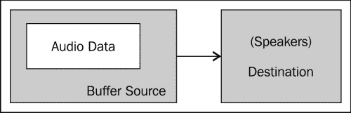
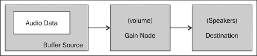
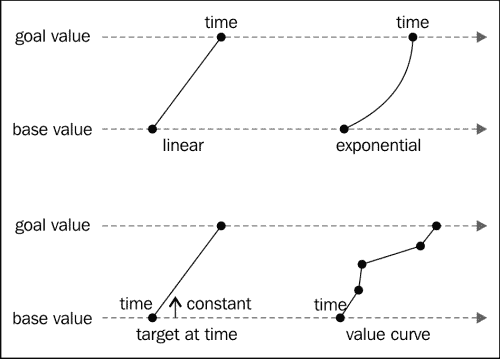
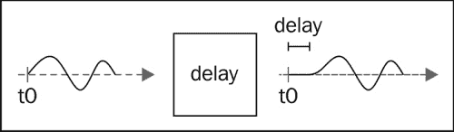
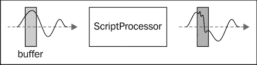
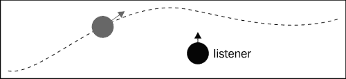
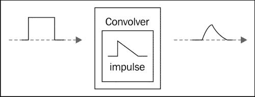
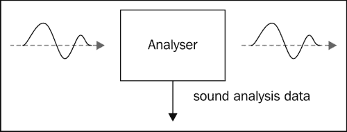
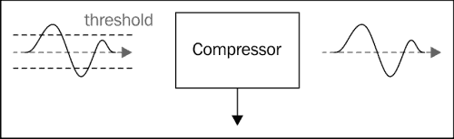

# 第十章：发出一些声音

这是本书的最后一章，但这远非不重要的主题。音乐和音效是游戏用户体验的重要组成部分。合适的音乐可以完全改变关卡的感觉。合适的音效可以帮助玩家理解游戏的机制，或者给予他们在正确的时间执行正确操作所需的反馈。

此外，玩家期望在游戏中有声音，因为自从游戏诞生以来，声音一直存在于游戏中。不幸的是，当涉及到声音时，HTML 游戏存在一些大问题。您不能使用一个强大的解决方案使其能够在所有浏览器上添加声音并使其正常工作。

在本章中，我们将介绍四种不同的技术来为您的游戏添加声音：

+   **嵌入**：这是在页面中包含声音的最古老的方法。在旧时代，它经常用于使页面播放 MIDI 文件作为背景音乐。它不是标准的，不提供一致的 JavaScript API，并且您无法保证支持给定的音频格式。不过，它被几乎所有您可以找到的浏览器支持。

+   **HTML5 音频**：您可以使用`audio`标签来产生声音。积极的一面是，几乎所有的浏览器都支持它。不利之处在于，您将不得不处理每个浏览器支持不同编解码器的事实，而且您将无法操纵声音。

+   **Web 音频 API**：这基本上是围绕 OpenAL 的 JavaScript 封装。这意味着您可以对声音做任何您想做的事情。遗憾的是，目前只有 Chrome 和 Safari（iOS 上也是如此）支持它。

+   **Flash**：可以使用 Flash 来播放声音。这可能看起来像一个奇怪的想法，因为我们在这里制作的是一个 JavaScript 游戏，但您通常可以将其用作旧浏览器的后备方案。

然后我们将看一些有趣的工具，您可以用来为您的游戏生成声音。

# 抽象音频

首先，让我们创建一个非常简单的库来抽象我们的框架与我们选择的音频实现之间的交互。以下代码代表了所有我们的实现都必须遵守的“契约”：

```js
// a sound object
sound = function(){
  // Preloads the sound
  this.preload = function(url){
    // TODO: implement
  };

  // Returns true if the sound is preloaded
  this.isPreloaded = function(){
    // TODO: implement
  }

  // Starts to play the sound. If loop is true the
  // sound will repeat until stopped 
  this.play = function(loop){
    // TODO: implement
  };

  // Stops the sound
  this.stop = function(){
    // TODO: implement
  };
};
```

对于 Web 音频 API 的实现，我们将为我们的对象添加更多的功能，但这是您可能期望的任何音频库的基本功能。

## 使用我们的小型库

要在我们的游戏中使用声音，我们只需将相应的实现链接到我们的 HTML 文件中：

```js
<script type="text/javascript" src="img/sound.js"></script>
```

现在我们将为我们的关卡添加背景音乐；我们需要设置声音并预加载它。我们将通过将`initialize`函数拆分为两个部分来完成此操作：

```js
var initialize = function() {
    // ... 
    backgroundMusic = new sound();
    backgroundMusic.preload("background_music.mp3");
    waitForSound();
}

var waitForSound = function(){
  if (backgroundMusic.isPreloaded()){
    // ...
    backgroundMusic.play(true);
  } else {
    setTimeout(arguments.callee, 100);
  }
}
```

`waitForSound`函数检查声音是否已预加载。如果没有，我们创建一个超时以稍后再次检查其状态（准确地说，100 毫秒后）。正如您所见，一旦声音被预加载，我们就开始了级别并播放声音。现在，我们需要在级别完成时停止声音，如下面的代码所示：

```js
var player = new (function(){
    // ...
    this.update = function () {
        if(status == "dead"){
           // ...
        } else if (status == "finished") {
          backgroundMusic.stop();
          // ...
```

当下一个级别开始时再次启动它：

```js
var gameLoop = function() {
    if(gameState === "level"){
        // ..
    } else if (gameState === "menu") {

      if (gf.keyboard[32]){
        // ..
        backgroundMusic.play(true);
      }
    }
};
```

通过这些修改，如果声音库遵守我们刚刚指定的契约，我们将拥有背景音乐。现在让我们来看看针对此声音库的不同实现。

# 嵌入声音

HTML 具有一种非常方便的方法来将某些内容的阅读委托给插件：`embed`标签。这不是一个标准标签，但所有浏览器都支持它，并且被广泛用于在网站中包含 Flash。

这个相同的 HTML 标签可以用来在网页中包含声音。出于许多原因，这都不是一个理想的解决方案：

+   没有标准的程序化方法来知道浏览器是否支持此功能。

+   没有标准的方式来控制声音播放，因为暴露的 API 取决于用于播放声音的插件。尝试检测加载了哪个插件是可能的，但这个过程并不是非常可靠。此外，为每个可能的插件提供实现将是很多工作。

+   支持的格式取决于已安装的插件，而不仅仅是浏览器。

+   即使声音格式受支持，浏览器也可能要求允许启动插件。只要用户没有接受启动插件，就不会播放任何声音。

可能存在一些情况，其中使用此方法将声音包含到游戏中是合理的，但如果本章其余部分介绍的任何其他技术对您有效，我建议使用那些技术。

## 实施

让我们来看看负责预加载的部分的实现：

```js
// Preloads the sound
this.preload = function(url){
  // Preloading is not supported in a consistant
  // way for embeded sounds so we just save the 
  // URL for later use.
  this.url = url;
};

// Returns true if the sound is preloaded
this.isPreloaded = function(){
  // Since we use no preloading we always return true
  return true;
}
```

使用`embed`标签实现预加载将需要知道用于播放声音的确切插件的知识。遗憾的是，这是不可能的。相反，我们选择创建一个完全通用的实现。作为副作用，我们不能支持预加载。上述代码简单地通过始终返回`true`来绕过预加载。

这造成了一个重大问题：文件只有在您想要播放它时才会开始加载。这意味着在调用`play`函数和播放器听到声音之间会有相当大的延迟。这对背景音乐来说不是什么大问题，但对于音效来说，这个时间几乎是毫无意义的。好的一面是，第二次播放声音时，它很可能已经被缓存，因此延迟应该会减少。

由于我们不想使用任何 JavaScript API 与插件交互，我们只需将`embed`标签注入页面并配置它自动开始播放。

```js
// Starts to play the sound. If loop is true the
// sound will repeat until stopped 
this.play = function(loop){
  var embed = "<embed width='0' height='0' src='";
  embed += this.url;
  embed += "' loop='";
  embed += (loop)? "true" : "false";
  embed += "' autostart='true' />";
  this.obj = $(embed);
  $("body").append(this.obj);
};
```

我们存储生成的标签以便在`stop`方法中删除它：

```js
// Stops the sound
this.stop = function(){
  this.obj.remove();
};
```

这样做的缺点是我们不会重用我们创建的标签。但是，由于您不会在需要创建大量声音的情况下使用此技术，这并不是一个大问题。

## 支持的格式

由于使用`embed`标签支持的格式列表取决于已安装的插件，无法保证某个文件可播放。但是，如果您使用 WAV 和 MIDI，应该是安全的。

如果您选择使用 WAV 文件，请注意，因为在此格式中，音频可以以许多不同的方式进行编码，为了最大限度地提高兼容性，您应该使用未压缩的波形。

# HTML5 音频元素

为了匹配 Flash 的多媒体功能，HTML5 中添加了`video`和`audio`元素。它们都配有相匹配的 JavaScript API，允许您使用 JavaScript 创建和操作视频或音频，而无需编写到文档中（就像`Image`对象允许您加载图像而无需使用`img`标签一样）。

首先，让我们快速看一下`audio`标签的外观：

```js
<audio>
   <source src="img/backgroundMusic.ogg" type='audio/ogg; codecs="vorbis"'>
   <source src="img/backgroundMusic.mp3" type='audio/mpeg; codecs="mp3"'>
</audio>
```

正如您在这里所看到的，可以为`audio`标签提供多个来源。这是为了绕过此 API 的最大问题：文件格式的兼容性。事实上，即使所有现代浏览器都支持`audio`元素，也没有一种单一的音频格式可供您使用，所有这些浏览器都能识别。解决方法是提供多种格式。

这远非理想，因为它将强迫您在服务器上维护多个版本的音频文件。以下表格显示了现有音频格式与当前浏览器版本的兼容性：

|   | **MP3** | **AAC** | **WAV** | **Ogg Vorbis** |
| --- | --- | --- | --- | --- |
| **Chrome** | ✓ |   | ✓ | ✓ |
| **Firefox** |   |   | ✓ | ✓ |
| **Internet Explorer** | ✓ | ✓ |   |   |
| **Opera** |   |   | ✓ | ✓ |
| **Safari** | ✓ | ✓ | ✓ |   |

这意味着如果您希望支持所有浏览器，您将至少需要提供两种文件格式。一致的意见是您应该选择 MP3 和 Ogg Vorbis（以`.ogg`结尾的音频文件）。

对于游戏，您通常不会使用 HTML 标签，而是直接使用 JavaScript API 进行工作。在我们开始之前，有一个小警告：尽管此标准的规范尚未最终确定，但大多数现代浏览器对此功能的支持相当好。由于标准在过去几年中发生了变化，某些较旧版本的当前浏览器可能具有略有不同的实现。

让我们看看如何在 JavaScript 中创建一个`audio`元素：

```js
var audio = new Audio();
```

要了解浏览器可以使用 JavaScript 播放的格式，您可以使用`canPlayType`方法。基本用法将是：

```js
var canPlay = audio.canPlayType('audio/ogg; codecs="vorbis"');
```

问题出现在此函数返回的可能值："probably"、"maybe"、"no"和""。这可能远不如你期望的那样，但有一个非常好的理由：取决于格式，解码器在访问文件本身之前并不总是能确定是否支持它。这些值的含义如下：

+   `"probably"`: 几乎可以确定是“是”！浏览器知道文件类型，并且相当确定它可以解码几乎所有这种类型的文件。

+   `"maybe"`: 浏览器知道文件格式，但也知道不支持它的所有变体。另一个原因可能是浏览器将该文件的读取委托给插件，并且无法确定插件能处理这个特定的文件。

+   `""`: 浏览器对这种文件类型一无所知，也不会将阅读委派给插件。通过这个响应，你可以安全地假设这个文件不会被播放。

+   `"no"`: 这与`""`相同；一些早期的标准实现使用了它。如果你想要支持更旧的浏览器，也应该期望这个响应。

有了这些知识，模仿我们之前看到的 HTML 代码的行为，你可以做像这样的事情：

```js
var audio = new Audio();
var canPlayOggVorbis = audio.canPlayType('audio/ogg; codecs="vorbis"');
var canPlayMP3 = audio.canPlayType('audio/mpeg; codecs="mp3"');
if (canPlayOggVorbis == "probably" || (canPlayOggVorbis == "maybe" && canPlayMP3 != "probably")) {
  sound.ext = ".ogg";
} else {
  sound.ext = ".mp3";
} 
```

这给了 Ogg Vorbis 优先权，但在“可能”和“或许”之间更倾向于“可能”，因此如果浏览器可能只能*或许*播放 Ogg Vorbis，但认为可以*可能*播放 MP3，我们将加载文件的 MP3 版本。

## 预加载声音

与`embed`标签相比，`audio`元素提供了管理声音预加载的方法，通过`audio`元素的`readyState`属性来完成。它有很多可能的值：

+   `HAVE_NOTHING`: 要么文件无法访问，要么到目前为止根本没有加载任何数据；可能是前者。这个状态对应的数字值是 `0`。

+   `HAVE_METADATA`: 文件的开头部分已经预加载；这已经足够解析声音的元数据部分。有了这些数据，可以解析声音的持续时间。这个状态对应的数字值是 `1`。

+   `HAVE_CURRENT_DATA`: 声音已经加载到当前播放位置，但还不足以继续播放。最有可能是由于播放位置是文件的结尾，因为通常情况下，状态转换非常快速到下面的文件。这个状态对应的数字值是 `2`。

+   `HAVE_FUTURE_DATA`: 音频已经预加载足够，可以从给定的播放位置开始播放剩余的文件，但是不能保证播放不会很快停止以允许更多缓冲。这个状态对应的数字值是 `3`。

+   `HAVE_ENOUGH_DATA`: 足够的声音已经预加载，所以声音应该在完全不中断的情况下播放（这是基于播放速率和下载速度的估计）。这个状态对应的数字值是 `4`。

对于我们的实现，我们将只考虑在 `HAVE_ENOUGH_DATA` 状态下预加载的声音。让我们看看我们小型库的预加载实现：

```js
// a sound object
sound = function(){

  // Preloads the sound
  this.preload = function(url){
    this.audio = new Audio();
    this.audio.preload = "auto";
    this.audio.src = url + sound.ext;
    this.audio.load();
  };

  // Returns true if the sound is preloaded
  this.isPreloaded = function(){
    return (this.audio.readyState == 4)
  }

  // ..
};

(function(){
 var audio = new Audio();
 var canPlayOggVorbis = audio.canPlayType('audio/ogg; codecs="vorbis"');
 var canPlayMP3 = audio.canPlayType('audio/mpeg; codecs="mp3"');
 if (canPlayOggVorbis == "probably" || (canPlayOggVorbis == "maybe" && canPlayMP3 != "probably")) {
 sound.ext = ".ogg";
 } else {
 sound.ext = ".mp3";
 }
})();

```

在前面的代码中有两部分；我们已经看到了突出显示的部分——它用于确定支持的声音格式。它被包装在一个只执行一次的函数中，并将支持的格式存储在 `sound` 对象中作为对象变量。

其余的代码是预加载的实现。首先我们创建一个 `audio` 对象。然后我们将预加载模式设置为 `auto`。这告诉浏览器它可以从文件中下载尽可能多的内容。之后，我们指向我们文件的正确版本。在这里，你可以看到 `src` 参数预计会省略扩展名，以便函数选择正确的版本。

最后，我们调用 `load` 函数。对于一些实现来说，这是必要的，才能开始加载文件。我们只有在 `readyState` 属性的值为 `HAVE_ENOUGH_DATA` 时才会考虑声音预加载。

## 播放和停止声音

控制播放很容易。让我们先看看我们的实现：

```js
// Starts to play the sound. If loop is true the
// sound will repeat until stopped 
this.play = function(loop){
  if (this.audio.lopp === undefined){
    this.audio.addEventListener('ended', function() {
        this.currentTime = 0;
        this.play();
    }, false);
  } else {
    this.audio.loop = loop;
  }
  this.audio.play();
};

// Stops the sound
this.stop = function(){
  this.audio.pause();
 this.audio.currentTime = 0;
};
```

`play` 部分的实现非常直接。然而，一些旧版本的浏览器不支持 `loop` 属性。对于这些情况，我们需要手动循环。为了实现这一点，我们注册一个事件处理程序，当声音播放到结束时将被调用。这个事件处理程序简单地将声音倒回并再次播放。

正如你所看到的，`audio` 元素没有 `stop` 函数，但是有一个 `pause` 函数。这意味着如果我们在 `pause` 函数之后再次调用 `start`，声音将继续从原来的位置播放，而不会从头开始。为了倒带声音，我们将当前时间设置为 `0`，这意味着“从头开始”。

有一个 `pause` 函数可能会很方便，所以我们将在我们的库中添加一个。

```js
// Pauses the sound
this.pause = function(loop){
  this.audio.pause();
};
```

现在你可能会认为这是一个相当好的解决方案，在大多数情况下，确实如此。然而，它还是存在一些问题；你不能在很大程度上操作声音，除了改变它的播放速度之外。效果、声道平移（控制声音在可用输出通道中的分配）等都不可能实现。此外，在某些设备上（主要是移动设备），你不能同时播放两个声音。大多数情况下，这是由于硬件限制，但结果是你不能同时拥有背景音乐和音效。如果你想在 iOS 上使用这个 API，你必须知道你只能在用户生成的事件响应中开始播放声音。

# Web 音频 API

Web Audio API 的目标是给 JavaScript 开发人员基本上与编写本机应用程序时所用工具相同的工具。它复制了 OpenAL 的功能，OpenAL 是一种非常广泛使用的游戏开发 API。而且它是一个标准 API。不幸的是，目前它只在基于 Webkit 的浏览器上实现，包括 iOS 6 的移动版本。

在制定这一标准之前，Mozilla 在 Firefox 中添加了一个类似的 API，称为 Audio Data，并正在努力迁移到 Web Audio API。它可能会在 2013 年底之前的稳定版本中提供。至于 Internet Explorer，目前尚未公布任何信息。如果你想在 Firefox 中使用 Web Audio API，现在可以使用 `audionode.js` 库 ([`github.com/corbanbrook/audionode.js`](https://github.com/corbanbrook/audionode.js))，但它并不完整，并且多年未更新。然而，如果你只是简单使用，它可能会起到作用！

这个 API 不仅提供了播放声音的方法，而且提供了生成声音效果的完整堆栈。这会导致 API 稍微复杂一些。

## 基本用法

Web Audio API 的理念是你连接节点以将声音路由到扬声器。你可以想象这些节点是真实的设备，比如放大器、均衡器、效果器或 CD 播放器。所有这些都是通过音频上下文（Audio context）完成的。它是一个实例化的对象，但你一次只能有一个实例。

让我们从一个非常基本的例子开始，将 MP3 源连接到扬声器，如下图所示：



要创建一个 MP3 源，你首先需要加载声音。这是通过异步 XML HTTP 请求完成的。一旦完成，我们就有了一个编码为 MP3 的文件，我们需要对其进行解码以获得描述声波的字节并将其存储到缓冲区中：

```js
var soundBuffer = null;
var context = new webkitAudioContext();

var request = new XMLHttpRequest();

request.open('GET', url, true);
request.responseType = 'arraybuffer';

// Decode asynchronously
request.onload = function() {
  context.decodeAudioData(request.response, function(buffer) {
    soundBuffer = buffer;
  }, onError);
}
request.send();

var context = new webkitAudioContext();
```

此时，`soundBuffer` 对象保存了解码后的声音数据。然后我们需要创建一个源节点并将其连接到缓冲区。比喻地说，这就像把 CD 放入 CD 播放器中一样：

```js
var source = context.createBufferSource();
source.buffer = buffer;
```

最后，我们需要将源连接到扬声器：

```js
source.connect(context.destination);
```

这就像将我们的 CD 播放器连接到耳机或扬声器一样。此时，你听不到任何声音，因为我们还没有播放声音。要做到这一点，我们可以写下以下内容：

```js
source.start(0);
```

如果这个方法的名称最近更改为更容易理解，它以前称为 `noteOn`，所以你可能也想支持这个，因为这个更改是相当近期的，一些浏览器可能仍然实现了旧的名称。如果你想停止播放，你将调用 `stop` （或它的新名称 `noteOff`）。你可能想知道为什么我们需要向这个函数传递一个参数。因为这个 API 允许你以非常精确的方式同步音频，以便做任何你想做的事情（另一个声音或视觉效果）。你传递的值是声音应该开始播放（或停止）的时刻。这个值以秒为单位给出。

根据我们到目前为止所见到的，我们已经可以实现我们的小型库了，所以在我们看更复杂的用法之前，让我们先这样做吧：

```js
sound = function(){
  this.preloaded = false;

  // Preloads the sound
  this.preload = function(url){
    var request = new XMLHttpRequest();
    request.open('GET', url, true);
    request.responseType = 'arraybuffer';

    // Decode asynchronously
    var that = this;
    request.onload = function() {
      sound.context.decodeAudioData(request.response, function(buffer) {
        that.soundBuffer = buffer;
        that.preloaded = true;
      });
    }
    request.send();
  };

  // Returns true if the sound is preloaded
  this.isPreloaded = function(){
    return this.preloaded;
  }

  // Starts to play the sound. If loop is true the
  // sound will repeat until stopped 
  this.play = function(loop){
    this.source = sound.context.createBufferSource();
 this.source.buffer = this.soundBuffer;
    this.source.connect(sound.context.destination);
    this.source.loop = true;
    this.source.start(0);
  };

  // Stops the sound
  this.stop = function(){
    this.source.stop(0);
  };
};

sound.context = new webkitAudioContext();
```

这里没有什么新的，除了 `play` 和 `stop` 函数只能被调用一次。这意味着你每次想播放声音时都必须创建一个新的 `bufferSource` 对象。

## 连接更多节点

让我们向我们的上下文添加一个新的节点：一个 `gain` 节点。这个节点允许你改变你的声音的音量。这个声音的真实版本将是一个放大器。下图显示了我们的节点将如何连接：



首先让我们创建节点：

```js
var gainNode = context.createGainNode();
```

然后我们将我们的源连接到节点输入，将扬声器连接到节点输出：

```js
source.connect(gainNode);
gainNode.connect(context.destination);
```

完成这件事之后，我们可以通过改变 `gain.value` 属性的值来修改音量，如下所示：

```js
gainNode.gain.value = 0.8;
```

`gain` 参数是一种叫做 `AudioParams` 的东西。它是你会在许多节点中找到的一个参数，它拥有一系列函数，允许你不仅立即操纵一个值，还可以使它随着时间而改变。以下是你可以在这个对象上调用的函数：

+   `setValueAtTime(value,` `time)`: 这将在指定的时间改变值。时间是以秒为单位的绝对时间，就像 `start` 函数一样。

+   `linearRampToValueAtTime(value, time)`: 这将使当前值在提供的时间内线性变化，直到达到指定的值。

+   `exponentialRampToValueAtTime(value, time)`: 这将使当前值从提供的时间到达指定值的时间内呈指数变化。

+   `setTargetAtTime(target, time, constant)`: 这将使当前值以恒定速率从给定时间接近目标值。

+   `setValueCurveAtTime(valuesArray, time, duration)`: 这将使值在提供的时间段内，根据提供的数组中的所有值进行过渡。

+   `cancelScheduledValues(time)`: 这将取消从给定时间开始的所有预定值变化。

以下图示例显示了这些函数的示例：



所有这些函数都可以设置成一个接一个地链式调用。它们之间的精确互动方式有时可能很复杂，一些过渡会产生错误。有关更多详细信息，请参阅规范。

## 加载多个声音

这个声音只是你可以用来创建声音图的众多可用节点中的一个。你可以随意组合它们，当然，也可以将多个源连接到你的`context.destination`对象上。如果你想使用多个声音，你会想要一次性预加载它们。

你可以使用我们之前看到的 API 来做到这一点，但是在 Web 音频中，通过使用`BufferLoader`，可以直接实现这一点。以下代码显示了这是如何工作的：

```js
bufferLoader = new BufferLoader(
  context,
  [
    'sound1.mp3',
    'sound2.mp3'
  ],
  function(bufferList){
    // bufferList is an array of buffer
  }
);
bufferLoader.load();
```

当声音被缓冲时，回调将被执行，就像前面示例中的`onload`回调一样。

## 那么多节点，时间太少

这个 API 提供了相当多的效果节点；现在让我们快速概述一下这些节点。这个列表来自规范（[`www.w3.org/TR/webaudio/`](http://www.w3.org/TR/webaudio/)）。请记住，规范仍在发展中，实现并不总是完整的或与规范保持最新。

### 延迟节点

**延迟**节点只会延迟传入的声音。它只有一个参数，表示声音应该延迟多长时间。



### 脚本处理器节点

这个节点是一个通用的节点，允许你用 JavaScript 编写自己的效果。它有两个参数：

+   `bufferSize`：这定义了缓冲区的大小，它必须是以下值之一：256、512、1024、2048、4096、8192 或 16384。缓冲区是你的 JavaScript 函数将要处理的声音的部分。

+   `onaudioprocess`：这是将修改你的声音的函数。它将接收一个事件作为参数，具有以下属性：调用它的节点、输入缓冲区和从缓冲区播放音频的时间。函数将不得不将声音写入事件的输出缓冲区。



### 定位器节点

这个节点将允许你在 3D 环境中对声音进行空间化处理。你可以使用`setPosition`、`setOrientation`和`setVelocity`函数定义声源的空间属性。要修改听者的空间属性，你将不得不访问`context.listener`对象并使用相同的函数。

你可以在这个节点上设置许多模式参数来微调空间化的方式，但是你需要查看规范以获取详细信息。



### 卷积节点

这个节点创建一个**卷积器**效果（[`en.wikipedia.org/wiki/Convolution`](http://en.wikipedia.org/wiki/Convolution)）。它接受两个参数：保存用作卷积的声波的缓冲区和一个布尔值，指定效果是否应该被归一化。



### 分析节点

此节点根本不改变声音；相反，它可以用于进行频率和时域分析。



### 动态压缩器节点

此节点实现了一个压缩器效果。您可以使用以下参数配置效果：**threshold**，**knee**，**ratio**，**reduction**，**attack**和**release**。



### 双二次滤波器节点

此节点可用于应用一系列低阶滤波器。要指定使用哪一个，您可以使用节点的 `type` 属性将其分配给以下值之一：`lowpass`，`highpass`，`bandpass`，`lowshelf`，`highshelf`，`peaking`，`notch` 和 `allpass`。您可以通过设置节点的一些属性来配置所选择的效果。有关详细信息，您可以查看规格。

### WaveShaper 节点

此节点实现了一个波形整形器效果（[`en.wikipedia.org/wiki/Waveshaper`](http://en.wikipedia.org/wiki/Waveshaper)），由节点的曲线属性中提供的整形函数数组定义。

# Flash 回退

这可能听起来很奇怪，但有几种情况下您可能希望使用 Flash 进行声音处理。例如，您可能已经使用 HTML 设计了一个简单的游戏，因为您想同时面向 iOS 设备和台式机。但是您还希望旧版浏览器（如 IE 6）也具有声音。或者您希望仅使用 MP3 并为不支持 Flash 的设备提供 Flash。这些是一些情况，在这些情况下，如果不支持 HTML5 Audio 元素，则可能希望使用 Flash。

有一些库可以使您抽象化此过程；我们将详细查看其中之一——SoundManager 2——然后快速概述一些可用的替代方案。

## SoundManager 2

要使用 SoundManager 2（[`www.schillmania.com/projects/soundmanager2/`](http://www.schillmania.com/projects/soundmanager2/)），您只需要在页面上包含一小段 JavaScript 代码，并提供指向 Flash 文件的链接（在同一服务器上托管以遵守同一来源策略）。让我们快速看一下预加载的实现将会是什么样子。

```js
sound = function(){

  this.preloadStarted = false;

  // Preloads the sound
  this.preload = function(url){
    if(sound.ready){
      this.audio = soundManager.createSound({
        id: 'sound'+sound.counter++,
        url: url,
        autoLoad: true,
        autoPlay: false,
        volume: 50
      });
      this.preloadStarted = true;
    } else {
      this.url = url;
    }
  };

  // Returns true if the sound is preloaded
  this.isPreloaded = function(){
    if (!this.preloadStarted){
      this.preload(this.url);
      return false;
    } else {
      return (this.audio.readyState == 3)
    }
  }
  //...
};

sound.ready = false;
sound.counter = 0;
// a sound object
soundManager.setup({
 url: 'sm2.swf',
 flashVersion: 8, 
 useHTML5Audio: true,
 onready: function() {
 sound.ready = true;
 }
});

```

要使用 SoundManager 2，我们首先必须配置它；这是前面代码中突出显示的部分所做的。 `url` 参数是播放声音所使用的 Flash 文件的路径。我们选择了 Flash 版本 8，因为如果要模仿 HTML5 Audio 元素，则不需要更高版本。然后，我们设置一个标志，以在 Flash 不可用时使库使用 HTML5 播放声音。由于此方法可能需要一些时间才能加载和准备就绪，我们设置了一个事件处理程序来检测 `SoundManager` 对象是否已准备就绪。此事件处理程序仅设置一个标志。还有更多可用参数，我建议您在写得很好的 `SoundManager` 文档中查看它们。

要实现 `preload` 函数，我们必须考虑到 SoundManager 可能尚未准备好。如果是这种情况，我们等待下一次调用 `isPreloaded` 来开始预加载（如果此时 `SoundManager` 已准备就绪）。

要查询音频状态，我们可以使用 `readyState` 参数，但要小心；可用值与 HTML5 音频元素的值不同：

+   `0`: 音频未初始化；预加载尚未开始

+   `1`: 音频正在加载

+   `2`: 加载音频时发生错误

+   `3`: 文件已加载

很明显，如果 `readyState` 参数的值为 `3`，我们将认为音频已准备就绪。下面是最后三个方法的实现；这里没有特别之处，因为每个方法都与 `SoundManager` 中的一个精确匹配：

```js
// Starts to play the sound. If loop is true the
// sound will repeat until stopped 
this.play = function(loop){
  this.audio.loops = loop;
  this.audio.play();
};

// Pauses the sound
this.pause = function(loop){
  this.audio.pause();
};

// Stops the sound
this.stop = function(){
  this.audio.stop();
};
```

这就是我们音频库的 SoundManager 实现了。

## 替代方案 SoundManager

有许多其他库可以完成 SoundManager 的功能。jPlayer ([`www.jplayer.org/`](http://www.jplayer.org/)) 就是其中之一。与 SoundManager 不同的是，它允许您播放视频，并且从一开始就围绕 HTML5 音频和视频元素构建，而这些后来才添加到 SoundManager。此外，它被构想为一个 jQuery 插件。但是，它被构想为媒体播放器，用户可以看到 UI。如果您想在游戏中使用它，可以禁用此功能。

另一种可能性是使用 SoundJS ([`www.createjs.com/#!/SoundJS`](http://www.createjs.com/#!/SoundJS))。它是 CreateJS 工具套件的一部分，非常适合游戏编程。SoundJS 支持 HTML5 音频、Web Audio API 和 Flash。如果您熟悉 CreateJS，使用它应该不是问题；否则，它可能会比前两种更难使用。我认为这值得付出努力，因为这是一个非常干净和现代的库。

如果您不想学习另一个播放音频的库，可以使用 `mediaelement.js` ([`mediaelementjs.com/`](http://mediaelementjs.com/))；它为不支持 HTML5 音频和视频元素的浏览器提供了实现。如果使用此库，您只需使用 `audio` 元素编写代码，需要时将使用 Flash 或 Silverlight 脚本进行播放。

# 生成音效

到目前为止，我们大多讨论的是音乐。当然，相同的技术也可以用于播放音效。不过，处理它们的一个非常优雅的解决方案是：在运行时生成它们。这模仿了许多旧游戏主机上创建效果的方式。要在 JavaScript 中执行此操作，您可以使用 `SFXR.js` ([`github.com/humphd/sfxr.js`](https://github.com/humphd/sfxr.js))。它是受欢迎的 SFXR 的一个端口。不幸的是，它只能与 Firefox 的 Audio Data API 一起使用。尽管如此，我鼓励您去了解一下！

# 总结

你现在已经学会了使用标准 API、插件和 Flash 库在游戏中播放声音的许多不同方法，你的脑袋现在可能有些疼了！目前浏览器中的音频状态并不是很好，但是在几年后，当 Web Audio API 在所有浏览器中得到支持时，我们将处于一个更好的境地！因此，我建议花一些时间好好学习它，即使它比 HTML5 音频元素稍微复杂一些。

现在，你已经拥有了创建完美的 jQuery 游戏所需的所有工具！我真诚地希望你喜欢阅读这本书，并且它将激励你创造许多精彩的游戏。
