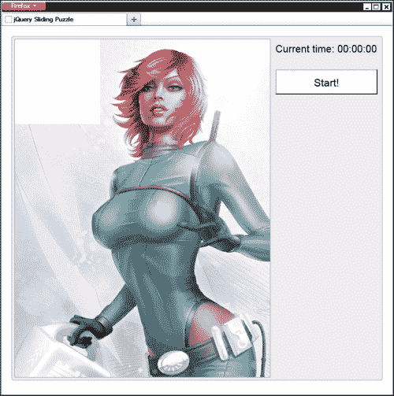
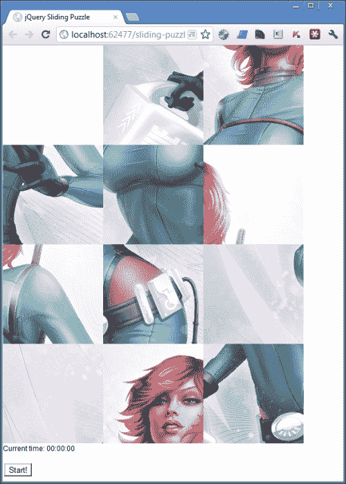

# 第一章：滑动拼图

在我们的第一个项目中，我们将在一个有趣和轻松的环境中看到各种技术的实际运用。把它看作是本书其余部分的轻松热身。

我们将看到如何使用 jQuery UI 使元素可拖动，以及如何配置可拖动元素的行为。我们还将研究其他主题，包括排序算法，以及使用 localStorage API 进行客户端存储。

# 任务简报

在这个项目中，我们将制作一个简单但有趣的拼图游戏，在这个游戏中，一张图片被打乱，必须通过移动板上的不同片段将其复原成原始图片 - 这是对昔日经典游戏的现代基于网络的改编。

通常在板上有一个空白空间，片段只能移动到这个空白空间，因此我们需要建立一个跟踪空白空间位置并只允许片段直接相邻的地方被拖动的系统。

为了给玩家一些动力，我们还可以看看如何跟踪玩家解决拼图所需的时间，以便记录玩家的最佳时间。以下是显示这个项目的最终结果的屏幕截图：



## 为什么它如此棒？

游戏很有趣，它可以吸引人们回到您的网站，尤其是年轻的观众。非闪存浏览器游戏以非常大的方式起飞，但是进入顶层行动可能有一个陡峭的学习曲线。

这样一个简单的基于拖动的游戏是让你毫不费力地进入游戏市场的完美方式，而不是立即跳入深水区，让您用一些游戏开发的简单概念来磨练您的技能。

这也是学习如何构建一个精确而引人入胜的可视化接口的绝佳方式，非常适合其预期目标，并且易于直观使用。我们还可以研究一些更高级的可拖动概念，例如避免碰撞和精确定位。我们还将学习如何使用 localStorage API 与会话之间存储和检索数据。

## 你的热门目标

这个项目将被分解成以下任务，我们将按顺序逐步进行工作以产生一个可工作的最终结果：

+   布置基础 HTML

+   创建代码包装器并定义变量

+   将图像分割成片段

+   洗牌拼图片段

+   使拼图片段可拖动

+   启动和停止计时器

+   确定拼图是否已解决

+   记住美好时光，并增加一些最终的样式

## 任务检查清单

除了 jQuery，我们还将在这个项目中使用 jQuery UI，所以现在是时候获取这些库并将它们放在合适的位置。我们还可以花一点时间来设置我们的项目文件夹，这是我们可以存储在整本书中创建的所有文件的地方。

在某个地方创建一个名为 `jquery-hotshots` 的新文件夹。在此文件夹中创建三个新文件夹，分别命名为 `js`、`css` 和 `img`。我们创建的所有 HTML 页面都将放在根目录 `jquery-hotshots` 文件夹中，而我们使用的其他文件将根据其类型分布在子文件夹中。

对于本书中涵盖的项目，我们将使用最新版本的 jQuery 的本地副本，撰写本文时是全新的 1.9.0。从 [`code.jquery.com/jquery-1.9.0.min.js`](http://code.jquery.com/jquery-1.9.0.min.js) 下载压缩版本的副本并将其保存在 `js` 文件夹中。

### 提示

使用 Google 的**内容传送网络**（**CDN**）加载 jQuery，并链接到文件而不指定协议被认为是最佳实践。使用 CDN 意味着文件更可能在访问者的浏览器缓存中，使库加载速度更快。

还建议在某种原因导致 CDN 不可访问时提供一个备用方案。如果未找到 CDN 版本，我们可以非常容易地使用优秀的 **yepnope** 来加载脚本的本地版本。有关此及其他资源加载技巧和技巧的更多信息，请参阅 yepnope 网站 [`yepnopejs.com/`](http://yepnopejs.com/)。

要下载我们需要的 jQuery UI 组件，请访问下载构建器 [`jqueryui.com/`](http://jqueryui.com/)。我们将在后续项目中使用各种其他组件，所以为了简单起见，我们可以使用 **Stable** 按钮下载完整库。撰写本文时的当前版本为 1.10.0。

下载完成后，您需要从存档中的 `js` 目录中获取 `jquery-ui-x.x.x.custom.min.js 文件`（其中 `x.x.x` 是版本号），并将其粘贴到您的 `js` 文件夹中。

### 提示

最近版本的 jQuery UI，以及一些通过 Themeroller 生成的更受欢迎的预定义主题，也可以通过 Google 的 CDN 获取。

# 奠定基础 HTML

首先，我们需要构建包含滑动拼图的页面。初始页面将是一个主要只包含几个容器的外壳；当需要时，可以动态创建组成拼图的可拖动元素。

## 为起飞做准备

我们将为本书中的所有不同项目使用标准起点，因此现在简要介绍一下以节省在每个项目中显示它的时间：

```js
<!DOCTYPE html>

<html lang="en">
    <head>
        <meta charset="utf-8" />
        <title></title>
        <link rel="stylesheet" href="css/common.css" />
    </head>
    <body>
        <script src="img/jquery-1.9.0.min.js"></script>
    </body>
</html>
```

### 提示

**下载示例代码**

您可以从您在 [`www.packtpub.com`](http://www.packtpub.com) 购买的帐户中下载您购买的所有 Packt 图书的示例代码文件。如果您在其他地方购买了这本书，您可以访问 [`www.packtpub.com/support`](http://www.packtpub.com/support) 并注册，直接将文件发送到您的邮箱。

我们所涵盖的每个项目都将包含在一个页面中，该页面的开头与此相同。现在在您的本地项目文件夹中保存上一个文件的副本，并将其命名为`template.html`。在每个项目的开头，我会说类似于"将模板文件另存为`project-name.html`"。这就是我将要引用的文件。

因此，在主项目目录（`jquery-hotshots`）中保存上一个 HTML（或`template.html`，如果您愿意），并将其命名为`sliding-puzzle.html`。

我们还将使用一个通用的样式表进行基本样式设置，每个项目都将使用它。它包含诸如 HTML5 重置、清除浮动和其他实用工具，以及一些基本的排版修复和主题设置，以确保项目之间的一致性。虽然我不会在这里详细介绍它，但你可以查看本书附带下载的`common.css`源文件以获取更多信息。

每个项目还将需要自己的样式表。在适当的情况下，这些将会涵盖，并将根据需要按项目讨论。我们现在可以创建这个项目中将使用的自定义样式表。

创建一个新文件并将其命名为`sliding-puzzle.css`，然后将其保存在`css`文件夹中。我们可以使用以下代码在页面的`<head>`部分链接到这个文件：

```js
<link rel="stylesheet" href="css/sliding-puzzle.css" />
```

这应该直接出现在`common.css`样式表引用之后。

我们还可以链接到本项目中将要使用的脚本文件。首先，我们下载并复制到`js`文件夹中的 jQuery UI 文件可以使用以下代码链接：

```js
<script src="img/jquery-ui-1.10.0.custom.min.js"></script>
```

记得在 jQuery 本身的脚本之后始终添加 jQuery UI 的脚本。

最后，我们可以添加用于此项目的脚本文件。创建一个新文件并将其保存为`sliding-puzzle.js`，保存在`js`文件夹中。我们可以通过在 jQuery UI 引用之后直接添加以下`<script>`元素来链接到它：

```js
<script src="img/sliding-puzzle.js"></script>
```

## 启动推进器

在根项目文件夹中将模板文件另存为`sliding-puzzle.html`，然后将以下标记添加到`<body>`元素中（在 jQuery`<script>`元素之前）：

```js
<div id="puzzle" class="clearfix">
    <figure>
        
    </figure>
    <div id="ui">
        <p id="time">Current time: <span>00:00:00</span></p>
        <button id="start">Start!</button>
    </div>
</div>
```

## 目标完成 - 小结

这个简单的 HTML 就是开始的全部。由于这是一本关于 JavaScript 的书，我不会详细介绍 HTML，除非绝对必要。在这种情况下，大部分元素本身并不重要。

主要的是我们有一系列具有`id`属性的容器，这使得选择它们变得快速简便。唯一真正重要的元素是``，它显示我们将要转换成拼图的原始图像。

### 注意

此示例中使用的精彩图像是由极具天赋的*奥登纽·奥达诺休*先生创建的。您可以在[`eamonart.com/`](http://eamonart.com/)上查看更多他精美作品的示例。项目中使用的图像可以在[`eamonart.com/IMAGES/PINUPSLINKS/Space%20Girl%20Vera.html`](http://eamonart.com/IMAGES/PINUPSLINKS/Space%20Girl%20Vera.html)找到。

# 创建代码包装器和定义变量

我们所有的代码都需要包含在一个在页面加载完成后立即执行的包装函数中。

## 准备起飞

我们在项目的这一部分将完成的步骤如下：

+   为我们的代码添加一个包装函数，该函数将在页面加载完成后立即执行

+   定义我们将在整个脚本中使用的变量

## 启动推进器

第一步是为我们的代码创建一个包装函数，该函数将在页面加载完成后立即执行。将以下代码添加到一个名为 `sliding-puzzle.js` 的新脚本文件中，该文件应保存在我们之前创建的 `js` 目录中：

```js
$(function () {

    //all our code will be in here...

});
```

我们在野外看到的大多数 jQuery 代码都位于某种包装器内。使用 `$(function(){});` 是 jQuery 的 `document.ready` 函数的快捷方式，该函数在页面的 DOM 加载完成后触发。

### 提示

**使用 $**

如果我们与其他开发人员共享我们的代码，我们通常不会在全局范围内像这样使用 `$`，因为页面上可能还有其他库也在使用它。最佳实践是在自动调用的匿名函数内或者您喜欢的立即调用的函数表达式内将 `$` 字符别名化。可以使用 `(function($) { … }(jQuery));` 语法来完成此操作。

接下来，我们可以在脚本文件的顶部设置一些变量。这样做是为了避免我们希望稍后更改的大量值分布在整个文件中。组织是编写可维护代码的关键之一，我们应该始终努力使我们的代码以及我们的意图尽可能清晰。

接下来，在我们刚刚定义的函数内添加以下代码，替换前一个代码示例中显示的注释：

```js
var numberOfPieces = 12,
    aspect = "3:4",
    aspectW = parseInt(aspect.split(":")[0]),
    aspectH = parseInt(aspect.split(":")[1]),
    container = $("#puzzle"),
    imgContainer = container.find("figure"),
    img = imgContainer.find("img"),
    path = img.attr("src"),
    piece = $("<div/>"),
    pieceW = Math.floor(img.width() / aspectW),
    pieceH = Math.floor(img.height() / aspectH),
    idCounter = 0,
    positions = [],
    empty = {
        top: 0, 
        left: 0,
        bottom: pieceH, 
        right: pieceW
    },
    previous = {},
    timer,
    currentTime = {},
    timerDisplay = container.find("#time").find("span");
```

这不是我们将使用的所有变量，只是其中大部分。列表还包括我们将需要在回调函数中使用的任何变量，以便我们不会遇到作用域问题。

## 完成目标 - 迷你总结

我们首先定义的变量是简单（原始）值和我们将在整个代码中使用的对象或数组以及缓存的 jQuery 元素的组合。在使用 jQuery 时，为了获得最佳性能，最好从页面中选择元素并将它们存储在变量中，而不是反复从页面中选择它们。

虽然我们的变量都没有直接赋值给`window`，因此实际上不是全局变量，但由于我们将它们定义在最外层函数的顶部，它们将在整个代码中可见，我们可以将它们视为全局变量。这样我们就能获得全局变量的可见性，而不会实际上使全局命名空间混乱。

### 注意

最佳实践是在它们所属的函数顶部定义变量，因为存在一种被称为**提升**的现象，其中在函数内部深处定义的变量，例如在`for`循环内部，有时会在函数顶部“提升”，可能导致难以追踪的错误。

在可能的情况下，在函数顶部定义变量是避免此类情况发生的简单方法，在编写 jQuery 或一般 JavaScript 时被认为是一种良好的实践。

大多数变量都非常直接。我们存储了我们想要使用的拼图块数以及所使用图像的宽高比。重要的是，拼图块的数量可以被宽度和高度的比率组件等分。

我们使用 JavaScript 的`split()`函数将宽高比拆分为其组成部分，并指定冒号作为拆分字符。我们还使用 JavaScript 的`parseInt()`函数确保我们最终得到的是实际数字而不是字符串，存在`aspectW`和`aspectH`变量中。

接下来的三个变量都是我们需要操作的页面中选择的不同元素。随后是使用 jQuery 创建的新元素。

接下来，我们根据原始图像的宽度和高度以及宽高比计算每个拼图块需要调整大小的`width`和`height`，并初始化一个计数器变量，我们将使用它向每个拼图块添加一个唯一的、有序的`id`属性。我们还添加了一个名为`positions`的空数组，我们将用它来存储每个新块的`top`和`left`位置。

当拼图块在板上移动时，我们需要一种方法来跟踪空白空间，因此我们创建了一个名为`empty`的对象，并赋予它`top`、`left`、`bottom`和`right`属性，以便我们随时知道空白位置在哪里。我们还希望跟踪任何给定块的上一个位置，因此我们创建了一个名为`previous`的空对象，我们将在需要时填充它的属性。

剩下的三个变量都与跟踪解决拼图所需的时间有关。我们定义了但没有初始化`timer`变量，稍后在脚本中将使用它来存储对 JavaScript `setInterval()`-based 定时器的引用。我们还创建了一个名为`currentTime`的空对象，当需要时会再次填充它，并缓存了一个引用，我们将用它来显示当前时间的元素。

# 将图像拆分为块

我们的下一个任务是将图像分割成指定数量的方块，以表示拼图的各个部分。为此，我们将创建一系列较小的元素，每个元素显示图像的不同部分，并可以单独操作。

## 准备起飞

完成此任务所需的单个步骤是创建指定数量的拼图块，并为每个拼图块设置唯一的背景位置和位置，以重新创建图像。

## 启动推进器

我们现在想要生成组成拼图的不同部分。我们可以使用以下代码来完成这个任务，这段代码应该直接添加在我们刚刚在 `sliding-puzzle.js` 中定义的变量之后：

```js
for (var x = 0, y = aspectH; x < y; x++) {
    for (var a = 0, b = aspectW; a < b; a++) {
        var top = pieceH * x,
            left = pieceW * a;

        piece.clone()
             .attr("id", idCounter++)
             .css({
                 width: pieceW,
                 height: pieceH,
                 position: "absolute",
                 top: top,
                 left: left,
                 backgroundImage: ["url(", path, ")"].join(""),
                 backgroundPosition: [
                     "-", pieceW * a, "px ", 
                     "-", pieceH * x, "px"
                 ].join("")
        }).appendTo(imgContainer);

        positions.push({ top: top, left: left });
    }
}
```

## 目标完成 - 小结

我们使用嵌套的 `for` 循环来以网格模式创建新的拼图块。第一个循环将根据需要运行多少行；对于像本示例中使用的 3:4 宽高比图像，我们将需要四行方块。内部循环将根据需要运行多少列，本例中是三列。

在内部循环中，我们首先创建两个新变量 `top` 和 `left`。我们需要在几个地方使用这些值，因此一次创建并在每次需要时重用它们是有意义的。

`top` 位置等于外部循环的计数变量（`x`）的当前值乘以拼图块的 `height`，而 `left` 位置等于内部循环的计数变量（`a`）的当前值乘以拼图块的 `width`。这些变量用于使拼图块在网格中排列。

然后，我们使用 jQuery 的 `clone()` 方法复制我们存储的 `<div>` 元素，并使用 `attr()` 方法使用我们在项目的第一部分初始化的 `idCounter` 变量设置一个唯一的 `id` 属性。请注意，我们同时在 `attr()` 方法中设置变量并递增变量。

我们可以像这样在方法内部递增变量，也可以在方法外部递增变量；在性能或其他方面没有真正区别。我只是觉得在原地更新更简洁。

接下来，我们使用 `css()` 方法在新元素上设置一个 `style` 属性。我们设置拼图块的 `width` 和 `height` 并使用我们的 `top` 和 `left` 变量定位它，以及设置其 `backgroundImage` 和 `backgroundPosition` 样式属性。

### 注意

通常使用连字符单词定义的任何样式属性，例如 `background-image`，在与 jQuery 的 `css()` 方法一起使用对象时，应该使用驼峰命名法。

`backgroundImage` 属性可以使用我们的 `path` 变量和样式的其余字符串组件设置，但是 `backgroundPosition` 属性需要为每个拼图块单独计算。

`backgroundPosition`样式属性的水平分量等于`width`乘以内部循环计数变量（`a`）的值，而垂直分量等于`height`乘以外部循环计数变量（`x`）的值。

一旦新元素被创建，我们可以使用 JavaScript 的`push()`方法将其位置添加到我们的`positions`数组中，传递一个包含元素的`top`和`left`位置属性的对象，以供以后使用。

## 机密情报

我们不再使用标准的字符串连接来构造`backgroundImage`和`backgroundPosition`字符串，而是将值放入数组文字中，然后使用 JavaScript 的`join()`方法将数组连接起来。通过指定一个空字符串作为用于连接字符串的值，我们确保不会向字符串添加任何附加字符。

将一个子字符串数组连接成一个单一字符串比使用`+`运算符在子字符串上构建字符串要快得多，并且由于我们在循环内部重复工作，我们应尽可能优化循环内的代码。

# 洗牌拼图块

在此步骤中，我们需要随机洗牌拼图块，使其成为一个谜题，以便访问者可以重新排列它们。我们还可以删除原始图像，因为它不再需要，并删除第一个拼图块以创建一个空白空间，以便其他拼图块可以移动。

## 准备升空

我们在本任务中将涵盖的步骤是：

+   从页面中删除原始图像

+   删除拼图的第一个块

+   从位置数组中删除第一个项目

+   随机洗牌拼图块

## 启动推进器

完成第一步仅需要添加以下代码行，应直接添加到上一任务中我们在`sliding-puzzle.js`中添加的外部`for`循环的结束大括号之后：

```js
img.remove();
```

第二步同样简单；以下内容可以直接添加到上一行代码之后：

```js
container.find("#0").remove();
```

我们还可以为下一步使用一行代码。将以下内容直接添加到上一行代码之后： 

```js
positions.shift();
```

洗牌拼图块将稍微复杂一些；您会记得项目的第一部分中我们添加基础 HTML 时其中一个元素是一个开始按钮。我们将使用此按钮来触发洗牌。将以下代码直接添加到我们刚刚添加的前两行代码之后（确保它们仍然在外部函数包装器内）：

```js
$("#start").on("click", function (e) {
    var pieces = imgContainer.children();

    function shuffle(array) {
        var i = array.length;

        if (i === 0) { 
            return false;
        }
        while (--i) {
            var j = Math.floor(Math.random() * (i + 1)),
                tempi = array[i],
                tempj = array[j];

                array[i] = tempj;
                array[j] = tempi;
        }
    }

    shuffle(pieces);

    $.each(pieces, function (i) {
        pieces.eq(i).css(positions[i]);
    });

    pieces.appendTo(imgContainer);

    empty.top = 0;
    empty.left = 0;

    container.find("#ui").find("p").not("#time").remove();

});
```

## 目标完成 - 迷你总结

jQuery 的`remove()`方法用于从页面中删除原始图像元素，这些元素在脚本开头声明变量时已经选择了。我们使用相同的方法来删除第一个拼图块，我们应该在拼图块被洗牌之前*之前*这样做，以避免删除关键部件，例如脸部。与此示例中使用的图像一样，其中感兴趣的主要项目不在左上角的图像是有益的。

我们从面板上移除了第一块拼图，因此我们也应该移除`positions`数组中的第一项。当我们来检查拼图是否已经还原时，我们将使用这个数组，由于第一个位置上没有拼图块，我们不需要存储它的位置。我们使用 JavaScript 的`unshift()`方法来实现这一点，它简单地移除调用它的数组中的第一个项目。

### 使用 on()为按钮添加事件处理程序

我们通过选择按钮并调用 jQuery 的`on()`方法为按钮添加了点击事件处理程序。在这个例子中，`on()`方法接受两个参数（尽管在需要事件委托时它可以接受三个参数）。

第一个参数是要监听的事件，第二个参数是每次检测到事件时要执行的处理程序函数。在这种情况下，我们正在监听`click`事件。

### 提示

**全能的 on()方法**

jQuery 的`on()`方法，自 1.7 版本引入，取代了现已废弃的`bind()`、`live()`和`delegate()`方法。现在使用`on()`是 jQuery 中附加事件处理程序的推荐方法。

在处理程序函数内部，我们首先定义一个变量，它存储了`<figure>`元素的子元素。虽然我们需要再次从页面中选择拼图块，但我们仍然可以使用我们缓存的`imgContainer`变量来避免创建新的 jQuery 对象。

### 洗牌拼图块

接下来我们定义了一个名为`shuffle()`的函数，它接受要洗牌的数组作为参数。这个函数执行了一个**Fisher-Yates**洗牌算法，这是一个创建给定值的随机排序的已知模式。

在函数内部，我们首先获取传入的数组的长度，如果数组为空，则返回`false`（退出函数）。然后，我们使用`while`循环遍历数组。在 JavaScript 中，`while`循环类似于`for`循环，但是当括号中指定的条件具有`truthy`值（或者评估为`true`）时执行，而不是执行指定次数的循环。使用预减量循环条件是为了避免在所有项都被洗牌后不必要地迭代循环。

### 注意

在 JavaScript 中，除了`true`或`false`布尔值之外，其他类型的变量也可以被称为`truthy`或`falsey`。以下值都被认为是`falsey`：

+   布尔值`false`

+   数字`0`

+   空字符串

+   `null`

+   `undefined`

+   `NaN`

所有其他值都被认为是`truthy`。这样可以使非布尔值用作条件。falsey 和 false 之间的相似性可能会导致混淆；只需记住 false 是一个实际的值，而 falsey 是一个值的一个方面，除了 false 还有其他值也具有。

有关此主题的更多信息，请参见[`james.padolsey.com/javascript/truthy-falsey/`](http://james.padolsey.com/javascript/truthy-falsey/)。

在循环内，对数组中的每个项（除第一个项外）进行随机选择，并与数组中的另一项交换位置。为了生成用作要交换的项的索引的随机数，我们首先使用 JavaScript 的`Math.random()`函数生成一个随机数，把得到的随机数（在`0`和`1`之间）乘以数组的长度加`1`。这将给我们一个在`0`和数组长度之间的随机数。

然后，我们从数组中取出当前索引的项，以及随机生成的索引处的项，并交换它们的位置。这可能看起来很复杂，但这几乎被普遍认为是随机洗牌数组中项的最有效方式。它给了我们最随机的结果，处理的工作量最少。

一旦我们定义了函数，我们就会调用它，将`pieces`数组作为要洗牌的数组传递进去。

### 注意

有关 Fisher-Yates 乱序的 JavaScript 实现的更多信息，请参阅[`sedition.com/perl/javascript-fy.html`](http://sedition.com/perl/javascript-fy.html)。

### 定位元素

完成元素数组的洗牌后，我们使用 jQuery 的`each()`方法对其进行迭代。此方法传递了要迭代的数组，在这种情况下是刚刚洗牌的`pieces`数组。第二个参数是一个迭代器函数，将对数组中的每个项进行调用。

在这个函数中，我们使用我们的`positions`数组将洗牌后的元素放在页面的正确位置。如果我们不这样做，元素将被洗牌，但因为它们的`absolute`定位，它们仍会出现在页面的同一位置。我们可以使用在创建新元素时更新的`positions`数组来获得每个洗牌元素的正确`top`和`left`位置。

一旦元素集合被迭代并设置了它们的位置，我们就可以使用 jQuery 的`appendTo()`方法把它们再次附加到页面上。同样，我们可以把我们的`imgContainer`变量作为`appendTo()`的参数，以避免再次从页面选择容器。

### 定位空白空间

最后，我们应该确保空白空间确实位于板的顶部和左边的`0`位置。如果点击了按钮，移动了一些方块，然后再次点击按钮，我们必须确保空白空间在正确的位置。我们通过将`empty`对象的`top`和`left`属性都设置为`0`来实现这一点。

我们还可以删除显示在 UI 区域的任何先前消息（我们将在项目的最后部分涵盖添加这些消息）。但我们不想删除计时器，所以我们使用 jQuery 的`not()`方法来过滤出当前元素，该方法接受一个选择器，匹配的元素被丢弃，因此不会从页面中删除。

此时，我们应该能够在浏览器中运行页面，并通过点击**开始！**按钮来打乱拼图块：



# 使拼图块可拖动

现在是时候启动 jQuery UI，使拼图的各个部分可拖动了。

jQuery UI 是一套用于构建交互式和高效用户界面的 jQuery 插件。它稳定、成熟，并被公认为是 jQuery 的官方 UI 库，尽管不是唯一的。

## 准备起飞

在此任务中，我们将涵盖以下步骤：

+   使用 jQuery UI 的可拖动组件使拼图块可拖动

+   配置可拖动的元素，以便只有直接相邻空白区域的块可以移动

+   配置可拖动的元素，以便块只能移动到空白区域

## 启动推进器

首先，我们将使拼图块可拖动，并设置一些组件公开的配置选项。此代码应添加到上一个任务中添加的代码之后的`sliding-puzzle.js`中：

```js
pieces.draggable({
    containment: "parent",
    grid: [pieceW, pieceH],
    start: function (e, ui) {

    },
    drag: function (e, ui) {

    },
    stop: function (e, ui) {

    }
});
```

在此任务的接下来几个步骤中，将在上一个代码示例的`start`、`drag`和`stop`回调函数中添加额外的代码。

我们还需要配置可拖动性，以便块只能移动到空白区域，而不是在彼此之间移动，并且只有直接相邻空白区域的块才能被移动。

现在让我们将以下代码添加到我们刚刚添加的`start`回调函数中：

```js
var current = getPosition(ui.helper);

if (current.left === empty.left) {
    ui.helper.draggable("option", "axis", "y");
} else if (current.top === empty.top) {
    ui.helper.draggable("option", "axis", "x");
} else {
    ui.helper.trigger("mouseup");
    return false;
}

if (current.bottom < empty.top || 
    current.top > empty.bottom ||
    current.left > empty.right || 
    current.right < empty.left) {
        ui.helper.trigger("mouseup");
        return false;
    }

    previous.top = current.top;
    previous.left = current.left;
```

接下来，将以下代码添加到`drag`回调函数中：

```js
var current = getPosition(ui.helper);

ui.helper.draggable("option", "revert", false);

if (current.top === empty.top && current.left === empty.left) {
    ui.helper.trigger("mouseup");
    return false;
}

if (current.top > empty.bottom ||
    current.bottom < empty.top || 
    current.left > empty.right || 
    current.right < empty.left) {
        ui.helper.trigger("mouseup")
                 .css({ 
                     top: previous.top, 
                     left: previous.left 
                 });
        return false;
}
```

最后，我们应该将以下代码添加到`stop`回调函数中：

```js
var current = getPosition(ui.helper);

if (current.top === empty.top && current.left === empty.left) {

    empty.top = previous.top;
    empty.left = previous.left;
    empty.bottom = previous.top + pieceH;
    empty.right = previous.left + pieceW;
}
```

在我们的每个回调函数中，我们使用了一个辅助函数，返回当前可拖动元素的确切位置。我们还应该在`draggable()`方法之后添加此函数：

```js
function getPosition(el) {
    return {
        top: parseInt(el.css("top")),
        bottom: parseInt(el.css("top")) + pieceH,
        left: parseInt(el.css("left")),
        right: parseInt(el.css("left")) + pieceW
    }
}
```

## 目标完成 - 小结

我们在上一个任务中写了很多代码，让我们来分解并看看我们做了什么。我们首先通过使用 jQuery UI 的可拖动组件使块可拖动。我们通过调用`draggable()`方法来实现这一点，传入一个对象字面量，设置可拖动组件公开的各种选项。

首先，我们将`containment`选项设置为`parent`，这样可以阻止任何拼图块被拖出它们所在的`<figure>`元素。我们还设置了`grid`选项，允许我们指定拼图块应该捕捉到的点的网格。我们将数组设置为此选项的值。

此数组中的第一项设置了网格的水平点，第二项设置了网格的垂直点。设置这些选项使块的移动更具真实感和触觉体验。

接下来我们设置的最后三个选项实际上是回调函数，在拖动的生命周期的不同点被调用。我们使用`start`、`drag`和`stop`回调。

### 当拖动开始时

`start`回调将在可拖动对象上的`mousedown`事件后的拖动交互的最开始触发一次。`stop`回调将在拖动交互的最后，即`mouseup`事件注册后触发一次。`drag`回调几乎在被拖动元素每移动一个像素时都会连续触发，因为它被用于每次拖动元素移动时都调用。

让我们首先看一下`start`回调。每个回调在被调用时由 jQuery UI 传递两个参数。其中之一是事件对象，在这个项目中我们不需要，而第二个是一个包含有关当前可拖动对象的有用属性的对象。

在函数开始时，我们首先获取拖动开始的块的确切位置。当我们调用我们的`getPosition()`函数时，我们传入`ui`对象的`helper`属性，它是对已开始被拖动的基础 DOM 元素的 jQuery 封装引用。

一旦我们获得了元素的位置，我们首先检查元素是否与空白空间在同一行，方法是将当前对象（由`getPosition()`返回的对象）的`left`属性与`empty`对象的`left`属性进行比较。

如果这两个属性相等，则将可拖动对象的`axis`选项设置为`y`，以便它只能水平移动。可以使用`option`方法在任何 jQuery UI 小部件或组件中设置配置选项。

如果它不在同一行，则通过比较`current`和`empty`对象的`top`属性来检查它是否在同一列。如果这两个属性相等，则我们将`axis`选项设置为`x`，以便块只能垂直移动。

如果这些条件都不为真，则该块不能与空白空间相邻，因此我们使用 jQuery 的`trigger()`方法手动触发`mouseup`事件来停止拖动，并从函数中返回`false`，以便我们的`stop`处理程序不会被触发。

我们需要确保只有与空白空间在同一行或同一列的方块可以被拖动，但我们还需要确保任何不直接与空白空间相邻的方块也不能被拖动。

为了阻止非邻近空白空间的块被拖动，我们只需检查：

+   当前块的*下边*小于空白空间的*上边*

+   当前块的*上边*大于空白空间的*下边*

+   当前块的*左边*大于空白空间的*右边*

+   当前块的*右边*小于空白空间的*左边*

如果这些条件中的任何一个为真，我们再次通过手动触发`mouseup`事件停止拖动，并通过返回`false`来停止调用拖动对象上的任何进一步事件处理程序（但仅限于当前拖动交互）。

如果回调函数在这一点没有返回，我们就知道我们正在处理一个与空白空间相邻的可拖动对象，因此我们通过在项目开始时初始化的`previous`对象的`top`和`left`属性来存储它当前的位置，以便以后使用。

### 提示

**ui.helper 的位置**

传递给我们回调函数的`ui`对象实际上包含一个称为`position`的对象，它可以用于获取当前可拖动物体的位置。然而，由于我们使用了`grid`选项，此对象中包含的值可能对我们的需求不够精细。

### 在拖动期间

接下来，我们可以走一遍`drag`回调，这将在每次当前可拖动物体的位置改变时调用。这将发生在`mousedown`事件期间。

首先，我们需要知道被拖动的拼图在哪里，所以我们再次调用我们的`getPosition()`辅助函数。

然后我们想要检查被拖动的拼图是否在空白空间中。如果是，我们可以像之前一样停止拖动-手动触发`mouseup`事件并返回`false`。

在拖动过程中，只有有效的拼图才能被拖动，因为我们已经筛选掉了与空白空间不直接相邻的拼图。然而，我们还需要检查被拖动的拼图是否正在远离空白空间。我们可以在`start`回调中筛选出与空白空间不直接相邻的拼图的方式进行检查。

### 拖动结束时

`stop`回调是三个回调中最简单的。我们获取被拖动的拼图的位置，如果它确实在空白空间中，我们就把空白空间移到拖动时它所在的位置。记住，我们把这些信息存储在一个叫`previous`的对象中。

# 启动和停止计时器

此时，我们的游戏已经功能完善，拼图也可以被拼好了；但是为了增加乐趣，我们应该通过引入计时器来增加竞争元素。

## 为起飞做准备

在这个任务中，我们需要完成以下步骤：

+   检查是否在单击**开始**按钮时计时器已经在运行

+   从`0`开始计时

+   每秒增加一次计时器

+   在页面上更新显示，以便玩家可以看到当前游戏已经进行了多长时间

## 启动推进器

要检查在单击**开始**按钮时计时器是否已经在运行，我们应该在将洗牌后的拼图追加到页面之后直接添加以下代码，并紧接着调用`draggable()`之前：

```js
pieces.appendTo(imgContainer).draggable("destroy");

if (timer) {
 clearInterval(timer);
 timerDisplay.text("00:00:00");
}

timer = setInterval(updateTime, 1000);
currentTime.seconds = 0;
currentTime.minutes = 0;
currentTime.hours = 0;

pieces.draggable({
```

接下来，我们可以添加一个增加计时器并更新显示的函数。这段代码应该直接放在我们在前面更新`currentTime.hours`的代码之后：

```js
function updateTime() {

    if (currentTime.hours === 23 && currentTime.minutes === 59 &&
currentTime.seconds === 59) {
        clearInterval(timer);          
    } else if (currentTime.minutes === 59 && currentTime.seconds === 59) {

        currentTime.hours++;
        currentTime.minutes = 0;
        currentTime.seconds = 0;
    } else if (currentTime.seconds === 59) {
        currentTime.minutes++;
        currentTime.seconds = 0;
    } else {
        currentTime.seconds++;
    }

    newHours = (currentTime.hours <= 9) ? "0" + currentTime.hours :

    currentTime.hours;
    newMins = (currentTime.minutes <= 9) ? "0" + currentTime.minutes :

    currentTime.minutes;
    newSecs = (currentTime.seconds <= 9) ? "0" + currentTime.seconds : 

    currentTime.seconds;

    timerDisplay.text([
        newHours, ":", newMins, ":", newSecs
    ].join(""));

}
```

## 目标完成-小结报告

在此任务中，我们首先要做的是检查定时器是否已经在运行。定时器将存储在我们的一个“全局”变量中，因此我们可以轻松地检查它。我们使用`if`语句来检查`timer`是否包含真值（请参阅有关 JavaScript 的真值和虚值的先前信息）。

如果有的话，我们知道定时器已经在运行，因此我们使用 JavaScript 的`clearInterval()`函数取消定时器，将我们的`timer`变量作为要清除的定时器传入。如果定时器已经在运行，我们还可以重置定时器显示。在项目开始时，我们从页面中选择了定时器显示元素，并在最初声明变量时对其进行了缓存。

接下来，我们使用 JavaScript 的`setInterval()`方法启动定时器，并将其分配给我们的`timer`变量。当定时器开始时，此变量将包含定时器的 ID，而不是定时器的值，这就是`clearInterval()`知道要清除哪个定时器的方式。

`setInterval()`函数接受一个要在指定间隔后执行的函数作为第一个参数，间隔作为第二个参数。我们将间隔指定为`1000`毫秒，等于 1 秒，因此将每秒调用作为第一个参数传递的函数，直到定时器被清除。

一旦定时器启动，我们还可以重置存储在我们将用于跟踪定时器的对象中的值 - `currentTime`对象。我们将此对象的`seconds`，`minutes`和`hours`属性设置为`0`。我们需要一个对象来跟踪时间，因为`timer`变量本身只包含定时器的 ID。

接下来，我们添加了`updateTime()`函数，该函数将由我们的间隔每秒调用一次。在此函数中，我们只需更新`currentTime`对象的相关属性，并更新显示。我们使用`if`条件来检查要更新定时器的哪些部分。

我们首先检查定时器是否尚未达到 24 小时。我希望没有人会实际花费那么长的时间来玩游戏，但是如果出于某种原因浏览器保持打开状态达到这么长时间，我们不希望时间显示为，例如，24 小时 1 分钟，因为在那时，我们真的应该更新显示为 1 天 0 小时 1 分钟。但我们不关心天数，所以我们只是停止定时器。

如果定时器尚未达到此时间长度，则我们检查当前分钟是否等于`59`，当前秒是否等于`59`。如果是，我们需要将`currentTime.hours`增加`1`，并将`currentTime.minutes`和`currentTime.seconds`属性重置为`0`。

如果此检查失败，则我们检查秒是否等于`59`。如果是，则我们增加`currentTime.minutes`属性，然后将`currentTime.seconds`重置为`0`。如果此第二个测试也失败，则我们知道我们所要做的就是增加`currentTime.seconds`。

接下来，我们需要检查是否需要在时间组件的前面加上前导`0`。我们可以使用另一个`if else`条件来实现，但 JavaScript 的三元结构更简洁更紧凑，所以我们使用它。

首先我们测试`currentTime.hours`是否小于或等于`9`，如果是，我们在值的开头添加`0`。对于`currentTime.minutes`和`currentTime.seconds`，我们也是这样做的。

最后，我们构建将用于更新计时器显示的字符串。我们不再使用乏味且缓慢的字符串连接，而是再次使用包含显示各个部分的数组，然后将数组连接起来。

结果字符串被设置为`timerDisplay`变量中包含的`<span>`元素的值，并使用 jQuery 的`text()`方法更新页面上的元素。

在这一点上，我们现在可以点击按钮来洗牌拼图块，并观察计时器开始递增。

# 确定拼图是否已解决

在这个任务中，我们将专注于确定拼图块是否已放回其正确位置，从而对拼图进行解开并解决。

## 准备起飞

在此任务中将涵盖以下步骤：

+   检查拼图块的顺序是否与拼图块的初始顺序匹配

+   停止计时器

+   显示祝贺消息

## 启动推进器

首先，我们需要决定何时检查拼图是否已完成。在拖动的`stop`事件上进行检查的好地方。

首先，在`stop()`回调的顶部的现有`current`变量之后直接添加以下新变量：

```js
var current = getPosition(ui.helper),
 correctPieces = 0;

```

不要忘记在第一个变量之后添加尾随逗号，就像前面的代码示例中所示的那样。接下来，在`if`语句之后直接添加以下代码：

```js
$.each(positions, function (i) {
    var currentPiece = $("#" + (i + 1)),
        currentPosition = getPosition(currentPiece);

    if (positions[i].top === currentPosition.top && positions[i].left === currentPosition.left) {

        correctPieces++;
    }
});

if (correctPieces === positions.length) {
    clearInterval(timer);
    $("<p/>", {
        text: "Congratulations, you solved the puzzle!"
    }).appendTo("#ui");
}
```

## 完成目标 - 小结

首先，我们定义了一个名为`correctPieces`的新变量，并将其值设置为`0`。然后，我们使用 jQuery 的`each()`方法迭代了我们在代码早期，当我们最初对拼图块进行洗牌时，填充的`positions`数组。

在这一点上，我们需要做的是获取拼图的每一块，并检查这些块是否按正确的顺序排列。然而，我们不能仅仅使用 jQuery 的`children()`方法或`find()`方法选择页面上的元素，因为 jQuery 不会以它们在 DOM 中找到的顺序返回元素，尤其是因为我们已经将它们全部移动到了它们的父容器周围。

我们需要做的是通过其`id`属性选择每个元素，然后检查其在`style`属性中具有的`top`和`left`CSS 属性。`positions`数组的长度与拼图块的数量相同，因此我们可以迭代此数组，并使用 jQuery 自动传递给迭代器函数的索引参数。

在迭代器中，我们首先选择当前元素。每个方块的`id`属性将从`1`开始，而不是从`0`开始，因为我们已经从拼图中移除了第一个方块，所以在选择每个方块时，我们将索引值加`1`。我们还使用现有的`getPosition()`函数获取当前元素的位置，传入我们刚刚选择的元素。

接下来，我们将当前方块的`top`和`left`属性与`positions`数组中等效的项目进行比较，如果`top`和`left`属性都匹配，我们将增加`correctPieces`变量。

一旦页面上的每个方块和`positions`数组中的每个项目都被比较，并且`each()`方法完成迭代，我们接着检查`correctPieces`变量的值是否等于`positions`数组的长度。如果是的话，我们知道每个方块都在正确的位置上。

我们可以像以前一样停止计时器，使用`clearInterval()`函数，然后创建祝贺消息并将其附加到具有`id`为`ui`的元素。

# 记住最佳时间并添加一些最终样式

现在游戏已经可以玩得很好。我们可以打乱方块，只允许按规则拖动它们，游戏将会检测拼图何时完成。使用简单的计时器，我们可以告诉玩家解决问题所需的时间，但接下来呢？玩家应该做些什么，只是记住他/她的最高分吗？

当然，现在我们需要一种方法来保存玩家的最佳时间。如果他们超过存储的最佳时间，显示额外的消息也会很方便。我们将使用 JavaScript 的 localStorage API 来存储最佳时间。

我们还可以添加一些额外的样式来完成游戏的外观，并更好地布置不同的元素。

## 为起飞做准备

我们在这项任务中将要涉及的步骤如下：

+   检查是否已保存了最佳时间

+   检查当前最佳时间是否优于保存的最佳时间

+   当当前最佳时间优于保存的最佳时间时更新保存的最佳时间

+   在超过保存的最佳时间时显示额外消息

+   用 CSS 整理游戏的呈现方式

## 启动推进器

我们在这项任务中需要做的一切都可以在`if`语句中完成，该语句在方块恢复正确顺序后执行。在上个任务中显示祝贺消息的地方后面直接添加以下代码：

```js
var totalSeconds = (currentTime.hours * 60 * 60) + (currentTime.minutes * 60) + currentTime.seconds;

if (localStorage.getItem("puzzleBestTime")) {

    var bestTime = localStorage.getItem("puzzleBestTime");

    if (totalSeconds < bestTime) {

        localStorage.setItem("puzzleBestTime", totalSeconds);

        $("<p/>", {
            text: "You got a new best time!"
        }).appendTo("#ui");
    }
} else {
    localStorage.setItem("puzzleBestTime", totalSeconds);

    $("<p/>", {
        text: "You got a new best time!"
    }).appendTo("#ui");
}
```

我们已经创建了我们将用于此的样式表 – `sliding-puzzle.css`，所以我们只需要将以下选择器和样式规则添加到该文件中： 

```js
#puzzle { 
    width:730px; padding:5px; margin:auto; 
    border:1px solid #aaa; border-radius:5px; 
    background-color:#eee; 
}
#puzzle figure { 
    width:510px; height:676px; border:1px solid #aaa; 
    position:relative; float:left; background-color:#fff; 
}
#ui { padding:10px 0 0 10px; float:left; }
#ui button { margin-bottom: 2em; }
#ui p { font-size:1.7em; }
#start { width:204px; height:50px; font-size:1.75em; }
```

## 目标完成 - 小型总结

首先我们将当前时间转换为秒，这样我们就只有一个值可以使用和存储。秒数是使用`currentTime`对象的`hours`、`minutes`和`seconds`属性来计算的，用来更新页面上可见的计时器。

`hours` 属性乘以 `60` 转换为分钟，然后再乘以 `60` 转换为秒。 `minutes` 属性仅乘以 `60` 一次，然后将这两个值加到 `seconds` 属性中剩余的秒数中，得到最终的总数，我们将其存储在 `totalSeconds` 变量中。

接下来，我们检查 localStorage 是否存在一个名称为 `puzzleBestTime` 的键。如果存在，则将 `localStorage` 中保存的值存储在 `bestTime` 变量中。如果 `totalSeconds` 变量的值小于 `bestTime` 变量，我们就有了一个新的最高分，我们将其保存在 localStorage 中，名称为 `puzzleBestTime`，以覆盖旧的最佳时间。然后，我们显示第二个祝贺消息，表示已经取得了新的最高分。

如果 localStorage 不包含具有此名称的键，那么这必须是此浏览器中首次玩游戏，因此我们将键的名称设置为并将 `currentTime` 变量的值存储为新的最佳时间，然后再次显示第二个祝贺消息。

在我们添加的 CSS 中没有什么真正关键的内容；它只是一点点轻微的样式，用来整理我们使用的各种元素，并以更清晰的风格呈现游戏。

## 机密情报

localStorage API 是 HTML5 通用术语中比较稳定的 JavaScript API 之一，并且受到所有常见浏览器的最新版本的广泛支持。

我们可能仍然需要支持的旧浏览器，比如 IE7 或 Firefox 2，不支持 localStorage。幸运的是，有大量的填充和解决方法可以在这些旧浏览器中添加基本的支持。

请参阅[`github.com/Modernizr/Modernizr/wiki/HTML5-Cross-Browser-Polyfills`](https://github.com/Modernizr/Modernizr/wiki/HTML5-Cross-Browser-Polyfills)获取一系列支持现代 API 的填充和补丁，以在旧浏览器中添加支持。

# 任务完成

在这个项目的过程中，我们使用了大量的 jQuery 和原生 JavaScript 来创建这个简单的游戏。我们还研究了使用 jQuery UI 的可拖动组件以及 localStorage API。

我们涵盖了很多代码，所以让我们简要回顾一下我们做过的事情。

我们首先在 `document.ready` 函数的开头声明了大部分在整个项目中使用的变量。这样做很有用，因为变量可以在我们的代码中使用，而不需要将它们全局范围化。出于性能原因，最好缓存 jQuery 对象，以便它们可以经常被操作，而无需在页面中不断地重新选择它们。

我们接着看到了如何利用一些嵌套的`for`循环和简单的数学知识，轻松地将已知长宽比的图像分割成多个等大小的块，排列在一个网格中。我们还发现，使用子字符串数组来创建字符串而不是使用字符串连接是一个非常简单的优化，可以在构建长字符串时帮助加快我们应用程序的速度。

然后，我们看到了如何使用一个接受的算法来随机化——费希尔-耶茨洗牌算法，将各个部分随机排列。实际上，我们完全没有使用 jQuery 来做这个，但不要忘记，生成洗牌的代码是在使用 jQuery 的`on()`方法添加的事件处理程序内执行的。

接下来，我们看了如何使用 jQuery UI 使拼图的各个部分可拖动。我们看了组件暴露的一些可配置选项，以及如何在拖动部分时对生成的不同事件作出反应。具体来说，我们使用了`start`、`drag`和`stop`回调来执行游戏规则，限制哪些部分可以在游戏中移动，以及它们在游戏过程中如何移动。

之后，我们看了如何使用标准的 JavaScript 定时器来跟踪解谜游戏所需的时间，以及如何更新页面上可见的计时器，让玩家能够看到他们开始以来经过的时间。

检测拼图何时被解决也是代码的一个关键能力。我们在这里的主要障碍是，拼图的部分并不是按照我们在屏幕上看到的可见顺序选取的，但这很容易通过使用它们的编号`id`属性来选取部分，然后手动检查它们的 CSS 位置来克服。

最后，我们看了如何记录玩家解谜游戏的最佳时间。在这里，localStorage 是显而易见的选择，只需一小步检查是否已经存储了分数，然后比较当前时间和存储的时间，就能知道记录是否被打破了。

# 你准备好全力以赴了吗？一个高手的挑战

我们的简单游戏仍然可以添加许多更多的功能。为什么不更新游戏，让玩家可以选择不同的技能水平呢？

要实现这一点，我们只需要提供某种接口，允许访问者选择技能水平，然后考虑一种使游戏变得更难的方式。

如果我们假设当前游戏格式是最简单的技能水平，那么使游戏变得更难的一个非常简单的方法是增加将原始图像分割成的块数。尝试自己做这个吧。那些对数学有深刻理解的人可能会意识到我们的游戏还有另一个缺陷——一些随机组合的部分根本无法解决。存储或计算所有可解决的可能组合可能超出了实际可行，但还有另一种选择。

而不是随机洗牌一堆碎片，然后将它们的位置写入板上，我们可以通过程序化地在棋盘上移动它们来洗牌。根据玩家受限的游戏规则进行洗牌的拼图将每次都得到一个可解的拼图。
