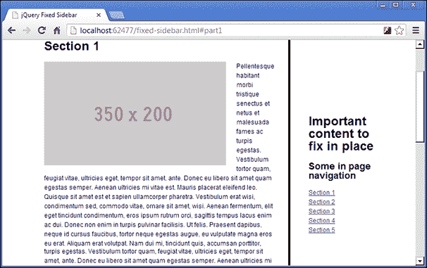

# 第二章：固定位置侧边栏带有动画滚动

`position:fixed` CSS 样式添加了一个有趣的效果，允许一个目标元素在页面被滚动时保持其位置。然而，它的有效性受到一个限制，即无论这个元素被嵌套在其他元素中多深，它始终是相对于整个文档固定的。

# 任务简报

在这个项目中，我们将创建一个侧边栏，模拟`position:fixed`的 CSS 样式，但不会受到纯 CSS 解决方案的相同限制。我们还可以在页面上添加一种吸引人的动画，以便当侧边栏中的导航项被点击时，页面的不同部分被滚动到视图中。

以下是此项目的最终结果的截图：



## 为什么很棒？

能够在页面上固定一个元素是一种非常流行的 UI 设计模式，被许多大型和受欢迎的网站使用。

将访问者的主要工具或行动呼吁保持在任何时候都可以接触到，提高了网站的用户体验，并可以帮助保持您的访问者满意。方便是重要的，所以如果访问者必须向下滚动一个长页面，然后再次向上滚动才能点击某些内容，他们很快就会对页面失去兴趣。

这个原理在移动设备上也是一个新兴的趋势。实际的`position:fixed`样式在移动设备上普遍支持较差，但在某些当今最知名的应用程序中，将重要工具保持在手边，而不需要过多滚动或更改屏幕，这一想法正在被采用和实施。

## 你的炫酷目标

要完成此项目，我们需要完成以下任务：

+   构建一个合适的演示页面

+   存储固定元素的初始位置

+   检测页面何时滚动

+   处理浏览器窗口的调整大小

+   自动滚动

+   恢复浏览器的返回按钮

+   处理页面加载时的哈希片段

# 构建一个合适的演示页面

在这个任务中，我们将准备演示页面和其他我们需要的文件，以便为脚本做好准备。

为了明显展示这种技术的好处，我们将需要使用一些额外的元素，严格来说，这些元素不是侧边栏所需的元素的一部分，我们将固定在一个地方。

我们将在此示例中使用的侧边栏需要位于完整页面结构内，为了看到固定位置效果，页面也需要非常长。

在构建我们的演示页面时，我们将使用一系列 HTML5 元素，你应该知道这些元素在某些浏览器的旧版本中不受支持。如果你发现你需要支持旧版本的浏览器，你将需要使用 Google Code 提供的`html5shiv`脚本（[`code.google.com/p/html5shiv/`](http://code.google.com/p/html5shiv/)）。

## 为起飞做准备

我们应首先将模板文件的新副本保存到项目的根文件夹中，并将新文件命名为`fixed-sidebar.html`。我们还可以创建一个名为`fixed-sidebar.css`的新样式表，将其保存在`css`文件夹中，并创建一个名为`fixed-sidebar.js`的新 JavaScript 文件，应保存到`js`文件夹中。

我们可以使用以下新的`<link>`元素将新样式表链接到 HTML 页面的`<head>`部分，该元素应直接添加到链接到`common.css`之后：

```js
<link rel="stylesheet" href="css/fixed-sidebar.css" />
```

请记住，`common.css`样式表用于提供诸如重置、简单的排版框架和一些常见的布局样式等有用内容，以尽量减少每个项目所需的 CSS。

我们可以使用以下新的`<script>`元素将新的 JavaScript 文件链接到`fixed-sidebar.html`页面的`<body>`部分中的 jQuery `<script>`文件之后：

```js
<script src="img/fixed-sidebar.js"></script>
```

底层页面现在已设置好，准备为这个项目添加所需的元素。

## 启动推进器

我们将为我们的页面使用基本布局，其中包括以下元素，这些元素应添加到`fixed-sidebar` `.html`中：

```js
<header>
    <h1>jQuery fixed sidebar example page</h1>
</header>

<div class="wrapper">
    <article>
        <h1>Example content area</h1>
        <section id="part1">
        </section>    
        <section id="part2">
        </section>
        <section id="part3">
        </section>  
        <section id="part4">
        </section> 
        <section id="part5">
        </section>
    </article>   
    <aside>
        <h2>Important content to fix in place</h2>
        <nav>
            <h3>Some in page navigation</h3>
            <ul>
                <li><a href="#part1">Section 1</a></li>
                <li><a href="#part2">Section 2</a></li>
                <li><a href="#part3">Section 3</a></li>
                <li><a href="#part4">Section 4</a></li>
                <li><a href="#part5">Section 5</a></li>
            </ul>
        </nav>
    </aside>
</div>
```

这些元素应直接添加到页面的`<script>`元素之前，该元素链接到 jQuery。

我们的示例页面还需要一些基本的 CSS，以创建此示例所需的布局。在我们为此示例创建的`fixed-sidebar.css`样式表中，添加以下样式：

```js
header, .wrapper { width:80%; max-width:1140px; margin:auto; }
header { 
    padding-bottom:2em; border-bottom:4px solid; 
    margin-bottom:3em; 
}
header h1 { margin-top:.75em; }
article { 
    width:70%; padding-right:4%; border-right:4px solid;
    margin-right:5%; float:left; 
}
aside { width:20%; float:left; }
```

与之前一样，实际上并不需要任何这些代码，我们只是为了根据这个示例的需要布置演示页面。

## 目标完成 - 小型简报

我们添加了一个非常简单的布局来创建我们的演示页面。HTML5`<article>`填充了五个不同的 HTML5`<section>`元素，每个元素都有自己的`id`属性。稍后在项目中我们会使用这些来允许它们之间的动画导航。

在上面的代码示例中，每个`<section>`元素都是空的。但是，如果你一边跟着进行并编写示例代码，你应该用各种随机元素填充每个元素，以增加页面的长度。

在这个示例中，我们使用的元素都不重要。HTML5`<aside>`是我们将要固定的元素，但它是`<aside>`元素并不重要 - 任何元素都可以使用这种技术。

在`<aside>`元素内部是一个 HTML5`<nav>`元素。正如我之前提到的，这将使我们能够稍后添加另一个很酷的功能，但同样，并不是基本技术的必需品。任何内容都可以在要固定在原位的元素中使用。

还要注意，在 CSS 中我们根本不使用`position:fixed`。其原因很简单。具有固定位置的元素相对于整个文档而言是定位的，而不是相对于其父容器。

如果没有提供像素坐标，则渲染一个固定位置元素，其元素在页面上的位置取决于其 DOM 位置（尽管从技术上讲它仍然不在页面的正常流中）。

如果我们尝试使用我们的示例布局来做这件事，它最终会出现在外部 `.wrapper` 元素的最左边，因为在 `<article>` 元素上指定的 `float` 也会将 `<article>` 元素从正常文档流中移除。这不好。

如果提供了像素坐标，渲染引擎将解释这些坐标相对于窗口的位置，就像绝对定位元素一样。在某些情况下，指定像素坐标可能是可以接受的，但是在使用本示例中的流式布局时，设置 `<aside>` 元素的 `left` 和 `top` 样式属性所需的坐标将取决于用于查看页面的屏幕分辨率，这就是我们面临的困境，因此我们使用 jQuery 来实现它而不是简单的 CSS。

## 机密情报

为了节省创建示例布局（如本项目中使用的布局）的时间，我们可以使用诸如 Placehold It ([`placehold.it/`](http://placehold.it/)) 这样的服务，用任意尺寸的占位图像代替图像，以及 HTML Ipsum ([`html-ipsum.com`](http://html-ipsum.com)) 来填充常见 HTML 元素的 Lorem Ipsum 占位文本。

# 存储固定元素的初始位置

在我们能够将元素固定在某个位置之前，我们需要知道那个位置在哪里。在这个任务中，我们将获取我们将要固定在某个位置的 `<aside>` 元素的当前起始位置。

## 启动推进器

在 `fixed-sidebar.js` 中，我们应该从以下代码开始：

```js
$(function() {

});
```

我们可以在函数顶部缓存一些 jQuery 选中的元素，并存储固定元素的初始位置，然后我们可以在刚刚添加的函数内添加以下代码：

```js
var win = $(window),
    page = $("html,body"),
    wrapper = page.find("div.wrapper"),
    article = page.find("article"),
    fixedEl = page.find("aside"),
    sections = page.find("section"),
    initialPos = fixedEl.offset(),
    width = fixedEl.width(),
    percentWidth = 100 * width / wrapper.width();
```

## 目标完成 - 小结

我们使用了与第一个项目中相同的外部包装器。就像我之前提到的那样，这是在页面加载完成后执行代码的非常常见的方式。我们可能会在本书中的每个项目中都使用它。

然后，我们缓存我们将要引用的元素的引用，这样我们就不必一直从 DOM 中选择它们。稍后我们将在事件处理程序中查询这些元素，为了性能考虑，最好是从页面中选择一次并在我们的代码中引用保存或缓存的版本，而不是反复从页面中选择元素。

我们将引用 `window` 对象，因为我们将向其附加多个事件处理程序。稍后我们将滚动整个页面，为了实现全面的跨浏览器兼容性，我们应该选择并存储对 `<html>` 和 `<body>` 元素的引用，因为不同的浏览器使用 `<html>` 或 `<body>` 元素，所以这样涵盖了所有情况。

我们需要选择具有类名`wrapper`的元素，包含的`<article>`，所有不同的`<section>`元素，当然还有我们将在剩余代码中经常使用的`<aside>`元素。

我们还存储了固定元素的初始位置，以便我们知道要将元素固定到页面上的坐标。我们使用 jQuery 的`offset()`方法，该方法返回一个包含`top`和`left`属性的对象，显示相对于文档的当前位置，正是我们所需的。

根据周围元素应用的样式，被固定元素的`width`可能会发生变化。为了缓解这种情况，我们还使用了 jQuery 的`width()`方法来存储元素的初始`width`，该方法返回以像素表示的整数。

最后，我们还可以计算并将`width`存储为百分比。稍后当我们想要对浏览器窗口大小调整做出反应时，我们将需要知道这一点。通过将固定元素的`width`乘以`100`，然后将这个数字除以其容器的宽度，我们很容易就能计算出来，而我们再次使用 jQuery 的`width()`方法来获取容器的宽度。这也意味着固定侧边栏的`width`可以很容易地在 CSS 文件中更改，并且脚本将继续工作。

# 检测页面滚动时

我们的下一个任务是在页面滚动时检测到，并在发生滚动时将元素固定在原位。对于我们来说，通过 jQuery，检测滚动事件变得很容易，将`position`设置为`fixed`也很容易，因为有简单的 jQuery 方法可以调用来执行这些确切的操作。

## 启动推进器

在上一个任务中初始化变量之后，将以下代码直接添加到脚本文件中：

```js
win.one("scroll", function () { 
    fixedEl.css({
        width: width,
        position: "fixed",
        top: Math.round(initialPos.top),
        left: Math.round(initialPos.left)
    });
});
```

## 目标完成 - 迷你简报

我们可以使用 jQuery 的`one()`方法将事件处理程序附加到我们存储在变量中的`window`对象上。`one()`方法将在第一次检测到事件时自动解除绑定，这很有用，因为我们只需要一次将元素设置为`position:fixed`。在本示例中，我们正在寻找`scroll`事件。

当检测到事件时，我们将作为`one()`的第二个参数传递的匿名函数将被执行。在发生这种情况时，我们使用 jQuery 的`css()`方法来设置一些`style`属性。我们将元素的`width`设置为对应情况的原因是，我们的目标元素的`width`因周围元素的`float`和/或`margin`而增加。

我们将`position`设置为`fixed`，并使用在项目开始时存储在`initialPos`变量中的元素的初始位置，设置`top`和`left`样式属性。我们使用 JavaScript 的`Math.round()`方法来将`top`和`left`像素位置四舍五入为整数，这有助于避免任何与子像素舍入相关的跨浏览器问题。

# 处理浏览器窗口调整

目前，我们的 `<aside>` 元素在页面滚动时会立即固定在原地，这符合我们的需求，只要浏览器保持相同的大小。

但是，如果由于某种原因调整了窗口大小，则 `<aside>` 元素将从其固定位置掉落，并且可能会丢失在视口的边界之外。在这个任务中，我们将通过添加一个事件处理程序来修复这个问题，该处理程序监听窗口的 resize 事件。

## 启动推进器

为了保持固定元素相对于页面其余部分的正确位置，我们应该在上一任务中添加的 `one()` 方法之后直接添加以下代码：

```js
win.on("resize", function () {
    if (fixedEl.css("position") === "fixed") {
        var wrapperPos = wrapper.offset().left,
            wrapperWidth = wrapper.width(),
            fixedWidth = (wrapperWidth / 100) * percentWidth;

        fixedEl.css({
            width: fixedWidth,
            left: wrapperPos + wrapperWidth - fixedWidth,
            top: article.offset().top
        });
    }
});
```

## 目标完成 - 迷你总结

这次我们使用 jQuery 的 `on()` 方法来附加我们的事件处理程序。我们向这个方法传递两个参数；第一个是我们要监听的事件，在这个任务中是窗口的 `resize` 事件，第二个是我们希望在检测到事件时执行的函数。

我们只希望在页面已经滚动并且元素的 `position` 已经设置为 `fixed` 时重新定位和调整 `<aside>` 元素的大小，因此在我们做任何其他事情之前，我们首先检查这是否是这种情况。

如果元素的 `position` 设置为 `fixed`，我们首先使用 jQuery 的 `offset()` 方法返回的对象的 `left` 属性确定包装器元素的当前 `left` 样式属性。我们还使用 jQuery 的 `width()` 方法获取包装器元素的 `width`。

因为我们的布局是液体的，所以我们还需要调整固定元素的 `width`。在 CSS 中，我们最初将 `width` 设置为 `20%`，所以我们可以通过将容器的当前宽度除以 100，然后乘以我们在第一个任务中存储的 `percentWidth` 变量来确保它保持在其容器的 20%。

然后，我们使用 jQuery 的 `css()` 方法设置固定元素的 `width` 以及它的 `top` 和 `left` 样式属性，以确保在 `window` 调整大小时它保持在正确的位置。

# 自动滚动

此时，我们应该能够单击固定元素中添加的导航菜单中的任何链接，页面将跳转以将相应的部分带入视图。固定元素仍然固定在原地。

跳转到部分的方式相当突兀，因此在这个任务中，我们将手动将每个部分滚动到位，以便每个部分的跳转不那么突然。我们还可以对滚动进行动画处理，以获得最大的美观效果。

## 启动推进器

对于这个任务，我们应该再添加另一个事件处理程序，这次是为导航列表中的链接的 `click` 事件，然后动画滚动页面以将所选的 `<section>` 带入视野。

首先，我们可以添加一个用于滚动页面的通用函数，该函数接受一些参数，然后使用这些参数执行滚动动画。我们应该在上一任务中添加的 `one()` 方法之后直接定义该函数，使用以下代码：

```js
function scrollPage(href, scrollAmount, updateHash) {
    if (page.scrollTop() !== scrollAmount) {
        page.animate({
            scrollTop: scrollAmount
        }, 500, function () {
            if (updateHash) {
                document.location.hash = href;
            }
        });
    }
}
```

接下来，我们可以在我们的固定元素上为点击事件添加一个处理程序。这应该直接添加在我们刚刚添加的`scrollPage()`函数之后：

```js
page.on("click", "aside a", function (e) {
    e.preventDefault();

    var href = $(this).attr("href"),
        target = parseInt(href.split("#part")[1]),
        targetOffset = sections.eq(target - 1).offset().top;

    scrollPage(href, targetOffset, true);
});
```

## 目标完成 - 小结

首先我们定义了`scrollPage()`函数，它接受三个参数。第一个是`href`，第二个是一个整数，代表页面的`scrollTop`属性需要动画到的数值，第三个是一个布尔值，将告诉函数是否更新浏览器地址栏中的哈希片段。

在这个函数中，我们首先检查页面是否确实需要滚动。为了确保它需要，我们只需检查当前页面的滚动，使用 jQuery 的`scrollTop()`方法获取，是否与我们希望滚动到的数量不同。

jQuery 的`animate()`方法还接受三个参数。第一个是一个对象，其中每个键都是要动画的属性，每个值都是要将其动画到的值。在这种情况下，我们要使用传递给我们的函数的`scrollAmount`参数来动画化`scrollTop`属性。

`animate()`方法的第二个参数是动画应该运行的持续时间。它接受一个代表以毫秒为单位的持续时间的整数。我们指定为`500`，这样动画将需要半秒钟来完成。

第三个参数是一个回调函数，我们希望在动画结束后立即执行。如果我们函数中传递的`updateHash`参数设置为`true`，我们可以更新浏览器的地址栏，显示所需的`<section>`元素的`id`。

我们可以通过使用传递给我们的`scrollPage()`函数的`href`参数更新`document.location`对象的`hash`属性来实现这一点。这会更新地址栏，但因为它只是一个哈希片段，所以不会导致页面重新加载。

添加了`scrollPage()`函数后，我们随后添加了对固定元素内导航的`click`事件处理程序。我们再次使用 jQuery 的`on()`方法附加此事件，但这次我们向该方法传递了三个参数，这样可以启用事件委派。处理程序附加到我们已经存储在变量中的页面的`<body>`上。

第一个参数是我们要绑定处理程序的事件，在这种情况下是`click`事件。第二个参数是选择器；`on()`方法将过滤所有点击事件，以便只有那些来自与选择器匹配的元素的事件才会调用绑定的处理程序函数。

在这种情况下，我们只对我们的固定元素 - `<aside>`中的`<a>`元素的点击感兴趣。第三个参数是要绑定为处理程序的函数，jQuery 会自动将原始事件对象传递给它。

在这个函数内部，我们首先使用事件对象的`preventDefault()`方法停止浏览器导航到相应的`<section>`元素。

接下来，我们设置一个变量，告诉我们用户想要导航到哪个`<section>`。 在我们的事件处理程序函数中，`$(this)`对象的作用域限定为被点击的链接，因此我们可以通过使用 jQuery 的`attr()`方法获取所需的部分`id`来轻松地获取点击链接的`href`属性。 我们将其存储在名为`href`的变量中。

我们需要知道所需的`<section>`元素在页面上的位置，我们通过使用 JavaScript 的`split()`方法来分割刚刚设置的`href`变量中存储的字符串来获取它。

如果我们将`#part`指定为要拆分的字符串，则`split()`方法将返回一个包含两个项目的数组，其中第二个项目是被点击的部分号的字符串版本。 通过将此语句包装在 JavaScript 的`parseInt()`中，我们得到一个整数。 我们将此整数存储在`target`变量中。

我们设置的最后一个变量是所需`<section>`元素的偏移量。 要选择正确的`<section>`元素，我们可以使用我们在项目开始时存储的`sections`数组。

要从此数组中提取正确的元素，我们使用 jQuery 的`eq()`方法，并将其设置为刚刚保存在`target`变量中的值减去`1`。 我们需要减去`1`，因为 JavaScript 中的数组从`0`开始，但是我们的`<section>` `id`属性从`1`开始。

一旦我们获得了这些信息，我们就可以调用我们的`scrollPage()`函数，将我们刚刚计算的值传递给它，以动画形式滚动页面，以将所需的`<section>`元素带入视图。

# 恢复浏览器的后退按钮

此时，我们可以点击`<aside>`元素中的任何链接，页面将平滑滚动到页面上所需的位置。 浏览器的地址栏也将被更新。

但是，如果用户尝试使用其浏览器的返回按钮返回到先前的`<section>`，则什么也不会发生。 在此任务中，我们将修复此问题，以使返回按钮按预期工作，并且甚至可以在使用返回按钮返回到先前的`<section>`时使用平滑滚动。

## 启动推进器

我们可以通过在刚刚添加的点击事件之后直接添加另一个事件处理程序来非常容易地启用返回按钮：

```js
win.on("hashchange", function () {

    var href = document.location.hash,
        target = parseInt(href.split("#part")[1]),
        targetOffset = (!href) ? 0 : sections.eq(target - 1).offset().top;

    scrollPage(href, targetOffset, false);
});
```

## 目标完成 - 小型总结

我们再次使用 jQuery 的`on()`方法附加我们的事件，这次我们不需要使用事件委托，因此我们恢复到该方法的两个参数形式。

这次我们正在监听`hashchange`事件，与之前一样，它作为第一个参数传递，并且每当`document.location`对象的`hash`属性更改时就会发生。

在我们的处理程序函数中，作为第二个参数传递，我们设置各种变量的不同值，以便传递给`scrollPage()`函数，以执行滚动。这次我们不需要阻止浏览器的默认行为，`href`变量是使用`document.location.hash`属性设置的，因为触发事件的是返回按钮，而不是`<aside>`中的链接之一。

实际上，当点击链接时，这个处理程序也会被触发，因为链接也会更新哈希值，但在`scrollPage()`函数内的条件检查将阻止不必要地调用 jQuery 的`animate()`方法。

`target`变量的计算方式与上一个事件处理程序中的计算方式完全相同，但这次，`targetOffset`变量需要处理浏览器地址栏中没有哈希片段的情况。为了处理这一点，我们使用 JavaScript 的三元条件结构来检查刚刚定义的`target`变量是否具有假值，这将指示空字符串。如果是，我们希望只是将滚动平滑返回到零。如果不是，我们确定所需的滚动量的方式与之前一样。

现在我们应该能够加载页面，在`<aside>`元素中点击链接后滚动到页面的某个部分，然后使用浏览器的返回按钮滚动回页面顶部。

# 处理页面加载时的哈希片段

目前浏览器返回按钮的功能已经恢复，访问者可以看到地址栏中的可书签的网址。

如果页面在其中包含哈希片段的情况下被请求，页面将在加载时自动跳转到指定的`<section>`。在这部分我们将添加一些代码，检查`document.location`对象的哈希属性，如果检测到哈希，则将平滑滚动到页面对应部分。

## 启动推进器

要实现这一点，我们应该在脚本文件顶部定义起始变量后直接添加以下代码，并在监听滚动事件之前直接添加：

```js
if (document.location.hash) {

    var href = document.location.hash,
        target = parseInt(href.split("#part")[1]),
        targetOffset = sections.eq(target - 1).offset().top;

    page.scrollTop(0);
    document.location.hash = "";
    scrollPage(href, targetOffset, true);

}
```

## 目标完成 - 小型总结

在这段代码中，页面加载后将立即执行，我们首先检查`document.location`对象是否包含`hash`（或至少包含一个非空字符串的`hash`）。

如果是这样，我们获得`hash`，获取`<section>`的编号，并以与之前任务相同的方式计算距页面顶部的偏移量。然后我们将页面的`scrollTop`设置为`0`，强制浏览器滚动到页面顶部。此时我们还会移除哈希值。

最后，我们可以调用我们的`scrollPage()`函数，传入新的`href`片段，所需的滚动量，并将最后一个参数设置为`true`，以便将正确的哈希片段添加回浏览器的位置栏。所有这些都应该发生得非常快，用户不会注意到页面加载已被拦截并修改了行为。

# 任务完成

在这个项目中，我们看了一种非常简单的方法来模仿 CSS 的`position:fixed`样式，以固定一个重要的元素。只在页面开始滚动时应用固定定位的技巧简单而有效，并且是解决实际`position:fixed`在处理复杂或流动布局时的缺陷的绝佳方式。

我们看到了如何处理窗口大小调整，并添加了一个平滑滚动功能，以在页面的不同命名部分之间滚动页面。

我们还看了如何读取和写入`window`对象的`document.location.hash`属性，以及在页面加载时如何手动滚动到请求的部分。我们还修复了浏览器的后退按钮，使其与我们的平滑滚动动画配合工作。

# 你准备好全力以赴了吗？一个高手的挑战

很多时候，在我们在这个项目中使用的页面内导航中，当手动滚动到一个部分时，或者点击其中一个链接时，将导航链接显示为当前状态是很有用的。试着将这个简单但有效的补充添加到我们在本项目过程中看到的代码中。
