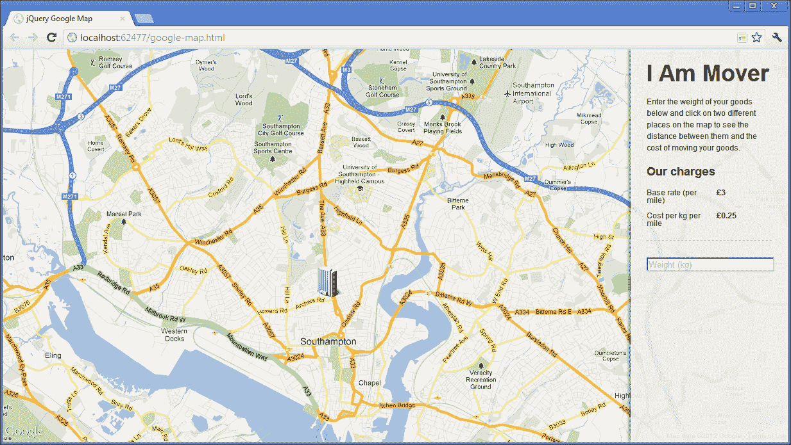
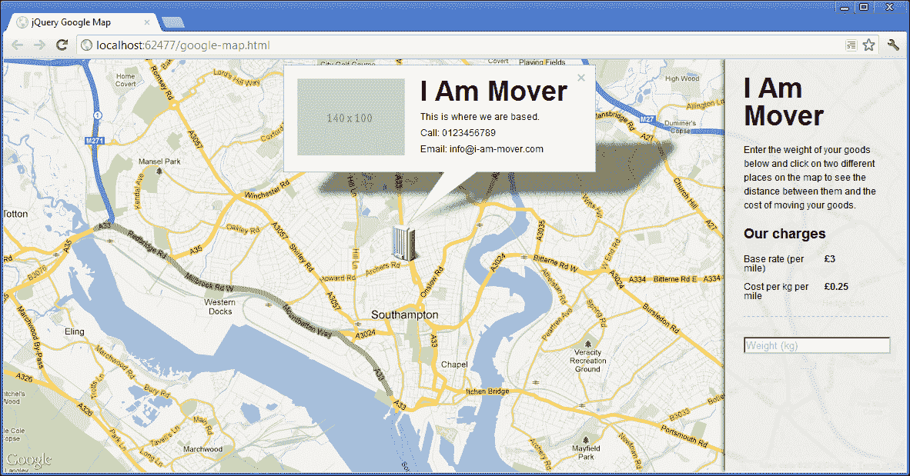
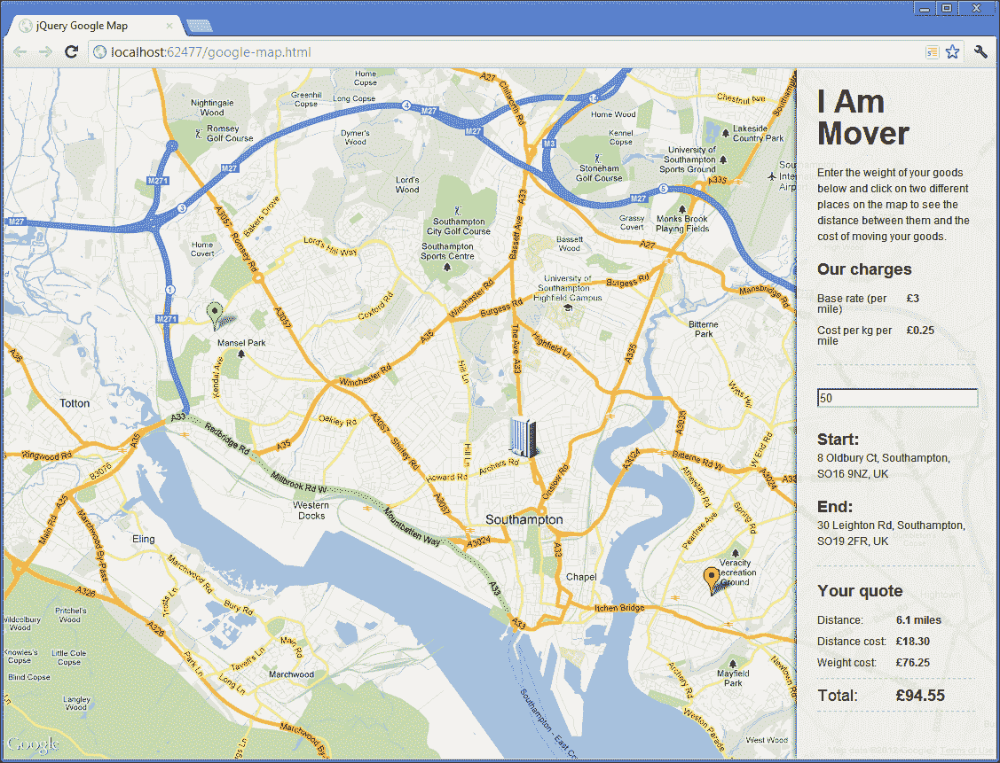

# 第三章：一个交互式的 Google 地图

在这个项目中，我们将创建一个与 Google 最新 API 版本配合工作的高度交互式 Google 地图，以生成带有自定义覆盖层和标记、地理编码地址以及计算距离的地图。我们还将看看如何使用谷歌和 jQuery 事件处理程序的组合来保持我们的简单 UI 与地图上添加的位置同步。

# 任务简报

出于本项目的目的，我们将有一个场景，需要为一个将物品从一个地方运送到另一个地方的公司构建一个基于地图的应用程序。他们希望客户可以访问一个页面，通过点击地图上的不同区域来计算运输某物品从一个地方到另一个地方的成本，并可能下单。

我们将了解如何监听地图上的点击事件，以便可以添加标记并记录每个标记的精确位置。然后我们可以更新 UI 以显示被点击位置的实际街道地址，并允许访问者根据两个地址之间的计算距离生成报价。

## 为什么这很棒？

谷歌地图是一个很棒的 API 来构建应用程序。已经具有高度交互性和丰富的功能，我们可以在其提供的坚实基础上构建稳健且高度功能性的应用程序。谷歌提供地图数据和地图的交互性，而 jQuery 用于构建 UI——这是一个胜利的组合。

我们最终将得到的页面将类似于以下屏幕截图：



## 你的高能目标 

该项目将分解为以下任务： 

+   创建页面和界面

+   初始化地图

+   使用自定义覆盖层显示公司总部位置

+   捕获地图上的点击事件

+   更新 UI，显示起始位置和终点位置

+   处理标记重新定位

+   考虑权重因素

+   显示预计距离和费用

## 任务清单

我们需要链接到由谷歌提供的脚本文件，以初始化地图并加载 API。我们还可以在此时创建项目中将要使用的新文件。

不用担心，我们不需要从谷歌获取 API 密钥之类的东西，这个项目可以直接通过链接使用脚本。

### 注意

谷歌地图 API 功能丰富且稳定，包含所有最知名的地图功能入口，包括街景、地理位置和导航服务。除了我们在此处使用的配置选项外，还有许多其他选项。有关更多信息，请参阅[`developers.google.com/maps/`](http://developers.google.com/maps/)上的文档网站。

首先，我们应该将模板文件的新副本保存到我们的根项目文件夹中，并将其命名为`google-map.html`。还创建一个`google-map.css`文件和一个`google-map.js`文件，并将它们分别保存在`css`和`js`文件夹中。

我们可以通过将以下`<link>`元素添加到页面的`<head>`中，直接在`common.css`的`<link>`元素后面，来链接到此示例的样式表：

```js
<link rel="stylesheet" href="css/google-map.css" />
```

### 提示

别忘了，我们每个项目都使用`common.css`，这样我们就可以专注于实际项目中需要的样式，而不用关注大多数网页所需的所有无聊的重置、浮动清除和其他常见 CSS 样式。

我们可以使用以下`<script>`元素直接在 jQuery 的`<script>`元素后面链接到 Google 的脚本文件以及我们刚刚创建的 JavaScript 文件：

```js
<script src="img/js?sensor=false">
</script>
<script src="img/google-map.js"></script>
```

在这个项目中，我们还将使用几张图片，`hq.png`和`start.png`，它们都可以在本书的附带代码下载中找到。你应该将它们复制到本地`jquery-hotshots`项目目录中的`img`目录下。我们的页面现在已经准备好进行第一个任务了。

# 创建页面和界面

在我们的第一个任务中，我们可以添加地图的不同容器，以及页面所需的初始 UI 元素。我们也可以添加一些基本的样式，将事物布局成我们想要的样子。

## 启动推进器

我们应该将以下元素添加到我们刚刚设置的`google-map.html`页面的`<body>`元素中：

```js
<div id="map"></div>
<div id="ui">
    <h1>I Am Mover</h1>
    <p>Enter the weight of your goods below and click on two 
    different places on the map to see the distance between 
    them and the cost of moving your goods.</p>
    <h3>Our charges</h3>
    <dl class="clearfix">
        <dt>Base rate (per mile)</dt>
        <dd>&pound;3</dd>
        <dt>Cost per kg per mile</dt>
        <dd>&pound;0.25</dd>
    </dl>
    <input id="weight" placeholder="Weight (kg)" />
</div>
```

为了进行一些基本的样式设置，并为初始化地图做好页面布局准备，我们可以将以下选择器和样式添加到我们刚刚创建的`google-map.css`文件中：

```js
#map { width:100%; height:100%; }
#ui { 
    width:16%; height:99.8%; padding:0 2%; 
    border:1px solid #fff; position:absolute; top:0; right:0;
    z-index:1; box-shadow:-3px 0 6px rgba(0,0,0,.5);
    background-color:rgba(238,238,238,.9); 
}
#ui h1 { margin-top:.5em; }
#ui input { width:100%; }
#ui dl { 
    width:100%; padding-bottom:.75em; 
    border-bottom:1px dashed #aaa; margin-bottom:2em; 
}
#ui dt, #ui dd { margin-bottom:1em; float:left; }
#ui dt { width:50%; margin-right:1em; clear:both; }
#ui dd { font-weight:bold; }
```

## 目标完成 - 迷你总结

在这个任务中，我们只是开始添加我们将在接下来的几个任务中正确填充的基础 HTML 元素。这是让示例页面开始运行并让项目启动的一个略微无聊但有些必要的第一步。

我们添加的第一个元素是 Google Maps API 将渲染地图瓦片到其中的容器。我们给它一个`id`为`map`，以便可以有效地选择它，但它一开始是完全空的。

下一个元素是各种 UI 元素的容器，示例需要它。它也有一个`id`为`ui`，以便我们的脚本可以轻松选择它，并且用 CSS 样式添加。

### 提示

**使用 ID 进行样式设置**

避免使用 ID 选择器添加 CSS 样式正逐渐成为一种普遍的最佳实践，例如**CSSLint**等工具建议不要使用它。

尽管使用类、元素或属性选择器的理由很有说服力，但为了简单起见，我们将在本书中的一些项目中使用它们。

CSSLint 是一个开源的 CSS 代码质量工具，它对源代码进行静态分析，并标记可能是错误或可能会给开发人员带来问题的模式。有关更多信息，请参见[`csslint.net/`](http://csslint.net/)。

在界面容器中，我们有一个虚构公司的名称，一些使用页面的基本说明，一个不同费用的列表，以及一个`<input>`元素用于输入权重。

我们在此任务中添加的大多数 CSS 仅仅是装饰性的，并且特定于此示例。如果需要不同的外观和感觉，它很容易会完全不同。我们已经让地图容器占据了页面的全宽度和高度，并且设计了界面，使其似乎漂浮在页面的右侧。

# 初始化地图

让一个可缩放和可平移的交互式 Google 地图运行起来只需要极少量的代码。在这个任务中，我们将添加这段代码，并设置稍后在脚本中将使用的一些变量。

## 为起飞做准备

在这个任务中，我们将初始化配置地图所需的变量，并调用 Google 地图 API。我们应该从添加标准 jQuery 封装到之前创建的空白 `google-map.js` 文件开始：

```js
$(function () {
    //all other code in here...
});
```

记住，`$(function () { … });` 结构是 jQuery 的 `document.ready` 事件处理程序的快捷方式。

## 启动推进器

在我们刚刚添加的封装器中，我们应该添加以下代码：

```js
var api = google.maps,
    mapCenter = new api.LatLng(50.91710, -1.40419), 
    mapOptions = {
        zoom: 13,
        center: mapCenter,
        mapTypeId: api.MapTypeId.ROADMAP,
        disableDefaultUI: true
    },
    map = new api.Map(document.getElementById("map"), mapOptions),
    ui = $("#ui"),
    clicks = 0,
    positions = [];
```

## 目标完成 - 迷你简报

在这个任务中，我们首先创建了一些需要初始化地图的变量。我们将在整个代码中处理 `google.maps` 命名空间，因此我们设置的第一个变量是为了方便起见而设置的顶级两个命名空间的内容。

拥有一个本地范围的副本，可以直接访问我们想要使用的实际 API，这将使我们的代码稍微更有效率，因为我们的代码更容易解析一个变量。而且，一开始输入时也会快得多。

Google 地图 API 使用的所有属性和方法都是命名空间的。它们都位于 `maps` 命名空间中，而 `maps` 命名空间本身位于 `google` 命名空间中。Google 在许多不同应用程序中使用了如此庞大的代码库，因此使用命名空间将所有内容隔离并组织起来是有意义的。

### 注意

有关 JavaScript 命名空间复杂性的深入讨论，请参阅 JavaScript 专家 *Addy Osmani* 的关于这个主题的优秀文章（[`addyosmani.com/blog/essential-js-namespacing/`](http://addyosmani.com/blog/essential-js-namespacing/)）。

接下来，我们存储我们想要将地图居中显示的纬度和经度。这是使用 Google 地图 API 的 `LatLng()` 方法完成的，该方法接受两个参数，纬度和经度值，并返回一个用于其他 API 方法的 `LatLng` 对象。请注意我们如何使用本地的 `api` 变量调用 `LatLng` 构造函数。

然后，我们可以创建一个对象字面量，其中包含我们的地图将需要的一些配置选项。这些选项包括缩放级别、地图应该居中的位置、地图类型，以及一个禁用默认地图类型和缩放/平移控件的选项。我们可以使用 `mapCenter` 中包含的 `LatLng` 对象作为 `center` 配置选项。

然后，我们使用地图 API 的`Map()`构造函数创建一个新的地图实例。这个函数接受两个参数：第一个是地图应该呈现的 DOM 元素，第二个是包含我们想要设置的配置选项的对象文字。

第一个参数需要一个真正的 DOM 元素，而不是一个用 jQuery 包装的 DOM 元素。因此，虽然我们可以使用 jQuery 从页面中选择元素，然后提取原始的 DOM 元素，但更有效的方法是使用 JavaScript 的原生`getElementById()`函数来检索我们在上一个任务中添加到页面中的地图容器，并将其传递给`Map()`构造函数。

接下来，我们缓存一个用于 UI 容器的 jQuery 选择器，以便我们可以重复地从页面中访问它，而不必每次都从 DOM 中选择它，并定义一个名为`clicks`的变量，我们将用它来记录地图被点击的次数。我们需要在顶层函数范围内定义它，以便我们可以在代码中后续的点击处理程序中引用它。

最后，我们在变量`positions`中添加一个空的数组文字，以便在需要存储地图上不同区域时稍后填充。数组需要在顶层函数范围内，以便我们在后面的代码中从不同的事件处理程序中访问它。

# 显示公司总部及自定义叠加层

在这个任务中，我们将在地图上直接放置公司总部，通过添加一个自定义标记和叠加层，提供一些关于公司的基本信息，也许还有场所的图片。

## 准备升空

在这个任务中，我们将涵盖以下子任务：

+   在地图上添加一个标记

+   添加一个包含有关公司信息的隐藏元素

+   在新标记被单击时添加一个自定义叠加层以显示公司信息

+   在标记被单击时添加一个单击处理程序来显示叠加层

## 启动推进器

在上一个任务中添加的变量后面，可以通过以下简单的代码块实现在地图上添加自定义标记：

```js
var homeMarker = new api.Marker({
    position: mapCenter,
    map: map,
    icon: "img/hq.png"
});
```

要为我们的新标记创建信息叠加层，或者使用正确的谷歌术语，信息窗口，首先应该添加一个包含我们希望在叠加层中显示内容的 HTML 元素。我们可以在 UI 容器后面直接添加以下新的元素集合到`google-map.html`中：

```js
<div id="hqInfo">
    
    <h1>I Am Mover</h1>
    <p>This is where we are based.</p>
    <p>Call: 0123456789</p>  
    <p>Email: info@i-am-mover.com</p>
</div>
```

### 提示

我们再次使用`placehold.it`服务，这样我们就不必为这个示例内容担心获取或创建实际的图像。在快速创建原型时，这是一个很好的服务。

为了告诉地图新的信息窗口，我们可以使用以下代码，在`google-map.js`中`homeMarker`代码后直接添加：

```js
var infoWindow = new api.InfoWindow({
    content: document.getElementById("hqInfo")
});
```

我们还需要一些额外的 CSS 来样式化信息窗口的内容，并在需要时隐藏它。将以下代码添加到`google-map.css`的底部：

```js
body > #hqInfo { display:none; }
#hqInfo { width:370px; }
#hqInfo h1 { margin-bottom:.25em; line-height:.9em; }
#hqInfo p { margin-bottom:.25em; }
```

最后，我们可以添加一个简单的点击处理程序，使用以下代码，在刚刚在`google-map.js`中添加的`infoWindow`变量之后添加：

```js
api.event.addListener(homeMarker, "click", function(){
    infoWindow.open(map, homeMarker);
});
```

## 目标完成 - 小结

首先，我们定义了一个新的标记，使用的是 Google 的`Marker()`构造函数。这个函数接受一个参数，即定义标记不同属性的对象字面量。

我们将标记的`position`设置为地图的中心，以简化操作，尽管在定义其他标记时，您会看到任何`LatLng`对象都可以使用。我们还应该定义标记所属的地图，我们将其设置为包含地图实例的`map`变量。要指定用作标记的图像，我们可以提供一个相对路径的字符串格式给`icon`选项。

然后，我们向页面添加了一个新的容器，其中包含我们想要在自定义信息窗口中显示的信息。这里的内容并不重要；重要的是技术。我们还为信息窗口的内容添加了一些额外的样式。

为了将信息窗口添加到我们的地图实例中，我们使用了 Google 的`InfoWindow()`构造函数。这个方法也接受一个参数，再次是一个对象字面量，其中包含我们希望设置的选项。在这个示例中，我们只是将`content`选项设置为包含我们刚刚添加到页面上内容的元素。

这应该是一个实际的 DOM 元素，因此我们使用 JavaScript 的`document.getElementById()`来获取元素，而不是使用 jQuery 进行选择。

最后，我们使用 Google 的`addListener()`方法向地图添加了一个事件处理程序。该方法接受要附加事件处理程序的元素作为第一个参数，本例中为我们添加的标记；要监听的事件作为第二个参数；以及处理事件的回调函数作为第三个参数。该方法的签名与其他常见 JavaScript 库中找到的事件处理方法非常相似，尽管与 jQuery 中添加事件处理程序的方式略有不同。

在作为`addListener()`方法的第三个参数传递的匿名函数中，我们所做的就是调用我们信息窗口的`open()`方法。`open()`方法接受两个参数；第一个是信息窗口所属的地图，第二个是信息窗口添加到的位置，我们将其设置为我们的标记。

在这一点上，我们应该能够在浏览器中运行页面，单击我们的自定义标记，并将隐藏的`<div>`的内容显示在信息窗口中，如下面的截图所示：



# 捕获地图上的点击事件

在这个任务中，我们需要为地图添加一个点击处理程序，以便访问者可以设置其交通旅程的起点和终点。

## 启动推进器

首先，我们需要添加当地图被单击时将执行的函数。在上一个任务中添加的监听器之后，直接添加以下函数表达式：

```js
var addMarker = function (e) {

    if (clicks <= 1) {

        positions.push(e.latLng);

        var marker = new api.Marker({
            map: map,
            position: e.latLng,
            flat: (clicks === 0) ? true : false,
            animation: api.Animation.DROP,
            title: (clicks === 0) ? "Start" : "End",
            icon: (clicks === 0) ? "img/start.png" : "",
            draggable: true,
            id: (clicks === 0) ? "Start" : "End"
        });

        api.event.trigger(map, "locationAdd", e);

    } else {
        api.event.removeListener(mapClick);
        return false;
    }
}
```

然后，为地图上的单击附加一个触发此函数的监听器，我们可以在其后直接添加以下代码：

```js
var mapClick = api.event.addListener(map, "click", addMarker);
```

## 目标完成 - 小型简报

首先，我们添加了每次单击地图时将执行的函数。该函数会自动通过`addListener()`方法传递事件对象，其中包含了在地图上单击的坐标的`latLng`对象。

函数中的第一件事是将事件对象的`latLng`属性存储在我们的`positions`数组中。我们需要知道单击了哪两个位置，因此将它们都添加到我们的`positions`数组中很有用，并且该数组可以在整个代码中可见。

然后我们检查之前定义的`clicks`变量是否小于或等于`1`。如果是，我们继续使用 Google 的`Marker()`构造函数创建一个新的标记。之前在添加标记显示公司总部时我们已经使用了该构造函数，但这次我们设置了一些不同的属性。

我们将`map`属性设置为我们的地图实例，并将标记的`position`设置为事件对象中包含的`latLng`对象，该对象将匹配在地图上单击的点。

我们将为第一次单击使用绿色标记图像，表示旅程的起始点。我们将使用的图像已经有了自己的阴影，因此当添加第一个标记时，我们可以使用 JavaScript 三元运算符确定是否`clicks`等于`0`，然后将`flat`属性设置为`true`以禁用 Google 否则会添加的阴影。

我们可以轻松地添加一个漂亮的掉落动画，以使当地图被单击时新的标记掉落到位。动画采用弹跳的缓动效果，视觉上也很愉悦。动画使用`animation`属性进行设置，该属性使用`Animation` API 设置为`DROP`。

我们还可以设置标记的`title`，当光标悬停在上面时会显示，使用`title`属性。同样，我们使用一个简单的 JavaScript 三元运算符根据`clicks`变量的值设置`Start`或`End`字符串。

我们使用`icon`属性指定用于起始标记的图像的路径。当`clicks`不等于`0`时，我们只指定一个空字符串，这会导致添加默认的红色标记。

我们还将`draggable`属性设置为`true`，以使标记可拖动。这将允许用户根据需要修改旅程的起始位置或终点位置。稍后我们可以添加处理这一功能的代码。

接下来，我们可以使用谷歌的`event`API 来触发一个自定义事件。我们使用`trigger()`方法，指定`map`实例作为事件源对象，`locationAdd`作为我们自定义事件的名称，并将我们在`addMarker()`函数中使用的事件对象（存储在`e`中）作为参数传递给可能正在监听我们自定义事件的任何处理程序。我们在下一节中添加对此事件的处理程序。

最后，我们可以在标记上设置一个唯一的`id`属性，以便我们可以区分每个标记。当我们想要在标记拖动后更新我们的 UI 时，我们会用到这一点，稍后我们会讨论这一点。

这是我们在`clicks`变量仍小于或等于`1`的情况下想要做的一切。我们`addMarker()`函数中外部条件分支的第二个分支处理`clicks`大于`1`的情况。

在这种情况下，我们知道地图已经被点击了两次，所以当这种情况发生时，我们希望停止监听地图上的点击事件。我们可以使用`event`API 的`removeListener()`方法解除绑定我们的处理程序。该方法只需一个对`addListener()`方法返回的`eventListener`的引用。

当我们将地图上的点击事件绑定到我们的`addMarker`函数时，我们将返回的内容存储在`mapClick`变量中，这是传递给`removeListener()`方法的内容。

在这一点上，我们应该能够在浏览器中运行页面，并通过单击不同位置来向地图添加新标记。

## 机密情报

在这个任务中，我们使用了**函数表达式**，通过将事件处理程序分配给一个变量，而不是更熟悉的**函数声明**。这通常被认为是一个好习惯，虽然在这种情况下不是必需的，但养成这种习惯肯定是一个好习惯。想要全面理解为什么函数表达式通常比函数声明更好，请参阅*John Resig*的博客文章[`ejohn.org/blog/javascript-as-a-first-language/`](http://ejohn.org/blog/javascript-as-a-first-language/)。

# 使用起点和终点位置更新 UI

一旦两个标记已添加到地图上，我们希望在页面右侧的 UI 侧边栏中显示它们的位置，以便在计算行程费用时使用。

我们将希望显示每个点击位置的完整街道地址，并添加一个按钮，触发基于访问者在地图上选择的位置计算报价。

## 为起飞做准备

在上一个任务中，我们使用了谷歌的`trigger()`方法，以便在每次通过点击向地图添加新标记时触发一个自定义事件。在这个任务中，我们将为该自定义事件添加一个处理程序。

到目前为止，在这个项目中，我们几乎完全使用了谷歌的地图 API，除了在代码的其余部分中添加了最初的`document.load`包装器之外，几乎没有使用 jQuery。在项目的这一部分，我们将纠正这一点，启动 jQuery 来更新我们的用户界面。

## 启动推进器

我们的自定义 `locationAdd` 事件的处理程序应该如下所示，可以直接添加到上一个任务的 `mapClick` 变量后面：

```js
api.event.addListener(map, "locationAdd", function (e) {

    var journeyEl = $("#journey"),
        outer = (journeyEl.length) ? journeyEl : $("<div>", {
            id: "journey"
        });

    new api.Geocoder().geocode({
        "latLng": e.latLng }, 
        function (results) {

            $("<h3 />", {
                text: (clicks === 0) ? "Start:" : "End:"
            }).appendTo(outer);
            $("<p />", {
                text: results[0].formatted_address,
                id: (clicks === 0) ? "StartPoint" : "EndPoint",
                "data-latLng": e.latLng
            }).appendTo(outer);

            if (!journeyEl.length) {
                outer.appendTo(ui);
            } else {
                $("<button />", {
                    id: "getQuote",
                    text: "Get quote"
                }).prop("disabled", true).appendTo(journeyEl);
            }

            clicks++;
        });
});
```

因为我们将向页面添加一些新元素，所以我们还需要更新这个项目的样式表。在 `google-map.css` 的底部添加以下新样式：

```js
#journey { margin-top:2em; }
#journey h3 { margin-bottom:.25em; }
```

## 目标完成 - 小型总结

我们以与添加点击事件相同的方式为我们的自定义 `locationAdd` 事件添加事件处理程序，使用 Google 的 `addListener()` 方法。

在事件处理程序中，我们首先定义了一些变量。第一个是一个缓存的 jQuery 对象，表示显示起始点和终点的元素。

然后我们设置的下一个变量是两者之一。如果我们将第一个变量设置为 jQuery 对象的长度，我们知道页面上存在行程元素，所以我们只是存储对它的引用。如果它不存在，我们将创建一个新元素用作行程元素，并将其 `id` 设置为 `journey`。

当地图首次被点击时，行程元素不存在并将被创建。第二次点击地图时，该元素将存在，因此它将从页面中选择而不是被创建。

接下来我们使用 Google 的 `Geocoder()` API 的 `geocode()` 方法，它允许我们对 `latLng` 对象进行逆地理编码以获取街道地址。这个方法有两个参数。第一个是配置对象，我们可以用它来指定我们想要转换的 `latLng` 对象。

第二个参数是一个回调函数，一旦地理编码完成就会执行。这个函数会自动传递一个包含地址的 `results` 对象。

在这个回调函数中，我们可以使用 jQuery 创建新元素来显示地址，然后将它们附加到行程元素上。完整的街道地址在 `results` 对象的 `formatted_address` 属性中找到，我们可以将其设置为新元素之一的文本。我们还可以在此元素上设置一个 `id` 属性，以便在需要时可以轻松地通过编程选择它，并使用自定义的 `data-latLng` 属性存储位置的 `latLng` 对象。

`results` 对象还包含有关地址的一系列其他有用属性，因此一定要在您喜爱的基于浏览器的开发者工具包的对象浏览器中查看它。

如果行程元素不存在，我们可以将其附加到 UI 中以显示位置的地址。如果它存在，我们知道这是第二次点击，然后可以创建一个新的 `<button>`，该按钮可用于根据两个位置之间的距离生成报价。

我们使用 jQuery 的 `prop()` 方法禁用 `<button>` 元素来设置 `disabled` 属性。当 UI 中的 `<input>` 添加了重量后，我们可以稍后启用按钮。

一旦我们在 UI 中添加了显示行程起点和终点的新元素，我们就可以增加 `clicks` 变量，以便我们可以跟踪添加了多少个标记。

现在，当我们运行页面并点击地图两次以添加两个标记时，我们点击的点的地址应该显示在页面右侧的 UI 区域中。现在，我们还应该看到红色的结束标记，并且现在由于增加了 `clicks` 变量，我们只能添加两个标记。

# 处理标记重新定位

我们已经使我们的地图标记可拖动，因此我们需要处理标记拖动后的地址更改。这个任务将展示如何轻松完成。这只需要两个步骤：

+   将每个标记绑定到 `dragend` 事件上

+   为事件添加处理函数

## 启动推进器

首先，当创建标记时，我们需要将每个标记绑定到 `dragend` 事件上。为此，我们应该在 `addMarker()` 函数中添加以下突出显示的代码行，直接放在标记构造函数之后：

```js
var marker = new api.Marker({
    map: map,
    position: e.latLng,
    flat: (clicks === 0) ? true : false,
    animation: api.Animation.DROP,
    title: (clicks === 0) ? "Start" : "End",
    icon: (clicks === 0) ? "img/start.png" : "",
    draggable: true,
    id: (clicks === 0) ? "start" : "end"
});

api.event.addListener(marker, "dragend", markerDrag);

```

接下来，我们应该添加 `markerDrag()` 函数本身。这可以直接放在我们在上一个任务中添加的 `locationAdd` 处理程序之后：

```js
var markerDrag = function (e) {
    var elId = ["#", this.get("id"), "Point"].join("");

    new api.Geocoder().geocode({ 
        "latLng": e.latLng 
    }, function (results) {
        $(elId).text(results[0].formatted_address);
    });
};
```

## 目标完成 - 小型总结

在这个任务中，我们首先更新了 `addMarker()` 函数，将每个新的标记绑定到 `dragend` 事件上，该事件将在标记停止拖动时触发。我们将标记指定为 Google 的 `addListener()` 方法的第一个参数，该方法是要绑定到事件的对象。事件的名称 `dragend` 被指定为第二个参数，`markerDrag` 被指定为将处理事件的函数的名称。

然后，我们添加了 `markerDrag()` 作为函数表达式。因为它是一个事件处理程序，所以它将自动传递给事件对象，该对象再次包含我们需要传递给 `Geocoder()` 的 `latLng`。

在处理程序内，我们首先设置一个新变量，它将用作我们想要更新的 UI 元素的选择器。为了性能原因，我们使用 `array.join()` 技术来连接字符串，而不是将字符串连接在一起。我们连接的数组中的第一个和最后一个项目只是文本。

第二个项目将是一个字符串，其中包含 `start` 或 `end`，这取决于拖动了哪个标记。在我们的事件处理程序内部，这指的是标记，因此我们可以使用它获取我们在创建每个标记时添加的自定义 `id` 属性，从而允许我们更新 UI 中的正确元素。

一旦构造了选择器，我们就可以像之前一样使用 Google 的 `geocode()` 方法来获取街道地址，这将给我们带来标记拖动后的新地址。

在 `geocode()` 的回调函数内，我们使用刚刚创建的选择器来选择 UI 中的 `<p>` 元素，并将其文本内容更新为新的地理编码地址。

现在当我们查看页面时，我们应该能够像以前一样将标记添加到地图中，然后拖拽它们并在页面右侧的 UI 区域中看到新的地址。

# 考虑到重量

现在我们有了两个地址——旅程的起点和终点标记。访客现在只需要输入一个重量，我们就能计算并显示距离和费用。

## 启动推进器

在这项任务中，我们所需要做的就是为 UI 区域中的`<input>`元素添加一个处理程序，这样一旦输入了重量，`<button>`就会变得可点击。我们可以通过以下代码实现这一点，直接添加到上一个任务中的`markerDrag()`函数之后：

```js
$("#weight").on("keyup", function () {
    if (timeout) {
        clearTimeout(timeout);
    }

    var field = $(this),
        enableButton = function () {
            if (field.val()) {
                $("#getQuote").removeProp("disabled");
            } else {
                $("#getQuote").prop("disabled", true);
            }
        },
        timeout = setTimeout(enableButton, 250);
});
```

## 目标完成-迷你总结

我们可以使用 jQuery 的`on()`方法为用户生成的`keyup` DOM 事件添加事件处理程序。现在使用`on()`方法是在 jQuery 中附加事件处理程序的标准方法。旧的方法，如`live()`或`delegate()`现在已被弃用，不应再使用。

在事件处理程序内部，我们首先检查是否设置了一个超时，如果设置了，就清除它。

然后我们缓存了`<input>`元素的选择器，以便我们可以在`enableButton()`函数中看到它。我们再次添加`enableButton()`函数，这次是作为函数表达式。

这个函数的作用只是检查`<input>`元素是否有值，如果有，我们使用 jQuery 的`prop()`方法将`disabled`属性设置为`false`。如果没有值，我们再次通过将`disabled`属性设置为`true`来禁用它。最后，我们使用 JavaScript 的`setTimeout()`函数设置了一个超时，将`enableButton()`函数作为第一个参数传递给它。我们将`250`，或四分之一秒，作为超时长度。超时存储在`timeout`变量中，准备好在下次函数被执行时检查。

## 机密情报

我们在这里使用超时的原因是为了限制`enableButton()`函数被执行的次数。每输入一个字符后，函数就会被调用。

四分之一秒的延迟几乎是难以察觉的，但如果有人快速在字段中输入了一个长数字，它就会大大减少函数运行的次数。在函数内部，我们从页面中选择一个元素并创建一个 jQuery 对象。这并不太过于密集，而且在这个例子中我们可能甚至不需要担心它。但像这样使用超时是一个健壮的解决方案，可以帮助在频繁触发的事件处理程序内执行更加密集的操作时提供帮助。

我们本来可以只使用 jQuery 的`one()`方法来附加一个事件处理程序，它只是简单地启用`<button>`，然后自行删除。但是，这样就不允许我们在字段中输入的数字被移除后再次禁用`<button>`。

# 显示预计距离和费用

我们在这个项目中的最后一个任务是获取两个标记之间的距离并计算旅程的成本。一旦计算出来，我们可能也应该向访问者显示结果。

## 启动推进器

首先，我们应该为我们的`<button>`附加一个点击事件处理程序。在我们在上一个任务中添加的`keyup`事件处理程序之后，直接添加以下代码：

```js
$("body").on("click", "#getQuote", function (e) {
    e.preventDefault();

    $(this).remove();
});
```

接下来，我们可以获取两点之间的距离。在我们刚刚添加的`remove()`方法之后（但仍在点击处理程序函数内部），添加以下代码：

```js
new api.DistanceMatrixService().getDistanceMatrix({
    origins: [$("#StartPoint").attr("data-latLng")],
    destinations: [$("#EndPoint").attr("data-latLng")],
    travelMode: google.maps.TravelMode.DRIVING,
    unitSystem: google.maps.UnitSystem.IMPERIAL
}, function (response) {

});
```

现在我们只需要计算并显示成本，我们可以通过添加以下代码到我们刚刚添加的空回调函数来完成。首先我们可以添加我们需要的变量：

```js
var list = $("<dl/>", {
        "class": "clearfix",
        id: "quote"
    }),
    format = function (number) {
        var rounded = Math.round(number * 100) / 100,
            fixed = rounded.toFixed(2);

        return fixed;
    },
    term = $("<dt/>"),
    desc = $("<dd/>"),
    distance = response.rows[0].elements[0].distance,
    weight = $("#weight").val(),
    distanceString = distance.text + "les",
    distanceNum = parseFloat(distance.text.split(" ")[0]),
    distanceCost = format(distanceNum * 3),
    weightCost = format(distanceNum * 0.25 * distanceNum),
    totalCost = format(+distanceCost + +weightCost);
```

接下来我们可以生成用于显示计算出的数字的 HTML 结构：

```js
$("<h3>", {
    text: "Your quote",
    id: "quoteHeading"
}).appendTo(ui);

term.clone().html("Distance:").appendTo(list);
desc.clone().text(distanceString).appendTo(list);
term.clone().text("Distance cost:").appendTo(list);
desc.clone().text("£" + distanceCost).appendTo(list);
term.clone().text("Weight cost:")
            .appendTo(list);

desc.clone().text("£" + weightCost).appendTo(list); term.clone().addClass("total").text("Total:").appendTo(list);
desc.clone().addClass("total")
            .text("£" + totalCost)
            .appendTo(list);

list.appendTo(ui);
```

最后，我们可能应该为我们刚刚创建并添加到页面中的新元素添加一些额外的样式。在`google-map.css`的底部，添加以下新样式：

```js
#quoteHeading { 
    padding-top:1em; border-top:1px dashed #aaa; 
    margin-top:1em;
}
#quote dt { margin-right:0; }
#quote dd { width:50%; }
#quote .total { 
    padding-top:.5em; border-top:1px dashed #aaa; 
    margin-bottom:0; font-size:1.5em; 
}
```

## 目标完成 - 小结

我们首先使用 jQuery 的`on()`方法将点击事件处理程序绑定到页面的`body`上。这次我们使用了该方法的三个参数形式，其中第一个参数仍然是事件的名称，第二个参数是用于筛选事件的选择器，第三个参数是事件发生时触发的函数。

JavaScript 中的事件会通过它们的容器冒泡，并且当事件到达`body`时，它将被第二个参数用作筛选器过滤，并且只有当它是由与选择器匹配的元素分派时，函数才会被执行。在这个示例中，只有由`<button>`分派的事件才会触发该函数。

使用这种形式的`on()`方法为我们提供了一种使用强大的事件委托的方法，这使我们能够为可能存在也可能不存在的元素绑定事件。

在处理程序函数中，我们首先阻止了浏览器的默认行为。因为页面上没有`<form>`，所以不应该有任何默认行为，因此`<button>`没有什么可提交的。但是如果有人试图在一个通常包含页面上大多数甚至所有元素的`<form>`的 ASPX 页面上运行这个，它可能会以意想不到的方式行事。除非绝对必要，否则应始终使用`preventDefault()`。

然后我们从页面中移除了`<button>`。请注意，尽管事件处理程序绑定到了`<body>`，但处理程序函数内部的`this`对象仍指向触发事件的`<button>`元素。

然后我们使用了 Google 的另一个 API - `DistanceMatrixService()`，它允许我们在地图上计算两个或多个点之间的距离。因为我们不需要引用`DistanceMatrixService()`构造函数返回的对象，所以我们可以直接将`getDistanceMatrix()`方法链接到它上面。

这个方法有两个参数，第一个参数是一个配置对象，第二个参数是一个方法返回时执行的回调函数。回调函数会自动传入一个包含响应的对象。

我们使用第一个参数来设置几个配置选项。`origins`和`destinations`选项都采用了数组的形式，其中每个数组中的每个项目都是一个`latLng`对象。我们可以使用自定义的`data-latLng`属性，它在显示地址时设置，很容易地获取这两个标记的`latLng`对象。

我们还将`travelMode`选项设置为通过道路行驶的距离，使用`google.maps.TravelMode.DRIVING`常量，并将`unitSystem`选项设置为`google.maps.UnitSystem.IMPERIAL`，以获得英里而不是公里的距离，除了因为我是英国人，习惯使用英里之外，并没有其他原因。

我们提供的回调函数会自动传入一个结果对象，其中包含了距离矩阵返回的结果。回调函数的前半部分涉及创建变量和计算值。函数的后半部分处理显示已计算的信息。

我们首先创建一个新的`<dl>`元素，并给它一个`class`，这是在`common.css`样式表中需要使用的，以及一个`id`属性，主要用于装饰性样式。然后我们添加一个简单的函数表达式，接收一个数字作为参数，对其四舍五入，然后将其修正为两位小数，最后返回它。我们将使用这个函数来确保我们的财务数字符合要求的格式。

我们还创建了一个新的`<dt>`元素和一个新的`<dd>`元素，可以根据需要克隆多次，而无需反复创建新的 jQuery 实例，然后使用 jQuery 的`val()`方法存储在重量文本字段中输入的值。

接下来，我们从传递给回调函数的对象中提取`distance`属性。它的结构可能看起来复杂，因为我们实际上感兴趣的对象被埋在一个多维数组中，但正如方法的名字所暗示的，它能够返回多个起点和目的地的复杂结果矩阵。

在此之后，我们连接一个字符串，其中包括我们刚刚存储的`distance`对象的`text`属性和完整的单词`miles`。距离矩阵以`mi`的形式返回英里的结果，因此我们在值的末尾添加字符串`les`。

然后我们通过在英里数量和字母`mi`之间进行拆分来获取数字距离。JavaScript 的`split()`函数会返回一个包含字符串部分的数组，该数组包含了拆分字符的前端，但不包括拆分字符和拆分字符后的部分。我们只对数组中的第一个项目感兴趣，并且使用 JavaScript 的`parseFloat()`函数来确保这个值绝对是一个数字而不是一个字符串。

现在我们有足够的信息来实际计算旅程的费用了。我们指定了每英里的费用为 £3，所以我们将距离乘以 `3`，然后将结果传递给我们的`format()`函数，以便数字的格式正确。

我们还可以通过非常类似的方式计算每千克每英里的费用，首先将重量乘以每千克的成本，然后乘以距离。再次将这个数字传递给我们的`format()`函数。然后，我们可以通过将这两个数字相加来计算总费用。我们一直在使用的数字变成了字符串。为了解决这个问题，我们仍然可以使用我们的`format()`函数，但是我们需要使用`+`字符作为我们要添加的每个值的前缀，这将强制它们成为数字而不是字符串。

一旦我们创建了要显示的图形，我们就可以创建我们需要用来显示它们的新元素，首先是一个漂亮的标题，以帮助澄清我们正在添加到 UI 的新信息集。

然后我们可以创建包含每个标签和图形的`<dt>`和`<dd>`元素的克隆。一旦这些被创建，我们就将它们附加到我们创建的`<dl>`元素上，然后最终将新列表作为一个整体附加到 UI 上，如下图所示：



## 机密情报

机敏的你会注意到，我们在这个例子中使用的数值舍入解决方案并不那么健壮，并且不会像真实处理实际货币所需的那样准确（或正确地）舍入所有分数。

JavaScript 不像其他一些语言那样优雅地处理浮点运算，因此创建一个完美的舍入系统，100% 正确地舍入是超出了本书范围的。

对于那些感兴趣的人，stackoverflow 网站上发布了一些极具启发性的关于 JavaScript 货币格式化的问题的答案。例如，参见：[`stackoverflow.com/questions/149055/how-can-i-format-numbers-as-money-in-javascript`](http://stackoverflow.com/questions/149055/how-can-i-format-numbers-as-money-in-javascript)。

# 任务完成

在这个项目中，我们涵盖了大量的 Google 和 jQuery 功能。具体来说，我们研究了以下主题：

+   使用`Marker()`和`InfoWindow()`构造函数将标记和覆盖物添加到地图上。

+   对地图驱动事件的反应，比如点击标记或标记拖动。事件处理程序使用`google.maps`API 的`addListener()`方法附加。我们还看到如何使用`trigger()`方法触发自定义事件。

+   使用 Google 的服务来操作地图生成的数据。我们使用的服务是`Geocoder()`，用于反向地理编码地图上每个点击的点的`latLng`，以获取其地址，以及`DistanceMatrixService()`，用于确定点之间的距离。

+   利用 jQuery 的事件功能，使用`on()`方法添加标准事件和委托事件，以便检测 UI 的不同部分与之交互的情况，比如点击`<button>`或输入`<input>`。

+   使用 jQuery 强大的 DOM 操作方法来更新 UI，包括地址和报价。我们使用了一系列这些方法，包括`clone()`，`html()`，`text()`和`prop()`，既选择又创建新元素。

# 你准备好全力以赴了吗？一个火热的挑战

在这个例子中，访客只能生成一份报价。一旦点击`getQuote` `<button>`，结果就会显示，不再允许进一步交互。为什么不在生成报价时添加一个重置按钮到 UI？访客可以清除报价和地图上的标记，从头开始。
