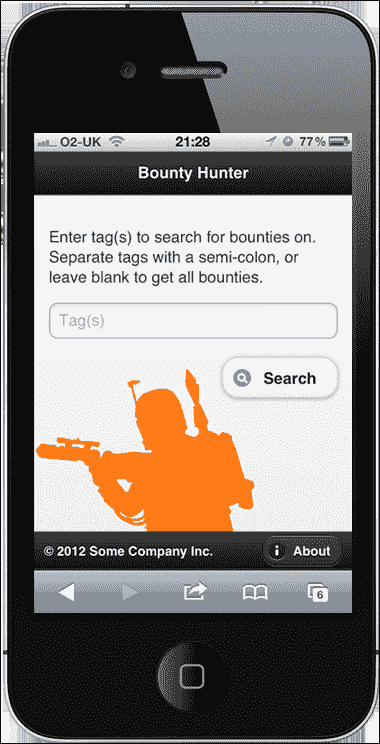
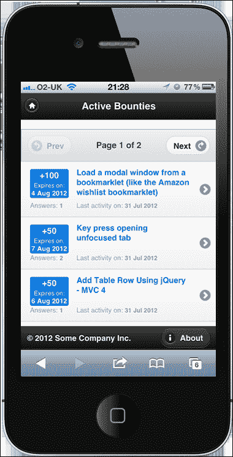
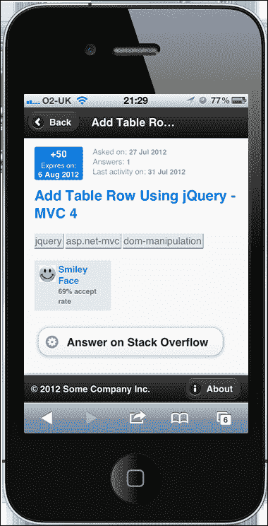

# 第四章：jQuery Mobile 单页面应用程序

jQuery mobile 是一个令人兴奋的项目，它将 jQuery 的强大功能带入了手持设备和移动体验的世界。与 jQuery UI 类似，它在 jQuery 核心基础上构建和扩展了一系列 UI 小部件和辅助工具。在这种情况下，这些小部件被优化用于移动显示和触摸界面。

我们还将使用 JsRender，这是 jQuery 的官方模板解决方案，也是 jQuery 模板插件 `tmpl` 的后继者。

# 任务简报

在本项目中，我们将构建一个简单的应用程序，该应用程序寻找在堆栈溢出上有未颁发奖励的问题。我们将其称为赏金猎人。它将只包含一些单独的页面，但将被制作成感觉像是一个本地应用程序，而不是一个标准的网站。

虽然使用 jQuery Mobile 构建的站点和应用程序在笔记本电脑或台式机上运行得很好，但 jQuery Mobile 坚持采用先移动的理念，先构建最小的布局。

这是我们在整个项目中将重点关注的布局。如果您没有智能手机或其他功能强大的移动设备，我们将构建的示例应用程序仍将在普通桌面浏览器中正常工作。

在本项目中，我们将构建的应用程序将如下截图所示：



## 它为什么如此令人敬畏？

jQuery Mobile 提供了对所有主要现代智能手机和平板电脑的全面支持，并且非常重要的是提供了一致性。它还向更广泛范围的常见但可能更老、功能更差的移动设备提供了有限支持。它建立在 jQuery 本身稳固的基础之上，并且从 jQuery UI 那里借鉴了许多最佳实践，特别是在小部件如何初始化和配置方面。

jQuery Mobile 提供了两种小部件初始化的方式；我们可以使用广泛的 HTML5 `data-` 属性系统，它将自动触发小部件的初始化，无需任何额外的配置，或者我们可以动态创建小部件，并纯粹通过脚本调用它们。

这两种技术各有优缺点，我们将在本项目中学习这两种技术，这样您就可以决定哪种方式最适合您。

## 您的炫目目标

这些是本项目将分解成的任务：

+   构建欢迎屏幕

+   添加第二个页面

+   创建脚本包装器

+   获得一些赏金

+   添加一个 JsRender 模板

+   构建列表视图

+   构建一个项目视图

+   处理分页

## 任务清单

jQuery Mobile 网站提供了一个页面模板，可用作使用该框架进行开发时的起点。我们可以将该模板用作此项目的基础。要设置，请访问 [`jquerymobile.com/demos/1.2.0/docs/about/getting-started.html`](http://jquerymobile.com/demos/1.2.0/docs/about/getting-started.html)。

复制“创建基本页面模板”部分显示的模板，并将其另存为 `bounty-hunter.html` 在我们的主工作目录中。 此模板包含我们启动所需的一切。

在这一点上，我们还应该链接到 JsRender； 在我们刚刚保存的模板中的链接到 jQuery Mobile 的 `<script>` 元素之后直接添加以下代码：

```js
<script src="img/jsrender.js">
</script>
```

### 注意

在撰写时，当前版本的 jQuery Mobile 与 jQuery 1.9 不兼容。 我们将从 jQuery Mobile 网站获取的模板将链接到兼容版本的 jQuery，并且一旦 jQuery Mobile 达到 1.3 里程碑，1.9 支持将很快可用。

为了测试我们的移动应用，我们还应该为该项目使用 Web 服务器，以便使用适当的 `http://` URL 而不是 `file:///` URL 查看测试页面。 您可能已经在计算机上安装了开源 Web 服务器，例如 Apache，如果有，那就没问题了。

如果您尚未安装和配置 Web 服务器，我建议下载并安装微软的 **Visual Web Developer Express**（**VWDE**）。 这是微软行业标准 IDE Visual Studio 的免费版本，除了包含内置的开发 Web 服务器外，还是一个非常强大的 IDE，具有 JavaScript 和 jQuery 的 Intellisense 支持以及一系列面向前端开发者的功能。

对于更喜欢开源软件的开发人员，Apache Web 服务器以及 PHP 和 MySQL 可以安装在 Mac 和 Windows 系统上。 为了使安装和配置更加简单，已经创建了一系列软件包，这些软件包一起安装软件并自动配置，例如 XAMPP。

### 注意

VWDE 可以通过访问 [`www.microsoft.com/visualstudio/en-us/products/2010-editions/visual-web-developer-express`](http://www.microsoft.com/visualstudio/en-us/products/2010-editions/visual-web-developer-express) 进行安装。

XAMPP 下载可在 [`www.apachefriends.org/en/xampp.html`](http://www.apachefriends.org/en/xampp.html) 获取。

# 构建欢迎页面

许多应用程序都有一个欢迎或主屏幕，用户可以返回以选择常见操作。 在这个项目的第一个任务中，我们将构建欢迎屏幕，它将包含一些简单的页面家具，如标题，页脚，徽标，并将包含一个搜索框和按钮，用于触发对 Stack Exchange API 的调用。

## 准备起飞

在此时，我们可以创建项目中将使用的其他资源。 我们应该在 `css` 文件夹中创建一个名为 `bounty-hunter.css` 的新样式表，以及一个名为 `bounty-hunter.js` 的新脚本文件。

我们应该在页面的 `<head>` 中添加一个 `<link>` 元素来链接样式表。 以下代码应该直接添加在 jQuery 移动样式表之后（jQuery 移动 `<script>` 元素之前）：

```js
<link rel="stylesheet" href="css/bounty-hunter.css" />
```

我们可以将 `<script>` 元素添加到通常的位置，就在关闭的 `</body>` 标签之前：

```js
<script src="img/bounty-hunter.js"></script>
```

### 注意

由于 jQuery Mobile 提供了自己的基线样式，其中包括重置和排版默认值，因此在此示例中，我们不需要链接到我们的`common.css`文件。

## 启动推进器

我们下载的 jQuery Mobile 模板包含了大多数 jQuery Mobile 页面应该构建的推荐基本结构。我们将使用推荐的结构，但会向现有标记添加一些额外的属性。

我们应该在`bounty-hunter.html`中具有`data-role="page"`属性的`<div>`元素中添加一个`id`属性；将`id`属性设置为`welcome`：

```js
<div data-role="page" id="welcome">
```

接下来，我们应该修改原始标记，使其显示如下。首先，我们可以添加一个标题区域：

```js
<div data-role="header">
    <h1>Bounty Hunter</h1>
</div>
```

接下来，我们可以直接在标题区域后面添加主要内容区域：

```js
<div data-role="content">
    <p>
        Enter tag(s) to search for bounties on. 
        Separate tags with a semi-colon, or leave blank to get
        all bounties. 
    </p>
    <div class="filter-form">
        <label for="tags" class="ui-hidden-accessible">
            Search by tag(s):
        </label>
        <input id="tags" placeholder="Tag(s)" />
        <button data-inline="true" data-icon="search">
            Search
        </button>
    </div>
</div>

```

最后，我们可以在主要内容区域后面添加一个页脚区域：

```js
<div data-role="footer" data-position="fixed" 
    data-id="footer">

    <small>&copy; 2012 Some Company Inc.</small>
    <a href="bounty-hunter-about.html" data-icon="info" 
        data-role="button" data-transition="slide">About</a>

</div>
```

我们还可以为欢迎屏幕添加一些样式。将以下选择器和规则添加到`bounty-hunter.css`中：

```js
.filter-form .ui-btn { margin:10px 0 0 0; float:right; }

.ui-footer small { display:block; margin:10px; float:left; }
.ui-footer .ui-btn { margin:2px 10px 0 0; float:right; }
```

## 目标完成 - 迷你总结

首先，我们更新了具有`data-role="header"`属性的容器`<div>`内部`<h1>`元素中的文本。

然后我们向内容容器添加了一些内容，包括一段简介文字和一个容器`<div>`。容器内部我们添加了`<label>`、`<input>`和`<button>`元素。

出于可访问性原因，jQuery Mobile 建议为所有`<input>`元素使用具有有效`for`属性的`<label>`元素，因此我们添加了一个，但然后使用`ui-hidden-accessible`类将其隐藏。这将允许辅助技术仍然看到它，而不会在视觉上混淆页面。

`<input>`只是一个带有`id`属性的简单文本字段，用于从脚本中轻松选择，以及一个`placeholder`属性，该属性将指定的文本添加到`<input>`内部作为占位符文本。这很好地用于在标签被隐藏时提供视觉提示，但在较旧的浏览器中可能不受支持。

`<button>`元素具有几个自定义的 jQuery Mobile`data-`属性，并且在页面初始加载时将由框架自动增强。jQuery Mobile 根据元素类型和任何`data-`属性自动增强一系列不同的元素。增强通常包括将原始元素包装在容器中或添加其他附加元素以与之并列。

`data-inline="true"`属性将包围`<button>`的容器设置为`inline-block`，以便它不会占据视口的全部宽度。`data-icon="search"`属性为其添加了一个搜索图标。

我们在原始模板中为容器`<div>`元素添加了一些额外的`data-`属性，其中包括`data-role="footer"`属性。`data-position="fixed"`属性与`data-id="footer"`属性配合使用，将元素固定在视口底部，并确保在页面更改时不进行过渡。

在页脚容器内，我们添加了一个 `<small>` 元素，其中包含一些虚假的版权信息，通常在网页的页脚中找到。我们还添加了一个新的 `<a>` 元素，链接到另一个页面，我们将在下一个任务中添加。

该元素还具有几个自定义 `data-` 属性。`data-icon="info"` 属性为增强元素提供了一个图标。`data-role="button"` 属性通过框架触发增强，并赋予这个简单链接类似按钮的外观。`data-transition="slide"` 属性在导航到新页面时使用幻灯片转换。

最后，我们为这个项目的样式表添加了一些基本的样式。我们将搜索按钮浮动到右边，并通过 jQuery Mobile 更改了给它的边距。样式是使用我们添加到容器的类和框架添加的类添加的。我们需要同时使用这两个类来确保我们的选择器比框架使用的选择器更具特异性。

我们还对页脚元素进行了样式设置，使它们左右浮动并按需定位。我们必须再次击败 jQuery Mobile 主题中默认选择器的特异性。

到目前为止，我们应该能够在浏览器中运行页面，并在顶部和底部分别看到带有标题和页脚的主页，简单的搜索表单以及给应用程序提供基本身份的大橙色图像。

## 机密情报

jQuery Mobile 是建立在自定义 `data-` 属性系统之上的，我们可以给元素添加特定属性，并让框架基于这些属性初始化小部件。这个自定义 `data-` 属性框架并非强制性；如果需要的话，我们可以手动初始化和配置小部件。

但是使用属性很方便，让我们能够专注于添加我们想要的行为的自定义脚本代码，而不用担心我们想要使用的 jQuery Mobile 小部件的设置和初始化。

# 添加第二个页面

在这个任务中，我们将添加一个页面，**关于** 超链接，我们在欢迎页面的页脚容器中添加了链接到它。这使我们能够通过仅通过 `data-` 属性系统配置来体验 jQuery Mobile 转换的效果。

### 注意

有关更多信息，请参阅 jQuery Mobile `data-` 属性参考文档：[`jquerymobile.com/demos/1.2.0/docs/api/data-attributes.html`](http://jquerymobile.com/demos/1.2.0/docs/api/data-attributes.html)。

## 为起飞做准备

保存一个新的 jQuery Mobile 页面模板，我们在上一个任务中使用过，但这次将其命名为 `bounty-hunter-about.html`，并将其保存在主项目目录中（与 `bounty-hunter.html` 页面并列）。

我们还需要像之前一样链接到我们的 `bounty-hunter.css` 文件，我们的 `bounty-hunter.js` 文件以及 JsRender。

### 注意

有关 JsRender 的更多信息，请参阅文档：[`github.com/BorisMoore/jsrender`](https://github.com/BorisMoore/jsrender)。

## 启动推进器

在我们的新`bounty-hunter-about.html`页面中，将`<div>`内的标记更改为带有`data-role="page"`的以下内容：

```js
<div data-role="header">
    <a href="bounty-hunter.html" data-icon="home" 
    data-shadow="false" data-iconpos="notext" 
    data-transition="slide" data-direction="reverse" 
    title="Home"></a>

    <h1>About Bounty Hunter</h1>
</div>

<div data-role="content">
    <p>
        Bounty Hunter is an educational app built for the  
        jQuery Hotshots book by Dan Wellman
    </p>
    <a href="http://www.danwellman.co.uk">
        danwellman.co.uk
    </a>
</div>

<div data-role="footer" data-position="fixed" 
    data-id="footer">

    <small>&copy; 2013 Some Company Inc.</small>
    <a class="ui-disabled" href="#" data-icon="info" 
        data-role="button">About</a>

</div>
```

## 目标完成 - 迷你总结

这一次，除了在标题容器内的`<h1>`中设置一些不同的文本之外，我们还添加了一个新链接。这个链接返回到应用程序的欢迎画面，并使用了几个自定义`data-`属性。

`data-icon`，如前所述，设置了按钮应该使用的图标。我们可以使用`data-shadow="false"`禁用应用于图标外部容器元素的默认阴影，并设置`data-iconpos="notext"`属性使按钮成为只有图像的按钮。

我们还指定了`data-transition="slide"`属性，这样页面就可以很好地转换回欢迎页面，但是这次我们还设置了`data-direction="reverse"`属性，这样页面看起来就好像是*倒退*（也就是说，它以相反的方向滑动）到主页。因为我们将此链接放在`<h1>`元素之前，所以它将自动按照框架的设置向左浮动。

我们在`content`容器中添加了一些基本内容。这并不重要，正如您所看到的，我在这里为我的个人网站做了一些无耻的宣传。然而，这个外部链接并不完全无用，因为它表明，当一个链接以`http://`作为前缀时，jQuery Mobile 知道它是一个外部链接，并且不会劫持点击并尝试将其转换成视图。

您会注意到页脚容器与之前的`data-`属性相同，包括相同的`data-id="footer"`属性。这就是页脚容器具有持久性的原因。当页面转换到视图时，页脚将出现在转换区域之外，并固定在页面底部。

我们稍微修改了页脚容器中的`<a>`元素。我们删除了`data-transition`属性，并改为添加`ui-disabled`类。我们还将`href`更改为简单的哈希。因为我们已经在关于页面上，所以**关于**链接将不会做任何事情，所以我们将其禁用以避免在点击时重新加载页面。

## 机密情报

jQuery Mobile 通过劫持任何相对链接来添加它美丽的页面到页面的过渡效果。当点击相对链接时，jQuery mobile 将通过 AJAX 获取页面，将其插入到当前页面的 DOM 中，并将其转换为视图。

通常在使用 jQuery Mobile 站点时，您永远不会离开起始页面，因为框架会悄悄地劫持同域链接，并动态地将内容插入页面。因此，您可能认为每个页面都不需要链接到所有的 CSS 和脚本资源。

然而事实并非如此 - 如果有人直接访问内部页面会发生什么呢？或者如果点击外部链接后，访问者使用浏览器的返回按钮返回呢？在这两种情况下，他们将看到一个未增强、失效的页面，看起来和预期看到的页面完全不一样。

现在我们应该能够重新加载主页，然后点击页脚的**关于**按钮，看到关于页面。

# 创建脚本包装器

我们不会使用 jQuery 的`$(document).ready() { }`函数（或`$(function() { })`快捷方式）在页面加载完成时执行我们的代码。然而，我们仍然需要保护我们的顶层变量和函数免受全局范围的影响，因此我们仍然需要某种包装器。在这个任务中，我们将创建这个包装器，以及我们的顶层变量。

## 启动推进器

在空的`bounty-hunter.js`文件中，我们可以首先添加以下代码：

```js
(function() {

    var tags = "",
          getBounties = function(page, callback) {

        $.ajax({
            url: "https://api.stackexchange.com/2.0/questions/featured",
            dataType: "jsonp",
            data: {
                page: page,
                pagesize: 10,
                tagged: tags,
                order: "desc",
                sort: "activity",
                site: "stackoverflow",
                filter: "!)4k2jB7EKv1OvDDyMLKT2zyrACssKmSCX
                eX5DeyrzmOdRu8sC5L8d7X3ZpseW5o_nLvVAFfUSf"
            },
            beforeSend: function () {
                $.mobile.loadingMessageTextVisible = true;
                $.mobile.showPageLoadingMsg("a", "Searching");
            }
        }).done(function (data) {

            callback(data);

        });
    };

}());
```

## 目标完成 - 小型总结

我们的脚本包装器由一个自执行的匿名函数组成（或者如果你喜欢的话，它也可以是一个立即调用的函数表达式）。这个外部函数被括号包裹着，并且在末尾有一个额外的方括号对，它使匿名函数立即执行并立即返回。这是一个已经在大型应用程序中经常使用的 JavaScript 模式。

这创建了一个封闭环境，将其中的所有代码封装起来，并使它远离全局命名空间，这使得代码更健壮，当与其他库或插件一起使用时更不容易出错或失败。

### 注意

如果你不确定闭包是什么，或者它能做什么，可以在 Stack Overflow 网站上找到关于它的很好的讨论（[`stackoverflow.com/questions/111102/how-do-javascript-closures-work`](http://stackoverflow.com/questions/111102/how-do-javascript-closures-work)）。

它也允许我们几乎在文档加载完成后立即运行代码。因为它所在的`<script>`元素就在`<body>`的底部，所以它将等到浏览器解析完页面的其余部分后才会被执行。

在匿名外部函数中，我们首先定义了一些变量。第一个叫做`tags`，将在项目的整个过程中在各种函数中使用，所以它需要在任何地方都能访问。最初它可以被设置为空字符串。

接下来的变量是一个名为`getBounties()`的函数，我们同样在顶层范围内定义它，这样它就可以在代码的其他地方被调用而不会出现问题。我们将使用这个函数在应用程序的生命周期的不同节点发出 AJAX 请求，而且大多数请求的参数都不需要更改。

我们使用 jQuery 的`ajax()`方法向 Stack Exchange API 发出 AJAX 请求。这个方法是 jQuery 的默认用于发出 AJAX 请求的方法，也是该库的辅助方法（如`getJSON()`）所代理的方法。

`ajax()` 方法接受一个对象字面量，该字面量可用于配置 jQuery 支持的任何标准 AJAX 选项，以控制请求的执行方式。

`url` 属性设置了请求所发出的 URL，我们将其设置为我们想要使用的 Stack Exchange API 的入口点。我们将 `dataType` 设置为 `JSONP`，以便我们可以从 Stack Exchange 域获取数据，而不触发浏览器的跨域安全限制。

**JSON**（**JavaScript 对象表示法**）是一种数据格式，其语法与 JavaScript 中的对象字面量非常相似，用于在不同平台或系统之间交换数据。**JSONP**（带填充的 JSON）是一种技术，它动态将新脚本注入页面，将 JSON 数据暴露给浏览器中的 JavaScript 解析器。这是必要的，因为浏览器的同源安全策略限制了数据可以从当前域加载的域。

Stack Exchange API 可以通过使用标准查询字符串参数以非常特定的方式配置，并过滤我们收到的数据，以启用或禁用特定功能。我们可以使用 jQuery 的 `data` AJAX 属性来添加我们希望设置的查询字符串参数。

### 注意

有关 Stack Exchange API 的更多信息，请参阅[`api.stackexchange.com/`](https://api.stackexchange.com/) 的文档。

我们使用 `page` 参数指定我们想要获取结果的哪一页，这将作为参数传递给函数。我们将返回的问题数量设置为 `10`，以将一次显示的数据量分页。这是使用 `pagesize` 参数设置的。

`tagged` 参数使用标签变量的值，我们可以在项目后期需要时操纵它。如果我们发送此参数而没有值，Stack Exchange API 不会抱怨，因此我们可以安全地设置它，而不管实际上是否有任何标签。

我们指定希望结果按降序排列，并按活动排序，因此最近活动的问题将首先列出。`site` 设置为 `stackoverflow`，以便仅从 Stack Exchange 网站的整个网络中接收问题。

最后一个配置属性是我已经在 Stack Exchange 上创建并保存的预定义过滤器。当浏览任何 API 方法时，都包含了用于执行此操作的工具。过滤器的目的是精确控制在响应中返回哪些字段，以确保我们不会收到比我们需要的更多数据。

### 注意

在此示例中，我们仅匿名使用 Stack Exchange API。对于完全生产就绪、供公众使用的应用程序，我们必须始终在 Stack Applications 中注册应用程序，并在进行任何请求时使用 API 密钥。

我们想要的一些字段未包含在默认过滤器中（如果在发出请求时未提供过滤器，则使用默认过滤器），而返回了许多我们不需要的字段。我们将在此处使用的过滤器仅提供了我们此项目所需的字段，并且不需要身份验证即可使用。

这些是我们需要为此请求设置的大多数 AJAX 选项；目前不知道的选项可以在调用函数时传递。我们将在下一个任务中看到如何做到这一点。

我们可以利用 jQuery 的`beforeSend`AJAX 事件，在发出请求之前直接显示 jQuery Mobile 的 AJAX 旋转器。每次转换页面时，jQuery Mobile 都会使用旋转器，但是我们可以在进行 AJAX 请求时将其曲解为自己的要求。

框架将自动将`mobile`对象附加到当前页面上运行的 jQuery 实例上。此对象包含用于配置 jQuery Mobile 环境的各种属性，以及用于触发框架中不同行为的各种方法。我们现在可以使用其中的一些。

为了确保我们希望添加的消息被显示出来，因为默认情况下旋转器使用不可访问的文本，我们将`mobile`对象的`loadingMessageTextVisible`属性设置为`true`。

### 注意

在页面加载时，jQuery Mobile 创建了一个名为`mobile`的对象，其中包含一系列有用的属性和方法。

要实际显示旋转器，我们可以使用 jQuery Mobile 的`showPageLoadingMsg()`方法。此方法将主题色作为第一个参数，本例中我们可以将其设置为默认主题`a`，并将要在旋转器内显示的文本作为第二个参数。

在`ajax()`方法之后，我们链式调用`done()`方法。这是自 jQuery 1.8 起处理成功的 AJAX 请求的新方法，取代了 jQuery 的`success()`方法。我们将一个匿名函数传递给此方法，以在请求对象返回时执行，此函数接收响应作为参数。在此函数中，我们只需调用将作为第二个参数传递给`getBounties()`的`callback()`函数，将数据从响应传递给它。

## 机密情报

在这个任务中，我们使用了`done()`方法来处理来自 Stack Exchange API 的成功响应，而不是更常见的`success()`方法。这现在是处理成功响应的首选方法（截至 jQuery 1.8）。任何 jQuery 的 AJAX 方法返回的`jqXHR`对象的`error()`和`complete()`回调方法已经被弃用，改用`fail()`和`always()`。

自 jQuery 1.5 起，AJAX 方法套件已将`jqXHR`对象作为 promise 或 deferred 对象返回，因此此 API 的更改将 AJAX 方法与 jQuery 中其他实现的 promise API 同步。

# 获取一些赏金

在这个任务中，我们需要从堆栈溢出获取一些赏金。一旦我们的应用程序的欢迎页面初始化完成，我们将希望初始化我们脚本的一部分。一旦这种情况发生，我们就可以附加一个处理程序到页面上的`<button>`，以触发使用我们在上一部分中添加的`getBounties()`函数进行 AJAX 请求。

## 启动推进器

在`bounty-hunter.js`中的外部函数内，但在`getBounties()`函数之后，添加以下代码：

```js
$(document).on("pageinit", "#welcome", function () {

    $("#search").on("click", function () {

        $(this).closest(".ui-btn")
                  .addClass("ui-disabled");

        tags = $("tags").val();

        getBounties(1, function(data) {

            data.currentPage = 1;

            localStorage.setItem("res", JSON.stringify(data)); 

            $.mobile.changePage("bounty-hunter-list.html", {
                transition: "slide"
            });
        });
    });
});
```

我们还可以在刚刚添加的代码之后直接为`pageshow`事件添加处理程序：

```js
$(document).on("pageshow", "#welcome", function () {
    $("#search").closest(".ui-btn")
                        .removeClass("ui-disabled");
});
```

## 完成目标 - 小结

我们使用`pageinit`事件在页面第一次初始化时执行代码。由于新页面被拉入现有页面的 DOM 并显示的 AJAX 性质，因此在使用 jQuery Mobile 时，此事件比`document ready`更可靠。

我们使用 jQuery 的`on()`方法将此事件的事件处理程序绑定到文档对象，并将方法的第一个参数设置为`pageinit`事件。因为我们的脚本将用于每个页面，但是我们在此处添加的代码仅在欢迎页面上相关，所以我们使用方法的第二个参数来确保事件处理程序（我们将其添加为第三个参数）仅在事件起源于欢迎页面时执行。

然后，我们使用 jQuery 的`on()`方法将`click`事件的处理程序绑定到搜索`<button>`，再次使用。在处理程序中，我们首先向外部`<button>`容器添加`ui-disabled`类，以阻止进一步发起请求。然后，我们使用 jQuery 的`val()`方法获取可能在文本字段中输入的任何标签。这将返回文本输入的值，然后我们将其存储在我们的顶级`tags`变量中。

接下来，我们可以调用上一任务中添加的`getBounties()`函数。由于请求是由欢迎页面发起的，所以我们需要获取结果的第一页，因此将`1`作为第一个参数传递给该函数。

我们将一个匿名函数作为`getBounties()`的第二个参数。请记住，我们为`done()`方法添加的处理程序将执行该函数，并自动将响应中的数据传递给它。

在这个功能中，我们首先需要向我们的`data`对象添加一个新属性来存储当前页码。然后，我们可以存储`data`对象，以便在下一页中使用。我们可以使用`localStorage`来实现这一点，但是因为`localStorage`只能存储数组和原始类型，所以我们需要使用浏览器的原生`JSON.stringify()`方法将对象转换为 JSON 字符串。

然后，我们使用 jQuery Mobile 的`changePage()`方法将当前页面更改为我们将显示响应的页面。该方法的第一个参数是要更改到的页面的 URL，第二个参数是一个配置对象。

我们使用此配置对象来设置显示新页面时要使用的转换，该转换选项我们设置为`slide`。

在`pageinit`处理程序之后，我们还添加了一个`pageshow`事件的事件处理程序。每次显示页面时都会分派此事件，与仅在给定页面初始化时分派的`pageinit`事件不同。

我们再次将事件绑定到`document`对象，并再次通过`#welcome`选择器过滤事件，以确保代码仅在显示欢迎页面时运行。在事件处理程序内部，我们只是从外部的`<button>`容器中移除`ui-disabled`类。如果我们返回到欢迎页面，那可能是因为我们想执行一个新的搜索，也许使用不同的标签。

# 添加一个 JsRender 模板

在上一个任务结束时，我们使用`changePage()`方法调用了一个新页面，所以现在我们需要创建该页面。我们可以在新页面中添加我们的 JsRender 模板，准备好在下一个任务中构建列表视图时使用。

## 为升空做准备

再次使用 jQuery Mobile 的起始模板创建一个新页面。将其命名为`bounty-hunter-list.html`并将其保存在项目文件夹的根目录中。将`data-role="page"`包装器的`id`属性更改为`list`。

在标题`<div>`中的`<h1>`可以更改为类似于`Active Bounties`的内容，并且我们可以像在关于页面上那样再次添加主页图标。页脚可以与欢迎页面上的相同。内容`<div>`可以一开始为空。

## 启动推进器

在我们刚刚创建的新页面底部，页面容器内，添加以下 JsRender 模板：

```js
<script id="listTemplate" type="text/x-jquery-tmpl">
    <ul data-role="listview">

        {{for items}}
            <li data-shadow="false" data-icon="arrow-r" 
            data-iconpos="right">

                <a href="#" id="item-{{:#index}}">
                    <div class="bounty">
                        <span>+{{:bounty_amount}}</span>
                        <span class="expires">Expires on: 
                            <span class="value">
                                {{:bounty_closes_date}}
                            </span>
                        </span>
                    </div>
                    <h1 class="title">{{:title}}</h1>
                    <div class="meta">
                        <span>Answers: 
                            <span class="value">
                                {{:answer_count}}
                            </span>
                        </span>
                        <span class="activity">
                            Last activity on: 
                            <span class="value">
                                {{:last_activity_date}}
                            </span>
                        </span> 
                    </div>
                </a>
            </li>
        {{/for}}
    </ul>
</script>
```

## 目标完成 - 小型总结

包含模板的`<script>`元素具有一个非标准的`type`属性，以阻止浏览器解析脚本。它还具有一个`id`属性，以便我们在想要将模板与数据进行插值并呈现到页面时轻松选择它。

在`<script>`元素内，我们首先创建一个`<ul>`元素，这将由 jQuery Mobile 转换为 Listview 小部件。我们给这个元素一个`data-role`属性为`listview`。然后我们使用 JsRender 的循环结构`{{for}}`，它接受要循环遍历的对象或数组。在这种情况下，我们对`data`对象中的`items`数组感兴趣，该数组是在上一个任务结束时保存在 localStorage 中的一部分，并且将被传递给呈现模板的模板函数。

我们在`{{for}}`循环内添加的代码将针对`items`数组中的每个项目重复执行，该数组将由一系列来自 Stack Overflow 的问题组成。当我们稍后调用 JsRender 的`template()`方法时，将传递模板将迭代的对象到循环中。

我们添加的第一个元素是 `<li>`，因为这应该自然地是外部 `<ul>` 列表的子元素。我们为 `<li>` 元素添加了几个 `data-` 属性，包括 `data-shadow="false"` 以在每个 `<li>` 下禁用阴影，`data-icon="arrow-r"` 以给每个列表项添加右指向箭头图标，`data-iconpos="right"` 以将图标定位在元素的右侧。

### 贴士

**Listitem 图标**

为了让我们添加到列表项的图标显示出来，每个项目应包含一个链接。如果初始化小部件时在项目内找不到 `<a>` 元素，就不会添加图标。

在列表项内部，我们添加一个 `<a>` 元素并为其添加一个唯一的 `id`，以便在以后显示该项视图时使用。我们可以使用模板的循环索引创建唯一的 `id`，这在循环中作为 `#index` 对我们可用。

在 `<a>` 元素内部，我们还有其他几个元素。第一个是当前问题上提供的悬赏的容器。在这个容器内，我们有另一个 JsRender 令牌，它将被替换为我们正在迭代的对象的数据。为了在我们的模板中访问对象的属性，我们使用 `{{:`，后跟属性名称，最后以 `}}` 结束。在开头的双大括号内的冒号表示不应执行任何 HTML 编码。Stack Exchange API 将为我们清理数据，所以我们可以直接使用它。

我们还可以使用一些嵌套的 `<span>` 元素显示一些文本和悬赏过期的日期，其中一个具有用于特定样式的 `class`，还有我们数据对象的另一个属性。

我们可以使用 `<h1>` 元素输出问题的标题，另外还有另一个 JsRender 模板标记，从 `data` 对象内提取出当前项的 `title` 属性。

最后，我们可以显示有关问题的一些元信息，比如它有多少答案以及上次有活动的时间。这些信息与以前一样添加，使用 `<span>` 元素和 JsRender 模板标记的组合来显示从我们的数据对象中提取出的各种属性。

# 构建列表视图

现在，我们的应用程序应该已经收到了需要进行格式化和显示的数据。我们还添加了一个准备好用于构建 Listview 小部件的 Listitem 元素的 JsRender 模板。

现在，我们只需渲染模板并在小部件中显示结果。我们还可以向小部件添加一些额外的控件，让访问者在分页结果中导航，尽管目前我们还不会使这些控件功能实现。

## 启动推进器

首先，我们可以为列表页面的内容容器（`bounty-hunter-list.html`）添加一些附加标记：

```js
<div class="ui-bar ui-bar-c">
    <a href="#" data-role="button" data-icon="back" 
    data-inline="true" data-mini="true" class="ui-disabled">
    Prev
    </a>

    <h2>Page 
        <span class="num"></span> of <span class="of"></span>
    </h2>

    <a href="#" data-role="button" data-icon="forward" 
        data-iconpos="right" data-inline="true" 
        data-mini="true" class="ui-disabled">
        Next
    </a>
</div>

<div id="results"></div>

<div class="ui-bar ui-bar-c footer-bar">
    <a href="#" data-role="button" data-icon="back" 
    data-inline="true" data-mini="true" class="ui-disabled">
    Prev
    </a>

  <h2>Page 
    <span class="num"></span> of <span class="of"></span>
  </h2>

    <a href="#" data-role="button" data-icon="forward" 
    data-iconpos="right" data-inline="true" 
    data-mini="true" class="ui-disabled">
    Next
    </a>
</div>
```

接下来，我们需要更新我们的脚本以渲染模板并显示数据。在 `bounty-hunter.js` 中，在 `pageshow` 事件的事件处理程序后直接添加以下代码：

```js
$(document).on("pageinit", "#list", function () {

    var data = JSON.parse(localStorage.getItem("res")),
          total = parseInt(data.total, 10),
          size = parseInt(data.page_size, 10),
          totalPages = Math.ceil(total / size),
          months = [
            "Jan", "Feb", "Mar", "Apr", "May", "Jun", "Jul", 
            "Aug", "Sep", "Oct", "Nov", "Dec"
    ];

    var createDate = function (date) {
        var cDate = new Date(date * 1000),
              fDate = [
                cDate.getDate(), months[cDate.getMonth()], 
                cDate.getFullYear()
        ].join(" ");

        return fDate;
    }

    $.views.helpers({ CreateDate: createDate });

    $("#results").append($("#listTemplate")
                 .render(data))
                 .find("ul")
                 .listview();

    var setClasses = function () {
        if (data.currentPage > 1) {
            $("a[data-icon='back']").removeClass("ui-disabled");
        } else {
            $("a[data-icon='back']").addClass("ui-disabled");
        }

        if (data.currentPage < totalPages) {
            $("a[data-icon='forward']").removeClass("ui-disabled");
        } else {
            $("a[data-icon='forward']").addClass("ui-disabled");
        }
    };

    $("span.num").text(data.currentPage);
    $("span.of").text(totalPages);

    if (totalPages > 1) {
        $("a[data-icon='forward']").removeClass("ui-disabled");
    }
});
```

我们还需要稍微改变我们的模板。我们的模板中有两个地方显示日期属性；这两个地方都需要改变，以便它们显示如下：

```js
{{:~CreateDate(bounty_closes_date)}}
```

并：

```js
{{:~CreateDate(last_activity_date)}}
```

最后，我们需要为我们的新元素添加一些额外样式，以及将添加到 Listview 小部件中的条目。在`bounty-hunter.css`底部添加以下样式：

```js
.ui-bar { margin:0 -15px 14px -15px; text-align:center; }
.ui-bar a:first-child { margin-left:-5px; float:left; }
.ui-bar a:last-child { margin-right:-5px; float:right; }
.ui-bar h2 { margin-top:10px; font-size:14px; }
.footer-bar { margin-top:14px; }

.bounty { 
    width:24%; border-radius:3px; margin-right:5%; float:left;
    text-align:center; font-size:90%; line-height:1.5em; 
    font-weight:bold; color:#fff; background-color:#07d; 
    text-shadow:none; 
}
.bounty span { display:block; }
.expires { 
    font-size:70%; font-weight:normal; line-height:1em; 
}
.expires .value { 
    display:block; font-size:110%; font-weight:bold; 
    line-height:1.5em; 
}
.title { 
    width:70%; margin-top:-.25em; float:left; 
    white-space:normal; font-size:80%; line-height:1.25em; 
    color:#07d; 
}
.meta { clear:both; }
.meta span { 
    width:24%; margin-right:5%; float:left; font-size:70%; 
    font-weight:normal; color:#999; 
}
.meta .value { 
    width:70%; margin-right:0; float:none; font-size:90%; 
    font-weight:bold; 
}
```

## 完成目标 - 小结

在这项任务的第一步中，我们在页面的内容容器中添加了一些新的 HTML 元素。

我们添加的第一个元素将用作位于 Listview 小部件上方的工具栏。工具栏中含有用于让访问者在不同结果页之间导航的链接。这个工具栏将从 jQuery Mobile 中继承许多样式，因为我们为它添加了`ui-bar`和`ui-theme`类名。

由于它们具有`data-role="button"`属性，链接会被 jQuery Mobile 增强为 Button 小部件。我们还使用`data-icon`属性为它们添加图标，使用`data-inline`属性使它们成为`inline-block`，并使用`data-mini`属性使它们比标准按钮小。

最后，我们最初给按钮添加了`ui-disabled`类名。我们可以根据我们所在的页面以及是否有前一页或后一页可导航来启用每个按钮。

除了按钮外，工具栏还包含一个`<h2>`元素，告诉访问者他们在哪一页，以及总共有多少页。该元素的内容分成带有`id`属性的 span，以便我们稍后可以轻松更新它们。

我们还在页面上添加了一个空的容器`<div>`，它的`id`为 results。这个容器将成为我们渲染 Listview 小部件的元素。

我们直接在空 Listview 容器后添加的第二个工具栏与第一个工具栏在所有方面都是相同的，只是它多了一个`footer-bar`的额外类。我们用这个类添加了一些仅需要在底部工具栏中使用的 CSS。

在我们的脚本中，我们首先为列表页的`pageinit`事件添加了一个新的事件处理程序。这与之前使用 jQuery 的`on()`方法绑定方式相同。

在事件处理程序中，我们首先设置一系列变量。我们在代码中的各个地方存储了之前任务中存储在 localStorage 中的数据的引用，以及`data`对象的`total`结果和`page_size`属性。

我们还根据刚刚保存的`total`和`size`变量计算出总页数，并创建一个包含缩写月份名称的数组，我们在格式化 Stack Exchange 返回的日期时会用到这个数组。

接下来，我们需要添加一个新方法，作为模板内部的辅助函数使用。我们将这个方法称为`createDate`，并指定该方法可以接受一个日期字符串作为参数。

在这个方法中，我们首先使用传递给该方法的日期字符串创建一个新的日期。这将以 UNIX 时代格式呈现，因此需要将其乘以 1000，以便与 JavaScript 的`Date()`构造函数一起使用。

`Date()`构造函数返回的日期字符串将是完整的 UTC 日期字符串，对于显示在我们的小奖励框中来说太长了，所以接下来我们定义一个新的数组，数组中的每个项目都是我们希望将现有字符串格式化为的日期字符串的一部分。

我们可以使用`getDay()`函数获取月份的天数。`getMonth()`函数将返回一个从零开始的数字，因此我们可以使用它从我们先前创建的数组中提取正确的缩写月份名称。最后，我们使用`getFullYear()`函数获取四位数的年份。一旦数组填充完毕，我们立即使用空格字符作为连接字符连接它，并从方法中返回结果字符串。

接下来，我们需要将我们的新方法注册为帮助函数，以便我们正在使用的模板可以访问它。这是使用 JsRender 创建的`views`对象的`helpers()`方法完成的，并将其附加到 jQuery 上。该方法以对象作为其参数，对象中的每个键是帮助方法的名称，每个值是我们希望用作帮助器的实际函数。在这个例子中，我们将`CreateDate`帮助方法映射到我们刚刚定义的`createDate`函数。

然后，我们使用其`id`选取 Listview 小部件，并向其附加已渲染的模板。模板是使用 JsRender 的`render()`方法呈现的，它接受包含要呈现的数据的对象作为参数。

接下来，我们定义另一个简单的函数，它将根据我们在`data`对象上存储的`currentPage`属性添加或删除按钮上的`ui-disabled`类名。

我们现在可以更新标题，显示当前页和总页数。我们可以使用 jQuery 的`text()`方法来做到这一点，并显示我们之前存储的`data.currentPage`和`totalPages`变量。

因为这只是列表页面加载的第一次，我们知道只有**下一页**按钮需要启用。我们使用属性选择器仅基于它们的`data-icon`属性选择两个前进按钮。我们将在下一个和最后一个任务中添加使该按钮工作的功能。

我们脚本中的最后一件事是启用前进按钮，以便查看下一页，但仅在要显示更多页面时才能这样做，这可以通过再次检查`totalPages`变量来确定。

添加脚本后，我们然后更新了模板，以利用我们创建的新的日期格式化辅助方法。要在模板中使用辅助方法，我们只需要使用`~`字符，后跟方法的注册名称。需要传递的任何参数，例如模板迭代中的每个项目的`bounty_closes_date`和`last_activity_date`属性，都是使用括号传递的，就像调用普通 JavaScript 函数一样。

渲染模板后，我们需要初始化 Listview。首先，我们通过获取容器内的新`<ul>`元素，然后使用其小部件方法，在这种情况下是`listview()`，将其增强为一个 Listview 小部件。

最后，我们添加了一些额外的 CSS 样式来微调 jQuery Mobile 中默认主题应用的样式。我们需要使工具栏与 Listview 小部件匹配，这可以通过使用负边距来实现，与 Listview 小部件本身一样简单。

Listview 的`top`和`bottom`属性以及其`left`和`right`属性具有负边距，因此我们需要通过为顶部工具栏添加一些正边距来抵消这一点，并为底部工具栏添加一些正`top`边距。

我们还可以将后退和前进按钮分别浮动到左侧和右侧，并将标题文本居中。我们还将标题文本的大小缩小了几个像素，以确保它不会干扰我们的按钮。

Listview 内的元素样式几乎完全是为了视觉效果而添加的。Listview 本身将继承大量框架的样式，所以我们只需要担心每个 Listitem 内的元素。

一旦点击了赏金按钮并返回了结果，列表视图页面应该看起来像下面的截图：



## 机密情报

与 jQuery UI 一样，jQuery Mobile 小部件可以完全从脚本初始化，而不使用底层标记中的任何硬编码`data-`属性。我们也可以像在标记中保留外部`<ul>`元素一样，完全从脚本构建整个 Listview 小部件。

要初始化小部件，我们只需调用其小部件方法。如果我们正在创建一个 Listview，则小部件方法就是`listview()`。其他小部件可以以相同的方式初始化。与 jQuery UI 小部件类似，jQuery Mobile 小部件可以接受配置选项和事件处理程序，并且具有可以从脚本调用的方法。

# 构建项目视图

列表视图为每个包含问题的列表项提供链接。在这个任务中，我们可以添加当其中一个问题被选中时显示的页面。这将是单个问题的更详细视图，所以我们可以利用 Stack Exchange 返回给我们的其他一些属性。这次，我们不是链接到现有页面，而是动态创建一个新页面并将其注入到应用程序中。

## 启动推进器

我们将使用另一个模板来渲染项目视图，因为它非常方便；直接在`bounty-hunter-list.html`中的列表模板后面添加以下代码。我们可以从添加外部`<script>`包装器、外部页面容器和标题开始：

```js
<script id="itemTemplate" type="text/x-jquery-tmpl">
    <div data-role="page" id="{{:pageid}}" class="item-view">
        <div data-role="header" data-position="fixed">
            <a href="bounty-hunter-list.html" 
            data-shadow="false" data-icon="arrow-l" 
            data-transition="slide" 
            data-direction="reverse" 
            title="Back to list view">
            Back
            </a>

            <h1>{{:title}}</h1>

        </div>
    </div>
</script>
```

接下来，我们可以添加内容区域包装器和内容标题。这应该放在页面容器中，在标题区域之后：  

```js
<div data-role="content">
    <header class="ui-helper-clearfix">
        <div class="bounty">
            <span>+{{:bounty_amount}}</span>
      <span class="expires">
        Expires on: 
        <span class="value">
          {{:~CreateDate(bounty_closes_date)}}
        </span>
      </span>
    </div>

    <div class="meta">
        <span>Asked on: 
            <span class="value">
                {{:~CreateDate(creation_date)}}
            </span>
         </span>
        <span>Answers: 
            <span class="value">
                {{:answer_count}}
            </span>
        </span>
        <span class="activity">Last activity on: 
            <span class="value">
                {{:~CreateDate(last_activity_date)}}
            </span>
        </span> 
    </div>

    <h1 class="title">{{:title}}</h1>
    <ul class="tags">
        {{for tags}}
            <li>{{:#data}}</li>
            {{/for}}
    </ul>

    <div class="owner">
        <a href="{{:owner.link}}" 
            title="{{:owner.display_name}}">
                
            <div>
                <h3>{{:owner.display_name}}</h3>
                <span>
                    {{:owner.accept_rate}}% accept rate
                </span>
            </div>
        </a>
    </div>
    <a data-role="button" data-icon="gear" 
    data-inline="true" href="{{:link}}" 
    title="Answer on Stack Overflow">
    Answer on Stack Overflow
    </a>

  </header>

</div>
```

接下来，我们可以添加问题和答案列表。这应该直接放在我们刚刚添加的标题元素之后（但仍然在内容`<div>`内）：

```js
<div class="question">{{:body}}</div>

<h2>Answers</h2>
<ul class="answer">
    {{for answers}}
        <li data-shadow="false">
            <h3>Answered by: 
                <span class="answer-name">
                    {{:owner.display_name}}
                </span>, on 
                <span class="answer-date">
                    {{:~CreateDate(creation_date)}}
                </span>
            </h3>

            <div>{{:body}}</div>
        </li>
      {{/for}}
</ul>
```

最后，我们可以为页面添加页脚。这应该直接放在内容区域之后，但仍然在外部页面容器内：

```js
<div data-role="footer" data-position="fixed" 
    data-id="footer">

    <small>&copy; 2012 Some Company Inc.</small>
    <a href="bounty-hunter-about.html" 
    data-icon="info" data-role="button" 
    data-transition="slide">
    About
    </a>
</div>
```

我们还需要添加一些脚本来渲染模板并处理页面更改行为。我们可以在我们在上一个任务中添加的列表页面的`pageinit`处理程序中执行此操作：

```js
$("#results").on("click", "li", function () {

    var index = $(this).find("a").attr("id").split("-")[1],
          question = data.items[index];

    question.pageid = "item-view-" + index;

    $("body").append($("#itemTemplate").render(question));

    var page = $("#item-view-" + index);

    page.attr("data-external-page", true).on
    ("pageinit", $.mobile._bindPageRemove);

    $.mobile.changePage(page, {
        transition: "slide"
    });
});
```

最后，我们需要一些用于我们添加的模板中新元素的 CSS。在`bounty-hunter.css`中，在文件的末尾添加以下代码：

```js
header { 
    padding:15px; border-bottom:1px solid #fff; 
    margin:-15px -15px 0 -15px; 
    box-shadow:0 1px 10px rgba(0,0,0,.3); 
}
header:after { 
    content:""; display:block; clear:both; visibility:hidden;
}
header .bounty { margin-bottom:.75em; }
header .meta { width:70%; float:left; clear:none; }
header .meta span { width:100%; }
header .title { 
    width:auto; margin:0; float:none; clear:both; 
    font-size:125%; 
}
.tags { padding:0; }
.tags li { 
    padding:.5%; border-right:1px solid #7f9fb6; 
    border-bottom:1px solid #3e6d8e; margin-right:1%; 
    margin-bottom:1%; float:left; list-style-type:none; 
    font-size:90%; color:#4a6b82; background-color:#e0eaf1;
}
header a { 
    margin-left:0; float:left; clear:both;
    text-decoration:none; 
}
.owner { 
    padding:2.5%; margin:15px 0; float:left; clear:both; 
    font-size:70%; background-color:#e0eaf1; 
}
.owner img { width:25%; margin-right:5%; float:left; }
.owner div { width:70%; float:left; }
.owner h3 { margin:-.25em 0 0; }
.owner span { font-size:90%; color:#508850; }

.question { 
    padding:15px; border-bottom:1px solid #000; 
    margin:-15px -15px 0 -15px;
}
.question img { max-width:100%; }

.answer { padding:0; list-style-type:none; }
.answer li { border-bottom:1px solid #000; font-size:80%; }
.answer h1, .answer h2, .answer h4 { font-size:100%; }
.item-view pre { 
    max-width:95%; padding:2.5%; border:1px solid #aaa; 
    background-color:#fff; white-space:pre-wrap;
}
```

## 目标完成 - 小结。

我们首先添加了一个新模板，用于显示单个问题的页面。这个模板比我们添加的第一个模板要大得多，原因有几个。主要是因为我们使用这个模板来构建整个页面，而且因为我们使用这个模板显示了更多的内容。这是问题的详细视图，所以我们自然希望显示比列表视图中显示的摘要更多的内容。

我们指定的外部页面容器被赋予一个`id`，我们将在我们的脚本中添加，以便我们可以轻松地选择正确的页面以显示它。除此之外，我们在我们的模板中添加了一些与我们在实际页面中一直添加的相同元素，例如标题、内容和页脚容器。

大部分操作都在内容容器内部进行，尽管我们使用的模板方式与之前完全相同 - 定义 HTML 元素并使用传递给`render()`方法的对象的属性进行插值。

在此模板中唯一的新技巧是创建标签列表。我们使用`for`结构来迭代标签列表，但这次我们迭代的属性是一个平面字符串数组，而不是对象。由于在模板标签中没有可用于获取值的键，我们可以使用特殊值`#data`，它将给我们当前正在迭代的数组中的当前项目。

我们添加到脚本中的所有代码都包含在一个单击处理函数中，我们将其绑定到页面上显示的结果列表上，因为我们希望对单个列表项的点击做出反应。

在处理函数中，我们首先设置一个变量，该变量将包含被点击的列表项的`id`属性的数字部分。我们可以通过使用 JavaScript 的`split()`函数，并指定连字符作为分隔符，轻松获取数字部分。

当我们渲染模板时，我们只想显示单个项目，因此我们不需要传递从 AJAX 请求中接收到的整个对象。相反，我们使用刚刚设置的`index`变量，从`data`对象内的`items`数组中仅获取表示我们感兴趣的问题的对象。

一旦我们存储了要传递给模板以进行渲染的对象，我们需要向其添加一个新属性，该属性作为模板中页面容器的`id`属性添加。这就是我们在`question`对象上设置的`pageid`属性。

接下来，我们再次使用 JsRender 的`render()`方法呈现我们的模板。我们将刚刚准备好的`question`对象传递给它，这一次模板呈现到页面的主体上。因为它被呈现在页面容器之外，所以不会立即可见。

一旦模板呈现到页面上，我们选择外部页面容器，并将其引用存储在`page`变量中。当动态创建一个新页面并将其附加到页面上时，jQuery Mobile 将保持其标记在页面中，即使我们离开页面也是如此。

要阻止这种情况发生，我们需要做两件事：首先，我们需要将页面的`data-external-page`属性设置为`true`。其次，我们需要为动态页面的`pageinit`事件设置处理程序。一旦新页面已初始化，当访问者使用内部 jQuery Mobile `_bindPageRemove`方法导航离开页面时，我们将其标记为删除。

一旦完成这一步，我们可以使用`changePage()`方法转到新页面。我们将之前存储的页面元素传递给该方法，并使用配置对象设置转换。

因为我们将`changePage()`方法传递了一个 DOM 元素而没有指定 URL，所以浏览器的地址栏不会更新，并且浏览器的历史记录中不会留下条目。

此时，我们应该能够在智能手机或平板电脑上运行页面，单击列表视图页面上的其中一个列表项，并查看项目视图，如下图所示：



# 处理分页

对于我们的最后一个任务，我们将查看如何连接之前添加的分页元素。Stack Exchange API 使得以分页格式获取结果变得很容易，因此我们可以利用这一点。

从 Stack Exchange 请求所有可用数据并节省一次性大量数据的代价是，我们在用户发起更多数据请求时会发出更小的请求。

## 启动推进器

在我们为 Listview 内的`<li>`元素添加的`click`处理程序之后，添加以下代码：

```js
$("a[data-icon='forward'], a[data-icon='back']").on("click", function () {

    var button = $(this),
        dir = button.attr("data-icon"),
        page = parseInt($("span.num").eq(0).text(), 10);

    if (dir === "forward") {
        page++;
    } else {
        page--;
    }

    getBounties(page, function (newData) {

        data = newData;
        data.currentPage = page;
        localStorage.setItem("res", JSON.stringify(newData));

        $.mobile.hidePageLoadingMsg();

        $("#results").empty()
                     .append($("#listTemplate")
                     .render(newData))
                     .find("ul")
                     .listview();

        $("span.num").text(page);

        setClasses();
    });
});
```

## 目标完成 - 小结

我们再次使用`data-icon`属性为所有四个按钮附加监听器，以便从页面中选择它们。不要忘记，这只会在第一次加载列表页面时完成一次。

然后，我们将引用存储到被点击的按钮、被点击按钮的`data-icon`属性的值以及当前页面。然后我们检查`dir`属性的值，如果等于`forward`，则增加当前页面，否则减少当前页面。

然后，我们可以再次调用我们的`getBounties()`方法，传递更新后的`page`变量和请求后执行的处理程序函数。

在此处理程序函数中，我们首先通过使用最近一次调用`getBounties()`返回的新对象更新`data`变量来更新存储的数据。我们再次向`data`对象添加一个`currentpage`属性，并更新我们在 localStorage 中的副本。

然后，我们可以使用`hidePageLoadingMsg()`jQuery Mobile 方法手动隐藏旋转器，然后使用新数据重新渲染列表模板。完成后，我们可以更新显示当前页面的显示，并调用我们的`setClasses()`实用函数分别启用或禁用前进和后退按钮。

# 任务完成

此时，我们应该拥有一个完全可工作的 jQuery Mobile 应用程序，可在桌面和移动设备上运行。这是一个简单的应用程序，但我们已经探索了相当数量的框架。还有很多东西要学习，但是看到我们在这个项目中使用的一些部分应该足以激发你深入研究框架及其提供的功能。

# 你准备好全力以赴了吗？一个高手的挑战

在这个项目中，到目前为止我们还没有研究过 jQuery Mobile 的主题能力。像 jQuery UI 一样，jQuery Mobile 受益于 Themeroller 的高级主题能力。

你在这个项目中的挑战是前往[`jquerymobile.com/themeroller/`](http://jquerymobile.com/themeroller/)，为已完成的应用程序构建一个自定义主题。
