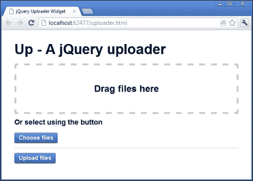
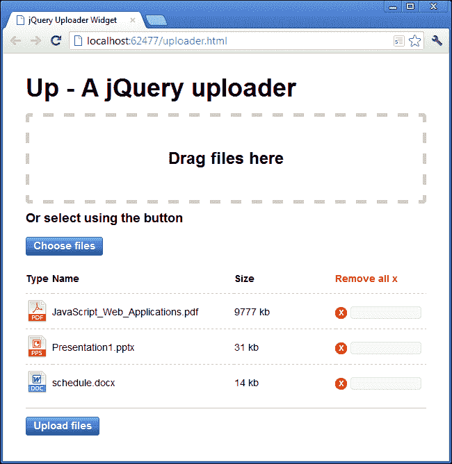
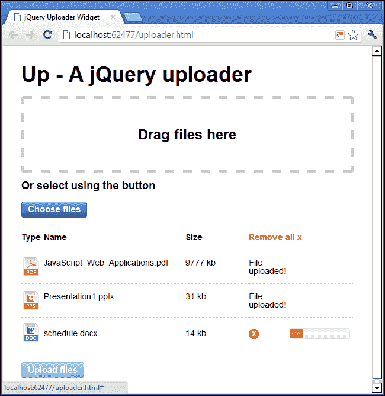

# 第五章：jQuery 文件上传器

现在可以仅使用一些最新的 HTML5 API 和 jQuery 创建一个功能齐全的文件上传小部件。我们可以轻松添加对高级功能的支持，例如多个上传和拖放界面，而且只需稍微借助 jQuery UI，我们还可以添加引人入胜的 UI 功能，例如详细的文件信息和进度反馈。

# 任务简报

在本项目中，我们将使用 HTML5 文件 API 提供核心行为构建一个高级多文件上传小部件，并使用 jQuery 和 jQuery UI 构建一个引人入胜的界面，访问者将乐于使用。

我们将构建小部件作为 jQuery 插件，因为这是我们可能想要封装的东西，这样我们就可以将其放入许多页面中，并且只需进行一些配置即可使其工作，而不是每次都需要构建自定义解决方案。

## 为什么很棒？

jQuery 提供了一些出色的功能，使编写可重复使用的插件变得轻而易举。在本项目中，我们将看到打包特定功能和生成所有必要标记以及添加所有所需类型行为的机制是多么容易。

在客户端处理文件上传为我们提供了许多增强体验功能的机会，包括有关每个选择的上传文件的信息，以及一个丰富的进度指示器，使访问者了解上传可能需要多长时间。

我们还可以允许访问者在上传过程中取消上传，或在上传开始之前删除先前选择的文件。这些功能纯粹使用服务器端技术处理文件上传是不可用的。

在此项目结束时，我们将制作以下小部件：



## 你的热门目标

要完成项目，我们需要完成以下任务：

+   创建页面和插件包装器

+   生成基础标记

+   添加接收要上传文件的事件处理程序

+   显示所选文件列表

+   从上传列表中删除文件

+   添加 jQuery UI 进度指示器

+   上传所选文件

+   报告成功并整理工作

## 任务清单

与我们以前的一些项目一样，除了使用 jQuery，我们还将在本项目中使用 jQuery UI。我们在书的开头下载的 jQuery UI 副本应该已经包含我们需要的所有小部件。

像以前的项目一样，我们还需要在此项目中使用 Web 服务器，这意味着使用正确的 `http://` URL 运行页面，而不是 `file:///` URL。有关兼容的 Web 服务器信息，请参阅以前的项目。

# 创建页面和插件包装器

在此任务中，我们将创建链接到所需资源的页面，并添加我们的插件将驻留在其中的包装器。

## 为起飞做准备

在这一点上，我们应该创建这个项目所需的不同文件。首先，在主项目文件夹中保存一个模板文件的新副本，并将其命名为 `uploader.html`。我们还需要一个新的样式表，应该保存在 `css` 文件夹中，命名为 `uploader.css`，以及一个新的 JavaScript 文件，应该保存在 `js` 文件夹中，命名为 `uploader.js`。

新页面应链接到 jQuery UI 样式表，以便获取进度条小部件所需的样式，并且在页面的 `<head>` 中，直接在现有的对 `common.css` 的链接之后，添加该项目的样式表：

```js
<link rel="stylesheet" href="css/ui-lightness/jquery-ui-1.10.0.custom.min.css" />

<link rel="stylesheet" href="css/uploader.css" />
```

我们还需要链接到 jQuery UI 和此示例的 JavaScript 文件。我们应该在现有的用于 jQuery 的 `<script>` 元素之后直接添加这两个脚本文件：

```js
<script src="img/jquery-ui-1.10.0.custom.min.js"></script>
<script src="img/uploader.js"></script>
```

## 启动推进器

我们的插件只需要一个容器，小部件就可以将所需的标记渲染到其中。在页面的 `<body>` 中，在链接到不同 JavaScript 资源的 `<script>` 元素之前，添加以下代码：

```js
<div id="uploader"></div>
```

除了链接到包含我们的插件代码的脚本文件之外，我们还需要调用插件以初始化它。在现有的 `<script>` 元素之后，直接添加以下代码：

```js
<script>
    $("#uploader").up();
</script>
```

插件的包装器是一个简单的结构，我们将用它来初始化小部件。在 `uploader.js` 中，添加以下代码：

```js
;(function ($) {

    var defaults = {
        strings: {
            title: "Up - A jQuery uploader",
            dropText: "Drag files here",
            altText: "Or select using the button",
            buttons: {
                choose: "Choose files", 
                upload: "Upload files" 
            },
            tableHeadings: [
                "Type", "Name", "Size", "Remove all x"
            ]
        }
    }

    function Up(el, opts) {

        this.config = $.extend(true, {}, defaults, opts);
        this.el = el;
        this.fileList = [];
        this.allXHR = [];
    }

    $.fn.up = function(options) {
        new Up(this, options);
        return this;
    };

}(jQuery));
```

## 目标完成 - 迷你简报

构建 jQuery 插件时，我们能做的最好的事情就是使我们的插件易于使用。根据插件的用途，最好尽可能少地有先决条件，因此，如果插件需要复杂的标记结构，通常最好让插件渲染它需要的标记，而不是让插件的用户尝试添加所有必需的元素。

鉴于此，我们将编写我们的插件，使得页面上只需要一个简单的容器，插件就可以将标记渲染到其中。我们在页面上添加了这个容器，并为其添加了一个 `id` 属性以便于选择。

使用我们的插件的开发人员将需要一种调用它的方法。jQuery 插件通过向 `jQuery` 对象添加附加方法来扩展 `jQuery` 对象，我们的插件将向 jQuery 添加一个名为 `up()` 的新方法，该方法像任何其他 jQuery 方法名称一样被调用 - 在被 jQuery 选择的一组元素上。

我们在 `<body>` 元素底部添加的额外 `<script>` 元素调用了我们的插件方法，以调用插件，这就是使用我们的插件的人会调用它的方式。

在我们的脚本文件中，我们以一个分号和一个立即调用的匿名函数开始。分号支持 jQuery 插件的模块化特性，并保护我们的插件免受其他不正确停止执行的插件的影响。

如果页面上另一个插件的最后一条语句或表达式没有以分号结束，而我们的插件又没有以分号开始，就可能导致脚本错误，从而阻止我们的插件正常工作。

我们使用一个匿名函数作为我们插件的包装器，并立即在函数体之后用一组额外的括号调用它。我们还可以通过在我们的插件中局部范围限定`$`字符并将`jQuery`对象传递给匿名函数作为参数，确保我们的插件与 jQuery 的`noConflict()`方法一起工作。

在匿名函数内部，我们首先定义一个称为`defaults`的对象字面量，该对象将用作我们插件的配置对象。该对象包含另一个称为`strings`的对象，其中我们存储了在各种元素中显示的所有不同文本部分。

为了使我们的插件易于本地化，我们使用配置对象来处理文本字符串，这样非英语母语的开发者就可以更容易地使用。尽可能使插件灵活是增加插件吸引力的一个好方法。

在`defaults`对象之后，我们定义了一个构造函数，该函数将生成我们的小部件的实例。插件称为 Up，我们将其名称的第一个字母大写，因为这是应该使用`new`关键字调用的函数的一般约定。

构造函数可以接受两个参数；第一个是一个 jQuery 元素或元素集合，第二个是由使用我们的插件的开发者定义的配置对象。

在构造函数内部，我们首先向实例附加一些成员。第一个成员叫做`config`，它将包含由 jQuery 的`extend()`方法返回的对象，该方法用于合并两个对象，与大多数 jQuery 方法不同，它是在`jQuery`对象本身上而不是 HTML 元素集合上调用的。

它接受四个参数；第一个参数指示`extend()`方法深复制要合并到 jQuery 对象中的对象，这是我们需要做的，因为`defaults`对象包含其他对象。

第二个参数是一个空对象；任何其他对象都将被合并在一起，并将它们自己的属性添加到此对象中。这是方法将返回的对象。如果我们没有传递一个空对象，那么方法中传递的第一个对象将被返回。

下面的两个参数是我们要合并的对象。这些是我们刚刚定义的`defaults`对象和在调用构造函数时可能传递的`opts`对象。

这意味着如果开发者希望传递一个配置对象，他们可以覆盖我们在`defaults`对象中定义的值。未使用此配置对象覆盖的属性将被设置为默认值。

我们还将对元素或元素集合的引用作为实例的成员存储，以便我们可以在代码的其他部分轻松操作这些元素。

最后，我们添加了一对空数组，用于存储要上传的文件列表和进行中的 XHR 请求。我们将在项目的后期看到这些属性如何使用，所以现在不用太担心它们。

jQuery 提供了`fn`对象作为其原型的快捷方式，这是我们如何用我们的插件方法扩展 jQuery 的。在这种情况下，该方法被称为`up()`，并且是我们在`uploader.html`底部使用`<script>`元素调用的方法。我们指定该方法可能接受一个参数，该参数是包含插件使用者可能想要提供的配置选项的对象。

在方法内部，我们首先使用`new`关键字与我们的构造函数结合创建了一个上传器的新实例。我们将构造函数传递给方法所调用的元素（或元素集合）和`options`对象。

最后我们从方法中返回了`this`。 在添加到 jQuery 原型的方法中，`this`对象指的是 jQuery 集合。非常重要的是，为了保持链接，返回调用方法的元素集合。

## 机密情报

链接是 jQuery 的一个固有特性，使用它的开发人员来期望。重要的是满足开发人员对他们使用的编程样式的期望。使用我们的插件的人们希望在调用我们的插件方法后能够添加额外的 jQuery 方法。

现在我们通过返回`this`对象返回元素集合，开发人员可以做这样的事情：

```js
$("#an-element").up().addClass("test");
```

所以这是一个简单的示例，但它应该说明为什么从插件中始终返回`this`是重要的。

# 生成底层标记

在这个任务中，我们将向我们的插件添加一个初始化方法，该方法将生成小部件所需的标记。

## 启动推进器

首先，我们应该直接在`uploader.js`中`Up()`构造函数之后添加以下代码：

```js
Up.prototype.init = function() {
    var widget = this,
          strings = widget.config.strings,
          container = $("<article/>", {
            "class": "up"
          }),
    heading = $("<header/>").appendTo(container),
    title = $("<h1/>", {
        text: strings.title
    }).appendTo(heading),
    drop = $("<div/>", {
        "class": "up-drop-target",
        html: $("<h2/>", {
            text: strings.dropText
        })
    }).appendTo(container),
    alt = $("<h3/>", {
        text: strings.altText
    }).appendTo(container),
    upload = $("<input/>", {
        type: "file"
    }).prop("multiple", true).appendTo(container),
    select = $("<a/>", {
        href: "#",
        "class": "button up-choose",
        text: strings.buttons.choose
    }).appendTo(container),
    selected = $("<div/>", {
        "class": "up-selected"
    }).appendTo(container),
    upload = $("<a/>", {
        href: "#",
        "class": "button up-upload",
        text: strings.buttons.upload
    }).appendTo(container);

    widget.el.append(container);

}
```

我们还需要调用这个新的`init()`方法。修改添加到 jQuery 的`fn`对象的方法，使其如下所示：

```js
$.fn.up = function(options) {
 new Up(this, options).init();
    return this;
};
```

我们还可以在插件生成的标记中添加 CSS。在`uploader.css`中，添加以下样式：

```js
article.up { width:90%; padding:5%; }
article.up input { display:none; }
.up-drop-target { 
    height:10em; border:5px dashed #ccc; border-radius:5px; 
    margin-bottom:1em; text-align:center; 
}
.up-drop-target h2 { 
    margin-top:-.5em; position:relative; top:50%; 
}
.up-selected { margin:1em 0; border-bottom:1px solid #ccc; }
```

## 完成目标 - 迷你总结

我们可以通过将其添加到构造函数的`prototype`中来添加一个`init()`方法，该方法负责创建和注入小部件所构建的标记。构造函数创建的所有对象都将继承该方法。

我们首先存储了`this`对象，该对象在我们的`init()`方法中仍然指的是元素的 jQuery 集合，以便我们可以在下一个任务中轻松地在事件处理程序中引用它。

我们还将`strings`属性本地化作用域，以使解析稍微更快，因为我们经常引用此属性以将可见的文本字符串添加到小部件的可见 UI 中。

接下来，我们创建新的 HTML 元素并将它们存储在变量中。这意味着我们可以创建容器并将所有所需元素附加到其中，而它仍然在内存中，并且然后将整个小部件一次性注入到页面的 DOM 中，而不是重复地修改 DOM 并逐个添加元素。

小部件的外部容器是一个 `<article>` 元素，它具有一个易于样式化的类名。HTML5 规范描述了 `<article>` 作为一个独立的交互式小部件，所以我觉得这是我们小部件的完美容器。虽然同样相关，但 `<article>` 并不局限于我们传统上描述的“文章” - 例如，博客/新闻文章或编辑样式的文章。

我们有一个 `<header>` 元素来包含小部件的主标题，在其中我们使用一个标准的 `<h1>`。我们还在小部件内部使用两个 `<h2>` 元素来显示不同的部分（拖放区域和更传统的文件 `<input>`）。

`<input>` 元素具有 `type` 属性为 `file`，并且还给定了 `multiple` 属性，使用 jQuery 的 `prop()` 方法，以便在支持的浏览器中上传多个文件。目前的 IE 版本（9 及以下）不支持此属性。

我们还在 `<input>` 之后直接添加了一个 `<a>` 元素，我们将用它来打开用于选择要上传的文件的打开对话框。标准的 `file` 类型 `<input>` 的问题在于没有标准！

几乎每个浏览器都以不同的方式实现 `file` 类型的 `<input>`，一些浏览器显示一个 `<input>` 以及一个 `<button>`，而一些浏览器只显示一个 `<button>` 和一些文本。还不可能对由控件生成的 `<input>` 或 `<button>` 进行样式设置，因为它们是 **shadow DOM** 的一部分。

### 注意

有关影子 DOM 的更多信息，请参见 [`glazkov.com/2011/01/14/what-the-heck-is-shadow-dom/`](http://glazkov.com/2011/01/14/what-the-heck-is-shadow-dom/)。

为了解决这些跨浏览器的差异，我们将用 CSS 隐藏 `<input>`，并使用 `<a>` 元素，样式化为一个吸引人的按钮，来打开对话框。

我们还添加了一个空的 `<div>` 元素，我们将用它来列出所选文件并显示每个文件的一些信息，然后是另一个 `<a>` 元素，它将被样式化为按钮。这个按钮将用于启动上传。

我们使用了标准的 jQuery 1.4+ 语法来创建新的 HTML 元素，并为大多数我们创建的元素提供了配置对象。大多数元素都给定了一个类名，有些还会获得文本或 HTML 内容。我们使用的类名都受到合理前缀的限制，以避免与页面上已使用的现有样式潜在冲突。

我们添加的 CSS 主要是用于呈现。重要的方面是我们隐藏了标准的文件 `<input>`，并且给了拖放目标一个固定大小，以便文件可以轻松地放置在上面。

此时，我们应该能够在浏览器中运行页面（通过 web 服务器），并查看插件的基本元素和布局。页面应该与该项目的第一个截图中的样子一样。

# 添加接收要上传文件的事件处理程序

我们可以使用我们在上一个任务中添加的 `init()` 方法来附加小部件将需要处理的文件被选择上传的事件处理程序。这可能发生在文件被拖放到拖放目标上，或者使用按钮选择它们时。

## 启动推进器

在`uploader.js`中的`init()`方法中向容器附加新的 HTML 元素之后（但仍在`init()`方法内部），添加以下代码：

```js
widget.el.on("click", "a.up-choose", function(e) {
    e.preventDefault();

    widget.el.find("input[type='file']").click();
});

widget.el.on("drop change dragover", "article.up", function(e) {

    if (e.type === "dragover") {
        e.preventDefault();
        e.stopPropagation();
        return false;
    } else if (e.type === "drop") {
        e.preventDefault();
        e.stopPropagation();
        widget.files = e.originalEvent.dataTransfer.files;
    } else {
        widget.files = widget.el
        .find("input[type='file']")[0]
        .files;
    }

    widget.handleFiles();
});
```

## 目标完成 - 迷你总结

我们首先使用 jQuery 的 `on()` 方法，在事件委托模式下，将事件处理程序附加到小部件的外部容器上。我们将 `click` 事件指定为第一个参数，并将匹配我们带有类名 `up-choose` 的按钮的选择器指定为第二个参数。

在传递给 `on()` 的处理程序函数内部，我们首先使用 JavaScript 的 `preventDefault()` 阻止浏览器的默认行为，然后触发一个用于选择要上传的文件的隐藏`<input>`元素的`click`事件。这将导致文件对话框在浏览器中打开，允许选择文件。

然后，我们附加了另一个事件处理程序。这次我们正在寻找`drop`、`dragover`或`change`事件。当文件被拖放到拖放区域时，将触发`drop`事件；当文件被悬停在拖放区域上时，将触发`dragover`事件；如果文件被移除，将触发`change`事件。

所有这些事件将从拖放区域（带有类名`up`的`<article>`）或隐藏的`<input>`中冒泡，并通过绑定事件处理程序的小部件的外部容器传递。

在这个处理程序函数内部，我们首先检查它是否是`dragover`事件；如果是，我们再次使用`preventDefault()`和`stopPropagation()`阻止浏览器的默认行为。我们还需要从条件的这个分支返回`false`。

`if`的下一个分支检查触发处理程序的事件是否是`drop`事件。如果是，我们仍然需要使用`preventDefault()`和`stopPropagation()`，但这次我们还可以使用 jQuery 创建和传递给处理程序函数的事件对象获取所选文件的列表，并将它们存储在小部件实例的属性中。

如果这两个条件都不为`true`，我们就从`<input>`元素中获取文件列表。

我们需要的属性是 jQuery 封装到自己的事件对象中的`originalEvent`对象的一部分。然后，我们可以从`dataTransfer`对象中获取`files`属性。如果事件是`change`事件，我们只需获取隐藏的`<input>`的`files`属性。

无论使用哪种方法，用于上传的文件集合都存储在小部件实例的 `files` 属性下。这只是一个临时属性，每次选择新文件时都会被覆盖，不像小部件的 `filelist` 数组，它将存储所有文件以进行上传。

最后我们调用 `handleFiles()` 方法。在下一个任务中，我们将把这个方法添加到小部件的 `prototype` 中，所以一旦完成了这个任务，我们就能在这里调用这个方法而不会遇到问题。

将两个事件组合起来，并以这种方式检测发生的事件要比附加到单独的事件处理程序要好得多。这意味着我们不需要两个分开的处理程序函数，它们都本质上做同样的事情，并且无论是用按钮和标准对话框选择文件，还是通过将文件拖放到拖放目标中选择文件，我们仍然可以获取文件列表。

此时，我们应该能够将文件拖放到拖放区域，或者点击按钮并使用对话框选择文件。然而，会抛出一个脚本错误，因为我们还没有添加我们插件的 `handleFiles()` 方法。

# 显示已选文件列表

在这个任务中，我们可以填充我们创建的 `<div>`，以显示已选择用于上传的文件列表。我们将构建一个表格，在表格中，每一行列出一个文件，包括文件名和类型等信息。

## 启动推进器

在 `uploader.js` 中的 `init()` 方法之后，添加以下代码：

```js
Up.prototype.handleFiles = function() {

    var widget = this,
          container = widget.el.find("div.up-selected"),
          row = $("<tr/>"),
          cell = $("<td/>"),
          remove = $("<a/>", {
             href: "#"
          }),
    table;

    if (!container.find("table").length) {
        table = $("<table/>");

        var header = row.clone().appendTo(table),
              strings = widget.config.strings.tableHeadings;

        $.each(strings, function(i, string) {
                var cs = string.toLowerCase().replace(/\s/g, "_"),
                      newCell = cell.clone()
                                            .addClass("up-table-head " + cs)
                                            .appendTo(header);

                if (i === strings.length - 1) {
                    var clear = remove.clone()
                                                 .text(string)
                                                .addClass("up-remove-all");

                    newCell.html(clear).attr("colspan", 2);
                } else {
                    newCell.text(string);
                }
            });
        } else {
            table = container.find("table");
        }

        $.each(widget.files, function(i, file) {
        var fileRow = row.clone(),
              filename = file.name.split("."),
              ext = filename[filename.length - 1],
              del = remove.clone()
                                   .text("x")
                                   .addClass("up-remove");

        cell.clone()
              .addClass("icon " + ext)
              .appendTo(fileRow);

        cell.clone()
              .text(file.name).appendTo(fileRow);
        cell.clone()
             .text((Math.round(file.size / 1024)) + " kb")
             .appendTo(fileRow);

        cell.clone()
              .html(del).appendTo(fileRow);
        cell.clone()
              .html("<div class='up-progress'/>")
              .appendTo(fileRow);

        fileRow.appendTo(table);

        widget.fileList.push(file);
    });

    if (!container.find("table").length) {
        table.appendTo(container);
    }
}
```

我们还可以为我们创建的新标记添加一些额外的 CSS。将以下代码添加到 `upload.css` 的底部：

```js
.up-selected table {
    width:100%; border-spacing:0; margin-bottom:1em;
}
.up-selected td {
    padding:1em 1% 1em 0; border-bottom:1px dashed #ccc;
    font-size:1.2em;
}
.up-selected td.type { width:60px; }
.up-selected td.name { width:45%; }
.up-selected td.size { width:25%; }
.up-selected td.remove_all_x { width:20%; }

.up-selected tr:last-child td { border-bottom:none; }
.up-selected a {
    font-weight:bold; text-decoration:none;
}
.up-table-head { font-weight:bold; }
.up-remove-all { color:#ff0000; }
.up-remove {
    display:block; width:17px; height:17px;
    border-radius:500px; text-align:center;
    color:#fff; background-color:#ff0000;
}
.icon { 
    background:url(../img/page_white.png) no-repeat 0 50%; 
}
.doc, .docx { 
    background:url(../img/doc.png) no-repeat 0 50%; 
}
.exe { background:url(../img/exe.png) no-repeat 0 50%; }
.html { background:url(../img/html.png) no-repeat 0 50%; }
.pdf { background:url(../img/pdf.png) no-repeat 0 50%; }
.png { background:url(../img/png.png) no-repeat 0 50%; }
.ppt, .pptx { 
    background:url(../img/pps.png) no-repeat 0 50%; 
}
.txt { background:url(../img/txt.png) no-repeat 0 50%; }
.zip { background:url(../img/zip.png) no-repeat 0 50%; }
```

## 目标完成 - 迷你总结

我们开始时将 `handleFiles()` 方法添加到小部件的 `prototype` 中，使得我们在上一个任务的最后添加的方法调用 `widget.handleFiles()` 起作用。它的添加方式与之前的 `init()` 方法完全相同，并且就像在 `init()` 内部一样，`this` 对象指向了小部件实例内部。这使得在页面上的元素、配置选项和选定文件列表都易于访问。

在方法内部，我们首先创建了一系列变量。就像在 `init()` 方法中一样，我们创建了一个名为 widget 的局部变量，用于存储 `this` 对象。虽然我们不会向这个方法添加任何事件处理程序，所以我们并不一定非要这样做，但我们确实多次访问对象，所以把它缓存在一个变量中是有道理的。

我们还使用 `widget.el` 缓存了选定的文件容器 - 不要忘记 `el` 已经引用了外部小部件容器的 jQuery 封装实例，所以我们可以直接在其上调用 jQuery 方法，如 `find()`，而无需重新封装它。

接下来，我们创建了一系列新的 DOM 元素，准备在循环内克隆它们。这是一种更好的创建元素的方法，特别是在循环内部，避免了不断创建新的 jQuery 对象。

我们还定义了一个名为`table`的变量，但我们并没有立即初始化它。相反，我们使用`if`条件来检查容器是否已经包含了一个`<table>`元素，通过检查 jQuery 的`find("table")`是否返回一个具有`length`的集合。

如果`length`等于`false`，我们知道没有选择任何`<table>`元素，因此我们使用 jQuery 创建了一个新的`<table>`元素，并将其赋给`table`变量。然后，我们为`<table>`创建了一个标题行，用于为新表的每一列添加标题。

此时，`<table>`元素只存在于内存中，因此我们可以将新行添加到其中，而不会修改页面的 DOM。我们还缓存了我们配置对象中使用的`strings`对象的`tableHeadings`属性的引用。

然后，我们使用 jQuery 的`each()`实用工具来创建用作表标题的所有`<td>`元素。除了能够在从页面选中的元素集合上调用`each()`之外，我们还可以调用`each()`在 jQuery 对象上，以便迭代一个纯 JavaScript 数组或对象。

`each()`方法接受要迭代的数组或对象。在这种情况下，它是一个数组，因此对数组中的每个项目调用的迭代函数接收到当前项目的索引和当前项目的值作为参数。

在迭代器内部，我们首先创建一个可以用作类名的新字符串。`class`这个词在 JavaScript 中是一个**保留字**，因此我们改用`cs`作为变量名。为了创建类名，我们只需使用 JavaScript 的`toLowerCase()`函数将当前字符串转换为小写，然后使用 JavaScript 的`replace()`函数删除任何空格。

### 注意

有关 JavaScript 中保留字的完整列表，请参阅 MDN 文档[`developer.mozilla.org/en-US/docs/JavaScript/Reference/Reserved_Words`](https://developer.mozilla.org/en-US/docs/JavaScript/Reference/Reserved_Words)。

`replace()`函数将正则表达式作为第一个参数匹配，将替换字符串作为第二个参数。我们可以使用字符串`" "`作为第一个参数，但那样只会删除第一个空格，而使用带有`g`标志的正则表达式允许我们移除所有空格。

然后，我们通过克隆在任务开始时创建并存储在变量中的元素之一来创建一个新的`<td>`元素。我们为了样式的目的给它一个通用的类名，以及我们刚刚创建的唯一类名，这样每一列都可以在需要时独立样式化，然后将它直接添加到我们刚刚创建的标题行中。

然后，我们通过检查当前索引是否等于数组长度减 1 来检查我们是否迭代了数组中的最后一项。如果是最后一项，我们通过克隆我们在任务开始时创建和缓存的`<a>`元素来添加一个清除所有链接。

我们将新`<td>`元素的文本设置为当前数组项的值，并添加`up-remove-all`类以进行样式设置，以便我们可以过滤由它分发的事件。我们还可以使用 jQuery 的`attr()`方法将`colspan`属性设置为`2`到这个`<td>`。然后，新的`<a>`元素被添加为新的`<td>`元素的 HTML 内容。

如果它不是数组中的最后一个项目，我们只需将新`<td>`元素的文本内容设置为当前数组项的值。

所有这些都是在外部`if`语句的第一个分支中完成的，当表不存在时发生。如果容器已经包含`<table>`元素，我们仍然通过选择页面上的`<table>`来初始化表变量。

不要忘记，我们所在的`handleFiles()`方法将在选择文件后被调用，所以现在我们需要为每个选择的文件在表中构建一行新行。

再次使用 jQuery 的`each()`方法，这次是为了迭代小部件的`files`属性中存储的文件集合。对于每个选择的文件（通过拖放到拖放区域或使用按钮），我们首先通过克隆我们的`row`变量创建一个新的`<tr>`。

然后，我们在当前文件的`name`属性上使用`.`字符进行分割。通过获取`split()`函数创建的数组中的最后一个项目，我们存储文件的扩展名。

在这一点上，我们还创建一个删除链接，可以用来从要上传的文件列表中删除单个文件，方法是克隆我们在任务开始时创建的`<a>`元素。它被赋予文本`x`和类名`up-remove`。

接下来，我们通过再次克隆缓存的`cell`变量中的`<td>`来创建一系列新的`<td>`元素。第一个`<td>`被赋予一个通用的类名`icon`，以及当前文件的扩展名，这样我们就可以为可以上传的不同文件类型添加图标，并将其附加到新行上。

第二个`<td>`元素显示文件的名称。第三个`<td>`元素显示文件的大小（以千字节为单位）。如果我们知道可能上传大文件，我们可以转换为兆字节，但对于这个项目的目的，千字节就足够了。

第四个`<td>`元素使用 jQuery 的`html()`方法添加了新的删除链接，最后一个`<td>`元素添加了一个空的`<div>`元素，我们将使用它来放置 jQuery UI 进度条小部件。

一旦新单元格被创建并附加到新行上，新行本身就被附加到表中。我们还可以将当前文件添加到我们的`fileList`数组中，准备上传。

最后，我们需要再次检查所选文件容器是否已经包含一个`<table>`元素。如果没有，我们将新建的`<table>`追加到容器中。如果它已经包含`<table>`，新行将已经添加到其中。

我们在这一部分添加的 CSS 纯粹是为了呈现。我做的一件事是添加一些类，以便显示可能选择上传的不同文件类型的图标。我只是添加了一些作为示例；您实际需要的会取决于您期望用户上传的文件类型。还为与我们添加的选择器不匹配的类型创建了通用图标。

### 注意

此示例中使用的图标属于 Farm Fresh 图标包。我已经为了简洁性而重命名了这些文件，并且可以在本书附带的代码下载中找到。这些图标可以在 Fat Cow 网络主机上获得 ([`www.fatcow.com/free-icons`](http://www.fatcow.com/free-icons))。

在这一点上，我们应该能够在浏览器中运行页面，选择一些文件进行上传，并看到我们刚刚创建的新`<table>`：



## 机密情报

在这个例子中，我们手动创建了显示所选文件列表所需的元素。另一种方法是使用模板引擎，比如 jsRender 或 Dust.js。这样做的好处是比我们手动创建更快更高效，能够使我们的插件代码更简单更简洁，文件也更小。

当然，这将给我们的插件增加另一个依赖，因为我们需要包含模板引擎本身，以及一个存储在 JavaScript 文件中的预编译模板。在这个例子中，我们并没有创建太多元素，所以可能不值得再添加另一个依赖。当需要创建许多元素时，添加依赖的成本被它增加的效率所抵消。

写 jQuery 插件时，这种事情需要根据具体情况逐案考虑。

# 从上传列表中移除文件

在这个任务中，我们将添加事件处理程序，使新文件列表中的**删除**和**全部删除**链接起作用。我们可以将事件处理程序附加到我们之前添加其他事件处理程序的地方，以保持事情的井然有序。

## 启动推进器

在`upload.js`中，在小部件的`init()`方法中，并且直接在现有的 jQuery `on()`方法调用之后，添加以下新代码：

```js
widget.el.on("click", "td a", function(e) {

    var removeAll = function() {
        widget.el.find("table").remove();
        widget.el.find("input[type='file']").val("");
        widget.fileList = [];
    }

    if (e.originalEvent.target.className == "up-remove-all") {
        removeAll();
    } else {
        var link = $(this),
              removed,
              filename = link.closest("tr")
                                     .children()
                                     .eq(1)
                                     .text();

        link.closest("tr").remove();

        $.each(widget.fileList, function(i, item) {
        if (item.name === filename) {
            removed = i;
        }
    });
    widget.fileList.splice(removed, 1);

    if (widget.el.find("tr").length === 1) {
        removeAll();
    } 
  }
}); 
```

## 完成目标 - 小型总结

我们使用 jQuery 的`on()`方法再次添加了一个`click`事件。我们将它附加到小部件的外部容器，就像我们添加其他事件一样，这次我们根据选择器`td a`过滤事件，因为事件只会源自`<td>`元素内的`<a>`元素。

在事件处理程序内，我们首先阻止浏览器的默认行为，因为我们不希望跟随链接。然后，我们定义了一个简单的帮助函数，从小部件中移除`<table>`元素，清除文件`<input>`的值，并清除`fileList`数组。

我们需要清除`<input>`，否则如果我们选择了一些文件，然后将它们从文件列表中移除，我们将无法重新选择相同的一组文件。这是一个边缘情况，但这个简单的小技巧可以让它起作用，所以我们也可以包含它。

接下来，我们检查触发事件的元素的`className`属性是什么。我们可以使用传递给处理程序函数的 jQuery 事件对象中包含的`originalEvent`对象的`target`属性来查看此属性。我们还可以使用 jQuery 事件对象的`srcElement`属性，但这在当前版本的 Firefox 中不起作用。

当`className`属性匹配`up-remove-all`时，我们简单地调用我们的`removeAll()`辅助函数来移除`<table>`元素并清除`<input>`和`fileList`数组。

如果`className`属性与**全部移除**链接不匹配，我们必须仅移除包含被点击的`<a>`的`<table>`元素的行。我们首先缓存触发事件的`<a>`的引用，这在处理程序函数内部被设置为`this`。

我们还定义了一个名为`removed`的变量，我们将很快初始化一个值。最后，我们存储了我们将要移除的行所代表的文件的`filename`。

一旦我们设置了变量，我们首先要做的是移除我们可以使用 jQuery 的`closest()`方法找到的行，该方法找到与传递给该方法的选择器匹配的第一个父元素。

然后我们使用 jQuery 的`each()`方法来迭代`fileList`数组。对于数组中的每个项目，我们将项目的`name`属性与我们刚初始化的`filename`变量进行比较。如果两者匹配，我们将`index`号（由 jQuery 自动传递给迭代器函数）设置为我们的`removed`变量。

一旦`each()`方法完成，我们就可以使用 JavaScript 的`splice()`函数来移除当前`<tr>`所代表的文件。`splice()`函数接受两个参数（它可以接受更多，但我们这里不需要），第一个参数是要开始移除的项目的索引，第二个参数是要移除的项目数。

最后，我们检查`<table>`元素是否还有多于一行的行。如果只剩下一行，这将是标题行，所以我们知道所有文件都已删除。因此，我们可以调用我们的`removeAll()`辅助函数来整理并重置一切。

现在当我们已经将文件添加到上传列表中时，我们应该能够使用内联**x**按钮逐个删除文件，或者使用**全部移除**链接清除列表。

# 添加一个 jQuery UI 进度指示器

在这个任务中，我们将添加 jQuery UI 进度条小部件所需的元素和初始化代码。小部件实际上还不会执行任何操作，因为在下一个任务中我们不会上传任何东西，但我们需要连接好一切准备就绪。

## 启动推进器

我们将向小部件的原型添加一个`initProgress()`方法，用于选择我们添加到`<table>`元素中的`<div>`元素，并将它们转换为进度条小部件。我们还可以添加用于更新进度条的方法。

在`handleFiles()`方法之后，直接添加以下代码：

```js
Up.prototype.initProgress = function() {

    this.el.find("div.up-progress").each(function() {
        var el = $(this);

        if (!el.hasClass("ui-progressbar")) {
            el.progressbar();
        }
    });
}
```

接下来，我们需要在向`<table>`添加新行后调用此方法。在`handleFiles()`方法的末尾直接添加以下调用：

```js
widget.initProgress();
```

现在我们可以添加更新进度条的代码了。在我们刚刚添加的`initProgress()`方法后面直接添加以下代码：

```js
Up.prototype.handleProgress = function(e, progress) {

    var complete = Math.round((e.loaded / e.total) * 100);

    progress.progressbar("value", complete);
}
```

我们还需要为新的进度条添加一点 CSS。将以下代码添加到`uploader.css`的末尾：

```js
.up-progress { 
    height:1em; width:100px; position:relative; top:4px; 
}
```

## 目标完成 - 迷你总结

这个任务比我们到目前为止在项目中涵盖的一些任务更短，但同样重要。我们添加了新方法的方式与为插件添加大部分功能的方式相同。

在这个方法中，我们首先选择所有类名为`up-progress`的`<div>`元素。不要忘记我们可以使用`this.el`访问小部件的容器元素，并且作为 jQuery 对象，我们可以在其上调用 jQuery 方法，比如`find()`。

然后，我们使用 jQuery 的`each()`方法遍历选择中的每个元素。在此任务中，我们使用标准的`each()`方法，其中集合中的当前元素在迭代函数中设置为`this`。

在迭代函数中，我们首先缓存当前元素。然后我们检查它是否具有 jQuery UI 类名`ui-progressbar`，如果没有，我们将使用 jQuery UI 方法`progressbar()`将元素转换为进度条。

这样做意味着无论是选择要上传的初始文件集，还是将其他文件添加到现有的`<table>`中，进度条都将始终被创建。

在`handleFiles()`方法末尾，我们还添加了对新的`initProgress()`方法的调用，每当选择新文件上传时都会调用该方法。

接下来，我们添加了`handleProgress()`方法，我们将在下一个任务中将其绑定到一个事件。该方法将传递两个参数，第一个是事件对象，第二个是一个已包装的 jQuery 对象，表示一个单独的进度条。

在方法中，我们首先计算已上传文件的比例。我们可以通过将事件对象的`loaded`属性除以`total`属性得出，然后除以 100 得出迄今为止已上传文件的百分比。

`loaded`和`total`属性是特殊属性，当浏览器触发进度事件时会将它们添加到事件对象中。

一旦我们有了百分比，我们就可以调用进度条小部件的`value`方法，以便将值设置为百分比。这是一个 jQuery UI 方法，因此以特殊的方式调用。我们不直接调用`value()`，而是调用`progressbar()`方法，并将要调用的方法的名称`value`作为第一个参数传递。所有 jQuery UI 方法都是以这种方式调用的。

最后，我们添加了一些漂亮的 CSS 样式，以微调默认的 jQuery UI 主题提供的默认样式。现在，当我们添加要上传的文件时，我们应该在`<table>`中的每个文件后看到一个空的进度条。

# 正在上传所选文件

现在，我们有了附加到我们插件实例的文件列表，准备好上传。在这个任务中，我们将做到这一点，并使用 jQuery 异步上传文件。此行为将与我们添加到插件生成的标记中的**上传文件**按钮相关联。

我们还可以使用此任务来更新我们的进度条，显示每个正在上传的文件的当前进度。

## 启动推进器

由于这是另一个事件处理程序，我们将在`init()`方法中添加它，以及所有其他事件处理程序，以便它们都保持在一个地方。在现有的事件处理程序之后，在`init()`方法的末尾添加以下代码：

```js
widget.el.on("click", "a.up-upload", function(e) {
    e.preventDefault();

  widget.uploadFiles();
}); 
```

接下来，添加新的`uploadFiles()`方法。这可以在我们在上一个任务中添加的与进度相关的方法之后进行：

```js
Up.prototype.uploadFiles = function() {
    var widget = this,
    a = widget.el.find("a.up-upload");

    if (!a.hasClass("disabled")) {

        a.addClass("disabled");

        $.each(widget.fileList, function(i, file) {
            var fd = new FormData(),
                  prog = widget.el
                                        .find("div.up-progress")
                                        .eq(i);

            fd.append("file-" + i, file);

            widget.allXHR.push($.ajax({
                type: "POST",
                url: "/upload.asmx/uploadFile",
                data: fd,
                contentType: false,
                processData: false,
                xhr: function() {

                    var xhr = jQuery.ajaxSettings.xhr();

                    if (xhr.upload) {
                        xhr.upload.onprogress = function(e) {
                            widget.handleProgress(e, prog);
                        }
                    }

                    return xhr;
                }
            }));
        });     
    }
}
```

## 完成目标 - 迷你总结

在我们的`uploadFiles()`方法中，我们首先存储对小部件的引用，就像我们在添加的其他一些方法中所做的那样。我们还存储对**上传文件**按钮的引用。

接下来要做的是检查按钮是否没有`disabled`类名。如果它确实具有此类名，这意味着已为所选文件启动了上传，因此我们希望避免重复请求。如果按钮没有`disabled`类，则意味着这是第一次单击按钮。因此，为了防止重复请求，我们随后添加`disabled`类。

接下来，我们遍历我们收集到的文件列表，该列表存储在小部件实例的`fileList`属性中。对于数组中的每个文件，我们首先创建一个新的`FormData`对象。

`FormData`是新的 XMLHttpRequest (XHR) level 2 规范的一部分，它允许我们动态创建一个`<form>`元素，并使用 XHR 异步提交该表单。

一旦我们创建了一个新的`FormData`对象，我们还会存储与当前文件关联的进度条小部件的引用。然后，我们使用`FormData`的`append()`方法将当前文件附加到新的`FormData`对象中，以便将文件编码并发送到服务器。

接下来，我们使用 jQuery 的`ajax()`方法将当前的`FormData`对象发布到服务器。`ajax()`方法将返回请求的`jqXHR`对象。这是 jQuery 增强了额外方法和属性的 XHR 对象的特殊版本。我们需要存储这个`jqXHR`对象，以便稍后使用。

我们将在下一个任务中详细介绍它的使用方式，但现在只需了解`ajax()`方法返回的`jqXHR`对象被推送到我们在项目开始时存储为小部件实例成员的`allXHR`数组中即可。

`ajax()`方法接受一个配置对象作为参数，允许我们控制请求的方式。我们使用`type`选项将请求设置为`POST`，并使用`url`选项指定要发布到的 URL。我们使用 data 选项将`FormData`对象添加为请求的有效载荷，并将`contentType`和`processData`选项设置为`false`。

如果我们不将`contentType`选项设置为`false`，jQuery 将尝试猜测应该使用哪种内容类型进行请求，这可能正确也可能不正确，这意味着一些上传将正常工作，而另一些上传将失败，看起来毫无明显原因。请求的`content-type`将默认设置为`multipart/form-data`，因为我们使用的是附加有文件的`FormData`。

将`processData`选项设置为`false`将确保 jQuery 不会尝试将文件转换为 URL 编码的查询字符串。

我们需要修改用于发出请求的基础 XHR 对象，以便我们可以将处理程序函数附加到进度事件上。在请求发出之前，必须将处理程序绑定到事件上，目前唯一的方法是使用`xhr`选项。

该选项接受一个回调函数，我们可以使用它来修改原始的 XHR 对象，然后返回给请求。在回调函数中，我们首先存储原始的 XHR 对象，可以从 jQuery 的`ajaxSettings`对象中获取它。

然后，我们检查对象是否具有`upload`属性，如果有，我们将匿名函数设置为`onprogress`的值。在此函数中，我们只需调用我们在上一个任务中添加的小部件的`handleProgress()`方法，将进度事件对象和我们在本任务开始处存储的 Progressbar 小部件传递给它。

# 报告成功并整理

在此任务中，我们需要显示每个文件何时完成上传。我们还需要清除小部件中的`<table>`，并在所有上传完成后重新启用上传按钮。

## 启动推进器

我们可以使用 jQuery 的`done()`方法显示每个单独文件上传完成的时间，我们可以在上一个任务中添加的`ajax()`方法之后链接此方法：

```js
.done(function() {

    var parent = prog.parent(),
    prev = parent.prev();

    prev.add(parent).empty();
    prev.text("File uploaded!");
});
```

为了在上传后进行整理，我们可以利用 jQuery 的`when()`方法。我们应该在`uploadFiles()`方法中的`each()`方法之后直接添加以下代码：

```js
$.when.apply($, widget.allXHR).done(function() {
    widget.el.find("table").remove();
    widget.el.find("a.up-upload").removeClass("disabled");
});
```

## 目标完成 - 迷你总结

因为 jQuery 的 `ajax()` 方法返回一个 `jqXHR` 对象，而且因为这个对象是一个称为**promise 对象**的特殊对象，我们可以在其上调用某些 jQuery 方法。`done()` 方法用于在请求成功完成时执行代码。

### 注意

你可能更习惯于使用 jQuery 的 `success()` 方法来处理成功的 AJAX 请求，或者 `error()` 或 `complete()` 方法。这些方法在版本 1.9 中已从库中移除，因此我们应该使用它们的替代品 `done()`、`fail()` 和 `always()`。

在这个函数中，我们只需要移除清除按钮和刚刚完成上传的文件的进度条小部件。我们可以通过从当前进度条小部件导航到它们来轻松找到需要移除的元素。

我们在上一个任务中存储了每个单独的进度条的引用，并且因为 `done()` 方法链接到了 `ajax()` 方法，所以在请求完成后仍然可以使用这个变量访问这个元素。

注意，在 `done()` 方法的末尾似乎有一个额外的闭合括号。这是因为它仍然位于我们在先前任务中添加的 `push()` 方法内部。关键是 `done()` 方法被添加到正确的位置——它必须链接到 `push()` 方法内部的 `ajax()` 方法。

一旦这些元素被移除，我们添加一个简单的消息，表示文件已完成上传。

一旦所有请求都完成，我们还需要从页面中移除 `<table>` 元素。这就是我们在上一个任务中上传文件时存储了所有生成的 `jqXHR` 对象的原因。我们可以使用 jQuery 的 `when()` 方法来做到这一点。

`when()` 方法可以接受一系列 promise 对象，并在它们全部解决时返回。然而，这个方法不接受数组，这就是为什么我们使用 JavaScript 的 `apply()` 方法调用它，而不是正常调用它。

我们可以再次使用 `done()` 方法来添加一个回调函数，一旦 `when()` 方法返回，就会调用该回调函数。在这个回调中，我们所做的就是移除显示已上传文件的 `<table>` 元素，并通过移除 `disabled` 类重新启用上传按钮。

这就是我们实际上需要做的，上传所选文件并分别接收每个文件的进度反馈，如下面的截图所示：



### 提示

**查看示例文件**

要查看此项目的运行情况，您需要使用 Web 服务器查看我们创建的页面（在您自己的计算机上使用 `http://localhost`）。如果您在资源管理器或查找器中双击打开文件，它将无法正常工作。

# 任务完成

我们已经完成了项目。在这一点上，我们应该有一个易于使用并在支持的浏览器中提供丰富功能的上传插件，例如多个文件、文件信息、可编辑的上传列表和上传进度报告。

### 提示

并非所有浏览器都能使用此小部件旨在利用的功能。例如，Opera 浏览器认为通过程序触发文件对话框存在安全风险，因此不允许它。

此外，Internet Explorer 的旧版本（任何版本 10 之前的版本）根本无法处理此代码。

支持不兼容或遗留浏览器超出了此示例的范围，但添加一个备用方案是相对直接的，可以利用其他技术，比如 Flash，以支持我们的插件所展示的部分行为。

或者有一系列旧的 jQuery 插件，利用 `<iframe>` 元素来模拟通过 AJAX 上传文件。我选择关注支持的浏览器可以做什么，而不是专注于不支持的功能。

# 你准备好大干一场了吗？挑战高手

通过逐个上传文件，我们能够添加一个事件处理程序来监视正在上传的文件的进度。这也打开了取消上传单个文件的可能性。

对于这个挑战，为什么不试试看能否添加一个取消上传文件的机制。我们已经有了用于在上传之前删除文件的移除按钮。这些按钮可以很容易地更新，以便在上传进行中取消上传。

可以像附加进度事件处理程序一样向 XHR 对象添加取消事件的处理程序，因此这应该很容易实现。
