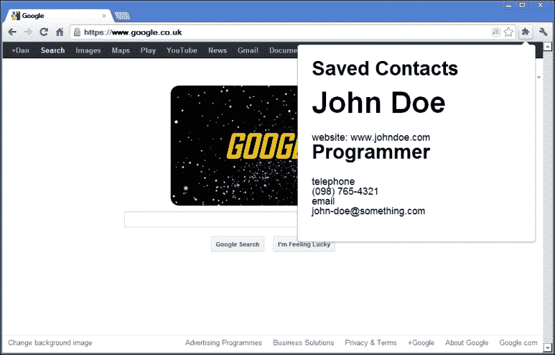
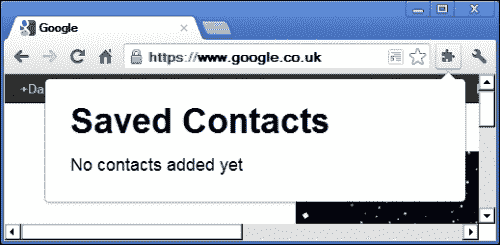

# 第六章：使用 jQuery 扩展 Chrome

为 Chrome（或任何可以通过插件和扩展进行扩展的其他浏览器）构建一个扩展是创建自定义行为或附加工具以增强我们的浏览体验的简单方法。

Chrome 允许我们利用我们的 Web 开发技能扩展其浏览器界面，使用我们已经熟悉的技术，如 HTML、CSS 和 JavaScript，以及您可以使用 JavaScript 的地方通常也可以使用 jQuery。

# 任务简报

在这个项目中，我们将构建一个 Chrome 扩展，突出显示页面上用`Schema.org` **微数据**标记的元素。微数据是一种用于指定有关各种不同实体（如企业、位置或人员）的描述性信息的方式，使用标准 HTML 属性，并据传言将成为 Google 排名算法中的重要因素。

每当我们访问包含联系方式描述的页面时，我们可以从页面中获取它们并将其存储在我们的扩展中，这样我们就可以逐渐建立起一个人们使用或制作我们喜爱的东西的联系信息目录。

在这个项目中，我们还可以使用模板化使创建重复的元素组更加高效，以及更易于维护。我们在上一个项目中使用了 JsRender，所以我们可以再次使用它，但这次我们需要以稍微不同的方式使用它。完成后，我们的扩展将类似于以下截图所示：



## 为什么很棒？

微数据用于描述网页中包含的信息，以促进搜索引擎蜘蛛和 HTML 文档之间的更好互操作性。

当页面上的不同元素被描述为公司、人员、产品或电影时，它允许诸如搜索引擎之类的东西更好地理解页面上包含的信息。

微数据在 Web 上迅速变得更加普遍，并且在 Google 为搜索结果生成的结果中扮演着越来越重要的角色，因此现在是利用它的绝佳时机。

## 你的热门目标

这个项目分解成的任务如下：

+   设置基本扩展结构

+   添加一个清单并安装扩展

+   添加一个沙箱 JsRender 模板

+   将消息发布到沙盒

+   添加内容脚本

+   为微数据抓取页面

+   添加保存微数据的机制

# 设置基本扩展结构

在这个任务中，我们将创建扩展所需的基础文件。扩展使用的所有文件都需要位于同一个目录中，因此我们将设置它并确保它包含我们需要的所有文件。

## 为起飞做准备

有一件事我应该指出，尽管希望你已经意识到 - 在该项目期间，我们将需要 Chrome 浏览器。如果你尚未安装它，作为一个网页开发人员，你真的应该安装它，至少是为了测试目的，立即下载并安装。

### 注意

Chrome 的最新版本可以从[`www.google.com/intl/en/chrome/browser/`](https://www.google.com/intl/en/chrome/browser/)下载。

我们将把这个项目的所有文件保存在一个单独的目录中，所以现在在项目文件夹中建立一个目录，命名为`chrome-extension`。扩展将从与大多数其他项目使用的基本代码文件构建; 唯一的区别是所有文件都需要是扩展本地的。

我们需要一个 JsRender 的副本，所以我们也应该下载一个副本，并将其放在`chrome-extension`目录中。上次我们使用 JsRender 时我们链接到了在线托管的版本。这次我们将下载它。

### 注意

JsRender 的最新版本可以从[`github.com/BorisMoore/jsrender/`](https://github.com/BorisMoore/jsrender/)下载。

我们可以使用用于启动其他项目的模板文件，但是我们应该确保指向 jQuery、JavaScript 文件和样式表的路径都指向同一个目录中的文件。Chrome 扩展使用的所有文件都必须在同一个文件夹中，这就是为什么我们下载脚本而不是链接到在线版本。

我们应该将 jQuery、JsRender 和`common.css`样式表的副本放入新目录中。我们还需要创建一个名为`popup.js`的新 JavaScript 文件和一个名为`popup.css`的新样式表，并将这些文件也保存到新目录中。

最后，我们可以创建一个名为`popup.html`的新 HTML 页面。这个文件也应该保存在`chrome-extension`目录中，并且应该包含以下代码：

```js
<!DOCTYPE html>
<html lang="en">
    <head>
        <meta charset="utf-8" />
        <title>jQuery-Powered Chrome Extension</title>
        <link rel="stylesheet" href="common.css" />
        <link rel="stylesheet" href="popup.css" />
    </head>
    <body>
        <script src="img/jquery-1.8.0.min.js"></script>
        <script src="img/jsrender.js"></script>
        <script src="img/popup.js"></script>
    </body>
</html>
```

## 启动推进器

我们刚刚创建的 HTML 文件将被用作扩展的弹出窗口。这是当单击工具栏中扩展图标时显示为弹出窗口的页面。在这个项目中，我们将创建一种称为**浏览器操作**的扩展类型，它会自动向 Chrome 的工具栏添加一个按钮，用于打开弹出窗口。

弹出窗口将显示一个按钮，用于触发对当前页面的微数据进行扫描，并显示任何先前保存的联系人。任何先前存储的联系人都将使用 localStorage API 检索，并且我们可以使用模板来渲染它们。

首先，我们可以向页面添加一般的标记; 在`popup.html`中，将以下代码添加到页面的`<body>`中：

```js
<section role="main">
    <header>
        <h1>Web Contacts</h1>
    </header>
    <ul id="contacts"></ul>
</section>
<iframe id="poster" src="img/template.html"></iframe>
```

我们还可以为这些元素添加一些基本样式。在 `popup.css` 中，添加以下代码：

```js
body { width:32em; padding:0 2em; }
header { padding-top:2em; }
ul { padding:0 0 1em; font-size:1.5em; }
iframe { display:none; }
```

## 目标完成 - 小结

Chrome 扩展使用与我们习惯使用的相同文件构建 - HTML、CSS 和 JavaScript。该扩展将在工具栏中添加一个按钮，当单击此按钮时，将显示一个弹出窗口。我们在此任务中添加的 HTML 页面是此弹出窗口的基础。

我们创建页面的方式与创建任何其他标准 HTML5 页面的方式相同。我们像往常一样链接到 CSS 和 JavaScript 文件，然后添加一个小的`<section>`容器，它将用作任何先前保存的联系人的容器。最初不会有任何联系人，当有联系人时，我们将使用模板来呈现它们。

我们已经添加了一个包含`<h1>`的`<header>`，为保存的联系人添加了一个标题，并添加了一个空的`<ul>`元素，我们将很快用脚本填充它。

最后，我们在页面中添加了一个`<iframe>`，它将被隐藏。稍后我们将使用这个来与扩展的另一部分通信。元素的`src`属性设置为我们想要发送消息的页面。

我们添加的 CSS 纯粹是为了演示，并仅以简单的布局放置了初始元素。我们还链接到每个其他项目都使用的公共 CSS 文件，但不要忘记，扩展使用的所有文件都必须在扩展的目录中。

## 机密情报

因为我们正在创建浏览器操作，所以我们将在 Chrome 的工具栏中添加一个新按钮，只要加载了未打包的扩展，它就可见。默认情况下，它将具有标准扩展图标 - 一个拼图块，但我们可以用我们自己创建的图标替换它。

我们还可以创建其他类型的扩展，这些扩展不会将按钮添加到工具栏。我们可以创建页面操作而不是浏览器操作，该操作将在地址栏中添加一个图标而不是工具栏。

该图标是否在所有页面上可见取决于扩展的行为方式。例如，如果我们想要在每次页面在浏览器中加载时运行我们的扩展，但只在页面上找到`Schema.org`微数据时显示图标，我们可以使用页面操作。

浏览器操作，例如我们将在此创建的操作，在查看的页面不受影响时始终可访问。我们使用浏览器操作而不是页面操作，因为我们扩展的用户可能希望能够查看他们以前发现并保存的联系人，因此浏览器操作非常适合通过扩展存储的任何数据。

# 添加清单并安装扩展

为了实际安装我们的扩展并看到我们迄今为止的劳动成果，我们需要创建一个清单文件。这个特殊的文件以 JSON 格式保存，控制扩展的某些方面，例如它使用的页面以及它可以运行的内容脚本。

## 准备起飞

在新文件中添加以下代码：

```js
{
    "name": "Web Contacts",
    "version": "1.0",
    "manifest_version": 2,
    "description": "Scrape web pages for Schema.org micro-data",
    "browser_action": {
        "default_popup": "popup.html"
    }
}
```

将此文件保存在我们在任务开始时在主项目目录中创建的`chrome-extension`目录中，文件名为`manifest.json`。

### 注意

如果您使用的文本编辑器在**另存为类型：**（或相似）下没有显示**.json**，请选择**所有类型 (*)**选项，并在**文件名：**输入字段中键入完整的文件名`manifest.json`。

## 启动推进器

要查看当前的扩展程序，需要将其加载到 Chrome 中作为扩展程序。为此，您应该转到**设置** | **工具** | **扩展程序**。

### 注意

在最近的 Chrome 版本中，通过点击具有三条杠图标的按钮（位于浏览器窗口右上角）来访问**设置**菜单。

当扩展程序页面加载时，应该会有一个按钮来**加载未打包的扩展程序…**。如果没有，请选中**开发者模式**复选框，然后该按钮将出现。

点击按钮，然后选择`chrome-extension`文件夹作为扩展目录。这样应该会安装扩展程序，并为我们添加浏览器操作按钮到工具栏。

## 目标完成 - 迷你总结

在扩展程序加载到浏览器之前，需要一个简单的清单文件。当前版本的 Chrome 仅允许至少为 Version 2 的清单。扩展程序必须具有清单，否则将无法运行。这是一个简单的文本文件，以 JSON 格式编写，用于向浏览器提供有关扩展程序的一些基本信息，例如名称、作者和当前版本。

我们可以指定我们的扩展程序是一个浏览器操作，它将一个按钮添加到 Chrome 的工具栏上。我们还可以使用清单指定在弹出窗口中显示的页面。

单击我们扩展的新按钮时，将会在扩展程序弹出窗口中显示我们在上一个任务中添加的 HTML 页面（`popup.html`），如下面的屏幕截图所示：



# 添加一个沙盒化的 JsRender 模板

在这个任务中，我们可以添加 JsRender 将用于显示已保存联系人的模板。此时，我们还没有保存任何联系人，但我们仍然可以准备好它，并且当我们有了一些联系人时，它们将被渲染到弹出窗口中，而无需任何麻烦。

## 准备起飞

Chrome 使用**内容安全策略**（**CSP**）来防止大量常见的**跨站脚本**（**XSS**）攻击，因此我们不允许执行使用`eval()`或`new Function()`的任何脚本。

像许多其他流行库和框架一样，JsRender 模板库在编译模板时使用`new Function()`，因此不允许直接在扩展程序内部运行。我们可以通过两种方式解决这个问题：

+   我们可以转换到一个提供模板预编译的模板库，比如流行的 `Dust.js`。然后我们可以在浏览器外部编译我们的模板，并在扩展内部链接到包含模板编译成的函数的 JavaScript 文件。使用 `new Function()` 创建的函数甚至在扩展安装之前就已经被创建了，然后模板可以在扩展内部呈现，并与扩展内部提供的任何数据插值。

+   或者，Chrome 的扩展系统允许我们在指定的沙盒内部使用某些文件。由于代码与浏览器中的扩展数据和 API 访问隔离，因此允许在沙盒中运行不安全的字符串到函数特性，例如 `eval()` 或 `new Function()`。

在这个示例中，我们将使用沙盒功能，以便我们可以继续使用 JsRender。

## 启动推进器

首先，我们必须设置沙盒，这是通过使用我们之前创建的清单文件指定要沙盒化的页面来完成的。将以下代码直接添加到 `manifest.json` 中，直接在最终闭合大括号之前：

```js
"sandbox": {
    "pages": ["template.html"]
}
```

### 提示

不要忘记在 `browser_action` 属性的最终闭合大括号之后直接添加逗号。

我们已将 `template.html` 指定为沙盒页面。创建一个名为 `template.html` 的新文件，并将其保存在 `chrome-extension` 目录中。它应包含以下代码：

```js
<!DOCTYPE html>

<html lang="en">
    <head>
        <meta charset="utf-8" />
        <script id="contactTemplate" type="text/x-jsrender">
            {{for contacts}}
                <li>
                    <article>
                        <div class="details">
                            <h1>{{:name}}</h1>
                            {{if url}}
                                <span>website: {{url}}</span>
                            {{/if}}
                            {{if jobTitle}}
                                <h2>{{:jobTitle}}</h2>
                            {{/if}}
                            {{if companyName}}
                                <span class="company">
                                    {{:companyName}}
                                </span>
                            {{/if}}
                            {{if address}}
                                <p>{{:address}}</p>
                            {{/if}}
                            {{if contactMethods}}
                                <dl>
                                    {{for ~getMembers(contactMethods)}}
                                        <dd>{{:key}}</dd>
                                        <dt>{{:val}}</dt>
                                    {{/for}}
                                </dl>
                           {{/if}}
                        </div>
                    </article>
                </li>
            {{/for}}
        </script>
        <script src="img/jquery-1.9.0.min.js"></script>
        <script src="img/jsrender.js"></script>
        <script src="img/template.js"></script>
    </head>
</html>
```

模板页面还引用了 `template.js` 脚本文件。我们应该在 `chrome-extension` 目录中创建此文件，并将以下代码添加到其中：

```js
(function () {
    $.views.helpers({
        getMembers: function (obj) {
            var prop,
                 arr = [];

            for (prop in obj) {
                if (obj.hasOwnProperty(prop)) {
                    var newObj = {
                        key: prop,
                        val: obj[prop]
                     }

                    arr.push(newObj);
                }
            }

            return arr;
        }
    });
} ());
```

## 完成目标 - 迷你总结

我们首先向扩展添加了一个新的 HTML 页面。名为 `template.html` 的页面类似于常规网页，只是没有 `<body>`，只有一个 `<head>`，它链接到一些 JavaScript 资源，并包含我们将使用的模板的 `<script>` 元素。

### 提示

通常在 Chrome 扩展中，CSP 阻止我们运行任何内联脚本 - 所有脚本都应驻留在外部文件中。在 `<script>` 元素上使用非标准的 `type` 属性允许我们规避这一点，以便我们可以将我们的模板存储在页面内，而不是使用另一个外部文件。

新页面的主体是模板本身。`Schema.org` 微数据允许人们添加大量附加信息以描述页面上的元素，因此扩展中可能存储各种不同的信息。

因此，我们的模板利用了很多条件来显示如果它们存在的东西。扩展程序应始终显示名称，但除此之外，它可能显示图像、工作标题和公司、地址或各种联系方式，或者它们的任何组合。

模板中最复杂的部分是`getMembers()`辅助函数。我们将使用 JsRender 的`{{for}}`标记为`contactMethods`对象中的每个对象调用此辅助函数，该标记使用波浪号（~）字符调用辅助函数。在循环内，我们将能够访问辅助函数返回的值，并将这些值插入到相关元素中。

接下来，我们添加了`template.js`脚本文件。此时，我们需要添加到此脚本文件的所有内容只是模板用于呈现任何联系方式的辅助方法。这些将采用`{ email: me@me.com }`的格式。

使用 JsRender 的`helpers()`方法注册辅助程序。此方法接受一个对象，其中指定辅助程序的名称为键，应调用的函数为值。

函数接收一个对象。我们首先创建一个空数组，然后使用标准的`for in`循环迭代对象。我们首先使用 JavaScript 的`hasOwnProperty()`函数检查正在迭代的属性是否属于对象，且不是从原型继承的。

然后，我们只需创建一个新对象，并将键设置为名为`key`的属性，将值设置为名为`val`的属性。这些是我们在模板中使用的模板变量，用于在我们的模板中的`<dl>`中插入。

然后，将此新对象推送到我们创建的数组中，并且一旦对传递给辅助函数的对象进行了迭代，我们将该数组返回给模板，以便`{{for}}`循环进行迭代。

# 在沙盒中发布消息

在此任务中，我们将建立我们的弹出窗口与沙盒模板页面之间的通信，以查看如何在打开弹出窗口时让模板进行呈现。

## 启动推进器

首先，我们可以添加将消息发送到沙盒页面以请求模板进行呈现的代码。在`popup.js`中，添加以下代码：

```js
var iframe = $("#poster"),
    message = {
        command: "issueTemplate",
        context: JSON.parse(localStorage.getItem("webContacts"))
    };
    iframe.on("load", function () {
        if (message.context) {
            iframe[0].contentWindow.postMessage(message, "*");
        } else {
            $("<li>", {
                text: "No contacts added yet"
            }).appendTo($("#contacts"));
        }
    });

window.addEventListener("message", function (e) {
    $("#contacts").append((e.data.markup));
});
```

接下来，我们需要添加响应初始消息的代码。将以下代码直接添加到`template.js`中，放在我们上一个任务中添加的辅助方法之后：

```js
var template = $.templates($("#contactTemplate").html());

window.addEventListener("message", function (e) {
    if (e.data.command === "issueTemplate") {

        var message = {
            markup: template.render(e.data.context)
        };

        e.source.postMessage(message, event.origin);
    }
});
```

## 目标完成 - 小型总结

首先，我们在`popup.js`中设置了初始消息传递。我们在变量中缓存了来自弹出窗口的`<iframe>`元素，然后编写了一条消息。消息是以对象文字的形式，具有`command`属性和`context`属性。 

`command`属性告诉在`<iframe>`中运行的代码要执行什么操作，而`context`包含要渲染到模板中的数据。我们将要渲染的数据存储在 localStorage 的`webContacts`键下，并且数据将以 JSON 格式存储，因此我们需要使用`JSON.parse()`将其转换回 JavaScript 对象。

然后，我们使用 jQuery 的`on()`方法为`<iframe>`元素添加加载处理程序。传递给`on()`的匿名函数中包含的代码将在`<iframe>`的内容加载完成后执行。

一旦发生这种情况，我们检查 `message` 对象的 `context` 属性是否具有真值。如果是，我们使用 `<iframe>` 的 `contentWindow` 属性的 `postMessage()` 函数将 `message` 对象发布到 `<iframe>`。

`postMessage()` 函数接受两个参数 - 第一个是要发布的内容，在这种情况下是我们的 `message` 对象，第二个参数指定哪些文件可以接收此消息。我们将其设置为通配符 `*`，这样任何文件都可以订阅我们的消息。

如果没有存储的联系人，则我们 `message` 对象的 `context` 属性将具有假值 `null`。在这种情况下，我们只需创建一个新的 `<li>` 元素，其中包含一条文本消息，说明没有保存的联系人，并将其直接附加到 `popup.html` 中硬编码的空 `<ul>` 中。

我们的脚本文件 `popup.js` 也需要接收消息。我们使用标准的 JavaScript `addEventListener()` 函数将一个监听器附加到 `window` 上的 `message` 事件上。默认情况下，jQuery 不处理 `message` 事件。

`popup.js` 收到的消息将是包含要渲染的 HTML 标记的沙盒页面的响应。标记将包含在事件对象的 `data` 属性中的名为 `markup` 的属性中。我们简单地选择 `popup.html` 中的 `<ul>` 元素，并附加我们收到的标记。

我们还在 `template.js` 中添加了一些代码，该脚本文件被我们 `<iframe>` 内的页面引用。我们在这里再次使用 `addEventListener()` 函数来订阅消息事件。

这次我们首先检查发送消息的对象的 `command` 属性是否等于 `issueTemplate`。如果是，然后我们创建并渲染数据到我们的 JsRender 模板中，并构建一个包含渲染模板标记的新 `message` 对象。

创建了消息对象后，我们将其发布回 `popup.js`。我们可以使用事件对象的 `source` 属性获取 `window` 对象发送消息，并且可以使用事件对象的 `origin` 属性指定哪些文件可以接收消息。

这两个属性非常相似，除了 `source` 包含一个 `window` 对象，而 `origin` 包含一个文件名。文件名将是一个特殊的 Chrome 扩展名。在这一点上，我们应该能够启动弹出窗口，并看到**没有联系人**消息，因为我们还没有保存任何联系人。

# 添加一个内容脚本

现在，一切都已准备就绪以显示存储的联系人，因此我们可以专注于实际获取一些联系人。为了与用户在浏览器中导航的页面交互，我们需要添加一个内容脚本。

内容脚本就像一个常规脚本一样，只是它与浏览器中显示的页面进行交互，而不是与组成扩展的文件进行交互。我们会发现，我们可以在这些不同区域之间（浏览器中的页面和扩展）发送消息，方法与我们发送消息到我们的沙盒类似。

## 启动推进器

首先，我们需要向 `chrome-extension` 目录中添加一些新文件。我们需要一个名为 `content.js` 的 JavaScript 文件和一个名为 `content.css` 的样式表。我们需要告诉我们的扩展使用这些文件，因此我们还应该在此项目之前创建的清单文件（`manifest.json`）中添加一个新部分：

```js
"content_scripts": [{
    "matches": ["*://*/*"],
    "css": ["content.css"],
    "js": ["jquery-1.9.0.min.js", "content.js"]
}]
```

这个新的部分应该直接添加到我们之前添加的沙盒部分之后（像以前一样，在`sandbox`属性后别忘了添加逗号）。

接下来，我们可以向 `content.js` 添加所需的行为：

```js
(function () {

    var people = $("[itemtype*='schema.org/Person']"),
        peopleData = [];

    if (people.length) {

        people.each(function (i) {

            var person = microdata.eq(i),
                data = {},
                contactMethods = {};

            person.addClass("app-person");

        });
    }
} ());
```

我们还可以添加一些基本样式，用 `content.css` 样式表突出显示包含微数据属性的任何元素。现在更新此文件，使其包含以下代码：

```js
.app-person { 
    position:relative; box-shadow:0 0 3px rgba(0,0,0, .5); 
    background-color:#fff;
}
```

## 目标完成 - 迷你总结

首先，我们更新了清单文件以包括内容脚本。正如我之前提到的，内容脚本用于与浏览器中显示的可见页面进行交互，而不是与扩展使用的任何文件进行交互。

我们可以使用清单中的 `content_script` 规则来启用内容脚本。我们需要指定内容脚本应加载到哪些页面中。我们在 URL 的 `protocol`、`host` 和 `path` 部分使用通配符（`*`）以便在访问任何页面时加载脚本。

使用 `Schema.org` 微数据来描述人物时，存在的不同信息被放置在一个容器内（通常是一个 `<div>` 元素，尽管任何元素都可以被使用），该容器具有特殊属性 `itemtype`。

此属性的值是一个 URL，指定了它包含的元素描述的数据。所以，要描述一个人，这个容器将具有 URL [`schema.org/Person`](http://schema.org/Person)。这意味着容器中的元素可能有描述特定数据的附加属性，比如姓名或职务。容器内的元素上的这些附加属性将是 `itemprop`。

在这种情况下，我们使用了一个 jQuery 属性包含选择器（`*=`）来尝试从页面中选择包含此属性的元素。如果属性选择器返回的数组长度（因此不为空），我们就知道页面上至少存在一个这样的元素，因此可以进一步处理该元素。

具有此属性的元素集合存储在名为 `people` 的变量中。我们还在变量 `peopleData` 中创建了一个空数组，准备存储页面上找到的所有人的所有信息。

然后，我们使用 jQuery 的`each()`方法来迭代从页面选择的元素。在我们的`each()`循环中，不使用`$(this)`，我们可以使用我们已经从页面中选择的元素集合，与当前循环的索引一起使用 jQuery 的`eq()`方法来引用每个元素，我们将其存储在名为`person`的变量中。

我们还创建一个空对象并将其存储在名为`data`的变量中，准备存储每个人的微数据，以及一个名为`contactMethods`的空对象，因为任何电话号码或电子邮件地址的微数据都需要添加到我们的模板可消耗的子对象中。

此时我们所做的就是向容器元素添加一个新的类名。然后，我们可以使用`content.css`样式表向元素添加一些非常基本的样式，以引起用户的注意。

# 抓取页面的微数据

现在，我们已经安装好了我们的内容脚本，我们可以与扩展程序的用户访问的任何网页进行交互，并检查它是否具有任何微数据属性。

此时，任何包含微数据的元素都会被用户突出显示，因此我们需要添加功能，允许用户查看微数据并在愿意的情况下保存，这就是我们将在此任务中介绍的内容。

## 启动推进器

在`content.js`中为每个具有`itemtype`属性的元素容器添加类名之后，添加以下代码：

```js
person.children().each(function (j) {

    var child = person.children().eq(j),
        iProp = child.attr("itemprop");

    if (iProp) {

        if (child.attr("itemscope") !== "") {

            if (iProp === "email" || iProp === "telephone") {
                contactMethods[iProp] = child.text();
            } else {
                data[iProp] = child.text();
            }
        } else {

            var content = [];

            child.children().each(function (x) {
                content.push(child.children().eq(x).text());
            });

            data[iProp] = content.join(", ");
        }
    }
});

var hasProps = function (obj) {
    var prop,
    hasData = false;

    for (prop in obj) {
        if (obj.hasOwnProperty(prop)) {
            hasData = true;
            break;

        }
    }

    return hasData;
};

if (hasProps(contactMethods)) {
    data.contactMethods = contactMethods;
}

peopleData.push(data);
```

## 目标完成 - 小结

在上一个任务中，我们为每个标记了微数据的元素容器添加了一个类名。在此任务中，我们仍处于处理每个容器的`each()`循环的上下文中。

因此，在这个任务中添加的代码中，我们首先再次调用`each()`，这次是在容器元素的直接子元素上；我们可以使用 jQuery 的`children()`方法轻松获取这些子元素。

在这个`each()`循环中，我们首先使用传递给我们迭代函数的循环计数器（`j`）作为 jQuery 的`eq()`方法的参数来获取现有缓存的`person`变量中的当前项目。这样可以避免在我们的循环中创建一个全新的 jQuery 对象。

我们还将当前元素的`itemprop`属性的值存储在一个名为`iProp`的变量中，因为我们需要多次引用它，并且使用一个漂亮的短变量意味着我们需要输入更少的内容。

此时我们不知道我们是否正在处理常规元素还是包含微数据的元素，因此我们使用一个`if`语句来检查我们刚刚设置的`iProp`变量是否具有真值。如果元素没有`itemprop`属性，则此变量将保存一个空字符串，该空字符串为假值，如果元素只是常规元素，则停止代码进一步进行。

在此条件语句内部，我们知道我们正在处理包含微数据的元素，但数据可能采用不同的格式。例如，如果元素包含地址，它将不直接包含任何内容，而是将包含数据的自己的子元素。在这种情况下，元素将具有一个`itemscope`属性。首先，我们希望处理不包含`itemscope`属性的元素，因此我们嵌套条件的第一个分支检查通过选择`itemscope`属性返回的值是否不是空字符串。

如果记得我们的模板，我们设置了一个帮助函数，使用对象显示联系信息。为了创建这个新对象而不是创建`data`对象的新属性，我们使用另一个嵌套的`if`语句来检查`iProp`变量是否包含电子邮件或电话号码。

如果是这样，我们将`iProp`变量的值作为`contactMethods`对象的键，元素的文本作为值添加。如果`iProp`变量不包含电子邮件地址或电话号码，我们将`iProp`变量设置为`data`对象的键，并将其值设置为元素的内容。

第二个嵌套`if`语句的下一个分支是对具有`itemscope`属性的元素的。在这种情况下，我们首先定义一个空数组，并将其存储在名为`content`的变量中。然后，我们使用 jQuery 的`each()`方法迭代子元素，并将每个元素的文本内容推入`content`数组。

一旦我们遍历了子元素并填充了数组，我们就可以将当前的`iProp`变量和`content`数组中的数据添加到我们的`data`对象中。任何具有`itemscope`属性的元素仍应该具有`itemprop`属性，因此这应该仍然有效。

因此，在这一点上，我们的数据对象应该是对我们主容器内部元素设置的微数据的准确表示。但在对它们进行任何操作之前，我们需要检查`contentMethods`对象是否已填充，并且如果已填充，则将其添加到我们的`data`对象中。

我们可以使用`hasProps()`函数来检查对象是否具有自己的属性。该函数将接收要测试的对象作为参数。在函数内部，我们首先定义`hasData`变量，将其设置为`false`。

然后，我们使用`for in`循环来迭代对象的每个属性。对于每个属性，我们检查该属性是否实际存在于对象上，并且未使用 JavaScript 的`hasOwnProperty()`函数继承。如果属性确实属于对象，我们将`hasData`设置为`true`，然后使用`break`退出循环。

然后，我们通过将其传递给我们的`hasProps()`函数来检查`contactMethods`对象是否有任何属性，如果有，我们将其添加到`data`对象中。最后，一旦所有这些处理都完成，我们将`data`对象添加到我们在代码开头定义的`peopleData`数组中。

# 添加一个保存微数据的机制

在这一点上，如果 Chrome 中显示的页面包含任何个人微数据，我们将有一个包含一个或多个包含微数据和描述其文本的对象的数组。在此任务中，我们将允许用户存储该数据（如果他/她愿意）。

因为我们的内容脚本在网页的上下文中运行而不是在我们的扩展中，所以我们需要再次使用消息传递来将任何收集到的数据传递回扩展以进行存储。

## 准备升空

为了在我们的内容脚本和扩展之间设置消息传递，我们需要添加一个背景页。背景页在扩展被安装和启用时持续运行，这将允许我们设置处理程序来监听并响应从内容脚本发送的消息。

背景页面可以是 HTML 或 JavaScript。在本项目中，我们将使用 JavaScript 版本。现在创建一个新文件，并将其保存在 `chrome-extension` 目录中为 `background.js`。我们还需要通过向 `manifest.json` 文件中添加一个新的 `background` 部分来将此文件注册为背景脚本：

```js
"background": {
    "scripts": ["jquery-1.9.0.min.js", "background.js"]
}
```

这段代码应该直接放在列出 `content_scripts` 的数组之后。再次提醒，不要忘记数组后面的逗号。

## 启动推进器

首先，我们将向我们的背景页面添加所需的行为。在 `background.js` 中，添加以下代码：

```js
chrome.extension.onConnect.addListener(function (port) {

    port.onMessage.addListener(function (msg) {

        if (msg.command === "getData") {

            var contacts = localStorage.getItem("webContacts")
|| '{ "message": "no contacts" }',
                  jsonContacts = JSON.parse(contacts);

            port.postMessage(jsonContacts);

        } else if (msg.command === "setData") {

          localStorage.setItem("webContacts", 
JSON.stringify({ 
              contacts: msg.contacts 
        }));

            port.postMessage({ message: "success" });
        }
    });
});
```

接下来，在 `content.js` 中，在我们将 `data` 对象推入 `peopleData` 数组之后，直接添加以下代码：

```js
$("<a/>", {
    href: "#",
    "class": "app-save",
    text: "Save"
}).on("click", function (e) {
    e.preventDefault();

    var el = $(this),
          port = chrome.extension.connect(),
          contacts;

    if (!el.hasClass("app-saved")) {

        port.postMessage({ command: "getData" });
        port.onMessage.addListener(function (msg) {

            if (msg.message === "no contacts") {

                contacts = [peopleData[i]];

                port.postMessage({ 
                    command:"setData", 
                    contacts:contacts 
                });
            } else if (msg.contacts) {

                contacts = msg.contacts;
                contacts.push(peopleData[i]);

                port.postMessage({ 
                    command: "setData", 
                    contacts: contacts 
            });

        } else if (msg.message === "success") {

            el.addClass("app-saved")
               .text("Contact information saved");

        port.disconnect();

            }
        });
    }
}).appendTo(person);
```

最后，我们可以为我们刚刚添加的新保存链接添加一些样式。在 `content.css` 中，在文件底部添加以下代码：

```js
.app-save { position:absolute; top:5px; right:5px; }
.app-saved { opacity:.5; cursor:default; }
```

## 目标完成 - 小型简报

在这个任务中，我们添加了相当多的代码，因为我们更新了几个不同的文件，以使扩展的不同部分进行通信。

### 添加通信模块

首先，我们更新了我们在任务开始时添加的行为页面。我们将使用 localStorage 来存储扩展收集的保存的联系人，但是只有运行在用户查看的网页上下文中的内容脚本才能访问给定页面的 localStorage 区域，但我们需要访问扩展本身的 localStorage 区域。

为了实现这一点，我们的 `background.js` 文件将充当一个中介，它将访问扩展的 localStorage 区域，并在内容脚本和扩展之间传递数据。

首先，我们添加了一个监听器到 `onConnect` 事件，我们可以通过 Chrome 的 `extension` 实用模块访问。当内容脚本与扩展建立连接时，浏览器将自动打开一个端口。表示此端口的对象将自动传递给我们的处理程序函数。

我们可以使用端口来添加一个消息事件的处理程序。与项目早期的简单 `<iframe>` 通信一样，此处理程序函数将自动传递触发事件的消息。

在消息处理程序内部，我们检查消息的`command`属性是否等于`getData`。如果是，我们首先创建一个`contacts`对象，该对象将由 localStorage `getItem()`方法获取的联系人或者仅包含消息`no contacts`的非常简单的 JSON 对象组成，我们可以手动创建。

一旦我们有了这两个 JSON 对象之一，我们就可以使用 Chrome 的原生 JSON `parse()`方法将其解析为一个真正的 JavaScript 对象。然后，我们可以使用`postMessage()`方法将此对象传回端口。每当建立一个新的连接时，一个新的端口将被打开，所以消息将自动传回到正确的端口，无需我们进行额外的配置。

如果`msg`对象的`command`属性不等于`getData`，它可能会等于`setData`。如果是，我们想要将一个或多个新的联系人存储到 localStorage。在这种情况下，我们将要存储的联系人作为`msg`对象的`contacts`属性中的对象传递，所以我们可以简单地在这个属性的对象上使用`stringify()`方法作为`setItem()`方法的第二个参数。

然后，我们再次使用`port`对象的`postMessage()`方法传回一条简短的消息，确认数据保存成功。

### 更新内容脚本

其次，我们更新了`content.js`文件，以便收集和存储访问者在网页上找到的任何联系信息。

我们首先添加一个新的`<a>`元素，该元素将用作保存联系信息的按钮，并且将添加到包含微数据的任何元素中。我们为新元素添加了一个简单的`# href`属性，一个用于样式目的的类名，以及文本`保存`。

大多数新功能都包含在使用 jQuery 的`on()`方法创建新的`<a>`元素时直接附加到每个元素上的单击事件处理程序中。

在这个事件处理程序中，我们首先使用`preventDefault()`停止浏览器的默认行为，就像我们通常在将事件处理程序附加到`<a>`元素时一样。然后，我们通过将`$(this)`存储在一个名为`el`的变量中来缓存对当前`<a>`元素的引用。还使用`extension`模块的`connect()`方法打开一个新的端口来处理我们的通信需求。声明了一个名为`contacts`的变量，但没有立即定义。

代码的其余部分位于一个条件语句内，该条件语句检查元素是否已经具有类名`app-saved`，这将有助于防止同一页面上同一人的重复条目被保存到本地存储中。

在条件语句中，我们首先需要获取先前存储的联系人，因此我们通过向我们刚刚打开的端口发送消息来请求行为页面上的保存联系人。我们将一个具有`command`属性设置为`getData`的对象作为消息发送。

然后，我们使用`addListener()`方法对此消息的响应添加了一个处理程序，该方法在`onMessage`事件上。我们的其余代码位于此处理程序中，其中包含根据响应消息不同而有不同反应的另一个条件语句。

条件语句的第一个分支处理响应`msg`的`message`属性包含字符串`no contacts`的情况。在这种情况下，我们创建一个新数组，其中包含从点击的保存链接中收集的联系人信息。我们已经在`peopleData`数组中有这些信息，并且由于我们仍处于更新每个人的循环中，因此我们可以使用`i`变量来存储正确的人员。

然后，我们可以将此数组发送到行为页面，以永久存储在扩展程序的本地存储区域中。

如果`msg`对象没有`message`属性，可能有`contacts`属性。此属性将包含先前存储的联系人数组，因此我们可以将数组保存到变量中，并在将更新后的数组发送回行为页面进行永久存储之前将新联系人添加到此数组中。

条件语句的最后一个分支处理了联系人成功保存的情况。在这种情况下，`msg`对象的`message`属性将包含`success`字符串。在这种情况下，我们将类名`app-saved`添加到`<a>`元素，并将文本更改为`联系信息已保存`。由于不再需要端口，我们可以使用`port`对象的`disconnect()`方法关闭它。

### 添加简单的样式

最后，我们为保存链接添加了一些非常简单的样式。一旦用户发起的操作完成，显示反馈非常重要。

在这个例子中，我们通过改变链接的文本简单地使用 CSS 使其更加不透明，使其看起来好像不再可点击，这是因为我们在脚本中使用的`if`语句的情况。

现在，我们应该能够浏览到包含微数据并保存联系信息的页面。当单击浏览器操作按钮时，我们将看到弹出窗口，其中应显示保存的联系人，如项目开始时的屏幕截图所示。

## 机密情报

在测试内容脚本时，重要的是要意识到每当内容文件更改时，这在本例中意味着 JavaScript 文件或样式表，都必须重新加载扩展程序。

要重新加载扩展程序，在 Chrome 的**扩展程序**页面中列出的扩展程序下方有一个**重新加载**（*Ctrl* + *R*）链接。我们需要点击此链接以应用对任何内容文件所做的更改。扩展程序的其他部分，例如弹出窗口文件，不需要重新加载扩展程序。

扩展程序员的另一个有用工具是开发者工具，它可以专门打开以监视后台页面中的代码。在使用后台页面时，进行故障排除和脚本调试时，这可能非常有用。

# 任务完成

在这个项目中，我们涵盖了构建 Chrome 扩展的大部分基础知识。我们介绍了创建一个浏览器操作，当点击它时触发弹出窗口，以显示保存的联系人。

我们还了解了如何安全地对需要运行危险代码（如`eval()`或`new Function`）的页面进行沙盒化，以保护我们的扩展不受 XSS 攻击的影响，并且我们如何使用简单的消息传递 API 向包含沙盒化页面的`<iframe>`元素发送消息并接收响应。

我们看到，除了定义在扩展上下文中运行的脚本之外，还可以添加在浏览器中显示的网页上下文中运行的内容脚本。我们还学会了如何使用`manifest.json`文件来指定扩展的这些不同区域。

我们还看到可以使用更高级的消息传递系统，允许我们打开允许进行更复杂双向消息传递的端口。通过端口通信，我们可以从扩展的不同区域发送并接收尽可能多的消息，以完成保存数据到扩展 localStorage 区域等特定任务。

我们还了解了可以使用`Schema.org`微数据描述的数据类型，以及可以添加到元素中进行描述的 HTML 属性。除了能描述人以外，还有用于描述地点、公司、电影等等的`Schema.org`格式。

我们学到了很多关于在 Chrome 中创建扩展，但是我们还使用了大量 jQuery 方法，以简化我们编写的脚本，以驱动扩展程序。

# 你准备好全力以赴了吗？一个热门挑战

当我们的扩展保存新联系人时，包含微数据的突出显示元素将被赋予新的 CSS 类名，并且会对它们进行一些非常简约的额外样式修改。

这样做是可以的，但确认成功的更好方法是利用 Chrome 的桌面通知系统，生成类似 Growl 风格的弹出式通知来确认成功。

访问[`developer.chrome.com/extensions/notifications.html`](http://developer.chrome.com/extensions/notifications.html)查看通知文档，并查看是否可以更新扩展以包括此功能。
