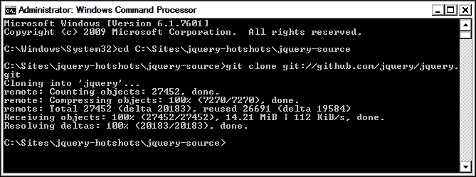
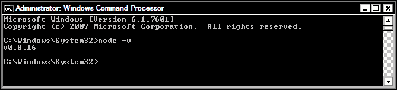
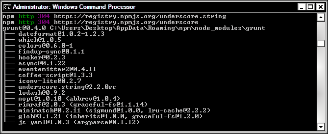
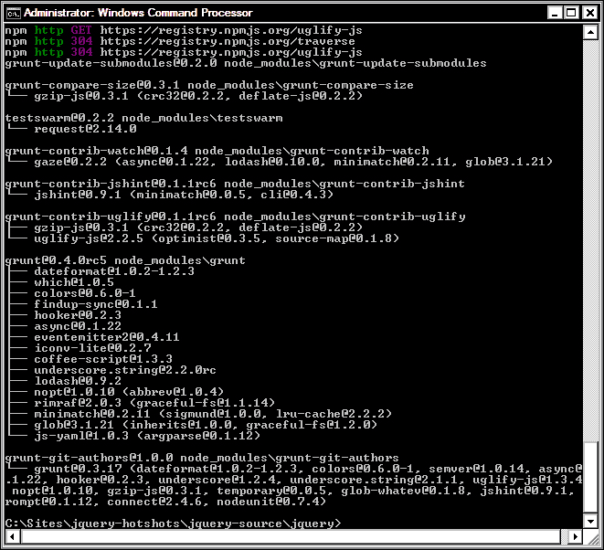
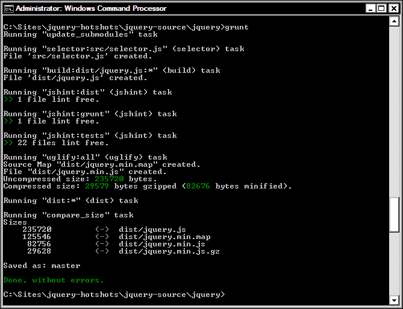
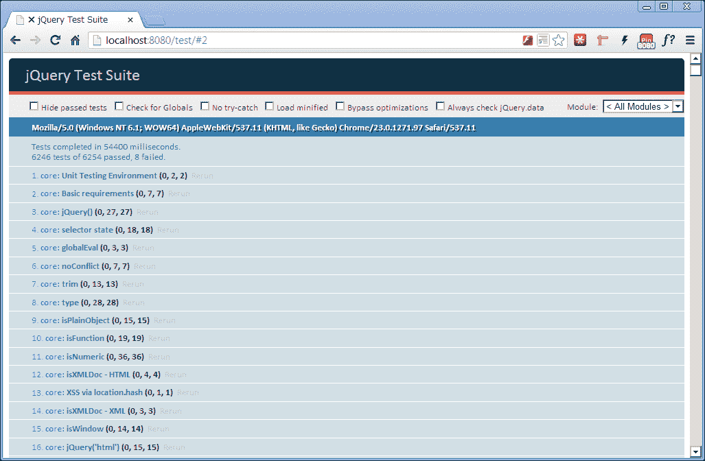

# 第七章：制作自己的 jQuery

在 jQuery 1.8 发布中，引入了一项全体设计希望已久的新功能-能够构建只包含特定任务所需功能的自定义版本的 jQuery。

# 任务简报

在这个项目中，我们将设置我们需要使用 jQuery 构建工具的环境。我们将看到我们需要使用的其他软件，如何运行构建工具本身，以及我们可以期望构建工具的输出。

## 为什么它很棒？

尽管有人通常会说他们在构建的每个网站中都使用 jQuery（对我来说通常是这样），但我期望很少有人会说他们在每个项目中都使用完全相同的 jQuery 方法，或者他们使用了大量可用方法和功能。

减少文件大小以满足移动空间的需求，以及诸如 **Zepto** 等微框架的兴起，它以更小的尺寸提供了大量 jQuery 功能，这促使 jQuery 提供了一种精简大小的方法。

从 jQuery 1.8 开始，我们现在可以使用官方 jQuery 构建工具来构建我们自己的定制版本的库，从而只选择我们所需的功能来最小化库的大小。

### 注意

有关 Zepto 的更多信息，请查看 [`zeptojs.com/`](http://zeptojs.com).

## 你的顶尖目标

要成功完成这个项目，我们需要完成以下任务：

+   安装 Git 和 Make

+   安装 Node.js

+   安装 Grunt.js

+   配置环境

+   构建自定义 jQuery

+   运行 QUnit 单元测试

## 任务清单

我们将使用 Node.js 来运行构建工具，所以你现在应该下载一个副本。Node 网站（[`nodejs.org/download/`](http://nodejs.org/download/)）提供了 64 位和 32 位 Windows 的安装程序，以及 Mac OS X 的安装程序。它还为 Mac OS X、Linux 和 SunOS 提供了二进制文件。下载并安装适合你的操作系统的版本。

jQuery 的官方构建工具（尽管它除了构建 jQuery 之外还可以做很多其他事情）是 **Grunt.js**，由 *Ben Alman* 编写。我们不需要下载它，因为它是通过 **Node Package Manager** （**NPM**）安装的。我们将在项目后面详细看这个过程。

### 注意

要了解更多关于 Grunt.js 的信息，请访问官方网站 [`gruntjs.com`](http://gruntjs.com).

首先，我们需要设置一个本地工作区。我们可以在根项目文件夹中创建一个名为 `jquery-source` 的文件夹。当我们克隆 jQuery Github 仓库时，我们会将 jQuery 源代码存储在这里，并且 Grunt 也会在这里构建最终版本的 jQuery。

# 安装 Git 和 Make

我们需要安装的第一件事是 Git，我们需要它来从 Github 存储库克隆 jQuery 源代码到我们自己的计算机，这样我们就可以处理源文件。我们还需要一个叫做 Make 的东西，但我们只需要在 Mac 平台上真正安装它，因为在 Windows 上安装 Git 时它会自动安装。

### 提示

因为我们将创建的文件仅供我们自己使用，并且我们不想通过将代码推送回存储库来为 jQuery 做出贡献，所以我们不需要担心在 Github 上创建账户。

## 准备起飞

首先，我们需要下载 Git 和 Make 的相关安装程序。根据你是在 Mac 还是 Windows 平台上开发，需要不同的应用程序。

### Mac 开发者

Mac 用户可以访问[`git-scm.com/download/mac`](http://git-scm.com/download/mac)获取 Git。

接下来我们可以安装 Make。Mac 开发者可以通过安装 XCode 来获取。可以从[`developer.apple.com/xcode/`](https://developer.apple.com/xcode/)下载。

### Windows 开发者

Windows 用户可以安装**msysgit**，可以通过访问[`code.google.com/p/msysgit/downloads/detail?name=msysGit-fullinstall-1.8.0-preview20121022.exe`](https://code.google.com/p/msysgit/downloads/detail?name=msysGit-fullinstall-1.8.0-preview20121022.exe)获取。

## 启动推进器

下载完成安装程序后，运行它们来安装应用程序。安装程序默认选择的设置对这个任务来说应该是合适的。首先我们应该安装 Git（或者在 Windows 上安装 msysgit）。

### Mac 开发者

Mac 开发者只需要运行 Git 的安装程序将其安装到系统中。安装完成后，我们可以安装 XCode。我们只需要运行安装程序，Make 以及一些其他工具将被安装并准备好。

### Windows 开发者

msysgit 的完整安装程序完成后，你应该可以看到一个命令行界面（标题为 MINGW32），表明一切准备就绪，你可以开始进行编码。但是，在我们开始编码之前，我们需要编译 Git。

为了做到这一点，我们需要运行一个叫做`initialize.sh`的文件。在 MINGW32 窗口中，`cd`到`msysgit`目录。如果你允许它安装到默认位置，你可以使用以下命令：

```js
cd C:\\msysgit\\msysgit\\share\\msysGit

```

一旦我们在正确的目录中，就可以在 CLI 中运行`initialize.sh`。和安装一样，这个过程可能需要一些时间，所以请耐心等待 CLI 返回`$`字符的闪烁光标。

### 注意

以这种方式编译 Git 需要互联网连接。

Windows 开发者需要确保`Git.exe`和 MINGW 资源可以通过系统的`PATH`变量访问。这可以通过转到**控制面板** | **系统** | **高级系统设置** | **环境变量**来更新。

在对话框的底部部分，双击**路径**，并将以下两个路径添加到位于您选择安装位置内的`msysgit`文件夹中的`bin`文件夹中的`git.exe`文件中：

+   `;C:\msysgit\msysgit\bin;`

+   `C:\msysgit\msysgit\mingw\bin;`

### 提示

**谨慎更新路径！**

您必须确保`Git.exe`的路径与其余路径变量之间用分号分隔。如果在添加`Git.exe`路径之前路径不以分号结尾，请确保添加一个。错误地更新路径变量可能导致系统不稳定和/或数据丢失。我在上一个代码示例的开头显示了一个分号，以说明这一点。

路径更新后，我们应该能够使用常规命令提示符来运行 Git 命令。

### 安装后的任务

在终端或 Windows 命令提示符（我将两者简称为 CLI 以便简洁起见）窗口中，我们应该首先`cd`进入我们在项目开始时创建的`jquery-source`文件夹。根据您本地开发文件夹的位置不同，此命令看起来会像下面这样：

```js
cd c:\jquery-hotshots\jquery-source

```

要克隆 jQuery 仓库，请在 CLI 中输入以下命令：

```js
git clone git://github.com/jquery/jquery.git

```

同样，在 CLI 返回到闪烁的光标以指示进程完成之前，我们应该看到一些活动。

根据您所开发的平台不同，您应该会看到类似以下截图的内容：



## 完成目标 - 迷你总结

我们安装了 Git，然后使用它克隆了 jQuery 的 Github 仓库到这个目录，以获取 jQuery 源代码的最新版本。如果您习惯于 SVN，克隆仓库的概念上与检出仓库是相同的。

再次说明，这些命令的语法在 Mac 和 Windows 系统上非常相似，但请注意，在 Windows 中使用路径时需要转义反斜杠。完成此操作后，我们应该会在`jquery-source`目录内看到一个名为`jquery`的新目录。

如果我们进入此目录，会看到一些更多的目录，包括：

+   `build`：此目录由构建工具用于构建 jQuery

+   `speed`：此目录包含基准测试

+   `src`：此目录包含编译为 jQuery 的所有单个源文件

+   `测试`：此目录包含 jQuery 的所有单元测试

它还包含一系列各种文件，包括：

+   授权和文档，包括 jQuery 的作者和项目贡献指南

+   Git 特定文件，如`.gitignore`和`.gitmodules`

+   Grunt 特定文件，如 `Gruntfile.js`

+   JSHint 用于测试和代码质量目的

我们不需要直接使用 Make，但是当我们构建 jQuery 源代码时，Grunt 会使用它，因此它需要存在于我们的系统中。

# 安装 Node.js

Node.js 是一个用 JavaScript 构建的运行服务器端应用程序的平台。例如，可以轻松创建一个接收和响应 HTTP 请求的网络服务器实例，使用回调函数。

服务器端 JS 与更熟悉的客户端对应物并不完全相同，但在您所熟悉和喜爱的舒适语法中，您会发现许多相似之处。在这个项目中，我们实际上不会编写任何服务器端 JavaScript — 我们只需要 Node 来运行 Grunt.js 构建工具。

## 为起飞做准备

要获取适用于您平台的适当安装程序，请访问 Node.js 网站 [`nodejs.org`](http://nodejs.org) 并点击下载按钮。如果支持的话，应该会自动检测到适合您平台的正确安装程序。

## 启动推进器

在 Windows 或 Mac 平台上，安装 Node 非常简单，因为两者都有安装程序。此任务将包括运行安装程序，这显然是简单的，并使用 CLI 测试安装。

在 Windows 或 Mac 平台上，运行安装程序，它将指导您完成安装过程。我发现在大多数情况下默认选项都很好。与之前一样，我们还需要更新`Path`变量以包括 Node 和 Node 的包管理器 NPM。这些目录的路径在不同平台上会有所不同。

### Mac

Mac 开发者应检查 `$PATH` 变量是否包含对 `usr/local/bin` 的引用。我发现这已经在我的 `$PATH` 中了，但是如果您发现它不存在，您应该添加它。

### 注意

有关更新 `$PATH` 变量的更多信息，请参阅 [`www.tech-recipes.com/rx/2621/os_x_change_path_environment_variable/`](http://www.tech-recipes.com/rx/2621/os_x_change_path_environment_variable/)。

### Windows

Windows 开发者需要像以前一样更新`Path`变量，其中包括以下路径：

+   `C:\Program Files\nodejs\;`

+   `C:\Users\Desktop\AppData\Roaming\npm;`

### 注意

Windows 开发者可能会发现 `Path` 变量已经包含了一个 Node 条目，因此可能只需要添加 NPM 的路径。

## 目标完成 - 迷你总结

一旦安装了 Node，我们就需要使用 CLI 与其进行交互。要验证 Node 是否已正确安装，请在 CLI 中键入以下命令：

```js
node -v

```

CLI 应该报告使用的版本，如下所示：



我们可以通过运行以下命令来测试 NPM：

```js
npm -v

```

# 安装 Grunt.js

在这个任务中，我们需要安装 Grunt.js，这个过程非常快速且简单，就像安装 Node 一样。我们甚至不需要手动下载任何东西，就像以前一样，相同的命令应该在 Mac 或 Windows 系统上都能工作，只需要非常小的调整。

## 启动推进器

我们需要使用**Node 包管理器 NPM**来安装它，可以通过运行以下命令来执行（注意，不能运行 Node 本身）：

```js
npm install -g grunt-cli

```

### 注意

Mac 用户可能需要在命令开头使用 `superuser do`：

```js
sudo –s npm install –g grunt

```

准备等待几分钟。同样，当 Grunt 需要的资源被下载和安装时，我们应该会看到大量活动。一旦安装完成，提示符将返回到闪烁的光标。CLI 应该会像以下截图一样显示，具体取决于您正在开发的平台：



## 完成目标 - 迷你总结

如果一切顺利（通常情况下应该如此，除非您的系统出现问题），那么在 Grunt 及其依赖项通过 NPM 全局下载和安装完成时，CLI 中将会看到大量活动，一旦完成，Grunt 将被安装并准备就绪。

### 提示

需要互联网连接才能使用 NPM 自动下载和安装软件包。

为了验证 Grunt 是否已正确安装，我们可以在 CLI 中输入以下命令：

```js
grunt -version

```

这将输出当前 Grunt 的版本，并且应该可以从任何目录中运行，因为 Grunt 已经全局安装了。

## 机密情报

除了构建自定义版本的 jQuery 外，Grunt 还可以用于创建几种不同的常见项目。我们首先选择以下项目类型之一：

+   `gruntfile`

+   `commonjs`

+   `jquery`

+   `node`

我们可以运行内置的 `init` 任务，并指定其中一个项目，Grunt 将继续设置包含该项目常用资源的骨架项目。

例如，运行 `jquery init` 任务将设置一个工作目录，用于创建一个 jQuery 插件。在该目录中，Grunt 将创建源脚本文件和单元测试的文件夹，以及创建一系列文件，包括一个 `package.json` 文件。

很可能在某个时候，所有新的 jQuery 插件都需要按照 Grunt 创建此项目类型时的方式来构建结构，因此，对于任何 jQuery 插件开发者来说，Grunt 将成为一款不可或缺的、节省时间的工具。

# 配置环境

在我们准备构建自己的 jQuery 版本之前，还有一些事情需要做。我们还可以通过构建 jQuery 的完整版本来测试我们的安装和配置，以确保一切都按预期工作。

## 准备起飞

我们需要安装一些额外的 Grunt 依赖项，以便我们可以使用从 Github 克隆的源文件来创建 jQuery 脚本文件。项目还使用了一系列 NPM 模块，这些模块也需要安装。幸运的是，NPM 可以自动为我们安装所有内容。

## 启动推进器

在构建 jQuery 源码之前，我们需要在 `jquery` 源码文件夹中安装一些额外的 Grunt 依赖项。我们可以使用 NPM 来做到这一点，因此可以在 CLI 中输入以下命令：

```js
npm install 

```

### 注意

在运行 `install` 命令之前，请确保您已经使用 `cd` 命令导航到 `jquery` 目录。

在运行 `install` 命令后，CLI 应该会有很多活动，而在进程结束时，CLI 应该会显示类似以下截图的内容：



为了测试一切是否按预期进行，我们可以构建 jQuery 的完整版本。只需在 CLI 中运行 `grunt` 命令：

```js
grunt

```

### 注意

如果此时出现任何错误或警告，说明某些内容未安装或配置正确。失败的原因可能有很多，所以最好的做法是卸载我们安装的所有内容，然后重新开始整个过程，确保所有步骤都严格按照要求进行。

同样，我们应该会在 CLI 上看到很多活动，以表明事情正在发生：



## 目标完成 - 迷你总结

安装过程完成后，我们应该会发现 Node 依赖项已经安装到 `jquery` 目录中的一个名为 `node_modules` 的目录中。在这个文件夹中是 Grunt 针对这个特定项目所需要的任何其他文件。

为了测试一切，我们然后使用 `grunt` 命令运行 jQuery 的默认构建任务。此任务将执行以下操作：

+   阅读所有 jQuery 源文件

+   为任务的输出创建一个 `/dist` 目录

+   构建 `jquery.js` 分发文件

+   使用 `jshint` 对分发文件进行代码检查

+   运行单元测试

+   构建分发文件的源映射

+   构建 `jquery.min.js` 分发文件

脚本文件应该是完整文件 230 KB，`.min` 文件为 81 KB，尽管随着 jQuery 版本号的增加，这些数字可能会有所不同。

# 构建自定义 jQuery

在这个任务中，我们将构建一个自定义版本的 jQuery，它不会包含构成 "完整" jQuery 的所有不同模块，这些模块会合并成一个文件，通常我们从 jQuery 站点下载，就像上一个任务结束时我们构建的文件一样，而是仅包含核心模块。

## 启动推进器

现在我们可以构建一个自定义版本的 jQuery。要构建一个精简版的 jQuery，省略所有非核心组件，我们可以在 CLI 中输入以下命令： 

```js
grunt custom:-ajax,-css,-deprecated,-dimensions,-effects,-offset

```

## 目标完成 - 迷你总结

一旦我们拥有源代码并配置好本地环境，我们就能够构建一个自定义版本的 jQuery，只包含核心组件，而省略了所有可选组件。

在这种情况下，我们排除了所有可选组件，但我们可以排除其中任何一个，或任意组合它们，以生成一个仅仅尽可能大的脚本文件。

如果此时检查 `/dist` 目录，我们应该会发现完整的脚本文件现在是 159 KB，而 `.min` 版本只有 57 KB，大约节省了文件大小的 30%；对于几分钟的工作来说，这还不错！

### 注意

项目功能或范围的变化可能需要重新构建源文件并包括以前排除的模块。一旦排除，就无法将可选模块添加到构建的文件中而不重新构建。

## 机密情报

随着 jQuery 的发展，特别是在 2.0 里程碑之后，越来越多的 jQuery 组件将被公开到构建工具作为可选组件，因此将有可能排除更广泛的库部分。

虽然在撰写时我们节省的文件大小可能会被我们的大多数访问者不会在其缓存中拥有我们的自定义版本的 jQuery 而需要下载的事实所抵消，但可能会有一天我们能够将文件大小缩小到这样的程度，以至于下载我们的超轻量级脚本文件仍然比从缓存中加载完整源文件更有效率。

# 使用 QUnit 运行单元测试

QUnit 是 jQuery 的官方测试套件，并包含在我们在项目早期从 Git 克隆的源代码中。如果我们在`jquery`文件夹内的测试文件夹中查找，我们应该会发现有很多单元测试，用于测试构成 jQuery 的不同组件。

我们可以针对 jQuery 的各个组件运行这些测试，以查看 QUnit 需要的环境，并查看使用它测试 JavaScript 文件有多容易。为此任务，我们需要安装一个 web 服务器和 PHP。

### 注意

有关 QUnit 的更多信息，请参阅[`qunitjs.com`](http://qunitjs.com)上的文档。

## 为起飞做好准备

Mac 开发者应该已经拥有运行 QUnit 所需的一切，因为 Mac 计算机已经预装了 Apache 和 PHP。然而，Windows 开发者可能需要做一些设置。

在这种情况下，web 服务器有两个选择，Apache 或者 IIS。两者都支持 PHP。那些希望使用 Apache 的开发者可以安装像**WAMP**（**Windows Apache Mysql PHP**）这样的东西，以便安装和配置 Apache，并将 MySQL 和 PHP 安装为模块。

要下载并安装 WAMP，请访问 Wamp Server 网站的**下载**部分（[`www.wampserver.com/en/`](http://www.wampserver.com/en/)）。

选择适合您平台的安装程序并运行它。这应该会安装和配置一切必要的内容。

希望使用 IIS 的人可以通过控制面板中的**程序和功能**页面的**添加/删除 Windows 组件**区域安装它（在这种情况下需要 Windows 安装光盘），或者使用**Web 平台安装程序**（**WPI**），可以从[`www.microsoft.com/web/downloads/platform.aspx`](http://www.microsoft.com/web/downloads/platform.aspx)下载。

下载并运行安装程序。一旦启动，搜索 IIS 并让应用程序安装它。安装完成后，也通过 WPI 搜索 PHP 并进行安装。

要使用 web 服务器和 PHP 运行 QUnit，你需要将项目文件夹内的`jquery`目录中的源文件复制到 web 服务器用于提供文件的目录中，或者配置 web 服务器以提供`jquery`目录中的文件。

在 Apache 上，我们可以通过编辑`httpd.conf`文件（在开始菜单中应该有一个条目）来配置默认目录（当浏览器请求时用于提供页面的目录）。向下阅读配置文件，直到找到默认目录的行，并更改它，使其指向项目文件夹中的`jquery`目录。

在 IIS 上，我们可以使用 IIS 管理器添加一个新网站。在左侧的**连接**窗格中右键单击**站点**，然后选择**添加网站…**。填写打开的对话框中的详细信息，我们就可以开始了。

## 启动推进器

要运行测试，我们只需要在浏览器中使用`localhost:8080`（或配置的任何主机名/端口号）访问`/test`目录：

```js
localhost:8080/test
```

测试应该显示如下屏幕截图所示：



## 完成目标 - 小结

当在浏览器中访问测试套件的 URL 时，QUnit 将运行为 jQuery 编写的所有单元测试。目前对完整版本的 jQuery 有超过 6000 个测试，对所有可选模块都排除的自定义版本有约 4000 个测试。

你可能会发现一些测试失败。别担心，这是正常的，原因是我们从 Git 获取的默认 jQuery 版本将是最新的开发版本。就我写作时而言，当前版本的 jQuery 是 1.8.3，但从 Git 克隆的版本是 2.0.0pre。

要解决这个问题，我们可以切换到当前稳定分支，然后从那里进行构建。所以如果我想获取版本 1.8.3，我可以在 CLI 中使用以下命令：

```js
git checkout 1.8.3

```

然后我们可以再次构建源码，运行 QUnit，所有测试应该都会通过。

### 注意

在检出 jQuery 源码的另一个版本后，我们需要在`jquery`目录中运行`npm install`来重新安装节点依赖项。

## 机密情报

单元测试并不总是被前端开发者严格遵循，但是一旦你的应用程序跨越了一定的规模和复杂度阈值，或者在团队环境中工作时，单元测试就变得对于维护至关重要，所以至少学习基础知识是最好的。

QUnit 使得编写 JavaScript 单元测试变得容易。它采用了围绕着用简单函数证明的断言概念的简单 API。QUnit 的 API 包括我们可以使用的方法来进行这些断言，包括：

+   `equal()`

+   `notEqual()`

+   `ok()`

这样可以轻松检查变量是否等于特定值，或者函数的返回值是否不等于特定值，等等。

在 QUnit 中，使用全局的 `test()` 方法构建测试，该方法接受两个参数：描述测试的字符串和执行测试的函数：

```js
test("Test the return value of myCustomMethod()", function() {
    //test code here
});
```

在函数内部，我们可以使用一个或多个断言来检查我们正在测试的方法或函数执行的操作的结果：

```js
var value = myCustomMethod();
equal(value, true, "This method should return true");
```

`equal()` 方法检查第一个和第二个参数是否相等，最后一个参数是描述我们期望发生的情况的字符串。

### 提示

如果打开 `jquery/test/unit` 目录中的一些脚本文件，可以很容易地看出如何构造测试。

QUnit 网站上的文档非常出色。它不仅清晰简洁地描述了 API，还提供了大量关于单元测试概念的信息，因此对于初学者来说是一个很好的起点。

在该网站上，您还可以找到在 Grunt 之外运行 QUnit 所需的源文件以及一个 HTML 模板页面，您可以在浏览器中运行测试套件。

# 任务完成

在这个任务中，我们不仅学会了如何通过排除不需要的组件来构建自定义版本的 jQuery，以及如何运行 jQuery 的单元测试套件，而且，也许更重要的是，我们学会了如何设置一个体面的构建环境，用于编写干净、无错的应用级 JavaScript。

# 你准备好了吗？挑战来了！

我们已经学会了如何构建我们自己的 jQuery，并排除了最大数量的组件，所以在撰写本文时，我们已经没有太多可以做的了。

如果您在 jQuery 1.9 版本发布后阅读本文，则可能会有更多的组件可以排除，或者其他构建 jQuery 的技术，因此，为了真正巩固您对构建过程的理解，请构建一个新的自定义构建，也排除任何新的可选组件。

如果没有任何新的可选组件，我建议您花些时间为您编写的任何自定义脚本编写 QUnit 测试。其思想是编写一个复制错误的测试。然后您可以修复错误并观察测试通过。
