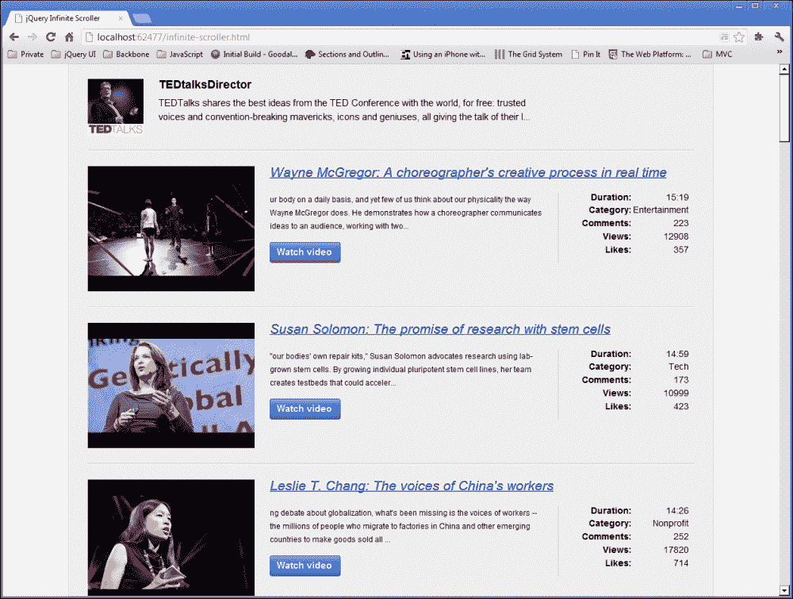
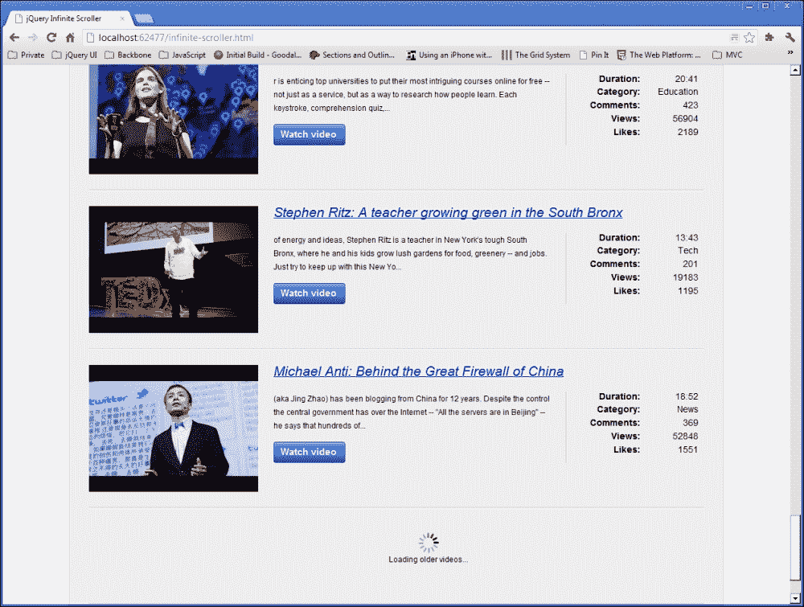

# 第八章：使用 jQuery 进行无限滚动

无限滚动是许多热门网站采用的一种技术，它最小化了页面最初加载的数据量，然后在用户滚动到页面底部时逐步加载更多数据。你可以在 Facebook 或 Twitter 的时间线上看到这种效果，等等。

# 任务简报

在本项目中，我们将使用 jQuery 构建一个无限滚动系统，模仿前述网站上看到的效果。我们将请求一些数据并在页面上显示它。一旦用户滚动到页面底部，我们将请求下一页的数据，依此类推，直到用户继续滚动。

一旦我们建立了无限滚动系统，我们应该得到类似以下截图的结果：



## 为什么很棒？

如果您有大量数据要显示，并且它可以轻松按照时间顺序排列，那么使用无限滚动技术是最大程度地提高页面用户体验的简单方法，通过渐进式披露向用户逐渐展示更多内容。

首先可以显示一小部分数据，这样可以加快页面加载速度，同时防止您的访问者被大量数据所压倒，随着用户交互逐渐增加。

本项目将要消费的数据是 YouTube 上 TEDTalks 频道上传的视频列表，以 JSON 格式提供。

### 注意

请记住，JSON 是一种轻量级的基于文本的数据格式，非常适合在网络上进行传输。有关 JSON 的更多信息，请参阅 [`www.json.org/`](http://www.json.org/)。

在该频道上可以找到数千个视频，因此它是我们项目的一个很好的测试基础。按时间顺序排序的数据是一个无限滚动的绝佳基础。

### 注意

TEDTalks 频道可以直接在 YouTube 网站上查看，网址是 [`www.youtube.com/user/tedtalksdirector`](http://www.youtube.com/user/tedtalksdirector)。

## 您的热门目标

该项目将分解为以下任务：

+   准备基础页面

+   获取初始供稿

+   显示初始结果集

+   处理滚动到页面底部

## 任务清单

我们可以像在之前的一些示例中那样链接到 JsRender 的托管版本，但在这个项目中，我们将使用一个称为 imagesLoaded 的便捷小型 jQuery 插件，它允许我们在所选容器中的所有图像加载完成时触发回调函数。

imagesLoaded 插件可以从 [`github.com/desandro/imagesloaded`](https://github.com/desandro/imagesloaded) 下载，并应保存在我们项目的 `js` 目录中。

# 准备基础页面

在此任务中，我们将设置我们在整个项目中要使用的文件，并准备我们的无限滚动页面的基础。

## 准备起飞

和往常一样，我们将为此项目使用自定义样式表和自定义脚本文件，所以让我们首先添加它们。创建一个名为`infinite-scroller.js`的新 JavaScript 文件，并将其保存在`js`目录中。然后创建一个名为`infinite-scoller.css`的新样式表，并将其保存在`css`目录中。最后，将`template.html`文件的副本保存在根项目文件夹中，并将其命名为`infinite-scroller.html`。

## 启动推进器

示例页面使用的底层标记将是最小的 - 我们将使用的许多元素将由我们的模板动态生成，我们也可以在此任务中添加它们。

首先，我们应该将对新文件的引用添加到 HTML 页面中。首先，在`infinite-scroller.html`的`<head>`中，直接在对`common.css`的链接之后添加一个`<link>`元素：

```js
<link rel="stylesheet" href="css/infinite-scroller.css" />
```

接下来，我们可以链接到两个新的 JavaScript 文件。在 jQuery 之后直接添加以下`<script>`元素：

```js
<script src="img/jsrender.js">
</script>
<scriptsrc="img/jquery.imagesloaded.min.js"></script>
<scriptsrc="img/infinite-scroller.js"></script>
```

我们还需要添加一个简单的容器来渲染我们的数据。将以下代码添加到页面的`<body>`中：

```js
<div id="videoList"></div>
```

现在我们可以添加我们将要使用的模板了。在这个项目中，我们将使用两个模板 - 一个用于呈现外部容器和用户数据，它将被呈现一次，另一个用于呈现视频列表，我们可以根据需要重复使用。

与以前一样，它们将位于页面`<body>`中的`<script>`元素内。在现有的`<script>`元素之前，添加以下新模板：

```js
<script id="containerTemplate" type="text/x-jsrender">
    <section>
        <header class="clearfix">
            <imgsrc="img/{{>avatar}}" alt="{{>name}}" />
            <hgroup>
                <h1>{{>name}}</h1>
                <h2>{{>summary.substring(19, 220)}}</h2>
            </hgroup>
        </header>
        <ul id="videos"></ul>
    </section>
</script>
```

现在轮到视频模板了：

```js
<script id="videoTemplate" type="text/x-jsrender">
    <li>
        <article class="clearfix">
            <header>
                <a href="{{>content[5]}}" title="Watch video">
                    <imgsrc="img/{{>thumbnail.hqDefault}}" alt="{{>title}}" />
                </a>
                <cite>
                    <a href="{{>content[5]}}" 
                    title="Watch video">{{>title}}</a>
                </cite>
            </header>
            <p>
                {{>~Truncate(12, description)}}
                    <a class="button" href="{{>content[5]}}" 
                    title="Watch video">Watch video</a>
            </p>
            <div class="meta">
                <dl>
                    <dt>Duration:</dt>
                    <dd>{{>~FormatTime(duration)}}</dd>
                    <dt>Category:</dt>
                    <dd>{{>category}}</dd>
                    <dt>Comments:</dt>
                    <dd>{{>commentCount}}</dd>
                    <dt>Views:</dt>
                    <dd>{{>viewCount}}</dd>
                    <dt>Likes:</dt>
                    <dd>{{>likeCount}}</dd>
                </dl>
            </div>
        </article>
    </li>
</script>
```

现在我们也可以为这些元素添加样式了。在`infinite-scroller.css`中，添加以下选择器和规则：

```js
section { width:960px; padding-top:20px; margin:auto; }
section { 
    width:960px; padding:2em 2.5em 0; 
    border-left:1px solid #ccc; border-right:1px solid #ccc; 
    margin:auto; background-color:#eee; 
}
section> header { 
    padding-bottom:2em; border-bottom:1px solid #ccc; 
}
img, hgroup, hgroup h1, hgroup h2 { float:left; }
hgroup { width:80%; }
headerimg { margin-right:2em; }
hgroup h1 { font-size:1.5em; }
hgroup h1, hgroup h2 { width:80%; }
hgroup h2 { 
    font-weight:normal; margin-bottom:0; font-size:1.25em;
    line-height:1.5em; 
}
ul { padding:0; }
li { 
    padding:2em 0; border-top:1px solid #fff; 
    border-bottom:1px solid #ccc; margin-bottom:0; 
    list-style-type:none; 
}
article header a { 
    display:block; width:27.5%; margin-right:2.5%; float:left; }
aimg { max-width:100%; }
article cite { 
    width:70%; margin-bottom:10px; float:left; 
    font-size:1.75em; 
}
article cite a { width:auto; margin-bottom:.5em; }
article p { 
    width:45%; padding-right:2.5%; 
    border-right:1px solid #ccc; margin:0 2.5% 2em 0;
    float:left; line-height:1.75em; 
}
article .button { display:block; width:90px; margin-top:1em; }
article dl { width:19%; float:left; }
article dt, article dd { 
    width:50%; float:left; font-size:1.15em; text-align:right; 
} 
article dt { margin:0 0 .5em; clear:both; font-weight:bold; }

li.loading{ height:100px; position:relative; }
li.loading span { 
    display:block; padding-top:3em; margin:-3em 0 0 -1em; 
    position:absolute; top:50%; left:50%; text-align:center;
    background:url(../img/ajax-loader.gif) no-repeat 50% 0; 
}
```

### 注意

此项目中使用的`ajax-loader.gif`图像可以在本书的附带代码下载中找到。

## 目标完成 - 小结

因此，实际上整个页面都是由我们添加到页面`<body>`中的模板构建的，除了一个空的`<div>`，它将为我们提供一个容器来渲染数据。该模板包含了用于视频列表的标记，以及用于显示视频作者信息的标记。

在第一个模板中，数据的外部容器是一个`<section>`元素。在其中是一个`<header>`，显示有关用户的信息，包括他/她的个人资料图片、姓名和简介。

YouTube 返回的实际简介可能相当长，因此我们将使用 JavaScript 的`substring()`函数返回此摘要的缩短版本。该函数传递两个参数；第一个是从哪个字符开始复制，第二个是结束字符。

在第二个模板中，实际的视频列表将显示在第一个模板中添加的`<ul>`元素中，每个视频占据一个`<li>`。在每个`<li>`内，我们有一个`<article>`元素，这是一个适当的独立内容单元的容器。

在`<article>`中，我们有一个包含视频的一些关键信息的`<header>`，如标题和缩略图。在`<header>`之后，我们显示视频的简短摘要在`<p>`元素中。我们还使用我们的缩短帮助函数`Truncate()`，从第 12 个字符开始。

最后，我们使用`<dl>`显示关于视频的一些元信息，例如播放次数、点赞次数和视频的持续时间。

我们使用另一个辅助函数来显示视频中的持续时间，`FormatTime()`。YouTube 返回视频的长度（以秒为单位），所以我们可以将其转换为一个格式良好的时间字符串。

我们使用`>`字符来 HTML 编码我们插入到页面中的任何数据。这样做是为了安全考虑，始终是最佳选择。

添加的 CSS 纯粹是用于表现的；仅用于以列表格式布局页面，并使其看起来略有趣味和可呈现。请随意更改布局样式的任何方面，或者元素的主题。

## 机密情报

你们中注重 SEO 的人会意识到，一个几乎完全由 AJAX 传递的内容构建的页面不太可能在搜索结果中得到很好的位置。传统上，这几乎肯定是正确的，但现在我们可以使用 HTML History API 中令人惊叹的`pushState()`方法来提供一个完全可由搜索引擎索引的动态网站。

`pushState()`的完整描述超出了本书的范围，但有很多很好的示例和教程。被许多人认为是 History API 的权威指南的是 Mozilla 开发者网络上关于`pushState()`的文档，其中包括关于`pushState()`的部分。你可以在 [`developer.mozilla.org/en-US/docs/DOM/Manipulating_the_browser_history`](https://developer.mozilla.org/en-US/docs/DOM/Manipulating_the_browser_history) 上查看文档。

# 获取初始饲料

在这个任务中，我们将专注于获取初始数据集，以便在页面首次加载时创建页面。我们需要编写我们的代码，使得获取第一页数据的函数对于任何数据页都是可重用的，以便我们稍后在项目中可以使用它。

## 准备起飞

我们可以使用 jQuery 提供的标准`document ready`快捷方式，就像我们在许多之前的项目中所做的那样。我们可以通过将以下代码添加到我们之前创建的`infinite-scroller.js`文件中来做好准备：

```js
$(function () {

    //rest of our code will go here...  

});
```

## 启动推进器

首先，我们可以添加从 YouTube 检索数据的代码。用以下内容替换前面代码段中的注释：

```js
var data = {},
    startIndex = 1;

var getUser = function () {
    return $.getJSON("http://gdata.youtube.com/feeds/api/users/tedtalksdirector?callback=?", {
        v: 2,
        alt: "json"
    }, function (user) {
        data.userdata = user.entry;
    });
};

var getData = function () {
    return $.getJSON("https://gdata.youtube.com/feeds/api/videos?callback=?", {
        author: "tedtalksdirector",
        v: 2,
        alt: "jsonc",
        "start-index": startIndex
    }, function (videos) {
        data.videodata = videos.data.items;
    });
};
```

接下来，我们需要稍微处理一下响应。我们可以使用以下代码，在我们之前添加的代码之后直接添加，以执行回调函数，一旦两个 AJAX 请求都完成，就会执行该回调函数：

```js
$.when(getUser(), getData()).done(function () {
    startIndex+=25;

    var ud = data.userdata,
        clean = {};

    clean.name = ud.yt$username.display;
    clean.avatar = ud.media$thumbnail.url;
    clean.summary = ud.summary.$t;
    data.userdata = clean;
});
```

## 目标完成 - 迷你总结

我们首先定义了几个变量。第一个是一个空对象，我们将用我们的 AJAX 请求的结果填充它。第二个是一个整数，表示我们希望获取的第一个视频的索引号。YouTube 视频不像常规的 JavaScript 数组那样从零开始，所以我们最初将变量定义为`1`。

接下来，我们添加了我们将用于获取数据的两个函数。第一个是请求获取我们将要显示其 Feed 的用户的个人资料数据。我们只会在页面最初加载时使用此函数一次，但您将会看到为什么重要的是我们以这种方式将函数定义为变量。

第二个函数将被重用，因此将其存储在一个变量中是一个很好的方法，可以随时调用它以获取新的视频数据页面。重要的是这两个函数都返回`getJSON()`方法返回的`jqXHR`对象。

这两个请求都使用 jQuery 的`getJSON()`方法进行请求。在用户请求中，我们只需要设置`v`和`alt`查询参数，这些参数设置在传递给`getJSON()`的第二个参数中的对象中。我们想要获取其个人资料数据的用户实际上是我们正在进行请求的 URL 的一部分。

此请求的回调函数简单地将从请求接收到的`user.entry`对象的内容添加到我们的`data`对象的`userdata`属性中。

第二个请求需要稍微更多的配置。我们仍然使用`v`参数设置我们要使用的 API 版本，但这次我们将响应格式设置为`jsonc`而不是`json`。在此请求的回调函数中，我们将视频数组存储在我们的`data`对象的`videodata`属性中。

**JSON-C** 代表 json-in-script，是 Google 可以针对某些请求进行响应的格式。以 JSON-C 格式返回的数据通常比以 JSON 格式返回的相同响应更轻量级，更高效，这是由于 Google 的 API 已经进行了工程化。

当使用这种格式时，我们需要使用的属性只有在返回时才会返回。我们在请求用户数据时不使用它的唯一原因是因为该特定查询没有 JSON-C 响应。

### 注

有关从 Google 的 API 返回的 JSON-C 响应的更多信息，请参阅 [`developers.google.com/youtube/2.0/developers_guide_jsonc`](https://developers.google.com/youtube/2.0/developers_guide_jsonc) 上的文档。

接下来我们使用 jQuery 的`when()`方法来启动我们的两个请求，然后使用`done()`方法在两个`jqXHR`对象都已解析后执行回调函数。这就是为什么单独使用的`getUser()`函数以与可重用的`getData()`函数相同的方式结构化很重要的原因。

在`done()`的回调函数内部，我们首先将`startIndex`变量增加 25，这样当我们发出另一个请求时，我们就会获得下一个包含 25 个视频的“页面”。现在我们已经有了第一页的数据，当我们稍后使用`getData()`函数时，我们将自动获得“下一页”的结果。

### 注意

`when()`和`done()`方法是自 jQuery 1.5 以来处理异步操作的首选方法。

此时，我们只需要对我们的`userdata`对象进行一点处理。有一大堆我们不需要使用的数据，而我们需要使用的一些数据被埋在嵌套对象中，所以我们简单地创建一个名为`clean`的新对象，并直接在这个对象上设置我们需要的数据。

一旦完成了这个操作，我们就可以将我们的干净对象保存回我们的`data`对象，覆盖原始的`userdata`对象。这样做可以使对象在我们的模板中更容易处理。

# 显示初始结果集

现在我们已经从 YouTube 的 API 返回数据，我们可以渲染我们的模板了。然而，为了渲染我们的模板，我们需要添加用于格式化部分数据的辅助函数。在此任务中，我们可以添加这些辅助函数，然后渲染模板。

## 启动推进器

模板辅助函数不需要驻留在`$.done()`回调函数内部。我们可以直接在`infinite-scroller.js`中的此代码之前添加它们：

```js
var truncate = function (start, summary) {
        return summary.substring(start,200) + "...";
    },
    formatTime = function (time) {
        var timeArr = [],
            hours = Math.floor(time / 3600),
            mins = Math.floor((time % 3600) / 60),
            secs= Math.floor(time % 60);

        if (hours> 0) {
            timeArr.push(hours);
        }

        if (mins< 10) {
            timeArr.push("0" + mins);
        } else {
            timeArr.push(mins);
        }

        if (secs< 10) {
            timeArr.push("0" + secs);
        } else {
            timeArr.push(secs);
        } 

        return timeArr.join(":");
    };
```

接下来，我们只需要注册这些辅助函数。在上一段代码后面直接添加以下内容：

```js
$.views.helpers({
    Truncate: truncate, 
    FormatTime: formatTime
});
```

最后，我们可以渲染我们的模板。我们希望一个可以从代码的任何位置调用的函数，以备将来进行进一步的请求。在注册辅助函数后添加以下代码：

```js
var renderer = function (renderOuter) {

    var vidList = $("#videoList");

    if (renderOuter) {
        vidList.append(
$("#containerTemplate").render(data.userdata));
    }
    vidList.find("#videos")
           .append($("#videoTemplate").render(data.videodata));
}
```

现在我们只需要在我们的`$.done()`回调函数的末尾调用这个函数：

```js
renderer(true);
```

## 目标完成 - 小结

我们的第一个辅助函数，`truncate()`非常简单。我们只是返回该函数作为参数接收的字符串的缩短版本。`substring()`函数接受两个参数；第一个是在字符串中开始复制的位置，第二个参数是要复制的字符数，我们固定在`200`。  

为了显示字符串已经被缩短，我们还在返回的字符串末尾附加了一个省略号，这就是我们在这里使用辅助函数的原因，而不是像之前直接在模板中使用子字符串一样。

`formatTime()`辅助函数稍微复杂一些，但仍然相对简单。这个函数将接收以秒为单位的时间，我们希望将其格式化为稍微漂亮一些的字符串，显示小时（如果有的话）、分钟和秒。

我们首先创建一个空数组来存储字符串的不同组成部分。然后，我们创建一些变量来保存我们将要创建的时间字符串的小时、分钟和秒部分。

小时数通过将总秒数除以 3600（一小时的秒数）来计算。我们对其使用`Math.floor()`，以便只得到一个整数结果。我们需要稍微不同地计算分钟，因为我们需要考虑小时数。

在这里我们使用模数运算符（`%`）首先去除任何小时，然后将余数除以`60`，这将告诉我们总分钟数或在考虑小时后剩余的分钟数。要计算秒数，我们只需要再次使用模数运算符和值`60`。

然后，我们使用一系列条件语句来确定要添加到数组中的变量。如果有任何小时数（这在视频的性质上是不太可能的），我们将它们推入数组中。

如果分钟数少于`10`，我们在分钟数前添加`0`，然后将其推入数组中。如果分钟数超过`10`，我们只需将`mins`变量推入数组中。在将其推入数组之前，对`secs`变量应用相同的逻辑。

这个函数通过将数组中的项目连接起来并使用冒号作为分隔符来返回一个格式良好的时间。字符串将以`H:MM:SS`或`MM:SS`的格式呈现，具体取决于视频的长度。然后，我们使用 JsRender 的`helpers`对象向模板注册辅助函数，该对象本身嵌套在由模板库添加到 jQuery 的`views`对象中。我们希望添加的辅助函数被设置为对象文字中的值，其中键与模板中的函数调用匹配。

接下来，我们添加了一个函数，我们可以调用该函数来呈现我们的模板。`renderer()`函数接受一个布尔值参数，指定是否同时呈现容器模板和视频模板，或只呈现视频模板。在函数内部，我们首先缓存对视频列表的外部容器的引用。

如果`renderOuter`参数具有真值（也就是说，如果它具体保留了值`true`），我们就呈现`containerTemplate`并将其附加到页面的空`<div>`中。然后，我们呈现`videoTemplate`，将呈现的 HTML 附加到由`containerTemplate`添加的`<ul>`中。

最后，我们第一次调用我们的`renderer()`函数，将`true`作为参数传递，以同时呈现容器和初始视频列表。

# 处理滚动到页面底部

现在我们已经得到了第一页的视频，我们想添加一个处理程序，监视窗口的滚动事件，并检测页面是否已经滚动到底部。

## 启动推进器

首先，我们需要添加一些新的变量。修改文件顶部附近的第一组变量，使其显示如下：

```js
var data = {},
    startIndex = 1,
    listHeight = 0,
    win = $(window),
    winHeight = win.height();
```

现在我们需要更新我们的`renderer()`函数，以便在模板被渲染后更新新的`listHeight`变量。在我们渲染`videoTemplate`后添加以下代码：

```js
vidList.imagesLoaded(function () {
    listHeight = $("#videoList").height();
});
```

接下来，我们可以为滚动事件添加一个处理程序。在`infinite-scroller.js`中的`when()`方法后面，添加以下代码：

```js
win.on("scroll", function () {

    if (win.scrollTop() + winHeight >= listHeight) {
        $("<li/>", {
            "class": "loading",
            html: "<span>Loading older videos...</span>"
        }).appendTo("#videos");

        $.when(getData()).done(function () {
            startIndex += 25;

            renderer();

            $("li.loading").remove();

        });
    }
}).on("resize", function() {
    winHeight = win.height();
});
```

我们正在使用一个旋转器来向用户显示正在检索更多数据的信息。我们需要一些额外的样式来处理旋转器的位置，所以我们也可以将以下代码添加到我们的`infinite-scroller.css`样式表的底部：

```js
li.loading{ height:100px; position:relative; }
li.loading span { 
    display:block; padding-top:38px; margin:-25px 0 0 -16px; 
    position:absolute; top:50%; left:50%; text-align:center; 
    background:url(../img/ajax-loader.gif) no-repeat 50% 0;
}
```

## 目标完成 - 迷你总结

我们使用我们缓存的`win`对象和`on()`方法将处理程序附加到窗口。事件类型被指定为`scroll`。在回调函数内部，我们首先检查当前窗口的`scrollTop`属性加上视口的`height`是否大于或等于我们的`videolist`容器的`height`。我们需要这样做来知道页面何时滚动到底部。

如果两个高度相等，我们创建一个临时加载器，向用户提供视觉反馈，表明正在发生某些事情。我们将一个新的`<li>`元素附加到包含视频的`<ul>`中，并给它一个类名为`loading`，以便我们可以轻松地用一些 CSS 来定位它。我们将一个`<span>`元素设置为新列表项的内容。

我们可以使用 jQuery 的`scrollTop()`方法获取`scrollTop`属性的当前值。我们正在使用窗口`height`的缓存值。我们的滚动处理程序将相当密集，因为它将在用户滚动时被调用，因此使用窗口`height`的缓存值会使这个过程稍微更有效率一些。

但这意味着如果窗口被调整大小，这个值将不再准确。我们通过为窗口添加一个调整大小处理程序来解决这个问题，每当窗口调整大小时重新计算这个值。这是通过在滚动处理程序之后链接另一个对`on()`方法的调用来完成的，该方法查找`window`对象的调整大小事件，并相应地更新`winHeight`变量。

然后我们再次使用 jQuery 的`when()`方法，调用我们的`getData()`函数来检索下一个 25 个视频。我们还再次使用`done()`方法来在请求完成后执行回调函数。

在这个回调函数中，我们再次将我们的`startIndex`变量增加`25`，准备请求下一组视频。`getData()`函数将填充我们的`data`对象，新的视频数据，所以我们只需调用我们的`renderer()`函数来显示新的视频，然后移除临时加载器。

在这一点上，我们应该有一个完全功能的无限加载器，当用户滚动到页面底部时加载更多视频。当我们滚动到底部时，我们应该能够运行页面并看到类似以下的内容：



# 任务完成

在这个项目中，我们编写的大部分代码都是关于获取我们想要显示的数据。实际上，添加无限滚动功能本身只需要一小部分代码 - 一个监视滚动事件并在文档滚动到底部时触发新数据请求的单个处理程序。

如你所见，这是一个非常容易作为附加层来修改现有功能的功能。这种技术最适合能够轻松按时间顺序排列的数据，新项目出现在顶部，旧项目出现在底部。

这并不一定是分页数据的完全替代，但在处理诸如新闻故事、博客文章、推文或状态更新等内容时，肯定是有意义的。它与社交数据配合得非常好。

# 你准备好大干一场了吗？一个高手挑战。

在这个项目中，我们只是为每个 YouTube 视频提供了回到全屏视频播放器的链接。所以，当访问者点击视频缩略图或标题时，他们将被送到 YouTube 实际观看视频。

虽然这样做并没有什么本质上的错，但更酷的做法是打开一个包含在`<iframe>`中嵌入的视频播放器的灯箱。这样访问者就可以在不离开您的网站的情况下观看视频。来自 YouTube 视频的响应包含一个可以用作`<iframe>`的`src`属性的链接，那为什么不试试自己连接一下呢？

你会注意到，如果你滚动到页面底部，然后立即继续向下滚动，同一组视频将被多次请求。作为另一个任务，看看你是否可以通过仅在当前没有请求正在进行时才请求更多数据来防止这种情况发生。

这应该非常容易设置，只需在请求开始时设置一个标志，结束时删除标志。然后，只有在标志未被设置时才能发出请求。
