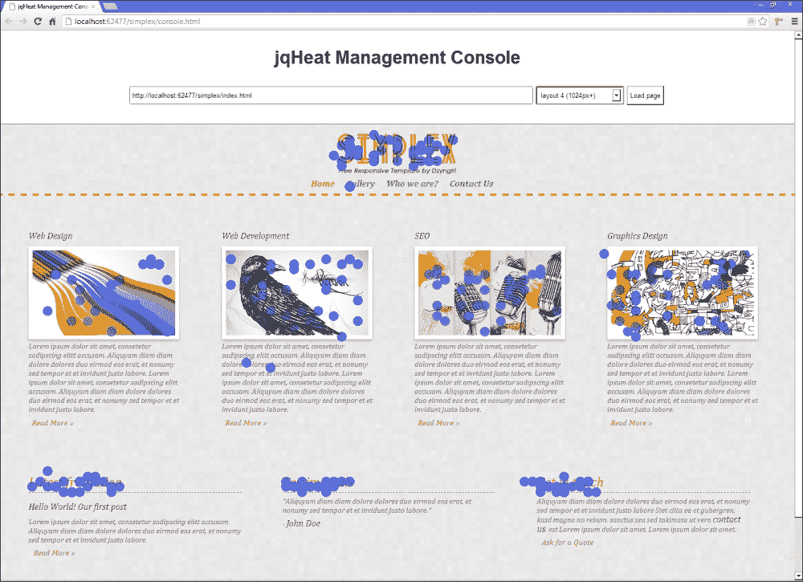
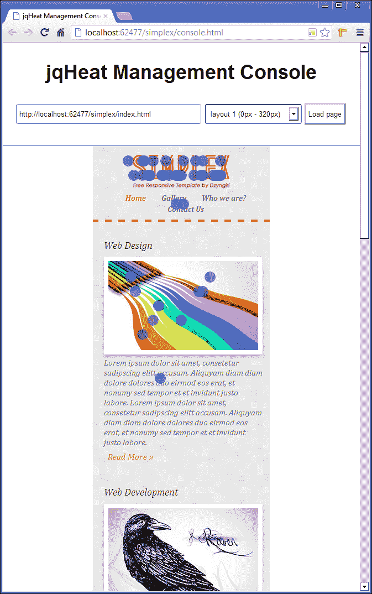

# 第九章：一个 jQuery 热图

热图可以告诉您有关您的网站如何使用的很多信息。在分析领域，这是一种有价值的工具，可以告诉您网站的哪些功能被最多使用，以及哪些区域可能需要一些改进以真正吸引访问者。

# 任务简报

在这个项目中，我们将建立自己的热图，记录任何页面的哪些区域被点击最多。我们需要建立一种实际记录每次点击发生的位置以及将该信息传输到某个地方以便存储的方法。

我们实际上将构建整个热图的两个不同部分 - 客户端部分在访问者的浏览器中执行以捕获点击，并且一个管理控制台，向网站的所有者显示热图。

我们需要考虑不同的分辨率和设备，以便捕获尽可能多的信息，并确保我们的脚本足够高效地在后台运行而不被注意到。

当然，在客户端不会发生任何可见的事情（所有这部分将做的就是记录和存储点击），但是在项目结束时，我们将能够在管理控制台中显示有关页面上所有点击的数量和位置的详细信息，如以下屏幕截图所示：



## 它为什么很棒？

所有的分析对网站的所有者都是有用的，并且可以提供有关访问网站的人的详细信息，包括他们的计算环境，他们进入网站的页面，他们离开的页面以及他们访问的页面数量。

从开发者的角度来看，热图同样具有信息量。您页面的哪些部分被点击最频繁？热图可以告诉您。

我们将构建的热图将适用于能够根据设备屏幕宽度改变其布局以适应的响应式网站。单个项目远远不足以涵盖响应式设计的所有方面，因为我们主要关注脚本本身，所以我们不会详细介绍它。

如果您已经使用过响应式技术，那么您将不需要额外的信息。如果您之前没有使用过响应式原理，那么这应该是一个关于该主题的温和介绍，应该作为该主题的入门手册。

## 您的热门目标

在这个项目中，我们将涵盖以下任务：

+   确定并保存环境

+   捕获访问者的点击

+   保存点击数据

+   添加管理控制台

+   请求点击数据

+   显示热图

+   允许选择不同的布局

+   显示每个布局的热图

## 任务清单

这是唯一一个我们不打算自己构建所需的 HTML 和 CSS 的项目。我们希望我们的热图能够与各种布局配合使用，测试这一点的最佳方法是使用响应式布局。如果我们自己编写代码，我们会在此项目的大部分时间里仅编写和讨论布局，甚至在开始制作热图之前。

我们将在这个项目中使用一个预先构建的响应式模板，这样我们就可以直接进入有趣的部分，而不会分心。我们将使用的模板称为 Simplex，但不幸的是，它已经不再在线上提供了。您需要使用本书附带下载的模板文件。只需将下载存档中的`simplex`文件夹复制到主`jquery-hotshots`项目目录中即可。我们需要做的就是在模板的每个 HTML 页面中添加几个脚本引用。应该更新的文件是：

+   `contact.html`

+   `gallery.html`

+   `index.html`

+   `who-we-are.html`

新的`<script>`元素可以放在每个页面的`<body>`底部。首先，我们需要 jQuery：

```js
<script src="img/jquery-1.9.0.min.js"></script>
```

我们还将使用我们在上一个项目中使用的 imagesLoaded 插件：

```js
<script src="img/jquery.imagesloaded.min.js"></script>
```

在这个项目中，我们将创建两个脚本，一个用于客户端，一个用于管理控制台。最初，我们将使用客户端脚本，因此我们应该在每个页面中添加以下内容：

```js
<script src="img/heat-map-client.js"></script>
```

当然，这个文件还不存在，所以在我们进行设置时，我们可以先创建这个文件。它应该保存在`js`目录中，与我们的其他脚本一起。

# 确定并保存环境

在我们的第一个任务中，我们将存储一些关于当前浏览环境的信息，例如当前页面的 URL。我们还将解析任何附加的样式表，查找媒体查询。

## 准备升空

我们将像我们在大多数其他项目中所做的那样，从我们的`document ready`快捷方式开始。在`heat-map-client.js`文件中，添加以下代码：

```js
$(function () {

});
```

我们添加到这个文件的所有附加代码都将放在此回调函数中。

## 启动推进器

我们首先设置一系列在整个脚本中将使用的变量。我们还需要解析任何附加的样式表，并查找**媒体查询**，以便我们可以确定为不同布局定义了哪些断点。

### 注意

媒体查询是一种在 CSS 中指定一组样式的方法，只有在满足某些条件时才会应用，例如屏幕的宽度。有关更多信息，请参阅[`en.wikipedia.org/wiki/Media_queries`](http://en.wikipedia.org/wiki/Media_queries)。

将以下代码添加到我们刚刚添加的回调函数中：

```js
var doc = $(document),
    clickStats = {
        url: document.location.href,
        clicks: []
    },
    layouts = [];

$.ajaxSetup({
    type: "POST",
    contentType: "application/json",
    dataType: "json"
});

$.each(doc[0].styleSheets, function (x, ss) {

  $.each(ss.rules, function (y, rule) {

    if (rule.media&&rule.media.length) {

      var jq = $,
          current = rule.media[0],
          mq = {
            min: (current.indexOf("min") !== -1) ? 
            jq.trim(current.split("min-width:")[1]
            .split("px")[0]) : 0,

            max: (current.indexOf("max") !== -1) ? 
            jq.trim(current.split("max-width:")[1]
            .split("px")[0]) : "none"
          };

      layouts.push(mq);
    }
  });
});

layouts.sort(function (a, b) {
    return a.min - b.min;
});

$.ajax({
    url: "/heat-map.asmx/saveLayouts",
    data: JSON.stringify({ url: url, layouts: layouts })
});
```

## 完成目标 - 迷你总结

我们首先定义了一系列变量。我们缓存了对`document`对象的引用，并使用 jQuery 功能对其进行了包装。然后我们创建了一个名为`clickStats`的对象，我们将用作会话的通用存储容器。

在对象内部，我们存储页面的 URL，并定义一个名为`clicks`的空数组，用于存储每次点击事件。最后，我们创建另一个数组，这次在我们的`clickStats`对象之外，我们将使用它来存储代表文档每个布局的对象。

我们还使用 jQuery 的`ajaxSetup()`方法为任何 AJAX 请求设置一些默认值，该方法接受包含要设置的选项的对象。我们将进行几个请求，因此设置在两个请求中都设置的任何选项的默认值是有意义的。在本例中，我们需要将`type`设置为`POST`，将`contentType`设置为`application/json`，并将`dataType`设置为`json`。

我们的下一个代码块涉及解析通过`<link>`元素附加到文档的任何样式表，并提取其中定义的任何媒体查询。

我们首先使用 jQuery 的`each()`方法来迭代存储在`document`对象的`StyleSheets`集合中的样式表对象。对于每个样式表，集合中都会有一个对象，其中包含其所有选择器和规则，包括任何媒体查询。

我们正在迭代的集合由对象组成，因此我们传递给`each()`方法的回调函数将接收当前对象的索引（我们将其设置为`x`）和当前对象本身（我们将其设置为`ss`）作为参数。

在我们的回调函数内部，我们再次使用 jQuery 的`each()`方法。这次，我们正在迭代传递给回调函数的`ss`对象的`rules`集合。此集合将包含一系列对象。我们传递给该方法的回调函数将再次接收索引（这次设置为`y`）和当前对象（这次设置为`rule`）作为参数。

对象的类型将取决于其是什么。它可能是一个`CSSImportRule`，用于`@import`语句，一个`CSSFontFaceRule`，用于`@font-face`规则，一个`CSSStyleRule`，用于样式表定义的任何选择器，或者一个`CSSMediaRule`，用于任何媒体查询。

我们只对`CSSMediaRule`对象感兴趣，因此在嵌套的`each()`回调中，我们首先检查规则对象是否具有`media`属性，以及媒体属性是否具有`length`。

只有`CSSMediaRule`对象会有一个`media`属性，但是此属性可能为空，因此我们可以在嵌套的回调中使用`if`条件检查此属性的存在并检查其是否具有`length`。

如果这两个条件都为`true`（或者是真值），我们就知道我们找到了一个媒体查询。我们首先设置一些新变量。第一个变量是`media`集合的第一项，它将包含定义媒体查询的文本字符串，第二个是一个称为`mq`的对象，我们将使用它来存储媒体查询的断点。

我们设置了该对象的两个属性 - 媒体查询的`min`和`max`值。我们通过检查文本字符串是否包含单词`min`来设置`min`属性。如果是，我们首先在术语`min-width:`上拆分字符串，然后获取`split()`函数将返回的数组中的第二项，然后在结果字符串上拆分术语`px`并获取第一项。我们可以像这样链式调用`split()`，因为该函数返回一个数组，这也是它被调用的方式。

如果字符串不包含单词`min`，我们将值设置为`0`。如果存在`max-width`，我们也执行同样的操作来提取它。如果没有`max-width`，我们将其设置为字符串`none`。创建`layout`对象后，我们将其推送到`layouts`数组中。

最后，我们对我们的断点数组进行排序，以便按升序排列。我们可以通过向 JavaScript 的`sort()`方法传递一个排序函数来做到这一点，该方法在数组上调用。我们传递的函数将从我们正在排序的数组中接收两个项目。

如果第一个对象的`min`属性小于第二个对象`b`的`min`属性，则函数将返回一个负数，这会将较小的数字放在数组中较大的数字之前 - 这正是我们想要的。

因此，我们将得到一个数组，其中每个项目都是一个特定的断点，它在数组中逐渐增加，从而使稍后检查哪个断点正在应用变得更加容易。

最后，我们需要将这些数据发送到服务器，可能是为了保存。对于这个请求，我们需要设置的唯一选项是要发送请求的 URL，以及我们用来将页面的 URL 和媒体查询数组发送到服务器的`data`选项。当然，我们之前设置的 AJAX 默认值也会被使用。

## 分类情报

如果您已经熟悉媒体查询，请随意跳到下一个任务的开始；如果没有，我们在这里简要地看一下它们，以便我们都知道我们的脚本试图做什么。

媒体查询类似于 CSS 中的`if`条件语句。CSS 文件中的媒体查询将类似于以下代码片段：

```js
@media screen and (max-width:320px) {
    css-selector { property: style; }
}
```

该语句以`@media`开头表示媒体查询。查询指定了一个媒介，例如`screen`，以及可选的附加条件，例如`max-width`或`min-width`。只有在满足查询条件时，查询中包含的样式才会被应用。

媒体查询是响应式网页设计的主要组成部分之一，另一个是相对尺寸。通常，一个响应式构建的网页将有一个或多个媒体查询，允许我们为一系列屏幕尺寸指定不同的布局。

我们包含的每个媒体查询都将设置布局之间的断点。当断点超过时，例如在前一个媒体查询中设备的最大宽度小于`320px`时，布局会按照媒体查询指示进行更改。

# 捕获访客点击

在这个任务中，我们需要构建捕获页面上发生的任何点击的部分。在页面打开时，我们希望记录有关布局和点击本身的信息。

## 启动推进器

我们可以使用以下代码捕获点击并记录我们想要存储的其他信息，该代码应直接添加到上一个任务中我们添加到`heat-map-client.js`中的`ajax()`方法之后：

```js
$.imagesLoaded(function() {

    doc.on("click.jqHeat", function (e) {

        var x = e.pageX,
              y = e.pageY,
             docWidth = doc.outerWidth(),
             docHeight = doc.outerHeight(),
             layout,
             click = {
                 url: url,
                 x: Math.ceil((x / docWidth) * 100),
                 y: Math.ceil((y / docHeight) * 100)
            };

        $.each(layouts, function (i, item) {

            var min = item.min || 0,
                  max = item.max || docWidth,
                  bp = i + 1;

            if (docWidth>= min &&docWidth<= max) {
                click.layout = bp;
            } else if (docWidth> max) {
                click.layout = bp + 1;
            }
        });

        clickStats.clicks.push(click);
    });
});
```

## 目标完成 - 小型总结

我们可以通过使用 jQuery 的`on()`方法添加处理程序来监听页面上的点击，我们还希望确保页面中的任何图像在我们开始捕获点击之前已完全加载，因为图像将影响文档的高度，进而影响我们的计算。因此，我们需要将我们的事件处理程序附加到`imagesLoaded()`方法的回调函数内。

我们将`click`指定为要监听的事件，但同时使用`jqHeat`对事件进行命名空间化。我们可能希望在一系列页面上使用此代码，每个页面可能具有自己的事件处理代码，我们不希望干扰此代码。

在事件处理程序中，我们首先需要设置一些变量。该函数将事件对象作为参数接收，我们使用它来设置我们的前两个变量，这些变量存储点击的`x`和`y`位置。此数字将表示页面上的像素点。

我们然后存储文档的宽度和高度。我们每次点击都存储这个的原因是因为页面的宽度，以及因此文档的高度，在页面打开期间可能会发生变化。

有人说只有开发人员在测试响应式构建时调整浏览器大小，但这并不总是事实。根据正在使用的媒体查询定义的断点，设备方向的变化可能会影响文档的宽度和高度，这可能会在页面加载后的任何时间发生。

接下来我们定义`layout`变量，但我们暂时不为其分配值。我们还创建一个新对象来表示点击。在此对象中，我们最初将点击坐标存储为百分比。

将像素坐标转换为百分比坐标是一个微不足道的操作，只需将像素坐标除以文档的宽度（或高度），然后将该数字乘以`100`即可。我们使用 JavaScript 的`Math.ceil()`函数使数字向上舍入到下一个整数。

接下来，我们需要确定我们处于哪种布局中。我们可以再次使用 jQuery 的`each()`方法迭代我们的`layouts`数组。回调函数的第一个参数接收`layouts`数组中当前项目的索引，第二个参数是实际对象。

在回调函数内部，我们首先设置我们的变量。这次我们需要的变量是布局的最小宽度，我们将其设置为对象的`min`属性，如果没有定义`min`，则设置为零。我们还将`max`变量设置为当前项目的`max`属性，或者如果没有`max`属性，则设置为文档的宽度。

我们最后的变量只是将当前索引加`1`。索引是从零开始的，但是对于我们的布局来说，将其标记为`1`到布局数目比标记为`0`到布局数目更有意义。

然后，我们使用一个`if`条件来确定当前应用的是哪个布局。我们首先检查当前文档宽度是否大于或等于媒体查询的最小值，并且小于或等于最大值。如果是，我们就知道我们在当前布局内，因此将转换后的布局索引保存到我们的`click`对象中。

如果我们没有匹配到任何布局，那么浏览器的大小必须大于媒体查询定义的最大`max-width`值，所以我们将布局设置为转换后的布局再加一。最后，我们将创建的`click`对象添加到我们的`clickStats`对象的`clicks`数组中。

# 保存点击数据

有人访问了一个我们的热图客户端脚本正在运行的页面，他们点击了一些内容，到目前为止我们的脚本已记录了每次点击。现在呢？现在我们需要一种将这些信息传输到服务器以进行永久存储并在管理控制台中显示的方法。这就是我们将在本任务中看到的内容。

## 启动推进器

我们可以确保将捕获的任何点击都发送到服务器以进行永久存储，使用以下代码，应在`imagesLoaded()`回调函数之后添加：

```js
window.onbeforeunload = function () {

    $.ajax({
        async: false,
        type: "POST",
        contentType: "application/json",
        url: "/heat-map.asmx/saveClicks",
        dataType: "json",
        data: JSON.stringify({ clicks: clicks })
    });
}
```

## 目标完成 - 迷你简报

我们为`window`对象附加了一个`beforeunload`事件处理程序，以便在离开页面之前将数据发送到服务器。不幸的是，这个事件并不总是被完全处理 - 有时它可能不会触发。

为了尽量将此功能减少到最小，我们直接将事件处理程序附加到原生的`window`对象上，而不是 jQuery 包装的对象，我们可以通过数组中的第一个项目访问该对象，该项目是 jQuery 对象。

使用任何 jQuery 方法，包括`on()`，都会增加额外开销，因为会调用 jQuery 方法以及底层的 JavaScript 函数。为了尽量减少这种开销，我们在这里避免使用 jQuery，并恢复到使用旧式方法来附加事件处理程序，即以`on`作为事件名的前缀，并将函数分配为它们的值。

在这个函数内部，我们需要做的就是将数据发送到服务器，以便将其插入到数据库中。我们使用 jQuery 的`ajax()`方法发起请求，并将`async`选项设置为`false`以使请求同步进行。

这很重要，并且将确保请求在 Chrome 中发出。无论如何，我们对服务器的响应不感兴趣 - 我们只需确保在页面卸载之前发出请求即可。

我们还将 `type` 设置为 `POST`，因为我们正在向服务器发送数据，并将 `contentType` 设置为 `application/json`，这将为请求设置适当的头，以确保服务器正确处理数据。

`url` 明显是我们要发送数据到的 Web 服务的 URL，并且我们将 `dataType` 设置为 `json`，这样可以更容易地在服务器上消耗数据。

最后，我们将 `clicks` 数组转换为字符串并使用浏览器的原生 JSON 引擎将其包装在对象中。我们使用 `data` 选项将字符串化的数据发送到服务器。

此时，当打开连接到该脚本的页面时，脚本将在后台静静运行，记录页面上点击的任何点的坐标。当用户离开页面时，他们生成的点击数据将被发送到服务器进行存储。

## 机密情报

不具有 JSON 引擎的浏览器，比如 Internet Explorer 的第 7 版及更低版本，将无法运行我们在此任务中添加的代码，尽管存在可在这些情况下使用的 polyfill 脚本。

更多信息请参阅 Github 上的 JSON 仓库（[`github.com/douglascrockford/JSON-js`](https://github.com/douglascrockford/JSON-js)）。

# 添加管理控制台

我在项目开始时说过我们不需要编写任何 HTML 或 CSS。那是一个小小的夸张；我们将不得不自己构建管理控制台页面，但不用担心，我们不需要写太多代码 - 我们在页面上显示的大部分内容都将是动态创建的。

## 准备起飞

根据我们的标准模板文件创建一个名为 `console.html` 的新 HTML 页面，并将其保存在我们为此项目工作的 `simplex` 目录中。接下来创建一个名为 `console.js` 的新脚本文件，并将其保存在相同的文件夹中。最后，创建一个名为 `console.css` 的新样式表，并将其保存在 `simplex` 目录内的 `css` 文件夹中。

我们应该从新的 HTML 页面的 `<head>` 中链接到新样式表：

```js
<link rel="stylesheet" href="css/console.css" />
```

我们还应该在 `<body>` 的底部链接到 jQuery 和我们的新脚本文件：

```js
<script src="img/jquery-1.9.0.min.js"></script>
<script src="img/console.js"></script>
```

最后，我们应该将类名 `jqheat` 添加到 `<body>` 元素中：

```js
<body class="jqheat">
```

## 启动推进器

页面将需要显示一个界面，用于选择要查看点击统计信息的页面。将以下代码添加到 `console.html` 的 `<body>` 中：

```js
<header>
    <h1>jqHeat Management Console</h1>
    <fieldset>
        <legend>jqHeat page loader</legend>
        <input placeholder="Enter URL" id="url" />
        <button id="load" type="button">Load page</button>
    </fieldset>
</header>
<section role="main">
    <iframe scrolling="no" id="page" />
</section>
```

我们还可以为这些元素添加一些非常基本的 CSS。将以下代码添加到 `console.css` 中：

```js
.jqheat{ overflow-y:scroll; }
.jqheat header { 
    border-bottom:1px solid #707070; text-align:center; 
}
.jqheat h1 { display:inline-block; width:100%; margin:1em 0; }
.jqheat fieldset { 
    display:inline-block; width:100%; margin-bottom:3em; 
}
.jqheat legend { display:none; }
.jqheat input { 
    width:50%; height:34px; padding:0 5px; 
    border:1px solid #707070; border-radius:3px; 
}
.jqheat input.empty{ border-color:#ff0000; }
.jqheat button { padding:9px5px; }
.jqheat section {
    width:100%;margin:auto;
    position:relative;
}
.jqheat iframe, .jqheat canvas {
    Width:100%; height:100%; position:absolute; left:0; top:0;
}
.jqheat canvas { z-index:999; }
```

在此任务中，我们不会添加任何实际功能，但我们可以准备好我们的脚本文件，以便在下一个任务中使用通常的 `document ready` 处理程序。在 `console.js` 中，添加以下代码：

```js
$(function () {

});
```

## 目标已完成 - 迷你总结

我们的页面首先包含一个包含`<h1>`和`<fieldset>`中页面标题的`<header>`元素。在`<fieldset>`内是必须的`<legend>`和一个非常简单的页面 UI，它包含一个`<input>`和一个`<button>`元素。`<input>`和`<button>`元素都有`id`属性，以便我们可以在脚本中轻松选择它们。

页面的主要内容区域由一个`<section>`元素组成，该元素具有`role`属性为`main`。使用此属性标记页面的主要内容区域是标准做法，有助于澄清该区域对辅助技术的意图。

`<section>`内部是一个`<iframe>`。我们将使用`<iframe>`来显示用户想要查看点击统计信息的页面。目前，它只有一个`id`属性，这样我们就可以轻松选择它，并且非标准的`scrolling`属性设置为`no`。我不太喜欢使用非标准属性，但在这种情况下，这是防止在加载内容文档时`<iframe>`出现无意义滚动条的最简单方法。

页面很可能会导致滚动条出现，而我们可以设置页面的`<body>`永久具有垂直滚动条，而不是在滚动条出现时发生的移动。除此之外，CSS 主要是一些定位相关的东西，我们不会深入研究。

## 机密情报

我们在`<input>`元素上使用了 HTML5 的`placeholder`属性，在支持的浏览器中，该属性的值会显示在`<input>`内部，作为内联标签。

这很有用，因为这意味着我们不必添加一个全新的元素来显示一个`<label>`，但是在撰写时，支持并不是 100%。幸运的是，有一些出色的`polyfills`可以在不支持的浏览器中提供合理的回退。

### 注意

Modernizr 团队推荐了一整套`placeholder` polyfills（还有许多其他推荐）。您可以通过访问[`github.com/Modernizr/Modernizr/wiki/HTML5-Cross-Browser-Polyfills`](https://github.com/Modernizr/Modernizr/wiki/HTML5-Cross-Browser-Polyfills)来查看完整列表。

# 请求点击数据

控制台页面几乎为空，主要包含一个用于加载我们想要查看点击数据的页面的表单。在这个任务中，我们将看看如何加载该页面并从服务器请求其数据。

## 启动推进器

在`console.js`中的空函数中添加以下代码：

```js
var doc = $(document),
    input = doc.find("#url"),
    button = doc.find("#load"),
    iframe = doc.find("#page"),
    canvas = document.createElement("canvas");

$.ajaxSetup({
    type: "POST",
    contentType: "application/json",
    dataType: "json",
    converters: {
        "textjson": function (data) {
            var parsed = JSON.parse(data);

            return parsed.d || parsed;
        }
    }
});
```

然后，我们可以为`<button>`元素添加一个点击处理程序：

```js
doc.on("click", "#load", function (e) {
    e.preventDefault();

    var url = input.val(),
        len;

    if (url) {
        input.removeClass("empty").data("url", url);
        button.prop("disabled", true);
        iframe.attr("src", url).load(function() {
          $(this).trigger("iframeloaded");
        });
    } else {
        input.addClass("empty");
        button.prop("disabled", false);
  }
});
```

最后，我们可以为自定义的`iframeloaded`事件添加事件处理程序：

```js
doc.on("iframeloaded", function () {

    var url = input.data("url");

    $.ajax({
        type: "POST",
        contentType: "application/json",
        url: "/heat-map.asmx/getClicks",
        dataType: "json",
        data: JSON.stringify({ url:url, layout: 4 }),
        converters: {
          "textjson": function (data) {
              var parsed = JSON.parse(data);

              returnparsed.d || parsed;
          }
        }
    });
});
```

## 目标完成 - 小型总结

我们像往常一样开始，设置了一些变量。我们存储了一个包装在 jQuery 中的`document`对象的引用，我们可以使用这个引用作为起点在页面上选择任何元素，而无需每次选择元素或绑定事件处理程序时都创建一个新的 jQuery 对象。

我们还存储了一个包含页面 URL 的`<input>`元素的引用，一个紧挨着`<input>`的`<button>`的引用，以及我们将加载请求页面的`<iframe>`的引用。最后，我们设置了一个未定义的变量叫做`canvas`，我们将使用`createElement()`函数使用 JavaScript 创建一个`<canvas>`元素的引用。

当然，我们可以使用 jQuery 来创建这个元素，但我们只是创建一个单独的元素，而不是复杂的 DOM 结构，所以我们可以使用纯 JavaScript 同时获得性能提升。

与以前一样，我们可以使用`ajaxSetup()`方法来设置将发送到服务器的请求的`type`、`contentType`和`dataType`选项。我们还使用了一个转换器来转换服务器将返回的数据。

`converters` 选项接受一个对象，其中指定要用于数据类型的转换器的键，指定要用作转换器的函数的值。

一些服务器将返回包裹在属性`d`中的对象中的 JSON 数据，以增加安全性，而其他服务器不会这样做。通常，`text json`数据类型将使用 jQuery 的`parseJSON()`方法进行解析，但在这种情况下，我们的代码仍然需要从对象中提取实际数据，然后才能使用它。

相反，我们的转换器使用浏览器的原生 JSON 解析器解析 JSON，然后返回`d`的内容（如果存在）或解析的数据。这意味着处理数据的代码在数据是否包裹在对象中都是相同的。

虽然在这个特定的例子中并不是必需的，但转换器在代码分发和将在其上运行的平台事先未知的情况下，可以非常有用。

接下来，我们使用 jQuery 的`on()`方法在事件代理模式下向`document`添加了一个点击处理程序。为了添加一个代理处理程序，我们将处理程序附加到一个父元素，即`document`，并使用`on()`的第二个参数来提供事件应该被过滤的选择器。

事件从触发元素一直冒泡到外部的`window`对象。只有当触发元素与传递为第二个参数的选择器匹配时，处理程序才会被执行。第一个参数当然是事件类型，第三个参数是处理程序函数本身。

在函数内部，我们首先阻止事件的默认浏览器操作，然后将`<input>`元素的值存储在名为`url`的变量中。我们还设置了一个未定义的变量叫做`len`。我们现在不需要使用它，但以后会用到。

接下来，我们检查我们设置的 `url` 变量是否具有真值，比如长度不为零的字符串。如果是，则如果 `<input>` 元素具有 `empty` 类名，则删除它，然后使用 jQuery 的 `data()` 方法将 `<input>` 的内容设置为元素的数据。

以这种方式将 URL 关联到元素是一种很好的持久化数据的方法，这样可以从代码中的其他函数中获取数据，而这些函数无法访问事件处理程序的作用域。我们还禁用了 `<button>` 以防止重复请求。在热图绘制到屏幕上后，我们可以随后启用它。

然后，我们将从 `<input>` 元素获得的 URL 添加为 `<inframe>` 的 `src` 属性，这会导致 `<iframe>` 加载该 URL 所指向的页面。我们为 `<iframe>` 添加了一个 `load` 事件的处理程序，一旦页面加载完成，该处理程序将被触发。在这个处理程序内部，我们使用 jQuery 的 `trigger()` 方法触发了一个自定义的 `iframeloaded` 事件。

如果 `url` 变量不包含真值，则将 `empty` 类添加到 `<input>` 中，并再次启用 `<button>`。

最后，我们为自定义的 `iframeloaded` 事件添加了一个事件处理程序。自定义事件会像常规事件一样冒泡到 `document`，因此我们可以将处理程序附加到我们缓存的 `<body>` 元素，它仍然会在适当的时间被触发。

在这个处理程序中，我们通过回顾与 `<input>` 元素相关联的数据来获取已加载页面的 URL。然后，我们使用 jQuery 的 `ajax()` 方法向服务器发出请求。

我们已经再次使用 `ajaxSetup()` 设置了一些必需的 AJAX 选项为默认值，因此对于此请求，我们只设置了 `url` 和 `data` 选项。这次发送的数据是一个包含页面 URL 和获取点击数据的布局的字符串化对象。作为响应，我们期望收到一个 JSON 对象，其中包含一系列点击对象，每个对象包含指向页面上特定点的 `x` 和 `y` 坐标。

请注意，此时我们正在硬编码要加载的布局，我们将其设置为 `4`。我们将在下一部分回来，并允许用户选择要查看的布局。

# 显示热图

我们已经准备好显示热图了。在这个任务中，我们将处理点击数据以生成热图，然后使用 `<canvas>` 元素显示在 `<iframe>` 上方。

## 启动推进器

首先，我们可以为上一个任务末尾所做的 AJAX 请求添加一个成功处理程序。我们可以通过将 `done()` 方法链接到 `ajax()` 方法来实现这一点：

```js
}).done(function (clicks) {

    var loadedHeight = $("html", iframe[0].contentDocument)
.outerHeight();

    doc.find("section").height(loadedHeight);

    canvas.width = doc.width();
    canvas.height = loadedHeight;
    $(canvas).appendTo(doc.find("section"))
             .trigger("canvasready", { clicks: clicks });

});
```

接下来，我们可以为自定义的 `canvasready` 事件添加一个处理程序。这应该直接添加在 `iframeloaded` 事件处理程序之后：

```js
doc.on("canvasready", function (e, clickdata) {

    var docWidth = canvas.width,
        docHeight = canvas.height,
        ctx = canvas.getContext("2d") || null;

    if (ctx) {

        ctx.fillStyle = "rgba(0,0,255,0.5)";

        $.each(clickdata.clicks, function (i, click) {

            var x = Math.ceil(click.x * docWidth / 100),
                y = Math.ceil(click.y * docHeight / 100);

            ctx.beginPath();
            ctx.arc(x, y, 10, 0, (Math.PI/180)*360, true);
            ctx.closePath();
            ctx.fill();

        });
    }

    button.prop("disabled", false);

});
```

## 目标完成 - 迷你总结

一旦 AJAX 请求完成，我们首先存储已在 `<iframe>` 中加载的文档的高度。jQuery 方法可以在选择器之后传递第二个参数，该参数设置应该被搜索以匹配选择器的上下文。我们可以将上下文设置为页面上第一个 `<iframe>` 的 `contentDocument` 对象，我们可以使用 `frame[0]` 访问它。

设置 `<section>` 元素的 `height` 将自动使之前创建的 `<iframe>` 和 `<canvas>` 元素的 `width` 和 `height` 等于 `<section>` 的宽度和高度，以便可以全屏查看页面。

接下来，我们设置了上一个任务中创建的 `<canvas>` 元素的 `width` 和 `height` 属性。我们尚未设置 `<canvas>` 元素的 `width` 或 `height` 属性，因此默认情况下，无论 CSS 设置的可见大小如何，它都只有 300 x 300 像素的大小。因此，我们将属性设置为正确的大小。

然后，我们可以将新的 `<canvas>` 添加到页面上的 `<section>` 元素中，然后触发自定义的 `canvasready` 事件。我们将要在此事件的事件处理程序中使用服务器传递的数据，因此我们使用 `trigger()` 方法的第二个参数将其传递给处理程序函数。

我们接着为 `canvasready` 事件添加了一个处理程序。该函数接收事件对象和点击数据作为参数。在函数内部，我们首先获取 `<canvas>` 元素的 `width` 和 `height`。我们将点击数据存储为百分比，需要将其转换为像素值。

为了在 `<canvas>` 上绘制，我们需要获取一个上下文。我们可以使用 canvas 对象的 `getContext()` 函数获取 `<canvas>` 的 2D 上下文并将其存储在一个变量中。如果不支持 `<canvas>` 元素，则 `ctx` 变量将被设置为 `null`。因此，只有在上下文不为 `null` 时，我们才能继续与画布交互。

如果 `ctx` 不为 `null`，我们首先使用 canvas API 的 `clearRect()` 函数清除 `<canvas>`，然后设置我们将要在画布上绘制的颜色。我们可以将其设置为 RGBA（红、绿、蓝、透明度）字符串 `0,0,255,.05`，这是一种半透明的蓝色。这只需要设置一次。

然后，我们使用 jQuery 的 `each()` 方法迭代服务器返回的点击数据。迭代器函数将执行数组中项目的数量，传递当前项目在数组中的索引和 `click` 对象。

我们首先存储每个点击的像素的 `x` 和 `y` 位置。这些数字目前是百分比，因此我们需要将它们转换回像素值。这只是在热力图的客户端部分执行的相反计算。我们只需将百分比乘以 `<canvas>` 的 `width` 或 `height`，然后将该数字除以 `100`。

然后，我们可以在点击发生的地方在`<canvas>`上绘制一个点。我们通过使用 canvas 对象的`beginPath()`方法开始一个新路径来实现这一点。点是使用`arc()`方法绘制的，该方法传递了一些参数。前两个是圆弧中心的坐标，我们将其设置为刚计算的`x`和`y`值。

第三个参数是圆的半径。如果我们将点设置为单个像素，数据将非常难以解释，因此使用大点而不是单个像素将大大提高热图的外观。

第三个和第四个参数是弧开始和结束的角度，以弧度而不是度表示。我们可以通过从零弧度开始，到约 6.5 弧度结束来绘制完整的圆。

定义了弧之后，我们可以使用`closePath()`方法关闭路径，并使用`fill()`方法填充弧形颜色。此时，我们应该能够在浏览器中运行控制台，输入模板页面之一的 URL，并看到对应于点击的点的页面。

# 允许选择不同的布局

在项目的这个任务中，我们需要允许用户选择页面支持的每个布局。我们可以通过使用`<select>`框来实现这一点，在页面加载时用不同的布局填充它。

## 启动推进器

首先，我们可以将`<select>`元素添加到页面中。这可以放在`console.html`顶部的搜索字段和按钮之间：

```js
<select id="layouts"></select>
```

接下来，我们需要在页面加载时进行请求，为`<select>`元素填充每个不同布局的`<option>`。我们可以在之前在`console.js`中添加的`<button>`的点击处理程序中执行此操作。

它需要放在条件语句的第一个分支中，该条件语句检查是否已将 URL 输入到`<input>`中，直接在我们设置`<iframe>`的`src`之前。

```js
$.ajax({
    url: "/heat-map.asmx/getLayouts",
    data: JSON.stringify({ url: url })
}).done(function (layouts) {

    var option = $("<option/>"),
        max;

    len = layouts.length;

    function optText(type, i, min, max) {

        var s,
            t1 = "layout ";

        switch (type) {
            case "normal":
                s = [t1, i + 1, " (", min, "px - ", max, "px)"];
                break;
            case "lastNoMax":
                s = [t1, len + 1, " (", min, "px)"];
                break;
            case "lastWithMax":
                s = [t1, len + 1, " (", max, "px+)"];
                break;
        }

        return s.join("");
    }

    $.each(layouts, function (i, layout) {

        var lMin = layout.min,
            lMax = layout.max,
            text = optText("normal", i, lMin, lMax);

        if (i === len - 1) {
            if (lMax === "none") {
                text = optText("lastNoMax", null, lMin, null);
            } else {
                max = lMax;
            }
        }

        option.clone()
              .text(text)
              .val(i + 1)
              .appendTo("#layouts");
        });

        if (max) {

            var fText = optText("lastWithMax", null, null, max);

            option.clone()
                  .text(fText)
                  .val(len + 1)
                  .prop("selected",true)
                  .appendTo("#layouts");
  }
});
```

我们还可以为我们的新`<select>`元素添加一点 CSS。我们可以将这些内容放在`console.css`的底部：

```js
.jqheat select { 
    width:175px; height:36px; padding:5px;
    margin:0 .25em 0 .5em; border:1px solid #707070;
    border-radius:3px;
}
```

## 目标完成 - 小型总结

首先，我们向服务器发出请求以获取布局信息。`url`设置为返回布局的 Web 服务，`data`是我们想要布局的页面的 URL。

我们使用`done()`方法设置了一个成功处理程序，这是向承诺对象添加成功处理程序的推荐技术，以便在它们解决时调用。在处理程序中，我们首先设置了一些变量。

我们创建一个`<option>`元素，因为我们每个布局都需要一个，所以可以使用`clone()`方法克隆它，需要多少次就可以克隆多少次。我们还更新了之前创建但未定义的`len`变量，将其更新为布局的数量，即函数将接收的数组的`length`，以及一个未定义的变量`max`。

接下来，我们定义了一个名为`optText()`的函数，我们可以使用它来为我们创建的每个`<option>`元素生成文本。该函数将接受要创建的字符串类型、索引和`min`和`max`值。

在此函数中，我们设置了几个变量。第一个变量称为`s`，在这一点上是未定义的。第二个变量`t1`用于存储在字符串的每个变体中使用的一些简单文本。

然后，我们使用`switch`条件来确定要构建的字符串，该字符串基于类型确定，该类型将作为第一个参数传递到函数中，并将设置为`normal`、`lastNoMax`或`lastWithMax`，并应该考虑可能找到的不同类型的媒体查询。

在正常情况下，我们指定了`min`和`max`值。当没有`max`值时，我们使用`min`值构建字符串，当有`max`值时，我们使用`max`值构建字符串。

每个字符串都使用数组构造，然后在函数末尾，我们通过连接所创建的任一数组来返回一个字符串。

然后我们使用 jQuery 的`each()`方法来迭代服务器返回的`layouts`对象。与往常一样，迭代器函数会传入当前项的索引和当前项本身作为参数。

在迭代器函数内部，我们设置了变量，这些变量在这种情况下是当前布局对象的`min`和`max`属性值，以及文本字符串的普通变体，我们肯定会至少使用一次。我们调用我们的`optText()`函数并将结果存储供以后使用。

然后我们检查是否处于最后一次迭代，我们会在索引等于之前存储的`layouts`数组长度减去`1`时知道。如果我们处于最后一次迭代，我们会检查`max`值是否等于字符串`none`。如果是，我们再次调用我们的`optText()`函数，并将文本设置为`lastNoMax`类型，该类型为我们生成所需的文本字符串。如果不是，则将`max`变量设置为当前对象的`max`值，该变量最初被声明为未定义。最后，我们为`layouts`数组中的每个对象创建所需的`<option>`元素。给定我们设置的文本，以及索引加`1`的值。创建完成后，将`<option>`追加到`<select>`元素中。

最后，我们检查`max`变量是否有一个真值。如果是，我们再次调用我们的`optText()`函数，这次使用`lastWithMax`类型，并创建另一个`<option>`元素，将其设置为选定项。这是必需的，因为我们的布局比`layouts`数组中的对象多一个。

当我们在浏览器中运行页面时，我们应该发现，当我们在`<input>`中输入 URL 并点击加载页面时，`<select>`元素会填充一个`<option>`，每个布局对应一个选项。

## 机密情报

在我们的`optText()`函数中，`switch`语句中的中间`case`（`lastNoMax`）实际上在这个示例中不会被使用，因为我们使用的模板中的媒体查询的结构如何。在这个示例中，最后一个断点的媒体查询是`769px`到`1024px`。有时，媒体查询可能结构化，使得最后一个断点只包含`min-width`。

我已经包含了`switch`的这个`case`，以使代码支持这种其他类型的媒体查询格式，因为这是相当常见的，当您自己使用媒体查询时，您可能会遇到它。

# 显示每个布局的热图

现在，我们在`<select>`元素中有每个布局后，我们可以将其连接起来，以便当所选布局更改时，页面更新为显示该布局的热图。

## 启动推进器

在这个任务中，我们需要修改先前任务中编写的一些代码。我们需要更改`<button>`的点击处理程序，以便布局不会硬编码到请求中。

首先，我们需要将`len`变量传递给`iframeloaded`事件的处理程序。我们可以通过向`trigger()`方法添加第二个参数来实现这一点：

```js
$(this).trigger("iframeloaded", { len: len });
```

现在，我们需要更新回调函数，以便该对象由该函数接收：

```js
doc.on("iframeloaded", function (e, maxLayouts) {
```

现在，我们可以修改硬编码的布局`4`的位，在向服务器请求点击数据时传递给服务器的数据中：

```js
data: JSON.stringify({ url: url, layout: maxLayouts.len + 1 }),
```

现在我们准备好在`<select>`更改时更新热图了。在`console.js`的`canvasready`处理程序之后直接添加以下代码：

```js
doc.on("change", "#layouts", function () {

    var url = input.data("url"),
          el = $(this),
          layout = el.val();

    $.ajax({
        url: "/heat-map.asmx/getClicks",
        data: JSON.stringify({ url: url, layout: layout })
    }).done(function (clicks) {

        doc.find("canvas").remove();

        var width,
              loadedHeight,
              opt = el.find("option").eq(layout - 1),
              text = opt.text(),
              min = text.split("(")[1].split("px")[0],
              section = doc.find("section"),
              newCanvas = document.createElement("canvas");

        if (parseInt(layout, 10) === el.children().length) {
            width = doc.width();
        } else if (parseInt(min, 10) > 0) {
            width = min; 
        } else {
            width = text.split("- ")[1].split("px")[0];
      }

        section.width(width);
        newCanvas.width = width;

        loadedHeight = $("html", 
        iframe[0].contentDocument).outerHeight();

        section.height(loadedHeight);
        newCanvas.height = loadedHeight;

        canvas = newCanvas;

        $(newCanvas).appendTo(section).trigger("canvasready", { 
            clicks: clicks });
        });
    });
```

## 完成目标 - 小结

我们首先委派我们的处理程序给文档，就像我们大多数其他事件处理程序一样。这次，我们正在监听由具有`id`为`layouts`的元素触发的`change`事件，这是我们在上一个任务中添加的`<select>`元素。

然后，我们继续遵循以前的形式，设置一些变量。我们获取保存为`<input>`元素的`data`的 URL。我们还缓存了`<select>`元素和所选`<option>`的值。

接下来，我们需要发起一个 AJAX 请求来获取所选布局的热图。我们将`url`设置为将返回此信息的 Web 服务，并将我们想要的热图的`url`和布局作为请求的一部分发送。不要忘记，此请求也将使用我们使用`ajaxSetup()`设置的默认值。

我们再次使用`done()`方法添加一个请求的成功处理程序。当收到响应时，我们首先从页面中删除现有的`<canvas>`元素，然后设置一些更多的变量。

前两个变量一开始是未定义的；我们马上会填充这些。我们存储了所选的`<option>`，以便我们可以获取其文本，该文本存储在下一个变量中。我们通过分割我们刚刚存储的文本来获取断点的最小宽度，然后缓存页面上的`<section>`的引用。最后，我们创建一个新的`<canvas>`元素来显示新的热图。

后续的条件 if 语句处理设置我们的第一个未定义变量 - `width`。第一个分支测试所请求的布局是否是最后一个布局，如果是，则将新的`<canvas>`设置为屏幕的宽度。

如果未请求最后一个布局，则条件的下一个分支检查布局的最小宽度是否大于`0`。如果是，则将`width`变量设置为最小断点。

当断点的最小宽度为`0`时，使用最终分隔`<option>`文本获得的最大断点`width`。

然后，我们使用刚刚计算出的宽度来设置`<section>`元素和新的`<canvas>`元素的宽度。

接下来，我们可以定义我们的第二个未定义变量 - `loadedHeight`。这个变量的计算方式与之前相同，通过访问加载到`<iframe>`中的文档，并使用 jQuery 的`outerHeight()`方法获取其`document`对象的高度来获取，其中包括元素可能具有的任何填充。一旦我们有了这个值，我们就可以设置`<section>`元素和新的`<canvas>`元素的高度。

当我们消耗点击数据并生成热图时，我们将再次触发我们的`canvasready`事件。不过，在此之前，我们只需将新创建的`<canvas>`元素保存回我们在`console.js`顶部设置的`canvas`变量即可。

此时，我们应该能够加载 URL 的默认热图，然后使用`<select>`元素查看另一个布局的热图：



## 机密情报

我使用了**MS SQL**数据库来存储数据，并使用包含此项目所需的各种 Web 方法的**C#** Web 服务。在本书附带的代码下载中包含了数据库的备份和 Web 服务文件的副本，供您使用。

MS SQL express 是 SQL 服务器的免费版本，可以将数据库恢复到该版本，而免费的 Visual Studio 2012 for web 将愉快地通过其内置的开发服务器运行 Web 服务。

如果您没有安装这些产品，并且您可以访问 Windows 机器，我强烈建议您安装它们，这样您就可以看到此项目中使用的代码运行情况。也可以轻松地使用开源替代产品 PHP 和 MySQL，尽管您将需要自己编写此代码。

# 任务完成

在这个项目中，我们构建了一个简单的热图生成器，用于捕获使用响应式技术构建的网页上的点击数据。我们将热图生成器分为两部分——一些在网站访问者的浏览器中运行的代码，用于捕获屏幕上的每次点击，以及一个与之配合使用的简单管理控制台，可以在其中选择要为其生成热图的页面的 URL 和要显示的布局。

虽然我们必须允许一定的误差范围，以考虑像素到百分比的转换及其逆过程，不同的屏幕分辨率，以及不同断点之间的范围，但这个易于实现的热图仍然可以为我们提供有价值的信息，了解我们的网站如何使用，哪些功能受欢迎，哪些功能浪费了屏幕空间。

# 你准备好全力以赴了吗？挑战热血青年

我们还没有处理的一个问题是颜色。我们的热图由均匀蓝色的点构成。由于它们是半透明的，在密集区域出现更多点时会变暗，但是随着足够多的数据，我们应该尽量改变颜色，从红色、黄色一直到白色为最多点击的区域。看看你是否能自己添加这个功能，真正为项目锦上添花。
