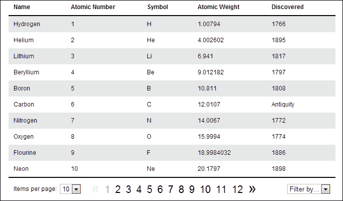
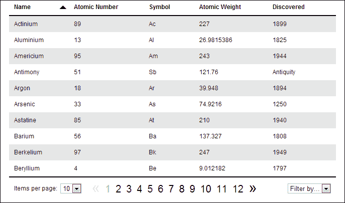
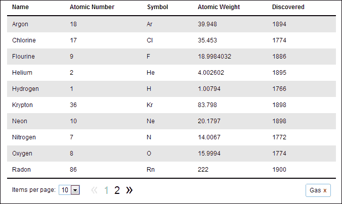

# 第十章：带有 Knockout.js 的可排序、分页表格

Knockout.js 是一个很棒的 JavaScript **模型-视图-视图模型**（**MVVM**）框架，可以帮助你在编写复杂的交互式用户界面时节省时间。它与 jQuery 配合得非常好，甚至还具有用于构建显示不同数据的重复元素的内置基本模板支持。

# 任务简报

在本项目中，我们将使用 jQuery 和 Knockout.js 从数据构建分页表格。客户端分页本身是一个很好的功能，但我们还将允许通过提供可点击的表头对表格进行排序，并添加一些附加功能，如根据特定属性过滤数据。

到此任务结束时，我们将建立如下屏幕截图所示的东西：



## 为什么这很棒？

构建快速响应用户交互的复杂 UI 是困难的。这需要时间，而且应用程序越复杂或交互性越强，花费的时间就越长，需要的代码也越多。而应用程序需要的代码越多，就越难以保持组织和可维护性。

虽然 jQuery 擅长帮助我们编写简洁的代码，但它从未旨在构建大规模、动态和交互式应用程序。它功能强大，擅长自己的工作以及它被设计用来做的事情；只是它并没有被设计用来构建整个应用程序。

在构建大规模应用程序时需要其他东西，需要提供一个框架，可以在其中组织和维护代码。Knockout.js 就是这样一个旨在实现此目标的框架之一。

Knockout.js 被称为一个 MVVM 框架，它基于三个核心组件 - **模型**、**视图** 和 **视图模型**。这类似于更为人熟知的 MVC 模式。这些和其他类似的模式的目的是提供清晰的应用程序可视部分和管理数据所需代码之间的分离。

**模型** 可以被认为是应用程序的数据。实际上，实际数据是模型的结果，但在客户端工作时，我们可以忽略数据是如何被服务器端代码访问的，因为通常我们只是发出 AJAX 请求，数据就会被传递给我们。

**视图** 是数据的可视化表示，实际的 HTML 和 CSS 用于向用户呈现模型。在使用 Knockout.js 时，应用程序的这一部分也可以包括绑定，将页面上的元素映射到特定的数据部分。

**视图模型** 位于模型和视图之间，实际上是视图的模型 - 视图状态的简化表示。它管理用户交互，生成并处理对数据的请求，然后将数据反馈到用户界面。

## 你的炫酷目标

完成此任务所需的任务如下：

+   渲染初始表格

+   对表格进行排序

+   设置页面大小

+   添加上一页和下一页链接

+   添加数字页面链接

+   管理类名

+   重置页面

+   过滤表格

## 任务清单

在这个项目中我们将使用 Knockout.js，所以现在你需要获取它的副本。这本书印刷时的最新版本为 2.2.1，可以从以下网址下载：[`knockoutjs.com/downloads/index.html`](http:// 
http://knockoutjs.com/downloads/index.html)。应将其保存在主`jquery-hotshots`项目文件夹内的`js`目录中，命名为`knockout-2.2.1.js`。

我们还需要一些数据来完成这个项目。我们将需要使用一个相当大的数据集，其中包含可以按多种方式排序的数据。我们将使用元素周期表的 JSON 格式作为我们的数据源。

我已经提供了一个文件作为这个示例的一部分，名为`table-data.js`，其中包含一个名为`elements`的属性的对象。该属性的值是一个对象数组，其中每个对象表示一个元素。对象的格式如下：

```js
{ 
    name: "Hydrogen", 
    number: 1, 
    symbol: "H", 
    weight: 1.00794, 
    discovered: 1766,
    state: "Gas"
}
```

# 渲染初始表格

在项目的第一个任务中，我们将构建一个超级简单的 ViewModel，添加一个基本的 View，并将 Model 渲染到一个裸的`<table>`中，没有任何增强或附加功能。这将使我们能够熟悉 Knockout 的一些基本原理，而不是直接投入到深水区。

## 准备起飞

此时我们创建项目中将要使用的文件。将模板文件另存为`sortable-table.html`，保存在根项目目录中。

我们还需要一个名为`sortable-table.css`的样式表，应将其保存在`css`文件夹中，并且一个名为`sortable-table.js`的 JavaScript 文件，当然应将其保存在`js`目录中。

HTML 文件应链接到每个资源，以及`knockout-2.2.1.js`文件。样式表应在`common.css`之后直接链接，我们迄今为止在本书中大部分项目中都使用了它，而`knockout.js`、`table-data.js`和这个项目的自定义脚本文件（`sortable-table.js`）应在链接到 jQuery 之后添加，按照这个顺序。

## 启动推进器

首先我们可以构建 ViewModel。在`sortable-table.js`中，添加以下代码：

```js
$(function () {

    var vm = {
        elements: ko.observableArray(data.elements)
    }

    ko.applyBindings(vm);

});
```

接下来，我们可以添加 View，它由一些简单的 HTML 构建而成。将以下标记添加到`sortable-table.html`的`<body>`中，位于`<script>`元素之前：

```js
<table>
    <thead>
        <tr>
            <th>Name</th>
            <th>Atomic Number</th>
            <th>Symbol</th>
            <th>Atomic Weight</th>
            <th>Discovered</th>
        </tr>
    </thead>
    <tbody data-bind="foreach: elements">
        <tr>
            <td data-bind="text: name"></td>
            <td data-bind="text: number"></td>
            <td data-bind="text: symbol"></td>
            <td data-bind="text: weight"></td>
            <td data-bind="text: discovered"></td>
        </tr>
    </tbody>
</table>
```

最后，我们可以通过将以下代码添加到`sortable-table.css`来为我们的`<table>`及其内容添加一些基本样式：

```js
table { 
    width:650px; margin:auto; border-collapse:collapse;
}
tbody { border-bottom:2px solid #000; }
tbodytr:nth-child(odd) td { background-color:#e6e6e6; }
th, td { 
    padding:10px 50px 10px 0; border:none; cursor:default;
}
th { 
    border-bottom:2px solid #000;cursor:pointer;
    position:relative;
}
td:first-child, th:first-child { padding-left:10px; }
td:last-child { padding-right:10px; }
```

## 目标完成 - 迷你简报

在我们的脚本中，首先添加了通常的回调函数，在文档加载时执行。在此之中，我们使用存储在变量`vm`中的对象字面量创建了 ViewModel。

此对象唯一的属性是`elements`，其值是使用 Knockout 方法设置的。Knockout 添加了一个全局的`ko`对象，我们可以使用它来调用方法。其中之一是`observableArray()`方法。该方法接受一个数组作为参数，并且传递给该方法的数组将变为可观察的。这就是我们应用程序的数据。

在 Knockout 中，诸如字符串或数字之类的基本类型可以是可观察的，这使它们能够在其值更改时通知订阅者。可观察数组类似，只是它们与数组一起使用。每当向可观察数组添加或删除值时，它都会通知任何订阅者。

定义了我们的 ViewModel 之后，我们需要应用可能存在于 View 中的任何绑定。我们马上就会看到这些绑定；暂时只需知道，在调用 Knockout 的 `applyBindings()` 方法之前，我们添加到 View 的任何绑定都不会生效。

我们添加的 HTML 几乎毫无特色，只是一个简单的`<table>`，每个元素的属性都有一个列。如果你查看`table-data.js`文件，你会看到数组中每个元素的属性与`<th>`元素匹配。

第一件有趣的事情是我们添加到`<tbody>`元素的`data-bind`属性。这是 Knockout 用于实现声明式绑定的机制。这是我们将 View 中的元素与 ViewModel 属性连接起来的方式。

`data-bind`属性的值由两部分组成 - 绑定和要连接到的 ViewModel 属性。第一部分是绑定，我们将其设置为`foreach`。这是 Knockout 的流程控制绑定之一，其行为方式类似于常规 JavaScript 中的标准`for`循环。

绑定的第二部分是要绑定到的 ViewModel 属性。我们目前的 ViewModel 只有一个属性，即`elements`，其中包含一个可观察数组。`foreach`绑定将映射到一个数组，然后为数组中的每个项渲染任何子元素。

此元素的子元素是一个`<tr>`和一系列`<td>`元素，因此我们将在`elements`数组中的每个项中获得一个表格行。为了将`<td>`元素填充内容，我们将使用另一个 Knockout 绑定 - `text`绑定。

`text`绑定绑定到单个可观察属性，因此我们有一个`<td>`绑定到`elements`数组中每个对象的每个属性。每个`<td>`的文本将设置为当前数组项中每个属性的值。

我们在任务结束时添加的 CSS 纯粹是为了表现目的，与 Knockout 或 jQuery 无关。此时，我们应该能够在浏览器中运行页面，并在一个整洁的`<table>`中看到来自`table-data.js`的数据显示出来。

## 机密情报

View 元素和 ViewModel 属性之间的绑定是 Knockout 的核心。ViewModel 是 UI 状态的简化版本。由于绑定，每当底层 ViewModel 发生更改时，视图将更新以反映这些更改。

因此，如果我们以编程方式向可观察数组添加一个新的元素对象，则`<table>`将立即更新以显示新元素。类似地，如果我们从 ViewModel 中的数组中删除一个项目，则相应的`<tr>`将立即被删除。

# 对表格进行排序

在这个任务中，我们可以更改`<th>`元素，使其可点击。当其中一个被点击时，我们可以按照被点击的列对表格行进行排序。

## 启动推进器

首先，我们可以更新`sortable-table.html`中包含的`<tr>`和`<th>`元素：

```js
<tr data-bind="click: sort">
    <th data-bind="css: nameOrder">Name</th>
    <th data-bind="css: numberOrder">Atomic Number</th>
    <th data-bind="css: symbolOrder">Symbol</th>
    <th data-bind="css: weightOrder">Atomic Weight</th>
    <th data-bind="css: discoveredOrder">Discovered</th>
</tr>
```

接下来，我们可以在`sortable-table.js`中的 ViewModel 中添加一些新的可观察属性：

```js
nameOrder: ko.observable("ascending"),
numberOrder: ko.observable("ascending"),
symbolOrder: ko.observable("ascending"),
weightOrder: ko.observable("ascending"),
discoveredOrder: ko.observable("ascending"),
```

我们还添加了一个名为`sort`的新方法：

```js
sort: function (viewmodel, e) {

    var orderProp = $(e.target).attr("data-bind")
                               .split(" ")[1],

        orderVal = viewmodel[orderProp](),
        comparatorProp = orderProp.split("O")[0];

    viewmodel.elements.sort(function (a, b) {

        var propA = a[comparatorProp],
            propB = b[comparatorProp];

        if (typeof (propA) !== typeof (propB)) {

            propA = (typeof (propA) === "string") ? 0 :propA;
            propB = (typeof (propB) === "string") ? 0 :propB;
        }

        if (orderVal === "ascending") {
            return (propA === propB) ? 0 : (propA<propB) ? -1 : 1;

        } else {
            return (propA === propB) ? 0 : (propA<propB) ? 1 : -1;

        }

    });

    orderVal = (orderVal === "ascending") ? "descending" : "ascending";

    viewmodelorderProp;

    for (prop in viewmodel) {
        if (prop.indexOf("Order") !== -1 && prop !== orderProp) {
            viewmodelprop;
        }
    }
}
```

最后，我们可以添加一些额外的 CSS 来样式化我们可点击的`<th>`元素：

```js
.ascending:hover:after { 
    content:""; display:block; border-width:7px; 
    border-style:solid; border-left-color:transparent; 
    border-right-color:transparent; border-top-color:#000;
    border-bottom:none; position:absolute; margin-top:-3px; 
    right:15px; top:50%; 
}
.descending:hover:after {
    content:""; display:block; border-width:7px; 
    border-style:solid; border-left-color:transparent; 
    border-right-color:transparent; border-bottom-color:#000; 
    border-top:none; position:absolute; margin-top:-3px; 
    right:15px; top:50%; 
}
```

## 目标完成 - 小结

首先，我们使用更多的绑定更新了我们的 HTML。首先，我们使用`data-bind`属性在父级`<tr>`上添加了`click`绑定。`click`绑定用于向任何 HTML 元素添加事件处理程序。

处理程序函数可以是 ViewModel 方法或任何常规 JavaScript 函数。在这个示例中，我们将处理程序绑定到一个名为`sort`的函数，它将是我们 ViewModel 的一个方法。

请注意，我们将绑定添加到父级`<tr>`而不是各个`<th>`元素。我们可以利用事件向上冒泡的特性来实现一种非常简单且计算成本低廉的事件委派形式。

我们还为每个`<th>`元素添加了`css`绑定。`css`绑定用于向元素添加类名。因此，元素获取的类名取决于它绑定到的 ViewModel 属性。我们的每个`<th>`元素都绑定到不同的 ViewModel 属性，并将用作我们排序的一部分。

接下来，我们对我们的脚本文件进行了一些更改。首先，我们添加了一系列新的可观察属性。我们添加了以下属性：

+   `nameOrder`

+   `numberOrder`

+   `symbolOrder`

+   `weightOrder`

+   `discoveredOrder`

这些属性中的每一个都是可观察的，这是必需的，以便当任何一个属性发生更改时，`<th>`元素的类名会自动更新。每个属性最初都设置为字符串`ascending`，因此每个`<th>`元素都将被赋予这个类名。

### 对数据进行排序

接下来，我们将我们的`sort`方法添加到 ViewModel 中。因为此方法是事件处理绑定的一部分（我们添加到`<tr>`的`click`绑定），所以该方法将自动传递两个参数 - 第一个是 ViewModel，第二个是事件对象。我们可以在函数中使用这两个参数。

首先我们定义一些变量。我们使用 jQuery 选择被点击的任何`<th>`元素。我们可以使用事件对象的`target`属性来确定这一点，然后我们用 jQuery 包装它，以便我们可以在所选元素上调用 jQuery 方法。

我们可以使用 jQuery 的`attr()`方法获取元素的`data-bind`属性，然后根据绑定名称和绑定到的属性之间的空格拆分它。所以例如，如果我们在浏览器中点击包含**Name**的`<th>`，我们的第一个变量`orderProp`将被设置为`nameOrder`。

下一个变量`orderVal`被设置为 ViewModel 属性的当前值，`orderProp`变量指向的属性。Knockout 提供了一种简单的方法来以编程方式获取或设置任何 ViewModel 属性。

如果我们想获取属性的值，我们将其调用为函数，如下所示：

```js
property();
```

如果我们想设置属性，我们仍然像调用函数一样调用它，但是我们将要设置的值作为参数传递：

```js
property(value);
```

因此，继续上述点击包含**Name**的`<th>`的例子，`orderVal`变量将具有值`ascending`，因为这是每个`…Order`属性的默认值。请注意我们如何使用`orderProp`变量和方括号表示法获取正确的值。

我们的最后一个变量`comparatorProp`很方便地存储我们将要根据其对`elements`数组中的对象进行排序的属性。我们的 ViewModel 属性在末尾有字符串`Order`，但是`elements`数组中的对象内部的属性没有。因此，为了获取正确的属性，我们只需要在大写`O`上拆分字符串，并从`split()`返回的数组中取第一个项目。

### observableArray

接下来我们使用`sort()`方法进行排序。看起来我们在使用 JavaScript 的普通`sort()`函数，但实际上我们并不是。不要忘记，`elements`数组不只是一个普通数组；它是一个**observableArray**，因此虽然我们可以从元素的`viewModel`属性中获取基础数组，然后在其上调用普通的 JavaScript`sort()`函数，但 Knockout 提供了更好的方法。

Knockout 提供了一系列可以在 observable 数组上调用的标准 JavaScript 数组函数。在很大程度上，这些函数的工作方式与它们的原始 JavaScript 对应函数非常相似，但是尽可能使用 Knockout 变体通常更好，因为它们在浏览器中得到了更好的支持，特别是传统浏览器，比原始 JavaScript 版本。一些 Knockout 方法还为我们提供了一些额外的功能或便利。

其中一个例子是使用 Knockout 的`sort()`方法。这并不是我们在这里使用该方法的原因，但这是 Knockout 如何改进原始 JavaScript 函数的一个例子。

JavaScript 内置的默认`sort()`函数对数字的排序效果不是很好，因为它会自动将数字转换为字符串，然后根据字符串而不是数字进行排序，导致我们得到意料之外的结果。

Knockout 的`sort()`方法不会自动对字符串或数字数组进行排序。在这一点上，我们不知道我们将排序字符串，数字，还是两者兼有，因为`elements`数组中的对象既包含字符串又包含数字，有时在同一个属性中。

就像 JavaScript 的`sort()`函数一样，传递给 Knockout 的`sort()`方法的函数将自动传递两个值，这两个值是当前要排序的项。与 JavaScript 的`sort()`函数一样，Knockout 的`sort()`方法应返回`0`，如果要比较的值相等，返回负数，如果第一个值较小，或者返回正数，如果第一个值较大。

在传递给`sort()`的函数中，我们首先从对象中获取我们将要比较的值。传递给函数的两个值都将是对象，但我们只想比较每个对象内部的一个属性，所以我们为了方便起见将要比较的属性存储在`propA`和`propB`变量中。

### 比较不同类型的值

我之前提到有时我们可能会比较不同类型的值。这可能发生在我们按日期列排序时，其中可能包含形式为年份的数字，或者可能是字符串`Antiquity`，而这些对象中有一些包含这样的值。

所以我们使用 JavaScript 的`typeof`运算符和普通的`if`语句来检查要比较的两个值是否属于相同的类型。如果它们不是相同的类型，我们检查每个属性是否是字符串，如果是，就将其值转换为数字`0`。在`if`语句内部，我们使用 JavaScript 的三元运算符来简洁地表达。

### 检查顺序

然后，我们检查我们在一会儿设置的`orderProp`变量是否设置为 ascending。如果是，我们执行标准排序。我们检查两个值是否相等，如果是，返回`0`。如果两个值不相等，我们可以检查第一个值是否小于第二个值，如果是，返回`-1`，如果不是，返回`1`。为了将整个语句保持在一行上，我们可以使用复合的三元运算符。

如果顺序不是`ascending`，那么必须是`descending`，所以我们可以执行降序排序。这段代码几乎与之前的代码相同，只是如果第一个值小于第二个值，我们返回`1`，如果不是，我们返回`-1`，这与条件语句的第一个分支相反。

然后，我们需要更新我们刚刚排序过的列的`…Order`属性的值。这段代码的作用类似于一个简单的开关 - 如果值当前设置为`ascending`，我们将其设置为`descending`。如果它设置为`descending`，我们只需将其设置为`ascending`。这种行为允许的是，当单击`<th>`元素第一次时，它将执行默认的升序排序。如果再次单击它，它将执行降序排序。

最后，如果我们的 ViewModel 的其他`…Order`属性已更改，我们希望重置它们。我们使用一个简单的 JavaScript `for in`循环来迭代我们的 ViewModel 的属性。对于每个属性，我们检查它是否包含字符串`Order`，以及它是否不是我们刚刚更新的属性。

如果这两个条件都满足，我们将当前属性的值重置为默认值`ascending`。

### 添加图标

我们添加的 CSS 用于在悬停时向每个`<th>`元素添加一个小的排序图标。我们可以利用 CSS 形状技术来创建一个向下指向的箭头，表示升序，和一个向上指向的箭头，表示降序。我们还使用`:after` CSS 伪选择器来避免硬编码非语义元素，比如`<span>`或类似的元素，来显示形状。显示哪个箭头取决于我们绑定到 ViewModel 的`…Order`属性的类名。

### 注意

如果您以前从未使用过 CSS 形状，我强烈建议您研究一下，因为它们是创建图标的绝佳方法，而无需非语义占位符元素或 HTTP 重的图像。有关更多信息，请查看 [`css-tricks.com/examples/ShapesOfCSS/`](http://css-tricks.com/examples/ShapesOfCSS/) 上的 CSS 形状指南。

此时，我们应该能够在浏览器中运行页面，并单击任何一个标题，一次执行升序排序，或者点击两次执行降序排序：



# 设置页面大小

所以我们添加的排序功能非常棒。但是`<table>`仍然相当大且笨重 - 实际上太大了，无法完整地在页面上显示。所以分页正好适用。

我们需要做的一件事是确定每页应包含多少项数据。我们可以在脚本中硬编码一个值，表示每页显示的项目数，但更好的方法是添加一个 UI 功能，让用户可以自己设置每页显示的项目数。这就是我们将在此任务中做的事情。

## 启动推进器

我们可以从添加一些额外的标记开始。直接在`<tbody>`元素之后添加以下元素：

```js
<tfoot>
    <tr>
        <tdcolspan="5">
            <div id="paging" class="clearfix">
                <label for="perPage">Items per page:</label>
                <select id="perPage" data-bind="value: pageSize">
                    <option value="10">10</option>
                    <option value="30">30</option>
                    <option value="all">All</option>
                </select>
            </div>
        </td>
    </tr>
</tfoot>
```

我们还需要对`<tbody>`元素进行一些小改动。它目前具有对观察到的元素数组的`foreach`绑定。我们将在稍后为我们的 ViewModel 添加一个新属性，然后需要更新`sortable-table.html`中的绑定，以便它链接到这个新属性：

```js
<tbody data-bind="foreach: elementsPaged">
```

接下来，我们可以在 `sortable-table.js` 中添加一些新的 ViewModel 属性：

```js
pageSize: ko.observable(10),
currentPage: ko.observable(0),
elementsPaged: ko.observableArray(),
```

最后，我们可以添加一个特殊的新变量，称为 **computed observable**。这应该在 `vm` 变量之后出现：

```js
vm.createPage = ko.computed(function () {

    if (this.pageSize() === "all") {
        this.elementsPaged(this.elements.slice(0));
    } else {
        var pagesize = parseInt(this.pageSize(), 10),
            startIndex = pagesize * this.currentPage(),
            endIndex = startIndex + pagesize;

        this.elementsPaged(this.elements.slice(startIndex,endIndex));
    }

}, vm);
```

## 完成目标 - 小结

我们从添加一个包含一个行和一个单元格的 `<tfoot>` 元素开始这项任务。单元格内是用于我们分页元素的容器。然后我们有一个 `<label>` 和一个 `<select>` 元素。

`<select>` 元素包含一些选项，用于显示不同数量的项目，包括一个查看所有数据的选项。它还使用 Knockout 的 `value data-bind` 属性将 `<select>` 元素的值链接到 ViewModel 上的一个名为 `pageSize` 的属性。这种绑定意味着每当 `<select>` 元素的值更改时，例如用户进行选择时，ViewModel 属性将自动更新。

此绑定是双向的，因此如果我们在脚本中以编程方式更新 `pageSize` 属性，则页面上的元素将自动更新。

然后，我们将 `<tbody>foreach` 绑定到我们的 ViewModel 上的一个新属性，称为 `elementsPaged`。我们将使用这个新属性来存储 `elements` 数组中项目的一个子集。该属性中的实际项目将构成数据的单个页面。

接下来，我们在存储在 `vm` 变量中的对象字面量中添加了一些新属性，也称为我们的 ViewModel。这些属性包括我们刚刚讨论的 `currentPage`、`pageSize` 和 `elementsPaged` 属性。

我们最后要做的是添加一个名为 **computed observable** 的 Knockout 功能。这是一个非常有用的功能，它让我们监视一个或多个变量，并在任何可观察变量更改值时执行代码。

我们使用 `ko.computed()` 方法将计算的 observable 设置为 ViewModel 的一个方法，将函数作为第一个参数传入。ViewModel 作为第二个参数传入。现在我们不在一个附加到我们的 ViewModel 的方法中，所以我们需要将 ViewModel 传递给 `computed()` 方法，以便将其设置为 ViewModel。

在作为第一个参数传递的函数中，我们引用了刚刚添加的三个新 ViewModel 属性。在此函数中引用的任何 ViewModel 属性都将被监视变化，并在此发生时调用该函数。

此函数的全部功能是检查 `pageSize()` 属性是否等于字符串 `all`。如果是，则将元素数组中的所有对象简单地添加到 `elementsPaged` 数组中。它通过取 `elements` 数组的一个切片来实现这一点，该切片从第一个项目开始。当 `slice()` 与一个参数一起使用时，它将切片到数组的末尾，这正是我们需要获得整个数组的方式。

如果`pageSize`不等于字符串`all`，我们首先需要确保它是一个整数。因为这个 ViewModel 属性与页面上的`<select>`元素相关联，有时值可能是一个数字的字符串而不是实际的数字。我们可以通过在属性上使用`parseInt()` JavaScript 函数并将其存储在变量`pagesize`中，在函数的其余部分中使用它来确保它始终是一个数字。

接下来，我们需要确定传递给`slice()`作为第一个参数的起始索引应该是什么。要解决此问题，我们只需将`pageSize`属性的值乘以最初设置为`0`的`currentPage`属性的值。

然后，我们可以使用`elements`数组的一个片段来填充`elementsPaged`数组，该片段从我们刚刚确定的`startIndex`值开始，到`endIndex`值结束，该值将是`startIndex`加上每页项目数。

当我们在浏览器中运行页面时，`<select>`框将最初设置为值 10，这将触发我们的计算可观察到的行为，选择`elements`数组中的前 10 个项目，并在`<table>`中显示它们。

我们应该发现，我们可以使用`<select>`来动态更改显示的条目数量。

## 机密情报

在此任务中，我们使用了`slice()` Knockout 方法。您可能认为我们使用的是 JavaScript 的原生`Array.slice()`方法，但实际上我们使用的是 Knockout 版本，而且有一种简单的方法来识别它。

通常，当我们想要获取可观察属性内部的值时，我们会像调用函数一样调用属性。因此，当我们想要获取 ViewModel 的`pageSize`属性时，我们使用了`this.pageSize()`。

然而，当我们调用`slice()`方法时，我们没有像调用函数那样调用元素属性，因此实际数组在属性内部并未返回。`slice()`方法直接在可观察对象上调用。

Knockout 重新实现了一系列可以在数组上调用的原生方法，包括`push()`、`pop()`、`unshift()`、`shift()`、`reverse()`和`sort()`，我们在上一个任务中使用了它们。

建议使用这些方法的 Knockout 版本而不是原生 JavaScript 版本，因为它们在 Knockout 支持的所有浏览器中都受到支持，从而保持了依赖跟踪并保持了应用程序的 UI 同步。

# 添加上一页和下一页链接

此时，我们的页面现在只显示前 10 个项目。我们需要添加一个界面，允许用户导航到其他数据页面。在此任务中，我们可以添加**上一页**和**下一页**链接，以便以线性顺序查看页面。

## 启动推进器

我们将再次从添加此功能的 HTML 组件开始。在`<tfoot>`元素中的`<select>`元素之后直接添加以下新标记：

```js
<nav>
    <a href="#" title="Previous page" 
    data-bind="click: goToPrevPage">&laquo;</a>

    <a href="#" title="Next page" 
    data-bind="click: goToNextPage">&raquo;</a>
</nav>
```

接下来，我们可以向我们的 ViewModel 添加一些新方法。这些可以直接添加到我们之前在`sortable-table.js`中添加的`sort`方法后面：

```js
totalPages: function () {
    var totalPages = this.elements().length / this.pageSize() || 1;
        return Math.ceil(totalPages);
},
goToNextPage: function () {
    if (this.currentPage() < this.totalPages() - 1) {
        this.currentPage(this.currentPage() + 1);
    }
},
goToPrevPage: function () {
    if (this.currentPage() > 0) {
        this.currentPage(this.currentPage() - 1);
    }
}
```

最后，我们可以通过将以下代码添加到 `sortable-table.css` 来为此部分添加的新元素以及上一部分添加的元素添加一些 CSS 以进行整理：

```js
tfoot label, tfoot select, tfootnav {
    margin-right:4px; float: left; line-height:24px; 
}
tfoot select { margin-right:20px; }
tfootnav a { 
    display:inline-block; font-size:30px; line-height:20px; 
    text-decoration:none; color:#000; 
}
```

## 目标完成 - 小结

我们首先通过向页面添加包含两个 `<a>` 元素的 `<nav>` 元素来开始，这些元素制作了**上一页**和**下一页**链接。我们为链接添加了数据绑定，将**上一页**链接连接到 `goToPrevPage()` 方法，将**下一页**链接连接到 `goToNextPage()` 方法。

然后，我们添加了一个小的实用方法，以及这两个新方法到我们的 ViewModel。我们的方法不必像 `sort()` 方法那样接受参数，我们可以在方法中使用 `this` 访问我们的 ViewModel。

第一个方法 `totalPages()` 简单地通过将 `elements` 数组中的总项目数除以 `pageSize` 属性中保存的值来返回总页数。

有时 `currentPage` 属性将等于字符串 `all`，当在数学运算中使用时将返回 `NaN`，因此我们可以添加双竖线 OR (`||`) 来在这种情况下返回 `1`。我们还使用 `Math.ceil()` 来确保我们获得一个整数，因此当有 11.8 页的数据时（基于每页 10 个项目的默认值），该方法将返回 12。`Ceil()` 函数将总是向上舍入，因为我们不能有部分页面。

我们在上一个任务中添加的 `createPage` 计算的可观察对象实际上为我们做了大部分工作。接下来的两个方法只是更新了 `currentPage` 属性，这将自动触发 `createPage()` 计算的可观察对象。

在 `goToNextPage()` 方法中，我们首先检查我们是否已经在最后一页，只要我们不是，我们就将 `currentPage` 属性增加一。在我们检查是否在最后一页时，我们使用 `totalPages()` 方法。

`goToPrevPage()` 方法同样简单。这次我们检查我们是否已经在数据的第一页（如果 `currentPage` 等于 `0`），如果不是，我们将 `currentPage` 的值减去 `1`。

我们添加的少量 CSS 只是整理了 `<tfoot>` 元素中的元素，使它们能够与彼此并排浮动，并使新链接比默认情况下稍大一些。

# 添加数字页面链接

现在，我们可以添加任意数量的链接，以便允许用户直接访问任何页面。这些是直接链接到每个单独页面的数字页面链接。

## 启动推进器

首先，我们需要在我们的 ViewModel 中的现有可观察属性之后直接添加一个新的可观察属性，在 `sortable-table.js` 中：

```js
pages: ko.observableArray(),
```

在此之后，我们可以向我们的 ViewModel 中添加一个新方法。这可以添加在 `goToPrevPage()` 方法之后，位于 `vm` 对象字面量内部：

```js
changePage: function (obj, e) {
    var el = $(e.target),
        newPage = parseInt(el.text(), 10) - 1;

    vm.currentPage(newPage);
}
```

不要忘记在`goToPrevPage()`方法后面加上逗号！然后我们可以添加一个新的计算可观察属性，方式与我们之前添加的一样。这可以直接放在我们在上一个任务中添加的`createPage`计算可观察属性之后：

```js
vm.createPages = ko.computed(function () {

    var tmp = [];

    for (var x = 0; x < this.totalPages(); x++) {
        tmp.push({ num: x + 1 });
    }

    this.pages(tmp);

}, vm);
```

接下来，我们需要在 HTML 页面中添加一些新的标记。这应该在我们在上一个任务中添加的**Previous**和**Next**链接之间添加：

```js
<ul id="pages" data-bind="foreach: pages">
    <li>
        <a href="#" data-bind="text: num, 
        click: $parent.changePage"></a>
    </li>
</ul>
```

最后，我们可以添加一点 CSS 来定位`sortable-table.css`中的新元素：

```js
tfoot nav ul { margin:3px 0 0 10px; }
tfoot nav ul, tfootnav li { float:left; }
tfoot nav li { margin-right:10px; }
tfoot nav li a { font-size:20px; }
```

## 目标完成 - 小结。

首先，我们在 ViewModel 中添加了一个新的`pages`可观察数组。一开始我们没有给它一个数组；我们会在合适的时候动态添加。

我们添加的计算可观察属性`createPages`用于构建一个数组，其中数组中的每个项目表示数据的一个页面。我们可以像之前一样使用我们的`totalPages()`方法获取总页数。

一旦确定了这一点，也就是每当`pageSize()`可观察属性发生变化时，我们就可以填充刚刚添加的可观察数组。

添加到数组中的对象是使用简单的`for`循环创建的，以创建一个对象并将其推入数组中。一旦我们为每个页面构建了一个对象，我们就可以将数组设置为`pages`属性的值。

我们创建的每个对象都只有一个属性，称为`num`，其值是循环中使用的`x`计数器变量的当前值。

在 HTML 页面中，我们使用`foreach`数据绑定来迭代我们添加到`pages`数组中的数组。对于数组中的每个对象，我们创建一个`<li>`元素和一个`<a>`元素。`<a>`使用`data-bind`属性指定了两个绑定。

第一个是`text`绑定，它设置元素的文本。在这种情况下，我们将文本设置为每个对象具有的`num`属性的值。

第二个绑定是一个点击绑定，它调用一个名为`changePage`的方法。然而，在`foreach`绑定中，上下文被设置为`pages`数组中的当前对象，所以我们需要使用特殊的`$parent`上下文属性来访问 ViewModel 上的方法。

最后，我们添加了`changePage`方法，它被`<a>`元素使用。在这个简单的方法中，我们需要做的就是获取被点击元素的文本，从其值中减去`1`，因为实际的页码是从零开始的，并更新我们 ViewModel 的`curentPage`可观察属性。在这个方法中，由于某种原因，`this`的值并没有设置为被点击的元素，正如我们之前遇到的`sort()`方法所期望的那样。

因为触发`changePage`方法的`<a>`元素是在`foreach`绑定内创建的，所以传递给`changePage`的第一个参数将是`pages`数组中与`<a>`元素关联的对象。幸运的是，我们仍然可以使用变量`vm`访问 ViewModel。

我们添加的 CSS 简单地将列表项浮动在一起，稍微间隔开它们，并设置文本的颜色和大小。

## 机密情报

除了 `$parent` 上下文属性允许我们访问在 `foreach` 绑定中迭代的 ViewModel 属性的父对象之外，我们还可以利用 `$data`，它指向正在迭代的数组。

除此之外，还有一个 `$index` 属性，允许我们访问当前迭代的索引，我们可以在这个示例中使用它，而不是在每个对象上设置 `num` 属性。

# 管理类名

在这个任务中，我们可以向用户显示反馈，描述当前正在查看的页面。如果我们在数据的第一页或最后一页，我们也可以禁用 **Previous** 或 **Next** 链接。我们可以使用更多的脚本和一些简单的 CSS 来完成所有这些。

## 启动推进器

首先，我们需要在 `sortable-table.js` 中的现有方法后直接添加另一个方法到我们的 ViewModel 中：

```js
manageClasses: function () {
    var nav = $("#paging").find("nav"),
        currentpage = this.currentPage();

    nav.find("a.active")
       .removeClass("active")
       .end()
       .find("a.disabled")
       .removeClass("disabled"); 

    if (currentpage === 0) {
       nav.children(":first-child").addClass("disabled");
    } else if (currentpage === this.totalPages() - 1) {
        nav.children(":last-child").addClass("disabled");
    }

    $("#pages").find("a")
               .eq(currentpage)
               .addClass("active");
}
```

然后，我们需要从我们现有的代码中的几个位置调用这个方法。首先，我们需要在 `createPage()` 和 `createPages()` 计算观察函数的末尾调用它，通过在每个函数的最后一行（以 `this` 开头的行）添加以下代码：

```js
.manageClasses();
```

然后，为了在与表格交互之前添加初始类名，我们需要在 ViewModel 之后的 `applyBindings()` 方法之后调用它：

```js
vm.manageClasses();
```

最后，我们可以添加任务介绍中提到的额外 CSS：

```js
tfoot nav a.disabled, tfoot nav a.disabled:hover { 
    opacity: .25; cursor: default; color:#aaa;
}
tfoot nav li a.active, tfoot a:hover { color:#aaa; }
```

## 目标完成 - 小结

在这个任务中，我们首先向我们的 ViewModel 添加了一个新方法 - `manageClasses()` 方法。该方法负责向 **Previous** 和 **Next** 链接添加或移除 `disabled` 类，并向当前页对应的数字链接添加活动类。

在方法内部，我们首先缓存包含 `<nav>` 元素的选择器，以便我们能够尽可能高效地访问需要更新的元素。我们还获取 `curentPage` ViewModel 属性，因为我们将多次比较其值。

然后，我们找到具有 `disabled` 和 `active` 类的元素，并将它们移除。注意我们在移除 `active` 类后如何使用 jQuery 的 `end()` 方法返回到原始的 `<nav>` 选择。

现在我们只需要将类重新放回适当的元素上。如果 `currentPage` 是 `0`，我们使用 jQuery 的 `:first-child` 选择器与 `children()` 方法一起将 `disabled` 类添加到 `<nav>` 中的第一个链接。

或者，如果我们在最后一页，我们将 `disabled` 类添加到 `<nav>` 的最后一个子元素，这次使用 `:last-child` 选择器。

使用 jQuery 的 `eq()` 方法轻松地选择要应用 `active` 类的元素，该方法将元素的选择减少到作为指定索引的单个元素。我们使用 `currentpage` 作为要在选择中保留的元素的索引。

CSS 仅用于为具有不同样式的类名的元素添加样式，因此可以轻松地看到类何时添加和删除。

现在在浏览器中运行页面时，我们应该发现**上一页**链接一开始是禁用的，并且数字`1`是活动的。如果我们访问任何页面，该数字将获得 `active` 类。

# 重置页面

现在我们已经连接了我们的数字分页链接，一个问题变得明显起来。有时，在更改每页项目数时，将显示空表格。

我们可以通过向 `<select>` 元素添加另一个绑定来修复此问题，该绑定在 `<select>` 元素的 `value` 更改时重置当前页面。

## 启动推进器

首先，我们可以将新的绑定添加到 HTML 中。将 `<select>` 元素更改为以下内容：

```js
<select id="perPage" data-bind="value: pageSize, event: { 
 change: goToFirstPage
}">
```

现在我们可以将 `goToFirstPage()` 方法添加到 ViewModel 中：

```js
goToFirstPage: function () {
    this.currentPage(0);
}
```

## 目标完成 - 迷你总结

首先，我们将 `event` 绑定添加为 `<select>` 元素的第二个绑定，负责设置每页项的数量。此绑定的格式与我们在此项目中使用的其他绑定略有不同。

在绑定的名称之后，`event` 在本例中，我们在大括号内指定事件的名称和事件发生时要调用的处理程序。之所以使用此格式是因为如果需要，我们可以在括号内指定多个事件和处理程序。

然后，我们将新的事件处理程序 `goToFirstPage()` 添加为 ViewModel 的方法。在处理程序中，我们只需要将 `currentPage` 可观察值设置为 `0`，这将自动将我们移回到结果的第一页。每当 `<select>` 元素的值发生变化时，都会发生这种情况。

# 对表进行过滤

为了完成项目，我们可以添加过滤器，以便可以显示不同类型的元素。表的数据包含我们尚未使用的列——元素的 `state`（实际物理元素，而不是 HTML 元素！）

在此任务中，我们可以添加一个 `<select>` 元素，以允许我们根据其状态对元素进行过滤。

## 启动推进器

首先，我们需要向 ViewModel 添加一个新的可观察数组，该数组将用于存储表示元素可能的不同状态的对象：

```js
states: ko.observableArray(),
```

我们还可以向 ViewModel 添加一个简单的非可观察属性：

```js
originalElements: null,
```

接下来，我们需要填充新数组。我们可以在调用 `vm.manageClasses()` 之后直接执行此操作：

```js
var tmpArr = [],
      refObj = {};

tmpArr.push({ state: "Filter by..." });

$.each(vm.elements(), function(i, item) {

    var state = item.state;

    if (!refObj.hasOwnProperty(state)) {

        var tmpObj = {state: state};
        refObj[state] = state;
        tmpArr.push(tmpObj);
    }
});

vm.states(tmpArr);
```

然后，我们可以添加新的 HTML，该 HTML 将创建用于过滤 `<table>` 数据的 `<select>` 元素：

```js
<div class="filter clearfix">
    <label for="states">Filter by:</label>
    <select id="states" data-bind="foreach: states, event: { 
        change: filterStates
    }">
        <option data-bind="value: state, text: state">
        </option>
    </select>
</div>
```

现在我们需要向 ViewModel 添加一个最终方法，该方法在进行选择时实际过滤数据：

```js
filterStates: function (obj, e) {

    if (e.originalEvent.target.selectedIndex !== 0) {

        var vm = this,
            tmpArr = [],
            state = e.originalEvent.target.value;

        vm.originalElements = vm.elements();

        $.each(vm.elements(), function (i, item) {
            if (item.state === state) {
                tmpArr.push(item);
            }
        });

        vm.elements(tmpArr).currentPage(0);

        var label = $("<span/>", {
            "class": "filter-label",
            text: state
        });
        $("<a/>", {
            text: "x",
            href: "#",
            title: "Remove this filter"
        }).appendTo(label).on("click", function () {

            $(this).parent().remove();
            $("#states").show().prop("selectedIndex", 0);
            vm.elements(vm.originalElements).currentPage(0);

        });

        label.insertBefore("#states").next().hide();
    }
}
```

最后，我们可以向`sortable-table.css`添加一点 CSS，只是为了整理新元素：

```js
tfoot .filter { float:right; }
tfoot .filter label { 
    display:inline-block; height:0; line-height:0; 
    text-indent:-9999em; overflow:hidden; 
}
tfoot .filter select { margin-right:0; float:right; }
tfoot .filter span { 
    display:block; padding:0 7px; border:1px solid #abadb3;
    border-radius:3px; float:right; line-height:24px;
}
tfoot .filter span a { 
    display:inline-block; margin-left:4px; color:#ff0000;
    text-decoration:none; font-weight:bold;
}
```

## 完成目标 - 小结

首先，我们添加了一个名为`states`的新的可观察数组，该数组将用于包含构成我们数据的元素的不同状态。这些状态是固体、液体、气体或未知状态。

我们还向 ViewModel 添加了一个简单的属性，称为`originalElements`，它将用于存储完整的元素集合。该属性只是一个常规对象属性，因为我们不需要观察其值。

### 填充状态数组

接下来，我们将状态数组填充为数据中找到的所有唯一状态。我们只需要填充一次这个数组，所以它可以出现在 ViewModel 之外。我们首先创建一个空数组和一个空对象。

然后，我们向数组添加一个单个项目，该项目将用于`<select>`元素中的第一个`<option>`元素，并在与`<select>`框交互之前作为标签起作用。

然后，我们可以使用 jQuery 的`each()`方法迭代`elements`数组。对于数组中的每个项目（如果您记得的话，它将是表示单个元素的对象），我们获取其`state`并检查这是否存储在引用对象中。我们可以使用`hasOwnProperty()`JavaScript 函数来检查这一点。

如果状态在对象中不存在，我们将其添加。如果已经存在，则我们不需要做任何事情。如果对象不包含该状态，我们还将状态推入空数组。

一旦`each()`循环结束，我们应该有一个数组，其中包含数据中找到的每个`state`的单个实例，因此我们可以将此数组添加为`states`可观察数组的值。

### 构建`<select>`框

过滤功能的底层标记非常简单。我们添加了一个带有几个类名的容器`<div>`，一个`<label>`和一个`<select>`。`<label>`类名只是为了可访问性而添加的，我们不会显示它，因为`<select>`元素的第一个`<option>`将作为标签。

`<select>`元素有几个 Knockout 绑定。我们使用了`foreach`绑定，它连接到状态数组，因此一旦这个数组被填充，`<select>`的`<option>`元素就会自动添加。

我们还一次使用了`event`绑定，为`change`事件添加了一个处理程序，每当与`<select>`框交互时就会触发。

在`<select>`元素内部，我们为`<option>`元素添加了一个模板。每个选项将被赋予`states`数组中当前对象的`state`属性的`text`和`value`。

### 过滤数据

然后，我们添加了负责过滤`<table>`中显示的数据的 ViewModel 的方法。在方法中，我们首先检查第一个`<option>`是否未被选中，因为这只是一个标签，不对应任何状态。

我们可以通过查看`target`元素(`<select>`)的`selectedIndex`属性来确定这一点，该属性在`originalEvent`对象中可用。这本身是自动传递给我们的事件处理程序的事件对象的一部分。

因为我们将要更改`elements`可观察数组（以触发对过滤元素的分页），所以我们希望稍后存储原始元素。我们可以将它们存储在 ViewModel 的`originalElements`属性中。

接下来，我们需要构建一个新数组，其中仅包含具有在`<select>`元素中选择的`state`的元素。为此，我们可以创建一个空数组，然后迭代`elements`数组并检查每个元素的`state`。如果匹配，则将其推入新数组。

我们可以再次使用传递给我们的事件处理程序的事件对象来获取从`<select>`元素中选择的`state`。这次我们在`originalEvent`对象中使用`target`元素的`value`属性。

一旦新数组被填充，我们就更新`elements`数组，使其仅包含我们刚刚创建的新数组，然后将`currentPage`设置为`0`。

我们添加的过滤器是互斥的，因此一次只能应用一个过滤器。选择过滤器后，我们希望隐藏`<select>`框，以便无法选择另一个过滤器。

我们还可以创建一个标签，显示当前正在应用的过滤器。此标签由一个`<span>`元素制成，显示过滤器的文本，并且还包含一个`<a>`元素，可用于删除过滤器并将`<table>`返回到其最初显示所有元素的状态。

我们可以使用 jQuery 的`on()`方法在创建并附加到页面后立即附加`<a>`元素的处理程序。在处理程序中，我们只需将 ViewModel 的`elements`属性设置回保存在`originalEvents`属性中的数组，并将`<table>`重新设置为第一页，方法是将`currentPage`属性设置为`0`。

现在我们应该发现，我们可以在`<select>`框中选择其中一个选项，仅查看过滤后的数据和过滤标签，然后单击过滤标签中的红色叉号以返回初始的`<table>`。以下是数据的筛选选择和筛选标签的截图：



# 任务完成

我们的应用程序主要依赖 Knockout 功能运行，它允许我们轻松地将动态元素填充到内容中，添加事件处理程序，并通常管理应用程序的状态。我们也使用 jQuery，主要是在 DOM 选择容量方面，还偶尔使用它来使用实用程序，例如我们多次利用的`$.each()`方法。

完全可以纯粹使用 jQuery 构建此应用程序，而不使用 Knockout；但是，jQuery 本身从未被设计或打算成为构建复杂动态应用程序的完整解决方案。

当我们尝试仅使用 jQuery 构建复杂动态应用程序时，通常会发现我们的脚本很快变成一堆事件处理程序的混乱代码，既不容易阅读，也不易于维护或在将来更新。

使用 Knockout 来处理应用程序状态的维护，并使用 jQuery 来实现它的预期角色，为我们提供了使用非常少的代码构建高度动态、数据驱动的复杂应用程序的理想工具集。

在整个示例中，我尽量使各个方法尽可能简单，并且让它们只做一件事情。以这种方式将功能单元保持隔离有助于保持代码的可维护性，因为很容易看到每个现有函数的功能，也很容易添加新功能而不会破坏已有的内容。

# 你准备好全力以赴了吗？挑战热门的高手？

Knockout 可以轻松地从数据数组中构建一个`<table>`，由于数据是动态的，因此很容易编辑它或向其添加新项目，并使应用程序中的数据得以更新。尽管在此示例中数据是存储在本地文件中的，但将数据存储在服务器上并在页面加载时使用简单的 AJAX 函数填充我们的元素数组是很简单的。

如果你想进一步学习这个示例，这将是首要任务。完成这个任务后，为什么不试试使表格单元格可编辑，以便可以更改它们的值，或添加一个允许你插入新行到`<table>`的功能。完成这些后，你会想把新数据发送回服务器，以便永久存储。
