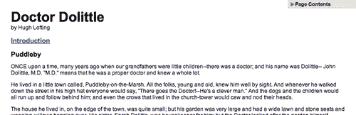
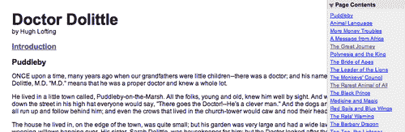
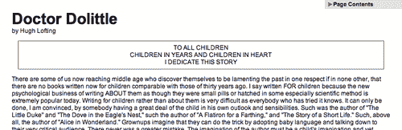

# 第一章：jQuery 脚本的结构

> 他有一个崭新的开始
> 
> 现在他是一个快乐的人
> 
> —Devo，
> 
> "快乐的人"

典型的 jQuery 脚本使用库提供的各种方法。选择器，DOM 操作，事件处理等根据手头任务的需要而使用。为了最大程度地利用 jQuery，我们需要牢记它提供的广泛功能范围。

本书将列举 jQuery 库中的每种方法和函数。由于有许多方法和函数需要整理，因此了解方法的基本类别以及它们在 jQuery 脚本中的作用方式将非常有用。在这里，我们将看到一个完全可用的脚本，并查看 jQuery 的不同方面在脚本的每个部分中如何被利用。

# 一个动态目录

作为 jQuery 实践的例子，我们将构建一个小脚本，动态提取 HTML 文档中的标题，并将它们组装成该页面的目录。

我们的目录将位于页面的右上角：



我们将其最初折叠如上所示，但点击将其展开至全高度：



同时，我们将为主体文本添加一个功能。页面上文本的介绍不会最初加载，但当用户点击**介绍**一词时，将从另一个文件中插入介绍文本：



在我们揭示执行这些任务的脚本之前，我们应该先了解脚本所在的环境。

## 获取 jQuery

官方的 jQuery 网站 ([`jquery.com/`](http://jquery.com/)) 总是与该库相关的代码和新闻的最新资源。要开始，我们需要一份 jQuery 的副本，可以直接从网站的主页下载。在任何时候可能有几个版本的 jQuery 可用；最新的未压缩版本最适合我们。

jQuery 不需要安装。要使用 jQuery，我们只需将其放置在网站的公共位置即可。由于 JavaScript 是一种解释性语言，所以不需要担心编译或构建阶段。每当我们需要一个页面具有 jQuery 时，我们只需在 HTML 文档中引用文件的位置即可。

## 设置 HTML 文档

大多数 jQuery 使用示例分为三个部分— HTML 文档本身，用于样式的 CSS 文件，以及用于对其进行操作的 JavaScript 文件。在本例中，我们将使用包含书籍文本的页面：

```js
<?xml version="1.0" encoding="UTF-8" ?>
<!DOCTYPE html PUBLIC "-//W3C//DTD XHTML 1.0 Transitional//EN"
	"http://www.w3.org/TR/xhtml1/DTD/xhtml1-transitional.dtd">

<html  xml:lang="en" lang="en">
  <head>
  	<meta http-equiv="Content-Type" content="text/html;
                                                   charset=utf-8"/>
  	<title>Doctor Dolittle</title>
    <link rel="stylesheet" href="dolittle.css" type="text/css" />
  	<script src="img/jquery.js" type="text/javascript"></script>
  	<script src="img/dolittle.js" type="text/javascript"></script>
  </head>
  <body>
    <div id="container">
      <h1>Doctor Dolittle</h1>
      <div class="author">by Hugh Lofting</div>
      <div id="introduction">
        <h2><a href="introduction.html">Introduction</a></h2>
      </div>
      <div id="content">
        <h2>Puddleby</h2>
        <p>ONCE upon a time, many years ago when our grandfatherswere little children--there was a doctor; and his name wasDolittle-- John Dolittle, M.D.  &quot;M.D.&quot; means that he was a proper doctor and knew a whole lot.</p>

           <!-- More text follows... -->

      </div>
    </div>
  </body>
</html>
```

### 注意

服务器上文件的实际布局并不重要。从一个文件到另一个文件的引用只需要调整以匹配我们选择的组织结构即可。在本书的大多数示例中，我们将使用相对路径来引用文件（`../images/foo.png`），而不是绝对路径（`/images/foo.png`）。这样可以使代码在本地运行而无需 web 服务器。

样式表立即在标准的`<head>`元素之后加载。以下是影响我们动态元素的样式表部分：

```js
/* -----------------------------------
   Page Table of Contents
-------------------------------------- */
#page-contents {
  position: absolute;
  text-align: left;
  top: 0;
  right: 0;
  width: 15em;
  border: 1px solid #ccc;
  border-top-width: 0;
  border-right-width: 0;
  background-color: #e3e3e3;
}
#page-contents h3 {
  margin: 0;
  padding: .25em .5em .25em 15px;
  background: url(arrow-right.gif) no-repeat 0 2px;
  font-size: 1.1em;
  cursor: pointer;
}
#page-contents h3.arrow-down {
  background-image: url(arrow-down.gif);
}
#page-contents a {
  display: block;
  font-size: 1em;
  margin: .4em 0;
  font-weight: normal;
}
#page-contents div {
  padding: .25em .5em .5em;  
  display: none;
  background-color: #efefef;
}

/* -----------------------------------
   Introduction
-------------------------------------- */
.dedication {
  margin: 1em;
  text-align: center;
  border: 1px solid #555;
  padding: .5em;
}
```

样式表被引用后，JavaScript 文件被包含。重要的是，jQuery 库的脚本标签必须在我们自定义脚本的标签之前放置*之前*；否则，当我们的代码尝试引用它时，jQuery 框架将不可用。

## 编写 jQuery 代码

我们的自定义代码将放在第二个当前为空的 JavaScript 文件中，我们将其包含在 HTML 中使用 `<script src="img/dolittle.js" type="text/javascript"></script>`。尽管它能够完成很多工作，但脚本相当简短：

```js
jQuery.fn.toggleNext = function() {
  this.toggleClass('arrow-down')
    .next().slideToggle('fast');
};

$(document).ready(function() {
  $('<div id="page-contents"></div>')
    .prepend('<h3>Page Contents</h3>')
    .append('<div></div>')
    .prependTo('body'); 

  $('#content h2').each(function(index) {
    var $chapterTitle = $(this);
    var chapterId = 'chapter-' + (index + 1);
    $chapterTitle.attr('id', chapterId);
    $('<a></a>').text($chapterTitle.text())
      .attr({
        'title': 'Jump to ' + $chapterTitle.text(),
        'href': '#' + chapterId
      })
      .appendTo('#page-contents div');
  });

  $('#page-contents h3').click(function() {
    $(this).toggleNext();
  });

  $('#introduction > h2 a').click(function() {
    $('#introduction').load(this.href);
    return false;
  });
});
```

现在我们有了一个动态的目录，可以将用户带到文本的相关部分，并且可以按需加载介绍部分。

# 脚本解剖

选择此脚本是因为它展示了 jQuery 库的广泛功能。现在我们已经将代码作为一个整体看过了，我们可以确定其中使用的方法类别。

### 注意

我们不会在这里详细讨论此脚本的操作，但是类似的脚本作为 Learning jQuery 网志上的教程呈现：[`www.learningjquery.com/2007/06/ automatic-page-contents`](http://www.learningjquery.com/2007/06/)。

## 选择器表达式

在我们可以对 HTML 文档进行操作之前，我们需要找到相关部分。在我们的脚本中，有时我们会使用一种简单的方法来查找元素：

```js
$('#introduction')

```

此表达式创建一个新的 jQuery 对象，该对象引用具有`introduction` ID 的元素。另一方面，有时我们需要一个更复杂的选择器：

```js
$('#introduction > h2 a')

```

在这里，我们产生了一个可能引用许多元素的 jQuery 对象。如果它们是锚点标签，则包括这些元素，但仅在它们是`introduction` ID 元素的子元素的`<h2>`元素的后代时。

这些**选择器表达式**可以简单也可以复杂，取决于我们的需要。第二章 将列举我们可用的所有选择器以及它们如何组合使用。

## DOM 遍历方法

有时我们有一个 jQuery 对象，它已经引用了一组 DOM 元素，但我们需要对一个不同的相关元素执行操作。在这些情况下，**DOM 遍历**方法很有用。我们可以在我们的脚本的一部分中看到这一点：

```js
this.toggleClass('arrow-down')
 .next()
  .slideToggle('fast');
```

由于代码片段的上下文，关键字`this`指的是一个 jQuery 对象（通常指的是 DOM 元素）。在我们的情况下，这个 jQuery 对象又指向目录的`<h3>`标题。`.toggleClass`方法调用操纵了这个标题元素。随后的`.next()`操作改变了我们正在处理的元素，因此接下来的`.slideToggle`方法调用作用于包含目录的`<div>`而不是其标题。允许我们自由移动 DOM 树的方法在第三章中列出。

## DOM 操作方法

找到元素还不够；我们还希望能够修改它们。这些变化可以像更改单个属性一样简单：

```js
$chapterTitle.attr('id', chapterId);

```

在这里，我们即时修改了匹配元素的 ID。

有时候，这些变化影响更深远：

```js
$('<div id="page-contents"></div>')
  .prepend('<h3>Page Contents</h3>')
  .append('<div></div>')
  .prependTo('body'); 
```

脚本的这一部分说明了**DOM 操作**方法不仅可以就地更改元素，还可以删除、重排和插入它们。这些代码在`<div id="page-contents">`的开头添加了一个新的标题，将另一个`<div>`容器插入到其末尾，并将整个内容放在文档主体的开头。第四章将详细介绍这些以及修改 DOM 树的许多其他方法。

## 事件方法

即使我们可以随意修改页面，我们的页面仍然会静止不动，不响应。我们需要**事件方法**来对用户输入做出反应，以在适当的时候进行更改：

```js
$('#introduction > h2 a').click(function() {
  $('#introduction').load(this.href);
  return false;
});
```

在这个片段中，我们注册了一个处理程序，每次选择的锚点标签被点击时都会执行。点击事件是最常见的事件之一，但还有许多其他事件；与它们交互的 jQuery 方法在第五章中讨论。

第五章还讨论了一个非常特殊的事件方法`.ready`：

```js
$(document).ready(function() {
  // ...
});
```

这个方法允许我们注册行为，当 DOM 结构可用于我们的代码时立即发生——甚至在图片加载之前。

## 效果方法

事件方法使我们能够对用户输入做出反应；**效果方法**让我们以一种有型的方式做到这一点。我们可以通过动画来隐藏和显示元素，而不是立即执行：

```js
this.toggleClass('arrow-down')
  .next()
 .slideToggle('fast');

```

这个方法在元素上执行快速的滑动过渡，每次调用时交替隐藏和显示它。内置效果方法在第六章中列出，创建新效果方法的方法也在其中。

## AJAX 方法

许多现代网站采用技术在请求时加载内容，而不需要刷新页面；jQuery 可以轻松实现这一点。**AJAX 方法**启动这些内容请求，并允许我们监视其进度：

```js
$('#introduction > h2 a').click(function() {
 $('#introduction').load(this.href);
  return false;
});
```

这里的`.load`方法允许我们从服务器获取另一个 HTML 文档，并将其插入到当前文档中，所有这些都可以通过一行代码完成。从服务器检索信息的更复杂机制以及其他信息列在第七章中。

## 其他方法

有些方法比其他方法更难分类。jQuery 库包含几种作为常见 JavaScript 习语的简写的**其他方法**。

即使是基本的迭代任务，通过 jQuery 也可以简化：

```js
$('#content h2').each(function(index) {
  // ...
});
```

在这里看到的`.each`方法逐个遍历匹配的元素，对所有匹配的元素执行封闭的代码。在本例中，该方法帮助我们收集页面中的所有标题，以便我们可以编写完整的目录。类似的帮助函数可以在第八章中找到。

## 插件 API

我们不需要限制自己在内置功能中。jQuery 中的**插件 API**允许我们扩展已存在的功能，增加符合我们需求的新功能。即使在我们编写的小脚本中，我们也发现了插件的用处：

```js
jQuery.fn.toggleNext = function() {
  this.toggleClass('arrow-down')
    .next().slideToggle('fast');
};
```

这段代码定义了一个新的`.toggleNext` jQuery 方法，可以展开或关闭后续元素。我们可以在需要时随时调用我们的新方法：

```js
$('#page-contents h3').click(function() {
  $(this).toggleNext();
});
```

每当代码可以在当前脚本之外重复使用时，将其作为插件会更好。第九章将介绍用于构建这些扩展的插件 API。

# 摘要

我们现在已经看到了一个完整的、功能的 jQuery 脚本。尽管这个示例很小，但它为页面带来了相当多的交互性和可用性。这个脚本展示了 jQuery 提供的主要工具类型。我们观察了脚本如何在 DOM 中查找项目并根据需要更改它们。我们见证了对用户操作的响应以及为用户在操作后提供反馈的动画。我们甚至看到了如何在不刷新页面的情况下从服务器获取信息，以及如何教会 jQuery 通过插件学习全新的技巧。

我们将逐章逐节地讲解 jQuery 库中的每个函数、方法和选择器表达式。在许多情况下，一个自定义日志函数将有助于我们的示例。这个`.log`方法将文本打印到屏幕上，以便我们理解；在第九章的最后，我们将解析它作为插件的示例。

每个方法都将以其语法摘要、参数列表和返回值列表的总结介绍。然后我们将提供讨论，提供适用的示例。有关任何方法的更多信息，请参考附录 A 中列出的在线资源。
