# 第四章： DOM 操作方法

> 洗手不干拯救灾厄
> 
> 他让自己处于一种改变的状态。
> 
> -Devo，
> 
> “机械狂热男孩”

本章中的所有方法都以某种方式操作 DOM。其中一些只是改变元素的某个属性，而另一些则设置元素的样式属性。还有一些修改了整个元素（或元素组）本身-插入、复制、删除等等。

这些方法中的一些，如`.attr()`、`.html()`和`.val()`，也充当**获取器**，从 DOM 元素中检索信息以供以后使用。

# 通用属性

## .attr(attribute)

| 获取匹配元素集合中第一个元素的属性值。

```js
.attr(attribute)

```

|

### 参数

+   属性：要获取的属性名称

### 返回值

包含属性值的字符串。

### 描述

我们可以利用原生 JavaScript 函数`getAttribute`非常容易地获取元素的任何属性，而无需使用 jQuery。此外，这些属性中的大多数都可以通过 JavaScript 作为 DOM 节点属性使用。其中一些更常见的属性是：

+   `className`

+   `标签名`

+   `id`

+   `href`

+   `title`

+   `rel`

+   `src`

让我们考虑以下链接：

```js
<a id="myid" href="/archives/jquery-links.htm" title="A few jQuery links from long ago">old jQuery links</a>

```

使用 jQuery 的`.attr`方法获取元素的属性有两个主要优点：

1.  **便利性**：它可以链接到 jQuery 对象。

1.  **跨浏览器一致性**：`.attr`方法始终获取实际的属性文本，而不管使用哪个浏览器。另一方面，当使用`getAttribute()`获取诸如`href、src`和`cite`等属性时，一些浏览器（如正确地）获取属性文本，而另一些浏览器获取绝对 URL，而不管属性是绝对 URL 还是相对 URL。

为了使用`getAttribute()`或元素的任何属性替换`.attr()`，我们需要确保我们使用的是 DOM 节点，而不是 jQuery 对象。要将 jQuery 对象中表示的第一个元素转换为 DOM 节点，我们可以使用`[0]`或`.get(0)`。

以下所有用`getAttribute('title')`获取其`title`属性：

1.  `document.getElementById('myid').getAttribute('title')`

1.  `$('#myid').get(0).getAttribute('title')`

1.  `$('#myid')[0].getAttribute('title')`

通过任何这些选项，我们都可以用`.title`替换`.getAttribute('title')`。

## .attr()

| 设置匹配元素集合中一个或多个属性。

```js
.attr(attribute, value)
.attr(map)
.attr(attribute, function)

```

|

### 参数（第一个版本）

+   属性：要设置的属性名称

+   值：要为属性设置的值

### 参数（第二个版本）

+   映射：要设置的属性-值对映射

### 参数（第三个版本）

+   属性：要设置的属性名称

+   函数：返回要设置的值的函数

### 返回值

jQuery 对象，用于链接目的。

### 描述

`.attr`方法是一种方便而强大的设置属性值的方式，尤其是在设置多个属性或函数返回的值时。我们来考虑以下图片：

```js


```

### .attr(attribute, value)

我们通过在`.attr`方法的括号内放置`'alt'`后跟逗号和新值来更改`alt`属性：

```js
$('#greatphoto').attr('alt', 'Beijing Brush Seller');

```

我们可以通过相同的方式*添加*一个属性：

```js
$('#greatphoto').attr('title', 'Beijing Brush Seller photo by Kelly Clark');

```

### `.attr({map})`

要同时更改`alt`属性并添加`title`属性，我们可以将名字和值的两套都一次传递到方法中，使用映射（JavaScript 对象语法）。我们用冒号将每个属性连接到其值，并用逗号分隔每对：

```js
$('#greatphoto').attr({alt:'Beijing Brush Seller', title: 'Beijing Brush Seller photo by Kelly Clark'});

```

在设置多个属性时，围绕属性名称的引号是可选的。

### `.attr(属性, 函数)`

通过使用函数设置属性，我们可以将新值与现有值连接起来：

```js
$('#greatphoto').attr({alt: function() {return 'Beijing ' + this.alt}, title: function() {return 'Beijing ' + this.alt + ' photo by Kelly Clark'}});

```

当我们将属性应用于多个元素时，函数的这种用法甚至更有用。

## `.removeAttr()`

| 从匹配元素集中的每个元素中删除一个属性。

```js
.removeAttr(attribute)

```

|

### 参数

+   属性：属性

### 返回值

用于链式调用的 jQuery 对象。

### 描述

`.removeAttr`方法使用 JavaScript 的`removeAttribute`函数，但它具有可以链接到 jQuery 选择器表达式的优势。

# 样式属性

## `.css(属性)`

| 获取匹配元素集中第一个元素的样式属性值。

```js
.css(property)

```

|

### 参数

+   属性：CSS 属性

### 返回值

包含 CSS 属性值的字符串。

### 描述

`.css`方法是一种方便的方法，可以从第一个匹配的元素中获取样式属性，尤其是考虑到不同浏览器对某些属性使用不同术语的情况。例如，Internet Explorer 的 DOM 实现将`float`属性称为`styleFloat`，而基于 Mozilla 的浏览器将其称为`cssFloat`。`.css`方法考虑到这些差异，无论我们使用哪个术语，都会产生相同的结果。例如，一个向左浮动的元素将为以下三行中的每行返回字符串`left`：

1.  `$('div.left').css('float')`;

1.  `$('div.left').css('cssFloat')`;

1.  `$('div.left').css('styleFloat')`;

同样，jQuery 可以同样解释多词属性的 CSS 和 DOM 格式。例如，jQuery 能正确理解和返回`.css('background-color')`和`.css('backgroundColor')`的正确值。

## `.css()`

| 设置匹配元素集的一个或多个 CSS 属性。

```js
.css(property, value)
.css(map)
.css(property, function)

```

|

### 参数（第一个版本）

+   属性：CSS 属性名称

+   值：要设置的值

### 参数（第二个版本）

+   map：要设置的属性值对的映射

### 参数（第三个版本）

+   属性：CSS 属性名称

+   函数：返回要设置的值

### 返回值

用于链式调用的 jQuery 对象。

### 描述

与`.attr`方法一样，`.css`方法使得设置元素属性变得快速而简便。这个方法可以接受以逗号分隔的键值对或以冒号分隔的键值对的映射（JavaScript 对象表示法）。

此外，jQuery 可以同样解释多词属性的 CSS 和 DOM 格式。例如，jQuery 理解并返回了 `.css({'background-color':'#ffe', 'border-left': '5px solid #ccc'})` 和 `.css({backgroundColor:'#ffe', borderLeft: '5px solid #ccc'})` 两者的正确值。请注意，使用 DOM 标记，属性名称周围的引号是可选的，但使用 CSS 标记时，由于名称中的连字符，它们是必需的。

由于 `.css` 方法在内部调用 `.attr` 方法，我们也可以将函数作为属性值传递：

```js
$('div.example').css('width', function(index) {
  return index * 50;
});
```

此示例将匹配元素的宽度设置为逐渐增大的值。

## .height()

| 获取匹配元素集中第一个元素的当前计算高度。

```js
.height()

```

|

### 参数

无。

### 返回值

元素的高度，以像素为单位。

### 描述

`.css('height')` 和 `.height()` 之间的区别在于后者返回无单位的像素值（例如，`400`），而前者返回单位完整的值（例如，`400px`）。当需要在数学计算中使用元素的高度时，推荐使用 `.height` 方法。

## .height(value)

| 设置匹配元素集中每个元素的 CSS 高度。

```js
.height(value)

```

|

### 参数

+   value: 表示像素数量的整数，或附加了可选计量单位的整数

### 返回值

用于链接目的的 jQuery 对象。

### 描述

与 `.css('height','value')` 不同，使用 `.height('value')`，值可以是字符串（数字和单位）或数字。如果只提供了数字作为值，则 jQuery 假定为像素单位。

## .width()

| 获取匹配元素集中第一个元素的当前计算宽度。

```js
.width()

```

|

### 参数

无。

### 返回值

元素的宽度，以像素为单位。

### 描述

`.css(width)` 和 `.width()` 之间的区别在于后者返回无单位的像素值（例如，`400`），而前者返回单位完整的值（例如，`400px`）。当需要在数学计算中使用元素的宽度时，推荐使用 `.width` 方法。

## .width(value)

| 设置匹配元素集中每个元素的 CSS 宽度。

```js
.width(value)

```

|

### 参数

+   value: 表示像素数量的整数，或附加了可选计量单位的整数

### 返回值

用于链接目的的 jQuery 对象。

### 描述

与 `.css('width','value')` 不同，使用 `.width('value')`，值可以是字符串（数字和单位）或数字。如果只提供了数字作为值，则 jQuery 假定为像素单位。

# 类属性

## .addClass()

| 向匹配元素集中的每个元素添加一个或多个类。

```js
.addClass(class)

```

|

### 参数

+   class: 要添加到每个匹配元素的 class 属性的一个或多个类名

### 返回值

用于链接目的的 jQuery 对象。

### 描述

需要注意的是，此方法不会 *替换* 类；它只是 *添加* 类。

可以一次添加多个类，以空格分隔，到匹配元素集，例如：`$('p').addClass('myclass yourclass')`。

这种方法通常与`.removeClass()`一起使用，以将元素的类从一个类切换到另一个类，如下所示：

```js
$('p').removeClass('myclass noclass').addClass('yourclass')

```

在这里，所有段落中都将删除`myclass`和`noclass`类，而添加`yourclass`类。

## .removeClass()

| 从匹配元素集的每个元素中删除一个或所有类。

```js
.removeClass([class])

```

|

### 参数

+   类（可选）：要从每个匹配元素的类属性中删除的类名

### 返回值

用于链式操作的 jQuery 对象。

### 描述

如果在参数中包含类名，则只从匹配元素集中删除该类。如果在参数中未指定类名，则将删除所有类。

可以一次从匹配元素集中删除多个类，例如：`$('p').removeClass('myclass yourclass')`。

这种方法通常与`.addClass()`一起使用，以将元素的类从一个类切换到另一个类，例如：

```js
$('p').removeClass('myclass').addClass('yourclass')

```

在这里，所有段落都将删除`myclass`类，而添加`yourclass`类。

要用另一个类替换所有现有类，可以使用`.attr('class','new-class')`。

## .toggleClass()

| 如果类存在，`.toggleClass()` 将删除它从匹配元素集中的每个元素；如果不存在，它将添加该类。

```js
.toggleClass(class)

```

|

### 参数

+   class: 在匹配集合中的每个元素的类属性中要切换的类名

### 返回值

用于链式操作的 jQuery 对象。

### 描述

此方法以其参数作为一个或多个类名。如果匹配集中的元素已经具有该类，则删除它；如果元素没有该类，则添加它。例如，我们可以将`.toggleClass()`应用到一个简单的`<div>`上：

```js
<div class="tumble">Some text.</div>

```

第一次应用`$('div.tumble').toggleClass('bounce')`后，我们得到以下结果：

```js
<div class="tumble bounce">Some text.</div>

```

第二次应用`$('div.tumble').toggleClass('bounce')`后，`<div>`类返回到单个的`tumble`值：

```js
<div class="tumble">Some text.</div>

```

对同一个`<div>`应用`.toggleClass('bounce spin')`可交替呈现`<div class="tumble bounce spin'>`和`<div class="tumble'>`。

# DOM 替换

## .html()

| 获取匹配元素集中第一个元素的 HTML 内容。

```js
.html()

```

|

### 参数

无。

### 返回值

包含元素的 HTML 表示的字符串。

### 描述

此方法不适用于 XML 文档。

在 HTML 文档中，我们可以使用`.html`方法来获取任何元素的内容。如果我们的选择器表达式匹配多个元素，则只返回第一个元素的 HTML 内容。考虑以下代码：

```js
$('div.demo-container').html();

```

要检索以下 `<div>` 标记的内容，它必须是文档中的第一个标记：

```js
<div class="demo-container">
  <div class="demo-box">Demonstration Box
  </div>
</div>
```

结果如下所示：

```js
<div class="demo-box">Demonstration Box</div>

```

## .html(HTML)

| 设置匹配元素集中每个元素的 HTML 内容。

```js
.html(HTML)

```

|

### 参数

+   HTML: 要设置为每个匹配元素的内容的 HTML 字符串

### 返回值

jQuery 对象，用于链接目的。

### 描述

`.html(HTML)` 在 XML 文档中不可用。

当我们使用 `.html(HTML)` 来设置元素内容时，任何已在这些元素中的内容都会完全被新内容替换。考虑以下 HTML：

```js
<div class="demo-container">
  <div class="demo-box">Demonstration Box
  </div>
</div>
```

我们可以这样设置 `<div class="demo-container">` 的 HTML 内容：

```js
$('div.demo-container'>.html('<p>All new content. <em>You bet!</em>');

```

那行代码将会替换 `<div class="demo-container">` 中的所有内容：

```js
<div class="demo-container"><p>All new content. <em>You bet!</em></div>

```

## `.text()`

| 获取匹配元素集合中每个元素及其后代的组合文本内容。

```js
.text()

```

|

### 参数

无。

### 返回值

包含匹配元素的组合文本内容的字符串。

### 描述

与 `.html` 方法不同，`.text` 方法可用于 XML 和 HTML 文档中。`.text` 方法的结果是一个包含所有匹配元素的组合文本的字符串。考虑以下 HTML：

```js
<div class="demo-container">
  <div class="demo-box">Demonstration Box
  </div>
  <ul>
    <li>list item 1</li>
    <li>list <strong>item</strong> 2</li>
  </ul>
</div>
```

代码 `$('div.demo-container').text()` 将产生以下结果：

```js
Demonstration Boxlist item 1list item 2

```

## .text(text)

| 设置匹配元素集合中每个元素的内容为指定文本。

```js
.text(text)

```

|

### 参数

+   text: 要设置为每个匹配元素内容的文本字符串

### 返回值

jQuery 对象，用于链接目的。

### 描述

与 `.html(html)` 方法不同，`.text(text)` 方法可用于 XML 和 HTML 文档中。

我们需要注意，此方法将`<`和`>`分别替换为`&lt`;和`&gt`;。考虑以下 HTML：

```js
<div class="demo-container">
  <div class="demo-box">Demonstration Box
  </div>
  <ul>
    <li>list item 1</li>
    <li>list <strong>item</strong> 2</li>
  </ul>
</div>
```

代码 `$('div.demo-container').text('<p>This is a test.</p>')` 将产生以下 HTML：

```js
<div class="demo-container">&lt;p&gt;This is a test.&lt;/p&gt;</div>

```

在渲染的页面上，它会呈现为标签被暴露的样子，就像这样：

```js
<p>This is a test</p>

```

## `.val()`

| 获取匹配元素集合中第一个元素的当前值。

```js
.val()

```

|

### 参数

无。

### 返回值

包含元素值的字符串。

### 描述

`.val` 方法主要用于获取表单元素的值。

## .val(value)

| 设置匹配元素集合中每个元素的值。

```js
.val(value)

```

|

### 参数

+   value: 要设置为每个匹配元素值属性的文本字符串

### 返回值

jQuery 对象，用于链接目的。

### 描述

这个方法通常用于设置表单字段的值。

# DOM 插入，内部

## .prepend()

| 在匹配元素集合中的每个元素的开头插入指定参数指定的内容。

```js
.prepend(content)

```

|

### 参数

+   content: 要在匹配元素集合中的每个元素的开头插入的元素、HTML 字符串或 jQuery 对象

### 返回值

jQuery 对象，用于链接目的。

### 描述

`.prepend` 和 `.prependTo` 方法执行相同的任务。唯一的区别在于语法，具体来说是在内容和目标的放置上。使用 `.prepend()` 方法，方法之前的选择器表达式是插入内容的容器。另一方面，`.prependTo()` 的语法则相反，内容出现在方法之前，可以是选择器表达式，也可以是即时创建的标记，在目标容器中插入。

考虑以下 HTML：

```js
<div class="demo-container">
  <div class="demo-box">Demonstration Box
  </div> 
</div>
```

两个 `<div>`，加上一点 CSS，呈现在页面右侧，如下所示：

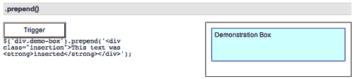

我们可以将 HTML 结构插入到 `<div class="demo-box">` 的开头，如下所示：

```js
$('div.demo-box').prepend('<div class="insertion">This text was <strong>inserted</strong></div>');

```

新的 `<div>` 和 `<strong>` 元素以及文本节点是动态创建的并添加到 DOM 中。结果是一个新的 `<div>` 位于 **演示框** 文本之前：

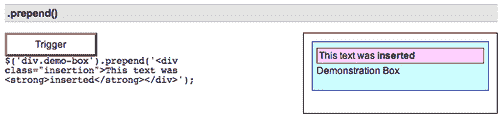

已经存在于页面上的元素（或元素数组）也可以移动到 `<div class="demo-box">` 的开头。例如，以下代码通过使用 jQuery 对象将文档的第一个段落移动到目标位置：

```js
$('div.demo-box').prepend( $('p:eq(0)') );

```

## `.prependTo()`

| 将匹配元素集合中的每个元素插入到目标的开头。

```js
.prependTo(target)

```

|

### 参数

+   target: 选择器、元素、HTML 字符串或 jQuery 对象；匹配的元素集将插入到由此参数指定的元素的开头

### 返回值

用于链式操作的 jQuery 对象。

### 描述

`.prepend` 和 `.prependTo` 方法执行相同的任务。唯一的区别在于语法 - 具体来说，在内容和目标的放置方面。使用 `.prepend()`，在方法之前的选择器表达式是要插入内容的容器。另一方面，使用 `.prependTo()`，*内容* 在方法之前，可以是选择器表达式，也可以是动态创建的标记，它被插入到目标容器中。

考虑以下 HTML：

```js
<div class="demo-container">
  <div class="demo-box">Demonstration Box
  </div> 
</div>
```

两个 `<div>`，加上一点 CSS，呈现在页面右侧，如下所示：

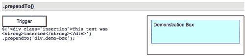

使用 `.prependTo()`，我们可以将 HTML 结构插入到 `<div class="demo-box">` 的开头，如下所示：

```js
$('<div class="insertion">This text was <strong>inserted</strong> </div>').prependTo('div.demo-box');

```

新的 `<div>` 和 `<strong>` 元素，以及文本节点，是动态创建的并添加到 DOM 中。结果是一个新的 `<div>` 位于 **演示框** 文本之前：

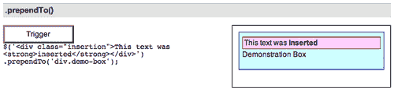

已经存在于页面上的元素（或元素数组）也可以移动到 `<div class="demo-box">` 的开头。例如，以下代码通过使用选择器表达式将文档的第一个段落移动到目标位置：

```js
$('p:eq(0)').prependTo('div.demo-box');

```

## `.append()`

| 将参数指定的内容插入到匹配元素集合中每个元素的末尾。

```js
.append(content)

```

|

### 参数

+   content: 要插入到匹配元素集合中每个元素末尾的选择器、元素、HTML 字符串或 jQuery 对象。

### 返回值

用于链式操作的 jQuery 对象。

### 描述

`.append` 和 `.appendTo` 方法执行相同的任务。唯一的区别在于语法——具体来说，是内容和目标的放置位置。使用 `.append()`，方法前面的选择器表达式是要插入内容的容器。另一方面，使用 `.appendTo()`，*内容*在方法之前，可以是选择器表达式，也可以是即时创建的标记，然后插入到目标容器中。

考虑以下的 HTML：

```js
<div class="demo-container">
  <div class="demo-box">Demonstration Box
  </div> 
</div>
```

两个 `<div>`，通过一点 CSS，呈现在页面的右侧如下：

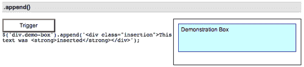

我们可以像这样将 HTML 结构插入到 `<div class="demo-box">` 的末尾：

```js
$('div.demo-box').append('<div class="insertion">This text was <strong>inserted</strong></div>');

```

新的 `<div>` 和 `<strong>` 元素，以及文本节点，是即时创建的并添加到 DOM 中。结果是一个新的 `<div>` 定位在 **演示框** 文本之后：

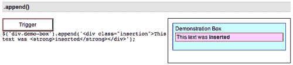

页面上已经存在的元素（或元素数组）也可以移动到 `<div class="demo-box">` 的末尾。例如，下面的代码通过使用 jQuery 对象来移动文档的第一个段落：

```js
$('div.demo-box').append( $('p:eq(0)') );

```

## .appendTo()

| 在匹配元素集的每个元素之后插入到目标中。

```js
.appendTo(target)

```

|

### 参数

+   目标：选择器、元素、HTML 字符串或 jQuery 对象；匹配的元素集将插入到由此参数指定的元素的末尾

### 返回值

jQuery 对象，用于链接目的。

### 描述

`.append` 和 `.appendTo` 方法执行相同的任务。唯一的区别在于语法——具体来说，是内容和目标的放置位置。使用 `.append()`，方法前面的选择器表达式是要插入内容的容器。另一方面，使用 `.appendTo()`，*内容*在方法之前，可以是选择器表达式，也可以是即时创建的标记，然后插入到目标容器中。

考虑以下的 HTML：

```js
<div class="demo-container">
  <div class="demo-box">Demonstration Box
  </div> 
</div>
```

两个 `<div>`，通过一点 CSS，呈现在页面的右侧如下：

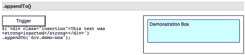

使用 `.appendTo()`，我们可以像这样将 HTML 结构插入到 `<div class="demo-box">` 的末尾：

```js
$('<div class="insertion">This text was <strong>inserted</strong> </div>').appendTo('div.demo-box');

```

新的 `<div>` 和 `<strong>` 元素，以及文本节点，是即时创建的并添加到 DOM 中。结果是一个新的 `<div>` 定位在 **演示框** 文本之后：

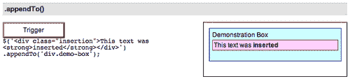

页面上已经存在的元素（或元素数组）也可以移动到 `<div class="demo-box">` 的末尾。例如，下面的代码通过使用选择器表达式来移动文档的第一个段落：

```js
$('p:eq(0)').appendTo('div.demo-box');

```

# DOM 插入，外部

## .before()

| 在匹配元素集的每个元素之前插入参数指定的内容。

```js
.before(content)

```

|

### 参数

+   内容：要在匹配元素集的每个元素之前插入的元素、HTML 字符串或 jQuery 对象

### 返回值

jQuery 对象，用于链式调用。

### 描述

`.before`和`.insertBefore`方法执行相同的任务。唯一的区别在于语法——具体来说，在内容和目标的放置方面不同。对于`.before()`，在方法之前的选择器表达式是要插入内容的容器。而对于`.insertBefore()`，另一方面，*内容*在方法之前，可以作为选择器表达式或即时创建的标记插入，并且它会在目标容器之前插入。

考虑以下 HTML：

```js
<div class="demo-container">
  <div class="demo-box">Demonstration Box
  </div> 
</div>
```

两个`<div>`经过一点 CSS 处理后，在页面的右侧呈现如下：

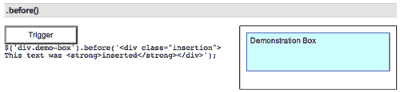

我们可以这样在`<div class="demo-box">`之前插入一个 HTML 结构：

```js
$('div.demo-box').before('<div class="insertion">This text was <strong>inserted</strong></div>');

```

新的`<div>`和`<strong>`元素以及文本节点是即时创建的，并添加到 DOM 中。结果是一个新的`<div>`被定位在`<div class="demo-box">`的外部，就在它之前：

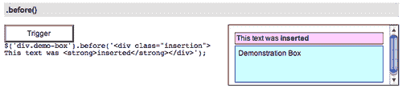

已经存在于页面上的一个元素（或元素数组）也可以移动到 DOM 位置，就在`<div class="demo-box">`之前。例如，以下代码通过使用 jQuery 对象移动文档的第一个段落：

```js
$('div.demo-box').before( $('p:eq(0)') );

```

## `.insertBefore()`

| 在参数中指定的一组元素之前插入匹配元素集合中的每个元素。

```js
.insertBefore(content)

```

|

### 参数

+   内容：要插入的一组匹配元素之前的选择器或元素

### 返回值

jQuery 对象，用于链式调用。

### 描述

`.before`和`.insertBefore`方法执行相同的任务。唯一的区别在于语法——具体来说，在内容和目标的放置方面不同。对于`.before()`，在方法之前的选择器表达式是要插入内容的容器。而对于`.insertBefore()`，另一方面，*内容*在方法之前，可以作为选择器表达式或即时创建的标记插入，并且它会在目标容器之前插入。

考虑以下 HTML：

```js
<div class="demo-container">
  <div class="demo-box">Demonstration Box
  </div> 
</div>
```

两个`<div>`经过一点 CSS 处理后，在页面的右侧呈现如下：

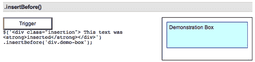

我们可以这样在`<div class="demo-box">`之前插入一个 HTML 结构：

```js
$('<div class="insertion">This text was <strong>inserted</strong> </div>').insertBefore('div.demo-box');

```

新的`<div>`和`<strong>`元素以及文本节点是即时创建的，并添加到 DOM 中。结果是一个新的`<div>`被定位在`<div class="demo-box">`的外部，就在它之前：

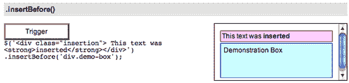

已经存在于页面上的一个元素（或元素数组）也可以移动到 DOM 位置，就在`<div class="demo-box">`之前。例如，以下代码通过使用 jQuery 对象移动文档的第一个段落：

```js
$('p:eq(0)').insertBefore('div.demo-box');

```

## `.after()`

| 在匹配元素集合中的每个元素后插入参数指定的内容。

```js
.after(content)

```

|

### 参数

+   内容：要在一组匹配元素中的每个元素后插入的元素、HTML 字符串或 jQuery 对象。

### 返回值

jQuery 对象，用于链式调用。

### 描述

`.after` 和 `.insertAfter` 方法执行相同的任务。唯一的区别在于语法，具体来说，在内容和目标的放置上有所不同。对于 `.after()`，方法之前的选择器表达式是将内容插入的容器。另一方面，对于 `.insertAfter()`，*内容*在方法之前，可以是选择器表达式，也可以是即时创建的标记，它被插入到目标容器之后。

考虑以下 HTML：

```js
<div class="demo-container">
  <div class="demo-box">Demonstration Box
  </div> 
</div>
```

两个 `<div>`，稍加 CSS 处理，渲染在页面的右侧，如下所示：

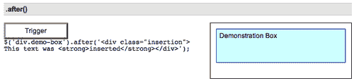

我们可以在 `<div class="demo-box">`之后插入 HTML 结构，如下所示：

```js
$('div.demo-box').after('<div class="insertion">This text was <strong>inserted</strong></div>');

```

新的 `<div>` 和 `<strong>` 元素，以及文本节点，都是即时创建并添加到 DOM 中的。结果是一个新的 `<div>`，在 `<div class="demo-box">`之外，紧接着它之后：

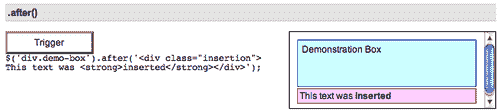

将页面上已经存在的元素（或元素数组）移动到 DOM 位置后面的`<div class="demo-box">`也是可以的。例如，以下代码通过使用 jQuery 对象将文档的第一个段落移动：

```js
$('div.demo-box').after( $('p:eq(0)') );

```

## `.insertAfter()`

| 将匹配元素集合中的每个元素插入到指定参数中的元素集合之后。

```js
.insertAfter(content)

```

|

### 参数

+   content: 一个选择器或元素，用于指定将要插入的匹配元素集合之后

### 返回值

用于链式调用的 jQuery 对象。

### 描述

`.after` 和 `.insertAfter` 方法执行相同的任务。唯一的区别在于语法，具体来说，在内容和目标的放置上有所不同。对于 `.after()`，方法之前的选择器表达式是将内容插入的容器。另一方面，对于 `.insertAfter()`，*内容*在方法之前，可以是选择器表达式，也可以是即时创建的标记，它被插入到目标容器之后。

考虑以下 HTML：

```js
<div class="demo-container">
  <div class="demo-box">Demonstration Box
  </div> 
</div>
```

两个 `<div>`，稍加 CSS 处理，渲染在页面的右侧，如下所示：

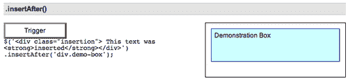

使用 `.insertAfter()`，我们可以在 `<div class="demo-box">`之后插入 HTML 结构，如下所示：

```js
$('<div class="insertion">This text was <strong>inserted</strong> </div>').insertAfter('div.demo-box');

```

新的 `<div>` 和 `<strong>` 元素，以及文本节点，都是即时创建并添加到 DOM 中的。结果是一个新的 `<div>`，在 `<div class="demo-box">`之外，紧接着它之后：

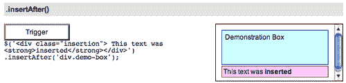

将页面上已经存在的元素（或元素数组）移动到 DOM 位置后面的`<div class="demo-box">`也是可以的。例如，以下代码通过使用 jQuery 对象将文档的第一个段落移动：

```js
$('p:eq(0)').insertAfter('div.demo-box');

```

# DOM 插入，环绕

## `.wrap()`

| 将一系列元素的结构包装在匹配元素集合中的每个元素周围。

```js
.wrap(html)
.wrap(element)

```

|

### 参数（第一版本）

+   html: 一串 HTML 标记，用于围绕匹配元素集合

### 参数（第二版本）

+   element: 一个现有的元素，用于围绕匹配元素集合

### 返回值

jQuery 对象，用于链式调用。

### 描述

注意：HTML 必须仅包含格式正确、有效的元素结构。如果包含任何文本，或者任何标签未关闭，`.wrap()` 将失败。

考虑以下 HTML：

```js
<div class="demo-container">
  <div class="demo-box">Demonstration Box
  </div> 
</div>
```

两个 `<div>`，通过一些 CSS，呈现在页面的右侧如下：

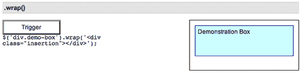

使用`.wrap()`，我们可以在 `<div class="demo-box">` 周围插入 HTML 结构，如下所示：

```js
$('div.demo-box').wrap('<div class="insertion"> </div>');

```

新的 `<div>` 元素是即时创建的，并添加到 DOM 中。结果是一个新的 `<div>` 包裹在 `<div class="demo-box">` 周围：

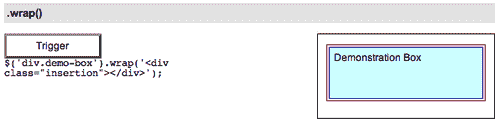

使用 DOM 节点作为我们的参数，我们可以将新的 `<div>` 包装在具有 `id="demo-box1"` 的元素周围，如下所示：

```js
$(document.getElementById('demo-box1')).wrap(' <div class="insertion"> </div>');

```

# DOM 复制

## .clone()

| 创建匹配元素集的副本。

```js
.clone([deep])

```

|

### 参数

+   deep（可选）：布尔值。默认为`true`。如果设置为`false`，`.clone`方法仅复制匹配的元素本身，而不包括任何子/后代元素和文本。

### 返回值

一个新的 jQuery 对象，引用了创建的元素。

### 描述

当与其中一种插入方法结合使用时，`.clone`方法是在页面上复制元素的便捷方式。考虑以下 HTML：

```js
<div class="demo-container">
  <div class="demo-box">Demonstration Box
  </div> 
</div>
```

两个 `<div>`，通过一些 CSS，呈现在页面的右侧如下：

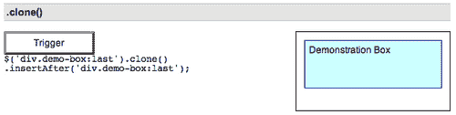

要复制`<div class="demo-box">`并将该副本粘贴到原始内容之后，我们可以编写以下内容：

```js
$('div.demo-box:last').clone().insertAfter('div.demo-box:last');

```

现在我们有两个**演示框**：

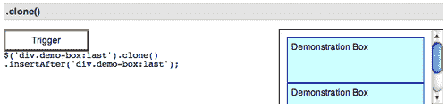

请注意，我们在这里使用`:last`选择器，以确保只复制(`.clone()`)并粘贴(`.insertAfter()`)一次。我们需要注意潜在的意外克隆或插入超出我们意图的数量，并采取必要的预防措施防止发生这种情况。

### 提示

使用`.clone`方法，我们可以在将克隆的元素或其内容插入文档之前修改它们。

可选的 `deep` 参数接受一个布尔值 — `true` 或 `false`。由于在大多数情况下，我们希望克隆子节点，而默认值为`true`，因此该参数很少被使用。但是，想象一下我们想要复制**演示框**而不带其文本，然后将段落附加到每个 `<div class="demo-box">`。我们可以使用以下代码实现这一点：

```js
$('div.demo-box:last').clone(false).insertAfter('div.demo-box:last');
$('div.demo-box').append('<p>New Message</p>);

```

现在两个框看起来像这样：

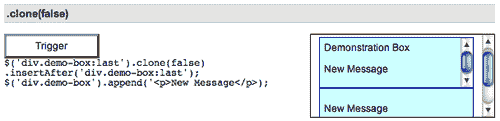

第一个框现在既有原始**演示框**文本，又有额外的**新消息**文本，而新克隆的框只有额外的文本。

# DOM 删除

## .empty()

| 从 DOM 中删除匹配元素集的所有子节点。

```js
.empty()

```

|

### 参数

无。

### 返回值

jQuery 对象，用于链式调用。

### 描述

此方法不仅会移除子元素（和其他后代元素），还会移除匹配元素集合中的任何文本。这是因为根据 DOM，元素内的任何文本字符串被视为该元素的子节点。考虑以下 HTML：

```js
<div class="demo-container">
  <div class="demo-box">Demonstration Box
  </div> 
</div>
```

两个 `<div>` 经过一点 CSS 处理后，显示在页面的右侧如下：


如果我们对其应用 `$('div.demo-box').empty()`;，则**演示框**文本字符串被移除：

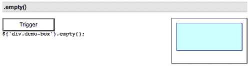

如果我们在 `<div class="demo-box">` 内有任意数量的嵌套元素，它们也会被移除。

## .remove()

| 从 DOM 中移除一组匹配的元素。

```js
.remove([selector])

```

|

### 参数

+   选择器（可选）：用于筛选要移除的一组匹配元素

### 返回值

用于链接目的的 jQuery 对象。

### 描述

与 .empty 类似，`.remove` 方法将元素从 DOM 中移除。我们使用 `.remove()` 当我们想要移除元素本身以及其中的所有内容。考虑以下 HTML：

```js
<div class="demo-container">
  <div class="demo-box">Demonstration Box
  </div> 
</div>
```

两个 `<div>` 经过一点 CSS 处理后，显示在页面的右侧如下：

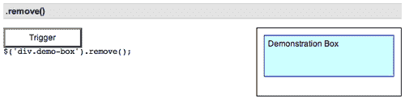

如果我们对其应用 `$('div.demo-box').remove()`，整个 `<div class="demo-box>` 以及其中的所有内容都会被移除：

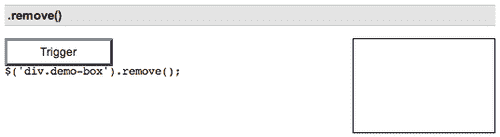

我们还可以将选择器作为可选参数包含在内。例如，我们可以将前面的 DOM 移除代码重写为：`$('div').remove('.demo-box')`。或者，如果我们有多个具有相同类名的元素，并且只想移除第一个带有 `id="temporary-demo-box"` 的元素，我们可以这样编写：

```js
$('div.demo‑box').remove('#temporary-demo-box ').

```
