# 第六章：效果方法

> 它有风格，有品位
> 
> ——德沃,
> 
> "无法控制的冲动"

在本章中，我们将仔细检查每个效果方法，揭示 jQuery 提供给用户的所有视觉反馈机制。

# 预打包效果

这些方法允许我们快速应用常用效果，并具有最小的配置。

## `.show()`

| 显示匹配的元素。

```js
.show([speed][, callback])

```

|

### 参数

+   speed（可选）：确定动画运行时间的字符串或数字

+   回调（可选）：动画完成后要调用的函数

### 返回值

jQuery 对象，用于链式操作。

### 描述

没有参数时，`.show()`方法是显示元素的最简单方法：

```js
$('.target').show();

```

匹配的元素将立即显示，没有动画。这大致相当于调用`.css('display', 'block')`，除了`display`属性会恢复为初始值。如果将元素的`display`值设置为`inline`，然后将其隐藏和显示，则它将再次以`inline`显示。

如果提供了速度，则`.show()`变为动画方法。`.show()`方法同时动画匹配元素的宽度、高度和不透明度。

速度以动画的毫秒持续时间给出；较高的值表示较慢的动画，*而不是*较快的动画。可以提供字符串`fast、normal`和`slow`来指示速度值为`200、400`和`600`，如果省略速度参数，则默认为`normal`。

如果提供了回调函数，则在动画完成后调用。这对于将不同的动画按顺序串联在一起非常有用。回调函数不接收任何参数，但`this`被设置为正在被动画化的 DOM 元素。回调函数对每个匹配的元素执行一次，*而不是*对整个动画执行一次。

我们可以对任何元素进行动画处理，例如简单的包含图像的`<div>`：

```js
<div class="content">
  <div class="trigger button">Trigger</div>
  <div class="target"></div>
  <div class="log"></div>
</div>
```

初始隐藏元素后，我们可以缓慢显示它：

```js
$('.trigger').click(function() {
  $('.target').show('slow', function() {
    $(this).log('Effect complete.');
  });
});
```

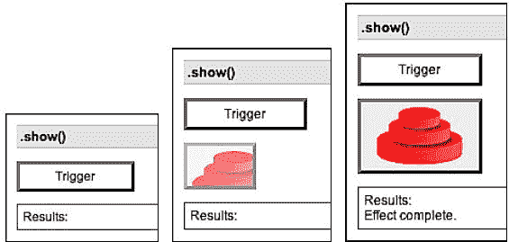

## `.hide()`

| 隐藏匹配的元素。

```js
.hide([speed][, callback])

```

|

### 参数

+   speed（可选）：确定动画运行时间的字符串或数字

+   回调（可选）：动画完成后要调用的函数

### 返回值

jQuery 对象，用于链式操作。

### 描述

没有参数时，`.hide()`方法是隐藏元素的最简单方法：

```js
$('.target').hide();

```

匹配的元素将立即被隐藏，没有动画。这大致相当于调用`.css('display', 'none')`，除了`display`属性的值被保存为元素的另一个属性，以便稍后可以将`display`恢复为其初始值。如果将元素的`display`值设置为`inline`，然后将其隐藏和显示，则它将再次以`inline`显示。

如果提供了速度，则`.hide()`变为动画方法。`.hide()`方法同时动画匹配元素的宽度、高度和不透明度。

速度以动画的毫秒持续时间给出；较高的值表示较慢的动画，*而不是*较快的动画。可以提供字符串`fast，normal`和`slow`来表示速度值`200、400`和`600`。如果省略了速度参数，则假定为`normal`。

如果提供了回调函数，则在动画完成后调用该函数。这对于按顺序连接不同的动画非常有用。回调函数不接收任何参数，但`this`被设置为正在进行动画处理的 DOM 元素。回调函数对每个匹配的元素执行一次，而不是对整个动画执行一次。

我们可以对任何元素进行动画处理，比如一个简单的包含图片的`<div>`：

```js
<div class="content">
  <div class="trigger button">Trigger</div>
  <div class="target"></div>
  <div class="log"></div>
</div>
```

初始显示元素后，我们可以慢慢隐藏它：

```js
$('.trigger').click(function() {
  $('.target').hide('slow', function() {
    $(this).log('Effect complete.');
  });
});
```

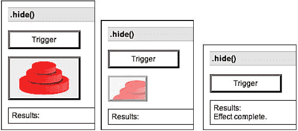

## `.toggle()`

| 显示或隐藏匹配的元素。

```js
.toggle([speed][, callback])

```

|

### 参数

+   速度（可选）：确定动画运行时间的字符串或数字

+   回调（可选）：动画完成后要调用的函数

### 返回值

jQuery 对象，用于链接目的。

### 描述

没有参数时，`.toggle()`方法简单地切换元素的可见性：

```js
$('.target').toggle();

```

匹配的元素将立即显示或隐藏，没有动画效果。如果元素最初是显示的，则将其隐藏；如果是隐藏的，则将其显示。根据需要保存并恢复`display`属性。如果给定的元素具有`inline`的`display`值，则隐藏和显示后，它将再次以`inline`的方式显示。

当提供速度时，`.toggle()`变为动画方法。`.toggle()`方法同时动画匹配元素的宽度、高度和不透明度。

速度以动画的毫秒持续时间给出；较高的值表示较慢的动画，*而不是*较快的动画。可以提供字符串`fast，normal`和`slow`来表示速度值`200、400`和`600`。如果省略了速度参数，则假定为`normal`。

如果提供了回调函数，则在动画完成后调用该函数。这对于按顺序连接不同的动画非常有用。回调函数不接收任何参数，但`this`被设置为正在进行动画处理的 DOM 元素。回调函数对每个匹配的元素执行一次，而不是对整个动画执行一次。

我们可以对任何元素进行动画处理，比如一个简单的包含图片的`<div>`：

```js
<div class="content">
  <div class="trigger button">Trigger</div>
  <div class="target"></div>
  <div class="log"></div>
</div>
```

初始显示元素后，我们可以慢慢隐藏和显示它：

```js
$('.trigger').click(function() {
  $('.target').toggle('slow', function() {
    $(this).log('Effect complete.');
  });
});
```

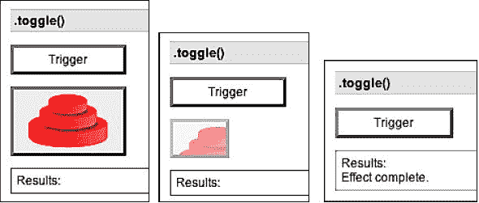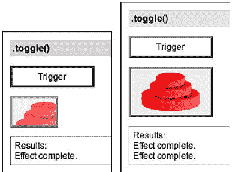

## `.slideDown()`

| 以滑动方式显示匹配的元素。

```js
.slideDown([speed][, callback])

```

|

### 参数

+   速度（可选）：确定动画运行时间的字符串或数字

+   回调（可选）：动画完成后要调用的函数

### 返回值

jQuery 对象，用于链接目的。

### 描述

`.slideDown()`方法会使匹配元素的高度发生动画变化。这会导致页面的底部向下滑动，为显示的项目让出空间。

速度以动画的毫秒持续时间给出；更高的值表示更慢的动画，*而不是*更快的动画。可以提供字符串`fast、normal`和`slow`来指示速度值为`200、400`和`600`。如果省略速度参数，则假定为`normal`。

如果提供了回调函数，动画完成后将触发该回调。这对于按顺序串联不同的动画非常有用。回调函数不接收任何参数，但`this`被设置为正在进行动画的 DOM 元素。回调函数针对每个匹配的元素执行一次，而不是针对整个动画执行一次。

我们可以对任何元素进行动画处理，比如一个包含图像的简单的`<div>`：

```js
<div class="content">
  <div class="trigger button">Trigger</div>
  <div class="target"></div>
  <div class="log"></div>
</div>
```

以元素初始隐藏的状态，我们可以缓慢显示它：

```js
$('.trigger').click(function() {
  $('.target').slideDown('slow', function() {
    $(this).log('Effect complete.');
  });
});
```

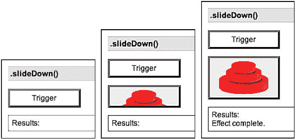

## .slideUp()

| 以滑动动作隐藏匹配的元素。

```js
.slideUp([speed][, callback])

```

|

### 参数

+   speed（可选）：确定动画将运行多长时间的字符串或数字

+   回调（可选）：动画完成后要调用的函数

### 返回值

jQuery 对象，用于链接目的。

### 描述

`.slideUp()`方法动画化匹配元素的高度。这将导致页面的较低部分向上滑动，似乎隐藏了项目。

速度以动画的毫秒持续时间给出；更高的值表示更慢的动画，*而不是*更快的动画。可以提供字符串`fast、normal`和`slow`来指示速度值为`200、400`和`600`。如果省略速度参数，则假定为`normal`。

如果提供了回调函数，动画完成后将触发该回调。这对于按顺序串联不同的动画非常有用。回调函数不接收任何参数，但`this`被设置为正在进行动画的 DOM 元素。回调函数针对每个匹配的元素执行一次，而不是针对整个动画执行一次。

我们可以对任何元素进行动画处理，比如一个包含图像的简单的`<div>`：

```js
<div class="content">
  <div class="trigger button">Trigger</div>
  <div class="target"></div>
  <div class="log"></div>
</div>
```

以元素初始可见的状态，我们可以缓慢隐藏它：

```js
$('.trigger').click(function() {
  $('.target').slideUp('slow', function() {
    $(this).log('Effect complete.');
  });
});
```

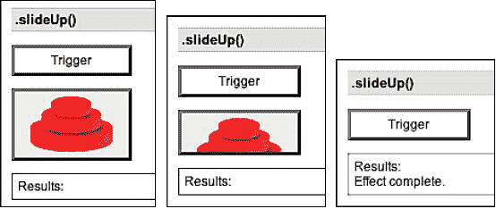

## .slideToggle()

| 以滑动动作显示或隐藏匹配的元素。

```js
.slideToggle([speed][, callback])

```

|

### 参数

+   speed（可选）：确定动画将运行多长时间的字符串或数字

+   回调（可选）：动画完成后要调用的函数

### 返回值

jQuery 对象，用于链接目的。

### 描述

`.slideToggle()`方法动画化匹配元素的高度。这将导致页面的较低部分向上或向下滑动，似乎隐藏或显示了项目。

速度以动画的毫秒持续时间给出；更高的值表示更慢的动画，*而不是*更快的动画。可以提供字符串`fast、normal`和`slow`来指示速度值为`200、400`和`600`。如果省略速度参数，则假定为`normal`。

如果提供，回调函数在动画完成时被触发。这对于按顺序将不同的动画串联起来非常有用。回调不发送任何参数，但`this`被设置为正在被动画化的 DOM 元素。回调一次对匹配元素执行一次，而不是整个动画执行一次。

我们可以对任何元素进行动画处理，例如一个包含图像的简单的`<div>`：

```js
<div class="content">
  <div class="trigger button">Trigger</div>
  <div class="target"></div>
  <div class="log"></div>
</div>
```

初始显示该元素，然后我们可以慢慢隐藏和显示它：

```js
$('.trigger').click(function() {
  $('.target').slideToggle('slow', function() {
    $(this).log('Effect complete.');
  });
});
```

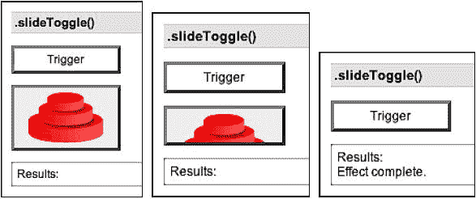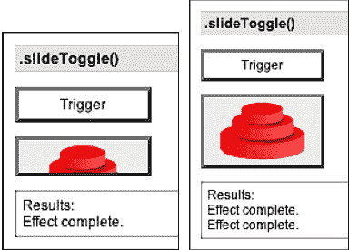

## .fadeIn()

| 通过将匹配元素淡化为不透明来显示它们。

```js
.fadeIn([speed][, callback])

```

|

### 参数

+   速度（可选）：确定动画运行时间的字符串或数字。

+   回调（可选）：动画完成时要调用的函数。

### 返回值

jQuery 对象，用于链接目的。

### 描述

`.fadeIn()`方法动画显示匹配元素的不透明度。

速度以动画的毫秒持续时间给出；较高的值表示较慢的动画，*而不是*较快的动画。可以提供字符串`fast, normal`和`slow`表示速度值分别为`200, 400`和`600`。如果省略速度参数，则假定为`normal`。

如果提供，回调函数在动画完成时被触发。这对于按顺序将不同的动画串联起来非常有用。回调不发送任何参数，但`this`被设置为正在被动画化的 DOM 元素。回调一次对匹配元素执行一次，*而不是*整个动画执行一次。

我们可以对任何元素进行动画处理，例如一个包含图像的简单的`<div>`：

```js
<div class="content">
  <div class="trigger button">Trigger</div>
  <div class="target"></div>
  <div class="log"></div>
</div>
```

初始隐藏该元素，然后我们可以慢慢显示它：

```js
$('.trigger').click(function() {
  $('.target').fadeIn('slow', function() {
    $(this).log('Effect complete.');
  });
});
```

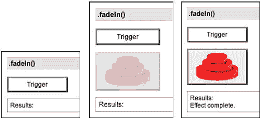

## .fadeOut()

| 通过将匹配元素淡化为透明来隐藏它们。

```js
.fadeOut([speed][, callback])
```

|

### 参数

+   速度（可选）：确定动画运行时间的字符串或数字。

+   回调（可选）：动画完成时要调用的函数。

### 返回值

jQuery 对象，用于链接目的。

### 描述

`.fadeOut()`方法动画隐藏匹配元素的不透明度。

速度以动画的毫秒持续时间给出；较高的值表示较慢的动画，*而不是*较快的动画。可以提供字符串`fast, normal`和`slow`表示速度值分别为`200, 400`和`600`。如果省略速度参数，则假定为`normal`。

如果提供，回调函数在动画完成时被触发。这对于按顺序将不同的动画串联起来非常有用。回调不发送任何参数，但`this`被设置为正在被动画化的 DOM 元素。回调一次对匹配元素执行一次，*而不是*整个动画执行一次。

我们可以对任何元素进行动画处理，例如一个包含图像的简单的`<div>`：

```js
<div class="content">
  <div class="trigger button">Trigger</div>
  <div class="target"></div>
  <div class="log"></div>
</div>
```

初始显示该元素，然后我们可以慢慢隐藏它：

```js
$('.trigger').click(function() {
  $('.target').fadeOut('slow', function() {
    $(this).log('Effect complete.');
  });
});
```

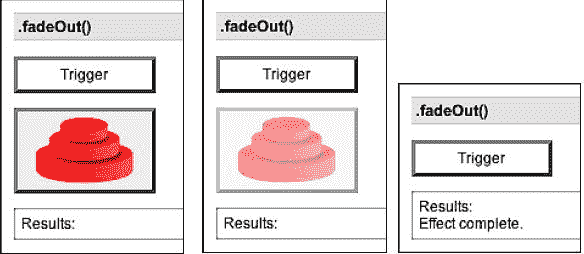

## .fadeTo()

| 调整匹配元素的不透明度。

```js
.fadeTo(speed, opacity[, callback])
```

|

### 参数

+   速度：确定动画将运行多长时间的字符串或数字

+   不透明度：介于 0 和 1 之间的目标不透明度的数字

+   回调：（可选）：动画完成后要调用的函数

### 返回值

jQuery 对象，用于链接目的。

### 描述

`.fadeTo（）`方法会动画化匹配元素的不透明度。

速度以动画的毫秒持续时间给出；较高的值表示较慢的动画，*不*表示更快的动画。可以提供字符串`fast，normal`和`slow`以指示速度值分别为`200，400`和`600`。与其他效果方法不同，`.fadeTo（）`要求速度应明确指定。

如果提供了回调函数，则在动画完成后触发。这对于串联不同的动画在序列中很有用。回调函数不会发送任何参数，但`this`被设置为正在动画的 DOM 元素。回调函数针对每个匹配的元素执行一次，*不*是动画作为整体执行一次。

我们可以对任何元素进行动画处理，例如一个简单的包含图像的`<div>`：

```js
<div class="content">
  <div class="trigger button">Trigger</div>
  <div class="target"></div>
  <div class="log"></div>
</div>
```

使用元素最初显示，我们可以慢慢将其变暗：

```js
$('.trigger').click(function() {
  $('.target').fadeTo('slow', 0.5, function() {
    $(this).log('Effect complete.');
  });
});
```

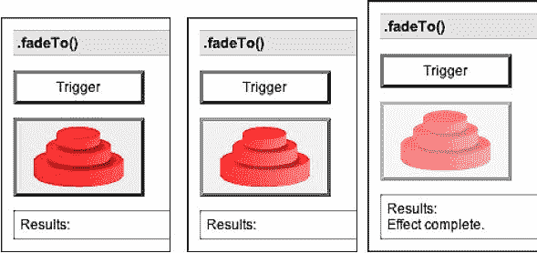

将*速度*设置为`0`，此方法只是更改`opacity`CSS 属性，因此`.fadeTo（0，opacity）`与`.css（'opacity'，opacity）`相同。

### 注意

在 jQuery 版本 1.1.3 之前，`.fadeTo（）`会将元素的`display`属性设置为`block`。这在与非块项（如表格行和内联元素）一起使用时可能导致奇怪的布局渲染。从 jQuery 1.1.3 开始，可以安全地对这些元素使用淡入淡出。

# 自定义效果

本节描述了如何创建 jQuery 未提供的效果。

## `.animate（）`

| 执行一组 CSS 属性的自定义动画。

```js
.animate(properties[, speed][, easing][, callback])
```

|

### 参数

+   属性：动画将向其移动的 CSS 属性的映射

+   速度（可选）：确定动画将运行多长时间的字符串或数字

+   缓动（可选）：指示要用于过渡的缓动函数的字符串

+   回调（可选）：动画完成后要调用的函数

### 返回值

jQuery 对象，用于链接目的。

### 描述

`.animate（）`方法允许我们在任何数字 CSS 属性上创建动画效果。唯一必需的参数是一组 CSS 属性的映射。此映射类似于可以发送到`.css（）`方法的映射，只是属性范围更为限制。

所有动画属性都被视为像素数。如果属性最初以不同的单位（如 em 或百分比）指定，这可能会产生奇怪的结果。

除了数字值之外，每个属性还可以采用字符串`show，hide`和`toggle`。这些快捷方式允许自定义隐藏和显示动画，考虑了元素的显示类型。

速度以动画的毫秒持续时间给出；更高的值表示较慢的动画，*不*是更快的动画。可以提供字符串`fast, normal`和`slow`来指示速度值分别为`200, 400`和`600`。如果省略速度参数，则假定为`normal`。

如果提供了回调函数，则在动画完成时会触发。这对于按顺序串联不同的动画非常有用。回调函数不会发送任何参数，但`this`设置为正在动画的 DOM 元素。回调函数对每个匹配的元素执行一次，*而不是*对整个动画执行一次。

我们可以动画任何元素，比如一个简单的包含图像的`<div>`：

```js
<div class="content">
  <div class="trigger button">Trigger</div>
  <div class="target"></div>
  <div class="log"></div>
</div>
```

我们可以同时动画多个属性：

```js
$('.trigger').click(function() {
  $('.target').animate({
    'width': 300,
    'left': 100,
    'opacity': 0.25
  }, 'slow', function() {
    $(this).log('Effect complete.');
  });
});
```

如果我们希望像示例中那样动画`left`属性，则元素的`position`属性不能是`fixed`。

### 注意

更复杂的`.animate()`方法的版本可以在*Interface*插件中找到。它处理一些非数字样式，比如颜色，还处理类的动画，而不是单个属性。

`.animate()`的剩余参数是一个命名的字符串，用于指定要使用的缓动函数。缓动函数指定动画在动画内不同点的进度速度。jQuery 库中唯一的缓动实现是默认的`linear`。通过使用插件，如 Interface，可以获得更多的缓动函数。
