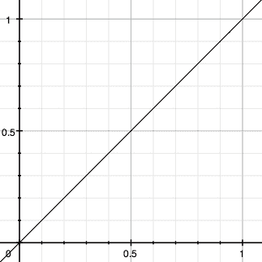
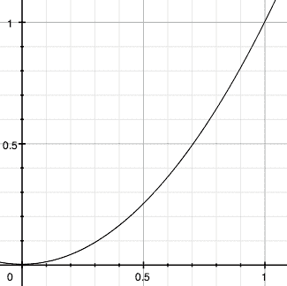

# 第九章：插件 API

> 现在我一次做两个
> 
> 我已经开发了一种技术
> 
> —Devo，
> 
> "Fräulein"

每当一个任务要执行两次或更多次时，都应用**DRY**原则——不要重复自己是一个好主意。为了方便起见，jQuery 为开发人员提供了几种工具，超出了简单的迭代和函数创建。**插件**开发是一种反复证明有益的技术。

在本章中，我们将简要介绍使用其他开发者的插件的基础知识，然后深入探讨用我们自己定义的插件扩展 jQuery 的各种方法。

# 使用插件

利用现有的 jQuery 插件非常简单。插件包含在一个标准的 JavaScript 文件中。获得该文件的方法有很多种，但最简单的方法是浏览[`jquery.com/plugins`](http://jquery.com/plugins)上的 jQuery 插件仓库。许多热门插件的最新版本都可以从该网站下载。

要使插件的方法对我们可用，我们只需将其包含在文档的`<head>`中。我们必须确保它出现在主要的 jQuery 源文件之后，并且出现在我们自定义的 JavaScript 代码之前：

```js
<head>
  <meta http-equiv="Content-Type" content="text/html; charset=utf-8"/>
  <script src="img/jquery.js" type="text/javascript"></script>
 <script src="img/jquery.plug-in.js" type="text/javascript"></script>
  <script src="img/custom.js" type="text/javascript"></script>
  <title>Example</title>
</head>
```

在那之后，我们就可以使用插件公开的任何方法了。例如，使用*Form*插件，我们可以在我们自定义文件的`$(document).ready`方法内添加一行代码来通过 AJAX 提交表单：

```js
$(document).ready(function() {
  $('#myForm').ajaxForm();
});
```

每个插件都有独立的文档。在接下来的章节中，我们将详细介绍一些更显著的插件，描述它们的每个方法。要了解更多关于其他插件的信息，我们可以查看从 jQuery 插件仓库链接的文档，或者阅读源代码中的解释性注释。

如果我们在插件仓库、作者的网站或插件的注释中找不到所有问题的答案，我们总是可以求助于 jQuery 讨论列表。许多插件作者经常在列表上发表意见，并且总是乐意帮助新用户可能面临的任何问题。订阅讨论列表的说明可以在[`docs.jquery.com/Discussion`](http://docs.jquery.com/Discussion)找到。

# 开发插件

正如我们上面讨论的，当我们要执行一个任务超过一次时，插件开发是一种有用的技术。在这里，我们将列举可以填充我们自己设计的插件文件的组件。我们的插件可以使用以下四种类型的 jQuery 增强的任意组合：对象方法、全局函数、选择器表达式和缓动样式。

## 对象方法

| 将一个新的方法添加到由`$()`工厂函数创建的所有 jQuery 对象中。

```js
jQuery.fn.methodName = methodDefinition

```

|

### 组件

+   `methodName`：新方法的标签。

+   `methodDefinition`：在 jQuery 对象实例上调用`.methodName()`时要执行的函数对象。

### 讨论

当函数需要对一个或多个 DOM 元素进行操作时，通常适合创建一个新的 jQuery 对象方法。对象方法可以访问由 jQuery 对象引用的匹配元素，并且可以检查或操作它们。

可以通过引用关键字 `this` 从方法实现中检索到 jQuery 对象。我们可以调用这个对象的内置 jQuery 方法，也可以直接提取 DOM 节点以直接处理它们。正如我们在第八章中看到的那样，我们可以使用数组表示法检索引用的 DOM 节点：

```js
jQuery.fn.showAlert = function() {
  alert('You called the method on "' + this[0] + '".');
  return this;
}
```

在这里，我们使用 `this[0]` 来找到一个元素，但是我们需要记住，jQuery 选择器表达式始终可以匹配零个、一个或多个元素。在设计插件方法时，我们必须为这些情况中的任何一种留出空间。实现这一点的最简单方法是在方法上下文中调用 `.each()`；这强制进行**隐式迭代**，这对于保持插件和内置方法之间的一致性很重要。在 `.each()` 调用的函数参数内，`this` 依次引用每个 DOM 元素：

```js
jQuery.fn.showAlert = function() {
  return this.each(function() {
    alert('You called the method on "' + this + '".');
  });
}
```

现在我们可以将我们的方法应用于引用多个项的 jQuery 对象：

```js
$('.myClass').showAlert();

```

我们的方法为每个由前面选择器表达式匹配的元素生成一个单独的警报。

还要注意，在这些示例中，当我们完成工作时，我们会返回 jQuery 对象本身（由 `this` 引用）。这样一来，就实现了 jQuery 用户应该依赖的**链接**行为。除非方法明确用于检索不同的信息并且已经记录了这样的用法，否则我们必须从所有插件方法中返回一个 jQuery 对象。

## 全局函数

| 使一个新的函数可用于脚本，包含在 jQuery 命名空间内。

```js
jQuery.pluginName = fnDefinition;
jQuery.pluginName = {
function1: fnDefinition1,
function2: fnDefinition2
};

```

|

### 组件（第一个版本）

+   `pluginName`: 当前插件的名称。

+   `fnDefinition`: 当调用 `$.pluginName()` 时要执行的函数对象。

### 组件（第二个版本）

+   `pluginName`: 当前插件的名称。

+   `function1`: 第一个函数的标签。

+   `fnDefinition1`: 当调用 `$.pluginName.function1()` 时要执行的函数对象。

+   `function2`: 第二个函数的标签。

+   `fnDefinition2`: 当调用 `$.pluginName.function2()` 时要执行的函数对象。

### 讨论

我们这里称之为**全局函数**的东西在技术上是 `jQuery` 函数对象的方法。从实际上来说，它们是 jQuery 命名空间内的函数。通过将函数放在 jQuery 命名空间内，我们减少了与脚本中其他函数和变量的名称冲突的机会。

**单一函数**

第一种用法反映了当插件仅需要一个单独的函数时创建全局函数的情况。通过使用插件名称作为函数名称，我们可以确保我们的函数定义不会被其他插件踩踏（只要其他插件遵循相同的准则！）。新函数被分配为 `jQuery` 函数对象的属性：

```js
jQuery.myPlugin = function() {
  alert('This is a test. This is only a test.');
};
```

现在在使用此插件的任何代码中，我们可以编写：

```js
jQuery.myPlugin();

```

我们也可以使用 `$` 别名并写：

```js
$.myPlugin();

```

这将像任何其他函数调用一样工作，并显示警报。

**多个函数**

在第二种用法中，我们看到如何在同一个插件需要多个函数时定义全局函数。我们将所有插件封装在一个名为我们插件的命名空间中：

```js
jQuery.myPlugin = {
  foo: function() {
    alert('This is a test. This is only a test.');
  },
  bar: function(param) {
    alert('This function takes a parameter, which is "' + param + '".');
  }
};
```

要调用这些函数，我们将它们视为命名为我们插件的对象的成员，该对象本身是全局 jQuery 函数对象的属性：

```js
$.myPlugin.foo();
$.myPlugin.bar('baz');

```

现在函数已正确保护，不会与全局命名空间中的其他函数和变量发生冲突。

通常，从一开始就使用第二种用法是明智的，即使看起来只需要一个函数，因为这样做可以更轻松地进行将来的扩展。

## 选择器表达式

| 添加了一种使用 jQuery 选择器字符串查找 DOM 元素的新方法。

```js
jQuery.extend(jQuery.expr[selectorType], {
selectorName: elementTest
});

```

|

### 组件

+   `selectorType`：选择器字符串的前缀字符，指示正在定义哪种类型的选择器。在实践中，对于插件来说，有用的值是 `':'`，表示伪类选择器。

+   `selectorName`：一个唯一标识此选择器的字符串。

+   `elementTest`：包含要评估的 JavaScript 表达式的字符串。如果表达式对元素 `a` 评估为 `true`，则该元素将包含在结果集中；否则，该元素将被排除。

### 讨论

插件可以添加允许脚本使用紧凑语法找到特定集合的 DOM 元素的选择器表达式。通常，插件添加的表达式是新的伪类，以领先的 `':'` 字符标识。

jQuery 支持的伪类具有 `:selectorName(param1(param2))` 的一般格式。此格式仅需要 `selectorName` 部分；如果伪类允许参数以使其更具体，`param1` 和 `param2` 可用。

元素测试表达式可以引用两个特殊变量，名为 `a` 和 `m`。正在测试的 DOM 元素存储在 `a` 中，选择器表达式的组件存储在 `m` 中。`m` 的内容是正则表达式匹配的结果，它将 `:selectorName(param1(param2))` 分解如下：

```js
m[0] == ':selectorName(param1(param2))'
m[1] == ':'
m[2] == 'selectorName'
m[3] == 'param1(param2)'
m[4] == '(param2)'

```

例如，我们可以构建一个测试元素的子节点数的伪类，并将这个新的选择器表达式称为 `:num-children(n)`：

```js
jQuery.extend(jQuery.expr[':'], {
  'num-children': 'a.childNodes.length == m[3]'
});
```

现在我们可以，例如，选择所有具有两个子节点的 `<ul>` 元素，并将它们变为红色：

```js
$(document).ready(function() {
  $('ul:num-children(2)').css('color', 'red');
});
```

如果需要添加除伪类之外的选择器表达式，应查看`jquery.js`中的`jQuery.parse`以找到其他选择器类型的相关正则表达式匹配。

## **缓动样式**

| 为未来的动画定义了一个加速曲线。

```js
jQuery.extend(jQuery.easing, {
easingStyleName: easingFunction
});

```

|

### 组件

+   `easingStyleName`：新缓动样式的标签。

+   `easingFunction`：确定任何给定时刻的动画值的函数对象。缓动函数传递以下参数：

    +   `fraction`：动画的当前位置，以从 0（动画的开始）到 1（动画的结束）的时间来衡量。

    +   `elapsed`：动画开始后经过的毫秒数（很少使用）。

    +   `attrStart`：正在进行动画的 CSS 属性的起始值。

    +   `attrDelta`：正在进行动画的 CSS 属性的起始值和结束值之间的差异。

    +   `duration`：动画期间总共经过的毫秒数（很少使用）。

### 讨论

大多数有效的方法都会触发一个具有固定**缓动样式**的动画，称为**swing**。缓动样式定义了动画随时间加速和减速的方式。`.animate` 方法给了我们更大的灵活性；该方法的一个参数允许指定自定义缓动样式。可以使用这个插件机制创建新的缓动样式。

缓动函数必须在动画的任何时刻返回正在动画的属性的值。由于传递给缓动函数的参数，计算通常采用以下形式：

```js
f(fraction) * attrDelta + attrStart

```

在这个计算中，`f`代表一个数学函数，其值随着参数从 0 到 1 的变化而从 0 到 1 变化。例如，一个导致动画以恒定速率进行的缓动样式将需要一个线性函数（`f(x) = x`）：



在一个插件中，这个缓动样式将用以下代码表示：

```js
jQuery.extend(jQuery.easing, { 
  'linear': function(fraction, elapsed, attrStart, attrDelta,
                                                       duration) {
    return fraction * attrDelta + attrStart;
  }
});
```

另一方面，如果我们希望我们的动画开始缓慢，然后逐渐加速，我们可以使用一个二次函数（`f(x)` `=` `x` `2` `）`：



在一个插件中，这个缓动样式将用以下代码表示：

```js
jQuery.extend(jQuery.easing, { 
  'quadratic': function(fraction, elapsed, attrStart, attrDelta,
                                                       duration) {
    return fraction * fraction * attrDelta + attrStart;
  }
});
```

安装了这样一个缓动插件后，我们可以在调用`.animate`方法时随时选择新的缓动样式：

```js
$('.myClass').animate({
  'left': 500,
  'opacity': 0.1
}, 'slow', 'quadratic');
```

通过这个调用，所有附有`myClass`类的元素都会移动并淡出到指定的值，开始缓慢，然后逐渐加速直到它们到达目的地。

# 示例：维护多个事件日志

在前面的参考章节中的各种示例中，我们需要在各种事件发生时显示日志事件。JavaScript 的 `alert` 函数通常用于此类演示，但不允许我们按时显示频繁的消息。一个更好的选择是 Firefox 和 Safari 可用的 `console.log` 函数，它允许将消息打印到不会中断页面交互流程的单独日志中。然而，由于此函数不适用于 Internet Explorer，因此我们使用了一个自定义函数来实现此类消息记录的样式。

### 注意

Firebug Lite 脚本（见 附录 B）提供了一个非常强大的跨平台日志记录工具。我们在这里开发的方法专门针对前几章的示例；对于一般情况，通常更倾向于使用 Firebug Lite。

记录消息的一个简单方法是创建一个全局函数，将消息附加到页面上的特定元素：

```js
jQuery.log = function(message) {
  $('<div class="log-message"></div>')
    .text(message).appendTo('.log');
};
```

我们可以变得更加花哨，让新消息以动画的方式出现：

```js
jQuery.log = function(message) {
  $('<div class="log-message"></div>')
    .text(message)
    .hide()
    .appendTo('.log')
    .fadeIn();
};
```

现在我们可以调用 `$.log('foo')` 在页面上的日志框中显示 `foo`。

然而，我们有时在单个页面上有多个示例，因此，将每个示例保持单独的日志记录是很方便的。我们通过使用方法而不是全局函数来实现这一点：

```js
jQuery.fn.log = function(message) {
  return this.each(function() {
    $('<div class="log-message"></div>')
      .text(message)
      .hide()
      .appendTo(this)
      .fadeIn();
  });
};
```

现在调用 `$('.log').log('foo')` 就像我们之前的全局函数调用一样，但我们可以更改选择器表达式以定位不同的日志框。

然而，理想情况下，`.log` 方法应该足够智能，能够在没有显式选择器的情况下找到最相关的日志消息框。通过利用传递给方法的上下文，我们可以遍历 DOM，找到最接近所选元素的日志框：

```js
jQuery.fn.log = function(message) {
  return this.each(function() {
    $context = $(this);
    while ($context.length) {
      $log = $context.find('.log');
      if ($log.length) {
        $('<div class="log-message"></div>')
          .text(message).hide().appendTo($log).fadeIn();
        break;
      }
      $context = $context.parent();
    }
  });
};
```

此代码在匹配元素中查找日志消息框，如果找不到，则向上遍历 DOM 查找一个。

最后，有时我们需要显示对象的内容。直接打印对象本身得到的是几乎没有信息的东西，像 `[object Object]`，因此，我们可以检测参数类型，在传递对象时进行一些自己的美化打印：

```js
jQuery.fn.log = function(message) {
  if (typeof(message) == 'object') {
    string = '{';
    $.each(message, function(key, value) {
      string += key + ': ' + value + ', ';
    });
    string += '}';
    message = string;
  }
  return this.each(function() {
    $context = $(this);
    while ($context.length) {
      $log = $context.find('.log');
      if ($log.length) {
        $('<div class="log-message"></div>')
          .text(message).hide().appendTo($log).fadeIn();
        break;
      }
      $context = $context.parent();
    }
  });
};
```

现在我们有了一个可以在页面上与正在进行的工作相关的地方写出对象和字符串的方法。

# 总结

在本章中，我们从两个角度查看了插件：使用和开发。我们看了四种类型的 jQuery 插件添加：插件可以引入新的全局方法和 jQuery 对象方法；此外，它们可以添加选择器表达式和缓动样式。

虽然如此，我们通常更感兴趣的是使用其他人创建的插件。虽然我们已经指向了许多插件的可用文档，但在接下来的章节中，我们将更详细地介绍两个较受欢迎的插件。
