# 第十章：尺寸插件

> 我们信仰的符号
> 
> 有时会颠倒过来
> 
> 重塑每个尺寸
> 
> 我们对此深信不疑
> 
> —Devo，
> 
> "纯真的真相"

**Dimensions** 插件，由 Paul Bakaus 和 Brandon Aaron 共同编写，有助于弥合 CSS 盒模型与开发者准确测量文档中元素的高度和宽度之间的差距。它还以像素精度测量元素的顶部和左侧偏移量，无论它们在页面的哪个位置。在本章中，我们将探讨此插件的各种方法并讨论它们的选项。

# 尺寸方法

除了确定浏览器窗口或文档的尺寸之外，以下尺寸方法还形成了一组强大的工具，用于识别元素的高度和宽度，无论我们是否想考虑元素的填充和边框大小。

我们将在接下来的每个示例中使用相同的基本 HTML：

```js
<body>
  <div id="container">
<!-- CODE CONTINUES -->    
    <div id="content">
      <div class="dim-outer">
        <p>This is the outer dimensions box. It has the following CSS rule:</p>
<pre><code>.dim-outer {
  height: 200px;
  width: 200px;
  margin: 10px;
  padding: 1em;
  border: 5px solid #e3e3e3;
  overflow: auto;
  font-size: 12px;
}</code></pre>
        <p>Scroll down for the inner dimensions box.</p>
        <p>Lorem ipsum dolor sit amet, consectetur adipisicing elit,sed do eiusmod tempor incididunt ut labore et dolore magna aliqua. Ut enim ad minim veniam, quis nostrud exercitation ullamco laboris nisi ut aliquip ex ea commodo consequat. Duis aute irure dolor in reprehenderit in voluptate velit esse cillum dolore eu fugiat nulla pariatur. Excepteur sint occaecat cupidatat non proident, sunt in culpa qui officia deserunt mollit anim id est laborum.</p>
        <div class="dim-inner"> This is the inner dimensions box.
        </div>
      </div> 

<!-- CODE CONTINUES -->

    </div>
  </div> 
</body>
```

## .height()

| 获取 `document` 或 `window` 对象的高度。

```js
.height()

```

|

### 参数

无。

### 返回值

一个表示高度的像素整数。

### 讨论

`.height` 方法简单地使用了 jQuery 核心方法相同名称的方法。Dimensions 将 `.height()` 方法扩展到浏览器 `window` 和 `document` 上。

`$(window).height()` 返回浏览器窗口的像素高度。如果有水平滚动条，则不包含在高度计算中。

`$(document).height()` 返回文档的像素高度。如果文档的高度大于可见区域——在这种情况下存在垂直滚动条——`$(document).height()` 计算总高度，包括可见部分和隐藏部分。

以下图像说明了 `$(document).height()` 和 `$(window).height()` 之间的差异：

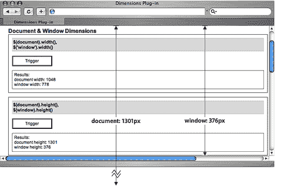

有关在页面上使用 `.height` 方法的信息，请参见 第四章。

## .width()

| 获取 `document` 或 `window` 对象的宽度。

```js
.width()

```

|

### 参数

无。

### 返回值

一个表示宽度的像素整数。

### 描述

`.width` 方法，就像它的 `.height()` 对应物一样，当应用到元素时，简单地使用了 jQuery 核心方法相同名称的方法。然而，Dimensions 将 `.width()` 扩展，以便我们可以将其应用到 `document` 和浏览器 `window` 上。

`$(document).width()` 返回文档的像素宽度。如果有垂直滚动条，则 `$(document).width()` 不包括在计算中。如果文档的宽度大于可见区域——在这种情况下存在水平滚动条——`$(document).width()` 计算总高度，包括页面的可见部分和隐藏部分。

`$(window).width()` 返回浏览器的像素宽度。如果有垂直滚动条，则不包含在宽度计算中。

下面的图像说明了`$(document).width()`和`$(window).width()`之间的差异：

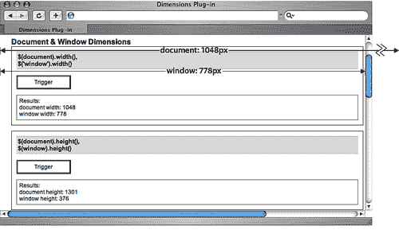

有关在页面上使用`.width`方法的信息，请参阅第四章。

## .innerHeight()

| 获取匹配元素集中第一个元素的计算内部高度。

```js
.innerHeight()

```

|

### 参数

无。

### 返回值

一个表示元素内部高度的整数，以像素为单位。

### 描述

`.innerHeight` 方法与基本的`.height()`不同之处在于它计算顶部和底部填充的高度，而不仅仅是元素本身的高度。但是，它的计算不包括边框或外边距。

如果与`document`或`window`一起使用，`.innerHeight()` 调用 Dimensions`.height`方法返回这个值。

给定一个高度为`200px`，字体大小为`12px`，顶部和底部填充为`1em`的元素，`.innerHeight()` 返回`224`（像素），如下图所示：

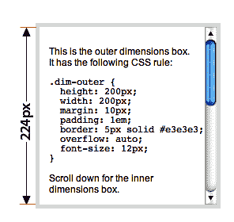

## .innerWidth()

| 获取匹配元素集合中第一个元素的计算内部宽度。

```js
.innerWidth()

```

|

### 参数

无。

### 返回值

一个表示元素内部宽度的整数，以像素为单位。

### 描述

`.innerWidth` 方法与基本的`.width()`不同之处在于它计算左右填充的宽度，而不仅仅是元素本身的宽度。然而，它的计算不包括边框或外边距。

如果与`document`或`window`一起使用，`.innerWidth()`调用 Dimensions`.width`方法返回这个值。

给定宽度为`200px`，字体大小为`12px`，左右填充为`1em`的元素，`.innerWidth()`返回`224`（像素），如下图所示：

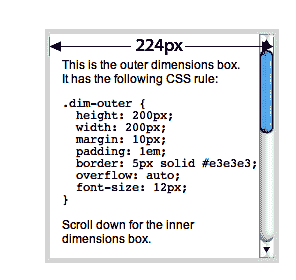

## .outerHeight()

| 获取匹配元素集中第一个元素的计算外部高度。

```js
.outerHeight()

```

|

### 参数

无。

### 返回值

一个表示元素外部高度的整数，以像素为单位。

### 讨论

`.outerHeight` 方法与基本的 `.height()` 不同之处在于它计算顶部和底部填充以及顶部和底部边框的高度，而不仅仅是元素本身的高度。但是，与`.height()`和`.innerHeight()`一样，它的计算不包括元素的外边距。

如果与`document`或`window`一起使用，`.outerHeight()` 调用 Dimensions`.height`方法返回这个值。

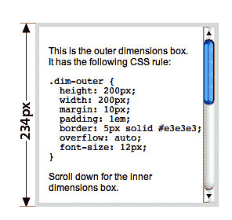

## .outerWidth()

| 获取匹配元素集中第一个元素的计算外部宽度。

```js
.outerWidth()

```

|

### 参数

无。

### 返回值

一个表示元素外部宽度的整数，以像素为单位。

### 描述

`.outerWidth`方法与基本的`.width()`不同之处在于，它在计算元素本身的宽度之外还计算左右填充和左右边框的宽度。然而，与`.width()`和`.innerWidth()`一样，它不包括元素的边距在内的计算。

如果与`document`或`window`一起使用，`.outerWidth()`调用尺寸`.width`方法来返回值。

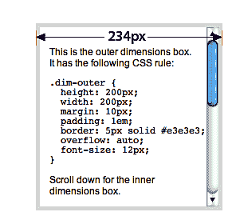

# 定位方法

以下方法有助于确定元素的精确位置——相对于定位祖先、文档主体或文档的可视区域。

就像*尺寸方法*部分一样，我们将为以下每个示例使用相同的基本 HTML：

```js
<body>
  <div id="container">
<!-- CODE CONTINUES -->    
    <div id="content">
      <div class="dim-outer">
        <p>This is the outer dimensions box. It has the following CSS rule:</p>
<pre><code>.dim-outer {
  height: 200px;
  width: 200px;
  margin: 10px;
  padding: 1em;
  border: 5px solid #e3e3e3;
  overflow: auto;
  font-size: 12px;
}</code></pre>
        <p>Scroll down for the inner dimensions box.</p>
        <p>Lorem ipsum dolor sit amet, consectetur adipisicing elit, sed do eiusmod tempor incididunt ut labore et dolore magna aliqua. Ut enim ad minim veniam, quis nostrud exercitation ullamco laboris nisi ut aliquip ex ea commodo consequat. Duis aute irure dolor in reprehenderit in voluptate velit esse cillum dolore eu fugiat nulla pariatur. Excepteur sint occaecat cupidatat non proident, sunt in culpa qui officia deserunt mollit anim id est laborum.</p><div class="dim-inner"> This is the inner dimensions box.
        </div>
      </div> 

<!-- CODE CONTINUES -->

    </div>
  </div> 
</body>
```

## .scrollTop()

| 获取窗口或文档内的可滚动元素向下滚动的像素数。

```js
.scrollTop()

```

|

### 参数

无。

### 返回值

表示像素的垂直滚动条位置的整数。

### 讨论

`.scrollTop`方法能够返回浏览器窗口或文档内元素的垂直滚动位置。例如，在`<div class="dim-outer">`向下滚动了 96 像素后（如下图所示），`$('div.dim-outer').scrollTop()`返回`96`：

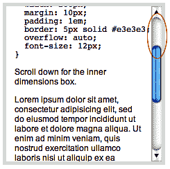

## .scrollTop(value)

| 设置在窗口或文档内匹配的可滚动元素中从上向下滚动的像素数。

```js
.scrollTop(value)

```

|

### 参数

+   `value`：表示像素数的整数。

### 返回值

用于链接目的的 jQuery 对象。

### 描述

通过将数值传递给`.scrollTop`方法，我们可以将浏览器窗口或文档内可滚动元素的滚动位置上下移动。在下图中，`<div class="dim-outer">`的滚动位置已经设置为`$('div.dim-outer').scrollTop(200)`：

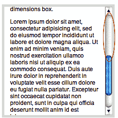

## .scrollLeft()

| 获取窗口或文档内可滚动元素从左向右滚动的像素数。

```js
.scrollLeft()
```

|

### 参数

无。

### 返回值

表示水平滚动条位置的整数。

### 描述

`.scrollLeft`方法能够返回浏览器窗口或文档内元素的水平滚动位置。例如，在浏览器窗口向右滚动了 24 像素后，如下图所示，`$(window).scrollLeft()`的返回值是`24`：

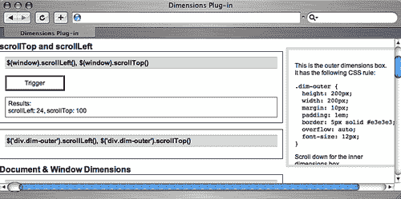

## .scrollLeft(value)

| 设置在窗口或文档内匹配的可滚动元素中从左向右滚动的像素数。

```js
.scrollLeft(value)
```

|

### 参数

+   `value`：表示像素数的整数。

### 返回值

用于链接目的的 jQuery 对象。

### 讨论

通过向`.scrollLeft`方法传递一个数字值，我们可以将浏览器窗口或文档内可滚动元素的滚动位置向左或向右移动。在下面的图像中，浏览器窗口的滚动位置已经设置为`$(window).scrollLeft(50)`

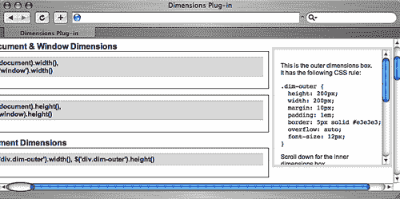

## .偏移量()

| 获取匹配元素集中第一个元素的顶部和左侧坐标。还获取匹配元素的`scrollTop`和`scrollLeft`偏移量。

```js
.offset([options])
.offset(options, returnObject)

```

|

### 参数（第一版）

+   `options` (optional)：一个设置映射，用于配置偏移量的计算方式。可以包含以下项目：

    +   `margin` (optional)：一个布尔值，表示是否在计算中包含元素的外边距。默认为`true`。

    +   `border` (optional)：一个布尔值，表示是否在计算中包含元素的边框。默认为`false`。

    +   `padding` (optional)：一个布尔值，表示是否在计算中包含元素的填充。默认为`false`。

    +   `scroll` (optional)：一个布尔值，表示是否在计算中包含所有祖先元素的滚动偏移量。默认为`true`。

    +   `lite` (optional)：一个布尔值，表示是否使用 offsetLite 而不是 offset。默认为`false`。

+   `relativeTo` (optional)：表示匹配元素将被偏移到哪个祖先元素的 HTML 元素。默认为`document.body`。

### 参数（第二版）

+   `options`：一个设置映射，用于配置偏移量的计算方式。

    +   `margin` (optional)：一个布尔值，表示是否在计算中包含元素的外边距。默认为`true`。

    +   `border` (optional)：一个布尔值，表示是否在计算中包含元素的边框。默认为`false`。

    +   `padding` (optional)：一个布尔值，表示是否在计算中包含元素的填充。默认为`false`。

    +   `scroll` (optional)：一个布尔值，表示是否在计算中包含所有祖先元素的滚动偏移量。默认为`true`。

    +   `lite` (optional)：一个布尔值，表示是否使用`offsetLite`而不是`offset`。默认为`false`。

    +   `relativeTo` (optional)：表示匹配元素将被偏移到哪个祖先元素的 HTML 元素。默认为`document.body`。

    +   `returnObject`：一个对象，用于存储返回值。当使用方法的第二个版本时，链条将不会被打破，并且结果将被分配到此对象中。

### 返回值（第一版）

包含`top, left`值，以及可选的`scrollTop`和`scrollLeft`值的对象。

### 返回值（第二版）

jQuery 对象，用于链式目的。

### 描述

`.offset`方法允许我们定位页面上任何位置的任何元素的`top`和`left`位置，不管其`position`是`static`还是`relative, absolute`还是`fixed`，也不管滚动条的位置如何。通过对 margin、border、padding 和 scroll 进行计算，`.offset()`提供了极大的灵活性和准确性。

以下一系列图像展示了不同设置下`.offset()`返回的不同值。

**默认设置**

在第一个示例中，使用了 padding（false）、border（false）和 margin（true）的默认设置。结果：

```js
{top: 117, left: 580, scrollTop: 0, scrollLeft: 0}

```

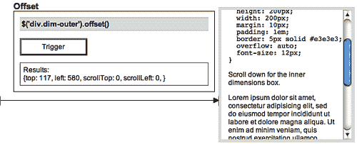

请注意，由于 margin 的默认值是`true`，因此从窗口左边缘到匹配元素的距离一直延伸到（但不包括）元素的边框。

**包括边框**

在第二个示例中，边框选项设置为`true`。由于`<div class="dim-outer">`周围有 5 像素的边框，`top`和`left`值分别增加了 5 像素：

```js
{top: 122, left: 585, scrollTop: 0, scrollLeft: 0}

```

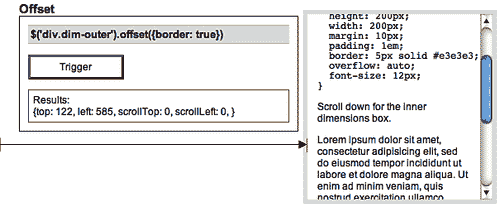

**包括边框和内边距**

接下来的示例将边框和 padding 选项都设置为`true`（记住 margin 选项的默认值为`true`）。结果是边框增加了 5 像素，内边距增加了另外 12 像素（1em）：

```js
{top: 134, left: 597, scrollTop: 0, scrollLeft: 0}

```

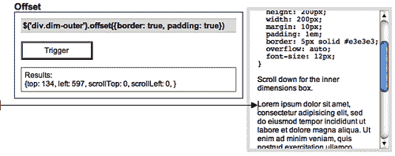

**查找相对于祖先的位置**

通过`relativeTo`选项，我们可以找到元素与其任何一个定位祖先之间的偏移距离。在下一个示例中，我们正在获取`<div class="dim-outer">`和`<div id="content">`之间的偏移量。由于`content <div>`本身就是由于容器的 24 像素左边距而从窗口左侧偏移，左侧的值现在比上一个示例少了 24 像素：

```js
{top: 27, left: 573, scrollTop: 0, scrollLeft: 0}

```

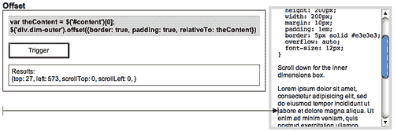

值得注意的是，由于`relativeTo`设置需要一个 DOM 元素，所以我们在使用它的`relativeTo`参数之前，使用了简写`[0]`来将 jQuery 对象转换为 DOM 元素。

`top`值为`27`是由浮动`<div class="dim-outer">`元素的 margin（`12`）、border（`5`）和 padding（`10`）的总和得出的。如果`<div id="content">`有任何应用到其顶部的 padding，那也将被添加到总的顶部偏移量中。

**返回滚动偏移**

`scroll`选项的默认值为`true`，当匹配的元素位于一个或多个`overflow`属性设置为`auto`或`scroll`的元素内部时，它特别有用。它将所有祖先元素的滚动偏移量添加到总偏移量中，并向返回的对象添加了两个属性，`scrollTop`和`scrollLeft`。其实用性可以在下面的示例中观察到，示例显示了`<div class="dim-outer">`在`<div class="dim-outer">`向下滚动了 79 像素时的偏移量。

```js
{top: 509, left: 597, scrollTop: 79, scrollLeft: 0}

```

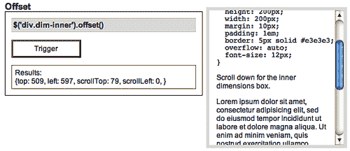

**保持链式操作**

如果我们希望传递返回对象以便继续链接方法，我们仍然必须包含选项映射。为了保持这些选项的默认值不变，同时传递返回对象，我们可以简单地使用一个空映射。例如，`$('div.dim-outer').offset({}, returnObject)`获得与`$('div.dim-outer').offset()`相同的值，但将它们存储在`returnObject`中以供以后使用。

假设我们希望在更改`<div class="dim-outer">`的背景颜色为灰色（#cccccc）的同时获取其偏移和滚动值。代码将如下所示：

```js
var retObj = {};
$('div.dim-outer')
  .offset({}, retObj)
  .css('background','#ccc');
$(this).log(retObj);
```

我们首先声明一个返回对象的变量（retObj）。然后我们将`.offset`和`.css`方法链接到选择器上。最后，我们对`.offset()`返回的对象执行某些操作—在这种情况下，使用我们的日志插件记录结果。 `<div>`的背景颜色被更改，并且`.offset()`值如下所示被记录：

```js
{top: 117, left: 580, scrollTop: 0, scrollLeft: 0}

```

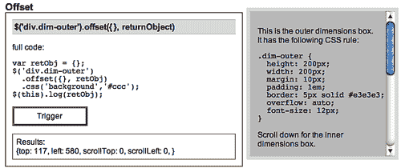

## `.position()`

| 获取匹配元素集中第一个元素相对于其最近的相对、绝对或固定定位的祖先的位置。

```js
.position()
.position(returnObject)

```

|

### 参数（第一个版本）

无。

### 参数（第二个版本）

+   `returnObject`：用于存储返回值的对象。当使用方法的第二个版本时，链不会中断，并且结果将被分配给此对象。

### 返回值（第一个版本）

包含`top`和`left`值的对象。

### 返回值（第二个版本）

jQuery 对象，用于链式操作。

### 描述

`.position`方法是以下`.offset()`变体的简写形式：

```js
.offset({
  margin: false, 
  scroll: false, 
  relativeTo: offsetParent
  }, 
  returnObject);
```

在这里，只确定元素的顶部和左侧位置—没有填充、边框或边距—与其最近的定位祖先相关。有关这些选项的更多详细信息，请参阅`.offset()`的描述。

对于`relativeTo`，`.position()`方法使用一个名为`offsetParent`的变量，该变量在 Dimensions 代码中设置。实际上，这段代码从元素的直接父级开始，然后在 DOM 中向上爬行，停止在第一个具有`relative, absolute`或`fixed`位置的元素处。然后，相对于最近的定位元素计算初始元素的偏移位置。

考虑以下 HTML：

```js
<div id="outer">
  <div id="middle" style="position: relative">
    <div id="inner">
      <p>Use .position() for this paragraph</p>
    </div>
  </div>
</div>
```

使用`$('p').position()`计算段落相对于`<div id="middle">`的顶部和左侧偏移，因为该`<div>`是最近的定位祖先（请注意其`style`属性）。

由于`.position()`不带任何参数（第二个版本中除了`returnValue`），它比`.offset()`灵活性要小得多。在大多数情况下，建议使用上述讨论的`.offset()`。
