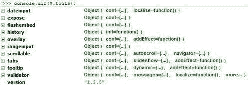
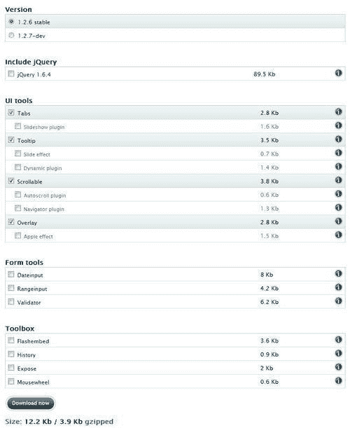
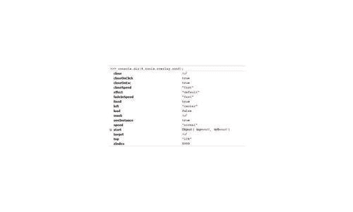
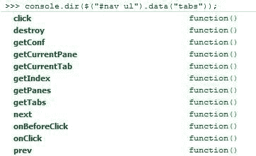

# 第一章：入门

如果您在过去几年里构建了网页或使用 HTML 开发了网站，您很可能听说过 jQuery——也许您没有听说过 jQuery Tools。

全球的网络专业人士一直在努力使互联网变得更易用，他们使用 JavaScript 来试图克服 HTML 和 CSS 的一些缺点。jQuery 的力量和灵活性在于其看似简单的复杂性，使得浏览文档、选择页面元素和处理事件变得简单明了，同时消除了任何浏览器的差异。互联网上有许多基于 jQuery 的 UI 库可用。jQuery Tools 就是其中之一——虽然许多库旨在提供各种各样的功能，但 jQuery Tools 旨在提供在普通网站上最有用的功能，换句话说，不是基于 JavaScript 应用程序的站点。它的小尺寸掩盖了其强大和灵活性，在仅 4 KB 的空间内提供了大量功能。

在本章中，我们将学习：

+   jQuery Tools 的一点历史，以及其一些指导原则

+   如何下载和安装库，或者使用 CDN 链接

+   编写事件和使用 API 的一些最佳实践

那么，让我们开始吧...

# jQuery 工具的基础知识和规则：入门指南

> “面对现实吧——你真的需要拖放、可调整大小的窗口或可排序的列表吗…？”

如果答案是否定的，那么欢迎来到 jQuery Tools！jQuery Tools 旨在提供许多 Web 2.0 中常见的好用功能，可根据您的需求进行扩展、定制和样式化。工具的主要目的是提供一个功能的基本框架，只提供所需的功能，而不提供其他功能——API 框架可以用来以各种方式扩展工具。有了这个目标，让我们更详细地了解一下 jQuery Tools 的理念。

## HTML 的作用

jQuery Tools 库设计时具有高度的灵活性，可以逐步增强普通网站的功能，同时仍允许不支持 JavaScript 的浏览器。在使用工具集时，您不受任何特定 HTML 结构的限制；您可以自由地随意使用任何适当的元素，比如`ul, ol, div`或`dl`。了解您正在做什么，以及如何为特定需求选择正确的元素是至关重要的。同样可以使用根元素，比如`div`，虽然这并非强制性的。例如，您可以有一个包含 HTML、图片、表单和 Flash 对象的叠加信息的根元素。

## JavaScript 和 jQuery 的作用

尽管 JQuery Tools 库是使用 jQuery 构建的，但除了 FlashEmbed 之外，使用这些工具并不是使用 jQuery 的先决条件。虽然您可以在不需要任何 jQuery 先验知识的情况下使用这些工具，但它可以帮助扩展或增强库中的功能，以及在您的网站上。如果您想更深入地了解如何使用 jQuery 与工具，那么一个有用的起点是查看选择器和对象文字，例如以下示例：

```js
// two jQuery selectors and a configuration given as an object literal
$("#content ul.tabs").tabs("div.panes > div", {
// configuration variables
current: 'current',
effect: 'fade'
});

```

前述代码可以分为两部分——第一部分选择所有具有`tabs`类名的`ul`元素，这些元素包含在名为`content`的`div`中，类似于 CSS 的方式。然后，`tabs`功能设置为在直接包含在具有 CSS 样式类`panes`的`div`中的所有 div 元素上运行。在配置任何工具时，您可以使用类似的语法格式，尽管在键入正确数量的括号时要小心！无论您使用哪种工具，都需要将任何脚本包含在`$(document).ready()`块中，以便在适当的时间加载脚本——您可能会发现将脚本加载到网站的页脚中更可取（对于某些工具是必需的）。

## CSS 的角色

jQuery Tools 旨在允许网站设计者将代码从主要“块”中抽象出来，放入单独的样式表中。您会注意到，在可能的情况下使用了 CSS 样式名称。这使得代码的样式更加灵活，因为可以随意更改样式，而无需更改主要代码——尽管将 CSS 样式与 JavaScript 或 HTML 代码混合在一起并不是一种推荐的做法。例如，您可以在`tabs:`中为活动选项卡的实例设置样式。

```js
$("ul.tabs").tabs("div.panes > div", {current: 'active'});

```

之后，您可以使用以下 CSS 样式设置当前选项卡：

```js
ul.tabs .active {
color: '#fff';
fontWeight: bold;
background-position: 0 -40px;
}

```

这使您完全控制一个`tabs`实例的外观，甚至可以更改所使用的默认样式名称。如果您已经有现有的样式，否则会产生冲突，或者需要遵循特定的 CSS 命名约定，这将非常有用。

### 提示

jQuery Tools 网站托管了许多演示，其中包含可供您使用的 CSS 样式文件——值得查看这些内容，以了解有关样式工具基础知识的情况。所有演示都有完整的文档说明，并使用良好的 CSS 样式规范。

### 使用工具进行图形设计和演示

作为使用 jQuery Tools 的开发人员，您在网站样式设计方面拥有很高的自由度。这意味着您可以在设计中使用纯 CSS、图像，或两者混合使用。

#### 基于 CSS 的设计

在设计中使用纯 CSS 意味着对图片的依赖减少了，因为大多数（如果不是全部）的样式都可以通过纯 CSS 来处理。这在 CSS3 出现后尤其明显，CSS3 可以处理背景中的渐变等样式，而不需要图片。然而，这意味着虽然页面轻量且易于维护，但仅仅使用 CSS 并不能实现一切，至少在版本 2 之前是这样。CSS3 的出现开始改变这一点，尽管你最新的令人惊叹的设计可能在旧版浏览器中无法工作！

#### 基于图像的设计

如果图片更适合你的风格，那么最好的方法是使用图像精灵，这是 jQuery Tools 中的首选方法。精灵可以使用 CSS 精确定位，并且只要使用了适当的图像格式，它们将在大多数（如果不是全部）浏览器中显示。这使你能够实现完全符合你要求的外观和感觉，而不需要妥协，尽管这会使页面变得更重，并且如果在工具中有大量内容（比如悬浮层）时可能会更多地使用滚动条。

#### CSS 和基于图像的设计

这种方法让你兼顾了一切——CSS 可用于保持页面下载速度低，而在 CSS 样式在你的环境中不适用时，可以使用图片。jQuery Tools 在其演示中同时使用了两者，你在自己的设计中同样可以自由使用两者，无需对 CSS 编码进行限制或使用框架的要求。

# 使用开发工具

为了完成本书中的练习，你将需要一个文本编辑器。大多数 PC 都会自带一个——通常是 Microsoft Windows 上的记事本，或者 Mac OS X 上的 TextEdit。实际上有数千种免费或低成本的可用工具，功能各异。

如果你是一名现有的开发者，你可能已经有了自己喜欢的编辑器；对于那些新手来说，可以尝试几种编辑器，看看哪种更适合你。有一些功能我建议你启用或使用：

+   **查看行号：** 在验证和调试你编写的任何脚本时，此功能非常方便。在论坛上请求帮助时，这尤其有帮助，因为其他人可以指出任何有问题的行，并提供修复或解决方法。

+   **查看语法颜色：** 大多数编辑器默认会打开此功能。此功能使用不同的颜色显示代码，有助于识别不同的语法或破损的标记或 CSS 规则。

+   **文本换行：** 这使得编辑器可以将代码行自动换行到下一行，从而减少编辑长代码行时需要滚动的次数。这样做可以更轻松地滚动查看一个良好且正确缩进的代码块。

您可能还需要一个允许您使用 FTP 上传文件或查看本地目录的编辑器。这样可以避免在您的操作系统文件资源管理器中搜索文件，或者使用外部 FTP 应用程序获取文件副本，从而缩短编辑文件所需的时间。要查看实验和样本的结果，您将需要一个浏览器——jQuery Tools 使用 CSS3 样式，因此现代浏览器将提供最丰富和最具设计性的体验。这包括以下内容：

+   Firefox 2.0+

+   Internet Explorer 7+

+   Safari 3+

+   Opera 9+

+   Chrome 1+

所有这些浏览器都可以从互联网免费下载。如果您使用的是 Internet Explorer 或 Firefox，并且尚未安装它们，则强烈建议您还安装或激活所选浏览器的适当开发者工具栏：

+   **IE 开发者工具栏:** 可从 [`www.microsoft.com/download/en/details.aspx?id=18359`](http://www.microsoft.com/download/en/details.aspx?id=18359) 获取。

+   **Firebug:** Firefox 的开发者工具，可以从 [`www.getfirebug.com`](http://www.getfirebug.com) 下载。

+   **Chrome:** 这已经内置，可以通过右键单击元素并选择 **检查元素** 来激活。

+   **Safari:** 您可以在 Safari 的 **高级** 选项卡中激活其开发者工具栏。

+   **Opera:** 您可以从 [`www.opera.com/dragonfly/`](http://www.opera.com/dragonfly/) 下载其开发者工具栏。

在设计使用 jQuery Tools 的站点时，所有这些工具都将非常有助于帮助您调试脚本。

# 下载库

我们需要做的第一件事是从官方网站 ([`www.flowplayer.org/tools`](http://www.flowplayer.org/tools)) 获取 jQuery Tools 库的副本。

jQuery Tools 的模块化特性意味着您可以选择要下载的组件，或者选择下载整个库的副本。如果您希望尽可能使页面轻量化，这一点非常重要。

用于下载 jQuery Tools 库的目的有几个可用选项：您可以使用免费的 CDN 链接（即使用于生产），下载自定义版本，或者从 Github 区域下载未压缩版本。

如果在您的代码中包含此语句：

```js
<script src= "http://cdn.jquerytools.org/1.2.6/jquery.tools.min.js">
</script>

```

您将有以下工具可用：

+   jQuery 1.6.4

+   标签页

+   工具提示

+   可滚动的

+   叠加

无论用户位于地球的何处，工具都将以最佳性能加载。如果您已经在页面中包含了 jQuery，您可以简单地删除它并仅使用脚本的 `src` 语句（因为它已经包含了 jQuery），或者，如果您喜欢，可以插入不带 jQuery 链接的工具，例如：

```js
<script src= "http://cdn.jquerytools.org/1.2.6/all/jquery.tools.min.js">
</script>

```

然后单独引用 jQuery；最佳实践是使用谷歌的 CDN 链接，目前（撰写时）为：

```js
<script src= "http://ajax.googleapis.com/ajax/libs/jquery/1.6.4/jquery.min.js>
</script>

```

## 但我想要更多……使用 CDN 链接

如果你愿意，你可以使用提供的其他 CDN 链接之一来引用 jQuery Tools—CDN 表示 **内容传递网络**，这是一个允许全球快速提供内容的高速网络。

使用这种方法有几个优点：

+   如果你已经访问过使用了 jQuery Tools 的网站，那么它已经被缓存了，这意味着你不需要再次下载它。

+   内容通过世界各地的本地服务器提供，这降低了下载时间，因为你将从最近的服务器获取代码副本。

以下是一些可供你使用的链接，更多的链接可以在 jQuery Tools 网站上找到：

```js
<!-- UI Tools: Tabs, Tooltip, Scrollable and Overlay -->
<script src=
"http://cdn.jquerytools.org/1.2.6/tiny/jquery.tools.min.js">
</script>
<!-- ALL jQuery Tools. No jQuery library -->
<script src=
"http://cdn.jquerytools.org/1.2.6/all/jquery.tools.min.js">
</script>
<!-- jQuery Library + ALL jQuery Tools -->
<script src=
"http://cdn.jquerytools.org/1.2.6/full/jquery.tools.min.js">
</script>

```

为了本书的目的，你应该使用主 CDN 链接，这样我们就可以确保大家都在同一页面上。

# 自定义工具—使用下载构建器

jQuery Tools 的模块化设计允许你为你的项目选择所需的组件。如果你的项目不需要所有组件，那么只下载你需要的组件是一个很好的做法，以减少页面的权重并保持页面响应时间尽可能低。

下载构建器 ([`flowplayer.org/tools/download/index.html`](http://flowplayer.org/tools/download/index.html)) 会将你选择的工具压缩成一个文件—如果需要的话，这个文件中可以包含 jQuery。默认下载（在下页显示）包括主要工具，它们是 **Overlay, Tabs, Scrollable** 和 **Tooltips**—你可以将这些选择更改为仅下载你需要的特定项目的组件。你也可以选择同时包含 jQuery 1.6.4，这有助于减少页面加载时间，正如本章节前面所解释的那样。

## 使用 Firebug

如果你正在使用诸如 Firebug 这样的调试器，你可以通过从控制台运行以下命令来测试包含了哪些工具以及它们的版本：

```js
console.dir($.tools); 

```

你将会看到类似以下截图的内容：



你可以看到你所包含的每个工具以及其版本号。如果你深入研究这些全局设置，你将会看到每个工具的默认配置值（一个很好的文档来源！），这些值在本章节中的重要部分 *使用全局配置* 中有更详细的讨论。



## 包含和初始化工具

下一步是在你的页面上包含工具—你可以使用之前显示的其中一个 CDN 链接，或者使用下载构建器包含一个自定义版本。

然后你需要初始化这些工具—它们都遵循相同的模式，以 jQuery 选择器开头，然后是初始化函数（或构造函数），以及它的配置对象。以下是一个使用可滚动工具的示例，其中元素包含在 ID 为 `scroll:` 的元素中：

```js
$("#gallery").overlay({
fixed: true,
closeOnClick: false
})

```

使用 API 格式时，构造函数将始终返回 jQuery 对象，该对象是由选择器选择的元素集合，您可以继续使用它，如下面的代码片段所示：

```js
// return elements specified in the selector as a jQuery object
var elements = $("div.scrollable").scrollable();
elements.someOtherPlugin().Click(function() {
// do something when this element is clicked
});

```

### 使用全局配置

有时候你可能会发现你想要指定一个默认的配置值，这样你就可以避免在代码中重复设置相同的设置。jQuery Tools 有一个全局配置选项，`$.tools.[TOOL_NAME].conf`，它是：

```js
// all overlays use the "apple" effect by default
$.tools.overlay.conf.effect = "apple";

```

这意味着您不需要在 JavaScript 代码中包含它以进行 Overlay：

```js
// "apple" effect is now our default effect
$("a[rel]").overlay();

```

如果需要，您可以进行覆盖：

```js
$("a[rel]").overlay({effect: 'default'});

```

如果您想在全局级别更改多个配置选项，可以使用 jQuery 内置的`$.extend`方法：

```js
$.extend($.tools.overlay.conf, {
speed: 400,
effect: 'apple'
});

```

### 注意

各个工具的文档页面上可以找到各种配置设置的列表。

您可以使用类似于 Firebug 的工具来获取全局配置的更多详细信息，方法是键入以下命令`console.dir($.tools.overlay.conf)`；这将产生类似于此图像的图像：



# 事件和 API 调用的最佳实践

在本节中，我们将查看每个工具的一些最佳实践，包括如何使用 API、编写事件以及使用 jQuery Tools 功能设计插件。

## 应用程序编程接口（API）

随着时间的推移，您会想要通过使用其 API 来扩展您对 jQuery Tools 的技能，该 API 旨在公开库中每个工具的方法和访问属性。API 将内部值隐藏在外部世界中，这是良好的编程实践。

首先，您需要为该工具创建 API 的实例，例如：

```js
//get access to the API
Var api = $("#scroller").data("scrollable")

```

您将注意到传递给`data`中括号的参数是该工具名称的参数，例如可以更改为`overlay`。当您创建了 API 实例后，可以通过调用其方法开始使用它：

```js
//do something upon scroll
api.onSeek(function() {
// inside callbacks the "this" variable is a reference
// to the API
console.info("current position is: " + this.getIndex())
});

```

您可以使用 Firebug 轻松查看 jQuery 工具正在使用的可用 API 方法，它可以作为信息的良好来源：



使用 API 意味着您不太可能需要所有 jQuery 的 DOM 方法，因为大多数您需要的方法都可以从工具内部获得。这包括检索信息的方法，以及设置值或调用操作的方法。

您甚至可以将方法链接到工具的 API 实例上，因为该方法将始终返回 API：

```js
// normal API coding that programmers are accustomed to
var index = $("#example").data("tabs").click(1).getIndex();

```

如果您的选择器返回多个实例并且您想要访问特定的 API，则可以执行以下操作：

```js
// select the correct instance with a jQuery selector
var api = $(".scrollable:eq(2)").data("scrollable");
//or with traversing methods. it is just a matter of taste
api = $(".scrollable").eq(2).data("scrollable");

```

## jQuery Tools 事件

在 API 中，每个工具都可以在特定时间点响应事件，这是需要完成某项操作的时刻。一个很好的例子是**Scrollable**—每次你滚动图片时，你都可以触发`onSeek`事件。每次发生这种情况时，你都可以添加自定义响应（或监听器）—如果你想要扩展工具的默认行为，这尤其有用。

### 注意

事件监听器通常被称为**回调**—这两个术语都是同样有效的。

### 在事件之前和之后

你可以为任何工具添加自定义功能，因为它们提供了用于此目的的 before 和 after 事件方法。这些操作也可以使用`onBefore`事件取消，例如在这个例子中，它使用了 tabs 的`onBeforeClick`回调：

```js
$("#example").tabs(".panes > div", {
// here is a "normal" configuration variable
current: 'active',
// here is a callback function that is called before the // tab is clicked
onBeforeClick: function(event, tabIndex) {
// the "this" variable is a pointer to the API. You can do // a lot with it.
var tabPanes = this.getPanes();
/*
By returning false here the default behavior is cancelled. This time another tab cannot be clicked when "terms" are not accepted
*/
return $(":checkbox[name=terms]").is(":checked");$( ":checkbox[name=terms]").is(":checked");
}
});

```

### 提供事件

有三种不同的方法可以提供工具的事件监听器：

#### 在配置中

第一种，也是最简单的选项是将事件监听器直接包含在你的代码中：

```js
$(".tabs").tabs({
// do your own stuff here
onClick: function() {
...
var tabPanes = this.getPanes();
}
});

```

使用这个选项的一个缺点是你无法在代码中指定同一个回调的多个实例。例如，在同一个配置中包含两个不同的`onClick`方法将导致错误。

### 注意

在前面的例子中，`this`变量是对 Tabs API 的引用。

#### 使用 jQuery 的绑定方法

第二种方法遵循了 jQuery 中使用的方法，您可以连续分配多个监听器：

```js
// first callback
$(".tabs").bind("onClick", function() {
// "this" is a reference to the DOM element
var ulElement = this;
...
// another one
}).bind("onClick", function() {
// another one
...
});

```

使用这种方法提供更大的灵活性，因为它允许你在代码中删除特定的事件监听器，或者在同一调用中绑定多个相同事件监听器的实例。在前面的例子中，CSS .tabs 选择器被设置为在任何使用该选择器的标签触发`onClick`事件时执行两个动作。工具还允许你在单个调用中将相同的事件监听器绑定到多个事件触发类型上：

```js
// the same event listener is called before and after
// a tab is clicked
$(".tabs").bind("onBeforeClick onClick", function() {
});

```

强烈建议你尽可能深入地熟悉这个功能，如果你还不熟悉事件绑定—在这个领域有大量的优秀参考资料可供使用。

#### 从 API 中提供监听器

工具还允许你从 API 内部提供一个或多个回调：

```js
// grab the API with jQuery's data method
var api = $(".tabs").data("tabs");
// supply an event listener
api.onBeforeClick(function() {
// supply another
}).onClick(function() {
...
});

```

你可以使用内部的`this`变量作为对任何工具 API 的引用，这样可以让你将多个事件监听器链接在一起；这对于尚未熟悉 jQuery 的开发人员来说更加合适：

```js
// loop through each instances
$(".tabs").each(function() {
...
// assign the onClick listener to a single instance
$(this).data("tabs").onClick(function() {
...
});
});

```

## 事件对象

如果你使用回调，值得注意的是工具遵循当前的 W3C 标准，将`event`对象作为每个回调函数的第一个参数传递：

```js
// the event object is the first argument for *all* callbacks
// in jQuery Tools
api.onClick(function(event) {
/* If you have multiple callbacks of the same type this prevents
the rest of the callbacks from being executed. */
event.stopImmediatePropagation();
...
// retrieve the value returned by the previous callback function
event.result;
event.result;
...
// whether CTRL, ALT, SHIFT, or ESC was being pressed
var alt = event.altKey,
ctrl = event.ctrlKey,
shift = event.shiftMey,
esc = event.metaKey;
...
// this is how to get the original triggering element, such
// as a handle to the scrollable navigator item that was clicked
// inside an onSeek event
var element = e.originalTarget || e.srcElement;
});

```

在 jQuery 工具的范围内，`preventDefault()`与从回调函数返回 false 是相同的；这被认为是取消默认事件的接受实践。

## 创建 jQuery 工具插件

这些工具被设计为与 jQuery 协同工作，这样你就可以创建基于 jQuery Tools 的插件。使用 jQuery，你可以轻松地修改或扩展工具的默认行为，并额外获得使用工具 API、以及使用任意数量的回调函数的好处。举个例子，这里是一个简单的插件示例，它使用 Google Analytics 来跟踪每次选定选项卡时的点击事件：

```js
// create jQuery plugin called "analytics"
$.fn.analytics = function(tracker) {
// loop through each tab and enable analytics
return this.each(function() {
// get handle to tabs API.
var api = $(this).data("tabs");
// setup onClick listener for tabs
api.onClick(function(event, index) {
tracker.trackEvent("tabs", "foo", index);
});
});
};

```

### 小贴士

如果你不熟悉编写 jQuery 插件，你可能会喜欢看看 Giulio Bai 撰写、Packt Publishing 出版的《jQuery 1.4. *插件开发入门指南*》。

在将插件包含到页面后，你可以按照以下方式使用插件，这遵循了开发插件的标准格式：

```js
// initialize tabs and the analytics plugin.
$("ul.tabs").tabs("div.panes > div").analytics(tracker);

```

jQuery Tools 要求先初始化选项卡，然后再初始化分析插件，所以你不能这样写：

```js
$("ul.tabs").analytics(tracker).tabs("div.panes > div");

```

## 使用 jQuery Tools 插件和特效

jQuery Tools 的设计允许你充分利用 jQuery 的链式调用功能，这意味着你可以创建链式模式，比如下面这样的：

```js
// initialize a few scrollables and add more features to them
$(".scroller").scrollable({circular: true}).navigator("#myNavi").autoscroll({interval: 4000});

```

在这里，基本的 Scrollable 调用将任何具有 `.scroller` 类的元素转换为可滚动的元素，而 Tools 的极简设计意味着你可以通过额外的代码或插件来扩展或修改行为，同时保持代码更易读，文件大小更小。最终结果是你可以在页面上设置多个可滚动元素，它们都使用相同的一行代码进行激活，但是包含自己的本地配置值（这也可以是全局的）。这种装饰器的哲学是 jQuery Tools（以及整个 jQuery）的一部分。大多数工具都带有许多可供下载的插件，或者如果需要的话，你也可以添加自己定制的插件。

### 特效

与大多数工具提供的插件体系结合使用，你还可以为某些工具设计自己的效果。这将允许你改变正在使用的工具的默认行为，而插件将用于扩展该行为。例如，你可以添加一个效果来控制叠加层的打开或关闭方式——其中的一个例子就是苹果效果，它带有叠加层：

```js
// use the "apple" effect for the overlays
$("a[rel]").overlay({effect: 'apple'});

```

使用额外效果意味着你可以将代码分离到单独的文件中，这样基础的覆盖代码会更小更有组织。然后你可以进一步创建更多效果，这些效果可以从单独的文件中引用，并根据需要插入到你的代码中。你还可以通过全局配置设置特定效果作为默认效果；这样可以减少在代码中每个实例中指定的需要。你也可以通过配置值实现相同的效果——如果你有一些在效果内部设置的值，你可以将它们设置为全局级别的默认应用，以便在使用此效果的每个实例中应用。例如，你可能在你的效果中设置了 `explosionSpeed` 值——以下代码将其转换为全局配置变量：

```js
$.tools.overlay.conf.explosionSpeed = 500;

```

值得一看的是 [`gsgd.co.uk/sandbox/jquery/easing/`](http://gsgd.co.uk/sandbox/jquery/easing/)，jQuery 缓动插件的主页；那里有许多效果，可以适用于 jQuery 工具。

# jQuery 工具的性能

jQuery 工具的一个关键设计特性，正如雅虎的五条最佳实践所述，是设计师应尽量减少必须下载的图像、样式表和脚本的数量。雅虎认为这是提高站点速度的关键，因为大多数时间花在站点上的是在前端。雅虎创建的五条规则，以及 jQuery 工具所遵循的规则，包括：

1.  减少 HTTP 请求的数量。

1.  尽可能使用 CDN 链接，将脚本合并到你的代码中。

1.  添加一个 `expires` 头。

1.  尽可能使用 GZIP 组件。

1.  通过压缩代码来最小化 JavaScript。

如果你在你的代码中包含以下脚本链接，你将能够遵守这五条规则：

```js
<script src="img/jquery.tools.min.js">
</script>

```

它们可以帮助显著提高你站点的性能，大约提高你网站性能的 70 到 80%！鼓励你使用提供的 CDN 链接，尤其是用于生产；如果你担心文件大小，你应该下载一个仅包含你真正需要的工具的组合脚本，并遵循本章中提到的原则。

## 减少 HTTP 请求的数量

一个好的做法是尽量减少站点中使用的单独 JavaScript 或 CSS 文件的数量——这有助于减少从不同来源获取内容所需的时间。这在 jQuery 工具中是允许的，当下载库的自定义版本或使用 CDN 链接时，它会使用一个组合的 JavaScript 文件。

## jQuery 工具可通过 CDN 获得。

有许多可用于使用的 CDN 链接——使用这些链接可以使效率提高 15 到 20%，与使用手动静态链接相比。

## 添加一个过期头部

JQuery Tools 的所有工具都设置了`expires`头，使它们可缓存；这将使每次访问站点的响应时间减少高达 50%。

## GZIP 组件

如果服务器启用了 gzip 压缩，那么这可以将文件大小减少高达 65%；当服务器启用了 gzip 压缩时，大多数现代浏览器声称能够处理 gzip 压缩。所有通过 CDN 链接提供的 jQuery Tools 下载都经过了 gzip 压缩，以帮助减少下载时间。

## JavaScript 的最小化处理

使用 Google Closure Compiler 对 jQuery Tools 脚本进行最小化处理，以减少文件大小并提高性能，因为这比简单地打包相同文件具有更高的压缩比。

# 摘要

在本章中，我们学习了：

+   jQuery Tools 的基础知识，以及它遵循的一些规则

+   如何下载库的副本或使用提供的 CDN 链接

+   使用 jQuery Tools 时编写事件和 API 调用的一些最佳实践

我们讨论了如何利用 jQuery Tool 的模块化特性，仅下载你项目所需的那些组件。我们还探讨了在设计使用 jQuery Tools 的页面或项目时应遵循的一些规则和最佳实践。

现在我们已经了解了 jQuery Tools 的基础知识和如何安装它，我们准备开始深入使用它，这是下一章的主题。
