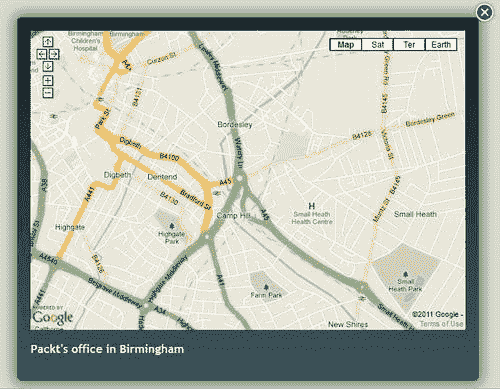
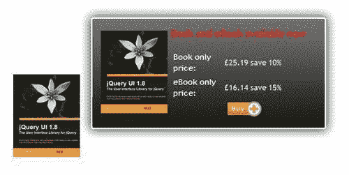
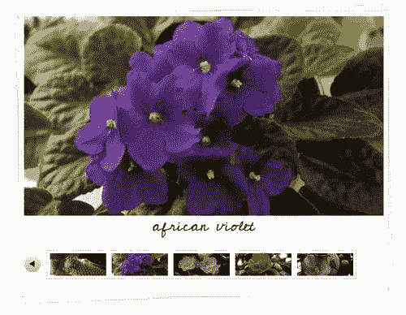
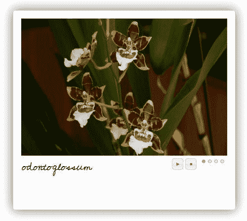

# 第二章：与您的 UI 工具相处

> "行动胜过言语……"

十六世纪作家米歇尔·德·蒙田经常被引用为发明了这个短语，作者认为这对于 jQuery Tools 来说非常恰当——毕竟，了解新工具的最佳方法就是尝试使用它们，对吗？

在上一章中，我们稍微了解了 jQuery Tools 的整体理念，并且强调了 JavaScript 代码的重要性不如工具的能力，通过更改 CSS 和改变所使用工具的一些配置选项来以多种不同的方式进行样式设置。

现在是时候详细了解这些工具中的一些了——本章（以及下一章）包含了使用各种工具展示的几个项目，并展示了通过使用 CSS 和最少的 JavaScript 可以实现的一些功能。

在本章中，我们将学习如何：

+   使用 Google 地图构建地图灯箱效果。

+   构建一个简单的图库，展示多张图片。

+   构建一个快速链接提示框，以允许购买一本书。

+   在类似拍立得的幻灯片中显示图像。

因此，就像有人曾经说过的那样……"我们还在等什么..?" 让我们开始吧……

### 注意

本章示例中列出的所有图像都包含在随书附带的代码下载中。

# UI 工具——一个模板

在我们详细查看示例之前，让我们先建立每个项目中将使用的基本框架。打开您喜爱的文本编辑器，然后复制以下代码：

```js
<!DOCTYPE html>
<html>
<head>
<title>jQuery Tools standalone demo</title>
<!-- include the Tools -->
<script src=
"http://ajax.googleapis.com/ajax/libs/jquery/1.6.4/jquery.min.js">
</script>
<script src=
"http://cdn.jquerytools.org/1.2.6/all/jquery.tools.min.js">
</script>
</head>
<body>
</body>
</html>

```

将此保存为模板——本书的演示示例使用了类似的格式，因此这将帮助您以后节省时间，当我们查看 jQuery Tools UI 库中提供的其他工具时。让我们从覆盖层开始。

# 什么是覆盖层？

覆盖层是 JavaScript 领域的重要部分——如果您想要引导访问者的注意力到您站点上的特定元素，那么这个工具将会非常有效。覆盖层可以用于显示几乎任何内容，例如不同样式的覆盖层用于显示产品，显示信息或警告框，或者显示复杂信息，所有这些都可以使用 jQuery Tools 的覆盖层来实现。

## 完美的眼睛糖果覆盖层

jQuery Tools 的覆盖层可以包含各种信息，例如视频、图像、地图等——所有内容都可以使用 CSS 进行样式设置。它具有各种功能，例如脚本框架、事件模型（在触发事件时执行操作）以及添加自定义效果。

## 用法

设置覆盖层的一般方式如下：

```js
// select one or more elements to be overlay triggers
$(".my_overlay_trigger").overlay({
// one configuration property
color: '#ccc',
// another property
top: 50
// ... the rest of the configuration properties
});

```

当您单击触发器之一时，它将打开由触发器的`rel`属性指定的覆盖层。

### 小贴士

值得一看的是[`flowplayer.org/tools/overlay/index.html`](http://flowplayer.org/tools/overlay/index.html)，其中详细介绍了覆盖层可用的所有可能配置选项。

让我们看看这在实践中是如何工作的——我们将构建一个简单的地图查看器，它使用 Google™ 地图和覆盖的“苹果”效果。

## 项目：构建 Google 地图的查看器

我们将利用这个概念开发一个灯箱效果，它使用 Google™ 地图，为一个客户提供他办公室位置的地图，但不想只在页面上显示一个简单的地图！

### 创建基本的 HTML 结构

此示例将使用 jQuery Tools 的覆盖工具，但使用的是“苹果”主题。示例中使用的所有图像都可以在附带本书的代码下载中找到。

还记得我们在本章开头设置的代码模板吗？现在复制一份并将其保存为您的覆盖项目文件，这样我们就可以添加覆盖演示的要点了。不过我们会对它做一个小小的改变——将`<body>`标签修改为如下内容：

```js
<body class="no-js">
...
</body>

```

这一点将随着我们演示的进行而变得更加清晰。

### 添加覆盖

接下来，让我们将覆盖触发器和覆盖的代码添加到`<body>`中：

```js
<!-- trigger elements -->
<a href="#link1" rel="#link1">Location of Packt's Office</a>
<!-- overlayed element -->
<div class="apple_overlay" id="link1">
<iframe width="675" height="480" frameborder="0" scrolling="no"
marginheight="0" marginwidth="0"
src="img/maps?q=B3+2PB&amp;hl=en&amp; sll=52.483277,-1.900152&amp;sspn=0.003679,0.009645&amp;vpsrc=0&amp; t=m&amp;ie=UTF8&amp;hq=&amp;hnear=Birmingham,+West+Midlands+B3+2PB, +United+Kingdom&amp;ll=52.484296,-1.90115&amp; spn=0.015681,0.025749&amp;z=14&amp;iwloc=A&amp;output=embed">
</iframe>
<p>Packt's office in Birmingham</p>
</div>

```

这遵循了所需的覆盖和触发器的正常结构，但增加了`<iframe>`标记，以处理外部内容。这里的触发器是`<a>`标记，当点击时，打开地图显示 Packt 办公室的位置，并在覆盖中显示它。

### 设置和配置覆盖的 JavaScript

添加的下一部分是非常重要的脚本——尽管调用覆盖功能的代码只有一行，但我们必须添加一块配置代码块，告诉它使用 expose 来隐藏页面内容，然后显示覆盖本身，并最终找到覆盖 HTML 中给定的 URL，并在屏幕上显示它。

在`</body>`标记之前，将以下代码添加到您的网页底部：

```js
<script>
$(function() {
$("a[rel][href!='']").overlay({
// some mask tweaks suitable for modal dialogs
mask: {
color: '#000',
loadSpeed: 200,
opacity: 0.8
},
effect: 'apple',
onBeforeLoad: function() {
var overlaid = this, overEl = this.getOverlay();
// grab wrapper element inside content
overEl.find(".contentWrap").load( this.getTrigger().attr("href"));
overEl.appendTo("body");
$(".close", this.getOverlay()).click(function(e){
overlaid.close();
});
}
});
});
</script>

```

### 添加样式和视觉效果

最后，我们需要添加一些样式，因为生成的页面看起来并不太漂亮！下面的代码对于显示覆盖是至关重要的，如果您想要不同颜色的覆盖，您可以随时更改使用的背景：

```js
<style>
/* body, a:active and : focus only needed for demo; these
can be removed for production use */
body { padding: 50px 80px; }
a:active { outline: none; }
:focus { -moz-outline-style: none; }
.apple_overlay {
/* initially overlay is hidden */
display: none;
/* growing background image */
background-image: url(white.png);
/* width after animation - height is auto-calculated */
width: 675px;
/* some padding to layout nested elements nicely */
padding: 25px;
margin: 20px;
}
/* default close button positioned on upper right corner */
.apple_overlay .close {
background-image: url(close.png);
position: absolute;
right: -10px;
top: -10px;
cursor: pointer;
height: 35px;
width: 35px;
}
#overlay {
height: 526px;
width: 675px;
}
div.contentWrap {
height: 526px;
width: 675px;
overflow: hidden;
}
a, body {
font-family: Arial, Tahoma, Times New Roman;
}
body.no-js a[rel] {
/* initially overlay is hidden if JavaScript is disabled */
display: none;
}
body.js .apple_overlay {
/* initially overlay is hidden if JavaScript is enabled */
display: none;
}
</style>

```

### 提示

值得注意的是，如果您想要更改背景，jQuery Tools 网站上有一些额外的背景可用于[`flowplayer.org/tools/overlay/index.html`](http://flowplayer.org/tools/overlay/index.html)，或者在附带本书的代码下载中。您也可以自己添加——查看一些网站上的演示，看看如何操作。

注意我们在原始 HTML 标记中使用了 `no-js`？其原因很简单：它保持了渐进增强，这意味着如果有人关闭了 JavaScript，覆盖仍然会隐藏，直到您点击触发链接为止！

现在覆盖将会起作用，您将看到类似于以下图像：



这只是对覆盖层所能做的事情的皮毛。您可以添加自定义效果，设置为模态对话框显示，甚至显示不同的图像作为您的“覆盖层”，这可能是较小图像的放大版本，比如一本书。

# 工具提示 - 您所需要的唯一的网络基础知识

无可争辩地，第二重要的 UI 小部件是工具提示，其功能与覆盖层类似，因为它可以用于突出显示屏幕上的元素相关的重要信息，例如如何填写表单的提示，购买某物的快速链接提示，或者突出显示有关网站上正在讨论的概念的信息（类似于书籍中的脚注）。jQuery Tools 的工具提示在操作上与其他工具提示没有什么不同，但其设计使其非常强大和灵活。让我们更详细地看一看。

## 使用

工具提示设置非常简单，基本版本使用以下结构：

```js
<!-- elements with tooltips -->
<div id="demo">


</div>

```

注意到工具提示的技巧是，您可以以两种方式之一生成它们，一种是使用`title`属性，另一种是在工具提示触发器之后直接包含工具提示块。

### 提示

最好通过使用`[title]`属性来显示普通文本的工具提示。如果需要显示更多内容，或包含 HTML 格式，则使用手动方法，使用单独的 CSS 样式类或 ID 选择器。

调用工具提示可以非常简单，只需使用选择器元素，通常是包含作为工具提示显示的文本的`[title]`属性：

```js
$("[title]").tooltip();

```

如果您需要显示 HTML 元素，那么可以使用手动格式，它可以包含任意数量的 HTML，但是会在触发器之后立即使用元素：

```js
$(".trigger").tooltip();

```

我们可以进一步添加一些附加选项 - 幻灯片和动态插件。

### 提示

仅使用`[title]`属性并不建议；这将导致性能受到影响，因为 jQuery Tools 需要遍历每个实例，以查看是否应将其转换为工具提示。强烈建议使用样式类或 ID 来改善性能。

## 用幻灯片效果和动态插件打动每个人

标准工具的工具提示将起到作用，但至少存在一个固有限制 - 如果浏览器窗口调整大小会发生什么？默认情况下，工具提示不允许这样做，除非您添加“动态”插件；动态插件将考虑视口的边缘在哪里，并相应地“动态”地定位工具提示。为了获得额外的功能，您还可以让工具提示从顶部、左边、右边或底部滑入，而不仅仅是以相同的方向出现（从底部到顶部）。有关如何设置此附加功能的更多详细信息都可以在网站上找到。

与此同时，让我们来看一个项目，这个项目在书店或出版商的网站上都不会显得格格不入，您可以使用“快速链接”来获取有关书籍的更多信息和价格，以及购买副本。

## 项目：使用工具提示构建一本书的“立即购买”

你知道怎么做，你浏览到一个网站，看到一本你想要的书。你不想深入多个页面，只是为了购买它，对吧？我也是这样想的——输入工具提示的“快速链接”。我们将在悬停在书籍上时弹出一个小提示，这样您就可以直接点击**购买**按钮。

### 提示

所有图片都可作为附带书籍的代码下载的一部分获得，或者直接从 jQuery Tools 网站获取。

### 设置基本 HTML

去获取我们在本章开头设置的 HTML 模板的副本，这样我们就可以复制基本的触发器和工具提示 HTML，以使其起作用：

```js
<!-- trigger element. a regular workable link -->
<a id="download_now"></a>
<!-- tooltip element -->
<div class="tooltip">

<p class="bookavail">Book and eBook available now</p>
<dl>
<dt class="label">Book only price:</dt>
<dt class="price">£25.19 save 10%</dt>
<dt class="label">eBook only price:</dt>
<dt class="price">£16.14 save 15%</dt>
<dt class="buynow"><a href="http:///store/purchase?id=12345">
</a>
</dt>
</dl>
</div>

```

值得注意的是，尽管代码没有连接到电子商务系统，但您可以轻松地进行调整：

```js
<tr>
<td></td>
<td><a href="http:///store/purchase?id=12345">
</a></td>
</tr>

```

### 添加工具提示 CSS 样式

现在，关键部分来了——样式。jQuery Tools 遵循最小 JavaScript 编码原则，更愿意让大部分工作由 CSS 完成。工具提示功能也不例外，因此让我们将其添加到`<head>`部分下面的代码中，以查看工具提示的效果：

```js
<style>
.tooltip { display: none; background: url(black_big.png);
height: 145px; padding: 35px 30px 10px 30px;
width: 310px; font-size: 11px; color: #fff; }
.tooltip img { float: left; margin: 0 5px 10px 0; }
.bookavail { margin-top: -5px; color: #f00; font-weight: bold;
font-size: 14px; }
dt.label { float: left; font-weight: bold; width: 100px; }
dt.price { margin-left: 210px; }
dt.buynow a img { margin-top: 10px; margin-left: 110px; }
</style>

```

### 注意

需要注意的是，`.tooltip`类提供了任何工具提示所需的基本 CSS；其余的 CSS 是针对此演示特定的。

#### 不过我们还需要一些样式..！

虽然上面的样式将产生一个可行的演示，但演示效果并不完美；我们需要添加额外的样式来微调一些元素的位置，并调整整体视图。将以下内容添加到您早期的样式表中：

```js
body { margin-top: 100px; margin-left: 200px; }
#booktip img { padding: 10px; opacity: 0.8;
filter: alpha(opacity=80); -moz-opacity: 0.8; }
.bookavail { margin-top: -5px; color: #f00; font-weight: bold;
font-size: 14px; }

```

### 配置工具提示

最后但同样重要的是，这是工具提示工作所需的 JavaScript 代码。这分为三个部分：

+   第一部分配置了屏幕上的工具提示外观

+   第二部分控制工具提示的淡入淡出

+   最后一部分调整了工具提示在屏幕上的位置，以适应当前浏览器窗口的尺寸（即，如果已调整大小或以全屏显示）

    ```js
    <script>
    $(document).ready(function() {
    $("#booktip").tooltip({
    effect: 'slide',
    position: 'top right',
    relative: true,
    // change trigger opacity slowly to 1.0
    onShow: function() {
    this.getTrigger().fadeTo("slow", 1.0);
    },
    // change trigger opacity slowly to 0.8
    onHide: function() {
    this.getTrigger().fadeTo("slow", 0.8);
    }
    }).dynamic({ bottom: { direction: 'down', bounce: true }});
    });
    </script>

    ```

对于一个简单的项目，效果可能非常显著——这是它应该看起来的样子：



当使用工具提示时，您可以尽情发挥效果——我曾见过一种效果是悬停在图像上时`div`滑出的效果；这可能看起来有点奇怪，但如果您仔细考虑，它与此处使用的效果相同。它仍然使用了来自 Tools 库的工具提示功能，唯一的区别（突显了 jQuery Tools 的真正威力）是使用的 CSS 样式！

# 对于其他一切——有可滚动的

如果您需要在您的网站上滚动信息，则需要查看 jQuery Tools 中提供的另一个组件：Scrollable。这个工具可以以许多不同的方式使用，例如视频库、产品目录和新闻滚动条——结构基本相同，但 jQuery Tools 的灵活性允许您使用 CSS 的强大功能来产生不同的设计。

## 用法

这是 Scrollable 的基本结构：

```js
<!-- "previous page" action -->
<a class="prev browse left">next</a>
<!-- root element for scrollable -->
<div class="scrollable">
<!-- root element for the items -->
<div class="items">
<!-- 1-3 -->
<div>


</div>
<!-- 4-6 -->
<div>


</div>
<!-- 7-9 -->
<div>


</div>
</div>
</div>
<!-- "next page" action -->
<a class="next browse right">previous</a>

```

你会发现结构由多个图像组成，这些图像被分组在一起，用一些`div`标签包裹，还有额外的`div`标签来管理导航元素。虽然演示仅显示每组三张图片，但如果需要，您可以轻松地向每个组添加更多图片。

为了真正展示这个是如何工作的，让我们看一个例子，这个例子在一个假设的客户网站上并不出格，比如一个摄影师的网站。

## 项目：构建一个迷你画廊

客户有一些需要在他的网站上显示的图片——他希望能够滚动浏览每组图像，然后单击其中一个以在放大的查看器中显示它。听起来很简单，对吧？

### 设置基本的 HTML

要开始，让我们组合基本的 HTML 结构。打开您喜欢的文本编辑器，并粘贴以下内容： 

```js
<html>
<head>
</head>
<body>
<div id="swapframe">
<div id="viewer">
<div class="loadingspin">

</div>
</div>
<div id="caption">x</div>
<div id="scrollablecontainer">
<a class="prev browse left"></a>
<div id="overscroll">
<div class="items">
<div class="item">
<div>
<a rel="odontoglossum"
href="images/odontoglossum.jpg">

</a>
</div>
<div>
<a rel="forest orchid"
href="images/forest%2520orchid.jpg">

</a>
</div>
<div>
<a rel="brassia" href="images/brassia.jpg">

</a>
</div>
<div>
<a rel="paphiopedilum"
href=" images/paphiopedilum.jpg">

</a>
</div>
<div>
<a rel="zygopetalum"
href=" images/zygopetalum.jpg">

</a>
</div>
</div>
<div class="item">
<div>
<a rel="cactus flower"
href=" images/cactus%2520flower.jpg">

</a>
</div>
<div>
<a rel="african violet"
href=" images/african%2520violet.jpg">

</a>
</div>
<div>
<a rel="pink camelia"
href=" images/pink%2520camelia.jpg ">

</a>
</div>
<div>
<a rel="red camelia"
href=" images/red%2520camelia.jpg ">

</a>
</div>
<div>
<a rel="white camelia"
href=" images/white%2520camelia.jpg ">

</a>
</div>
</div>
</div>
</div>
<a class="next browse right"></a>
</div>
</div>
</body>
</html>

```

在以前的例子中，我们使用了在本章开头创建的模板文件。这一次，我提供了整个示例，因为这里包含了一些额外的 HTML。我包括了一个加载动画的 GIF，以及一个图像说明的空间。

看起来很复杂，但实际上并不是——它遵循了上面显示的相同结构，但是在 HTML 代码中有一些额外的 DIV 包裹；这主要是为了让我们能够正确地在屏幕上定位结果，同时仍然保持每个元素在正确的位置。

### 时间展现一些 JavaScript 魔法

好的，现在我们已经有了结构，让我们加入 JavaScript 代码。将这两行复制到你的`<head>`区域：

```js
<script src=
"http://ajax.googleapis.com/ajax/libs/jquery/1.6.4/jquery.min.js">
</script>
<script src=
"http://cdn.jquerytools.org/1.2.6/all/jquery.tools.min.js">
</script>

```

这启动了对 jQuery 和 jQuery Tools 库的调用，因此您可以开始同时使用两者。这里是这个示例的关键部分，您可以将其复制粘贴到上面的代码下方：

```js
<script>
$(function(){
$.ajaxSetup({
cache: false,
dataType: "text html"
});
$(".loadingspin").bind('ajaxStart', function(){
$(this).show();
}).bind('ajaxComplete', function(){
$(this).hide();
});
$.fn.loadimage = function(src, f){
return this.each(function(){
$("").attr("src", src).appendTo(this).each(function(){
this.onload = f;
});
});
}
$(".item img:first").load(function(){
var firstpic = $(".item a:first").attr("rel");
$("#caption").text(firstpic);
$("#viewer").empty().loadimage("images/" + firstpic + ".jpg").hide().fadeIn('fast');
});
$(".item a").unbind('click.pic').bind('click.pic', function(e){
e.preventDefault();
var picindex = $(this).attr("rel");
$("#caption").text(picindex);
$("#viewer").empty().loadimage("images/" + picindex + ".jpg").hide().fadeIn('fast');
});
$("#overscroll").scrollable();
$("a.browse").click(function(){
$("#swapframe").load("ajax/" + state + ".html").hide().fadeIn('fast');
});
</script>

```

这段代码提供了画廊和可滚动效果，当您点击 Scrollable 中的缩略图时，它会加载每个图像。您甚至可以添加一个选项效果，当您悬停在图像上时会淡出图像：

```js
<script type="text/javascript">
$(function(){
$('.item').children().hover(function() {
$(this).siblings().stop().fadeTo(500,0.5);
}, function() {
$(this).siblings().stop().fadeTo(500,1);
});
});

```

### 时间展现一些样式

如果您尝试运行以前的代码，它会工作，但看起来很糟糕——会有缺失的图像，并且您无法通过 Scrollable 进行导航，例如。这就是 jQuery Tools 的真正力量发挥作用的地方，大部分真正的工作实际上是在 CSS 样式中完成的：

```js
<style>
#scrollablecontainer { position: relative; top: -30px;
height: 52px; }
/* prev, next, up and down buttons */
a.browse { background:url(hori_large.png) no-repeat;
display: block; float: left; width: 30px; height: 30px;
float: left; margin: 10px; cursor: pointer; font-size: 1px;
}
/* right */
a.right { background-position: 0 -30px; clear: right;
margin-right: 0px;}
a.right:hover { background-position: -30px -30px; }
a.right:active { background-position: -60px -30px; }
/* left */
a.left { margin-left: 0; }
a.left:hover { background-position: -30px 0; }
a.left:active { background-position: -60px 0; }
/* disabled navigational button */
a.disabled { visibility: hidden !important; }
#overscroll { position: relative; float: left; width:
550px; height: 50px; border: 1px solid #ccc;
overflow: hidden; }
.items { position: absolute; clear: both; width: 20000em; }
.item { float: left; width: 550px; }
.item div { float: left; width: 100px; height: 40px;
margin: 5px; background: #ccc; }
</style>

```

这些样式对于设置基本效果非常重要，例如提供导航按钮和可滚动容器。

#### 一些额外的样式

然而，它可能需要一些额外的调整才能真正脱颖而出。现在让我们添加进去：

```js
<link href=
'http://fonts.googleapis.com/css?family=Cedarville+Cursive'
rel='stylesheet' type='text/css'>
<style>
#swapframe { height: 540px; width: 640px;
padding: 25px 25px 0 20px; margin: 0 auto;
background: transparent url(slideshow-bg.gif)
no-repeat; background-size: 680px 540px;}
#viewer { height: 355px; background: #000; }
.loadingspin { float: center; margin-top: auto;
margin-bottom: auto; }
#caption { position: relative; top: -10px; width: 200px;
margin: 0 auto; color: #000; text-align: center;
font-size: 30px; font-family: 'Cedarville Cursive',
cursive; padding-bottom: 35px; }
</style>

```

该代码将转换图库为可用的内容；它甚至包括一个手写字体用于标题，这使用了 Google™ 字体。如果一切顺利，你应该看到像下面这样的东西：



这只是你可以使用滚动条做的一小部分。你可以进一步进行，甚至将滚动条与工具的其他元素结合起来，比如叠加层，这将展示出一个真正令人印象深刻的效果！

# Tabs in action

是时候来看看 jQuery Tools UI 工具部分的第四部分和最后一部分了 - 那就是标签。

标签可以被描述为互联网上最流行的用户界面之一。这是有道理的，因为它们易于使用并且在有限的空间内包含大量信息，然后您可以以更用户友好的方式对其进行组织。让我们稍微详细地看一下它们。

## 用法

标签的基本结构如下：

```js
<!-- the tabs -->
<ul class="tabs">
<li><a href="#">Tab 1</a></li>
<li><a href="#">Tab 2</a></li>
<li><a href="#">Tab 3</a></li>
</ul>
<!-- tab "panes" -->
<div class="panes">
<div>pane 1 content</div>
<div>pane 2 content</div>
<div>pane 3 content</div>
</div>

```

然后通过以下 JavaScript 调用来将它们激活为标签：

```js
$("ul.tabs").tabs("div.panes > div");

```

但是，等等；这不是 Scrollable 的基本代码吗？是的，有些相似之处。但是不，这绝对是标签的代码！这两个工具之间存在一些相似之处，但重要的是要注意它们不能互换使用。

话虽如此，现在是时候开始构建我们的下一个项目了。

## 项目：构建一个滚动幻灯片

我们将使用 Tab's Slideshow 插件的强大功能，构建一个可以在照片库网站上使用的演示文稿。它是一个样式为极化的幻灯片，但带有一些额外的功能。它将使用与 Scrollable 类似的图像，但采用不同的格式 - 这种格式可以很容易地放在大多数网站上。一些知名的互联网公司使用了类似的效果。

### 设置基本的 HTML

首先，让我们打开文本编辑器。从本章开头处复制模板代码，并添加以下行以创建 HTML 基础：

```js
<div id="caption"></div>
<!-- container for the slides -->
<div class="images">
<div>

</div>
<div>

</div>
<div>

</div>
<div>

</div>
</div>
<div id="galprevnext">
<div class="galleft">
<a class="galprevpic hideit"></a>
</div>
<div class="galright">
<a class="galnextpic hideit"></a>
</div>
</div>
<!-- the tabs -->
<div class="slidetabs">
<a href="#">1</a>
<a href="#">2</a>
<a href="#">3</a>
<a href="#">4</a>
</div>
<div id="playcontrols">


</div>

```

这可以分为五个不同的部分，即标题、图片容器、画廊控制、选项卡和最后的播放器控制。

### 添加视觉效果

下一部分是非常重要的样式 - 这分为两个部分，首先是极化效果和幻灯片的必需代码：

```js
<link href=
'http://fonts.googleapis.com/css?family=Cedarville+Cursive'
rel='stylesheet' type='text/css'>
<style type="text/css">
body { padding-left:400px; padding-top: 50px; }
/* container for slides */
.images { border: 1px solid #ccc; position: relative;
height: 450px; width: 502px; float: left; margin: 15px;
cursor: pointer;
/* CSS3 tweaks for modern browsers */
-moz-border-radius: 5px;
-webkit-border-radius: 5px;
border-radius: 5px;
-moz-box-shadow: 0 0 25px #666;
-webkit-box-shadow: 0 0 25px #666;
box-shadow: 0 0 25px #666; }
/* single slide */
.images div { display: none; position: absolute; top: 0; left: 0;
margin: 3px; padding: 15px 30px 15px 15px;
height: 256px; font-size: 12px; }
/* tabs (those little circles below slides) */
.slidetabs { position: absolute; margin: 350px 600px 0 440px;
width: 100px; }
/* single tab */
.slidetabs a { width: 8px; height: 8px; float: left; margin: 3px;
background: url(navigator.png) 0 0 no-repeat;
display: block; font-size: 1px; color: #fff; }
/* mouseover state */
.slidetabs a:hover { background-position: 0 -8px; }
/* active state (current page state) */
.slidetabs a.current { background-position: 0 -16px; }
/* prev and next buttons */
.forward, .backward { float: left; margin-top: 120px;
background: #fff url(nav.png) no-repeat;
width: 35px; height: 35px;
cursor: pointer; z-index: 2; }
/* next */
.forward { background-position: -36px 0px ; }
.forward:hover,
.forward:active { background-position: -36px -36px; }
/* prev */
.backward:hover,
.backward:active { background-position: 0 -36px; }
/* disabled navigational button. is not needed when tabs
are configured with rotate: true */
.disabled { visibility: hidden !important; }
#caption { color: black; margin-left: 35px; margin-top: 345px;
position: absolute; width: 200px;
font-family: 'Cedarville Cursive', cursive;
font-size: 26px; }
.slides { border-width: 0; height:310px; width:466px; }
</style>

```

哇，那里有很多样式代码！其中大部分与幻灯片的定位有关，以及提供导航按钮和标题。

### 注意

您将在这里看到 CSS 样式的真正威力，因为极化效果完全是使用 CSS3 代码生成的；正因为如此，它在旧版浏览器中看起来不会那么壮观。但是 jQuery Tools 是关于使用 HTML5（和 CSS3），而不是旧版浏览器。如果需要，您仍然可以通过为合适的背景图像添加适当的样式来解决这个问题。

#### "嗯...我想要更多！"

当我开始为这本书写项目时，我并不完全满意——我想要更多。经过一些重新排列和调整，最终在 jQuery Tools 的另一位用户 Mudimo 的帮助下，我成功地额外添加了一些内容，基于他的一些优秀演示。

第一部分是添加一些按钮来控制幻灯片放映，这些按钮替换了可以添加的标准按钮，这些按钮可以从 jQuery Tools 站点上获得。将以下内容添加为额外的样式：

```js
<style>
#galprevnext { position: absolute; width: 640px; height: 539px; }
.galleftpic, .galrightpic { width: 270px; height: 539px;
cursor: pointer; }
.galleftpic { float: left; }
.galrightpic { float: right; }
.galprevpic, .galnextpic { display: block; position: absolute;
top: 140px; width: 30px; height: 30px;
margin: 0 10px; }
.galprevpic { float: left; background: url(prevnext.png) 0 0
no-repeat; margin-left: 9px; }
.galnextpic { float: right; background: url(prevnext.png)
-30px 0 no-repeat; margin-left: 100px; }
.hideit { visibility: hidden; cursor: arrow; }
.showit { visibility: visible; cursor: pointer; }
#galprevnext a { text-decoration: none; }
#galprevnext a:hover { color: #f00; }
#galprevnext a.current { color: #00f; }
#galprevnext .disabled { visibility: hidden; }
.galleft, .galright { height: 310px; margin-top: 35px;
position: absolute; width: 150px; }
.galleft { margin-left: 35px; }
.galright { margin-left: 360px; }
#playcontrols { clear: both; margin-left: 375px;
margin-top: 350px; padding-right: 40px;
position: absolute; }
</style>

```

您会注意到，这在可能的情况下尽量遵循将图像抽象出主要代码的标准，这是 jQuery Tools 的主要原则之一。他代码的第二部分是添加一点额外的 jQuery，它根据鼠标悬停在按钮上的情况将 CSS 样式从`hideit`更改为`showit`，然后再次更改回来（这两种样式控制按钮的可见性）。作为最后的调整，我们通过用样式化图标替换原始按钮并使用一点 CSS 将其放置在图片下方的导航器“点”旁边来添加一些额外的样式到播放器控件。

### 配置选项卡效果

我们进入代码的最后部分，即添加使所有这些都起作用所需的 JavaScript。将其添加到页面底部：

```js
$(function() {
$(".slidetabs").tabs(".images > div", {
// enable "cross-fading" effect
effect: 'fade',
fadeOutSpeed: "slow",
// start from the beginning after the last tab
rotate: true,
// here is a callback function that is called before the
// tab is clicked
onClick: function(event, tabIndex) {
var str = $("img").eq(tabIndex).attr("rel");
$("#caption").html(str);
}
// use the slideshow plugin, which has its own config
})
.slideshow({
prev: ".galleft",
next: ".galright"
});
});

```

这是代码的至关重要的部分——它配置选项卡效果以使用幻灯片插件，并从代码中提取`rel`标签中的文本，该文本用作标题。请注意，由于下一个和上一个按钮使用非默认 CSS 类名称，因此需要在幻灯片插件的配置选项中设置这些类名称，以便它知道如何正确运作。

#### 设置按钮可见性

还记得我之前决定添加的两个额外按钮吗？代码的接下来两个部分实现了两个目标；第一个控制了这两个按钮的可见性，第二个允许您停止和开始幻灯片放映。

如果我们看一下第一部分，它控制着可见性——jQuery 将样式从`hideit`更改为`showit`，从而在悬停在任何一个按钮上时，将可见性从隐藏更改为可见，然后再次改回隐藏：

```js
$(".galleft").mouseover(function(){
$(".galprevpic").removeClass('hideit').addClass('showit');
}).mouseout(function(){
$(".galprevpic").removeClass('showit').addClass('hideit');
});
$(".galright").mouseover(function(){
$(".galnextpic").removeClass('hideit').addClass('showit');
}).mouseout(function(){
$(".galnextpic").removeClass('showit').addClass('hideit');
});

```

然后，我们需要能够控制幻灯片放映的播放。我们可以通过为两个图像按钮添加事件处理程序来实现，如下所示：

```js
$("#playbutton").click(function(){
$(".slidetabs").data("slideshow").play();
});
$("#stopbutton").click(function(){
$(".slidetabs").data("slideshow").stop();
});

```

至此，如果一切顺利，您应该会看到类似以下截图的内容。jQuery Tools 中可用的工具都是无限可定制的，这个演示只是我们在这本书的框架内可能实现的小例子之一：



# 总结

在本章中，我们看了一些使用 jQuery Tools 的主要组件（即 Scrollable、Overlay、Tooltips 和 Tabs）的示例。所有这些组件都可以无限定制，本章讨论的示例概述了如何使用 CSS 对每个工具的基本功能进行最小化，同时每个工具的总体架构允许根据需要进行大量定制，希望这为你的项目提供了一些灵感。

现在我们已经了解了四种主要工具，是时候把注意力转向作为工具库一部分的第二组工具了，即验证器（Validator）、日期输入（DateInput）和范围输入（RangeInput），它们将成为下一章的主题。
